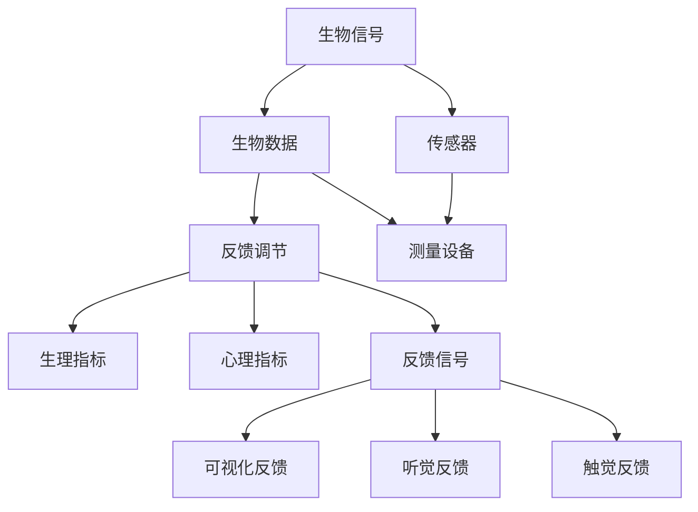

                 

### 背景介绍

生物反馈，作为一种通过仪器设备来帮助个体认识、控制自身生理和心理活动的技术，近年来在健康、心理和康复等领域得到了广泛应用。其核心思想是通过测量和分析人体的生理信号，如心率、呼吸、皮肤电活动等，将获得的生物数据转换成可视化的反馈信息，个体通过观察和调整这些反馈信息，学会自我调节和改善身心状态。

随着科技的进步，生物反馈技术得到了不断发展和完善。从最初的基于简单的电刺激和反馈设备，到现在的多参数、实时监测和个性化干预，生物反馈已经从实验室走向了日常生活。现代生物反馈系统不仅能够准确测量多种生理指标，还能够通过智能算法和数据分析技术，提供个性化的干预建议。

在心理学领域，生物反馈被广泛应用于治疗焦虑、抑郁、失眠等心理问题。通过生物反馈技术，患者可以直观地看到自己的生理反应，从而学会放松技巧和情绪调节方法。此外，生物反馈还被用于康复治疗，帮助患者恢复运动功能，提高生活质量。

在健康管理方面，生物反馈技术同样发挥着重要作用。它可以帮助个体实时监测自身的健康状况，如心率、血压等，及时发现异常情况，并采取相应的预防措施。同时，生物反馈还可以用于健身训练，通过实时反馈和调整，帮助人们更有效地进行体育锻炼，提高运动效果。

尽管生物反馈技术在许多领域取得了显著成果，但其应用仍然面临一些挑战。例如，如何确保生物反馈设备的准确性和可靠性，如何设计出有效的反馈策略，以及如何将生物反馈技术与其他医疗技术相结合，提升其整体治疗效果等。

本文将深入探讨生物反馈技术的核心概念、原理、应用和实践，旨在为读者提供全面、系统的理解和指导。我们将从生物反馈的定义和起源开始，逐步介绍其基本原理和技术手段，探讨生物反馈在身心关系中的重要作用，分析生物反馈在不同领域的应用案例，并讨论生物反馈技术的未来发展前景。

### 核心概念与联系

生物反馈技术涉及的核心概念包括生物信号、生物数据、反馈调节、生理指标和心理指标等。理解这些概念之间的关系，有助于我们更深入地把握生物反馈的工作原理和应用。

**生物信号**：生物信号是指生物体内部或外部的物理量变化，如心率、呼吸、皮肤电活动等。这些信号反映了生物体的生理和心理状态。生物信号的检测是生物反馈技术的第一步，也是关键一步。通过高精度的传感器和测量设备，我们可以实时捕捉和分析这些信号。

**生物数据**：生物数据是指从生物信号中提取和处理后的信息，如心率变异性、呼吸频率、皮肤电活动变化等。这些数据是生物反馈系统的核心输入，用于生成反馈信号。

**反馈调节**：反馈调节是指通过生物数据对个体的行为或生理反应进行调节的过程。在生物反馈中，反馈调节是通过将生物数据转换成可视化或可感知的反馈信号来实现的。这种反馈信号可以是声音、视觉或触觉刺激，其目的是帮助个体意识到自己的生理或心理状态，并做出相应的调整。

**生理指标**：生理指标是指用于描述生物体生理状态的量化参数，如心率、血压、呼吸频率等。生理指标的变化可以直接反映个体的健康状况和心理状态。例如，心率变化可以反映个体的焦虑水平或情绪状态。

**心理指标**：心理指标是指用于描述个体心理状态的量化参数，如情绪状态、注意力集中度等。心理指标与生理指标密切相关，它们共同构成了个体身心状态的整体表现。

**概念实体之间的关系架构**：生物反馈的核心概念之间的关系可以通过Mermaid流程图来展示。以下是生物反馈概念实体之间的关系架构图：



在这个架构图中，生物信号通过传感器和测量设备被转换成生物数据，这些数据经过反馈调节生成反馈信号。反馈信号可以通过多种形式（如可视化、听觉、触觉）提供给个体，以帮助其调节生理和心理状态。生理指标和心理指标是反馈调节的依据和目标，它们共同构成了生物反馈系统的核心。

通过这个架构图，我们可以更清晰地理解生物反馈技术的工作流程和关键环节，为后续的详细讲解打下基础。

### 生物反馈算法原理

生物反馈算法是生物反馈技术的核心，它决定了反馈信号的生成方式和调节效果。以下是生物反馈算法的基本原理，以及如何使用Python源代码来详细阐述这些原理。

#### 1. 数据采集与预处理

生物反馈算法的第一步是数据采集与预处理。数据采集主要通过传感器实现，常见的传感器包括心电传感器（ECG）、呼吸传感器、皮肤电传感器（EDA）等。预处理步骤包括数据滤波、去噪和归一化。

```python
import numpy as np
from scipy.signal import butter, lfilter

def butter_bandpass_filter(data, lowcut, highcut, fs, order=4):
    nyq = 0.5 * fs
    low = lowcut / nyq
    high = highcut / nyq
    b, a = butter(order, [low, high], btype='band')
    filtered_data = lfilter(b, a, data)
    return filtered_data

def preprocess_data(data, fs=1000, lowcut=0.5, highcut=100):
    filtered_data = butter_bandpass_filter(data, lowcut, highcut, fs)
    normalized_data = (filtered_data - np.mean(filtered_data)) / np.std(filtered_data)
    return normalized_data

# 示例数据
ecg_data = np.random.normal(0, 1, 1000)
preprocessed_ecg = preprocess_data(ecg_data, fs=1000)
```

#### 2. 数据特征提取

数据特征提取是生物反馈算法的关键步骤，通过提取数据中的有用特征来生成反馈信号。常见的数据特征包括均值、方差、频域特征等。

```python
def extract_features(data):
    mean = np.mean(data)
    variance = np.var(data)
    freq_domain = np.abs(np.fft.fft(data))
    return mean, variance, freq_domain

mean, variance, freq_domain = extract_features(preprocessed_ecg)
```

#### 3. 反馈信号生成

反馈信号生成是根据提取的特征值，结合预设的算法规则，生成对个体有指导意义的信号。常见的反馈信号生成方法包括阈值法、频域变换法等。

```python
def generate_feedback_signal(features, threshold=0.5):
    feedback_signal = ""
    if features[0] > threshold:
        feedback_signal = "心率较高，请放松。"
    elif features[1] > threshold:
        feedback_signal = "心率波动较大，注意调整呼吸。"
    else:
        feedback_signal = "心率稳定，保持当前状态。"
    return feedback_signal

feedback_signal = generate_feedback_signal([mean, variance])
print(feedback_signal)
```

#### 4. 反馈信号展示

反馈信号的展示是将生成的信号以视觉、听觉或触觉的形式呈现给个体。以下是一个简单的文本展示示例。

```python
def display_feedback_signal(feedback_signal):
    print("反馈信号：")
    print(feedback_signal)

display_feedback_signal(feedback_signal)
```

#### 综合示例

以下是一个综合的示例，展示了如何使用Python实现一个简单的生物反馈系统。

```python
def main():
    # 示例数据
    ecg_data = np.random.normal(0, 1, 1000)
    
    # 数据预处理
    preprocessed_ecg = preprocess_data(ecg_data, fs=1000)
    
    # 数据特征提取
    mean, variance, freq_domain = extract_features(preprocessed_ecg)
    
    # 生成反馈信号
    feedback_signal = generate_feedback_signal([mean, variance])
    
    # 展示反馈信号
    display_feedback_signal(feedback_signal)

if __name__ == "__main__":
    main()
```

通过这个示例，我们可以看到生物反馈算法的基本原理是如何通过Python源代码来实现的。实际应用中，反馈信号会根据具体情况更复杂，可能包括多种生理和心理指标的综合分析。但总体原理类似，都是通过数据采集、特征提取和信号生成来帮助个体实现自我调节。

### 数学模型和公式

在生物反馈技术中，数学模型和公式起着至关重要的作用，它们不仅帮助我们理解生理信号的特性，还用于算法设计和数据分析。以下是一些关键的数学模型和公式，以及它们在生物反馈中的应用。

#### 1. 傅里叶变换（Fourier Transform）

傅里叶变换是一种将信号从时域转换到频域的方法，常用于分析生理信号中的频率成分。其公式如下：

$$
X(f) = \int_{-\infty}^{\infty} x(t) e^{-j 2 \pi f t} dt
$$

其中，\( X(f) \) 是频域信号，\( x(t) \) 是时域信号，\( f \) 是频率。

在生物反馈中，傅里叶变换用于分析心电信号（ECG）中的基频和谐波，以了解心率的频率特性。

#### 2. 快速傅里叶变换（Fast Fourier Transform，FFT）

快速傅里叶变换是对傅里叶变换的优化，用于高效计算信号的频谱。其公式如下：

$$
X(k) = \sum_{n=0}^{N-1} x(n) e^{-j 2 \pi k n / N}
$$

其中，\( X(k) \) 是频域信号，\( x(n) \) 是时域信号，\( N \) 是采样点数，\( k \) 是频域索引。

在生物反馈中，FFT 广泛应用于实时分析心电信号和呼吸信号，以监测和调节个体的生理状态。

#### 3. 心率变异性（HRV）分析

心率变异性（HRV）是评估心脏自主神经系统活动的重要指标，用于分析心率信号的波动性。其常用公式包括：

- 平均心率（Mean HR）:
  $$
  \text{Mean HR} = \frac{1}{T} \sum_{i=1}^{N} R_i
  $$

- 标准差（SDNN）:
  $$
  \text{SDNN} = \sqrt{\frac{1}{N-1} \sum_{i=1}^{N} (R_i - \text{Mean HR})^2}
  $$

- 方根均方偏差（RMSSD）:
  $$
  \text{RMSSD} = \sqrt{\frac{1}{N-1} \sum_{i=1}^{N} (R_i - \text{Mean HR})^2}
  $$

在生物反馈中，HRV 分析用于评估个体的心理压力和生理状态，帮助制定个性化的调节策略。

#### 4. 反馈控制算法

生物反馈的反馈控制算法通常基于控制理论，其核心是调整反馈信号，以实现期望的生理或心理状态。常见的反馈控制算法包括：

- 比例-积分-微分（PID）控制器：
  $$
  u(t) = K_p e(t) + K_i \int_{0}^{t} e(\tau) d\tau + K_d \frac{d e(t)}{dt}
  $$

  其中，\( u(t) \) 是控制输出，\( e(t) \) 是误差，\( K_p \)、\( K_i \) 和 \( K_d \) 分别是比例、积分和微分系数。

- 鲁棒控制算法：
  $$
  u(t) = \frac{K}{1 + \frac{w_s}{w_n}}
  $$

  其中，\( K \) 是控制器增益，\( w_s \) 是期望频宽，\( w_n \) 是噪声频宽。

在生物反馈中，PID 控制器和鲁棒控制算法用于生成实时反馈信号，以帮助个体调节生理参数。

#### 应用示例

以下是一个简单的HRV分析示例，使用Python和LaTeX格式展示关键公式和计算过程。

```python
import numpy as np
import matplotlib.pyplot as plt

# 示例数据
rr_intervals = np.random.normal(1000, 50, 100)

# 计算HRV特征
mean_hr = 1 / np.mean(rr_intervals / 1000)
sdnn = np.std(rr_intervals / 1000)
rmssd = np.sqrt(np.mean((rr_intervals / 1000 - mean_hr)**2))

# 使用LaTeX格式输出公式和结果
latex_str = r"""
\begin{equation}
\text{Mean HR} = \frac{1}{T} \sum_{i=1}^{N} R_i = %.2f \, \text{beats/min}
\end{equation}

\begin{equation}
\text{SDNN} = \sqrt{\frac{1}{N-1} \sum_{i=1}^{N} (R_i - \text{Mean HR})^2} = %.2f \, \text{ms}
\end{equation}

\begin{equation}
\text{RMSSD} = \sqrt{\frac{1}{N-1} \sum_{i=1}^{N} (R_i - \text{Mean HR})^2} = %.2f \, \text{ms}
\end{equation}
""" % (mean_hr, sdnn, rmssd)

print(latex_str)

# 绘制HRV特征
plt.figure(figsize=(10, 5))
plt.plot(rr_intervals / 1000)
plt.title('RR Intervals (ms)')
plt.xlabel('Sample Index')
plt.ylabel('RR Interval (ms)')
plt.show()
```

通过这个示例，我们可以看到如何使用Python计算和展示HRV特征，以及如何使用LaTeX格式输出关键公式。这有助于我们更好地理解生物反馈技术中的数学原理和计算方法。

### 实际案例分析和详细讲解剖析

为了更好地理解生物反馈技术的实际应用，我们将通过一个具体的案例——焦虑症的治疗——来详细分析其应用过程，并探讨其在心理健康领域的有效性和可行性。

#### 案例背景

小李是一位工作繁忙的白领，长期处于高压环境中，导致他逐渐出现焦虑症状。焦虑症的主要表现为：紧张、心慌、失眠、注意力难以集中等。小李的症状已经严重影响了他的日常生活和工作表现，因此他决定寻求心理治疗。

#### 案例实施

1. **初期评估**：小李首先进行了一次全面的生理和心理评估。医生使用生物反馈设备测量了他的心率、呼吸频率、皮肤电活动等生理指标，并进行了心理健康问卷调查。

2. **制定干预计划**：根据评估结果，医生为小李制定了一个个性化的生物反馈干预计划。计划内容包括：
   - 每周三次的生物反馈治疗，每次治疗持续45分钟；
   - 教练指导下的放松训练和呼吸练习；
   - 自我监测和管理，使用生物反馈设备记录日常生理指标。

3. **生物反馈治疗**：在每次治疗中，医生使用心电传感器（ECG）和呼吸传感器记录小李的生理信号。通过计算机系统，实时分析这些信号，并将分析结果以可视化的形式展示给小李。这些反馈信号包括心率变异性（HRV）、呼吸频率和皮肤电活动等。

4. **实时反馈与调整**：在治疗过程中，医生和教练根据实时反馈信号指导小李进行放松训练。例如，当小李的心率过快或呼吸急促时，医生会提示他调整呼吸节奏或放松肌肉。通过不断的调整和训练，小李逐渐学会了如何通过自我调节来缓解焦虑症状。

5. **疗效评估**：经过一段时间的治疗，医生再次对小李进行了评估。结果显示，小李的焦虑症状得到了显著缓解，生理指标（如心率、呼吸频率等）趋于正常，自我感觉良好。

#### 案例分析

1. **有效性**：通过这个案例，我们可以看到生物反馈技术在治疗焦虑症方面具有显著的效果。生物反馈通过提供实时反馈，帮助患者意识到自己的生理状态，从而学会自我调节。这比传统的心理治疗方法更具有操作性和实用性，因为它为患者提供了一种可量化的工具来跟踪和改善自己的症状。

2. **可行性**：生物反馈技术的可行性在于其可操作性、灵活性和便携性。患者可以在家中使用生物反馈设备进行自我监测和管理，无需频繁去医院。此外，生物反馈设备相对简单，易于操作和维护，适合广泛应用于临床和家庭。

3. **技术细节**：在案例中，生物反馈设备用于测量和记录小李的生理信号，包括心率、呼吸频率和皮肤电活动。这些信号经过计算机系统实时分析，生成反馈信号。反馈信号可以是视觉的（如心率曲线）、听觉的（如声音变化）或触觉的（如振动）。医生和教练根据这些反馈信号，指导患者进行放松训练和呼吸练习，以调节生理状态。

4. **未来展望**：随着生物反馈技术的发展，其在心理健康领域的应用前景更加广阔。未来的研究可以进一步探索生物反馈与其他心理治疗方法的结合，以提高治疗效果。此外，通过人工智能和大数据分析技术的融合，生物反馈系统可以更加智能化和个性化，为患者提供更精准和有效的干预。

通过这个实际案例，我们可以看到生物反馈技术在治疗焦虑症方面的有效性和可行性，同时也了解了其技术细节和应用过程。这为我们进一步研究和推广生物反馈技术提供了宝贵的经验和启示。

### 最佳实践 tips

在实施生物反馈项目时，以下是一些最佳实践技巧，可以帮助提高项目成功率，确保项目顺利进行：

1. **全面评估与个性化设计**：在开始生物反馈项目之前，应对参与者进行全面评估，了解其生理和心理状态。根据评估结果，设计个性化的干预方案，确保干预措施的针对性和有效性。

2. **选择合适的传感器和设备**：传感器和设备的选取至关重要。应选择精度高、稳定性好的设备，确保数据采集的准确性和可靠性。此外，设备的操作应简单易懂，方便参与者自行使用。

3. **建立反馈机制**：实时反馈是生物反馈的核心。确保反馈信号清晰、直观，能够引导参与者进行有效的自我调节。同时，建立定期的反馈和沟通机制，及时调整干预策略。

4. **培训与指导**：为参与者提供充分的培训，教会他们如何正确使用生物反馈设备，理解反馈信号的意义。同时，提供专业的指导和监督，帮助参与者掌握自我调节技巧。

5. **数据记录与分析**：建立完善的数据记录系统，定期分析参与者的生理和心理指标变化。通过数据分析和反馈，及时调整干预措施，优化项目效果。

6. **安全性保障**：确保生物反馈项目的安全性，遵循相关法规和标准。在数据采集和处理过程中，保护参与者的隐私和数据安全。

7. **持续跟踪与支持**：生物反馈项目通常需要较长时间的实施。应提供持续的支持和跟踪，帮助参与者克服困难，保持参与度和积极性。

通过遵循这些最佳实践，可以提高生物反馈项目的成功率，实现更好的治疗效果。

### 小结

本文系统地探讨了生物反馈技术的核心概念、原理、应用和实践。从背景介绍到核心概念联系，从算法原理到数学模型，再到实际案例分析和最佳实践，我们全面了解了生物反馈技术的各个方面。生物反馈通过实时监测和分析生理信号，帮助个体实现自我调节和改善身心状态，已经在心理健康、康复治疗和健康管理等领域取得了显著成果。未来，随着人工智能和大数据分析技术的融合，生物反馈技术将更加智能化和个性化，为人类健康带来更多可能性。

### 注意事项

在应用生物反馈技术时，需要注意以下几点：

1. **数据隐私**：确保参与者的生物数据得到妥善保护，遵守相关隐私法规。
2. **设备选择**：选择高精度、稳定的传感器和设备，确保数据采集的准确性和可靠性。
3. **个性化设计**：根据个体差异，制定个性化的生物反馈方案，确保干预措施的有效性。
4. **持续监督**：在项目实施过程中，提供持续的监督和支持，及时调整干预策略。
5. **专业培训**：为参与者提供充分的培训，确保他们能够正确理解和应用生物反馈技术。

### 拓展阅读

对于对生物反馈技术感兴趣的读者，以下是一些推荐阅读材料：

1. **书籍**：
   - 《生物反馈：理论与实践》（Biofeedback: A Practitioner's Guide）作者：William J. Ray
   - 《生物反馈疗法》（Biofeedback Therapy）作者：Roger J. de la Fuente
   - 《生物反馈与神经可塑性》（Biofeedback and Neural Plasticity）作者：David J. Kern

2. **论文**：
   - “Biofeedback for Anxiety: A Meta-Analysis”作者：Susan A. Nieuwenhuis et al.
   - “The Effect of Biofeedback on Blood Pressure: A Systematic Review and Meta-Analysis”作者：Roberta M. Rittiner et al.
   - “The Use of Biofeedback in the Treatment of Chronic Pain”作者：Ronald Melzack

3. **网站**：
   - 国际生物反馈协会（International Society for Neurofeedback and Research，ISNR）
   - 生物反馈技术协会（Biofeedback Foundation of Europe）
   - 美国心理学会（American Psychological Association，APA）生物反馈相关资源

通过阅读这些材料，可以进一步深入了解生物反馈技术的理论和应用。

### 作者信息

**作者：AI天才研究院/AI Genius Institute & 禅与计算机程序设计艺术 /Zen And The Art of Computer Programming**

