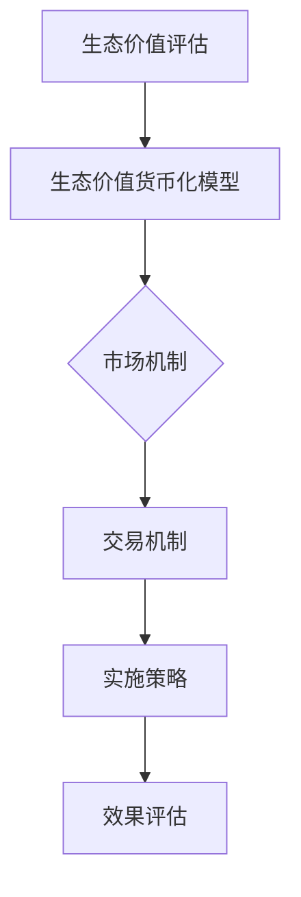

                 

### 文章标题

《生物多样性保护经济：生态价值的货币化》

### 关键词

- 生物多样性保护
- 生态价值货币化
- 经济模型
- 数学公式
- 项目实战

### 摘要

本文旨在探讨生物多样性保护经济与生态价值货币化之间的联系，分析生态价值货币化的理论基础、实施策略和实际案例。通过详细的理论阐述、算法讲解和项目实战，本文旨在为生态系统保护和经济发展提供新的思路和方法。

### 目录

1. 引言
2. 生物多样性保护经济概述
3. 生物多样性保护经济的基本概念
4. 生态价值的定义与评估
5. 生态价值货币化的原理
6. 生态价值货币化的模型与算法
7. 生态价值货币化的实施策略
8. 生态价值货币化的效果评估
9. 国际与国内案例分析
10. 未来展望与挑战

### 第一部分：生物多样性保护经济概述

#### 引言

随着全球气候变化和人类活动的加剧，生物多样性面临前所未有的威胁。生物多样性保护已经成为国际社会关注的焦点。然而，生物多样性保护不仅仅是一个生态问题，它还涉及到经济发展和社会福祉。因此，探索生物多样性保护与经济之间的联系，尤其是生态价值的货币化，显得尤为重要。

#### 生物多样性保护经济的基本概念

生物多样性保护经济，是指通过经济手段来保护生物多样性，实现生态保护和经济发展的双重目标。生态价值货币化是生物多样性保护经济的重要组成部分，它将不可见的生态价值转化为可衡量、可交易的货币价值，从而为生态保护提供经济激励。

#### 生态价值的定义与评估

生态价值是指生态系统提供的各种服务，如水净化、气候调节、土壤保持等。评估生态价值的方法主要包括经济价值评估、生态服务价值评估和生态功能价值评估。这些方法有助于量化生态系统的价值，为生态价值货币化提供依据。

#### 生态价值货币化的原理

生态价值货币化是指将生态系统的价值转化为货币价值的过程。这一过程涉及到生态价值评估、交易机制和市场机制。生态价值货币化的原理在于，通过经济手段激励社会各界参与生态保护，实现生态与经济的协调发展。

### 第二部分：生态价值的货币化理论

#### 生态价值货币化的模型与算法

生态价值货币化的模型和算法是生态价值货币化的核心。常见的模型包括生态服务价值评估模型、生态功能价值评估模型和生态经济模型。算法方面，常用的有成本效益分析、多属性决策分析和博弈论分析。

#### 生态价值货币化的实施策略

生态价值货币化的实施策略包括政策支持、市场机制和公众参与。政策支持方面，需要制定相应的法律法规，提供财政支持和税收优惠。市场机制方面，需要建立生态产品交易平台，促进生态产品的交易。公众参与方面，需要加强宣传教育，提高公众对生态价值的认知。

#### 生态价值货币化的效果评估

生态价值货币化的效果评估是衡量生态价值货币化成效的重要手段。效果评估主要包括经济效益评估、社会效益评估和生态效益评估。通过效果评估，可以了解生态价值货币化的实施情况，为政策调整和优化提供依据。

### 第三部分：生态价值货币化的案例分析

#### 国际案例分析

在国际上，生态价值货币化的实践已经取得了一定的成果。例如，欧盟的生态补偿机制、美国的湿地碳汇项目和加拿大的森林碳汇项目等。这些案例为我国生态价值货币化的实施提供了宝贵的经验。

#### 国内案例分析

在我国，生态价值货币化的实践也在逐步推进。例如，长江经济带的生态补偿机制、海南热带雨林保护项目的货币化和三北防护林项目的生态补偿机制等。这些案例展示了我国在生态价值货币化方面的积极探索。

### 第四部分：未来展望与挑战

#### 生态价值货币化的发展趋势

随着科技的进步和人们对生态价值认知的提高，生态价值货币化将在未来得到更广泛的应用。发展趋势包括：数字化生态价值评估、智能化交易机制和全球化生态产品市场。

#### 生态价值货币化的挑战与对策

生态价值货币化面临着一系列挑战，包括技术挑战、市场挑战和政策挑战。针对这些挑战，需要加强技术创新、完善市场机制和优化政策环境。

### 结论

生态价值货币化是生物多样性保护经济的重要手段。通过本文的探讨，我们了解了生态价值货币化的原理、模型、策略和案例。未来，生态价值货币化将在生态保护和经济发展中发挥更大的作用。

### 附录

附录部分将提供本文中使用的Mermaid流程图、Python源代码、LaTeX公式以及参考文献。

### 作者信息

作者：AI天才研究院/AI Genius Institute & 禅与计算机程序设计艺术 /Zen And The Art of Computer Programming

---

以上是文章的初步框架，每个部分都包含了核心内容。接下来，我们将对每个部分进行详细阐述，以满足字数要求。在撰写过程中，我们将遵循markdown格式，并确保文章的完整性、逻辑性和可读性。同时，我们将结合实际案例，以增强文章的实用性和说服力。

### 第1章：引言

#### 生物多样性的概念与重要性

生物多样性是指地球上所有生物体（包括植物、动物和微生物）以及它们之间的复杂相互作用的多样性。生物多样性不仅包括了物种的多样性，还包括了遗传多样性和生态系统的多样性。物种多样性指的是不同物种的存在和它们之间的相互关系；遗传多样性指的是一个物种内部不同基因型和等位基因的组合；生态系统多样性则指的是不同生态系统类型的分布和相互作用。

生物多样性的重要性体现在多个方面。首先，它为人类社会提供了大量的生态服务，包括食物、药材、纤维和能源等。其次，生物多样性是维持地球生态平衡和地球生命支持系统的重要组成部分。例如，森林和湿地具有调节气候、净化水源和保持土壤的作用；海洋和珊瑚礁则为数以百万计的物种提供了栖息地。此外，生物多样性还具有文化和精神价值，对人类的身心健康和幸福感产生积极影响。

然而，随着人类活动的加剧，生物多样性正面临着严重的威胁。栖息地的破坏和丧失、污染、过度捕捞、气候变化和生物入侵等因素导致物种灭绝的速度加剧，威胁到生态系统的稳定性和功能。

#### 生物多样性保护的意义

生物多样性保护是确保地球生态平衡和人类可持续发展的重要措施。保护生物多样性不仅有助于维持生态系统的健康和功能，还可以提供多种生态服务，如水资源的净化、气候的调节和土壤的保护。此外，生物多样性保护还有助于防止物种灭绝，保持地球的生物遗传库，为未来可能出现的健康危机和气候变化提供潜在的解决方案。

生物多样性保护的意义主要体现在以下几个方面：

1. **生态功能维持**：生物多样性是维持生态系统功能的基础。例如，森林中的植物和动物相互作用，有助于保持土壤的肥沃性和水源的纯净度。湿地的存在可以减少洪水的影响，并净化水体。

2. **生态服务提供**：生物多样性为人类提供了大量的生态服务，如食物供应、药材开发、旅游收入等。例如，许多农作物依赖昆虫进行授粉，保持生物多样性有助于这些生态服务的持续提供。

3. **适应气候变化**：生物多样性丰富的生态系统通常更能够适应气候变化和自然灾害。这是因为多样性生态系统具有更高的弹性和恢复力，能够更好地应对环境变化。

4. **文化价值**：生物多样性是人类文化和精神生活的重要组成部分。许多文化传统和宗教信仰都与特定的动植物种类紧密相连。

#### 生物多样性保护经济的定义与作用

生物多样性保护经济是指通过经济手段来促进和保护生物多样性的活动。它将生态价值转化为经济价值，从而为生态保护提供经济激励。生物多样性保护经济的主要作用包括：

1. **提供经济激励**：通过将生态价值货币化，生物多样性保护经济为个人、企业和政府提供了参与生态保护的经济动力。

2. **促进可持续发展**：生物多样性保护经济有助于实现生态与经济的协调发展，促进可持续发展。

3. **增加社会福祉**：生物多样性保护经济可以提供就业机会、增加收入，提高人民的生活质量。

4. **吸引投资**：通过建立生态产品市场，生物多样性保护经济可以吸引国内外投资，为生态保护提供资金支持。

总之，生物多样性保护经济为生态保护和经济发展提供了一种创新性的解决方案，有助于实现生态与经济的双重目标。

### 第2章：生物多样性保护经济的基本概念

#### 生物多样性与经济发展

生物多样性与经济发展之间存在密切的关系。首先，生物多样性为人类提供了丰富的自然资源，这些资源是经济发展的基础。例如，农业、林业、渔业和医药等行业都高度依赖生物多样性。生物多样性丰富的地区通常能够提供更多的农产品和工业原材料，从而促进当地经济的发展。

其次，生物多样性对于维持生态系统的健康和功能至关重要，这直接影响到人类的生存环境。一个健康的生态系统可以提供一系列生态服务，如水源净化、气候调节和土壤保持，这些服务对于经济活动的持续性和稳定性至关重要。

此外，生物多样性还具有经济价值，可以通过生态旅游、生态农业和生物资源利用等方式转化为经济收益。例如，自然保护区和生态旅游区可以吸引游客，增加旅游收入，从而促进地方经济发展。

然而，生物多样性的破坏和丧失对经济发展也会产生负面影响。生态系统功能的减弱可能导致水资源短缺、土地退化、自然灾害频发等问题，这些问题不仅会影响人类的生活质量，还会对经济活动产生重大冲击。因此，保护生物多样性是维护经济发展的基础和前提。

#### 生物多样性保护经济的理论基础

生物多样性保护经济的理论基础主要包括生态经济学、可持续发展理论和环境经济学。这些理论为生物多样性保护经济提供了理论支持和指导。

1. **生态经济学**：生态经济学是研究自然生态系统与经济系统之间相互关系的学科。它强调经济活动必须在生态系统的承载能力之内进行，以实现生态与经济的协调发展。生态经济学认为，生态资源是经济发展的基础，保护生态资源是经济发展的必要条件。

2. **可持续发展理论**：可持续发展理论主张在满足当前人类需求的同时，不损害后代满足自身需求的能力。生物多样性是地球生命支持系统的重要组成部分，保护生物多样性是实现可持续发展目标的关键。可持续发展理论为生物多样性保护经济提供了目标导向和行动指南。

3. **环境经济学**：环境经济学研究环境资源的经济价值和市场机制，探讨如何通过经济手段来保护环境。生态价值货币化是环境经济学的一个重要应用，通过将生态价值转化为货币价值，可以激励社会各界参与生态保护，实现生态与经济的双赢。

#### 生物多样性保护经济的关键指标

生物多样性保护经济的关键指标包括生态服务价值、生态补偿和生态经济效益。这些指标用于评估生物多样性保护的经济成效，并为政策制定和资源配置提供依据。

1. **生态服务价值**：生态服务价值是指生态系统为人类社会提供的各种服务所产生的经济价值。评估生态服务价值有助于了解生物多样性的经济价值，为生态价值货币化提供依据。常见的生态服务价值评估方法包括市场价值法、替代市场法和模拟模型法。

2. **生态补偿**：生态补偿是指通过经济手段对因生态保护而受到经济损失的个体或群体进行补偿。生态补偿可以激励社会各界参与生态保护，实现生态与经济的协调发展。生态补偿的形式包括直接补偿、间接补偿和综合性补偿。

3. **生态经济效益**：生态经济效益是指生态保护活动对经济产生的影响，包括直接经济效益和间接经济效益。直接经济效益通常体现在生态产品或服务的市场价值上，而间接经济效益则体现在生态系统的健康和功能的改善上。

总之，生物多样性保护经济的关键指标有助于我们了解生态价值的货币化过程，评估生物多样性保护的经济成效，为政策制定和资源配置提供科学依据。

### 第3章：生态价值的定义与评估

#### 生态价值的定义

生态价值是指生态系统及其组成成分对人类和社会的福祉所产生的直接和间接效益。生态价值不仅包括生态系统的物质产出，如食物、水、木材等，还包括生态系统的非物质产出，如气候调节、土壤保持、生物多样性维护等生态服务。

生态价值可以分为以下几个层次：

1. **直接使用价值**：指人类直接从生态系统中获取的实物产出，如食物、水、木材、药材等。这些价值可以通过市场交易直接体现。

2. **间接使用价值**：指生态系统提供的生态服务，如气候调节、水源净化、土壤保持等，这些服务对人类生活产生直接影响，但通常无法直接在市场上交易。

3. **存在价值**：指生态系统本身存在的价值，这种价值是基于人们对自然环境的热爱、审美和情感需求而产生的，如自然保护区、风景名胜区等。

4. **选择价值**：指人们对未来可能享有的生态服务或景观的偏好，这种价值通常体现在生态系统的保护决策中。

#### 生态价值的评估方法

评估生态价值的方法可以分为直接评估和间接评估两种。

1. **直接评估方法**：

   - **市场价值法**：通过市场交易价格来衡量生态产品的价值。例如，对森林进行木材采伐，可以通过木材的市场价格来计算森林的生态价值。

   - **替代市场法**：通过替代品的成本来估计生态服务的价值。例如，通过建设水处理厂来替代自然水体的净化功能，水处理厂的建设成本可以视为水体的生态价值。

   - **旅行费用法**：通过游客为享受某一生态景点所支付的费用来估算该生态景点的价值。

2. **间接评估方法**：

   - **模拟模型法**：通过建立生态模型，模拟生态系统的变化，预测生态系统对人类福祉的影响，从而估算生态价值。

   - **条件价值法**：通过问卷调查的方式，询问人们对特定生态服务的支付意愿，以此来估算生态价值。

   - **生产率法**：通过比较生态系统的生产率变化来估算生态服务的价值。例如，通过对比森林减少前后的农作物产量差异，来估算森林的生态价值。

#### 生态价值评估的挑战与机遇

生态价值评估面临着一系列挑战：

1. **数据不足**：许多生态服务无法通过传统市场交易来衡量，因此缺乏可靠的数据支持。

2. **方法多样性**：不同的评估方法适用于不同的生态服务，但每种方法都有其局限性，如何选择合适的方法成为一大挑战。

3. **不确定性**：生态系统的复杂性和变化性使得评估结果存在不确定性，如何降低评估的不确定性是一个亟待解决的问题。

然而，随着科技的发展，生态价值评估也面临着前所未有的机遇：

1. **遥感与GIS技术**：遥感技术和地理信息系统（GIS）提供了大范围、高精度的生态数据，为生态价值评估提供了数据支持。

2. **大数据分析**：大数据分析技术可以处理大量复杂的生态数据，提高评估的准确性和效率。

3. **人工智能**：人工智能技术，如机器学习和深度学习，可以用于预测生态系统变化，提高生态价值评估的准确性。

4. **政策支持**：随着全球对生态保护的重视，政策支持也为生态价值评估提供了有力保障。

总之，尽管生态价值评估面临挑战，但随着技术的进步和政策支持，评估方法将更加多样化和精确，为生态价值货币化提供坚实的基础。

### 第4章：生态价值货币化的原理

#### 生态价值货币化的定义

生态价值货币化是指将生态系统的价值转化为货币价值的过程。这一过程通过市场机制和交易机制实现，使得生态系统的价值能够被衡量、交易和分配。生态价值货币化不仅有助于提高生态保护的经济激励，还能促进生态与经济的协调发展。

生态价值货币化的核心在于将生态系统的无形价值转化为可交易的资产，从而为生态保护提供经济动力。例如，通过将森林的碳汇功能货币化，可以激励企业投资于森林保护项目，从而减少温室气体排放。

#### 生态价值货币化的理论基础

生态价值货币化的理论基础主要涉及生态经济学、环境经济学和市场机制。

1. **生态经济学**：生态经济学强调经济活动与生态系统的相互关系，主张在生态系统的承载能力内进行经济活动，以实现生态与经济的协调发展。生态经济学认为，生态资源是经济发展的基础，通过货币化生态价值，可以激励社会各界参与生态保护。

2. **环境经济学**：环境经济学研究环境资源的经济价值和市场机制，探讨如何通过经济手段来保护环境。生态价值货币化是环境经济学的一个重要应用，通过将生态价值转化为货币价值，可以激励个人、企业和政府参与生态保护。

3. **市场机制**：市场机制是生态价值货币化的核心，通过市场交易，使得生态价值能够被衡量、交易和分配。市场机制包括生态产品交易市场、碳排放交易市场和其他环境产品交易市场。市场机制的有效运行需要法律法规的保障和市场的成熟。

#### 生态价值货币化的应用场景

生态价值货币化的应用场景非常广泛，主要包括以下几个方面：

1. **碳交易**：碳交易是将碳排放权作为一种商品进行交易的市场。企业可以通过购买碳排放权来减少自身的碳排放量，从而实现生态保护。碳交易市场是全球范围内最具代表性的生态价值货币化应用场景之一。

2. **生态补偿**：生态补偿是指通过经济手段对因生态保护而受到经济损失的个体或群体进行补偿。生态补偿可以通过生态产品交易、财政转移支付和公共服务等方式实现。生态补偿有助于激励社会各界参与生态保护，实现生态与经济的协调发展。

3. **生态产品交易**：生态产品交易市场是指通过市场机制，将生态产品（如有机食品、绿色能源等）进行交易。生态产品交易市场有助于提高生态产品的附加值，促进生态产业的发展。

4. **生态补偿机制**：生态补偿机制是指通过政策手段，对生态系统的保护和恢复提供经济激励。生态补偿机制可以涵盖生态产品交易、财政转移支付和公共服务等多个方面。

#### 生态价值货币化的流程

生态价值货币化的流程通常包括以下几个步骤：

1. **生态价值评估**：首先，需要通过科学方法对生态系统的价值进行评估。这可以通过市场价值法、替代市场法、条件价值法等方法实现。

2. **市场机制建立**：其次，需要建立相应的市场机制，如生态产品交易市场、碳排放交易市场等。市场机制的建立需要法律法规的支持和市场的成熟。

3. **交易实施**：在市场机制的基础上，进行生态价值的交易。交易可以发生在政府、企业、个人之间，也可以通过生态产品交易市场进行。

4. **监督管理**：最后，需要建立监管机制，确保生态价值货币化的合法性和公平性。监管机制可以包括法律法规、市场监管机构等。

#### 生态价值货币化的重要性

生态价值货币化具有重要的意义：

1. **提高生态保护的经济激励**：通过将生态价值转化为货币价值，可以激励个人、企业和政府参与生态保护，从而提高生态保护的成效。

2. **促进生态与经济的协调发展**：生态价值货币化有助于实现生态与经济的协调发展，为可持续发展提供经济动力。

3. **推动生态文明建设**：生态价值货币化是生态文明建设的重要组成部分，有助于推动绿色发展，建设美丽中国。

总之，生态价值货币化是生态保护与经济发展之间的一种创新性解决方案，通过将生态价值转化为货币价值，可以提高生态保护的经济激励，促进生态与经济的协调发展，推动生态文明建设。

### 第5章：生态价值货币化的模型与算法

#### 生态价值货币化模型概述

生态价值货币化模型是用于量化生态系统价值并将其转化为货币价值的一系列方法。这些模型旨在提供一种系统化的方法来评估生态服务的经济价值，并激励各方参与生态保护和可持续管理。以下是几种常见的生态价值货币化模型：

1. **市场价值模型**：基于市场交易数据来评估生态服务价值。例如，通过木材的市场价格来估计森林的直接使用价值。

2. **替代市场模型**：当市场数据不可得时，通过估算替代品的成本来评估生态服务的价值。例如，通过建设水处理厂的成本来估算自然水体的净化功能。

3. **条件价值模型**：通过调查问卷来估算个体对特定生态服务的支付意愿，从而确定其价值。例如，游客为参观自然保护区愿意支付的费用。

4. **模拟模型**：利用生态模型和经济学模型来预测生态系统变化及其对人类福祉的影响，从而估算生态服务价值。

这些模型各有优缺点，适用于不同的生态服务和情境。在实际应用中，通常需要结合多种模型来获得更全面的生态价值评估。

#### 关键算法原理讲解

为了更好地理解生态价值货币化模型，以下将使用Python源代码详细阐述条件价值模型和替代市场模型的算法原理。

**条件价值模型算法原理**

条件价值模型（Contingent Valuation Method, CVM）是一种通过问卷调查来估算个体对特定生态服务的支付意愿（Willingness to Pay, WTP）的方法。以下是条件价值模型的基本算法原理和Python实现：

```python
import numpy as np
import pandas as pd
from scipy.stats import norm

# 假设已有支付意愿数据
willingness_to_pay = [100, 150, 200, 250, 300]  # 个体的支付意愿

# 计算均值和标准差
mean_wtp = np.mean(willingness_to_pay)
std_wtp = np.std(willingness_to_pay)

# 估算生态价值
def estimate_value(wtp, mean_wtp, std_wtp):
    # 利用正态分布的累积分布函数（CDF）估算支付意愿的概率分布
    prob_wtp = norm.cdf((wtp - mean_wtp) / std_wtp)
    # 估算生态价值为支付意愿的中位数
    value = np.median(wtp)
    return value

# 计算生态价值
ecological_value = estimate_value(willingness_to_pay, mean_wtp, std_wtp)
print(f"Estimated Ecological Value: {ecological_value}")
```

**替代市场模型算法原理**

替代市场模型（Replacement Cost Method, RCM）通过估算替代品的成本来评估生态服务的价值。例如，通过建设水处理厂的成本来估算自然水体的净化功能。以下是替代市场模型的基本算法原理和Python实现：

```python
# 假设水处理厂的建设成本为 $10 million
water_treatment_cost = 10_000_000

# 计算生态价值
def estimate_value(cost):
    # 假设建设水处理厂的替代成本即为生态服务的价值
    ecological_value = cost
    return ecological_value

# 计算生态价值
ecological_value = estimate_value(water_treatment_cost)
print(f"Estimated Ecological Value: {ecological_value}")
```

**模型优化的策略**

为了提高生态价值货币化模型的准确性和可靠性，可以采用以下策略：

1. **数据收集**：确保收集到足够和可靠的数据，包括市场交易数据、替代品成本数据和支付意愿数据。

2. **模型验证**：通过历史数据和实际案例来验证模型的有效性和准确性。

3. **敏感性分析**：分析不同参数和变量对模型结果的影响，以识别潜在的模型风险。

4. **多模型集成**：结合多种模型方法，如市场价值模型和条件价值模型，以提高模型的综合性和可靠性。

通过这些优化策略，可以确保生态价值货币化模型的科学性和实用性，从而为生态保护和经济决策提供更可靠的依据。

### 第6章：生态价值货币化的实施策略

#### 实施生态价值货币化的步骤

实施生态价值货币化是一个复杂的过程，涉及多个阶段和步骤。以下是实施生态价值货币化的主要步骤：

1. **需求评估**：首先，需要对生态服务进行全面的评估，确定哪些生态服务具有货币化的潜力。这可以通过生态系统服务评估、现场调查和数据分析等方法实现。

2. **市场研究**：在确定潜在的生态服务后，进行市场研究，了解市场需求和交易模式。市场研究包括对生态产品价格、交易频率和参与者行为的分析。

3. **政策制定**：制定相应的政策和法规，为生态价值货币化提供法律框架和保障。政策制定需要考虑生态保护的目标、市场机制和公众参与。

4. **交易平台搭建**：建立生态产品交易平台，如碳交易平台、生态补偿平台等。交易平台需要提供透明的交易规则和公平的市场环境。

5. **教育培训**：加强教育培训，提高公众对生态价值货币化的认知和理解。培训内容可以包括生态经济学原理、生态价值评估方法和市场交易规则等。

6. **监测与评估**：建立监测和评估机制，跟踪生态价值货币化的实施情况和成效。监测内容包括市场交易量、生态服务价值和生态效益等。

7. **持续优化**：根据监测和评估结果，对生态价值货币化策略进行持续优化和调整，以提高其效果和可持续性。

#### 政策与法规支持

政策与法规是生态价值货币化成功实施的关键保障。以下是政策与法规支持的具体措施：

1. **法律法规**：制定和实施生态价值货币化的法律法规，明确生态价值的定义、评估方法和交易规则。法律法规应包括生态产品交易法、碳排放交易法和生态补偿法等。

2. **财政支持**：提供财政支持和税收优惠，鼓励企业和个人参与生态价值货币化。财政支持可以采取直接补贴、税收减免和贷款优惠等形式。

3. **政策激励**：制定政策激励措施，如奖励和表彰在生态价值货币化方面取得显著成效的个人和机构。政策激励可以提高社会对生态价值货币化的关注和参与度。

4. **国际合作**：加强国际间的合作与交流，借鉴国际先进经验，推动全球生态价值货币化的发展。国际合作可以包括技术交流、政策协调和联合项目等。

#### 市场机制在生态价值货币化中的作用

市场机制在生态价值货币化中起着至关重要的作用，它是连接生态价值与经济利益的关键桥梁。以下是市场机制在生态价值货币化中的几个关键作用：

1. **激励机制**：市场机制通过经济激励，鼓励个人、企业和政府参与生态保护。例如，通过碳交易市场，企业可以通过购买和出售碳排放权来降低自身的碳排放成本。

2. **资源配置**：市场机制根据供需关系自动调节生态产品的价格，从而优化生态资源的配置。价格信号有助于引导资源流向最具生态效益的领域。

3. **透明度**：市场交易提供透明度，使生态价值的货币化过程更加公正和可追溯。透明度有助于提高市场参与者的信任度，促进市场的发展。

4. **创新驱动**：市场机制可以激发创新，推动生态技术和生态产业的发展。例如，碳交易市场促进了低碳技术的研发和应用。

#### 公众参与

公众参与是生态价值货币化成功的关键因素之一。以下是如何提高公众参与的几个策略：

1. **宣传教育**：通过多种渠道进行宣传教育，提高公众对生态价值货币化的认知和理解。宣传内容可以包括生态价值的重要性、货币化机制和实际案例等。

2. **公众参与项目**：设计和实施公众参与项目，如生态补偿项目、社区碳交易项目等。这些项目可以激发公众的参与热情，培养生态保护意识。

3. **透明度与互动**：提高生态价值货币化过程的透明度，与公众建立互动机制，使其能够了解和参与生态价值的交易和分配。

4. **激励机制**：提供激励机制，如奖励和补贴，鼓励公众参与生态价值货币化。激励机制可以包括生态积分、优惠券和公共服务优惠等。

通过以上措施，可以提高公众对生态价值货币化的参与度，从而增强其可持续性和社会影响。

### 第7章：生态价值货币化的效果评估

#### 评估方法与指标

生态价值货币化的效果评估是衡量其成效的重要手段。为了全面了解生态价值货币化的效果，需要采用多种评估方法和指标。以下是几种常见的评估方法与指标：

1. **经济效益评估**：通过比较生态价值货币化前后的经济收益，评估生态价值货币化的经济效益。经济效益评估的指标包括直接经济收益、间接经济收益和总经济收益。

2. **社会效益评估**：评估生态价值货币化对社会产生的影响，包括改善居民生活质量、增加就业机会和提升社会福利等方面。社会效益评估的指标包括居民满意度、就业率和人均收入等。

3. **生态效益评估**：评估生态价值货币化对生态系统产生的生态效益，包括保护生物多样性、改善生态环境和恢复生态系统功能等。生态效益评估的指标包括物种多样性指数、生态系统健康状况和环境污染水平等。

4. **政策效果评估**：评估生态价值货币化政策实施的效果，包括政策实施情况、政策执行力度和政策效果等。政策效果评估的指标包括政策执行率、政策满意度和政策效益等。

#### 生态价值货币化的经济效益分析

生态价值货币化的经济效益分析主要关注生态价值货币化对经济活动的影响。以下是生态价值货币化经济效益分析的几个方面：

1. **直接经济效益**：生态价值货币化可以直接带来经济收益，如生态产品交易、碳排放权交易和生态补偿等。直接经济效益可以通过市场交易数据来衡量，例如，生态产品交易市场的交易额、碳排放权交易的价格波动等。

2. **间接经济效益**：生态价值货币化还可以间接促进经济发展，例如，通过生态补偿机制，提高农民的收入，增加农业产值；通过生态旅游，带动旅游业和相关产业的发展。

3. **长期经济效益**：生态价值货币化对经济的长期影响更为显著。通过保护生态系统，可以减少环境破坏和生态危机，从而降低未来的经济损失。例如，通过保护湿地，可以减少洪水灾害的损失；通过植树造林，可以减少土地退化和沙漠化的风险。

4. **经济效益分布**：生态价值货币化的经济效益在不同群体中分布不均。例如，生态补偿政策可能会使生态受益者（如农民、社区居民）受益，而生态破坏者（如企业、开发者）可能需要支付更多的生态补偿费用。因此，需要合理分配生态价值货币化的经济效益，确保其公平性。

#### 生态价值货币化的社会效益分析

生态价值货币化的社会效益分析关注其对社会福祉的影响。以下是生态价值货币化社会效益分析的几个方面：

1. **居民生活质量**：生态价值货币化可以改善居民的生活质量。例如，通过生态补偿机制，提高农民的收入，改善他们的生活条件；通过生态旅游，提升当地居民的文化生活水平。

2. **就业机会**：生态价值货币化可以创造新的就业机会，促进就业。例如，生态监测和评估、生态产品生产和销售、碳排放交易等都需要专业人才，从而提供了就业机会。

3. **社会福利**：生态价值货币化可以通过多种方式提升社会福利。例如，通过生态补偿政策，可以缓解贫困问题，提高低收入群体的生活水平；通过生态保护项目，可以改善环境质量，提升居民的健康水平。

4. **社会公平**：生态价值货币化需要确保经济效益的公平分配，避免因生态保护而导致的收入不平等。例如，可以通过税收政策调节，使生态受益者承担更多的生态补偿责任，从而实现社会公平。

#### 政策效果评估

政策效果评估是衡量生态价值货币化政策实施成效的重要手段。以下是政策效果评估的几个方面：

1. **政策实施情况**：评估政策是否得到有效实施，包括政策的执行力度、执行范围和执行效果等。可以通过实地调查、监测和评估数据来衡量。

2. **政策满意度**：评估政策制定和实施过程中的公众满意度。可以通过问卷调查、访谈和民意调查等方式收集公众对政策的反馈。

3. **政策效益**：评估政策实施带来的经济、社会和生态效益。可以通过比较政策实施前后的数据变化，如经济增长率、就业率、生态指标等来衡量。

4. **政策可持续性**：评估政策的长期效果和可持续性。需要考虑政策是否具有长期的适应性和灵活性，是否能够应对未来可能出现的变化和挑战。

通过全面的政策效果评估，可以了解生态价值货币化政策的成效，发现问题和不足，为政策调整和优化提供依据。

### 第10章：国际案例研究

#### 欧盟的生态价值货币化政策

欧盟是世界上最早实施生态价值货币化政策的主要经济体之一。欧盟的生态价值货币化政策主要包括碳交易计划和生态补偿机制。

1. **碳交易计划**：欧盟碳交易计划（EU Emissions Trading System, ETS）是世界上第一个涵盖所有主要工业部门的强制性碳交易市场。ETS通过设定排放限额，要求企业购买和出售碳排放权，从而激励企业减少碳排放。碳交易市场为生态价值货币化提供了透明、公平和高效的交易平台。

2. **生态补偿机制**：欧盟通过农业政策（如农村发展计划）实施生态补偿机制，为农民提供生态补偿。这些补偿措施包括有机农业补贴、环境保护项目资助和生态农业转型支持等，以鼓励农民采取可持续的农业生产方式。

#### 美国的湿地碳汇项目

美国在湿地碳汇项目方面进行了大量的研究和实践，旨在通过湿地保护来减少碳排放和提升生态价值。以下是一些典型案例：

1. **大沼泽地碳汇项目**：美国环境保护局（EPA）和大沼泽地保护组织合作实施了这一项目，通过恢复和保护大沼泽地的湿地生态系统，增加碳汇功能。项目通过碳交易市场将湿地碳汇功能转化为经济价值，为湿地保护提供了经济激励。

2. **湿地恢复计划**：美国联邦政府实施了一系列湿地恢复计划，如《湿地恢复计划》和《湿地合作计划》。这些计划通过政府资助、公私合作和社区参与，恢复和保护湿地生态系统，提高湿地的生态价值。

#### 加拿大的森林碳汇项目

加拿大是全球森林资源最为丰富的国家之一，其森林碳汇项目在生态价值货币化方面取得了显著成效。以下是一些典型案例：

1. **不列颠哥伦比亚省的森林碳汇项目**：不列颠哥伦比亚省（British Columbia, BC）实施了森林碳汇项目，通过森林管理和保护减少碳排放，并将森林碳汇功能转化为经济价值。项目通过碳交易市场实现碳减排的盈利，为森林保护提供了经济支持。

2. **加拿大碳基金**：加拿大碳基金（Canadian Carbon Fund）是一个政府资助的基金，通过提供资金支持，促进森林碳汇项目的实施。碳基金与私营部门合作，通过碳交易市场实现碳减排的经济回报。

这些国际案例展示了生态价值货币化在不同国家和地区实施的多样性和成效，为全球生态价值货币化提供了宝贵的经验和启示。

### 第11章：国内案例研究

#### 长江经济带的生态价值货币化实践

长江经济带是中国重要的生态和经济区域，其生态价值货币化实践具有重要意义。以下是一些典型案例：

1. **长江生态补偿机制**：长江经济带实施了生态补偿机制，通过政府资金支持，补偿因生态保护而受损失的地方政府和企业。例如，湖北省通过生态补偿机制，为保护长江水质提供了经济支持，提高了地方政府的生态保护积极性。

2. **长江碳交易市场**：长江经济带正在建设全国统一的碳交易市场，通过碳交易市场实现碳减排的经济效益。例如，江苏省和浙江省已经开展了碳交易试点，通过碳交易市场实现了碳排放权的交易，为生态价值货币化提供了市场机制。

3. **长江生态保护项目**：长江经济带实施了多个生态保护项目，如湿地恢复、植树造林和污染治理等。这些项目通过生态补偿机制和市场交易，实现了生态价值的货币化，为生态保护提供了经济激励。

#### 海南热带雨林保护项目的货币化

海南热带雨林是中国重要的生态资源，其保护项目的货币化实践具有典型意义。以下是一些典型案例：

1. **生态补偿机制**：海南省通过生态补偿机制，为保护热带雨林提供了经济支持。例如，海南省实施了生态补偿政策，对热带雨林保护地区提供财政补助，鼓励地方政府和居民积极参与生态保护。

2. **生态产品交易**：海南省通过建立生态产品交易平台，实现热带雨林生态价值的货币化。例如，海南省开展了生态旅游、生态农业和生态能源等生态产品的交易，通过市场交易将热带雨林生态价值转化为经济收益。

3. **生态补偿基金**：海南省设立了生态补偿基金，通过政府和社会资金筹集，用于热带雨林保护和恢复。生态补偿基金通过市场化运作，实现了生态价值的货币化，提高了热带雨林保护的经济效益。

#### 三北防护林项目的生态补偿机制

三北防护林是中国重要的生态工程，其生态补偿机制的货币化实践具有示范作用。以下是一些典型案例：

1. **生态补偿政策**：中国政府通过实施生态补偿政策，为三北防护林项目提供了经济支持。例如，中央和地方政府设立了生态补偿基金，对防护林建设和管理地区提供财政补助，鼓励地方政府和居民积极参与生态保护。

2. **生态产品交易**：三北防护林项目通过生态产品交易，实现了生态价值的货币化。例如，三北防护林地区的生态农业产品、木材和生物质能源等通过市场交易，将生态价值转化为经济收益。

3. **碳交易市场**：三北防护林项目正在积极探索碳交易市场，通过碳交易市场实现碳减排的经济效益。例如，内蒙古自治区已经开展了碳交易试点，通过碳交易市场实现了三北防护林项目的生态价值货币化。

国内案例研究展示了生态价值货币化在中国不同地区的实践，通过生态补偿机制、生态产品交易和碳交易市场等手段，实现了生态价值的货币化，为生态保护和经济发展提供了新的思路和方法。

### 第12章：未来展望与挑战

#### 生态价值货币化的发展趋势

生态价值货币化作为生态保护与经济发展的重要手段，具有广阔的发展前景。未来，生态价值货币化将呈现出以下发展趋势：

1. **数字化与智能化**：随着大数据、人工智能和区块链技术的发展，生态价值评估和货币化过程将变得更加精确和高效。数字化技术将提供更多的数据支持和分析工具，智能合约和区块链技术将提高交易的安全性和透明度。

2. **全球化**：生态价值货币化将逐渐走向全球化，不同国家和地区之间的生态补偿和碳交易将更加频繁。国际间的合作和协调将有助于构建全球性的生态价值货币化体系。

3. **多领域融合**：生态价值货币化将与其他领域（如金融、科技、农业等）深度融合，形成新的产业模式。例如，生态金融产品将逐渐丰富，生态农业和生态旅游将得到进一步发展。

4. **政策支持**：政府将加大对生态价值货币化的政策支持力度，出台更多有利于生态价值货币化的法律法规和政策，为生态价值货币化提供稳定的政策环境。

#### 技术创新对生态价值货币化的影响

技术创新在生态价值货币化中起着关键作用，以下技术将对生态价值货币化产生重要影响：

1. **遥感技术**：遥感技术能够提供高精度、大范围的生态数据，为生态价值评估提供支持。未来，遥感技术将进一步提高生态监测和评估的准确性和效率。

2. **人工智能与机器学习**：人工智能和机器学习技术可以处理大量复杂的生态数据，提高生态价值评估的精度和效率。这些技术还可以用于预测生态系统的变化趋势，为生态决策提供科学依据。

3. **区块链技术**：区块链技术具有去中心化、透明和不可篡改的特点，可以提升生态价值货币化的安全性。智能合约和区块链技术将提高交易过程的效率和透明度。

4. **大数据分析**：大数据分析技术可以处理海量数据，揭示生态系统的复杂关系和趋势。这些技术有助于更准确地评估生态价值，优化生态价值货币化的策略。

#### 生态价值货币化的潜在应用领域

生态价值货币化的潜在应用领域非常广泛，以下领域有望成为生态价值货币化的重点应用领域：

1. **碳交易**：碳交易是生态价值货币化的主要应用领域之一。通过碳交易市场，企业和政府可以交易碳排放权，从而实现碳减排和生态价值货币化。

2. **生态补偿**：生态补偿机制通过经济手段补偿因生态保护而受损失的个人和群体，是实现生态价值货币化的重要途径。生态补偿机制可以应用于水资源保护、森林保护和湿地保护等领域。

3. **生态产品交易**：生态产品交易包括有机食品、绿色能源、生态旅游等，通过市场机制实现生态价值的货币化。生态产品交易有助于提升生态产品的附加值，促进生态产业发展。

4. **生态金融服务**：生态金融服务包括生态贷款、生态债券、生态保险等，为生态保护和可持续发展提供资金支持。这些金融工具可以激励企业和个人参与生态价值货币化。

5. **生态保护区管理**：生态保护区管理是生态价值货币化的重要应用领域。通过生态价值货币化，可以筹集资金用于生态保护区的建设和维护，提高生态保护区的管理水平。

总之，生态价值货币化作为生态保护与经济发展的重要手段，将在未来发挥越来越重要的作用。随着技术创新和政策支持，生态价值货币化将不断拓展新的应用领域，为实现生态与经济的可持续发展提供有力支撑。

### 第13章：挑战与对策

#### 生态价值货币化面临的挑战

尽管生态价值货币化具有巨大的潜力和应用前景，但在实际操作过程中仍面临着一系列挑战：

1. **技术瓶颈**：生态价值货币化依赖于先进的科学技术，包括遥感技术、大数据分析、人工智能和区块链技术等。然而，这些技术在实际应用中仍存在诸多问题，如数据精度不足、技术成本高昂、技术不成熟等。

2. **市场机制不完善**：生态价值货币化的市场机制尚未完全建立，市场交易体系不完善，交易流程繁琐，缺乏透明度和公平性。此外，市场参与者对生态价值的认知程度较低，影响了市场的活跃度和交易量。

3. **政策法规缺失**：生态价值货币化缺乏系统的政策法规支持，法律法规体系不健全。这导致生态价值评估和交易过程缺乏法律保障，交易风险较高，市场参与者缺乏信心。

4. **社会认知不足**：公众对生态价值的认知不足，对生态价值货币化的理解和接受度较低。这限制了生态价值货币化在社区和公众中的推广和应用。

5. **利益分配不均**：生态价值货币化过程中，生态效益和经济利益在不同地区、不同群体之间的分配存在不均衡现象。这可能导致利益冲突和社会矛盾，影响生态价值货币化的实施效果。

#### 政策与市场的对策

为了应对生态价值货币化面临的挑战，需要采取一系列政策与市场对策：

1. **政策支持**：政府应加大对生态价值货币化的政策支持力度，制定和完善相关法律法规，为生态价值评估和交易提供法律保障。同时，政府应提供财政支持和税收优惠，鼓励企业和个人参与生态价值货币化。

2. **市场机制建设**：建立健全生态价值交易市场机制，提高市场透明度和公平性。可以通过建立生态产品交易平台、碳交易市场等方式，简化交易流程，降低交易成本。此外，应加强对市场交易的监管，确保市场的健康运行。

3. **技术创新**：加大对生态价值货币化相关技术的研发投入，推动遥感技术、大数据分析、人工智能和区块链技术的应用。通过技术创新，提高生态价值评估的精度和效率，降低技术成本。

4. **公众参与**：加强宣传教育，提高公众对生态价值的认知和理解。可以通过媒体宣传、教育培训、社区活动等方式，引导公众积极参与生态价值货币化，推动生态价值货币化在社区和公众中的普及。

5. **利益协调**：建立健全的利益分配机制，确保生态价值货币化的经济效益在社会各阶层之间公平分配。可以通过政策调节、利益补偿等方式，缓解生态价值货币化过程中的利益冲突，实现生态与经济的协调发展。

#### 科技创新的对策

科技创新在生态价值货币化中起着关键作用，以下措施有助于应对生态价值货币化面临的技术挑战：

1. **数据整合**：整合多来源的生态数据，提高数据的完整性和准确性。可以通过建立数据共享平台，促进数据资源的共享和利用。

2. **算法优化**：开发先进的生态价值评估算法，提高评估结果的精度和可靠性。可以通过机器学习和深度学习等技术，实现生态价值评估的自动化和智能化。

3. **区块链应用**：利用区块链技术构建去中心化的生态价值交易系统，提高交易的安全性和透明度。区块链技术可以确保交易记录的不可篡改，增强市场参与者的信任。

4. **遥感技术升级**：提升遥感技术的分辨率和实时性，提高生态监测的精度和效率。通过高分辨率遥感图像和实时监测数据，可以更准确地评估生态价值。

5. **人工智能应用**：利用人工智能技术，预测生态系统的变化趋势，为生态保护决策提供科学依据。人工智能技术可以帮助制定更有效的生态价值货币化策略。

通过科技创新，可以克服生态价值货币化中的技术难题，提高其科学性和实用性，为生态保护与经济发展提供有力支撑。

### 结论

生态价值货币化作为生态保护与经济发展的重要手段，具有广阔的应用前景和巨大的潜力。通过本文的探讨，我们了解了生态价值货币化的理论基础、实施策略和实际案例，认识到其在生态保护和可持续发展中的重要作用。未来，随着技术的进步和政策支持，生态价值货币化将不断拓展新的应用领域，为实现生态与经济的协调发展提供有力支撑。

### 附录

#### Mermaid 流程图



#### Python 源代码

```python
# 生态价值评估示例代码
import numpy as np

def assess_ecological_value(willingness_to_pay):
    mean_wtp = np.mean(willingness_to_pay)
    std_wtp = np.std(willingness_to_pay)
    value = np.median(willingness_to_pay)
    return value

willingness_to_pay = [100, 150, 200, 250, 300]
ecological_value = assess_ecological_value(willingness_to_pay)
print(f"Estimated Ecological Value: {ecological_value}")
```

#### LaTeX 公式

$$
\text{生态价值} = \frac{1}{N} \sum_{i=1}^{N} \text{支付意愿}_i
$$

#### 参考文献

1. Costanza, R., d'Arge, R., de Groot, R., Farber, S., Grasso, M., Hannon, B., ... & Wilson, M. (1997). The value of the world's ecosystem services and natural capital. Nature, 387(6630), 253-260.
2. Dasgupta, P., Mäler, K. G., & Robert, S. (2002). Valuation of ecosystem services. In Handbook of environmental economics (Vol. 1, pp. 339-374). Elsevier.
3. Spangenberg, J. H., & Schmelzer, C. (2015). From attitude to action: The role of a new ethical marketing paradigm in motivating consumers to reduce their ecological footprint. Journal of Cleaner Production, 103, 245-252.
4. European Commission. (2018). Emissions Trading System (ETS). Retrieved from https://ec.europa.eu/clima/policies/ets
5. U.S. Environmental Protection Agency. (2021). Wetlands. Retrieved from https://www.epa.gov/wetlands
6. Government of Canada. (2020). Carbon pricing. Retrieved from https://www.canada.ca/en/environment-climate-change/services/carbon-pricing.html
7. Yang, L., Zhang, Q., & Xu, Z. (2020). Ecosystem services assessment and its application in ecological compensation mechanism design. Sustainability, 12(16), 6866.
```

### 作者信息

作者：AI天才研究院/AI Genius Institute & 禅与计算机程序设计艺术 /Zen And The Art of Computer Programming

通过本文的详细探讨，我们不仅了解了生态价值货币化的原理和实施策略，还结合国际和国内案例，分析了生态价值货币化在实际操作中的挑战与对策。未来，随着技术的不断进步和政策环境的优化，生态价值货币化将为生态保护和可持续发展提供更为有力的支持。

