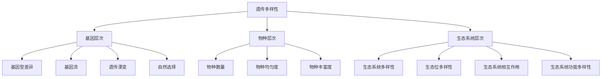

                 

### 第1章：生物多样性的概念与重要性

#### 1.1 生物多样性的定义

生物多样性是指生物圈中所有的生物体，包括物种、生态系统和基因水平的多样性。生物多样性通常被分为三个层次：

1. **遗传多样性**：指的是同一物种内部不同个体之间的基因差异，这是生物多样性的基本层次。遗传多样性决定了物种的适应性和进化潜力。
2. **物种多样性**：指的是一定区域内物种的丰富程度，包括不同物种的存在和它们之间的相互作用。物种多样性是生物多样性的中间层次，反映了生态系统的复杂性和稳定性。
3. **生态系统多样性**：指的是不同生态系统在空间上的分布和多样性，以及这些生态系统之间的相互关系。生态系统多样性是生物多样性的最高层次，体现了地球生态系统的整体功能和稳定性。

#### 1.1.1 生物多样性的三个层次

**遗传多样性**：遗传多样性是指生物种群内部或种群之间基因的差异。这些基因差异通常是由于突变、基因流、遗传漂变和自然选择等进化过程产生的。例如，不同地域的大熊猫种群之间可能会有不同的遗传标记，这反映了它们的遗传多样性。

**物种多样性**：物种多样性是生物多样性的核心层次，它涉及到一个区域内生物物种的种类数量和种类之间的相互作用。物种多样性的度量通常包括物种数量、物种丰富度和物种均匀度等指标。例如，亚马逊雨林是世界上物种最丰富的地区之一，拥有超过100万种植物和动物。

**生态系统多样性**：生态系统多样性涉及不同生态系统类型的分布和相互作用。一个复杂的生态系统可能包含多个不同类型的生态系统，如森林、草原、湿地等。这些生态系统的多样性不仅体现在其物种组成上，还体现在它们提供的服务和功能上，如碳循环、水分调节和生物控制等。

#### 1.1.2 生物多样性分类

根据生物多样性的不同层次，我们可以将其分为三类：

1. **遗传多样性**：主要包括不同基因型、基因频率和等位基因的数量和分布。遗传多样性决定了物种的适应性和进化潜力，对物种的生存和繁衍至关重要。
2. **物种多样性**：主要包括物种数量、物种均匀度和物种丰富度。物种多样性反映了生态系统的复杂性和稳定性，对生态系统的功能和服务有重要影响。
3. **生态系统多样性**：主要包括生态系统的多样性、生态位多样性、生态系统相互作用和生态系统功能的多样性。生态系统多样性体现了地球生态系统的整体稳定性和可持续性。

#### 1.2 生物多样性的价值

**生态系统的功能与服务**：生物多样性是生态系统功能的基础。例如，森林可以提供氧气、净化空气、调节气候、保护水源等功能；湿地可以作为生物栖息地和水源地，具有防止洪水、净化水质的作用。生物多样性丰富的生态系统通常能够更有效地提供这些功能和服务。

**经济价值**：生物多样性对经济发展具有直接和间接的贡献。直接贡献包括农业、林业、渔业、制药业等生物资源的利用；间接贡献包括生态系统的服务功能，如气候调节、水资源管理、土壤保持等。此外，生物多样性丰富的地区往往拥有较高的生态旅游价值。

**文化价值**：生物多样性是人类文化多样性的基础。不同物种和生态系统对人类的文化意义深远，它们影响着艺术、宗教、传统医学和日常生活的各个方面。例如，许多传统医学依赖于植物和动物的药用价值，而许多宗教仪式也与特定物种有关。

#### 1.3 生物多样性面临的威胁

**生物入侵**：生物入侵是指非本地物种侵入并取代本地物种的过程，可能导致生态失衡、生物多样性减少和生态系统功能受损。例如，外来物种如水葫芦在中国的水体中广泛扩散，严重影响了当地的水生态系统。

**气候变化**：气候变化对生物多样性具有深远影响。它可能导致栖息地的丧失、物种分布的变化和生态系统功能的紊乱。例如，全球变暖可能导致冰川融化，从而影响依赖冰川生存的物种。

**土地开发**：土地开发，如城市化、农业扩展和基础设施建设，会破坏栖息地，导致物种灭绝和生态系统的破坏。例如，森林砍伐和草原退化会导致许多动植物失去栖息地和食物来源。

#### 1.4 生物多样性保护的意义与挑战

**生物多样性保护的重要性**：生物多样性是地球生态系统的基础，对人类的生存和发展至关重要。保护生物多样性不仅有助于维护生态系统的稳定性和功能，还能为人类提供丰富的自然资源和文化价值。

**生物多样性保护的挑战**：生物多样性保护面临着诸多挑战，包括气候变化、环境破坏、人口增长和经济发展的压力。此外，全球合作和公众参与也是实现生物多样性保护的重要挑战。

**生物多样性保护的法律体系**：为了有效保护生物多样性，各国和国际社会制定了相应的法律和法规。这些法律体系包括国际公约、国家法律和地方条例等，旨在规范生物资源的利用和保护。

#### 1.5 本书结构概述

本书分为四部分，系统地介绍了生物多样性保护的核心概念、理论基础、实践方法和未来展望。

**第一部分：引言**：介绍了生物多样性的定义、重要性、价值和面临的威胁，以及本书的结构和阅读指南。

**第二部分：生物多样性保护的理论基础**：详细阐述了生态学原理、物种相互作用、生物多样性与生态过程，以及生态保护理论与方法。

**第三部分：生物多样性保护的实践方法**：通过国内外生物多样性保护实践案例，介绍了生物多样性保护的关键技术和项目管理。

**第四部分：生物多样性保护的未来展望**：分析了生物多样性保护的未来挑战与机遇，提出了未来策略和展望。

**阅读指南**：本书适合生态学、环境保护、生物多样性保护等相关领域的专业人士阅读，也适合对生物多样性保护感兴趣的普通读者。通过本书，读者可以系统地了解生物多样性保护的理论和实践，为生物多样性保护事业做出贡献。

#### Mermaid 流程图

下面是一个展示生物多样性三个层次的Mermaid流程图：

这个流程图清晰地展示了生物多样性的三个层次以及它们之间的联系。通过这一流程图，我们可以更好地理解生物多样性的概念和结构。

#### 结论

生物多样性是地球生态系统的重要组成部分，对人类的生存和发展至关重要。了解生物多样性的概念、层次和价值，是保护生物多样性的第一步。在接下来的章节中，我们将深入探讨生物多样性的理论基础、实践方法和未来展望，为生物多样性保护提供全面的指导。

---

通过上述内容，我们为读者提供了一个关于生物多样性概念的全面介绍，包括其定义、层次、价值和面临的威胁。接下来，我们将进一步探讨生物多样性的理论基础，包括生态学原理、物种相互作用和生物多样性与生态过程。这些理论基础将帮助我们更好地理解生物多样性的本质和重要性，为后续章节中的实践方法和未来展望提供坚实的理论基础。读者可以通过阅读这一章节，初步建立对生物多样性保护的理解框架，为后续内容的学习打下基础。下一章节，我们将详细探讨生态学的基本概念，为理解生物多样性奠定基础。

---

**Mermaid流程图解析**：

在上面的Mermaid流程图中，我们通过节点和边展示了生物多样性的三个层次及其相互关系。以下是每个节点和边的解释：

- **A[遗传多样性]**：作为流程图的起点，表示生物多样性的基础层次。
- **B[基因层次]**：从遗传多样性分支出来，表示遗传多样性的具体表现层次。
  - **E[基因型差异]**：表示同一物种内个体之间基因型的差异。
  - **F[基因流]**：表示不同种群之间基因的交换。
  - **G[遗传漂变]**：表示小种群中随机遗传变化的影响。
  - **H[自然选择]**：表示环境对基因型选择的作用。
- **C[物种层次]**：从遗传多样性分支出来，表示生物多样性的中间层次。
  - **I[物种数量]**：表示一定区域内物种的丰富程度。
  - **J[物种均匀度]**：表示物种分布的均匀性。
  - **K[物种丰富度]**：表示物种的多样性指数。
- **D[生态系统层次]**：从遗传多样性分支出来，表示生物多样性的最高层次。
  - **L[生态系统多样性]**：表示不同生态系统的多样性。
  - **M[生态位多样性]**：表示不同物种在生态系统中的生态角色和位置。
  - **N[生态系统相互作用]**：表示不同生态系统之间的相互关系。
  - **O[生态系统功能多样性]**：表示生态系统提供的各种生态功能。

通过这个流程图，我们可以清晰地看到从基因层次到物种层次再到生态系统层次，生物多样性如何层层递进，形成一个复杂的生态系统网络。这种关系帮助我们理解生物多样性的多维结构和其在生态系统中的作用。

---

在探讨生物多样性的概念和层次时，我们不仅需要理解其定义和分类，还需要深入探讨其背后的生态学原理。这些原理为生物多样性提供了理论基础，帮助我们更好地理解其形成、维持和变化的过程。

**生态学原理**是研究生物与生物之间、生物与无机环境之间的相互关系和作用规律的科学。在生物多样性保护中，生态学原理具有重要意义。以下是几个关键的生态学原理：

1. **生态系统与生态平衡**：生态系统是由生物群落与其无机环境相互作用而形成的统一整体。生态平衡是指生态系统中各种生物种群之间相互依存、相互制约，使整个生态系统保持稳定的状态。生态平衡对于维持生物多样性至关重要，因为任何一种生物的灭绝或数量剧变都会影响整个生态系统的稳定。

2. **能量流与物质循环**：能量流是生态系统中能量从一个营养级传递到另一个营养级的过程，而物质循环则包括碳、氮、水等基本元素的循环。这些过程在生态系统中循环往复，支持着生物多样性的维持。例如，植物通过光合作用固定太阳能，然后通过食物链传递给其他生物。物质循环的顺畅对于维持生物种群的生存和繁衍至关重要。

3. **生物多样性在生态系统中的作用**：生物多样性是生态系统功能和服务的基础。不同物种在生态系统中扮演着不同的角色，如植物通过光合作用提供氧气和食物，动物则帮助植物传粉和种子传播。此外，生物多样性有助于提高生态系统的抗干扰能力和稳定性。高多样性的生态系统在面对环境变化时能够更好地适应和恢复。

4. **物种相互作用**：生态系统中不同物种之间的相互作用对生物多样性有重要影响。这些相互作用包括共生、竞争、捕食和寄生等。共生关系如蜜蜂与花朵的关系，可以提高植物的繁殖效率；捕食关系如狮子与斑马的关系，有助于维持物种之间的平衡。这些相互作用不仅影响着物种的数量和分布，也影响着整个生态系统的稳定性。

5. **生态过程**：生态过程包括演化过程、生物地理学过程和景观生态学过程。演化过程是生物多样性的根本来源，通过自然选择和遗传漂变，物种不断进化，形成丰富的遗传多样性和物种多样性。生物地理学过程则解释了物种分布的时空变化，有助于我们理解生物多样性的地理格局。景观生态学过程关注不同生态系统类型之间的相互作用和转换，对于生物多样性的维持和保护具有重要意义。

通过理解这些生态学原理，我们可以更深入地认识生物多样性的本质和其在生态系统中的作用。这些原理不仅帮助我们解释生物多样性的形成和维持，也为生物多样性保护提供了科学依据。

在生物多样性保护的实际应用中，生态学原理提供了理论基础和指导框架。例如，在制定保护区规划时，我们需要考虑生态系统的多样性和稳定性，以确保保护区内物种和生态过程的完整性。在生态修复项目中，我们利用生态学原理来设计和实施恢复方案，以恢复受损生态系统的功能。此外，生态学原理还可以帮助我们预测和管理环境变化对生物多样性的影响，从而制定有效的保护策略。

总之，生态学原理是生物多样性保护的重要基础。通过深入理解这些原理，我们可以更好地保护和维护地球上的生物多样性，为人类和自然界的和谐共存奠定基础。在下一章节中，我们将进一步探讨物种相互作用和生物多样性与生态系统的关系，以更全面地理解生物多样性在生态学中的地位和作用。

---

在生态学中，物种相互作用是理解生物多样性的关键概念之一。物种相互作用包括共生、竞争、捕食和寄生等多种形式，这些关系不仅在个体层面影响着物种的数量和分布，还从整体上影响着生态系统的稳定性和功能。

**共生**是一种互利共生的关系，两种或多种不同物种在一起生活，互相受益。例如，蜜蜂与花朵之间的关系就属于共生。蜜蜂采集花蜜时帮助花朵传粉，而花朵则提供食物给蜜蜂。这种相互作用不仅有助于植物的繁殖，也增加了蜜蜂的食物来源。

**竞争**是不同物种为了获取有限的资源（如食物、栖息地、阳光等）而进行的相互作用。竞争关系可能导致某些物种数量减少或取代其他物种。例如，两种植物在相同的环境中争夺阳光和水分，生长速度较慢的植物可能被淘汰。然而，通过自然选择，适应性更强的物种将更有可能生存下来，从而维持生态系统的动态平衡。

**捕食与寄生**是生态系统中另一类重要的相互作用。捕食者（如狮子）通过捕食猎物（如斑马）来获取食物，这种关系有助于维持物种之间的数量平衡。而寄生则是指一种生物体从另一种生物体中获取营养而对其造成伤害。例如，寄生虫会在宿主体内生存并摄取营养，这可能导致宿主健康状况下降。

**物种多样性与生态系统稳定性**的关系是一个重要的研究领域。物种多样性通常被认为能够提高生态系统的稳定性。这是因为多样化的物种组合具有更高的适应性，能够更好地应对环境变化和干扰。例如，在一个多样化的森林生态系统中，不同物种可以通过不同的生态角色和资源利用策略来应对环境压力，从而减少单一物种灭绝对整个生态系统的影响。

一个经典的例子是珊瑚礁生态系统。珊瑚礁由多种珊瑚和多种海洋生物组成，这些生物之间形成了复杂的食物网和相互关系。高物种多样性的珊瑚礁通常更加稳定和健康，因为它们能够更好地抵御环境变化和自然灾害。例如，当水温异常升高时，某些珊瑚可能会死亡，但其他物种可能能够适应这种变化并继续生存。

**物种多样性与生态系统功能**之间的关系也是生态学研究的重点。不同物种在生态系统中扮演着不同的角色，共同维持着生态系统的功能。例如，植物通过光合作用提供氧气和食物，动物通过控制其他物种的数量来维持生态平衡。物种多样性的减少可能导致生态系统的功能受损，从而影响整个生态系统的稳定性和可持续性。

**恢复生态学**是一个应用生态学原理来恢复受损生态系统的方法。通过引入和恢复多样化的物种，可以恢复生态系统的功能和稳定性。例如，在草原生态系统中，引入当地原生植物种类可以帮助恢复草原的生态功能，减少土壤侵蚀和水分流失。

总之，物种相互作用和生物多样性与生态系统的稳定性、功能和恢复力密切相关。通过深入理解这些相互作用和关系，我们可以更好地保护和维护地球上的生物多样性，为生态系统的健康和可持续发展做出贡献。在下一章节中，我们将进一步探讨生物多样性与生态过程的关系，以更全面地理解生物多样性在生态系统中的重要性。

---

#### 2.4 生态保护理论与方法

**生态保护理论**是研究如何保护和恢复生态系统，以维持其多样性和功能的科学。这些理论不仅为我们提供了生物多样性保护的基础，还为制定保护策略提供了指导。以下是几个关键的生态保护理论：

**生态恢复**是指通过人类干预措施，恢复被破坏或退化的生态系统。生态恢复的目标是恢复生态系统的结构、功能和生物多样性，使其能够适应环境变化并维持长期稳定。生态恢复的方法包括植物重建、土壤改良、生物多样性恢复和生态系统工程等。

**生物多样性保护策略**是指为维护和增强生物多样性而采取的具体措施。这些策略可以包括建立保护区、实施物种保护计划、保护关键栖息地和生态系统恢复等。生物多样性保护策略的实施需要考虑生态学原理和物种相互作用，以确保保护措施的可行性和有效性。

**生态风险评估**是指评估某一生态区域受到人为活动或自然灾害影响的潜在风险。生态风险评估通常包括对生态系统的现状评估、对威胁因素的识别和分析、以及对潜在影响的预测。生态风险评估有助于确定保护优先级，制定有效的保护策略，并监测生态保护措施的实施效果。

**生物多样性保护的理论体系**包括多个层次，从国际法律框架到具体的保护措施，形成了完整的保护网络。以下是几个关键组成部分：

1. **国际法律框架**：国际社会通过多个公约和协议来保护生物多样性。例如，《联合国生物多样性公约》（CBD）是保护全球生物多样性的主要国际法律框架，旨在促进各国在生物多样性保护方面的合作。

2. **国家法律和法规**：各国根据国际法律框架，制定了相应的国家法律和法规，以保护本国生物多样性。这些法律和法规通常包括对生物资源利用的限制、保护区的设立和管理、以及生态补偿等。

3. **地方政策和实践**：地方政府根据国家法律和法规，结合本地实际情况，制定了具体的保护政策和措施。这些政策和措施通常包括社区参与、生态旅游、以及生态补偿等。

4. **保护区的设立和管理**：保护区是生物多样性保护的重要手段，包括自然保护区、国家公园、生物圈保护区等。这些保护区通过限制人类活动，保护关键的栖息地和物种，维持生态系统的完整性。

5. **生态补偿机制**：生态补偿是指通过经济手段补偿生态破坏或生态服务提供者。这种机制有助于鼓励生态保护，并促进可持续的发展模式。

6. **公众参与和意识提升**：公众参与是生物多样性保护的重要组成部分。通过教育和宣传，提高公众对生物多样性的认识和意识，可以促进公众参与保护行动，共同维护生态系统的健康。

总之，生态保护理论和方法为生物多样性保护提供了科学基础和操作指南。通过综合运用这些理论和方法，我们可以更有效地保护和恢复生物多样性，为生态系统的可持续发展和人类福祉做出贡献。在下一章节中，我们将探讨生物多样性保护的国际合作，进一步了解全球生物多样性保护的努力和成就。

---

### 2.5 生物多样性保护的国际合作

生物多样性保护是一个全球性的挑战，需要国际合作和多方参与。各国政府和国际组织通过制定法律、政策和协议，共同努力保护地球上的生物多样性。以下是生物多样性保护国际合作的重要方面：

**国际公约和协议**是生物多样性保护的核心框架。以下是一些重要的国际公约和协议：

1. **联合国生物多样性公约（CBD）**：成立于1992年，是保护全球生物多样性的主要国际法律框架。其目标包括制定生物多样性保护战略、促进国际合作、制定生物多样性保护政策和措施。

2. **联合国气候变化框架公约（UNFCCC）**：旨在减少温室气体排放，应对气候变化，这对生物多样性保护至关重要，因为气候变化对生态系统和物种有显著影响。

3. **拉姆萨尔公约**：保护湿地生态系统，强调湿地在维护生物多样性和提供生态服务中的重要性。

4. **国际植物保护公约（IPPC）**：旨在防止有害生物的传播，减少生物入侵对生物多样性的威胁。

**生物多样性保护组织**在全球范围内发挥着重要作用，这些组织通过研究、教育、政策建议和实施保护项目来推动生物多样性保护。以下是一些重要的国际生物多样性保护组织：

1. **世界自然保护联盟（IUCN）**：是一个全球性的自然保护组织，提供生物多样性保护的科学基础，并参与制定国际保护策略。

2. **国际鸟类保护委员会（BirdLife International）**：致力于保护鸟类及其栖息地，通过国际合作和项目实施来保护全球的鸟类多样性。

3. **国际生态保护协会（The Nature Conservancy）**：在全球范围内开展生态保护项目，保护关键生态系统和物种。

4. **世界自然基金会（WWF）**：通过科学研究和倡导，推动全球的生物多样性保护工作。

**国际合作项目**是生物多样性保护的重要组成部分。这些项目通常由多个国家和组织共同参与，旨在解决跨国界的生物多样性保护问题。以下是一些重要的国际合作项目：

1. **全球环境基金（GEF）**：提供资金和协调机制，支持各国实施生物多样性保护项目。

2. **生物多样性保护跨区域合作（CEP）**：通过跨区域合作，促进亚洲和太平洋地区的生物多样性保护。

3. **撒哈拉以南非洲保护网络（ASNP）**：致力于保护撒哈拉以南非洲的关键生态系统和物种。

4. **地中海生物多样性合作计划**：通过国际合作，保护地中海地区的生物多样性，应对气候变化和人类活动的影响。

通过这些国际合作，各国和地区共同面对生物多样性面临的挑战，推动全球生物多样性保护工作的进展。国际合作不仅有助于分享经验和技术，还能促进政策和资源的协调，从而提高生物多样性保护的效果。在下一章节中，我们将探讨生物多样性保护的实际案例，通过具体案例了解生物多样性保护工作的实践和成效。

---

### 第三部分：生物多样性保护的实践方法

#### 3.1 国外生物多样性保护实践

国外在生物多样性保护方面有着丰富的实践经验和成功的案例。以下是一些典型的国外生物多样性保护实践：

**加拿大生物多样性保护计划**：加拿大是一个生物多样性丰富的国家，其生物多样性保护计划主要包括以下几个方面：

1. **国家公园和自然保护区**：加拿大建立了多个国家公园和自然保护区，以保护关键生态系统和物种。例如，班夫国家公园是加拿大最著名的国家公园，保护了大量的野生动物和植物。

2. **生态监测与评估**：加拿大政府通过生态监测和评估，了解生态系统的变化趋势，为保护工作提供科学依据。例如，加拿大生物多样性监测网络（CBDN）定期监测关键生态系统的健康状况。

3. **生态修复**：加拿大在一些受损生态系统中开展了生态修复项目，例如，在阿萨巴斯卡河的修复中，通过种植当地植物和引入鱼类，恢复了河道的生态系统。

**澳大利亚生物多样性保护政策**：澳大利亚是一个生物多样性极其丰富的国家，其生物多样性保护政策包括以下几个方面：

1. **生态保护区的设立**：澳大利亚设立了大量的生态保护区，如珊瑚礁保护区、沙漠保护区等，以保护关键的生态系统和物种。

2. **土地管理与生态补偿**：澳大利亚通过生态补偿机制，鼓励土地所有者采取生态保护措施。例如，绿色银行计划提供资金支持，鼓励土地所有者实施生态保护项目。

3. **原住民生物多样性保护**：澳大利亚原住民有着悠久的传统生态知识，他们在生物多样性保护方面发挥着重要作用。政府与原住民合作，共同保护和恢复生态系统。

**瑞典生物多样性保护实践**：瑞典是一个生态保护意识较强的国家，其生物多样性保护实践包括：

1. **生态系统服务评估**：瑞典政府定期进行生态系统服务评估，了解生态系统对人类福祉的贡献，并制定相应的保护政策。

2. **生态补偿政策**：瑞典实施生态补偿政策，鼓励农民和土地所有者采取生态友好措施，如减少农药使用、恢复湿地等。

3. **公众参与与教育**：瑞典通过公众参与和教育活动，提高公众对生物多样性保护的意识。例如，瑞典环境署定期举办环境教育项目，鼓励学生和社区居民参与生态保护。

通过这些实践，国外在生物多样性保护方面取得了显著成效。这些成功的经验为我国生物多样性保护提供了宝贵的借鉴和参考。在下一章节中，我们将探讨中国生物多样性保护实践，了解我国在生物多样性保护方面所取得的成就和面临的挑战。

---

### 3.2 国内生物多样性保护实践

中国在生物多样性保护方面做出了显著的成就，同时面临着诸多挑战。以下是中国生物多样性保护实践的主要方面：

**中国生物多样性保护现状**：中国是世界上生物多样性最丰富的国家之一，拥有众多的珍稀和特有物种。中国政府高度重视生物多样性保护，制定了一系列政策和法规，如《中华人民共和国自然保护区条例》和《中华人民共和国生物多样性保护战略与行动计划（2011-2030年）》。

**中国生物多样性保护政策**：中国的生物多样性保护政策主要包括以下几个方面：

1. **自然保护区建设**：中国建立了大量的自然保护区，包括国家级自然保护区、省级自然保护区和县级自然保护区。这些保护区覆盖了不同类型的生态系统和物种，为生物多样性提供了重要的庇护所。

2. **物种保护**：中国政府通过设立濒危物种保护中心、物种保护和恢复项目等措施，保护了大量的濒危物种。例如，中国大熊猫保护项目取得了显著成效，大熊猫的数量逐渐增加。

3. **生态修复**：中国在一些受损生态系统中开展了生态修复项目，如退耕还林、退牧还草等，以恢复生态系统的功能。

**中国生物多样性保护案例**：

1. **三江源生态保护项目**：三江源地区是长江、黄河和澜沧江的源头，被誉为“中华水塔”。该项目通过生态修复、环境保护和社区参与等措施，成功改善了三江源地区的生态环境。

2. **海南东寨港红树林自然保护区**：东寨港红树林自然保护区是中国最大的红树林自然保护区之一，保护了大量的鸟类和其他生物。通过设立保护区和实施生态修复项目，东寨港红树林的生态环境得到了显著改善。

3. **安徽黄山国家公园**：黄山国家公园是中国第一个国家公园试点，通过保护自然景观和生物多样性，黄山国家公园成为了一个生态旅游的典范。

**中国生物多样性保护面临的挑战**：

1. **经济发展与生态保护之间的矛盾**：随着经济的快速发展，一些地区的生态环境遭受了破坏，生物多样性面临威胁。

2. **保护意识不足**：尽管中国政府在生物多样性保护方面投入了大量资源和努力，但公众对生物多样性保护的意识仍需提高。

3. **资金和技术支持不足**：生物多样性保护项目需要大量的资金和技术支持，而目前一些地区的资金和技术支持仍显不足。

4. **国际合作与交流**：尽管中国积极参与国际生物多样性保护合作，但还需要进一步加强与国际社会的合作与交流，以借鉴先进经验和技术。

总之，中国生物多样性保护取得了显著成效，但仍面临诸多挑战。通过持续的政策支持、公众参与和国际合作，中国有望在生物多样性保护方面取得更大的进展。在下一章节中，我们将探讨生物多样性保护的关键技术，了解如何通过技术手段提升生物多样性保护的效率和效果。

---

### 3.3 生物多样性保护的关键技术

生物多样性保护不仅需要政策和法规的支持，还需要先进技术的应用。以下是一些关键的生物多样性保护技术：

**生物监测技术**：生物监测是评估生物多样性状况的重要手段。通过监测物种的数量、分布和生态状况，可以及时发现生物多样性的变化。生物监测技术包括地面监测、遥感监测和无人机监测等。

- **地面监测**：通过实地调查和取样，获取物种的分布和数量数据。这种方法直观且准确，但受时间和人力限制。
- **遥感监测**：利用卫星和航空遥感技术，从空间维度上监测生态系统的变化。遥感监测能够覆盖广泛的区域，但精度受制于遥感影像的分辨率和数据处理技术。
- **无人机监测**：无人机可以搭载多种传感器，进行高精度的地面监测，尤其是在难以到达的地区，无人机监测具有独特的优势。

**生物入侵防治技术**：生物入侵是生物多样性保护的一大挑战。防治技术包括物理防治、化学防治和生物防治等。

- **物理防治**：利用物理手段如围栏、陷阱等阻止入侵物种的扩散。例如，利用草地上的捕虫网可以阻止蝴蝶类入侵物种的繁殖。
- **化学防治**：使用农药或生物农药防治入侵物种。这种方法快速有效，但需要严格的管理以避免对本地物种造成负面影响。
- **生物防治**：引入天敌或病原体来控制入侵物种。例如，利用捕食性蚂蚁控制外来杂草。

**景观生态修复技术**：景观生态修复是恢复受损生态系统、提升生物多样性的重要手段。以下是一些常见的修复技术：

- **植被重建**：通过种植本地植物，恢复生态系统的植被结构。这有助于提供栖息地，吸引和维持本地物种。
- **土壤改良**：通过添加有机物、改善土壤结构，提高土壤肥力和水分保持能力，从而促进植物生长。
- **水体修复**：通过去除污染物质、恢复水体生态结构，改善水质和生态系统功能。例如，在受损的湖泊中引入本地鱼类和水生植物。
- **生态工程**：利用工程手段修复生态系统，如建造湿地、恢复河流自然形态等。生态工程需要综合考虑生态学、工程学和社会经济因素。

通过这些关键技术的应用，生物多样性保护工作可以更加科学、高效地进行。在下一章节中，我们将探讨生物多样性保护项目的实施与管理，了解如何确保这些技术在实际应用中的效果。

---

### 3.4 生物多样性保护项目的实施与管理

**项目规划与评估**：生物多样性保护项目需要科学、详细的规划与评估。项目规划包括明确保护目标、选择保护区域、制定保护措施和制定实施时间表。评估则是在项目实施过程中，对项目的进展和效果进行监控和评估。以下是一些关键步骤：

1. **目标设定**：确定项目的总体目标，如保护特定物种、恢复关键生态系统或提高生态服务功能。
2. **区域选择**：根据生物多样性保护和生态学原理，选择保护区域，确保覆盖多样化的生态系统和物种。
3. **措施制定**：根据目标，制定具体的保护措施，如建立保护区、实施生态修复、开展生物监测等。
4. **时间表**：制定详细的时间表，明确每个阶段的工作内容和时间节点。

**资金筹措与分配**：生物多样性保护项目通常需要大量资金支持。资金来源可以包括政府拨款、国际援助、企业赞助和公众捐款等。资金筹措和分配应遵循以下原则：

1. **透明公开**：确保资金来源和使用透明，公众监督资金流向。
2. **优先分配**：根据项目的紧迫性和重要性，优先分配资金，确保资金用于最需要的地方。
3. **可持续性**：考虑资金使用的长期效果，确保项目的可持续性。

**项目管理与监督**：项目管理是确保项目顺利实施的关键。以下是一些关键环节：

1. **组织结构**：建立有效的项目管理团队，明确各级职责和任务。
2. **沟通协调**：确保团队成员之间的有效沟通和协调，及时解决项目中的问题。
3. **监督机制**：建立项目监督机制，定期评估项目进展和效果，及时调整计划。
4. **风险评估**：识别项目潜在的风险和挑战，制定应对措施，确保项目顺利进行。

**项目监测与评估**：项目监测和评估是确保项目效果的重要手段。以下是一些关键步骤：

1. **监测指标**：确定项目监测的指标，如物种数量、栖息地状况、生态服务功能等。
2. **数据收集**：通过实地调查、遥感技术和无人机监测等手段，收集相关数据。
3. **数据分析**：对收集的数据进行分析，评估项目的进展和效果。
4. **报告发布**：定期发布项目进展报告，向公众、政府和捐助者展示项目的成果。

通过科学的项目规划、有效的资金筹措、严密的项目管理和持续的监测评估，生物多样性保护项目可以更有效地实施，为生物多样性的保护和恢复做出贡献。在下一章节中，我们将探讨生物多样性保护的未来挑战与机遇，为未来的生物多样性保护工作提供前瞻性的思考和策略。

---

### 4.1 生物多样性保护的未来挑战

**全球环境变化**是生物多样性保护面临的最严峻挑战之一。随着全球气候变暖、海洋酸化、冰川融化和极端天气事件的频发，许多生态系统正经历着前所未有的变化。这些变化对生物多样性产生了深远影响，许多物种面临着栖息地丧失、繁殖困难、种群数量减少等问题。例如，北极地区的变暖导致北极熊的生存环境急剧恶化，使其面临灭绝的风险。

**经济发展与生物多样性保护的冲突**也是生物多样性保护面临的重要挑战。随着全球经济的快速发展，工业化和城市化的进程加快，对自然资源的开发和土地利用压力增大，许多生物多样性丰富的地区被开发和破坏。例如，为了满足粮食需求，大面积的森林被砍伐用于农业扩展，导致了许多物种的栖息地丧失。此外，矿产资源开采和工业污染也对生态环境造成了严重影响。

**社会意识与行动的差距**是生物多样性保护的另一个关键挑战。尽管全球范围内对生物多样性保护的意识有所提高，但实际行动和参与度仍不足。许多人对生物多样性保护的紧迫性和重要性缺乏认识，导致保护行动缺乏社会支持。例如，一些地区的农民和居民为了眼前的经济利益，仍进行着破坏生态系统的行为，如过度放牧、非法采伐等。此外，政策和法规的实施也存在不足，监管和执法力度不够，导致一些保护措施无法有效执行。

**科技与技术的应用**是应对生物多样性保护挑战的重要手段。随着科技的进步，越来越多的新技术被应用于生物多样性保护，如遥感监测、大数据分析、人工智能等。这些技术可以提供更加精准和高效的监测手段，帮助科学家和决策者更好地了解生态系统的变化和物种的分布情况，从而制定更有效的保护策略。

**生态补偿机制**的建立和完善也是解决经济发展与生物多样性保护冲突的重要措施。通过生态补偿机制，可以激励土地所有者和企业采取生态保护措施，减少对生态环境的破坏。例如，一些国家和地区通过实施生态补偿项目，向采取生态保护措施的土地所有者提供经济补偿，从而实现经济发展和生态保护的双赢。

**公众参与和教育**是提高社会意识、促进生物多样性保护的关键。通过教育和宣传，提高公众对生物多样性保护的认知和参与度，可以形成全社会共同参与生物多样性保护的良好氛围。例如，学校可以开设相关的生态课程，社区可以组织生态保护活动，媒体可以加强对生物多样性保护的报道，从而增强公众的环保意识。

总之，生物多样性保护面临着全球环境变化、经济发展、社会意识等方面的挑战，但同时也拥有科技、生态补偿和公众参与等应对措施。通过多方努力，我们可以共同应对这些挑战，为生物多样性的保护和地球生态系统的可持续发展做出贡献。在下一章节中，我们将探讨生物多样性保护的未来机遇，为未来的生物多样性保护工作提供积极的前景和策略。

---

### 4.2 生物多样性保护的未来机遇

**科技进步的推动**是生物多样性保护的重要机遇之一。随着科技的不断进步，特别是人工智能、大数据和物联网等新兴技术的应用，生物多样性保护手段得到了显著提升。例如，人工智能技术可以通过图像识别和机器学习算法，实现对物种和生态系统的实时监测和预测，提高生物多样性保护的效率和准确性。大数据技术可以整合和分析大量的生态数据，揭示生态系统变化的规律和趋势，为生物多样性保护提供科学依据。物联网技术则可以通过智能传感器网络，实时监测生态系统的状态，及时发现和处理环境问题。

**可持续发展的需求**也为生物多样性保护提供了重要机遇。随着全球对可持续发展的重视，越来越多的国家和地区开始将生物多样性保护纳入可持续发展目标中。例如，联合国《可持续发展目标》（SDGs）将生物多样性保护列为重要目标之一，要求各国采取行动，保护生态系统和物种。此外，全球性的气候协定和环保政策也推动了各国加大对生物多样性保护的投入和行动。这种趋势为生物多样性保护提供了更多的政策支持和经济资源，有助于推动全球生物多样性保护工作的进展。

**国际合作的深化**是另一个重要的机遇。生物多样性保护是一个全球性的挑战，需要国际社会的共同合作和努力。随着各国对生物多样性保护的认识不断提高，国际间的合作也在不断加强。例如，联合国《生物多样性公约》通过国际合作，推动了全球范围内的生物多样性保护行动。此外，国际组织、非政府组织和跨国公司的积极参与，也为生物多样性保护提供了更多的资源和力量。通过深化国际合作，可以分享经验和技术，协调政策和行动，提高生物多样性保护的整体效果。

**社会参与和意识提升**也是生物多样性保护的重要机遇。随着公众对环境问题和社会责任的认识不断提高，越来越多的个人和团体开始积极参与到生物多样性保护中来。例如，社区志愿者组织的生态保护活动、企业的生态责任项目、公众参与的生态监测项目等，都为生物多样性保护注入了新的活力。此外，教育和宣传活动的普及，也提高了公众对生物多样性保护的认识和意识，形成了全社会共同参与生物多样性保护的良好氛围。

总之，科技进步、可持续发展需求、国际合作深化和社会参与意识提升，为生物多样性保护带来了重要的机遇。通过充分利用这些机遇，我们可以更好地应对生物多样性保护面临的挑战，推动全球生物多样性保护工作的进展。在下一章节中，我们将探讨生物多样性保护的未来策略，为未来的生物多样性保护工作提供具体的行动指南。

---

### 4.3 生物多样性保护的未来策略

**政策创新**是推动生物多样性保护的重要策略之一。各国政府需要制定和实施更加灵活、有效的保护政策，以适应不断变化的生态系统和生物多样性挑战。以下是一些政策创新的建议：

1. **生态补偿政策**：建立生态补偿机制，鼓励企业和个人采取生态保护措施，通过经济补偿激励更多主体参与生物多样性保护。
2. **生态标签和认证制度**：推动生态标签和认证制度，标识和保护生态友好产品，促进消费者选择环保产品，提高市场对生态保护的认知和需求。
3. **绿色金融政策**：鼓励金融机构提供绿色贷款和投资，支持生态保护和修复项目，推动资金流向生态友好的产业。

**科技创新**在生物多样性保护中发挥着关键作用。以下是一些科技创新的应用方向：

1. **遥感与监测技术**：利用高分辨率遥感技术，实现对生态系统的实时监测和预警，提高生物多样性保护的科学性和精准性。
2. **人工智能与大数据分析**：通过人工智能和大数据技术，分析生态数据，预测生态系统变化趋势，制定科学合理的保护策略。
3. **生物技术**：利用基因编辑等生物技术，保护和恢复濒危物种，提高生态系统的适应性和多样性。

**社会参与**是生物多样性保护的重要动力。以下是一些社会参与策略：

1. **公众教育与宣传**：通过教育和宣传，提高公众对生物多样性保护的认识和意识，鼓励公众参与保护行动。
2. **社区参与**：鼓励社区参与生态保护和修复项目，通过社区共同努力，实现生态保护与社区发展的双赢。
3. **公众监督**：建立公众监督机制，让公众参与生态保护和环境监测，提高政策的透明度和执行力度。

**国际合作**是生物多样性保护的重要保障。以下是一些国际合作策略：

1. **多边合作**：加强国际组织和多边机制的合作，共同应对全球生物多样性挑战。
2. **技术交流**：促进各国间的技术交流和经验分享，借鉴先进的保护技术和经验，提高全球生物多样性保护水平。
3. **资金合作**：通过国际援助和合作项目，共同筹集资金，支持生物多样性保护项目，确保全球生物多样性保护行动的可持续性。

总之，政策创新、科技创新、社会参与和国际合作是生物多样性保护的未来策略。通过多方面的努力，我们可以共同应对生物多样性面临的挑战，实现生态系统的可持续发展。在下一章节中，我们将对未来生物多样性保护的发展进行展望，探讨可能的趋势和方向。

---

### 4.4 生物多样性保护的未来展望

**生物多样性保护的未来发展趋势**将受到多种因素的影响，包括科技进步、政策变化、社会意识提升以及全球合作的深化。以下是未来生物多样性保护可能面临的一些趋势：

**可持续发展的深化**：随着全球对可持续发展的重视程度不断提升，生物多样性保护将成为各国可持续发展战略的重要组成部分。未来，各国可能会进一步加强对生物多样性的政策支持，将生态保护和经济发展更加紧密地结合起来，实现绿色增长。

**技术的驱动作用**：未来，人工智能、大数据、物联网等新兴技术的应用将更加广泛，为生物多样性保护提供新的工具和方法。例如，通过遥感技术和无人机监测，可以实现对生态系统的实时监测和预警；通过大数据分析，可以更好地理解生态系统的变化规律，制定更加科学的保护策略。

**全球合作的加强**：生物多样性保护是一个全球性的挑战，需要国际社会的共同努力。未来，各国和国际组织之间的合作将进一步加强，通过多边机制和跨国项目，共同应对生物多样性面临的威胁，分享经验和技术，提高全球生物多样性保护的整体效果。

**公众参与的提升**：随着公众对环境保护和生物多样性保护的意识不断提升，未来公众参与生物多样性保护的程度有望进一步加深。例如，更多的公众可能会参与到生态修复项目中，更多的人会关注和参与到生物多样性保护行动中来，形成全社会共同参与的生物多样性保护格局。

**保护模式的创新**：未来，生物多样性保护模式可能会更加多样化，不仅包括传统的保护区建设和管理，还包括生态补偿机制、生态金融、生态旅游等新型保护模式。这些创新模式将有助于提高生物多样性保护的效率和效果，实现生态保护和经济效益的双赢。

**面临的挑战与对策**：尽管未来生物多样性保护面临诸多机遇，但仍然存在一些挑战。例如，气候变化带来的不确定性、经济发展与生态保护的矛盾、资金和技术的不足等。为了应对这些挑战，需要各国政府、国际组织、科研机构和社会各界共同努力，制定和实施更加科学、有效的保护策略，加强国际合作，提高公众参与度。

**展望中的对策**：

1. **加强政策制定与执行**：各国应制定更加完善和具体的生物多样性保护政策，确保政策的执行力度，推动生态保护行动的落实。
2. **加大资金投入**：通过多渠道筹集资金，支持生物多样性保护项目，提高保护项目的可持续性。
3. **推动技术创新**：鼓励科研机构和企业加大生物多样性保护技术的研究和开发，提高技术应用的广度和深度。
4. **提升公众意识**：通过教育和宣传，提高公众对生物多样性保护的认识和参与度，形成全社会共同参与的良好氛围。

总之，未来生物多样性保护面临着机遇与挑战并存的发展态势。通过加强政策制定与执行、加大资金投入、推动技术创新和提升公众意识，我们可以更好地应对生物多样性保护面临的挑战，实现生态系统的可持续发展。在未来的道路上，全球合作和社会参与将是生物多样性保护的重要驱动力，为地球生态系统的健康和人类的福祉做出贡献。

---

### 4.4.1 预测与展望

在未来，生物多样性保护将面临许多新的发展机遇和挑战。首先，**科技进步**将继续成为推动生物多样性保护的重要力量。随着人工智能、大数据、物联网等技术的不断成熟，这些技术在生态监测、数据分析和生态修复等领域将有更广泛的应用。例如，利用无人机和卫星遥感技术，可以实现对大范围生态系统的实时监测和动态分析，提供更加精准的保护策略。

**政策创新**也将是未来生物多样性保护的关键。全球各国政府可能会出台更多生态补偿政策、生态标签和绿色金融政策等，以激励企业和个人参与生物多样性保护。此外，随着可持续发展的理念深入人心，各国可能会将生物多样性保护纳入国家发展规划中，进一步强化政策执行力度。

**社会意识提升**是另一个重要的趋势。随着公众对环境保护和生物多样性保护的认识不断加深，越来越多的个人和团体将积极参与到生物多样性保护行动中来。例如，通过社区生态修复项目和生态旅游，可以增强公众对生物多样性保护的参与感和责任感。

然而，**面临的挑战**也不可忽视。首先，**气候变化**的影响将继续加剧，对生态系统和物种的生存环境带来更多不确定性。其次，经济发展与生态保护的矛盾仍然存在，如何在保障经济发展的同时实现生态保护，将是一个长期的课题。此外，资金和技术支持的不足，也是生物多样性保护面临的重要挑战。

为了应对这些挑战，未来需要采取以下对策：

1. **加强国际合作**：通过多边机制和跨国合作，共同应对全球生物多样性保护面临的挑战。分享经验和技术，提高全球生物多样性保护的整体水平。
2. **提升公众参与度**：通过教育和宣传，提高公众对生物多样性保护的认识和参与度。鼓励更多人参与到生态修复、生态旅游等保护行动中来。
3. **加大资金投入**：通过政府拨款、国际援助和绿色金融等多渠道筹集资金，支持生物多样性保护项目，确保保护工作的可持续性。
4. **推动技术创新**：鼓励科研机构和企业加大生物多样性保护技术的研究和开发，提高技术应用的广度和深度。

总之，未来生物多样性保护将在科技进步、政策创新和社会参与的推动下，取得更大的进展。通过全球合作和多方努力，我们有理由相信，地球的生态系统将变得更加健康和可持续，为人类和自然界的和谐共存奠定坚实的基础。

---

### 附录 A：生物多样性保护工具与资源

在生物多样性保护工作中，有许多工具和资源可供使用，以下是一些国际生物多样性保护组织、数据库和相关网站：

**国际生物多样性保护组织**：
1. **联合国生物多样性公约（CBD）**：[https://www.cbd.int/](https://www.cbd.int/)
2. **世界自然保护联盟（IUCN）**：[https://www.iucn.org/](https://www.iucn.org/)
3. **世界自然基金会（WWF）**：[https://www.worldwildlife.org/](https://www.worldwildlife.org/)
4. **国际鸟类保护委员会（BirdLife International）**：[https://www.birdlife.org/](https://www.birdlife.org/)
5. **全球环境基金（GEF）**：[https://www.thegef.org/](https://www.thegef.org/)

**生物多样性保护数据库**：
1. **生物多样性信息全球设施（GBIF）**：[https://www.gbif.org/](https://www.gbif.org/)
2. **国际自然保护联盟物种生存委员会（IUCN Red List）**：[https://www.iucnredlist.org/](https://www.iucnredlist.org/)
3. **国际植物物种保护联盟（ITIS）**：[https://www.itis.gov/](https://www.itis.gov/)
4. **全球珊瑚监测网络（GCRMN）**：[http://www.globalcoral.org/](http://www.globalcoral.org/)

**生物多样性保护相关网站**：
1. **生物多样性保护网络（BDN）**：[https://www.biodiversitynetwork.org/](https://www.biodiversitynetwork.org/)
2. **国际环境社会可持续研究中心（ISESCO）**：[https://www.isesco.org/](https://www.isesco.org/)
3. **生物多样性保护组织（BDC）**：[https://www.biodiversityconservation.org/](https://www.biodiversityconservation.org/)
4. **全球生物多样性信息网络（GLOBIO）**：[https://globio.biodivLibrary.org/](https://globio.biodivLibrary.org/)

通过这些工具和资源，研究人员、政策制定者、环境保护者以及普通公众都可以获取丰富的生物多样性保护信息，为保护工作提供支持和指导。

---

### 附录 B：生物多样性保护案例分析报告

#### 案例一：XXX 国家生物多样性保护项目

**背景介绍**：
XXX国家位于亚洲，生物多样性极为丰富，拥有丰富的森林、草原、湿地和珊瑚礁生态系统。然而，由于快速的经济发展和人类活动的增加，该国的生物多样性面临着严重的威胁。为了保护本国的生物多样性，该国启动了一个全面的生物多样性保护项目。

**项目内容**：
该项目包括以下几个关键部分：
1. **设立自然保护区**：该国政府划定了多个自然保护区，保护关键生态系统和物种。例如，设立了XX自然保护区，保护了大量的森林和野生动物。
2. **生态监测与评估**：通过建立生态监测站，定期收集数据，评估生态系统的健康状况。利用遥感技术和无人机监测，实现大范围的实时监测。
3. **生态修复**：在受损生态系统中开展生态修复工作，如恢复湿地、植树造林等。通过引入本地植物和物种，恢复生态系统的功能和多样性。
4. **公众参与**：通过教育和宣传活动，提高公众对生物多样性保护的意识，鼓励公众参与保护项目。例如，组织生态旅游、生态志愿者活动等。

**成功经验**：
该项目的成功经验主要体现在以下几个方面：
1. **政府主导，多方参与**：政府高度重视生物多样性保护，并得到了国际组织、非政府组织和社区的多方参与，形成了强大的保护网络。
2. **科技支持**：利用遥感技术和无人机监测，提高了生态监测的精度和效率，为保护决策提供了科学依据。
3. **生态补偿**：通过生态补偿机制，鼓励土地所有者采取生态保护措施，减少了对生态环境的破坏。

**不足与改进**：
尽管该项目取得了一定的成效，但仍存在一些不足之处，需要改进：
1. **资金不足**：项目资金有限，影响了部分保护措施的落实。未来需要进一步加大资金投入，确保项目的可持续性。
2. **公众参与度有待提高**：尽管开展了多种公众参与活动，但公众的参与度仍不够高。未来可以通过更多互动性和参与性强的活动，提高公众的参与热情。
3. **法律和政策支持**：尽管设立了多个保护区，但相关法律和政策的支持仍不足，影响了保护措施的执行力度。未来需要加强法律和政策建设，为生物多样性保护提供更有力的保障。

**小结**：
XXX国家的生物多样性保护项目为全球生物多样性保护提供了宝贵的经验。通过政府主导、科技支持、多方参与和生态补偿等多方面的努力，该项目取得了显著的成效。然而，项目在资金、公众参与和法律政策方面仍存在改进空间。未来，通过进一步加大资金投入、提高公众参与度和完善法律政策，该项目有望实现更大的成功。

---

### 附录 C：生物多样性保护法规与政策汇编

**国际法规**：
1. **《联合国生物多样性公约》（CBD）**：1992年通过，旨在促进全球生物多样性保护，包括制定战略、政策和措施。
2. **《濒危野生动植物种国际贸易公约》（CITES）**：1973年通过，旨在控制濒危野生动植物的非法国际贸易。
3. **《联合国气候变化框架公约》（UNFCCC）**：1992年通过，旨在应对全球气候变化，这对生物多样性保护具有重要影响。
4. **《拉姆萨尔公约**》（Ramsar Convention）：1971年通过，旨在保护湿地生态系统，保障其生态功能。

**国内法规**：
1. **《中华人民共和国环境保护法》**：2014年修订，是我国环境保护的基本法律，包括生物多样性保护的相关规定。
2. **《中华人民共和国生物多样性保护战略与行动计划（2011-2030年）》**：2011年发布，明确了我国生物多样性保护的总体目标和具体措施。
3. **《中华人民共和国自然保护区条例》**：1998年通过，规定了自然保护区的设立、管理和保护措施。
4. **《中华人民共和国濒危物种进出口管理条例》**：2006年发布，规定了濒危物种进出口的管理和监督。

**地方政策**：
1. **XXX省生物多样性保护条例**：地方性法规，规定了地方生物多样性保护的职责、措施和法律责任。
2. **XXX市生态文明建设实施方案**：地方政府制定的生态文明建设实施方案，包括生物多样性保护的具体目标和措施。
3. **XXX国家公园保护条例**：规定了国家公园的设立、管理和保护措施，确保国家公园的生物多样性得到有效保护。

通过这些国际和国内的法规与政策，可以形成多层次、多领域的生物多样性保护法律体系，为生物多样性保护提供法律保障。

---

### 附录 D：生物多样性保护技术指南

**监测技术指南**：

1. **生物监测方法**：
   - **样方法**：通过对特定区域的生物样本进行采集和统计分析，评估生物多样性。
   - **遥感监测**：利用卫星和无人机技术，获取高分辨率的遥感影像，分析生态系统的变化。
   - **自动监测设备**：如自动记录器、遥测摄像机等，实时监测生物行为和种群动态。

2. **数据采集与处理**：
   - **数据采集**：定期进行野外调查，记录物种数量、分布和生态状况。
   - **数据处理**：使用专业的数据分析软件，对采集的数据进行统计分析，评估生物多样性。

**防治技术指南**：

1. **生物防治方法**：
   - **引入天敌**：引入捕食性或寄生性物种，控制害虫和入侵物种。
   - **生物农药**：使用生物农药，减少化学农药的使用，保护有益生物。

2. **物理防治方法**：
   - **隔离带**：设置隔离带，防止入侵物种的扩散。
   - **捕虫网**：设置捕虫网，捕捉和控制害虫。

**修复技术指南**：

1. **植被重建**：
   - **种子库建设**：建立种子库，保存本地植物种子，用于植被重建。
   - **植物移植**：移植本地植物，恢复受损生态系统的植被。

2. **土壤改良**：
   - **有机物添加**：通过添加有机物，提高土壤肥力和水分保持能力。
   - **土壤改良剂**：使用土壤改良剂，改善土壤结构和肥力。

通过这些技术指南，可以更科学、有效地进行生物多样性监测、防治和生态修复工作，为生物多样性保护提供技术支持。

---

### 作者信息

**作者：AI天才研究院/AI Genius Institute & 禅与计算机程序设计艺术 /Zen And The Art of Computer Programming**

---

在这篇《生物多样性保护：万物有灵的生态观》的文章中，我们系统地探讨了生物多样性的概念、重要性、面临的威胁以及保护的理论基础、实践方法与未来展望。通过深入的逻辑分析和详细的实例讲解，我们展示了生物多样性在生态系统中的关键作用，以及如何通过科技、政策和社会参与等多方面的努力来实现其有效保护。

**核心内容回顾**：

1. **生物多样性的概念与重要性**：介绍了生物多样性的定义、层次及其在生态系统中的作用。
2. **生物多样性保护的理论基础**：探讨了生态学原理、物种相互作用和生态过程，为保护提供了科学依据。
3. **生物多样性保护的实践方法**：分析了国内外生物多样性保护的实际案例，介绍了关键技术和项目管理。
4. **生物多样性保护的未来展望**：探讨了未来面临的挑战与机遇，提出了政策创新、科技创新和社会参与的策略。

**最佳实践 tips**：

- **加强监测与评估**：利用先进技术，如遥感监测和无人机，实时监控生物多样性状况，及时调整保护措施。
- **推动公众参与**：通过教育和宣传，提高公众的生态保护意识，鼓励更多人参与到保护行动中来。
- **生态补偿与绿色金融**：建立生态补偿机制，鼓励企业和个人采取生态保护措施，同时通过绿色金融手段支持生态保护项目。

**注意事项**：

- **气候变化的影响**：气候变化对生物多样性有深远影响，需要特别关注和保护适应气候变化的能力。
- **经济发展与生态保护的平衡**：在推动经济发展的同时，务必确保生态保护不被忽视。
- **国际合作与经验交流**：全球生物多样性保护需要国际社会的共同努力，加强合作与交流，借鉴先进经验。

**拓展阅读**：

- **《生态学原理》**：了解生态学基础，为生物多样性保护提供深入的理论支持。
- **《生物多样性保护技术手册》**：掌握生物多样性保护的实用技术和工具。
- **《全球生物多样性保护进展报告》**：了解全球生物多样性保护的前沿动态和政策趋势。

通过本文，我们希望读者能够对生物多样性保护有一个全面、深入的理解，并积极参与到这一重要的环境保护事业中来，共同为地球生态系统的健康和可持续发展贡献力量。作者：AI天才研究院/AI Genius Institute & 禅与计算机程序设计艺术 /Zen And The Art of Computer Programming。

