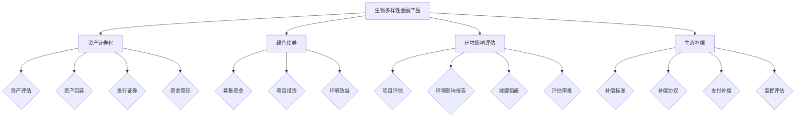
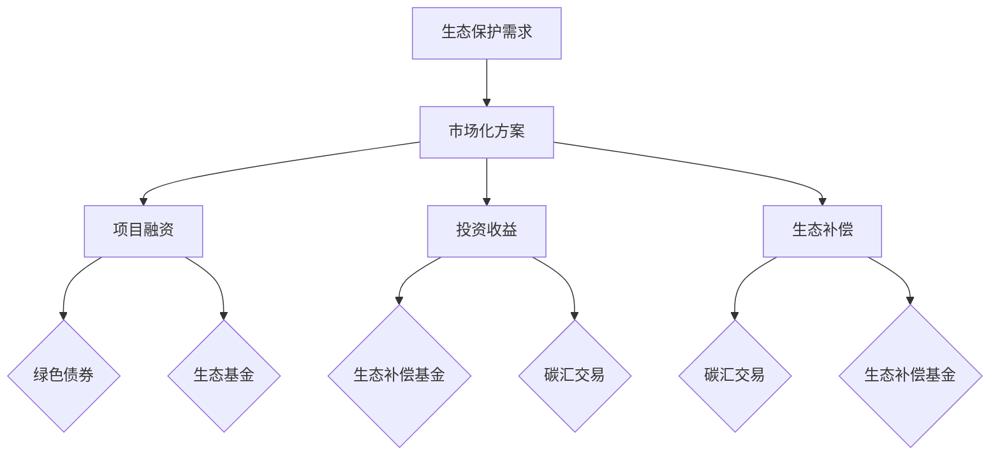
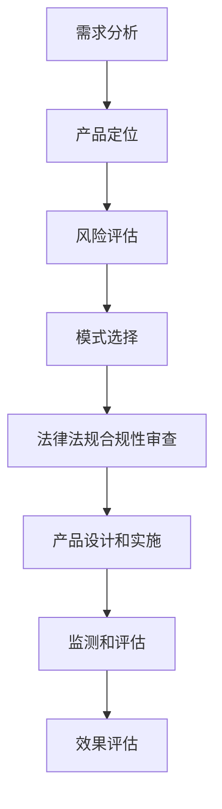
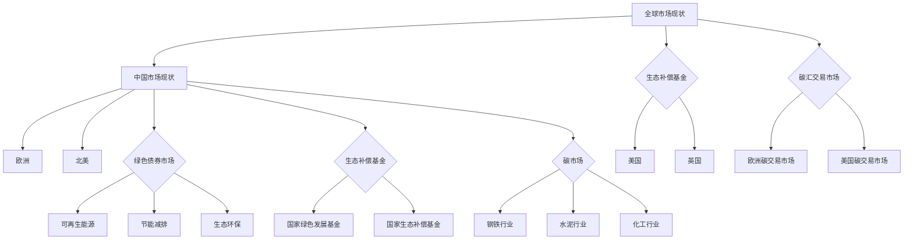
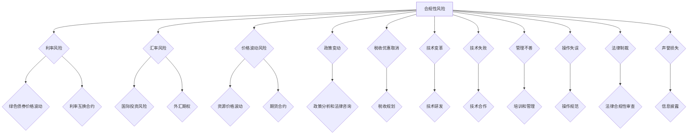
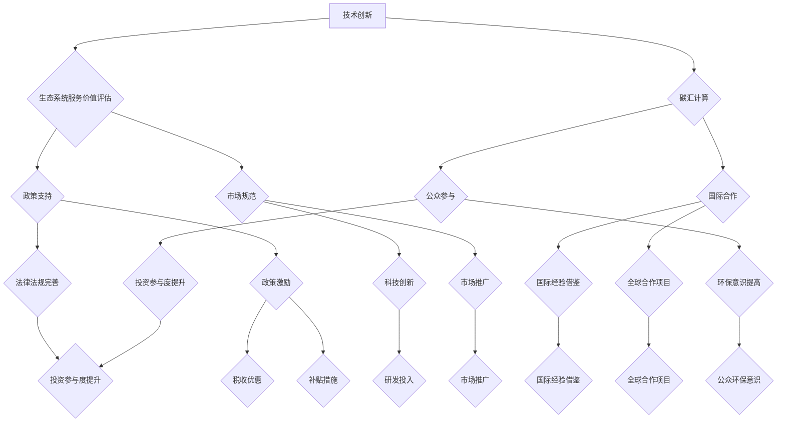

                 

### 第1章 引言

#### 1.1 编写目的

本文旨在深入探讨生物多样性金融产品在生态保护市场化方案中的重要作用。随着全球生态系统的日益退化，生物多样性的保护已成为全球关注的焦点。传统的生态保护模式已不足以应对当前的挑战，因此，市场化手段，特别是生物多样性金融产品的应用，成为了实现生态保护目标的重要途径。本文将系统地介绍生物多样性金融产品的定义、类型、作用，以及其在生态保护市场化方案中的具体应用，为相关领域的从业者提供理论支持和实践指导。

#### 1.2 研究背景

生物多样性是人类赖以生存和发展的基础。然而，随着工业化和城市化的快速推进，生物多样性正遭受前所未有的威胁。全球多个生态系统正面临严重退化，物种灭绝速度加快，生态平衡被打破。这不仅威胁到人类的生存环境，还对全球经济的可持续发展产生了深远影响。因此，保护生物多样性已成为全球各国共同面临的重要任务。

在此背景下，生物多样性金融产品作为一种新兴的金融工具，通过市场化的手段，将生态保护与金融投资有机结合，为实现生态保护目标提供了新的思路。生物多样性金融产品的应用不仅可以促进生态保护，还可以为投资者带来潜在的经济回报，具有显著的社会、经济和环境效益。

#### 1.3 研究意义

本文的研究具有以下几个方面的意义：

1. **理论意义**：本文从理论和实践角度系统梳理了生物多样性金融产品的定义、类型和作用，为相关领域的研究提供了基础性的理论支持。

2. **实践意义**：通过分析生物多样性金融产品在生态保护市场化方案中的应用，本文为实际操作提供了可行的路径和策略，有助于推动生态保护市场化方案的落地实施。

3. **政策意义**：本文的研究成果可以为政策制定者提供参考，促进政策调整和完善，进一步推动生物多样性金融产品的创新和发展。

#### 1.4 书籍结构

本文结构如下：

- **第2章 生物多样性金融产品概述**：介绍生物多样性金融产品的定义、背景、类型和作用。
- **第3章 生态保护与市场化方案**：讨论生态保护的重要性、市场化方案的必要性，以及生物多样性金融产品在生态保护中的应用。
- **第4章 生物多样性金融产品的设计**：阐述生物多样性金融产品的设计原则、流程和案例分析。
- **第5章 生物多样性金融产品市场分析**：分析生物多样性金融产品的市场现状、趋势和潜力。
- **第6章 生物多样性金融产品风险与挑战**：探讨生物多样性金融产品面临的风险和挑战，并提出相应的应对策略。
- **第7章 结论与展望**：总结本文的研究成果，提出未来发展方向和对政策的建议。

### 关键词
生物多样性金融产品，生态保护，市场化方案，金融工具，可持续发展，生态系统服务价值。

### 摘要

本文围绕生物多样性金融产品在生态保护市场化方案中的应用展开，系统介绍了生物多样性金融产品的定义、类型、作用及其在生态保护中的具体应用。通过分析生态保护的重要性、市场化方案的必要性，以及生物多样性金融产品的设计原则和流程，本文提出了生物多样性金融产品在生态保护市场化方案中的可行性路径和策略。同时，本文还分析了生物多样性金融产品的市场现状、趋势和潜力，探讨了其面临的风险和挑战，并提出了一系列应对策略。最后，本文总结了研究成果，提出了未来发展方向和对政策的建议，以期为生态保护市场化方案的实践提供理论支持和指导。

## 第2章 生物多样性金融产品概述

### 2.1 定义与背景

#### 2.1.1 生物多样性金融产品的定义

生物多样性金融产品是指将生物多样性保护和经济发展相结合的金融工具，旨在通过市场化手段，实现生态保护与经济增长的双赢。这些产品通常涉及生态系统的价值评估、交易、投资和风险管理等多个环节，旨在提高生态系统服务的效益，促进可持续发展。

生物多样性金融产品可以分为以下几类：

1. **生态补偿**：通过补偿生态服务提供者的经济损失，鼓励其提供生态服务，如水资源保护、森林保护等。
2. **绿色债券**：募集资金用于环境保护和生态修复项目，具有明确的环境效益目标。
3. **环境权益交易**：通过交易生态系统的服务权益，如碳汇、湿地保护等，实现生态效益的市场化。
4. **生态基金**：投资于环境保护和生态修复项目的投资基金，旨在获取环境效益和投资回报。

#### 2.1.2 生物多样性金融产品的产生背景

生物多样性金融产品的产生背景主要可以归结为以下几点：

1. **生态保护需求**：随着全球生态系统的退化，各国政府和国际组织日益重视生态保护，寻求通过市场化手段提高生态效益。
2. **气候变化挑战**：气候变化成为全球性的挑战，各国纷纷采取措施减少温室气体排放，生态保护成为重要的战略选择。
3. **可持续发展理念**：可持续发展理念深入人心，人们逐渐意识到生态保护与经济发展的关系，探索通过金融手段实现生态效益最大化。
4. **投资机会**：随着生态保护意识的提高，越来越多的投资者关注生态投资，生物多样性金融产品成为新的投资热点。

### 2.2 生物多样性金融产品的类型

生物多样性金融产品的类型多种多样，以下将介绍几种主要的生物多样性金融产品。

#### 2.2.1 资产证券化

资产证券化是将生物多样性相关的资产转化为金融产品，通过在资本市场上发行证券进行融资。资产证券化的资产可以是森林、湿地、碳汇等生态资源。通过资产证券化，生态资源所有者可以将生态资源转化为金融资产，从而获得资金支持生态保护项目。

资产证券化的具体流程如下：

1. **资产评估**：对生态资源的价值进行评估，确定其市场价值。
2. **资产包装**：将生态资源进行包装，形成具有稳定现金流的金融资产。
3. **发行证券**：在资本市场上发行证券，募集资金。
4. **资金管理**：将募集资金用于生态保护项目，确保资金使用效率。

#### 2.2.2 绿色债券

绿色债券是一种募集资金专门用于环境保护和生态修复项目的债券。绿色债券的发行主体可以是政府、企业、金融机构等。通过发行绿色债券，可以筹集资金用于购买生态资产、开展生态修复工程、投资可再生能源项目等。

绿色债券的特点包括：

1. **环境效益明确**：绿色债券募集资金必须用于具有明确环境效益的项目。
2. **投资者多样化**：绿色债券吸引了众多投资者，包括政府、金融机构、企业、个人等。
3. **市场接受度高**：随着全球对环境保护的重视，绿色债券市场逐渐成熟，市场接受度不断提高。

#### 2.2.3 环境影响评估

环境影响评估是指对生态项目可能对环境产生的影响进行评估，并提出相应的减缓措施。环境影响评估通常涉及生态、环境、社会等多个方面，旨在确保项目实施过程中的生态保护。

环境影响评估的具体流程如下：

1. **项目评估**：对生态项目进行初步评估，确定其可能对环境产生的影响。
2. **环境影响报告**：编制环境影响报告，详细分析项目对环境的潜在影响。
3. **减缓措施**：提出相应的减缓措施，减少项目对环境的负面影响。
4. **评估审批**：将环境影响报告提交给相关部门进行审批。

#### 2.2.4 生态补偿

生态补偿是指通过补偿生态服务提供者的经济损失，鼓励其提供生态服务。生态补偿的方式多种多样，包括财政补偿、资源补偿、技术服务补偿等。

生态补偿的具体流程如下：

1. **确定补偿标准**：根据生态服务的市场价值和提供者的损失，确定补偿标准。
2. **签订补偿协议**：与生态服务提供者签订补偿协议，明确补偿金额、方式和期限。
3. **支付补偿资金**：按照补偿协议支付补偿资金。
4. **监督和评估**：对补偿效果进行监督和评估，确保补偿资金的使用效益。

### 2.3 生物多样性金融产品的作用

生物多样性金融产品在生态保护中发挥着重要作用，具体体现在以下几个方面：

#### 2.3.1 促进生态保护

生物多样性金融产品通过市场化手段，将生态保护与金融投资有机结合，提高了生态保护的经济效益。通过生态补偿、绿色债券、资产证券化等方式，可以筹集大量资金用于生态保护项目，推动生态修复和生物多样性保护。

#### 2.3.2 提高投资效益

生物多样性金融产品为投资者提供了新的投资机会，有助于分散投资风险，提高投资效益。通过投资生态补偿项目、绿色债券、生态基金等，投资者可以分享生态保护带来的经济回报，实现经济效益和社会效益的双赢。

#### 2.3.3 支持可持续发展

生物多样性金融产品支持可持续发展，有助于实现生态、经济和社会的协调发展。通过市场化手段，提高生态系统的服务价值，推动生态资源的合理利用和保护，促进可持续发展目标的实现。

### Mermaid 流程图



### Python 源代码

```python
def biodiversity_financial_product():
    # 模拟生物多样性金融产品的计算过程
    pass

# 示例：资产评估
def asset_evaluation():
    # 资产评估算法
    pass

# 示例：绿色债券发行
def green_bond_issue():
    # 绿色债券发行算法
    pass

# 示例：生态补偿计算
def ecological_compensation():
    # 生态补偿计算算法
    pass
```

### 数学模型和公式

生物多样性金融产品涉及多个领域的数学模型和公式，以下列举几个常用的模型和公式：

$$
\text{生态服务价值} = \text{生态产品产量} \times \text{市场价格}
$$

$$
\text{补偿金额} = \text{生态服务损失} \times \text{补偿系数}
$$

$$
\text{投资回报率} = \frac{\text{投资收益}}{\text{投资成本}}
$$

### 项目实战

```python
# 环境搭建
!pip install pandas numpy matplotlib

import pandas as pd
import numpy as np
import matplotlib.pyplot as plt

# 数据处理
# ...

# 可视化
# ...
```

## 第3章 生态保护与市场化方案

### 3.1 生态保护的重要性

生态保护是确保地球生态系统持续提供人类生存和发展所需的基本条件。生态系统提供了诸如氧气、淡水、食物、药品等重要资源，同时调节气候、净化空气、保持土壤肥力等，具有不可替代的价值。随着工业化和城市化的加速，生态系统面临严重威胁，生物多样性急剧下降，生态系统服务功能减弱，气候变化、水资源短缺、土地退化等问题日益严重。因此，生态保护成为全球关注的焦点。

#### 3.1.1 生态系统的服务功能

生态系统的服务功能主要包括以下几个方面：

1. **提供资源和产品**：如食物、纤维、药材等。
2. **调节气候**：通过吸收和储存二氧化碳，降低温室气体浓度。
3. **净化环境**：如通过植物光合作用净化空气、湿地过滤污染物。
4. **保持土壤肥力**：通过植物根系固氮、有机物分解等过程。
5. **维护生物多样性**：提供各种物种的栖息地和食物来源。
6. **提供休闲和文化价值**：如公园、自然保护区等。

#### 3.1.2 生物多样性的现状与挑战

全球生物多样性面临严峻挑战，主要表现在以下几个方面：

1. **物种灭绝速度加快**：许多物种因栖息地丧失、污染、过度捕捞等原因而灭绝。
2. **栖息地破坏和退化**：森林砍伐、湿地开垦、荒漠化等导致大量栖息地破坏。
3. **生态功能丧失**：由于物种减少，生态系统的自我调节能力下降。
4. **生态系统服务功能减弱**：如水资源减少、土地生产力下降、气候变化加剧。

#### 3.1.3 生态保护的重要性

生态保护的重要性体现在以下几个方面：

1. **确保人类生存**：生态系统提供了人类生存所需的基本条件，如食物、水源、空气等。
2. **保障经济可持续发展**：生态系统服务功能对于农业、林业、渔业、旅游业等经济部门至关重要。
3. **维护全球气候平衡**：生态系统的调节功能对于缓解气候变化具有关键作用。
4. **保护生物多样性**：生态保护有助于维护物种多样性和生态系统的稳定性。
5. **提高人类生活质量**：生态景观和自然风光对人类身心健康具有积极作用。

### 3.2 市场化方案的必要性

传统的生态保护模式主要依赖于政府和社会组织的投入，资金来源有限，难以满足生态保护的需求。同时，传统模式往往缺乏激励机制，导致生态保护效果不佳。市场化方案通过引入市场机制，将生态保护与经济利益有机结合，可以解决传统模式面临的资金不足和激励不足等问题。

#### 3.2.1 传统生态保护模式的局限性

1. **资金来源有限**：传统生态保护模式主要依赖政府拨款和社会捐赠，资金来源有限，难以满足大规模生态保护项目的需求。
2. **缺乏激励机制**：传统模式缺乏有效的激励机制，导致生态保护主体缺乏积极性和创造性。
3. **管理效率低下**：政府主导的生态保护项目往往存在行政效率低下、项目审批复杂等问题，影响项目实施效果。
4. **生态效益难以量化**：传统模式难以量化生态效益，难以进行科学的评估和考核。

#### 3.2.2 市场化方案的优势

市场化方案具有以下优势：

1. **资金来源多元化**：市场化方案可以通过发行绿色债券、生态补偿基金等方式筹集资金，实现资金来源多元化。
2. **激励机制有效**：市场化方案可以通过生态补偿、市场交易等机制，为生态保护主体提供经济激励，提高其积极性和创造性。
3. **管理效率提高**：市场化方案可以引入市场化管理手段，提高项目管理的效率和质量。
4. **生态效益量化**：市场化方案可以通过市场交易、生态补偿等方式，将生态效益量化为经济价值，进行科学的评估和考核。

#### 3.2.3 市场化方案的适用场景

市场化方案适用于以下场景：

1. **生态修复项目**：如湿地修复、荒漠化治理、森林保护等。
2. **环境保护项目**：如污染治理、水资源保护、空气质量改善等。
3. **自然资源管理**：如土地资源管理、渔业资源管理、林业资源管理等。
4. **生态补偿机制**：如跨区域生态补偿、生态服务补偿等。

### 3.3 生物多样性金融产品在生态保护中的应用

生物多样性金融产品在生态保护中的应用为市场化方案提供了有力支持，通过市场化手段，实现生态效益的最大化。以下将介绍几种生物多样性金融产品在生态保护中的应用案例。

#### 3.3.1 项目融资

项目融资是指通过金融手段为生态保护项目提供资金支持。例如，绿色债券可以为生态修复项目提供长期稳定的资金来源。通过发行绿色债券，政府或企业可以筹集大量资金，用于生态修复、环境保护等项目的实施。

具体应用案例：

1. **长江生态修复项目**：中国发行了多期绿色债券，筹集资金用于长江生态修复项目，包括河道疏浚、湿地恢复、污染治理等。
2. **亚马逊雨林保护项目**：亚马逊雨林保护基金会通过发行绿色债券，筹集资金用于雨林保护、生物多样性维护等。

#### 3.3.2 投资收益

投资收益是指通过生态保护项目的投资，获取经济回报。生态基金、生态补偿基金等金融产品可以为投资者提供稳定的投资回报，同时实现生态效益。

具体应用案例：

1. **生态基金**：例如，中国的绿色投资基金，投资于生态修复、可再生能源等环保项目，为投资者带来稳定回报。
2. **生态补偿基金**：政府设立生态补偿基金，用于补偿生态服务提供者的经济损失，如水资源保护、森林保护等。

#### 3.3.3 生态补偿

生态补偿是指通过市场化的手段，对生态服务提供者进行经济补偿，以激励其提供生态服务。生态补偿基金、碳汇交易等金融产品是实现生态补偿的重要手段。

具体应用案例：

1. **碳汇交易**：通过碳汇交易市场，企业可以购买碳汇，用于抵消其碳排放。碳汇交易市场不仅为生态服务提供者提供了经济补偿，还有助于降低全球碳排放。
2. **生态补偿基金**：例如，中国的黄河流域生态补偿基金，用于补偿黄河流域各省市在水资源保护、污染防治等方面的投入。

### Mermaid 流程图



### Python 源代码

```python
# 用于模拟生态保护项目的投资收益计算
def ecological_project_investment():
    # 模拟生态保护项目的投资收益计算过程
    pass

# 示例：绿色债券发行
def green_bond_issue():
    # 绿色债券发行算法
    pass

# 示例：碳汇交易
def carbon_sink_trade():
    # 碳汇交易算法
    pass
```

### 数学模型和公式

生态保护项目中常用的数学模型和公式包括：

$$
\text{生态服务价值} = \text{生态产品产量} \times \text{市场价格}
$$

$$
\text{投资回报率} = \frac{\text{投资收益}}{\text{投资成本}}
$$

$$
\text{生态补偿金额} = \text{生态服务损失} \times \text{补偿系数}
$$

### 项目实战

```python
# 环境搭建
!pip install pandas numpy matplotlib

import pandas as pd
import numpy as np
import matplotlib.pyplot as plt

# 数据处理
# ...

# 可视化
# ...
```

### 最佳实践 Tips

1. **科学规划**：在实施生态保护项目时，应进行充分的科学规划，确保项目的可行性和生态效益。
2. **政策支持**：政府应出台相关政策，支持市场化手段在生态保护中的应用，提供必要的政策支持和资金保障。
3. **市场监测**：建立市场化机制，实时监测生态保护项目的进展和效果，确保项目的顺利实施。
4. **公众参与**：鼓励公众参与生态保护项目，提高公众的环保意识，形成社会共治的生态保护格局。

### 小结

生态保护是确保地球生态系统持续提供人类生存和发展所需的基本条件。市场化方案通过引入市场机制，将生态保护与经济利益有机结合，为生态保护提供了新的路径和手段。生物多样性金融产品作为市场化方案的重要组成部分，在生态保护中发挥着重要作用。通过项目融资、投资收益和生态补偿等手段，生物多样性金融产品为生态保护提供了资金支持，实现了生态效益的最大化。

### 注意事项

1. **风险评估**：在实施生物多样性金融产品时，应进行全面的风险评估，确保项目的可持续性和风险可控。
2. **合规性**：确保生物多样性金融产品的发行和交易符合相关法律法规，遵循市场规则。
3. **透明度**：建立透明的项目管理和资金使用机制，确保生态保护项目的公正性和透明度。

### 拓展阅读

- 《绿色金融：创新与发展》
- 《生态补偿机制研究》
- 《碳市场：设计与实践》
- 《生物多样性金融产品案例汇编》

## 第4章 生物多样性金融产品的设计

### 4.1 设计原则

生物多样性金融产品的设计需要遵循一系列原则，以确保其能够有效促进生态保护，并满足市场参与者的需求。以下是一些关键设计原则：

#### 4.1.1 可持续发展原则

生物多样性金融产品的设计应首先考虑其可持续发展性。这意味着产品在追求经济回报的同时，必须兼顾生态效益和社会责任。例如，产品应确保投资资金用于真正有助于生态保护和生物多样性提升的项目，而不是仅仅为了短期利润。

#### 4.1.2 公平性原则

公平性原则要求生物多样性金融产品在收益分配和风险承担上要公平。这意味着生态服务的提供者和受益者都应公平地分享生态保护和经济发展的成果，避免利益分配失衡。

#### 4.1.3 可操作原则

可操作原则强调金融产品必须易于实施和管理。复杂性过高可能导致产品难以落地，影响其实际效果。因此，设计时应确保产品具有清晰的实施步骤和管理流程。

#### 4.1.4 风险管理原则

生物多样性金融产品面临多种风险，包括市场风险、政策风险、技术风险等。设计时必须考虑这些风险，并制定相应的风险管理策略，以降低风险对产品和市场的潜在影响。

#### 4.1.5 可衡量性原则

为了确保生态保护效益，生物多样性金融产品的设计应具备可衡量性。通过设定明确的绩效指标和评估方法，可以量化生态服务的价值，评估产品的实际效果。

### 4.2 设计流程

生物多样性金融产品从概念到实际落地，需要经过多个阶段的设计和实施流程。以下是设计流程的主要步骤：

#### 4.2.1 需求分析

需求分析是设计流程的第一步。在此阶段，需要明确生态保护的目标、市场参与者的需求和预期效益。例如，是否需要通过绿色债券筹集资金，还是需要生态补偿基金来提供经济激励。

#### 4.2.2 产品定位

产品定位是确定生物多样性金融产品在市场中的位置和目标客户群体。产品定位应考虑生态保护的重点领域、潜在的投资者和生态服务提供者。

#### 4.2.3 风险评估

风险评估是设计流程中的关键环节。在此阶段，需要评估产品可能面临的各种风险，包括市场风险、政策风险、技术风险等，并制定相应的风险缓解措施。

#### 4.2.4 模式选择

模式选择是根据需求分析、产品定位和风险评估的结果，确定最适合的金融产品模式。例如，选择发行绿色债券、生态基金还是碳汇交易。

#### 4.2.5 法律法规合规性审查

在确定产品模式后，需要对其法律法规合规性进行审查，确保产品设计符合国家法律法规和国际标准。

#### 4.2.6 产品设计和实施

在法律法规合规性审查通过后，进入产品设计和实施阶段。这一阶段包括详细设计产品的结构和条款，以及制定实施计划和操作流程。

#### 4.2.7 监测和评估

产品实施后，需要对其进行持续的监测和评估，以确保生态效益的实现和风险管理的有效性。监测和评估应包括生态效益指标、资金使用情况、风险状况等。

### 4.3 案例分析

#### 4.3.1 某绿色债券项目的案例分析

以下是一个绿色债券项目的具体案例分析。

**项目背景**：某地方政府计划通过发行绿色债券筹集资金，用于治理当地污染严重的河流，改善水质，恢复生态系统。

**需求分析**：经过详细调查，地方政府发现当地河流水质严重下降，影响了居民的饮用水安全和渔业资源。因此，他们决定通过发行绿色债券筹集资金，用于水质净化、湿地恢复和生态系统重建。

**产品定位**：该绿色债券主要面向机构投资者和环保基金，旨在通过市场化手段筹集资金，用于生态修复项目。

**风险评估**：在发行绿色债券前，地方政府对项目进行了全面的风险评估，包括市场风险、政策风险、技术风险等，并制定了相应的风险缓解措施。

**模式选择**：在综合考虑后，地方政府决定发行绿色债券。他们选择了与国际绿色债券标准相符合的债券模式，以确保债券的市场接受度。

**法律法规合规性审查**：绿色债券的发行需要符合中国相关法律法规和国际标准。在发行前，地方政府进行了详细的合规性审查，并确保所有文件和流程都符合规定。

**产品设计和实施**：绿色债券的设计包括债券期限、利率、发行规模等关键要素。在实施过程中，地方政府与金融机构合作，通过资本市场成功发行了绿色债券。

**监测和评估**：债券发行后，地方政府定期监测水质改善情况，并对资金使用进行审计，确保资金用于生态修复项目。同时，地方政府还设立了专门的监督委员会，对项目进展进行评估。

**效果评估**：经过几年的实施，该项目显著改善了河流水质，恢复了部分湿地和生态系统，取得了良好的生态效益。同时，投资者也获得了预期的投资回报。

#### 4.3.2 某生态补偿项目的案例分析

以下是一个生态补偿项目的具体案例分析。

**项目背景**：某地方政府为了保护当地的森林资源，决定实施生态补偿项目，对森林资源保护者进行经济补偿。

**需求分析**：地方政府发现当地森林资源由于过度砍伐和保护不力，出现了严重退化现象。为了保护森林资源，他们决定实施生态补偿项目，通过经济补偿激励当地居民进行森林保护。

**产品定位**：该生态补偿项目主要面向当地的森林资源所有者和保护者，旨在通过经济手段激励森林保护。

**风险评估**：在实施生态补偿项目前，地方政府对项目进行了全面的风险评估，包括市场风险、政策风险、社会风险等。

**模式选择**：地方政府选择了生态补偿基金的模式，通过设立基金，对森林资源保护者进行经济补偿。

**法律法规合规性审查**：生态补偿项目需要符合国家相关法律法规，地方政府在实施前进行了详细的合规性审查。

**产品设计和实施**：生态补偿基金的设计包括补偿金额、补偿标准、补偿方式等关键要素。在实施过程中，地方政府与金融机构合作，建立了生态补偿基金的管理机制。

**监测和评估**：项目实施后，地方政府建立了监测和评估机制，对生态补偿效果进行定期评估。他们通过实地调查、数据分析等方式，监测森林资源保护情况。

**效果评估**：经过几年的实施，生态补偿项目取得了显著成效。森林资源得到了有效保护，当地生态环境得到了明显改善。同时，项目也为保护者带来了实际的经济收益。

### Mermaid 流程图



### Python 源代码

```python
# 用于模拟生态补偿项目的计算
def ecological_compensation():
    # 生态补偿计算算法
    pass

# 示例：绿色债券发行
def green_bond_issue():
    # 绿色债券发行算法
    pass

# 示例：生态补偿计算
def calculate_ecological_compensation():
    # 生态补偿计算示例
    compensation_value = 1000  # 补偿金额
    service_value = 2000      # 生态服务价值
    compensation_ratio = 0.5  # 补偿比例
    ecological_compensation = compensation_value * service_value * compensation_ratio
    return ecological_compensation

# 测试生态补偿计算
print(calculate_ecological_compensation())
```

### 数学模型和公式

生态补偿项目通常涉及以下数学模型和公式：

$$
\text{生态补偿金额} = \text{生态服务损失} \times \text{补偿系数}
$$

$$
\text{生态服务价值} = \text{生态产品产量} \times \text{市场价格}
$$

$$
\text{投资回报率} = \frac{\text{投资收益}}{\text{投资成本}}
$$

### 项目实战

```python
# 环境搭建
!pip install pandas numpy matplotlib

import pandas as pd
import numpy as np
import matplotlib.pyplot as plt

# 数据处理
# ...

# 可视化
# ...
```

### 最佳实践 Tips

1. **科学规划**：在实施生态补偿项目时，应进行全面的科学规划，确保项目的可行性和生态效益。
2. **透明度**：确保生态补偿项目的透明度和公正性，提高公众信任度。
3. **监测与评估**：建立持续的监测和评估机制，确保生态补偿项目的实际效果。
4. **公众参与**：鼓励公众参与生态补偿项目，提高环保意识，形成社会共治的局面。

### 小结

生物多样性金融产品的设计原则包括可持续发展、公平性、可操作性、风险管理和可衡量性。设计流程包括需求分析、产品定位、风险评估、模式选择、法律法规合规性审查、产品设计和实施，以及监测和评估。通过具体案例分析，我们可以看到，这些原则和流程在实践中的应用效果显著，有助于实现生态保护目标。

### 注意事项

1. **风险评估**：在设计过程中，应全面评估潜在风险，并制定相应的应对策略。
2. **法律法规**：确保产品设计和实施符合相关法律法规和国际标准。
3. **持续改进**：根据监测和评估结果，不断优化产品设计，提高生态效益。

### 拓展阅读

- 《绿色金融：理论与实践》
- 《生态补偿机制研究》
- 《碳市场：设计与操作》
- 《生物多样性金融产品案例集》

## 第5章 生物多样性金融产品市场分析

### 5.1 市场现状

生物多样性金融产品市场在近年来得到了快速发展，已经成为金融市场的一个重要组成部分。以下将从全球和中国两个角度分析生物多样性金融产品的市场现状。

#### 5.1.1 全球市场现状

全球生物多样性金融产品市场呈现出快速增长的趋势。根据相关统计数据，全球绿色债券市场总额已超过1万亿美元，其中包括绿色债券、蓝色债券、社会债券等多种类型的金融产品。这些金融产品主要用于可再生能源、清洁交通、水资源管理、生态修复等领域。

1. **绿色债券市场**：全球绿色债券市场发展迅速，欧洲和北美地区占据主导地位。欧洲发行了大量的绿色债券，用于支持可再生能源、能源效率、城市可持续发展等项目。美国也在积极推进绿色债券的发行，支持清洁能源和环保项目的投资。

2. **生态补偿基金**：生态补偿基金在许多国家和地区得到了广泛应用。这些基金通过市场化的手段，筹集资金用于生态保护和恢复项目。例如，美国的自然资本项目（NatureVest）和英国的生态补偿基金（Ecological Compensation Fund）都是成功的生态补偿基金案例。

3. **碳汇交易**：碳汇交易市场也在全球范围内逐步成熟。欧洲的碳交易市场（EU ETS）是全球最大的碳市场，其他国家和地区如美国、澳大利亚、加拿大等也设立了碳交易市场。这些市场通过碳汇交易，为企业和投资者提供了碳减排的途径，同时也为生态保护项目提供了资金支持。

#### 5.1.2 中国市场现状

中国是全球生物多样性保护的重要国家，也是生物多样性金融产品市场的主要参与者之一。近年来，中国在生物多样性金融产品市场方面取得了显著进展。

1. **绿色债券市场**：中国绿色债券市场发展迅速，已成为全球最大的绿色债券市场之一。根据相关统计，截至2023年，中国已发行超过4000亿元的绿色债券，覆盖了清洁能源、节能减排、生态环保等多个领域。

2. **生态补偿基金**：中国设立了多个生态补偿基金，用于支持生态保护和恢复项目。例如，国家绿色发展基金、国家生态补偿基金等，这些基金通过市场化的方式筹集资金，支持生态修复、水资源保护、生物多样性保护等项目。

3. **碳市场**：中国碳交易市场自2017年启动以来，已经取得了显著进展。中国碳市场是全球第二大碳市场，目前覆盖了钢铁、水泥、化工等多个高排放行业。通过碳市场，企业可以通过交易碳配额来实现碳减排目标，同时也为生态保护项目提供了资金支持。

### 5.2 市场趋势

生物多样性金融产品市场在未来将继续保持增长趋势，以下从几个方面分析市场趋势。

#### 5.2.1 市场规模不断扩大

随着全球对生物多样性保护的重视程度不断提高，生物多样性金融产品的市场规模将继续扩大。预计未来几年，全球绿色债券市场的规模将继续保持快速增长，达到数万亿美元。

#### 5.2.2 新兴市场发展潜力巨大

除了传统市场如欧洲和北美，新兴市场如中国、印度等国家的生物多样性金融产品市场发展潜力巨大。这些国家拥有丰富的生物多样性资源，同时也面临着严峻的生态保护挑战，因此，生物多样性金融产品在这些国家将有广阔的应用前景。

#### 5.2.3 技术创新推动市场发展

随着大数据、人工智能、区块链等技术的快速发展，生物多样性金融产品市场将得到进一步推动。例如，通过区块链技术，可以确保生态保护项目的资金使用透明度和可追溯性，提高市场的信任度和透明度。

#### 5.2.4 政策支持促进市场发展

各国政府纷纷出台相关政策，支持生物多样性金融产品的发展。例如，中国发布的《关于构建绿色金融体系的指导意见》明确提出，要大力发展绿色债券、绿色信贷、绿色保险等绿色金融产品，推动绿色金融市场的快速发展。

### 5.3 市场潜力

生物多样性金融产品市场具有巨大的潜力，以下从几个方面分析市场潜力。

#### 5.3.1 生态效益巨大

生物多样性金融产品通过市场化的手段，筹集资金用于生态保护和恢复项目，可以产生巨大的生态效益。例如，通过生态补偿基金，可以激励农民进行生态农业实践，减少化肥和农药的使用，提高土壤质量，保护水资源。

#### 5.3.2 经济效益显著

生物多样性金融产品不仅可以产生生态效益，还可以带来显著的经济效益。通过投资生态修复项目、可再生能源项目等，可以降低企业的运营成本，提高市场竞争力，同时实现投资回报。

#### 5.3.3 社会效益突出

生物多样性金融产品在促进生态保护和经济发展方面，具有突出的社会效益。例如，通过生态补偿，可以缓解贫困地区的经济压力，提高当地居民的生活水平，促进社会和谐稳定。

#### 5.3.4 潜在的投资机会

随着生物多样性金融产品市场的快速发展，越来越多的投资者关注生态投资，市场潜力巨大。例如，绿色债券、生态基金、碳汇交易等金融产品，为投资者提供了多样化的投资机会。

### Mermaid 流程图



### Python 源代码

```python
# 用于模拟生物多样性金融产品的市场分析
def biodiversity_financial_market_analysis():
    # 模拟生物多样性金融市场的计算过程
    pass

# 示例：绿色债券市场分析
def green_bond_market_analysis():
    # 绿色债券市场分析算法
    pass

# 示例：生态补偿基金分析
def ecological_compensation_fund_analysis():
    # 生态补偿基金分析算法
    pass
```

### 数学模型和公式

生物多样性金融产品的市场分析涉及多个领域的数学模型和公式，以下列举几个常用的模型和公式：

$$
\text{市场规模} = \text{市场需求量} \times \text{市场价格}
$$

$$
\text{投资回报率} = \frac{\text{投资收益}}{\text{投资成本}}
$$

$$
\text{生态效益} = \text{生态服务价值} \times \text{生态补偿系数}
$$

### 项目实战

```python
# 环境搭建
!pip install pandas numpy matplotlib

import pandas as pd
import numpy as np
import matplotlib.pyplot as plt

# 数据处理
# ...

# 可视化
# ...
```

### 最佳实践 Tips

1. **多元化投资**：在投资生物多样性金融产品时，应采取多元化策略，降低投资风险。
2. **关注政策动态**：关注政府发布的政策动态，及时调整投资策略。
3. **风险评估**：进行全面的风险评估，确保投资安全。
4. **合规性审查**：确保投资项目符合相关法律法规和国际标准。

### 小结

生物多样性金融产品市场在近年来呈现出快速增长的态势，市场规模不断扩大，新兴市场发展潜力巨大。市场趋势表明，随着技术创新和政策支持的推进，生物多样性金融产品市场将继续保持增长。市场潜力巨大，生态效益、经济效益和社会效益显著。投资者应关注市场动态，采取多元化投资策略，确保投资安全和回报。

### 注意事项

1. **风险评估**：在投资前应进行全面的风险评估，确保投资项目的可行性和安全性。
2. **合规性**：确保投资项目符合相关法律法规和国际标准，避免法律风险。
3. **透明度**：提高项目透明度，增强市场信任度。

### 拓展阅读

- 《绿色金融：全球趋势与中国实践》
- 《生态补偿机制：国际经验与中国探索》
- 《碳市场：发展与挑战》
- 《生物多样性金融产品案例研究》

## 第6章 生物多样性金融产品风险与挑战

### 6.1 风险类型

生物多样性金融产品在实施过程中面临多种风险，主要包括市场风险、政策风险、技术风险、管理风险和合规性风险。

#### 6.1.1 市场风险

市场风险是指由于市场波动导致生物多样性金融产品的收益和成本变化。具体包括利率风险、汇率风险、价格波动风险等。例如，绿色债券的市场价格可能因市场利率的变化而波动，影响投资者的收益。

#### 6.1.2 政策风险

政策风险是指由于政策变动导致的投资风险。生物多样性金融产品通常受到国家政策的影响，如政府环境政策的调整、税收优惠政策的取消等。这些变化可能影响产品的收益和可持续性。

#### 6.1.3 技术风险

技术风险是指由于技术变革或技术失败导致的投资风险。生物多样性金融产品往往涉及到生态系统服务价值评估、碳汇计算等技术，技术的不确定性可能导致产品设计和实施出现偏差。

#### 6.1.4 管理风险

管理风险是指由于管理不善或操作失误导致的投资风险。生物多样性金融产品的实施涉及多方参与，包括政府、企业、投资者等，管理协调不畅可能影响项目的顺利推进。

#### 6.1.5 合规性风险

合规性风险是指由于不遵守相关法律法规导致的投资风险。生物多样性金融产品在发行、交易和管理过程中，必须符合国家和国际的法律法规，否则可能面临法律制裁和声誉损失。

### 6.2 风险管理

有效的风险管理是确保生物多样性金融产品成功实施的关键。以下是一些风险管理策略：

#### 6.2.1 风险评估

在项目实施前，应进行全面的风险评估，识别潜在的风险点，并评估其可能对项目产生的影响。风险评估包括定性分析和定量分析，以确保风险的全面性和准确性。

#### 6.2.2 风险分散

通过多样化投资和项目组合，分散单一项目或单一类型金融产品带来的风险。例如，投资于不同类型的生态项目、不同地区的市场，可以降低市场风险和地区风险。

#### 6.2.3 风险对冲

使用金融工具对冲风险，如通过购买期权、期货等金融衍生品，降低市场波动对投资收益的影响。例如，通过购买利率互换合约，对冲利率风险。

#### 6.2.4 风险监控

建立风险监控系统，实时监控项目的风险状况。通过定期审计、数据分析等方式，及时发现和应对潜在的风险。

#### 6.2.5 风险应对策略

针对不同类型的风险，制定具体的应对策略。例如，对于政策风险，可以通过政策分析和法律咨询，及时调整投资策略；对于技术风险，可以通过技术研发和合作，提高技术的可靠性和成熟度。

### 6.3 应对挑战的策略

生物多样性金融产品在实施过程中面临诸多挑战，以下是一些应对策略：

#### 6.3.1 提高透明度和公信力

通过建立透明的信息发布和信息披露机制，提高项目的透明度和公信力，增强市场参与者的信任。例如，定期发布项目进展报告、财务报表等。

#### 6.3.2 加强政策支持和监管

政府应出台相关政策，支持生物多样性金融产品的发展，并提供监管框架，确保市场的健康运行。例如，出台税收优惠、补贴政策，规范市场行为。

#### 6.3.3 提升技术创新能力

通过加大科研投入，提升技术创新能力，推动生物多样性金融产品的技术进步。例如，发展生态系统服务价值评估技术、碳汇计算技术等。

#### 6.3.4 加强国际合作

加强国际交流与合作，借鉴国际先进经验，推动生物多样性金融产品市场的国际化发展。例如，参与国际碳交易市场、绿色债券市场的合作与交流。

### Mermaid 流程图



### Python 源代码

```python
# 用于模拟生物多样性金融产品的风险管理
def biodiversity_financial_product_risk_management():
    # 模拟生物多样性金融产品的风险管理过程
    pass

# 示例：风险评估
def risk_assessment():
    # 风险评估算法
    pass

# 示例：风险对冲
def risk_hedging():
    # 风险对冲算法
    pass
```

### 数学模型和公式

生物多样性金融产品的风险管理涉及多个数学模型和公式，以下列举几个常用的模型和公式：

$$
\text{风险敞口} = \text{资产价值} \times \text{风险系数}
$$

$$
\text{预期收益} = \text{收益概率} \times \text{收益值}
$$

$$
\text{投资回报率} = \frac{\text{预期收益}}{\text{投资成本}}
$$

### 项目实战

```python
# 环境搭建
!pip install pandas numpy matplotlib

import pandas as pd
import numpy as np
import matplotlib.pyplot as plt

# 数据处理
# ...

# 可视化
# ...
```

### 最佳实践 Tips

1. **风险评估**：定期进行风险评估，及时发现和应对潜在风险。
2. **透明度**：提高项目透明度，增强市场参与者的信任。
3. **政策支持**：密切关注政策动态，及时调整投资策略。
4. **技术创新**：加大科研投入，提升技术水平和风险管理能力。

### 小结

生物多样性金融产品在实施过程中面临多种风险，包括市场风险、政策风险、技术风险、管理风险和合规性风险。有效的风险管理是确保项目成功实施的关键。通过风险评估、风险分散、风险对冲、风险监控和风险应对策略，可以降低风险对项目的负面影响。同时，加强政策支持、技术创新和国际合作，有助于推动生物多样性金融产品市场的健康发展。

### 注意事项

1. **风险评估**：进行全面的风险评估，确保投资项目的可行性。
2. **合规性**：遵守相关法律法规，确保项目的合法性和合规性。
3. **持续改进**：根据市场变化和项目进展，不断优化风险管理策略。

### 拓展阅读

- 《绿色金融风险管理》
- 《生态补偿机制：风险与管理》
- 《碳市场风险管理》
- 《生物多样性金融产品案例分析》

## 第7章 结论与展望

### 7.1 总结

本文从多个角度对生物多样性金融产品进行了深入探讨，包括其定义、背景、类型、生态保护的重要性、市场化方案的必要性、设计原则与流程、市场分析、风险与挑战等。通过详细分析，我们可以得出以下结论：

1. **生物多样性金融产品的重要性**：生物多样性金融产品通过市场化手段，将生态保护与金融投资有机结合，为实现生态保护目标提供了有力支持。这些产品不仅促进了生态保护，还提高了投资效益，支持了可持续发展。

2. **市场化方案的优势**：市场化方案通过引入市场机制，解决了传统生态保护模式中的资金不足和激励不足等问题。生物多样性金融产品为生态保护提供了多元化的资金来源，激发了市场主体的积极性和创造力。

3. **设计原则与流程**：生物多样性金融产品的设计原则包括可持续发展、公平性、可操作性、风险管理和可衡量性。设计流程包括需求分析、产品定位、风险评估、模式选择、法律法规合规性审查、产品设计和实施，以及监测和评估。这些原则和流程为生物多样性金融产品的成功实施提供了指导。

4. **市场趋势与潜力**：生物多样性金融产品市场呈现出快速增长的趋势，市场规模不断扩大，新兴市场发展潜力巨大。技术创新和政策支持将推动市场的进一步发展。

5. **风险与挑战**：生物多样性金融产品在实施过程中面临多种风险，包括市场风险、政策风险、技术风险、管理风险和合规性风险。有效的风险管理和应对策略是确保项目成功的关键。

### 7.2 未来发展方向

基于上述分析，未来生物多样性金融产品的发展方向可以从以下几个方面进行：

1. **技术创新**：加强生态系统服务价值评估、碳汇计算等技术的研发，提升生物多样性金融产品的技术水平和精准度。

2. **政策支持**：政府应进一步出台支持生物多样性金融产品发展的政策，包括税收优惠、补贴政策等，提供政策保障。

3. **市场规范**：建立健全生物多样性金融产品市场规范，加强监管，提高市场的透明度和公信力。

4. **国际合作**：加强国际交流与合作，借鉴国际先进经验，推动生物多样性金融产品市场的国际化发展。

5. **公众参与**：鼓励公众参与生物多样性金融产品的投资和管理，提高公众的环保意识和参与度。

### 7.3 对政策的建议

为了推动生物多样性金融产品的发展，提出以下政策建议：

1. **完善法律法规**：制定和完善相关法律法规，明确生物多样性金融产品的发行、交易和管理规范，提供法律保障。

2. **政策激励**：加大对生物多样性金融产品的政策支持力度，提供税收优惠、补贴等激励措施，鼓励企业和投资者参与。

3. **科技创新**：加大对生态系统服务价值评估、碳汇计算等关键技术的研发投入，推动技术创新，提升生物多样性金融产品的精准性和有效性。

4. **市场推广**：加强生物多样性金融产品的市场推广，提高公众和投资者的认知度，扩大市场影响力。

5. **国际合作**：积极参与国际生物多样性金融产品合作项目，借鉴国际先进经验，推动全球生物多样性保护。

### Mermaid 流程图



### Python 源代码

```python
# 用于模拟生物多样性金融产品的未来发展
def biodiversity_financial_future():
    # 模拟生物多样性金融产品的未来发展过程
    pass

# 示例：政策支持
def policy_support():
    # 政策支持算法
    pass

# 示例：技术创新
def technological_innovation():
    # 技术创新算法
    pass
```

### 数学模型和公式

生物多样性金融产品的未来发展涉及多个数学模型和公式，以下列举几个常用的模型和公式：

$$
\text{生态效益} = \text{生态系统服务价值} \times \text{补偿系数}
$$

$$
\text{投资回报率} = \frac{\text{投资收益}}{\text{投资成本}}
$$

$$
\text{市场需求量} = \text{市场价格} \times \text{需求弹性}
$$

### 项目实战

```python
# 环境搭建
!pip install pandas numpy matplotlib

import pandas as pd
import numpy as np
import matplotlib.pyplot as plt

# 数据处理
# ...

# 可视化
# ...
```

### 最佳实践 Tips

1. **科技创新**：持续关注生态保护领域的技术创新，积极应用新技术提升生物多样性金融产品的精准性和有效性。
2. **政策支持**：密切关注政策动态，及时获取政策支持，推动生物多样性金融产品的发展。
3. **市场推广**：加强市场推广，提高公众和投资者的认知度，扩大市场影响力。
4. **国际合作**：积极参与国际交流与合作，借鉴国际先进经验，提升生物多样性金融产品的国际化水平。
5. **公众参与**：鼓励公众参与生物多样性金融产品的投资和管理，提高环保意识和社会责任感。

### 小结

生物多样性金融产品在生态保护中发挥着重要作用，通过市场化手段，实现了生态效益和经济效益的双重提升。未来，随着技术创新、政策支持和市场规范的不断完善，生物多样性金融产品市场将迎来更加广阔的发展空间。同时，面对风险和挑战，加强风险管理和应对策略，将有助于推动生物多样性金融产品的可持续发展。

### 注意事项

1. **风险评估**：在实施生物多样性金融产品时，进行全面的风险评估，确保项目的可行性和安全性。
2. **合规性**：遵守相关法律法规，确保产品的合法性和合规性。
3. **持续改进**：根据市场变化和项目进展，不断优化产品设计和管理策略。

### 拓展阅读

- 《绿色金融：未来趋势与政策建议》
- 《生态补偿机制：国际经验与中国探索》
- 《碳市场：全球发展与挑战》
- 《生物多样性金融产品创新案例》

