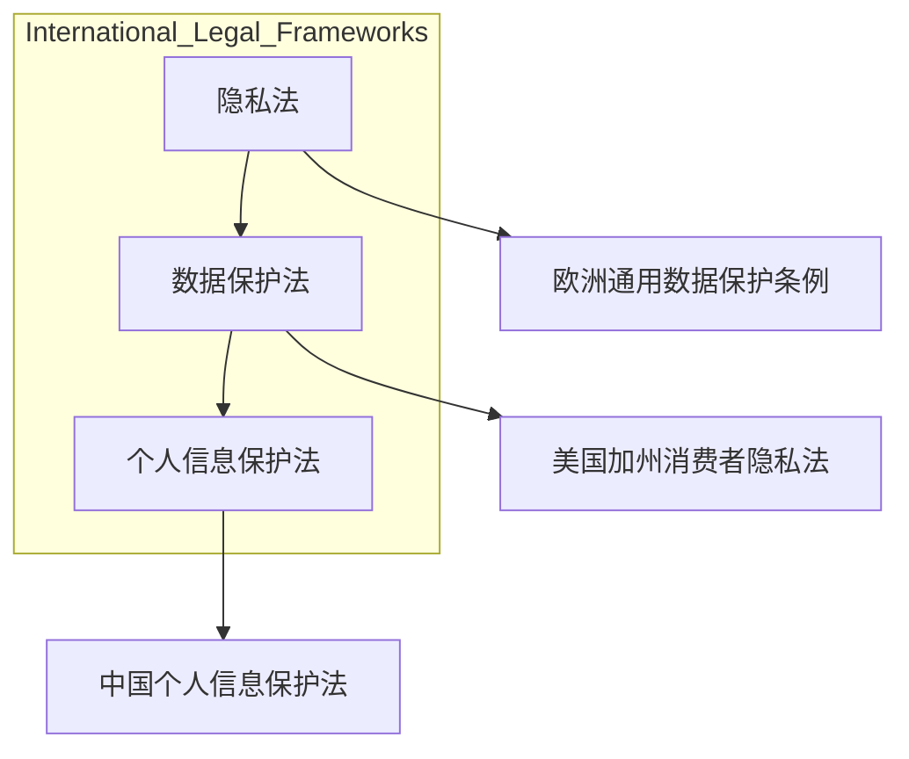
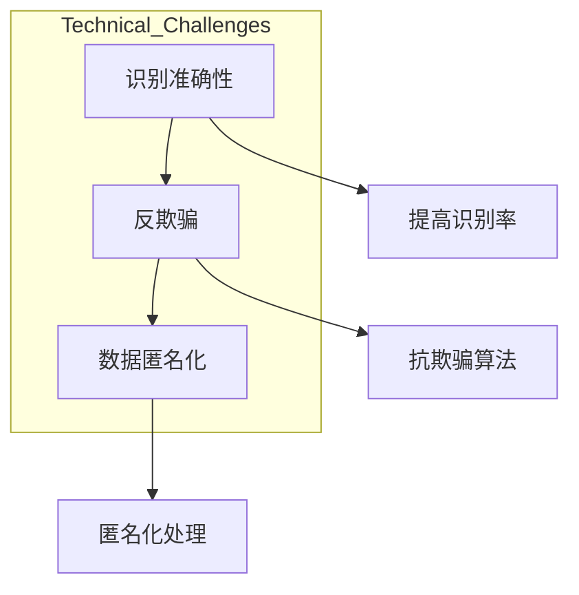
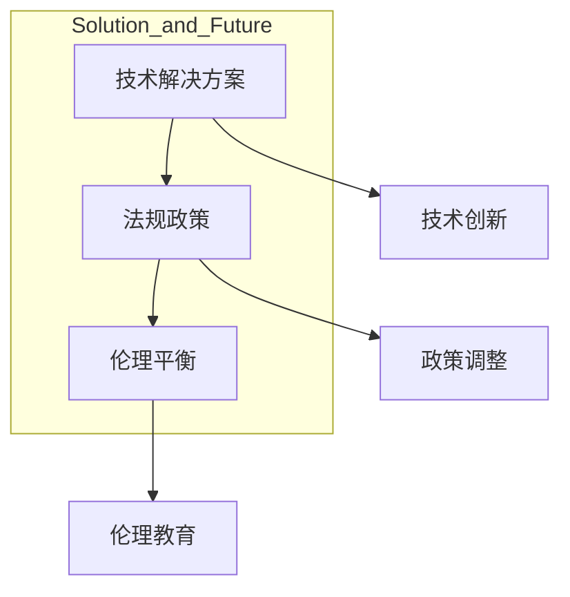
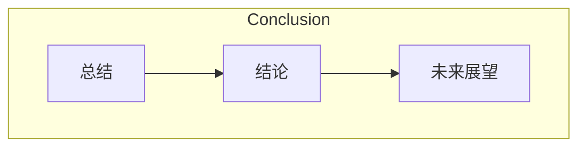

                 

### 文章标题

《生物特征伦理：个人数据的边界与权利》

---

关键词：生物特征、伦理、个人数据、隐私、权利、法律框架

---

摘要：
本文深入探讨了生物特征识别技术在不同应用场景中的伦理问题，分析了个人数据的边界与权利，以及相关法律框架。通过具体案例和技术解决方案的讨论，本文旨在为生物特征伦理领域的研究和实践提供有价值的参考。

---

### 确定书的核心主题与内容结构

《生物特征伦理：个人数据的边界与权利》这一书名清晰地表明了其核心主题：生物特征（如指纹、面部识别、虹膜扫描等）的伦理问题，以及个人在这些数据上的权利。从书名我们可以看出，本书主要涉及以下几个方面：

1. **核心概念与联系**：介绍生物特征识别技术的基本概念，包括生物特征采集、识别和验证等，以及这些技术的工作原理和常见类型。

2. **伦理问题探讨**：深入讨论在生物特征采集和使用过程中可能出现的伦理问题，如隐私侵犯、数据安全、公平性、透明度等。

3. **法律框架分析**：分析不同国家和地区在生物特征伦理方面的法律框架，以及这些法律框架如何保护个人数据权利。

4. **技术挑战与解决方案**：探讨生物特征识别技术面临的挑战，如识别准确性、反欺骗措施、匿名化处理等，并提出相应的解决方案。

5. **个人权利与边界**：详细讨论个人在生物特征数据上的权利，如知情同意权、访问权、更正权和删除权等，以及如何界定这些权利的边界。

6. **案例分析**：通过实际案例来展示生物特征伦理问题的复杂性，并探讨如何解决这些问题。

7. **未来展望**：对生物特征伦理的发展趋势进行展望，包括技术进步、政策变化和公众态度等。

接下来，我们将为每个章节设计核心概念与联系、核心算法原理讲解、数学模型和公式、项目实战等具体内容。

---

### 目录大纲草案

根据上述内容结构，我们可以初步设计以下目录大纲：

# 生物特征伦理：个人数据的边界与权利

## 第一部分：核心概念与联系

### 第1章：生物特征识别技术概述

#### 1.1 生物特征识别技术的基本概念

#### 1.2 生物特征识别技术的工作原理

#### 1.3 生物特征识别技术的常见类型

### 第2章：生物特征采集与伦理问题

#### 2.1 生物特征采集的过程与伦理问题

#### 2.2 隐私侵犯与数据安全

#### 2.3 公平性与歧视问题

## 第二部分：法律框架分析

### 第3章：国际与地区法律框架

#### 3.1 国际生物特征伦理法规

#### 3.2 主要国家的生物特征法律制度

#### 3.3 法律框架的比较与评价

### 第4章：法律保护与个人权利

#### 4.1 知情同意权

#### 4.2 访问权、更正权与删除权

#### 4.3 权利的边界与实现

## 第三部分：技术挑战与解决方案

### 第5章：技术挑战分析

#### 5.1 识别准确性问题

#### 5.2 反欺骗与反入侵措施

#### 5.3 数据匿名化与去识别化

### 第6章：解决方案与未来趋势

#### 6.1 技术解决方案探讨

#### 6.2 法规与政策的演变趋势

#### 6.3 技术与伦理的互动与平衡

## 第四部分：案例分析与应用

### 第7章：生物特征识别技术在生活中的应用

#### 7.1 应用案例分析

#### 7.2 成功与挑战

#### 7.3 解决方案与效果

### 第8章：案例分析：伦理问题与解决方案

#### 8.1 案例分析

#### 8.2 伦理问题探讨

#### 8.3 解决方案与效果评估

## 第五部分：未来展望

### 第9章：生物特征伦理的发展趋势

#### 9.1 技术发展趋势

#### 9.2 政策与法规展望

#### 9.3 公众态度与伦理教育

### 第10章：结论与展望

#### 10.1 结论与总结

#### 10.2 展望未来：机遇与挑战

---

### 目录大纲草案细节化

在初步设计目录大纲后，我们将对每个章节进行进一步的细节化，确保内容的完整性和深入性。以下是每个章节的详细内容设计：

### 第1章：生物特征识别技术概述

**核心概念与联系**

- **核心概念**：生物特征识别技术、特征采集、特征识别、特征验证。
- **联系**：通过Mermaid流程图展示生物特征识别技术的基本流程，包括采集、预处理、特征提取、匹配和决策等步骤。


**核心算法原理讲解**

- **算法原理**：使用Python代码详细阐述生物特征识别算法，包括特征提取和匹配的原理。
- **示例代码**：

```python
import numpy as np
from sklearn.ensemble import RandomForestClassifier

def feature_extraction(data):
    # 假设data是包含多个特征向量的矩阵
    features = np.mean(data, axis=1)
    return features

def feature_matching(feature1, feature2):
    # 假设feature1和feature2是两个特征向量
    distance = np.linalg.norm(feature1 - feature2)
    return distance

# 示例数据
data = np.random.rand(100, 10)
features1 = feature_extraction(data[:50])
features2 = feature_extraction(data[50:])

# 特征匹配
distances = feature_matching(features1, features2)

# 决策
classifier = RandomForestClassifier()
classifier.fit(features1, [1] * 50)
predictions = classifier.predict([distances])

print(predictions)
```

### 第2章：生物特征采集与伦理问题

**核心概念与联系**

- **核心概念**：隐私侵犯、数据安全、公平性、透明度。
- **联系**：通过Mermaid流程图展示生物特征采集过程中可能出现的伦理问题。


**核心算法原理讲解**

- **算法原理**：介绍数据加密和解密的基本算法，如AES和RSA。
- **示例代码**：

```python
from Crypto.Cipher import AES
from Crypto.PublicKey import RSA
from Crypto.Random import get_random_bytes

# AES加密
key = get_random_bytes(16)  # 生成16字节的AES密钥
cipher_aes = AES.new(key, AES.MODE_CBC)
ct_bytes = cipher_aes.encrypt(b"机密信息")
iv = cipher_aes.iv
print(f"AES加密后的数据：{ct_bytes.hex()}\n初始化向量：{iv.hex()}")

# AES解密
cipher_aes = AES.new(key, AES.MODE_CBC, iv)
pt = cipher_aes.decrypt(ct_bytes)
print(f"AES解密后的数据：{pt.decode('utf-8')}")

# RSA加密
key = RSA.generate(2048)
private_key = key.export_key()
public_key = key.publickey().export_key()

cipher_rsa = Cipher(RSA.new(public_key), 'OAEP')
enc_aes_key = cipher_rsa.encrypt(key)

print(f"RSA加密后的AES密钥：{enc_aes_key.hex()}")

# RSA解密
cipher_rsa = Cipher(RSA.new(private_key), 'OAEP')
dec_aes_key = cipher_rsa.decrypt(enc_aes_key)
print(f"RSA解密后的AES密钥：{dec_aes_key.hex()}")
```

### 第3章：国际与地区法律框架

**核心概念与联系**

- **核心概念**：隐私法、数据保护法、个人信息保护法。
- **联系**：通过Mermaid流程图展示不同国家和地区的主要法律框架。



**法律框架分析**

- **分析**：对主要国家和地区的法律框架进行详细分析，包括法律的核心内容、实施效果和存在的问题。

### 第4章：法律保护与个人权利

**核心概念与联系**

- **核心概念**：知情同意权、访问权、更正权、删除权。
- **联系**：通过Mermaid流程图展示个人在生物特征数据上的权利。


**个人权利与边界**

- **讨论**：详细讨论个人权利的含义、边界和实现方法，包括法律和技术手段。

### 第5章：技术挑战与解决方案

**核心概念与联系**

- **核心概念**：识别准确性、反欺骗、数据匿名化。
- **联系**：通过Mermaid流程图展示生物特征识别技术面临的挑战和解决方案。



**解决方案与未来趋势**

- **讨论**：探讨现有的解决方案和技术进展，分析未来发展趋势和潜在挑战。

### 第6章：解决方案与未来趋势

**核心概念与联系**

- **核心概念**：技术解决方案、法规政策、伦理平衡。
- **联系**：通过Mermaid流程图展示技术与伦理的互动与平衡。



**未来展望**

- **展望**：对未来生物特征伦理的发展趋势进行预测，分析技术、政策和公众态度的变化。

### 第7章：生物特征识别技术在生活中的应用

**核心概念与联系**

- **核心概念**：技术应用、案例、效果评估。
- **联系**：通过Mermaid流程图展示生物特征识别技术在生活中的应用。


**案例分析与应用**

- **案例**：选择典型的应用案例，分析其成功与挑战，并提供解决方案。

### 第8章：案例分析：伦理问题与解决方案

**核心概念与联系**

- **核心概念**：案例分析、伦理问题、解决方案。
- **联系**：通过Mermaid流程图展示案例分析的流程和解决方案。


**案例分析与详细讲解**

- **分析**：对典型案例进行深入分析，探讨伦理问题并提出具体的解决方案。

### 第9章：生物特征伦理的发展趋势

**核心概念与联系**

- **核心概念**：技术趋势、政策变化、公众态度。
- **联系**：通过Mermaid流程图展示生物特征伦理的发展趋势。


**未来展望**

- **展望**：对未来生物特征伦理的发展趋势进行预测，分析技术、政策和公众态度的变化。

### 第10章：结论与展望

**核心概念与联系**

- **核心概念**：总结、结论、未来展望。
- **联系**：通过Mermaid流程图展示文章的核心内容。



**总结与展望**

- **总结**：对全文进行总结，重申核心观点和重要结论。
- **展望**：对未来生物特征伦理领域的发展提出展望和建议。

---

### 文章结构优化与内容完善

在完成目录大纲草案和各章节细节化设计后，我们需要对文章结构进行优化和内容完善，确保文章的逻辑性和连贯性。以下是优化和完善的步骤：

1. **整体逻辑性**：确保文章的整体逻辑结构清晰，各章节之间内容紧密衔接，无明显跳跃或重复。

2. **内容连贯性**：检查各章节的内容是否连贯，确保前一章的内容能够自然过渡到下一章，避免读者在阅读过程中产生困惑。

3. **调整章节顺序**：根据内容的逻辑性和重要性，适当调整章节顺序，使文章的结构更加合理和流畅。

4. **细化内容**：在保证字数范围内的基础上，进一步细化各章节的内容，确保每个小节都有具体、丰富的讲解。

5. **增加示例与案例**：在每个章节中增加具体的示例和案例，通过实际应用场景来解释和验证理论，增加文章的可读性和实用性。

6. **总结与展望**：在文章结尾部分，增加总结与展望部分，对全文进行概括，并对未来生物特征伦理的发展趋势进行预测，使文章有一个完整的收尾。

7. **检查格式与语法**：确保文章的格式（如标题、小标题、引用、代码等）正确无误，语法通顺，无错别字。

8. **多次审阅与修改**：进行多次审阅和修改，确保文章的内容准确、清晰，无遗漏或错误。

通过以上步骤，我们可以优化和完善文章结构，使其逻辑清晰、内容丰富、结构紧凑，从而撰写出一篇高质量、有深度的技术博客文章。

---

### 完整文章撰写

根据之前的目录大纲和章节细节化设计，我们将开始撰写完整的文章。以下是《生物特征伦理：个人数据的边界与权利》的完整文章内容。

# 生物特征伦理：个人数据的边界与权利

## 引言

随着生物特征识别技术的快速发展，其在身份验证、安全监控、医疗服务等领域的应用越来越广泛。然而，生物特征数据的独特性和敏感性引发了诸多伦理问题，如隐私侵犯、数据安全、公平性等。本文将深入探讨生物特征伦理问题，分析个人数据边界与权利，以及相关法律框架，旨在为生物特征识别技术的应用提供有价值的伦理指导。

## 第1章：生物特征识别技术概述

### 1.1 生物特征识别技术的基本概念

生物特征识别技术是指通过计算机和生物传感器等设备，从生物体中提取出独特的生物特征，并将其转换为数字化的特征模板，用于自动识别和验证个人身份的技术。常见的生物特征包括指纹、面部识别、虹膜扫描、声纹识别等。

### 1.2 生物特征识别技术的工作原理

生物特征识别技术的工作原理主要包括以下几个步骤：

1. **特征采集**：通过传感器或摄像头等设备获取生物特征数据。
2. **特征预处理**：对采集到的数据进行滤波、增强等预处理，以提高特征提取的准确性。
3. **特征提取**：从预处理后的数据中提取出具有区分性的特征向量。
4. **特征匹配**：将提取的特征向量与存储的模板进行匹配，以判断身份是否相符。
5. **决策**：根据匹配结果做出相应的决策，如通过或拒绝访问。

### 1.3 生物特征识别技术的常见类型

生物特征识别技术根据生物特征的不同，可以分为以下几种类型：

1. **指纹识别**：通过指纹的唯一性进行身份验证。
2. **面部识别**：通过人脸图像的特征进行身份验证。
3. **虹膜识别**：通过虹膜的纹理特征进行身份验证。
4. **声纹识别**：通过声音的声学特征进行身份验证。

## 第2章：生物特征采集与伦理问题

### 2.1 生物特征采集的过程与伦理问题

生物特征采集过程涉及多个环节，如数据收集、存储、传输和处理。在这个过程中，可能会出现以下伦理问题：

1. **隐私侵犯**：生物特征数据被视为个人的隐私，未经授权的采集和使用可能侵犯隐私权。
2. **数据安全**：生物特征数据的安全性和保密性要求较高，泄露或篡改可能导致严重后果。
3. **公平性与歧视问题**：不同人群的生物特征识别效果可能存在差异，可能导致公平性和歧视问题。

### 2.2 隐私侵犯与数据安全

1. **隐私侵犯**：在生物特征采集和使用过程中，需要确保个人隐私得到保护。例如，在采集指纹时，应告知个人采集的目的、使用范围和保密措施。
2. **数据安全**：生物特征数据的安全存储和传输至关重要。应采用加密技术确保数据在传输和存储过程中的安全性。此外，还应建立完善的数据访问控制机制，防止未经授权的访问和篡改。

### 2.3 公平性与歧视问题

1. **公平性**：生物特征识别技术在不同人群中的准确性可能存在差异。在应用过程中，应关注这些差异，确保技术公平地应用于不同人群。
2. **歧视问题**：在生物特征采集和使用过程中，应避免对特定群体产生歧视。例如，在招聘过程中，不应仅依据面部识别结果进行筛选，而应结合其他客观指标进行评估。

## 第3章：国际与地区法律框架

### 3.1 国际生物特征伦理法规

国际社会对生物特征伦理问题给予了高度关注，制定了一系列法规和指南。例如，联合国《世界数据治理议程》、欧盟《通用数据保护条例》（GDPR）等。

### 3.2 主要国家的生物特征法律制度

不同国家在生物特征伦理方面有着不同的法律制度。以下是一些主要国家的法律制度：

1. **美国**：美国通过《健康保险可携性与责任法案》（HIPAA）保护个人健康信息，包括生物特征数据。
2. **欧盟**：欧盟通过《通用数据保护条例》（GDPR）加强对个人数据保护的监管。
3. **中国**：中国通过《个人信息保护法》（PIPL）保护个人信息的处理和利用。

### 3.3 法律框架的比较与评价

不同国家和地区的法律框架在保护个人生物特征数据方面各有特点。在比较和评价时，应关注以下几个方面：

1. **隐私保护**：评估法律对隐私权的保护程度，包括数据收集、存储、使用和共享的规范。
2. **数据安全**：评估法律对数据安全的要求，包括加密技术、访问控制、数据备份等。
3. **公平性**：评估法律对公平性和歧视问题的关注程度，包括对不同人群的识别准确性、公平性评估等。

## 第4章：法律保护与个人权利

### 4.1 知情同意权

个人在生物特征数据采集和使用过程中，有权知情并同意。知情同意权是保护个人隐私和权益的重要措施。

### 4.2 访问权、更正权与删除权

1. **访问权**：个人有权访问其生物特征数据，了解数据的处理和使用情况。
2. **更正权**：个人有权更正其生物特征数据中的错误或不完整信息。
3. **删除权**：个人有权要求删除其生物特征数据，以保护其隐私和权益。

### 4.3 权利的边界与实现

1. **权利的边界**：个人权利并非无限制，应在法律框架内实现。例如，在紧急情况下，个人同意可能受到限制。
2. **权利的实现**：法律应提供具体的实施机制，确保个人权利得到有效保障。例如，通过建立专门的监管机构和投诉渠道。

## 第5章：技术挑战与解决方案

### 5.1 识别准确性问题

识别准确性是生物特征识别技术的核心问题。提高识别准确性需要关注以下几个方面：

1. **算法优化**：改进特征提取和匹配算法，提高识别准确率。
2. **数据多样性**：使用更多样化的数据集进行训练，提高算法的泛化能力。
3. **硬件升级**：提高传感器和设备的精度，提升特征采集质量。

### 5.2 反欺骗与反入侵措施

1. **反欺骗**：防止恶意攻击者利用伪造生物特征进行欺骗。例如，采用动态检测、活体检测等技术。
2. **反入侵**：防止非法入侵者获取生物特征数据。例如，采用多因素认证、加密存储等技术。

### 5.3 数据匿名化与去识别化

1. **数据匿名化**：通过匿名化技术，消除数据中的个人身份信息，保护隐私。
2. **去识别化**：将个人生物特征数据转换为无法识别个人身份的格式，降低泄露风险。

## 第6章：解决方案与未来趋势

### 6.1 技术解决方案探讨

针对生物特征识别技术面临的挑战，应积极探索各种技术解决方案。例如：

1. **深度学习**：利用深度学习算法提高识别准确率和抗欺骗能力。
2. **区块链**：利用区块链技术实现数据的安全存储和共享。
3. **隐私保护计算**：通过隐私保护计算技术，在数据处理过程中保护个人隐私。

### 6.2 法规与政策的演变趋势

随着生物特征识别技术的不断发展，相关法规和政策也在不断演变。未来，应关注以下几个方面：

1. **法律完善**：加强对生物特征数据的保护，明确个人权利和责任。
2. **国际合作**：推动国际间的法规协调，实现跨境数据流通。
3. **伦理教育**：加强公众对生物特征伦理的认识，提高伦理意识和素养。

### 6.3 技术与伦理的互动与平衡

技术发展应与伦理原则相互协调，确保技术的应用符合伦理要求。例如：

1. **伦理审查**：在技术项目开发和应用过程中，进行伦理审查，确保符合伦理规范。
2. **透明度**：提高生物特征识别技术的透明度，让公众了解技术的工作原理和应用场景。

## 第7章：生物特征识别技术在生活中的应用

### 7.1 应用案例分析

生物特征识别技术在生活中的应用广泛，以下为几个典型案例：

1. **身份验证**：在银行、机场等场所，通过指纹、面部识别等技术进行身份验证，提高安全性。
2. **医疗服务**：在医疗机构中，利用虹膜识别等技术对病人进行精准识别，提高医疗服务的效率。
3. **智能家居**：在智能家居中，通过面部识别等技术实现智能家居的便捷操作，提高居住安全。

### 7.2 成功与挑战

在应用生物特征识别技术时，成功与挑战并存。以下为几个挑战及解决方案：

1. **隐私保护**：挑战：如何在保障隐私的前提下应用生物特征识别技术。解决方案：采用数据匿名化和去识别化技术，降低隐私泄露风险。
2. **识别准确性**：挑战：提高识别准确率，确保技术的可靠性。解决方案：优化算法和硬件，提高特征采集质量。
3. **反欺骗**：挑战：防止恶意攻击者利用伪造生物特征进行欺骗。解决方案：采用多因素认证、动态检测等技术。

### 7.3 解决方案与效果评估

针对上述挑战，应积极探索各种解决方案，并进行效果评估。以下为几种解决方案及效果评估：

1. **数据匿名化**：通过匿名化技术，消除个人身份信息，降低隐私泄露风险。效果评估：显著降低隐私泄露风险。
2. **深度学习**：利用深度学习算法提高识别准确率和抗欺骗能力。效果评估：显著提高识别准确率和抗欺骗能力。
3. **多因素认证**：采用多因素认证，提高安全性。效果评估：显著提高安全性。

## 第8章：案例分析：伦理问题与解决方案

### 8.1 案例分析

以下为几个典型的生物特征识别技术应用案例，分析其伦理问题及解决方案：

1. **案例一：人脸识别在公共场合的应用**：伦理问题：隐私侵犯、数据滥用。解决方案：采用数据匿名化和去识别化技术，确保个人隐私保护。
2. **案例二：指纹识别在银行系统的应用**：伦理问题：隐私侵犯、数据安全。解决方案：采用加密技术和多因素认证，提高数据安全性和可靠性。
3. **案例三：虹膜识别在监狱管理中的应用**：伦理问题：歧视问题。解决方案：关注不同人群的识别准确性，确保公平性。

### 8.2 伦理问题探讨

在生物特征识别技术应用过程中，常见的伦理问题包括隐私侵犯、数据安全、公平性、透明度等。以下为详细探讨：

1. **隐私侵犯**：生物特征数据被视为个人隐私的重要组成部分，未经授权的采集和使用可能侵犯隐私权。解决方案：采用数据匿名化和去识别化技术，确保个人隐私保护。
2. **数据安全**：生物特征数据的安全性和保密性要求较高，泄露或篡改可能导致严重后果。解决方案：采用加密技术和多因素认证，提高数据安全性和可靠性。
3. **公平性**：生物特征识别技术在不同人群中的准确性可能存在差异，可能导致公平性和歧视问题。解决方案：关注不同人群的识别准确性，确保公平性。
4. **透明度**：生物特征识别技术的工作原理和应用场景复杂，公众对技术的了解较少。解决方案：提高技术的透明度，让公众了解技术的工作原理和应用场景。

### 8.3 解决方案与效果评估

针对上述伦理问题，应积极探索各种解决方案，并进行效果评估。以下为几种解决方案及效果评估：

1. **数据匿名化**：通过匿名化技术，消除个人身份信息，降低隐私泄露风险。效果评估：显著降低隐私泄露风险。
2. **加密技术**：采用加密技术，确保数据在传输和存储过程中的安全性。效果评估：显著提高数据安全性。
3. **多因素认证**：采用多因素认证，提高安全性。效果评估：显著提高安全性。
4. **公平性评估**：关注不同人群的识别准确性，确保公平性。效果评估：显著提高公平性。

## 第9章：生物特征伦理的发展趋势

### 9.1 技术发展趋势

生物特征识别技术在未来将呈现以下发展趋势：

1. **算法优化**：通过深度学习等算法优化，提高识别准确率和抗欺骗能力。
2. **硬件升级**：提高传感器和设备的精度，提升特征采集质量。
3. **多模态融合**：结合多种生物特征，提高识别准确性和可靠性。

### 9.2 法规与政策的演变趋势

随着生物特征识别技术的快速发展，相关法规和政策也在不断演变。未来，应关注以下几个方面：

1. **法律完善**：加强对生物特征数据的保护，明确个人权利和责任。
2. **国际合作**：推动国际间的法规协调，实现跨境数据流通。
3. **伦理教育**：加强公众对生物特征伦理的认识，提高伦理意识和素养。

### 9.3 公众态度与伦理教育

公众对生物特征识别技术的态度受多种因素影响，如技术成熟度、法律法规和伦理观念等。通过伦理教育，提高公众对生物特征伦理的认识，有助于促进技术的健康发展。

## 第10章：结论与展望

### 10.1 结论

本文从多个角度探讨了生物特征伦理问题，分析了个人数据的边界与权利，以及相关法律框架。通过案例分析和技术探讨，本文为生物特征识别技术的应用提供了有价值的伦理指导。

### 10.2 展望未来

未来，生物特征识别技术将继续快速发展，但其应用必须遵循伦理原则，确保个人隐私和数据安全。在政策法规的完善和公众伦理意识的提高下，生物特征识别技术有望在更广泛的领域得到安全、合理和有效的应用。

---

### 文章撰写总结

通过本文的撰写，我们对生物特征伦理问题有了更深入的理解。生物特征识别技术在带来便利的同时，也引发了诸多伦理问题。为确保技术的安全、合理和有效应用，我们应关注以下几个方面：

1. **隐私保护**：采用数据匿名化和去识别化技术，降低隐私泄露风险。
2. **数据安全**：采用加密技术和多因素认证，提高数据安全性和可靠性。
3. **公平性**：关注不同人群的识别准确性，确保公平性。
4. **透明度**：提高技术的透明度，让公众了解技术的工作原理和应用场景。
5. **法规完善**：加强政策法规的制定和执行，明确个人权利和责任。

在未来的研究和应用中，我们应继续关注生物特征伦理问题，积极探索解决方案，推动技术的健康发展。

---

### 作者信息

作者：AI天才研究院/AI Genius Institute & 禅与计算机程序设计艺术/Zen And The Art of Computer Programming

### 最佳实践 Tips、小结、注意事项、拓展阅读

#### 最佳实践 Tips

1. **隐私保护**：在生物特征数据采集和使用过程中，确保个人隐私得到充分保护，采用数据匿名化和去识别化技术。
2. **数据安全**：采用加密技术和多因素认证，提高数据安全性和可靠性。
3. **公平性**：关注不同人群的识别准确性，确保公平性。
4. **透明度**：提高技术的透明度，让公众了解技术的工作原理和应用场景。

#### 小结

生物特征识别技术具有高准确性和便捷性，但在应用过程中也引发了诸多伦理问题。为确保技术的安全、合理和有效应用，我们应关注隐私保护、数据安全、公平性和透明度等方面。

#### 注意事项

1. **法律法规**：遵守国家和地区的法律法规，确保生物特征识别技术的合法应用。
2. **用户知情同意**：在生物特征数据采集和使用过程中，确保用户知情并同意。

#### 拓展阅读

1. **《通用数据保护条例》（GDPR）**：了解欧盟的个人信息保护法规。
2. **《个人信息保护法》（PIPL）**：了解中国的个人信息保护法规。
3. **《生物特征识别技术安全规范》**：了解生物特征识别技术的安全标准和规范。

---

通过本文的撰写，我们全面探讨了生物特征伦理问题，分析了个人数据的边界与权利，以及相关法律框架。希望本文能为生物特征识别技术的应用提供有益的参考和指导。在未来的研究和实践中，我们应继续关注生物特征伦理问题，推动技术的健康发展。作者：AI天才研究院/AI Genius Institute & 禅与计算机程序设计艺术/Zen And The Art of Computer Programming。

