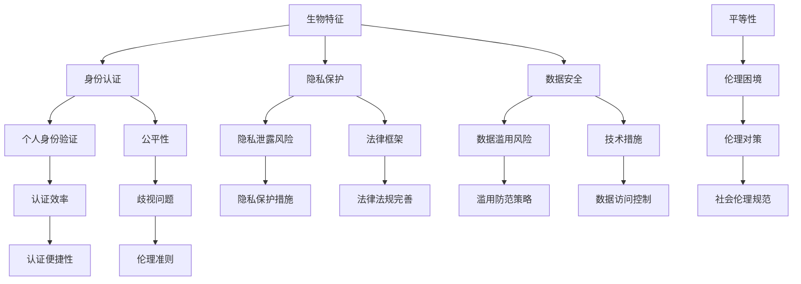

                 

### 背景介绍

在当今数字化时代，身份认证已成为社会运行的重要一环。随着科技的飞速发展，生物特征识别技术逐渐成为身份认证的主流手段。生物特征识别（Biometric Recognition）利用人体生物特征的唯一性和稳定性，如指纹、虹膜、面部、声纹等，对个体进行身份验证。这一技术的出现，极大地提升了身份认证的安全性和便捷性。

然而，随着生物特征识别技术的广泛应用，其伦理困境也日益凸显。身份认证技术的核心在于保障个人隐私和数据安全，但这一过程中却面临着诸多伦理挑战。首先，个人隐私保护问题尤为突出。生物特征数据一旦泄露，将对个人造成不可逆的损害。其次，个人信息滥用问题也日益严峻。生物特征数据的滥用可能导致严重的歧视和社会不公平现象。最后，平等性问题同样不容忽视。生物特征识别技术在不同人群中的公平性和有效性可能存在差异，导致某些群体受到不公平对待。

本博客文章将深入探讨生物特征识别技术在身份认证中的应用及其伦理困境。首先，我们将介绍生物特征识别的基本概念和技术发展历程，并解释其工作原理。接着，我们将探讨身份认证技术及其应用，重点分析生物特征识别在身份认证中的优势与挑战。随后，我们将讨论身份认证技术引发的伦理困境，包括数据隐私保护、个人信息滥用和平等性问题。在此基础上，我们将提出相应的伦理对策，如法律法规、技术措施和社会伦理规范。最后，我们将展望生物特征识别技术的未来发展趋势，探讨可能面临的伦理挑战及其应对策略。

通过本文的探讨，我们旨在引发读者对于生物特征识别技术的深刻思考，从而推动其在实际应用中的伦理规范与健康发展。

### 核心概念与联系

在探讨生物特征识别技术之前，我们需要了解几个核心概念及其相互关系。生物特征识别技术涉及多个关键概念，包括生物特征、身份认证、隐私保护、数据安全等。以下是一个简化的概念关系架构 Mermaid 流程图，用于解释这些概念及其相互联系：

以下是每个概念的具体解释及其关系：

1. **生物特征（A）**：指人体固有的、唯一的生理和生物特征，如指纹、虹膜、面部、声纹等。这些特征用于个体识别和身份验证。

2. **身份认证（B）**：是指通过验证个人身份来确定其访问权限或其他操作权限的过程。身份认证可以是单因素认证、双因素认证或多因素认证。

3. **隐私保护（C）**：涉及保护个人隐私，防止隐私泄露和滥用。隐私保护包括法律框架和技术措施，如加密、匿名化、数据访问控制等。

4. **数据安全（D）**：确保生物特征数据在整个生命周期中不被未经授权的访问、篡改或泄露。数据安全措施包括加密、安全存储、数据备份等。

5. **个人身份验证（E）**：是身份认证的一部分，通过验证个人的生物特征来确认其身份。个人身份验证的效率（N）和便捷性（T）是评估生物特征识别技术的重要指标。

6. **隐私泄露风险（F）**：由于生物特征数据一旦泄露难以恢复，隐私泄露风险对个人隐私保护构成严重威胁。

7. **数据滥用风险（G）**：指生物特征数据可能被滥用，如用于非法监视、跟踪、歧视等。

8. **公平性（H）**：涉及生物特征识别技术在不同人群中的公平性，确保所有人都能平等地使用和受益于这项技术。

9. **伦理困境（J）**：包括隐私权（C）、平等权（I）和自由权（M）的冲突，这些问题需要在技术和社会层面进行解决。

10. **法律框架（K）**：为隐私保护（C）和数据安全（D）提供法律保障，如数据保护法、隐私法等。

11. **技术措施（L）**：用于加强隐私保护和数据安全，如加密、匿名化、数据访问控制等。

12. **歧视问题（M）**：由于生物特征识别技术的算法和设备可能存在偏差，可能导致某些群体受到不公平对待。

13. **伦理准则（S）**：为生物特征识别技术的伦理应用提供指导，如伦理委员会的制定和实施。

14. **认证效率（N）**：指生物特征识别技术进行个人身份验证的速度和准确性。

15. **伦理对策（U）**：包括法律法规、技术措施和社会伦理规范，旨在解决生物特征识别技术中的伦理困境。

16. **社会伦理规范（V）**：涉及社会对生物特征识别技术的伦理认知和规范，如伦理教育和公众意识提升。

通过上述概念及其关系的理解，我们可以更全面地把握生物特征识别技术的应用及其面临的伦理挑战，为后续章节的深入探讨打下坚实的基础。

### 生物特征识别技术的基本概念

生物特征识别（Biometric Recognition）是一种利用人体生物特征的唯一性和稳定性进行身份验证的技术。这一技术通过捕捉和分析人体的生理或行为特征，如指纹、虹膜、面部、声纹等，以实现对个体的独特识别。生物特征识别技术的基本概念主要包括以下几个方面：

#### 1.1 生物特征识别的概述

生物特征识别技术的核心在于“生物特征”（Biometric Feature）。生物特征是指人体固有的、与个体身份相关联的生理或行为特征。根据特征类型的不同，生物特征识别技术可分为多种类型，主要包括：

1. **指纹识别（Fingerprint Recognition）**：利用指纹的纹理特征进行身份验证。指纹具有高度的独特性和稳定性，是常见的生物特征识别手段。
   
2. **虹膜识别（Iris Recognition）**：通过分析虹膜的纹理和结构特征进行身份验证。虹膜识别具有高准确性和快速性，被广泛应用于安全系统中。

3. **面部识别（Facial Recognition）**：利用面部特征，如眼睛、鼻子、嘴巴和面部轮廓等，进行身份验证。面部识别技术因其在非接触式身份验证和大规模监控中的优势而备受关注。

4. **声纹识别（Voice Recognition）**：通过分析声音的频率、音调、音色等特征进行身份验证。声纹识别技术在电话银行和智能家居等领域有广泛应用。

5. **掌纹识别（Palmprint Recognition）**：利用掌纹的纹理特征进行身份验证。掌纹识别在安全性要求较高的领域，如监狱和银行等，有广泛应用。

6. **血管识别（Vascular Recognition）**：通过分析皮肤下的血管模式进行身份验证。血管识别技术在某些专业领域中具有独特优势，但应用范围相对有限。

7. **步态识别（Gait Recognition）**：通过分析人的行走姿态和步态特征进行身份验证。步态识别技术具有较高的隐蔽性和非接触性，被用于安全监控和远程身份验证。

#### 1.2 常见的生物特征

以下是几种常见的生物特征及其特点：

1. **指纹识别**：指纹是人体皮肤上的凹凸纹理，具有高度的个体差异和稳定性。指纹识别技术通过采集和比对指纹图像，实现高精度的身份验证。

2. **虹膜识别**：虹膜是眼睛内部的一个环状结构，包含丰富的纹理信息。虹膜识别技术具有高准确性和快速性，在身份验证中具有很高的可靠性。

3. **面部识别**：面部识别技术通过分析面部特征，如眼睛、鼻子、嘴巴和面部轮廓等，实现身份验证。面部识别技术在非接触式身份验证和大规模监控中具有显著优势。

4. **声纹识别**：声纹是个人声音的独特特征，包括频率、音调、音色等。声纹识别技术通过分析声纹信号，实现身份验证，被广泛应用于电话银行和智能家居等领域。

5. **掌纹识别**：掌纹识别技术通过采集和分析手掌的纹理特征，实现身份验证。掌纹识别在安全性要求较高的领域，如监狱和银行等，有广泛应用。

6. **血管识别**：血管识别技术通过分析皮肤下的血管模式，实现身份验证。血管识别技术在某些专业领域中具有独特优势，如医疗诊断和安全监测。

7. **步态识别**：步态识别技术通过分析人的行走姿态和步态特征，实现身份验证。步态识别技术具有较高的隐蔽性和非接触性，被用于安全监控和远程身份验证。

#### 1.3 生物特征识别技术的发展历程

生物特征识别技术经历了从早期实验研究到现代大规模应用的发展历程。以下是生物特征识别技术的主要发展历程：

1. **早期发展（20世纪60年代）**：生物特征识别技术的研究开始于20世纪60年代，主要集中于指纹识别和声纹识别。这些早期技术主要基于手工处理和简单的图像分析。

2. **初期阶段（20世纪80年代）**：随着计算机技术和图像处理算法的发展，生物特征识别技术逐渐走向实用化。指纹识别和面部识别技术在这一时期取得显著进展。

3. **快速发展阶段（20世纪90年代）**：生物特征识别技术迎来了快速发展阶段。虹膜识别技术在这一时期被发明并迅速应用。此外，声纹识别、掌纹识别和步态识别技术也逐渐成熟。

4. **现代应用阶段（21世纪）**：随着人工智能和机器学习技术的发展，生物特征识别技术取得了突破性进展。现代生物特征识别系统具有高准确性、快速性和便捷性，被广泛应用于政府、金融、企业和医疗等领域。

5. **未来展望**：未来，生物特征识别技术将继续发展，新技术如三维面部识别、虹膜识别和微表情识别等将不断涌现。同时，生物特征识别技术在隐私保护、数据安全和伦理问题等方面的挑战也将得到更多关注和解决。

通过上述对生物特征识别技术基本概念的介绍，我们可以更好地理解其工作原理和应用场景，为后续章节的深入探讨打下基础。

### 生物特征识别技术的工作原理

生物特征识别技术的工作原理涉及多个关键步骤，包括生物特征的采集与预处理、特征提取、匹配算法和分类算法等。以下我们将详细解释这些步骤及其相关的技术细节。

#### 2.1 生物特征的采集与预处理

生物特征的采集是生物特征识别技术的第一步，这一过程涉及到多种传感器和设备，如指纹采集器、虹膜扫描仪、面部摄像头和麦克风等。以下是几种常见生物特征采集方式的详细解释：

1. **指纹采集**：指纹采集器通过光学传感器或电容传感器捕捉指纹图像。光学传感器使用LED光源照亮手指，然后捕捉手指表面的图像。电容传感器则通过测量手指与传感器之间的电容变化来生成指纹图像。

2. **虹膜采集**：虹膜扫描仪通常使用高分辨率摄像头在暗室环境下捕捉虹膜图像。图像捕捉过程中，需要确保眼睛注视一个特定的光源，以减少外界干扰。采集到的图像随后通过图像处理算法进行增强和去噪。

3. **面部采集**：面部摄像头通过捕捉面部图像来进行面部识别。摄像头可以捕捉不同角度的面部图像，并使用3D建模技术来生成三维面部模型。

4. **声纹采集**：麦克风捕捉声音信号，并使用数字信号处理技术将其转换为数字信号。声纹采集过程中，需要确保语音的清晰度和稳定性，以减少噪声和混淆。

采集到的生物特征图像或声音信号通常需要进行预处理，以提高后续处理的准确性和效率。预处理步骤包括图像的灰度化、滤波、二值化、噪声去除等。例如，对于指纹图像，可以使用高斯滤波器去除噪声，使用Sobel算子进行边缘检测，以提取清晰的指纹纹理。

#### 2.2 特征提取

特征提取是生物特征识别技术的核心步骤，目的是从原始生物特征数据中提取出具有鉴别能力的特征向量。以下是几种常见的特征提取方法：

1. **指纹特征提取**：指纹特征提取通常使用脊线方向、端点和分叉点等特征。这些特征通过区域增长算法或全局特征提取算法（如Ridge-Valley特征）进行提取。提取出的特征向量可以用来表示个体的指纹身份。

2. **虹膜特征提取**：虹膜特征提取主要通过纹理特征和形态学特征来实现。纹理特征包括局部灰度分布、频率分布和相位特征等。形态学特征包括斑点、裂隙、环和螺旋等。这些特征通过滤波、边缘检测和形态学操作等方法提取。

3. **面部特征提取**：面部特征提取主要包括几何特征和纹理特征。几何特征包括面部关键点的位置和距离，如眼睛、鼻子和嘴巴的位置。纹理特征包括皮肤纹理的局部灰度变化和频率分布。面部特征提取通常使用机器学习和深度学习算法，如卷积神经网络（CNN）进行。

4. **声纹特征提取**：声纹特征提取主要关注音高、音强、音长和共振峰等参数。这些参数通过短时傅里叶变换（STFT）或梅尔频率倒谱系数（MFCC）进行提取。MFCC是一种常用的声纹特征提取方法，能够有效地捕捉声音的频谱特征。

#### 2.3 匹配算法

匹配算法是生物特征识别技术的关键步骤，用于将提取出的特征向量与存储在数据库中的模板进行比对，以确定身份。以下是几种常见的匹配算法：

1. **欧氏距离匹配**：欧氏距离是一种最简单的匹配算法，通过计算特征向量之间的欧氏距离来确定匹配度。距离越小，匹配度越高。欧氏距离匹配计算简单，但可能受到噪声和异常值的影响。

2. **汉明距离匹配**：汉明距离适用于二进制特征向量，通过计算特征向量之间的差异位（即汉明距离）来确定匹配度。汉明距离匹配在二进制特征提取中具有优势，如指纹识别。

3. **相关性匹配**：相关性匹配通过计算特征向量之间的相关系数来确定匹配度。相关系数越高，匹配度越高。相关性匹配适用于多维度连续特征向量，如声纹识别。

4. **最小分类器距离**：最小分类器距离是一种基于统计学的匹配算法，通过构建分类器来评估特征向量之间的相似性。最小分类器距离匹配具有较高的准确性和鲁棒性，但计算复杂度较高。

#### 2.4 分类算法

分类算法在生物特征识别技术中用于对特征向量进行分类，以确定身份。以下是几种常见的分类算法：

1. **支持向量机（SVM）**：SVM是一种监督学习算法，通过寻找最优分类超平面，将不同类别的特征向量分离。SVM在生物特征识别中具有较好的分类性能和鲁棒性。

2. **决策树**：决策树通过一系列条件判断，将特征空间划分成多个区域，并对每个区域分配类别标签。决策树算法简单易懂，但可能受到过拟合问题的影响。

3. **随机森林**：随机森林是一种集成学习算法，通过构建多棵决策树并综合其预测结果进行分类。随机森林在处理高维度数据和避免过拟合方面具有优势。

4. **卷积神经网络（CNN）**：CNN是一种深度学习算法，通过卷积层、池化层和全连接层等多个层次进行特征提取和分类。CNN在图像和视频数据上具有卓越的分类性能。

综上所述，生物特征识别技术的工作原理包括生物特征的采集与预处理、特征提取、匹配算法和分类算法等多个步骤。这些步骤相互关联，共同确保了生物特征识别系统的高准确性和可靠性。在接下来的章节中，我们将探讨生物特征识别技术在身份认证中的应用及其面临的伦理挑战。

### 生物特征识别在身份认证中的应用

生物特征识别技术因其高准确性和非易失性，已广泛应用于身份认证领域。身份认证是通过验证个人身份来确保其访问权限或其他操作权限的过程。生物特征识别在身份认证中的应用主要表现在多个领域，包括政府、金融、企业、医疗和智能家居等。

#### 4.1 政府领域

在政府领域，生物特征识别技术被广泛应用于公民身份验证、选举投票、出入境管理和公共安全等领域。例如：

1. **公民身份验证**：政府通过生物特征识别技术，如指纹和面部识别，来建立公民身份数据库，确保身份信息的唯一性和准确性。这有助于减少身份欺诈和伪造证件的问题。

2. **选举投票**：生物特征识别技术可以用于选举投票系统的身份验证，防止选民身份假冒和重复投票。例如，某些国家和地区已采用指纹识别技术进行投票身份验证。

3. **出入境管理**：生物特征识别技术，如指纹和虹膜识别，被用于出入境管理和边境控制。这些技术有助于提高出入境的效率，同时确保边境安全。

4. **公共安全**：生物特征识别技术被用于监控和识别犯罪嫌疑人。例如，面部识别技术可用于监控犯罪嫌疑人的活动，提高犯罪预防和安全管理的水平。

#### 4.2 金融领域

在金融领域，生物特征识别技术被广泛用于银行、支付和证券交易等领域的身份验证，以提高交易的安全性和便利性。例如：

1. **银行**：银行通过生物特征识别技术，如指纹和面部识别，来确保用户身份的准确性，防止恶意欺诈和盗刷。生物特征识别技术还可以用于开户、身份验证和交易授权等环节。

2. **支付**：生物特征识别技术，如指纹和声纹识别，被应用于移动支付和电子钱包。这些技术确保支付过程中用户身份的合法性和安全性，提高了支付的便捷性。

3. **证券交易**：证券交易机构通过生物特征识别技术，如指纹和面部识别，来验证交易人员的身份，确保交易过程的安全和合规。

#### 4.3 企业领域

在企业领域，生物特征识别技术被广泛应用于员工身份验证、门禁控制和内部安全等方面，以提高企业的安全管理水平。例如：

1. **员工身份验证**：企业通过生物特征识别技术，如指纹和面部识别，来确保员工身份的准确性，防止未经授权的人员进入关键区域。

2. **门禁控制**：生物特征识别技术被用于门禁系统，确保只有授权人员才能进入特定区域。这有助于提高企业的安全防范能力。

3. **内部安全**：生物特征识别技术被用于监控员工行为和活动，确保内部安全管理。例如，通过面部识别技术监控员工的工作时间和行为，提高工作效率和纪律性。

#### 4.4 医疗领域

在医疗领域，生物特征识别技术被用于患者身份验证、病历管理和医疗设备控制等方面，以提高医疗服务的安全性和效率。例如：

1. **患者身份验证**：医院通过生物特征识别技术，如指纹和面部识别，来确保患者身份的准确性，防止医疗事故和误诊。

2. **病历管理**：生物特征识别技术用于管理患者的病历，确保病历信息的准确性和安全性。这有助于提高医疗服务的质量和效率。

3. **医疗设备控制**：生物特征识别技术被用于控制医疗设备的操作权限，确保只有授权人员才能操作关键设备，提高医疗设备的安全性和可靠性。

#### 4.5 智能家居领域

在智能家居领域，生物特征识别技术被广泛应用于门锁、智能摄像头和家电控制等方面，以提高家居的安全性和便利性。例如：

1. **门锁**：智能家居门锁通过生物特征识别技术，如指纹和面部识别，来确保住户身份的准确性，防止未经授权的人员进入住宅。

2. **智能摄像头**：智能家居摄像头通过面部识别技术，实时监控家庭成员的活动，并提供安全警报。这有助于提高家庭的安全防范能力。

3. **家电控制**：生物特征识别技术被用于控制智能家居设备的操作权限，确保只有家庭成员才能使用家电，提高家居的智能化和便捷性。

总之，生物特征识别技术在身份认证中的应用场景广泛，具有显著的安全性和便利性优势。然而，其广泛应用也带来了一系列伦理挑战，包括隐私保护、个人信息滥用和平等性问题。在后续章节中，我们将深入探讨这些伦理困境及其解决方案。

### 身份认证技术的伦理困境

随着生物特征识别技术在身份认证中的广泛应用，其带来的伦理困境也日益凸显。这些困境主要集中在数据隐私保护、个人信息滥用和平等性三个方面。以下我们将详细讨论这些伦理困境及其具体表现。

#### 5.1 数据隐私保护

生物特征识别技术的核心在于采集和存储个体的生物特征数据，这些数据一旦泄露，将对个人隐私造成严重威胁。以下是数据隐私保护面临的主要挑战：

1. **隐私泄露的风险**：生物特征数据具有唯一性和非易失性，一旦泄露，难以恢复。例如，2017年美国信用报告公司Equifax的数据泄露事件，涉及1.43亿用户的个人信息，其中包括生物特征数据。这类事件不仅对用户隐私构成威胁，还可能导致严重的经济损失和社会恐慌。

2. **隐私保护的法律框架**：尽管许多国家已经制定了相关法律来保护个人隐私，但这些法律的执行力度和范围仍然有限。例如，欧盟的通用数据保护条例（GDPR）对数据隐私保护提供了较为严格的规定，但在全球范围内，各国法律的一致性和执行力度存在较大差异。

3. **隐私保护的技术措施**：为了保护生物特征数据，许多技术措施被提出并应用于实际中，如数据加密、匿名化和访问控制等。数据加密可以通过加密算法将生物特征数据转换为密文，确保数据在存储和传输过程中的安全性。匿名化技术通过去除或模糊化个体身份信息，使生物特征数据难以与真实个体关联。访问控制技术通过限制对数据的访问权限，确保只有授权人员才能访问敏感数据。

尽管上述技术措施在一定程度上提高了数据隐私保护水平，但仍然面临诸多挑战。例如，加密技术虽然能够保护数据的安全，但加密算法本身可能存在漏洞，且破解技术也在不断进步。匿名化技术虽然在保护隐私方面有优势，但可能影响生物特征识别系统的准确性。访问控制技术需要确保权限管理严格，以防止内部人员的恶意行为。

#### 5.2 个人信息滥用

生物特征识别技术的广泛应用也带来了个人信息滥用的风险，这可能导致一系列负面影响，包括非法监视、跟踪和歧视等。

1. **滥用案例**：个人信息滥用案例屡见不鲜。例如，某些公司可能利用员工的生物特征数据进行监控，从而侵犯员工的隐私权。此外，政府机构也可能滥用生物特征数据用于非法监视和跟踪。2013年，美国国家安全局（NSA）的“棱镜门”事件揭露了政府机构对公民通信数据的非法监控，引发了全球范围内的隐私保护讨论。

2. **滥用的影响**：个人信息滥用不仅侵犯了个人隐私权，还可能导致社会不公平现象。例如，某些公司可能根据员工的生物特征数据进行歧视性招聘或薪酬管理，从而影响就业机会和平等权利。此外，个人信息滥用还可能导致个人信息被非法交易和利用，造成严重的经济损失和社会问题。

3. **滥用防范策略**：为了防止个人信息滥用，需要采取一系列防范策略。首先，应建立严格的法律法规，明确个人信息的保护范围和滥用行为的界定。其次，应加强技术手段，如数据加密、匿名化和访问控制等，以保护个人数据的隐私和安全。此外，还应加强公众的隐私保护意识，提高对个人信息滥用的防范能力。

#### 5.3 平等性

生物特征识别技术在应用过程中，平等性问题也日益突出。不同人群在使用生物特征识别技术时，可能面临不同的公平性和有效性问题。

1. **生物特征识别的公平性问题**：生物特征识别技术的公平性问题主要表现为某些群体在身份验证中的有效性较低，从而受到不公平对待。例如，根据研究，女性的指纹识别准确率可能低于男性，而某些生物特征识别技术可能对有色人种的效果较差。这些问题可能导致某些群体在就业、医疗和其他领域受到歧视。

2. **如何实现平等**：为了实现生物特征识别技术的平等，需要从多个方面进行努力。首先，应在生物特征识别技术的研发和测试阶段，充分考虑不同人群的特征差异，确保技术的公平性和有效性。其次，应建立公平的评价标准和机制，确保不同群体在使用生物特征识别技术时受到平等对待。此外，还应加强对生物特征识别技术的伦理教育和规范，提高公众对平等问题的认识和关注。

综上所述，生物特征识别技术在身份认证中虽然带来了诸多便利，但也带来了数据隐私保护、个人信息滥用和平等性等方面的伦理困境。解决这些问题需要法律、技术和教育等多方面的综合努力，以实现生物特征识别技术的公平、公正和可持续发展。

### 生物特征识别的伦理对策

面对生物特征识别技术所带来的伦理困境，我们需要从法律法规、技术措施和社会伦理规范等多个方面进行综合应对，以实现技术的公平、公正和可持续发展。

#### 6.1 法律法规

建立健全的法律体系是保障生物特征识别技术伦理应用的基础。以下是一些主要的法律法规及其作用：

1. **数据保护法**：数据保护法旨在规范个人数据收集、存储、处理和传输等活动，确保个人隐私权得到保护。例如，欧盟的通用数据保护条例（GDPR）对数据保护提出了严格的要求，包括数据主体的知情权、数据最小化原则和隐私保护设计等。

2. **隐私法**：隐私法涉及个人隐私权的保护，规定了对个人生物特征数据收集和使用的行为准则。例如，美国的《隐私保护法案》对政府和私人机构处理个人数据的行为进行了详细规定。

3. **反歧视法**：反歧视法旨在防止因种族、性别、年龄等因素而产生的歧视行为。这些法律可以确保生物特征识别技术在应用过程中对所有人平等对待，避免因技术差异导致的不公平现象。

4. **伦理审查法**：伦理审查法要求对涉及人类生物特征数据的研究和应用进行伦理审查，以确保符合伦理标准。例如，许多国家的科研机构和医疗机构都会设立伦理委员会，对相关研究项目进行审查和监督。

#### 6.2 技术措施

技术措施在保障生物特征识别技术的伦理应用方面起到关键作用。以下是一些常见的技术手段：

1. **数据加密**：数据加密是将生物特征数据转换为密文，以防止未经授权的访问。常用的加密算法包括对称加密（如AES）和非对称加密（如RSA）。数据加密可以确保生物特征数据在存储和传输过程中的安全性。

2. **匿名化**：匿名化是通过去除或模糊化个体身份信息，使生物特征数据难以与真实个体关联。匿名化技术可以在一定程度上保护个人隐私，但需要确保数据在去匿名化时无法恢复原始信息。

3. **访问控制**：访问控制通过限制对数据的访问权限，确保只有授权人员才能访问敏感数据。访问控制措施包括身份验证、权限管理和审计日志等。这些措施可以防止内部人员的恶意行为，确保数据安全。

4. **安全存储**：安全存储涉及对生物特征数据进行安全的存储和管理。常用的措施包括数据备份、容错技术和物理安全等。这些措施可以确保数据在存储过程中的完整性和可用性。

5. **隐私增强技术**：隐私增强技术（PETs）是一种旨在提高数据隐私保护水平的技术。这些技术包括差分隐私、安全多方计算和联邦学习等。差分隐私通过向数据中加入噪声，保护个体隐私。安全多方计算允许多个机构共同处理数据，而不需要共享原始数据。联邦学习通过分布式训练模型，保护用户数据的隐私。

#### 6.3 社会伦理规范

社会伦理规范在生物特征识别技术的伦理应用中起到引导和规范作用。以下是一些关键的社会伦理规范：

1. **伦理准则**：伦理准则为生物特征识别技术的应用提供了道德指导。这些准则通常包括对隐私保护、数据安全、公平性和透明度的要求。例如，国际生物特征识别组织（IBIS）发布了《生物特征识别伦理准则》，为行业提供了指导。

2. **伦理教育**：伦理教育是提高公众对生物特征识别技术伦理问题的认识和关注的重要手段。教育内容应涵盖生物特征识别技术的原理、应用场景、伦理挑战及其对策等。通过伦理教育，可以增强公众的隐私保护意识，提高其对技术应用的理性认知。

3. **公众参与**：公众参与是确保生物特征识别技术应用符合社会需求和伦理要求的重要途径。公众参与可以通过听证会、问卷调查和公开讨论等形式实现。公众的反馈和意见可以为政策制定和技术改进提供重要参考。

4. **透明度和问责制**：透明度和问责制是保障生物特征识别技术伦理应用的重要措施。应用机构应公开其数据处理流程、隐私保护措施和技术性能等信息，以增强公众对技术的信任。同时，应建立问责机制，对违反伦理规范的行为进行惩罚和纠正。

综上所述，通过法律法规、技术措施和社会伦理规范的共同努力，我们可以有效应对生物特征识别技术带来的伦理困境，实现技术的公平、公正和可持续发展。这些对策不仅有助于保护个人隐私和数据安全，还可以促进技术的健康发展，为社会带来更多的福祉。

### 生物特征识别的未来展望

随着技术的不断进步和人工智能的迅猛发展，生物特征识别技术也迈向了新的发展阶段。未来，生物特征识别技术将在多个方面取得显著突破，同时也会面临新的伦理挑战。以下是对生物特征识别技术未来发展趋势的展望及其可能面临的伦理问题。

#### 7.1 技术发展趋势

1. **三维面部识别与微表情识别**：传统面部识别技术主要依赖二维图像，而三维面部识别通过捕捉三维面部结构，可以提供更高的识别准确性和鲁棒性。此外，微表情识别技术能够捕捉面部细微表情变化，从而用于情感分析和身份验证，这些技术将在安全监控和心理健康领域发挥重要作用。

2. **多模态生物特征识别**：未来，多模态生物特征识别将逐渐成为主流。通过结合多种生物特征，如指纹、面部、虹膜和声纹等，可以大幅提高身份验证的准确性和可靠性。例如，在金融领域，多模态生物特征识别系统可以同时利用指纹和声纹进行双重验证，提高交易安全性。

3. **量子生物特征识别**：随着量子计算的兴起，量子生物特征识别技术可能成为未来研究的热点。量子计算在处理复杂生物特征数据方面具有巨大的计算优势，可以大幅提高生物特征识别的速度和准确性。

4. **生物特征识别与区块链的结合**：区块链技术具有去中心化和不可篡改的特点，与生物特征识别技术结合可以提供更安全的身份认证和数据存储解决方案。通过将生物特征数据存储在区块链上，可以有效防止数据泄露和篡改，提高数据隐私保护水平。

5. **边缘计算与生物特征识别**：边缘计算技术的发展将使生物特征识别在实时性、响应速度和能耗方面得到显著提升。通过在终端设备上实现生物特征识别，可以减少对中心服务器的依赖，提高系统的可靠性和用户体验。

#### 7.2 伦理挑战

1. **隐私保护**：随着生物特征识别技术的进步，隐私保护问题将变得更加复杂。未来，新型生物特征识别技术可能会采集到更详细、更敏感的个人信息，如基因信息、DNA序列等。如何保护这些敏感数据的隐私将成为一个重要挑战。

2. **数据滥用**：生物特征识别技术的广泛应用将带来数据滥用的新风险。例如，某些机构可能会利用生物特征数据进行非法监视、跟踪或进行商业性利用。如何防范和打击这些滥用行为，需要法律和技术的双重保障。

3. **平等性**：未来，新型生物特征识别技术在不同人群中的公平性和有效性可能存在差异。例如，某些技术可能在特定种族或性别中的准确率较低，导致不公平对待。如何确保技术应用的公平性，是一个亟待解决的问题。

4. **技术滥用**：随着生物特征识别技术的普及，可能会出现技术滥用的情况。例如，恐怖组织或犯罪分子可能会利用这些技术进行非法活动。如何防止技术滥用，确保其正当合法使用，将是未来面临的重要挑战。

#### 7.3 应对策略

1. **加强法律法规**：各国政府应加强生物特征识别相关法律法规的制定和实施，明确个人数据的保护范围和滥用行为的法律责任。同时，应建立国际合作的机制，确保不同国家和地区在隐私保护和技术标准方面的一致性。

2. **技术创新**：科研机构和企业应不断推进生物特征识别技术的创新，提高识别准确性和鲁棒性，同时注重隐私保护和数据安全。例如，开发更先进的加密算法、匿名化技术和隐私增强技术，以保护个人隐私。

3. **公众参与和教育**：提高公众对生物特征识别技术的认识和意识，通过教育和宣传增强公众的隐私保护意识。同时，鼓励公众参与技术决策和监管过程，确保技术应用符合社会需求和伦理标准。

4. **伦理审查与规范**：建立生物特征识别技术的伦理审查和规范机制，对新型技术的应用进行全面的伦理评估，确保其在隐私保护、公平性和安全性方面符合伦理要求。

5. **国际合作**：加强国际合作，推动全球范围内的生物特征识别技术规范和标准的制定，促进各国在技术发展和应用方面的协调和合作，共同应对未来可能出现的伦理挑战。

通过上述策略，我们可以更好地应对生物特征识别技术未来可能面临的伦理挑战，推动其在各个领域的健康、可持续发展。

### 结论

生物特征识别技术在身份认证中的应用带来了巨大的便利和安全保障，但其伦理困境亦不可忽视。本文通过详细探讨生物特征识别技术的基本概念、工作原理和应用场景，揭示了数据隐私保护、个人信息滥用和平等性问题。同时，我们提出了通过法律法规、技术措施和社会伦理规范等多方面的综合对策，以应对这些伦理挑战。

随着技术的不断进步，生物特征识别技术将在未来面临更多的发展机遇和伦理挑战。为此，我们必须保持高度警惕，通过持续的技术创新、法律完善和社会教育，确保生物特征识别技术的公平、公正和可持续发展。只有这样，我们才能在享受技术带来便利的同时，有效保护每个人的隐私和权利。让我们共同努力，推动生物特征识别技术迈向一个更加美好和伦理的明天。

### 作者信息

作者：AI天才研究院/AI Genius Institute & 禅与计算机程序设计艺术 /Zen And The Art of Computer Programming

