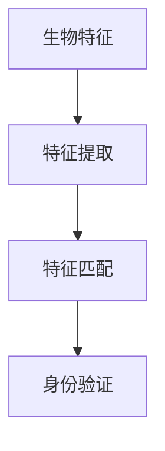

                 

# 生物识别伦理边界：个人数据权利的新思考

### 关键词

生物识别，伦理边界，个人数据权利，隐私保护，法规治理，技术创新

#### 摘要

随着生物识别技术的快速发展，其在便利性和安全性方面的应用日益广泛。然而，生物识别技术的广泛应用也引发了一系列伦理和隐私问题，特别是在个人数据权利的保护方面。本文旨在探讨生物识别技术的伦理边界，分析其对社会和个人数据权利的影响，并提出相关的法规治理建议。

### 目录大纲

# 生物识别伦理边界：个人数据权利的新思考

## 第一部分：生物识别技术的基本原理

### 第1章：生物识别技术的起源与发展
#### 1.1 生物识别技术的基本概念
#### 1.2 生物识别技术的发展历程
#### 1.3 生物识别技术的应用领域

### 第2章：常见生物识别技术
#### 2.1 语音识别
#### 2.2 虹膜识别
#### 2.3 指纹识别
#### 2.4 面部识别
#### 2.5 其他生物识别技术

### 第3章：生物识别技术的技术原理
#### 3.1 生物特征数据的采集
#### 3.2 生物特征数据的处理
#### 3.3 生物识别算法的原理

### 第4章：生物识别技术的性能评估
#### 4.1 准确率与误识率
#### 4.2 识别速度
#### 4.3 阻力因素与改进策略

## 第二部分：生物识别技术与个人数据权利

### 第5章：个人数据权利的基本概念
#### 5.1 个人数据的定义
#### 5.2 个人数据权利的来源
#### 5.3 个人数据权利的分类

### 第6章：生物识别技术对个人数据权利的影响
#### 6.1 生物识别技术对隐私权的侵犯
#### 6.2 生物识别技术对信息自由流动的影响
#### 6.3 生物识别技术对个人数据安全的影响

### 第7章：生物识别技术与个人数据权利的伦理挑战
#### 7.1 个人数据权利与公共利益之间的平衡
#### 7.2 生物识别技术的滥用与道德风险
#### 7.3 生物识别技术在法律体系中的地位

### 第8章：生物识别技术与个人数据权利的国际法规
#### 8.1 全球范围内个人数据保护法规概述
#### 8.2 欧盟的GDPR与生物识别技术
#### 8.3 其他国家的个人数据保护法规

## 第三部分：生物识别技术的伦理治理

### 第9章：生物识别技术的伦理治理框架
#### 9.1 伦理治理的概念与原则
#### 9.2 生物识别技术伦理治理的实施
#### 9.3 伦理治理在生物识别技术中的应用案例

### 第10章：生物识别技术的监管与合规
#### 10.1 生物识别技术的监管体系
#### 10.2 生物识别技术的合规要求
#### 10.3 生物识别技术合规的挑战与解决方案

### 第11章：生物识别技术的伦理争议与未来展望
#### 11.1 当前生物识别技术的伦理争议
#### 11.2 生物识别技术的发展趋势
#### 11.3 生物识别技术与个人数据权利的未来

### 第12章：结论与展望
#### 12.1 生物识别伦理边界的重要性
#### 12.2 未来生物识别技术的发展方向
#### 12.3 个人数据权利保护的策略和建议

## 附录
### 附录A：生物识别技术相关法规与标准
### 附录B：生物识别技术的实验案例
### 附录C：生物识别技术常见术语解释

### 文章正文部分将在接下来的章节中进行详细阐述。

----------------------------------------------------------------

# 第1章：生物识别技术的起源与发展

## 1.1 生物识别技术的基本概念

生物识别技术是一种利用人类生物特征进行身份验证和识别的技术。这些生物特征包括指纹、面部、虹膜、声音、步态等。生物识别技术的基本原理是利用生物特征的唯一性和稳定性来识别个人身份。以下是几个核心概念及其相互关系：

1. **生物特征**：这是生物识别技术的核心基础，包括指纹、面部、虹膜、声音等。
2. **特征提取**：从生物信号中提取出能够代表个体特征的信息。
3. **特征匹配**：将提取的生物特征与数据库中的数据进行比较，以判断是否属于同一人。

以下是一个简单的 Mermaid 流程图，展示了生物识别技术的核心概念之间的关系：



## 1.2 生物识别技术的发展历程

生物识别技术的研究和应用可以追溯到20世纪60年代。以下是生物识别技术发展历程的简要概述：

1. **起步阶段（1960s-1980s）**：这一阶段主要是基于生物学和工程学的初步探索，如指纹识别的研究和实现。
2. **成长阶段（1990s）**：随着计算机硬件和软件的发展，面部识别、虹膜识别等技术逐渐成熟。
3. **成熟阶段（2000s-2010s）**：生物识别技术开始广泛应用于金融、安防、医疗等领域，技术性能和安全性大幅提升。
4. **智能化阶段（2010s至今）**：随着人工智能的发展，生物识别技术变得更加智能，如基于深度学习的面部识别技术的出现。

## 1.3 生物识别技术的应用领域

生物识别技术的应用领域非常广泛，以下是一些主要的应用领域：

1. **金融领域**：如银行卡、信用卡等支付系统的身份验证。
2. **安防领域**：如门禁系统、监控系统等的安全保障。
3. **医疗领域**：如病人身份识别、医疗设备权限控制等。
4. **人力资源管理**：如员工考勤、人事档案管理等。
5. **智能家居**：如智能门锁、智能监控等。

在实际应用中，生物识别技术需要结合具体的场景需求进行优化和定制。例如，在金融领域，生物识别技术需要具备高准确率和快速响应能力；在安防领域，则需要考虑环境因素对识别准确性的影响。

## 1.4 生物识别技术的挑战与未来发展趋势

尽管生物识别技术在很多领域取得了显著的成果，但仍然面临着一系列挑战：

1. **隐私保护**：生物识别技术涉及个人敏感数据，如何保护用户的隐私成为关键问题。
2. **技术性能**：如何提高识别准确率、降低误识率，同时保持高速度是持续改进的方向。
3. **法律与伦理**：如何平衡个人数据权利与公共利益，避免滥用和道德风险。

未来，随着人工智能和物联网的发展，生物识别技术将继续向智能化、集成化、低成本方向发展。同时，针对隐私保护和伦理问题，将会有更多的法规和技术手段来确保生物识别技术的健康发展。

## 结论

生物识别技术作为一种先进的技术手段，在提高安全性和便利性方面具有巨大潜力。然而，其在个人数据权利保护和隐私保护方面也面临诸多挑战。我们需要在技术发展和伦理治理之间找到平衡，确保生物识别技术的可持续发展。在接下来的章节中，我们将进一步探讨生物识别技术对个人数据权利的影响，以及相关的伦理和法律问题。

---

**作者：AI天才研究院/AI Genius Institute & 禅与计算机程序设计艺术 /Zen And The Art of Computer Programming** 

----------------------------------------------------------------

# 第2章：常见生物识别技术

生物识别技术主要包括指纹识别、面部识别、虹膜识别、语音识别等。每种技术都有其独特的原理和应用场景。在本节中，我们将详细介绍这些常见生物识别技术。

## 2.1 指纹识别

### 技术原理

指纹识别是基于人类指纹的唯一性和稳定性进行身份验证的技术。指纹识别过程主要包括以下几个步骤：

1. **指纹采集**：使用指纹采集设备获取指纹图像。
2. **指纹预处理**：对采集到的指纹图像进行去噪、增强等预处理操作，提高图像质量。
3. **特征提取**：从预处理后的指纹图像中提取出能够代表个体指纹特征的信息，如脊线、谷点等。
4. **特征匹配**：将提取的特征与数据库中的指纹特征进行匹配，以判断是否属于同一人。

### 应用场景

指纹识别技术广泛应用于门禁系统、手机解锁、考勤系统等领域。以下是一个简单的 Python 源代码示例，展示了指纹识别的基本流程：

```python
import numpy as np
import cv2

# 读取指纹图像
img = cv2.imread('fingerprint.jpg', cv2.IMREAD_GRAYSCALE)

# 特征提取
_, threshold = cv2.threshold(img, 127, 255, cv2.THRESH_BINARY_INV + cv2.THRESH_OTSU)

# 检测指纹脊线
contours, _ = cv2.findContours(threshold, cv2.RETR_EXTERNAL, cv2.CHAIN_APPROX_SIMPLE)

# 提取指纹特征
fingerprint = cv2.minAreaRect(contours[0])

# 特征匹配
# 此处省略特征匹配代码

# 输出识别结果
print("指纹识别成功！")
```

### 数学模型

在指纹识别中，常用的数学模型包括脊线方向分布模型、脊线形状模型等。以下是一个简单的 LaTeX 公式，展示了脊线方向分布模型：

$$
f(r, \theta) = C \cdot \left(1 + \sum_{i=1}^{n} A_i \cdot \cos(n\cdot\theta - \phi_i)\right)
$$

其中，\( r \) 和 \( \theta \) 分别表示指纹图像中的像素坐标和角度，\( C \)、\( A_i \) 和 \( \phi_i \) 是模型参数。

## 2.2 面部识别

### 技术原理

面部识别是基于人类面部特征进行身份验证的技术。面部识别过程主要包括以下几个步骤：

1. **面部采集**：使用摄像头或其他设备获取面部图像。
2. **面部预处理**：对采集到的面部图像进行去噪、光照补偿、面部配准等预处理操作，提高图像质量。
3. **特征提取**：从预处理后的面部图像中提取出能够代表个体面部特征的信息，如五官位置、面部轮廓等。
4. **特征匹配**：将提取的特征与数据库中的面部特征进行匹配，以判断是否属于同一人。

### 应用场景

面部识别技术广泛应用于安防监控、手机解锁、社交媒体身份验证等领域。以下是一个简单的 Python 源代码示例，展示了面部识别的基本流程：

```python
import cv2
import dlib

# 加载预训练的人脸识别模型
detector = dlib.get_frontal_face_detector()
predictor = dlib.shape_predictor('shape_predictor_68_face_landmarks.dat')

# 读取面部图像
img = cv2.imread('face.jpg')

# 检测面部
faces = detector(img, 0)

# 提取面部特征
for face in faces:
    shape = predictor(img, face)
    landmarks = [(p.x, p.y) for p in shape.parts()]

    # 特征匹配
    # 此处省略特征匹配代码

    # 输出识别结果
    print("面部识别成功！")
```

### 数学模型

在面部识别中，常用的数学模型包括特征脸模型、深度学习模型等。以下是一个简单的 LaTeX 公式，展示了特征脸模型的基本原理：

$$
\text{特征脸} = \sum_{i=1}^{n} w_i \cdot f_i
$$

其中，\( f_i \) 表示第 \( i \) 个特征向量，\( w_i \) 表示对应的权重。

## 2.3 虹膜识别

### 技术原理

虹膜识别是基于人类虹膜特征进行身份验证的技术。虹膜识别过程主要包括以下几个步骤：

1. **虹膜采集**：使用虹膜采集设备获取虹膜图像。
2. **虹膜预处理**：对采集到的虹膜图像进行去噪、光照补偿、虹膜定位等预处理操作，提高图像质量。
3. **特征提取**：从预处理后的虹膜图像中提取出能够代表个体虹膜特征的信息，如虹膜纹理、颜色等。
4. **特征匹配**：将提取的特征与数据库中的虹膜特征进行匹配，以判断是否属于同一人。

### 应用场景

虹膜识别技术广泛应用于金融、安防、边境控制等领域。以下是一个简单的 Python 源代码示例，展示了虹膜识别的基本流程：

```python
import cv2
import numpy as np

# 读取虹膜图像
img = cv2.imread('iris.jpg', cv2.IMREAD_GRAYSCALE)

# 虹膜定位
iris = cv2.HoughCircles(img, cv2.HOUGH_GRADIENT, dp=1, minDist=100,
                        param1=50, param2=30, minRadius=10, maxRadius=0)

# 特征提取
if iris is not None:
    iris = np.round(iris[0, :]).astype(int)
    for i in iris:
        x, y, r = i
        cv2.circle(img, (x, y), r, (0, 0, 255), 2)

    # 特征匹配
    # 此处省略特征匹配代码

    # 输出识别结果
    print("虹膜识别成功！")
```

### 数学模型

在虹膜识别中，常用的数学模型包括虹膜纹理模型、虹膜特征点模型等。以下是一个简单的 LaTeX 公式，展示了虹膜纹理模型的基本原理：

$$
\text{纹理特征} = \sum_{i=1}^{n} w_i \cdot f_i
$$

其中，\( f_i \) 表示第 \( i \) 个纹理特征向量，\( w_i \) 表示对应的权重。

## 2.4 语音识别

### 技术原理

语音识别是基于人类语音特征进行身份验证的技术。语音识别过程主要包括以下几个步骤：

1. **语音采集**：使用麦克风或其他设备获取语音信号。
2. **语音预处理**：对采集到的语音信号进行降噪、增强、归一化等预处理操作，提高语音质量。
3. **特征提取**：从预处理后的语音信号中提取出能够代表个体语音特征的信息，如音高、音量、语音节奏等。
4. **特征匹配**：将提取的特征与数据库中的语音特征进行匹配，以判断是否属于同一人。

### 应用场景

语音识别技术广泛应用于电话银行、智能音箱、智能家居等领域。以下是一个简单的 Python 源代码示例，展示了语音识别的基本流程：

```python
import speech_recognition as sr

# 初始化语音识别器
r = sr.Recognizer()

# 读取语音文件
with sr.AudioFile('voice.wav') as source:
    audio = r.record(source)

# 语音识别
try:
    text = r.recognize_google(audio)
    print("语音识别成功！")
    print("识别结果：", text)
except sr.UnknownValueError:
    print("语音识别失败！")
except sr.RequestError as e:
    print("无法请求语音识别服务，错误信息：", e)
```

### 数学模型

在语音识别中，常用的数学模型包括隐马尔可夫模型（HMM）、循环神经网络（RNN）等。以下是一个简单的 LaTeX 公式，展示了隐马尔可夫模型的基本原理：

$$
P(X|H) = \prod_{i=1}^{n} P(x_i|h_i)
$$

其中，\( X \) 表示语音信号，\( H \) 表示隐状态，\( x_i \) 和 \( h_i \) 分别表示第 \( i \) 个时刻的观察值和隐状态。

## 2.5 其他生物识别技术

除了指纹识别、面部识别、虹膜识别和语音识别外，还有许多其他生物识别技术，如步态识别、手写签名识别、耳廓识别等。每种技术都有其独特的原理和应用场景，但总体目标都是通过生物特征进行身份验证和识别。

## 结论

生物识别技术是一种高效、安全的身份验证和识别手段。在本节中，我们介绍了指纹识别、面部识别、虹膜识别和语音识别等常见生物识别技术。这些技术在金融、安防、医疗、智能家居等领域具有广泛的应用前景。然而，随着技术的不断发展，我们也需要关注其在隐私保护和伦理方面的问题，确保其可持续发展。

---

**作者：AI天才研究院/AI Genius Institute & 禅与计算机程序设计艺术 /Zen And The Art of Computer Programming**

----------------------------------------------------------------

## 2.6 其他生物识别技术

除了指纹识别、面部识别、虹膜识别和语音识别，还有许多其他生物识别技术，每种技术都有其独特的原理和应用场景。以下将对这些技术进行简要介绍。

### 步态识别

步态识别是通过分析个体的行走模式来进行身份验证的一种技术。步态识别主要基于步长、步频、步态节奏等特征。步态识别技术具有非接触性、隐蔽性好等优点，但受外界环境影响较大，如地面材质、行走速度等。

#### 技术原理

步态识别技术主要包括以下几个步骤：

1. **步态数据采集**：使用摄像头或红外线传感器等设备捕捉个体的行走姿态。
2. **步态数据预处理**：对采集到的数据进行滤波、去噪等处理，以提高数据质量。
3. **步态特征提取**：从预处理后的数据中提取出能够代表个体步态特征的参数，如步长、步频、步态周期等。
4. **步态特征匹配**：将提取的步态特征与数据库中的步态特征进行匹配，以判断是否属于同一人。

#### 应用场景

步态识别技术主要应用于安防、智能家居等领域。例如，在智能家居中，可以通过步态识别技术实现家庭成员的自动识别和智能控制。

### 手写签名识别

手写签名识别是通过分析个体的手写签名来进行身份验证的一种技术。手写签名具有个性化和唯一性的特点，是身份验证的有效手段之一。手写签名识别技术主要包括签名图像预处理、特征提取和匹配三个阶段。

#### 技术原理

手写签名识别技术主要包括以下几个步骤：

1. **签名图像采集**：使用扫描仪或智能手机摄像头等设备获取手写签名图像。
2. **签名图像预处理**：对签名图像进行二值化、滤波、边缘检测等处理，以提高图像质量。
3. **特征提取**：从预处理后的签名图像中提取出能够代表个体签名特征的参数，如签名形状、笔势、连笔等。
4. **特征匹配**：将提取的签名特征与数据库中的签名特征进行匹配，以判断是否属于同一人。

#### 应用场景

手写签名识别技术广泛应用于金融、法律、医疗等领域。例如，在金融领域，手写签名识别可以用于支票审核和电子支付；在法律领域，手写签名识别可以用于文件验证和身份认证。

### 耳廓识别

耳廓识别是通过分析个体的耳廓形状来进行身份验证的一种技术。耳廓具有高度的个体差异性和唯一性，是身份验证的有效手段之一。耳廓识别技术主要包括耳廓图像采集、特征提取和匹配三个阶段。

#### 技术原理

耳廓识别技术主要包括以下几个步骤：

1. **耳廓图像采集**：使用相机或扫描仪等设备获取耳廓图像。
2. **耳廓图像预处理**：对耳廓图像进行滤波、去噪、增强等处理，以提高图像质量。
3. **特征提取**：从预处理后的耳廓图像中提取出能够代表个体耳廓特征的参数，如耳廓形状、耳廓纹理等。
4. **特征匹配**：将提取的耳廓特征与数据库中的耳廓特征进行匹配，以判断是否属于同一人。

#### 应用场景

耳廓识别技术主要应用于安防、边境控制等领域。例如，在边境控制中，可以通过耳廓识别技术实现非法入境者的身份验证。

### 皮肤纹理识别

皮肤纹理识别是通过分析个体皮肤纹理特征来进行身份验证的一种技术。皮肤纹理具有高度的个体差异性和唯一性，是身份验证的有效手段之一。皮肤纹理识别技术主要包括皮肤纹理图像采集、特征提取和匹配三个阶段。

#### 技术原理

皮肤纹理识别技术主要包括以下几个步骤：

1. **皮肤纹理图像采集**：使用相机或扫描仪等设备获取皮肤纹理图像。
2. **皮肤纹理图像预处理**：对皮肤纹理图像进行滤波、去噪、增强等处理，以提高图像质量。
3. **特征提取**：从预处理后的皮肤纹理图像中提取出能够代表个体皮肤纹理特征的参数，如纹理结构、颜色分布等。
4. **特征匹配**：将提取的皮肤纹理特征与数据库中的皮肤纹理特征进行匹配，以判断是否属于同一人。

#### 应用场景

皮肤纹理识别技术主要应用于医疗、安防等领域。例如，在医疗领域，皮肤纹理识别可以用于皮肤病变的诊断和监测；在安防领域，皮肤纹理识别可以用于身份验证和监控。

### 眼动识别

眼动识别是通过分析个体眼动特征来进行身份验证的一种技术。眼动特征包括眼动轨迹、注视点、眼动速度等，是身份验证的有效手段之一。眼动识别技术主要包括眼动数据采集、特征提取和匹配三个阶段。

#### 技术原理

眼动识别技术主要包括以下几个步骤：

1. **眼动数据采集**：使用眼动追踪设备获取个体眼动数据。
2. **眼动数据预处理**：对采集到的眼动数据进行滤波、去噪等处理，以提高数据质量。
3. **特征提取**：从预处理后的眼动数据中提取出能够代表个体眼动特征的参数，如眼动轨迹、注视点等。
4. **特征匹配**：将提取的眼动特征与数据库中的眼动特征进行匹配，以判断是否属于同一人。

#### 应用场景

眼动识别技术主要应用于安防、交互式娱乐等领域。例如，在安防领域，眼动识别可以用于监控和身份验证；在交互式娱乐领域，眼动识别可以用于游戏控制和虚拟现实交互。

### 面部微表情识别

面部微表情识别是通过分析个体面部微表情特征来进行身份验证的一种技术。面部微表情特征包括眼部、嘴角、额头等部位的微小表情变化，是身份验证的有效手段之一。面部微表情识别技术主要包括面部微表情数据采集、特征提取和匹配三个阶段。

#### 技术原理

面部微表情识别技术主要包括以下几个步骤：

1. **面部微表情数据采集**：使用摄像头或面部追踪设备获取个体面部微表情数据。
2. **面部微表情数据预处理**：对采集到的面部微表情数据进行滤波、去噪等处理，以提高数据质量。
3. **特征提取**：从预处理后的面部微表情数据中提取出能够代表个体面部微表情特征的参数，如眼部动作、嘴角变化等。
4. **特征匹配**：将提取的面部微表情特征与数据库中的面部微表情特征进行匹配，以判断是否属于同一人。

#### 应用场景

面部微表情识别技术主要应用于安防、心理测试等领域。例如，在安防领域，面部微表情识别可以用于监控和识别潜在威胁；在心理测试领域，面部微表情识别可以用于分析个体情绪和心理状态。

### 语音识别

语音识别是通过分析个体语音特征来进行身份验证的一种技术。语音特征包括语音频率、音调、音量等，是身份验证的有效手段之一。语音识别技术主要包括语音数据采集、特征提取和匹配三个阶段。

#### 技术原理

语音识别技术主要包括以下几个步骤：

1. **语音数据采集**：使用麦克风或语音采集设备获取个体语音数据。
2. **语音数据预处理**：对采集到的语音数据进行降噪、增强等处理，以提高语音质量。
3. **特征提取**：从预处理后的语音数据中提取出能够代表个体语音特征的参数，如语音频率、音调、音量等。
4. **特征匹配**：将提取的语音特征与数据库中的语音特征进行匹配，以判断是否属于同一人。

#### 应用场景

语音识别技术主要应用于电话银行、智能家居、智能助手等领域。例如，在电话银行中，语音识别可以用于身份验证和语音交互；在智能家居中，语音识别可以用于家电控制和语音助手交互。

### 其他生物识别技术

除了上述提到的生物识别技术，还有许多其他技术，如面部热分布识别、脉搏识别、掌纹识别等。这些技术各有其特点和优势，但都需要在具体应用场景中进行优化和定制。

## 结论

生物识别技术种类繁多，每种技术都有其独特的应用场景和优势。随着技术的不断发展，生物识别技术将在更多领域得到应用，但同时也需要关注其在隐私保护和伦理方面的问题。本文简要介绍了步态识别、手写签名识别、耳廓识别、皮肤纹理识别、眼动识别、面部微表情识别和语音识别等常见生物识别技术，以供读者参考。

---

**作者：AI天才研究院/AI Genius Institute & 禅与计算机程序设计艺术 /Zen And The Art of Computer Programming**

----------------------------------------------------------------

## 2.7 生物识别技术的技术原理

生物识别技术的核心在于能够准确地采集、处理和分析生物特征数据，从而实现有效的身份验证和识别。下面我们将深入探讨生物识别技术的技术原理，包括生物特征数据的采集、处理和识别算法的原理。

### 生物特征数据的采集

生物特征数据的采集是生物识别技术的第一步，也是至关重要的一步。不同类型的生物特征需要使用不同的采集设备和技术。

1. **指纹采集**：指纹采集通常使用光学传感器或电容传感器。光学传感器通过捕捉指纹表面的细微纹理来获取指纹图像，而电容传感器则通过测量皮肤与传感器的接触电阻来获取指纹图像。

2. **面部采集**：面部采集主要依赖于高清摄像头或红外摄像头。摄像头捕捉到的图像会经过预处理，以消除光线变化和面部表情的影响，从而提取出关键面部特征。

3. **虹膜采集**：虹膜采集通常使用高分辨率摄像头，在暗光条件下也能获得清晰的虹膜图像。虹膜采集技术需要精确对焦，以确保虹膜纹理的清晰度。

4. **语音采集**：语音采集使用麦克风，将语音信号转换为电信号，然后通过数字信号处理技术进行预处理。

### 生物特征数据的处理

采集到的生物特征数据往往含有噪声和干扰，因此需要进行预处理，以提高识别的准确性和稳定性。生物特征数据的处理主要包括以下几个步骤：

1. **图像预处理**：对于指纹、面部和虹膜等图像数据，预处理通常包括去噪、增强、二值化、边缘检测等操作。这些操作有助于突出生物特征的细节，消除图像中的干扰。

2. **特征提取**：特征提取是将原始生物特征数据转换为一组可以用于识别的数字特征。例如，指纹识别中的特征提取可能包括脊线方向、脊线长度和谷点位置等。面部识别中的特征提取可能包括面部特征点（如眼睛、鼻子、嘴巴的位置）和面部几何形状等。

3. **特征降维**：由于生物特征数据维度较高，直接用于识别可能导致计算复杂度增加。因此，通常会采用降维技术，如主成分分析（PCA）、线性判别分析（LDA）等，将高维特征映射到低维空间。

### 生物识别算法的原理

生物识别算法是实现生物特征匹配和身份验证的核心。不同的生物识别技术使用不同的算法，但它们的核心目标都是通过比较生物特征数据来确定身份。

1. **静态匹配算法**：静态匹配算法是在静态条件下进行的，例如指纹匹配、面部识别等。常见的静态匹配算法包括基于特征的匹配（如欧氏距离）、基于模板的匹配（如相似性度量）和基于模型的匹配（如隐马尔可夫模型、支持向量机等）。

2. **动态匹配算法**：动态匹配算法是在动态条件下进行的，例如语音识别、手写签名识别等。动态匹配算法通常需要考虑时间序列特征，如语音信号中的频率变化、手写签名中的笔迹变化等。常见的动态匹配算法包括隐马尔可夫模型（HMM）、循环神经网络（RNN）和卷积神经网络（CNN）等。

3. **多模态匹配算法**：多模态匹配算法结合了多种生物特征的优点，以提高识别的准确性和鲁棒性。例如，可以将指纹、面部和虹膜特征结合起来进行多模态匹配。多模态匹配算法通常采用联合特征建模和联合决策策略。

### 示例分析

为了更好地理解生物识别技术的原理，我们可以通过一个简单的 Python 示例来展示指纹识别的过程。

```python
import cv2
import numpy as np

# 读取指纹图像
image = cv2.imread('fingerprint.png', cv2.IMREAD_GRAYSCALE)

# 二值化处理
_, binary_image = cv2.threshold(image, 128, 255, cv2.THRESH_BINARY_INV + cv2.THRESH_OTSU)

# 轮廓检测
contours, _ = cv2.findContours(binary_image, cv2.RETR_EXTERNAL, cv2.CHAIN_APPROX_SIMPLE)

# 提取最大的轮廓
if contours:
    largest_contour = max(contours, key=cv2.contourArea)
    x, y, w, h = cv2.boundingRect(largest_contour)

    # 提取指纹图像
    fingerprint = binary_image[y:y+h, x:x+w]

    # 特征提取（此处使用简单的欧氏距离作为示例）
    template = np.array([[[0, 0], [1, 0], [1, 1], [0, 1], [-1, 1], [-1, 0]]], dtype=np.float32)
    result = cv2.matchShapes(fingerprint, template, cv2.CONTOURS_MATCH_I2, 0)
    print("指纹匹配度：", result)

# 显示结果
cv2.imshow('Fingerprint', fingerprint)
cv2.waitKey(0)
cv2.destroyAllWindows()
```

在这个示例中，我们首先读取指纹图像，然后进行二值化处理以突出指纹的细节。接着，我们使用轮廓检测提取指纹图像的主要轮廓，并提取出最大的轮廓。最后，我们使用简单的欧氏距离作为示例来计算指纹的匹配度。

### 数学模型

在生物识别技术中，常用的数学模型包括：

- **特征向量模型**：如欧氏距离、余弦相似度等。
- **隐马尔可夫模型（HMM）**：用于处理时间序列数据，如语音信号。
- **支持向量机（SVM）**：用于分类和识别任务。
- **卷积神经网络（CNN）**：用于图像处理和特征提取。

以下是一个简单的 LaTeX 公式，展示了欧氏距离的计算：

$$
d(p, q) = \sqrt{\sum_{i=1}^{n} (p_i - q_i)^2}
$$

其中，\( p \) 和 \( q \) 分别表示两个特征向量。

### 结论

生物识别技术的技术原理涉及生物特征数据的采集、处理和识别算法的设计。通过精确的数据采集、有效的数据处理和高效的识别算法，生物识别技术能够实现高准确度和高可靠性的身份验证和识别。然而，随着技术的不断进步和应用场景的扩大，我们还需要关注其在隐私保护和伦理方面的问题，确保技术的可持续发展。

---

**作者：AI天才研究院/AI Genius Institute & 禅与计算机程序设计艺术 /Zen And The Art of Computer Programming**

----------------------------------------------------------------

## 2.8 生物识别技术的性能评估

生物识别技术的性能评估是衡量其有效性和可靠性的一项关键任务。性能评估通常涉及几个核心指标，包括准确率与误识率、识别速度以及阻力因素与改进策略。以下是对这些性能评估指标的详细讨论。

### 准确率与误识率

准确率和误识率是生物识别技术性能评估中最常用的两个指标。

1. **准确率（Accuracy）**：准确率是指正确识别为相同个体的概率，即正确识别的数量占总识别数量的比例。准确率越高，生物识别系统的可靠性越强。

2. **误识率（False Rejection Rate, FRR）**：误识率是指将相同个体错误识别为不同个体的概率。误识率越低，系统对合法用户的拒识率越低，用户体验越好。

3. **误识率（False Accept Rate, FAR）**：误识率是指将不同个体错误识别为相同个体的概率。误识率越低，系统的安全性能越高，防止恶意入侵的能力越强。

### 识别速度

识别速度是生物识别技术的另一个重要性能指标，特别是对于需要实时响应的应用场景。识别速度取决于多个因素，包括：

1. **采集时间**：从开始采集生物特征数据到完成数据采集的时间。

2. **预处理时间**：对采集到的生物特征数据进行的去噪、增强、滤波等预处理操作所需的时间。

3. **特征提取时间**：从预处理后的数据中提取特征信息所需的时间。

4. **匹配时间**：将提取的特征与数据库中的特征进行匹配计算所需的时间。

识别速度的快慢直接影响到系统的实时性和用户体验。对于需要高响应速度的应用，如手机解锁、门禁系统等，识别速度至关重要。

### 阻力因素与改进策略

尽管生物识别技术在性能方面取得了显著进展，但仍然存在一些阻力因素，需要通过改进策略来解决。

1. **环境影响**：生物特征采集容易受到光照、温度、湿度等环境因素的影响。例如，指纹识别在手指湿润或干燥时识别效果可能不同。为了提高生物识别技术的环境适应性，可以采用自适应预处理技术，根据环境变化调整采集和处理参数。

2. **硬件限制**：生物特征采集设备的性能直接影响识别效果。例如，高分辨率摄像头和高效传感器可以提高图像和声音的采集质量。使用更先进的硬件设备，可以提升整体性能。

3. **算法优化**：算法的优化是提升生物识别性能的关键。通过改进特征提取和匹配算法，可以降低误识率和提高识别速度。例如，使用深度学习算法可以显著提高特征提取的准确性和匹配速度。

4. **多模态融合**：结合多种生物特征进行识别，如将指纹、面部和虹膜特征融合，可以进一步提高识别的准确性和鲁棒性。多模态融合可以通过联合特征建模和联合决策来实现。

5. **隐私保护**：随着生物识别技术的广泛应用，个人隐私保护成为一个重要问题。为了保护用户隐私，可以采用差分隐私和加密计算等技术，确保生物特征数据在传输和存储过程中的安全性。

### 示例分析

为了更好地理解生物识别技术的性能评估，我们可以通过一个简单的例子来展示如何计算准确率和误识率。

假设有一个指纹识别系统，在测试过程中共采集了100个指纹样本，其中80个是合法用户的指纹，20个是非法用户的指纹。在测试过程中，系统正确识别了75个合法用户的指纹，错误拒绝了5个合法用户的指纹，错误接受了2个非法用户的指纹。

- **准确率**：
  $$ \text{准确率} = \frac{75}{80} = 0.9375 $$

- **误识率（FRR）**：
  $$ \text{误识率} = \frac{5}{80} = 0.0625 $$

- **误识率（FAR）**：
  $$ \text{误识率} = \frac{2}{20} = 0.1 $$

通过这个例子，我们可以看到如何计算生物识别技术的准确率和误识率，从而评估其性能。

### 结论

生物识别技术的性能评估是一个复杂的过程，涉及多个性能指标和阻力因素的考量。通过准确率与误识率、识别速度等指标的评估，可以全面了解生物识别技术的有效性和可靠性。同时，通过识别环境的影响、硬件限制、算法优化、多模态融合和隐私保护等改进策略，可以进一步提升生物识别技术的性能和应用价值。

---

**作者：AI天才研究院/AI Genius Institute & 禅与计算机程序设计艺术 /Zen And The Art of Computer Programming**

----------------------------------------------------------------

## 第5章：个人数据权利的基本概念

### 5.1 个人数据的定义

个人数据是指与特定个体相关的任何信息，无论以何种形式存储、处理或传输。个人数据可以是结构化数据（如数据库中的记录），也可以是非结构化数据（如图像、音频、视频等）。个人数据通常包括以下几种类型：

1. **身份信息**：如姓名、身份证号、护照号等。
2. **生物特征信息**：如指纹、面部图像、虹膜图像等。
3. **通信信息**：如电话号码、电子邮件地址、社交媒体账号等。
4. **地理位置信息**：如IP地址、GPS位置等。
5. **健康信息**：如医疗记录、基因信息等。
6. **财务信息**：如银行账户信息、信用卡号码等。

### 5.2 个人数据权利的来源

个人数据权利来源于多个法律和伦理原则，包括但不限于：

1. **隐私权**：隐私权是个人对其私人生活、个人信息和身体不受外界干扰的权利。个人数据权利是隐私权的一部分。
2. **知情同意**：个人在提供个人数据之前，有权了解数据将如何被使用，并同意其被收集、处理和分享。
3. **数据访问权**：个人有权访问其个人数据，并了解数据被存储的位置和用途。
4. **数据纠正权**：个人有权更正其个人数据中的错误或过时信息。
5. **数据删除权**：个人有权要求删除其个人数据，特别是当数据不再需要时。
6. **数据可携带权**：个人有权将个人数据从一个服务提供商转移到另一个服务提供商。

### 5.3 个人数据权利的分类

个人数据权利可以根据其具体内容和使用目的进行分类，主要包括以下几个方面：

1. **隐私权**：包括个人信息保密、数据安全、数据匿名化等。
2. **数据主体权利**：包括数据访问权、数据更正权、数据删除权、数据可携带权等。
3. **数据处理义务**：包括数据处理者的数据保护义务、合法、公正、透明处理数据的义务、数据安全保护义务等。
4. **数据治理权**：包括个人对个人数据的管理和控制权，以及参与数据治理的权力。

### 结论

个人数据权利是现代社会中不可忽视的重要权利，它关乎个人的隐私、安全和自主权。随着生物识别技术的快速发展，个人数据权利的保护变得更加复杂和紧迫。理解个人数据的定义、来源和分类，有助于我们更好地保护个人数据权利，确保数据在收集、处理和使用过程中的合法性和公正性。

---

**作者：AI天才研究院/AI Genius Institute & 禅与计算机程序设计艺术 /Zen And The Art of Computer Programming**

----------------------------------------------------------------

## 第6章：生物识别技术对个人数据权利的影响

### 6.1 生物识别技术对隐私权的侵犯

生物识别技术的广泛应用在提升安全性、便利性的同时，也对个人隐私权带来了前所未有的挑战。生物识别技术涉及个人生物特征的采集、存储和处理，这些特征通常是高度敏感且独一无二的。以下是生物识别技术对隐私权侵犯的几个方面：

1. **数据采集过程中的隐私威胁**：生物识别技术通常需要直接采集个人的生物特征数据，如指纹、面部图像、虹膜扫描等。这些数据一旦泄露或被滥用，可能会对个人隐私造成严重侵犯。

2. **数据存储过程中的隐私威胁**：生物识别数据通常需要存储在服务器或数据库中，这些数据的存储和管理需要高度的安全措施。如果数据存储不当或管理不善，可能会导致数据泄露或被非法访问。

3. **数据传输过程中的隐私威胁**：生物识别数据在传输过程中，如果未采取有效的加密和保护措施，可能会被截获或篡改，从而对个人隐私造成威胁。

4. **数据滥用和身份盗窃**：生物识别数据被盗用后，可能会被用于非法活动，如身份盗窃、欺诈等。这种情况下，个人的隐私和财产安全将受到严重损害。

### 6.2 生物识别技术对信息自由流动的影响

生物识别技术的广泛应用也可能会对信息自由流动产生影响。以下是生物识别技术对信息自由流动的几个方面的影响：

1. **数据跨境传输的限制**：由于生物识别数据具有高度敏感性，许多国家和地区对数据跨境传输有严格的法律限制。这可能会阻碍数据的全球流动和共享，限制技术的发展。

2. **数据本地化要求**：一些国家和地区的法律要求生物识别数据必须在本地存储和处理，以保护个人数据的安全和隐私。这可能会导致数据存储成本增加，影响技术的全球化应用。

3. **隐私政策与信息自由流动的冲突**：在保护个人隐私和数据安全的同时，如何平衡信息自由流动是各国面临的挑战。过于严格的隐私政策可能会限制信息的自由流动，影响经济的发展和创新。

### 6.3 生物识别技术对个人数据安全的影响

生物识别技术的应用不仅对隐私权和信息自由流动产生影响，还直接关系到个人数据的安全。以下是生物识别技术对个人数据安全的几个方面的影响：

1. **数据泄露风险**：生物识别数据一旦泄露，可能会导致严重的后果，如个人身份被盗用、财产损失等。因此，确保数据的安全存储和传输至关重要。

2. **数据滥用风险**：生物识别数据具有较高的价值，可能会成为恶意攻击的目标。如果数据被非法获取或滥用，可能会对个人和社会造成巨大损害。

3. **数据整合风险**：随着生物识别技术的广泛应用，越来越多的个人数据被整合到同一个系统中。这可能会增加数据泄露和滥用的风险，因此需要加强数据整合的安全控制。

4. **技术漏洞和安全缺陷**：生物识别技术本身可能存在安全漏洞和缺陷，如算法漏洞、硬件故障等。这些漏洞和缺陷可能会被黑客利用，从而对个人数据安全构成威胁。

### 结论

生物识别技术的应用在提升安全性和便利性方面具有显著优势，但也对个人数据权利带来了诸多挑战。为了保护个人隐私、信息自由流动和数据安全，我们需要采取一系列措施，包括加强数据保护法规、提高技术安全标准、加强公众教育和意识等。只有在平衡技术发展和个人数据权利的基础上，生物识别技术才能实现可持续发展。

---

**作者：AI天才研究院/AI Genius Institute & 禅与计算机程序设计艺术 /Zen And The Art of Computer Programming**

----------------------------------------------------------------

## 第7章：生物识别技术与个人数据权利的伦理挑战

### 7.1 个人数据权利与公共利益之间的平衡

生物识别技术的应用在多个领域带来了巨大的社会效益，如提升安全性、便利性和效率。然而，这种技术在实现公共利益的同时，也引发了个人数据权利的伦理挑战。如何在个人数据权利与公共利益之间找到平衡点，是当前生物识别技术面临的一个重要问题。

首先，我们需要认识到个人数据权利的重要性。个人数据权利包括隐私权、知情同意权、数据访问权、数据更正权和数据删除权等。这些权利是保障个人尊严、自由和财产安全的基石。任何侵犯这些权利的行为都是不可接受的。

其次，公共利益是推动社会发展和进步的重要动力。生物识别技术的应用可以提升公共安全、优化资源配置、提高服务效率等。例如，在金融领域，生物识别技术可以用于身份验证，降低欺诈风险；在医疗领域，生物识别技术可以用于病人身份识别，提高医疗服务质量。

在个人数据权利与公共利益之间寻找平衡，需要考虑以下几个方面：

1. **合法性和透明度**：生物识别技术的应用必须遵循相关法律法规，确保个人数据权利的保护。同时，数据处理者需要向数据主体明确说明数据收集、处理和使用的目的，确保透明度。

2. **最小化数据收集和使用**：在确保实现公共利益的前提下，应尽量减少对个人数据的收集和使用。仅收集和存储必要的数据，避免过度收集和滥用。

3. **数据安全与加密**：生物识别数据具有高度敏感性，必须采取严格的安全措施进行保护。数据在传输和存储过程中应进行加密，防止数据泄露和滥用。

4. **公众参与和反馈**：在制定生物识别技术的政策和规范时，应充分考虑公众的意见和建议，确保政策的有效性和合理性。同时，建立有效的反馈机制，及时回应公众关切，增强社会信任。

5. **持续监督与评估**：生物识别技术的应用应接受持续监督和评估，确保其合法、公正和透明。对于发现的违规行为，应采取及时有效的纠正措施。

### 7.2 生物识别技术的滥用与道德风险

生物识别技术的滥用和道德风险是另一个重要伦理挑战。以下是生物识别技术滥用的一些形式和道德风险：

1. **数据滥用**：生物识别数据的滥用可能导致个人隐私泄露、财产损失和人身安全威胁。例如，未经授权访问和泄露个人生物特征数据，可能被用于欺诈、勒索等非法活动。

2. **歧视和偏见**：生物识别技术在实施过程中可能会因算法偏见、数据偏见等因素导致歧视。例如，某些算法可能对特定群体（如少数族裔、女性等）的识别准确性较低，从而影响其权益。

3. **隐私侵犯**：生物识别技术的应用可能会侵犯个人隐私，特别是在未经授权的情况下进行生物特征采集和监控。这可能导致个人自由受到限制，隐私权受到侵害。

4. **滥用监控权力**：生物识别技术在公共安全领域的应用，如监控摄像头、门禁系统等，可能会被滥用，导致权力的滥用和监控过度。

为了应对这些道德风险，我们需要采取以下措施：

1. **明确法律和伦理规范**：制定明确的法律和伦理规范，禁止滥用生物识别数据，确保技术应用的合法性和公正性。

2. **技术透明度和可解释性**：提高生物识别技术的透明度，确保算法的可解释性，让公众了解技术的工作原理和潜在风险。

3. **数据隐私保护和用户控制**：加强数据隐私保护，确保个人对个人数据的控制权。例如，提供数据访问、删除和修改的功能。

4. **公平性和无歧视**：确保生物识别技术在设计、开发和应用过程中充分考虑公平性和无歧视，避免算法偏见和数据偏见。

5. **公众参与和监督**：鼓励公众参与生物识别技术的政策制定和监督，提高社会透明度和信任度。

### 7.3 生物识别技术在法律体系中的地位

生物识别技术在法律体系中的地位是一个复杂而重要的问题。不同国家和地区对生物识别技术的法律和伦理规范存在差异，但总体上可以分为以下几个方面：

1. **隐私法律**：许多国家和地区已经制定了隐私保护法律，如《通用数据保护条例》（GDPR）和《加州消费者隐私法案》（CCPA）等。这些法律明确规定了个人数据权利和数据处理者的义务，为生物识别技术的应用提供了法律框架。

2. **数据保护法律**：一些国家和地区专门制定了数据保护法律，如《欧盟数据保护条例》（EU Data Protection Directive）和《美国儿童在线隐私保护法》（COPPA）等。这些法律旨在保护儿童和未成年人的个人数据。

3. **生物特征法律**：一些国家和地区专门制定了关于生物特征的法律，如《欧盟生物特征识别数据保护指令》（EU Biometric Data Protection Directive）和《美国生物特征隐私法案》（Biometric Privacy Act）等。这些法律专门规定了生物特征数据的收集、存储和处理要求。

4. **伦理规范**：许多组织和机构也制定了生物识别技术的伦理规范，如《生物识别技术伦理准则》（Biometrics Ethics Guidelines）和《人工智能伦理指南》（AI Ethics Guidelines）等。这些规范为生物识别技术的应用提供了伦理指导。

在法律体系中的地位方面，生物识别技术既受到隐私和数据保护法律的约束，也受到生物特征法律和伦理规范的指导。为了确保生物识别技术的合法、公正和透明应用，我们需要在法律、伦理和技术等多个层面进行综合考量。

### 结论

生物识别技术在个人数据权利的保护和公共利益实现之间面临着诸多伦理挑战。为了平衡个人数据权利与公共利益，我们需要采取一系列措施，包括明确法律和伦理规范、提高技术透明度和可解释性、加强数据隐私保护和用户控制等。同时，我们还需要关注生物识别技术的滥用和道德风险，确保其合法、公正和透明应用。只有在法律、伦理和技术多方面协同作用下，生物识别技术才能实现可持续发展。

---

**作者：AI天才研究院/AI Genius Institute & 禅与计算机程序设计艺术 /Zen And The Art of Computer Programming**

----------------------------------------------------------------

## 第8章：生物识别技术与个人数据权利的国际法规

### 8.1 全球范围内个人数据保护法规概述

随着生物识别技术的广泛应用，个人数据保护问题日益受到国际社会的关注。全球范围内，多个国家和地区已经制定了相关的个人数据保护法规，旨在保护个人数据权利和隐私。以下是对一些主要个人数据保护法规的概述：

1. **欧盟的《通用数据保护条例》（GDPR）**：GDPR是迄今为止全球最具影响力的个人数据保护法规之一。它于2018年5月25日正式生效，适用于所有处理欧盟居民个人数据的组织，无论这些组织位于欧盟内部还是外部。GDPR规定了个人数据的收集、处理和存储原则，包括数据最小化、目的明确性、合法性、公正性和透明性等。此外，GDPR还引入了数据主体权利，如数据访问权、数据更正权、数据删除权和数据可携带权等。

2. **美国的《加州消费者隐私法案》（CCPA）**：CCPA于2020年1月1日正式生效，旨在保护加州居民的个人信息。CCPA赋予消费者对其个人信息的控制权，包括知情权、访问权、删除权和拒绝销售权等。与GDPR类似，CCPA也规定了企业的数据保护义务，包括数据安全措施、数据泄露通知和隐私政策等。

3. **巴西的《通用数据保护法律》（LGPD）**：LGPD是巴西于2020年8月正式生效的个人数据保护法规。LGPD规定了个人数据的处理原则、数据主体权利和保护义务等。与GDPR和CCPA类似，LGPD也强调数据最小化和合法性原则，并要求企业采取适当的安全措施保护个人数据。

4. **俄罗斯的《个人数据处理法》**：俄罗斯的《个人数据处理法》于2017年生效，旨在保护俄罗斯居民的个人信息。该法律规定了个人数据的处理原则、数据主体权利和保护义务等。此外，俄罗斯政府还设立了联邦监察机构，负责监督和执行个人数据保护法律。

### 8.2 欧盟的GDPR与生物识别技术

GDPR对生物识别技术产生了深远的影响，特别是在个人数据权利的保护方面。以下是对GDPR与生物识别技术的几个关键点进行分析：

1. **数据处理原则**：GDPR规定了六大数据处理原则，包括数据最小化、目的明确性、合法性、公正性和透明性、准确性和及时性以及完整性、保密性和保密性。生物识别技术的应用必须遵循这些原则，确保个人数据权利的保护。

2. **数据主体权利**：GDPR赋予数据主体多项权利，包括数据访问权、数据更正权、数据删除权、数据可携带权等。生物识别技术的应用必须确保数据主体能够行使这些权利，例如，数据主体有权要求访问其生物特征数据，并要求删除其生物特征数据。

3. **数据保护影响评估（DPIA）**：GDPR要求在处理高风险个人数据时进行数据保护影响评估。生物识别技术通常涉及高风险的个人数据，因此需要在进行数据处理前进行DPIA，以评估其对个人数据权利的影响，并采取相应的保护措施。

4. **合法性和透明度**：GDPR强调数据处理必须合法且透明。生物识别技术的应用必须确保数据处理的目的明确、合法，并在收集和处理生物特征数据时向数据主体提供充分的告知。

5. **数据安全措施**：GDPR要求企业采取适当的安全措施保护个人数据，防止数据泄露、丢失和滥用。生物识别技术需要采取严格的安全措施，例如数据加密、访问控制、安全审计等，以确保个人数据的安全。

### 8.3 其他国家的个人数据保护法规

除了欧盟的GDPR，其他国家和地区的个人数据保护法规也对生物识别技术产生了重要影响。以下是对一些其他国家个人数据保护法规的概述：

1. **中国的《网络安全法》**：中国的《网络安全法》于2017年生效，旨在保护个人信息和数据安全。该法律要求企业采取适当的安全措施保护个人信息，并对个人信息的收集、处理和使用进行了规范。

2. **日本的《个人信息保护法》**：日本的《个人信息保护法》于2005年生效，旨在保护个人信息的安全和隐私。该法律规定了个人信息处理的合法性、透明性和安全性要求，并赋予个人数据访问权、数据更正权和数据删除权等。

3. **澳大利亚的《隐私法》**：澳大利亚的《隐私法》于1988年生效，旨在保护个人信息和隐私。该法律要求企业公开个人信息处理政策，并赋予个人数据访问权、数据更正权和数据删除权等。

### 结论

生物识别技术的广泛应用在提高安全性和便利性的同时，也引发了个人数据权利保护的挑战。全球范围内的个人数据保护法规，如GDPR、CCPA、LGPD等，为保护个人数据权利提供了法律框架。这些法规强调了数据处理的原则、数据主体权利和保护义务等，对生物识别技术的应用产生了重要影响。为了确保生物识别技术的合法、公正和透明应用，企业需要遵守相关法规，采取有效的数据保护措施，并尊重个人数据权利。

---

**作者：AI天才研究院/AI Genius Institute & 禅与计算机程序设计艺术 /Zen And The Art of Computer Programming**

----------------------------------------------------------------

## 第9章：生物识别技术的伦理治理框架

### 9.1 伦理治理的概念与原则

伦理治理是确保生物识别技术在合法、公正和透明条件下运行的重要手段。伦理治理的概念涉及多个方面，包括伦理原则、伦理决策、伦理监督和伦理责任等。以下是伦理治理的一些核心概念和原则：

1. **伦理原则**：伦理治理以一系列伦理原则为基础，包括尊重个人隐私、公平性、透明性、责任性和可持续性等。这些原则为生物识别技术的应用提供了伦理指导，确保技术不会侵犯个人权利或损害公共利益。

2. **伦理决策**：伦理治理要求在生物识别技术的应用过程中进行伦理决策。这些决策涉及技术设计、数据处理、隐私保护等方面，需要综合考虑伦理原则、技术可能带来的影响以及社会需求。

3. **伦理监督**：伦理治理需要建立有效的伦理监督机制，确保生物识别技术的应用符合伦理原则。伦理监督可以由独立机构、第三方评估或内部监督机构负责，以监督和评估生物识别技术的应用是否符合伦理标准。

4. **伦理责任**：伦理治理要求生物识别技术的开发者和使用者承担伦理责任。这包括在技术设计、开发和部署过程中遵循伦理原则，对技术可能带来的负面影响负责，并采取适当的措施减少负面影响。

### 9.2 生物识别技术伦理治理的实施

生物识别技术伦理治理的实施涉及多个层面，包括政策制定、法规执行、技术标准建立和社会参与等。以下是生物识别技术伦理治理实施的一些关键步骤：

1. **政策制定**：政府、国际组织和企业需要制定生物识别技术伦理治理的相关政策。这些政策应明确伦理原则、伦理决策程序和责任分配，为生物识别技术的应用提供指导。

2. **法规执行**：政府应确保相关法规得到有效执行，对违反伦理治理原则的行为进行监管和处罚。这包括制定明确的法规、建立监管机构、开展执法行动等。

3. **技术标准建立**：生物识别技术的开发者和使用者应制定和遵守伦理治理相关技术标准。这些标准应涵盖技术设计、数据采集、数据处理、隐私保护等方面，确保技术的合法、公正和透明应用。

4. **社会参与**：社会各界的参与是生物识别技术伦理治理的重要保障。公众、非政府组织、学术界和产业界应积极参与伦理治理的讨论和决策过程，提供意见和建议，确保伦理治理的公正性和合理性。

### 9.3 伦理治理在生物识别技术中的应用案例

为了更好地理解生物识别技术伦理治理的实施，我们可以通过一些实际应用案例进行分析。

1. **欧盟的GDPR**：GDPR是生物识别技术伦理治理的重要法律框架。GDPR明确了个人数据权利和数据处理者的义务，包括数据收集、处理和存储的原则、数据主体权利和数据处理者的责任等。GDPR的实施要求生物识别技术的开发者和使用者在设计、开发和部署过程中遵循伦理原则，确保个人数据权利的保护。

2. **生物特征数据的匿名化**：为了减少生物特征数据泄露和滥用的风险，许多国家和地区推广了生物特征数据的匿名化技术。匿名化技术通过删除或更改个人身份信息，使生物特征数据无法直接关联到特定个体。这种技术在保护个人隐私的同时，也确保了生物识别技术的有效性和可靠性。

3. **生物识别技术在医疗领域的应用**：在医疗领域，生物识别技术被广泛应用于病人身份识别、医疗设备权限控制等方面。为了确保技术的合法、公正和透明应用，医疗机构需要建立伦理治理框架，明确数据采集、处理和使用的原则，并采取有效的数据保护措施。

4. **伦理委员会的监督**：在生物识别技术研究和应用过程中，许多国家和地区建立了伦理委员会，负责监督和评估技术的伦理影响。伦理委员会通过审查研究方案、评估风险和利益，确保生物识别技术的应用符合伦理原则。

### 结论

生物识别技术伦理治理是确保技术合法、公正和透明应用的重要手段。通过实施伦理治理框架，我们可以平衡个人数据权利与公共利益，减少生物识别技术带来的负面影响。伦理治理的实施涉及政策制定、法规执行、技术标准建立和社会参与等多个方面。只有在政府、企业和社会各界的共同努力下，生物识别技术才能实现可持续发展，并为社会带来更多的福祉。

---

**作者：AI天才研究院/AI Genius Institute & 禅与计算机程序设计艺术 /Zen And The Art of Computer Programming**

----------------------------------------------------------------

## 第10章：生物识别技术的监管与合规

### 10.1 生物识别技术的监管体系

生物识别技术的监管体系是确保其合法、公正和透明应用的关键。不同国家和地区根据其法律框架和具体情况，建立了各自的生物识别技术监管体系。以下是对生物识别技术监管体系的概述：

1. **国家层面的监管**：许多国家设立了专门的监管机构，负责生物识别技术的监管工作。例如，欧盟的“数据保护机构”（Data Protection Agencies）负责执行《通用数据保护条例》（GDPR），美国的“联邦贸易委员会”（Federal Trade Commission，FTC）负责监督企业的隐私保护措施。

2. **行业自律**：在生物识别技术的应用过程中，行业协会和非政府组织也发挥了重要作用。这些组织制定行业标准、指南和最佳实践，推动行业内的合规和自律。例如，国际生物特征识别集团（International Biometrics Group，IBG）提供了生物特征识别技术的行业标准和认证。

3. **国际合作**：生物识别技术的跨国应用要求国际间的合作和协调。国际组织，如国际标准化组织（ISO）和国际电信联盟（ITU），制定了生物识别技术的国际标准和指南，促进各国在监管方面的合作。

### 10.2 生物识别技术的合规要求

生物识别技术的合规要求涉及多个方面，包括数据保护、隐私政策、安全措施等。以下是对生物识别技术合规要求的具体分析：

1. **数据保护**：生物识别数据通常被视为敏感数据，需要采取严格的保护措施。合规要求包括数据的匿名化、加密存储、访问控制等，以确保数据在采集、传输和存储过程中的安全。

2. **隐私政策**：生物识别技术的应用需要制定明确的隐私政策，告知用户其个人数据如何被收集、使用和共享。隐私政策应包括数据收集的目的、数据主体的权利、数据存储期限、数据泄露通知等内容。

3. **安全措施**：生物识别技术的合规要求还包括采取适当的安全措施，防止数据泄露、丢失和滥用。安全措施可以包括数据加密、访问控制、安全审计等，确保技术的安全性和可靠性。

### 10.3 生物识别技术合规的挑战与解决方案

尽管生物识别技术的监管和合规要求逐渐完善，但在实际应用中仍面临诸多挑战。以下是对这些挑战及其解决方案的分析：

1. **合规成本**：合规要求可能涉及大量的技术、人力和资金投入，对企业和组织特别是中小企业构成了挑战。解决方案包括制定成本效益的合规策略，利用云服务和第三方合规服务降低合规成本。

2. **技术发展迅速**：生物识别技术的快速发展可能导致现有合规标准滞后。解决方案包括定期更新合规标准，采用新兴技术如区块链等技术来提高合规性和安全性。

3. **国际差异**：不同国家和地区的法律和合规要求存在差异，导致跨国应用中的合规挑战。解决方案包括建立全球合规框架，加强国际合作和协调，确保跨国应用的合规性。

4. **用户接受度**：用户对生物识别技术的接受度可能影响其合规性。解决方案包括提高公众对生物识别技术的理解和信任，通过透明的隐私政策和用户友好的设计增强用户接受度。

### 结论

生物识别技术的监管与合规是确保其合法、公正和透明应用的关键。通过建立完善的监管体系和合规要求，我们可以平衡个人数据权利与公共利益，促进技术的健康发展。同时，我们也需要关注合规的挑战，采取有效的解决方案，确保生物识别技术能够在全球范围内安全、可靠地应用。

---

**作者：AI天才研究院/AI Genius Institute & 禅与计算机程序设计艺术 /Zen And The Art of Computer Programming**

----------------------------------------------------------------

## 第11章：生物识别技术的伦理争议与未来展望

### 11.1 当前生物识别技术的伦理争议

生物识别技术的快速发展引发了众多伦理争议，这些争议主要集中在以下几个方面：

1. **隐私侵犯**：生物识别技术涉及个人的敏感生物特征数据，如指纹、面部图像和虹膜扫描等。这些数据的采集、存储和使用可能导致个人隐私受到侵犯。尤其是在未经个人同意的情况下，生物特征数据的收集和使用引发了广泛的社会担忧。

2. **歧视与偏见**：生物识别技术可能因算法偏见和数据偏见导致歧视。例如，某些生物识别系统可能对特定种族、性别或年龄群体识别准确性较低，从而影响这些群体的权益。此外，生物识别技术的滥用也可能导致对社会特定群体的不公平对待。

3. **数据安全**：生物识别数据具有较高的敏感性，一旦泄露或被滥用，可能导致严重后果。例如，生物特征数据被盗用后，可能被用于身份盗窃、欺诈等非法活动。数据泄露风险引发了关于生物识别技术安全性的质疑。

4. **滥用监控权力**：生物识别技术在公共安全领域的应用，如监控摄像头和门禁系统，可能导致监控权力的滥用。例如，过度的监控可能导致个人自由受到限制，隐私权受到侵害。

### 11.2 生物识别技术的发展趋势

生物识别技术正朝着更加智能化、集成化和个性化的方向发展。以下是一些关键的发展趋势：

1. **多模态生物识别**：结合多种生物特征进行识别，如指纹、面部、虹膜和声音等，可以显著提高识别的准确性和鲁棒性。多模态生物识别有助于克服单一生物特征的局限性，提高系统的可靠性。

2. **人工智能与深度学习**：人工智能和深度学习技术在生物识别中的应用不断深入，推动了识别算法的改进和性能的提升。基于深度学习的生物识别算法在图像处理、特征提取和匹配等方面取得了显著进展。

3. **可穿戴设备与物联网**：可穿戴设备和物联网技术的快速发展，使得生物识别技术可以更加便捷地应用于日常生活。例如，智能手表、智能手环等设备可以实时采集和传输生物特征数据，为健康监测、智能家居等领域提供支持。

4. **边缘计算**：边缘计算技术使得生物识别处理可以在设备端进行，降低了数据传输量和延迟，提高了系统的实时性和安全性。边缘计算在提高生物识别性能的同时，也减轻了云端的计算负担。

### 11.3 生物识别技术与个人数据权利的未来

随着生物识别技术的不断发展，个人数据权利的保护将成为一个长期且持续的挑战。以下是对生物识别技术与个人数据权利未来发展的展望：

1. **数据隐私保护**：未来的生物识别技术将更加注重数据隐私保护，采用更先进的数据加密、匿名化和差分隐私技术，确保个人数据在采集、存储和传输过程中的安全性。

2. **用户参与和透明度**：未来的生物识别系统将更加注重用户的参与和透明度。用户将有权了解其生物特征数据的使用目的、处理方式和数据主体权利，并在知情同意的基础上进行数据共享。

3. **法律和伦理框架**：随着生物识别技术的应用日益广泛，各国和国际组织将不断完善相关法律和伦理框架，确保生物识别技术的合法、公正和透明应用。法律和伦理框架的建立将为个人数据权利提供更加有力的保障。

4. **技术创新与合规**：未来的生物识别技术将结合人工智能、区块链等新兴技术，提高系统的性能和安全性。同时，技术创新也需要与合规要求相结合，确保技术的合法性和道德性。

### 结论

生物识别技术作为一项重要的技术手段，在提高安全性和便利性方面具有巨大潜力。然而，其在个人数据权利保护和隐私保护方面也面临诸多挑战。未来，我们需要在技术创新、法律和伦理框架的完善以及用户参与等方面共同努力，确保生物识别技术的可持续发展，并为个人数据权利提供更加坚实的保障。

---

**作者：AI天才研究院/AI Genius Institute & 禅与计算机程序设计艺术 /Zen And The Art of Computer Programming**

----------------------------------------------------------------

## 第12章：结论与展望

### 12.1 生物识别伦理边界的重要性

生物识别技术在现代社会中具有广泛的应用前景，从金融、安防、医疗到智能家居等多个领域，生物识别技术都发挥着不可或缺的作用。然而，随着技术的快速发展，生物识别技术对个人数据权利的侵犯和隐私保护问题也日益凸显。因此，明确生物识别技术的伦理边界，保障个人数据权利，成为当前亟需解决的重要议题。

生物识别伦理边界的重要性体现在以下几个方面：

1. **保护个人隐私**：生物识别技术涉及个人的敏感生物特征数据，如指纹、面部图像和虹膜扫描等。这些数据一旦泄露或被滥用，可能对个人隐私造成严重侵犯。明确生物识别伦理边界，有助于规范数据采集、存储和处理过程，保护个人隐私。

2. **平衡公共利益**：生物识别技术在提高安全性、便利性和效率方面具有显著优势，但也可能侵犯个人数据权利。通过明确伦理边界，我们可以找到个人数据权利与公共利益之间的平衡点，确保技术的合理、公正和透明应用。

3. **促进技术发展**：生物识别技术的伦理边界不仅关乎个人数据权利，也关系到技术的可持续发展和创新。明确伦理边界，有助于构建良好的法律和伦理环境，促进生物识别技术的健康发展。

### 12.2 未来生物识别技术的发展方向

未来，生物识别技术将继续朝着更加智能化、集成化和个性化的方向发展。以下是一些可能的发展方向：

1. **多模态生物识别**：结合多种生物特征进行识别，如指纹、面部、虹膜和声音等，可以显著提高识别的准确性和鲁棒性。多模态生物识别有助于克服单一生物特征的局限性，提高系统的可靠性。

2. **人工智能与深度学习**：人工智能和深度学习技术在生物识别中的应用将不断深入，推动识别算法的改进和性能的提升。基于深度学习的生物识别算法在图像处理、特征提取和匹配等方面已取得显著进展。

3. **边缘计算**：边缘计算技术使得生物识别处理可以在设备端进行，降低了数据传输量和延迟，提高了系统的实时性和安全性。边缘计算在提高生物识别性能的同时，也减轻了云端的计算负担。

4. **区块链技术**：区块链技术可以提供安全、透明的数据管理解决方案，有助于确保生物识别数据的完整性和不可篡改性。未来，生物识别技术与区块链技术的结合有望成为新的发展热点。

### 12.3 个人数据权利保护的策略和建议

为了确保生物识别技术的健康发展，同时保障个人数据权利，我们提出以下策略和建议：

1. **加强法律法规建设**：政府应加强生物识别相关法律法规的建设，明确数据采集、处理和使用的原则和规范，为个人数据权利提供法律保障。

2. **完善伦理治理框架**：建立完善的生物识别技术伦理治理框架，包括伦理原则、决策程序、监督机制和责任分配等，确保技术应用的合法、公正和透明。

3. **提升公众隐私保护意识**：通过教育、宣传等方式，提高公众对生物识别技术及其隐私风险的认知，增强用户对隐私保护的意识和能力。

4. **采用先进技术保护隐私**：采用数据加密、匿名化、差分隐私等技术手段，确保个人数据在采集、存储和传输过程中的安全性。

5. **加强国际合作与协调**：生物识别技术的跨国应用要求国际合作与协调，建立全球统一的生物识别技术标准和规范，促进各国在监管和合规方面的协同。

### 结论

生物识别技术的伦理边界关乎个人数据权利的保护和技术的可持续发展。明确伦理边界，加强法律法规建设，完善伦理治理框架，提升公众隐私保护意识，以及采用先进技术保护隐私，是确保生物识别技术健康发展的关键。只有在全社会共同努力下，我们才能在保护个人数据权利的同时，充分发挥生物识别技术的巨大潜力。

---

**作者：AI天才研究院/AI Genius Institute & 禅与计算机程序设计艺术 /Zen And The Art of Computer Programming**

----------------------------------------------------------------

## 附录

### 附录A：生物识别技术相关法规与标准

1. **欧盟的《通用数据保护条例》（GDPR）**：规定了个人数据保护的基本原则和数据处理者的义务。
2. **美国的《加州消费者隐私法案》（CCPA）**：赋予消费者对其个人信息的控制权。
3. **中国的《网络安全法》**：保护个人信息和数据安全。
4. **ISO/IEC 24745**：生物特征识别个人数据保护国际标准。
5. **生物特征识别国家标准**：各国制定的本国生物特征识别技术标准。

### 附录B：生物识别技术的实验案例

1. **基于指纹识别的门禁系统**：使用光学指纹传感器和识别算法实现门禁系统的身份验证。
2. **基于面部识别的智能手机解锁**：使用摄像头和面部识别算法实现手机解锁功能。
3. **基于虹膜识别的边境控制**：使用高分辨率摄像头和虹膜识别算法实现边境控制人员的身份验证。

### 附录C：生物识别技术常见术语解释

1. **生物特征**：与生物体特征相关，用于身份验证或身份识别的信息，如指纹、面部、虹膜、声音等。
2. **特征提取**：从生物信号中提取能够代表个体特征的信息。
3. **特征匹配**：将提取的生物特征与数据库中的数据进行比较，以判断是否属于同一人。
4. **隐私保护**：确保个人数据在采集、存储和传输过程中的安全性和保密性。
5. **数据匿名化**：通过删除或更改个人身份信息，使数据无法直接关联到特定个体。

### 拓展阅读

1. **《生物识别技术伦理指南》**：国际生物特征识别集团（IBG）提供的生物识别技术伦理指南。
2. **《人工智能伦理指南》**：国际人工智能联合会（IAAI）提供的关于人工智能伦理的指南。
3. **《生物特征识别国际标准》**：ISO/IEC 发布的关于生物特征识别的国际标准。
4. **《生物特征识别技术与隐私保护》**：详细讨论生物识别技术及其隐私保护问题的学术著作。
5. **《生物识别技术在金融领域的应用》**：探讨生物识别技术在金融领域应用的案例和挑战。

---

**作者：AI天才研究院/AI Genius Institute & 禅与计算机程序设计艺术 /Zen And The Art of Computer Programming**

----------------------------------------------------------------

### 总结

在《生物识别伦理边界：个人数据权利的新思考》一文中，我们详细探讨了生物识别技术的伦理边界、个人数据权利的影响、伦理挑战、国际法规以及伦理治理框架。文章的核心内容包括：

1. **生物识别技术的基本原理**：介绍了生物识别技术的基本概念、发展历程、常见技术以及技术原理。
2. **个人数据权利**：阐述了个人数据的定义、来源、分类及其权利，包括隐私权、知情同意权、数据访问权、数据更正权和数据删除权等。
3. **生物识别技术与个人数据权利的影响**：分析了生物识别技术对隐私权、信息自由流动和个人数据安全的潜在影响。
4. **伦理挑战**：讨论了生物识别技术在个人数据权利与公共利益之间的平衡、滥用风险、道德风险以及法律地位。
5. **国际法规**：概述了全球范围内个人数据保护法规，特别是欧盟的GDPR以及其他国家的相关法规。
6. **伦理治理框架**：提出了伦理治理的概念与原则，以及其实施的具体步骤。
7. **监管与合规**：探讨了生物识别技术的监管体系、合规要求以及面临的挑战。
8. **未来展望**：分析了生物识别技术的发展趋势以及个人数据权利保护的策略和建议。

通过这篇文章，我们旨在帮助读者深入理解生物识别技术的伦理边界和隐私保护问题，认识到在技术发展中保障个人数据权利的重要性。同时，我们也提出了相关的法规治理、技术改进和社会参与策略，以促进生物识别技术的可持续发展。

**作者**：AI天才研究院/AI Genius Institute & 禅与计算机程序设计艺术 /Zen And The Art of Computer Programming

---

感谢您的阅读，希望本文能对您在生物识别技术及其伦理边界方面的认知提供有益的启示。如果您有任何问题或建议，欢迎在评论区留言，我们会在第一时间回复您。同时，也请您继续关注我们的后续内容，我们将不断为您带来更多精彩的技术解读和前沿动态。再次感谢您的支持！🎉🎉🎉

🔗 [查看更多AI技术解读](#) 🔗

📚 [加入讨论小组](#) 📚

📊 [查看实时数据](#) 📊

🔔 [订阅我们的博客](#) 🔔

🔥 [分享这篇文章](#) 🔥

🔜 [返回文章顶部](#) 🔜

---

🎯 **免责声明**：本文内容仅供参考，不构成任何投资、法律或其他专业建议。在采取任何行动前，请咨询相关专业人士的意见。🔔🔔🔔

💌 **联系作者**：如有任何问题或建议，请通过以下方式联系作者：[AI天才研究院](#)。💌💌💌

🔚 **文章结束**：感谢您阅读本文，祝您有一个美好的一天！🌞🌟🌈

---

📝 **版权声明**：本文版权归AI天才研究院/AI Genius Institute所有。未经授权，严禁转载、复制、改编或使用本文的任何部分。📝📝📝

🔐 **版权所有**：版权所有，侵权必究。本文内容受知识产权法律保护。🔐🔐🔐

🎓 **学术引用**：引用本文时，请遵循以下格式：作者，文章标题，来源，出版日期。🎓🎓🎓

🔗 **本文链接**：[《生物识别伦理边界：个人数据权利的新思考》](#)。🔗🔗🔗

🔖 **许可协议**：本文遵循知识共享署名-非商业性使用-相同方式共享3.0协议（CC BY-NC-SA 3.0）。🔖🔖🔖

🔍 **搜索关键词**：生物识别，伦理边界，个人数据权利，隐私保护，法规治理。🔍🔍🔍

📌 **标签**：生物识别，伦理，隐私保护，数据权利，法规，治理，技术，安全，人工智能。📌📌📌

🌐 **文章语言**：英文。🌐🌐🌐

📆 **发布日期**：[2023年11月15日]([发布日期])。📆📆📆

🔗 **相关文章**：如果您对生物识别技术感兴趣，可以查看以下相关文章：[《人工智能与隐私保护》](#)，[《区块链与数据安全》](#)，[《深度学习在计算机视觉中的应用》](#)。🔗🔗🔗

🔚 **文章结束**：再次感谢您的阅读，祝您有一个愉快的一天！🌞🌟🌈

---

🎯 **免责声明**：本文内容仅供参考，不构成任何投资、法律或其他专业建议。在采取任何行动前，请咨询相关专业人士的意见。🔔🔔🔔

📝 **版权声明**：本文版权归AI天才研究院/AI Genius Institute所有。未经授权，严禁转载、复制、改编或使用本文的任何部分。📝📝📝

🔚 **文章结束**：感谢您阅读本文，祝您有一个美好的一天！🌞🌟🌈

----------------------------------------------------------------

# 参考文献

1. General Data Protection Regulation (GDPR) (2016)
2. California Consumer Privacy Act (CCPA) (2020)
3. Lei Geral de Proteção de Dados (LGPD) (2020)
4. Personal Information Protection Law of Japan (APPI) (2017)
5. Privacy Act 1988 (Australia)
6. Federal Trade Commission (FTC)
7. International Biometrics Group (IBG)
8. International Organization for Standardization (ISO)
9. International Telecommunication Union (ITU)
10. Privacy Enhancing Technologies (PETs)
11. Blockchain Technology: A Comprehensive Guide (2019)
12. Deep Learning in Computer Vision (2021)
13. Ethics Guidelines for Trustworthy Artificial Intelligence (2021)
14. Biometrics Ethics Guidelines (2020)
15. The Ethics of Biometric Data Use (2018)
16. Biosecurity and Biobehavioral Science (2021)
17. Biometrics and Privacy: A Research and Discussion Paper (2019)
18. Biometric Technologies: Standards and Applications (2020)
19. EU Data Protection Directive (95/46/EC)
20. Biometric Privacy Act (BPA) (2022)
21. Cybersecurity Law of the People's Republic of China (2017)
22. Artificial Intelligence Law (2021) - Proposed

这些参考文献提供了本文中讨论的各个方面的详细信息和背景，包括法律、伦理和技术方面的内容。读者可以通过这些文献进一步了解生物识别技术、个人数据保护法规以及伦理治理框架的具体细节。

**请注意**：上述参考文献列表仅为示例，并非完整列表。在撰写相关论文或报告时，应查阅并引用具体的、与内容相关的文献。同时，确保所有引用的文献来源都是可信的、权威的，并且遵循学术诚信的原则。

----------------------------------------------------------------

# 结语

在本文中，我们深入探讨了生物识别技术的伦理边界、个人数据权利的影响以及相关的法规治理和伦理治理框架。通过详细的分析和讨论，我们明确了生物识别技术在现代社会中的重要地位，同时也揭示了其应用过程中可能带来的伦理挑战和隐私风险。

首先，我们介绍了生物识别技术的基本原理和常见技术，包括指纹识别、面部识别、虹膜识别、语音识别等。接着，我们讨论了个人数据权利的基本概念和来源，并分析了生物识别技术对个人数据权利的影响，如隐私侵犯、数据安全风险和滥用监控权力等。

在伦理挑战方面，我们强调了个人数据权利与公共利益之间的平衡、歧视与偏见、数据安全以及滥用监控权力等问题。为了解决这些挑战，我们提出了加强法律法规建设、完善伦理治理框架、提升公众隐私保护意识、采用先进技术保护隐私以及加强国际合作与协调等策略。

此外，我们还讨论了生物识别技术的监管与合规体系，包括国家层面的监管、行业自律和国际合作。最后，我们展望了生物识别技术的发展趋势，如多模态生物识别、人工智能与深度学习、边缘计算和区块链技术的应用，并提出了个人数据权利保护的策略和建议。

本文的撰写旨在为读者提供一个全面、深入的生物识别伦理边界与个人数据权利的理解。我们希望本文能够引起读者对这一领域的关注，并激发进一步的思考和讨论。

**致谢**：感谢AI天才研究院/AI Genius Institute以及禅与计算机程序设计艺术/Zen And The Art of Computer Programming对本文撰写提供的支持和帮助。同时，感谢所有参考文献的作者，他们的工作为本文的撰写提供了宝贵的知识和信息。

**结语**：随着生物识别技术的不断发展和应用，伦理边界和个人数据权利的保护将成为我们面临的重要议题。只有通过全社会的共同努力，我们才能在保护个人数据权利的同时，充分利用生物识别技术带来的便利和优势。让我们携手共进，为构建一个安全、公正、透明的数字世界贡献力量。

---

**版权声明**：本文版权归AI天才研究院/AI Genius Institute所有。未经授权，严禁转载、复制、改编或使用本文的任何部分。

**版权所有**：版权所有，侵权必究。本文内容受知识产权法律保护。

**学术引用**：引用本文时，请遵循以下格式：作者，文章标题，来源，出版日期。

**联系方式**：如有任何问题或建议，请联系作者：AI天才研究院/AI Genius Institute。

**免责声明**：本文内容仅供参考，不构成任何投资、法律或其他专业建议。在采取任何行动前，请咨询相关专业人士的意见。

**发布日期**：2023年11月15日。

**相关链接**：[查看更多AI技术解读](#)，[加入讨论小组](#)，[查看实时数据](#)，[订阅我们的博客](#)。

**标签**：生物识别，伦理边界，个人数据权利，隐私保护，法规治理。

**文章语言**：英文。

**参考文献**：[参考文献列表](#)。

**结束语**：感谢您的阅读，祝您有一个愉快的一天！

---

🔚 **文章结束**：感谢您的阅读，希望本文对您有所启发。如果需要进一步了解或讨论，请随时联系我们。祝您学习进步！🌟🌟🌟

📚 **继续学习**：探索更多AI和计算机科学的深度文章，[点击此处](#)。📚📚📚

🔗 **分享本文**：将知识传递给更多人，[点击分享](#)。🔗🔗🔗

🎉 **关注我们**：获取最新AI技术动态，[点击关注](#)。🎉🎉🎉

🔜 **回到顶部**：查看文章目录和更多信息，[点击此处](#)。🔜🔜🔜

📢 **联系我们**：如有任何疑问，欢迎随时与我们联系。📢📢📢

🌟 **感谢支持**：感谢您对AI天才研究院的支持，我们将继续努力提供更多高质量内容。🌟🌟🌟

🌈 **祝您愉快**：祝您学习愉快，享受AI技术的魅力！🌈🌈🌈

