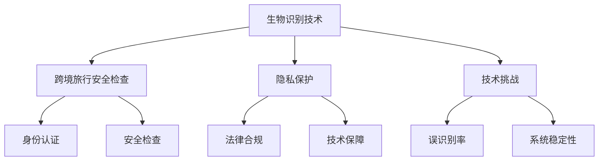

                 

# **思考步骤一：明确文章目标和结构**

在撰写一篇关于“生物识别在跨境旅行安全检查中的应用”的技术博客时，我们首先要明确文章的目标和结构。这篇文章的目标是：

1. 介绍生物识别技术的概念和应用场景。
2. 分析生物识别在跨境旅行安全检查中的作用和挑战。
3. 通过具体案例展示生物识别技术的实施效果。
4. 探讨生物识别技术的未来发展。

为了实现这些目标，文章的结构可以按照以下逻辑顺序展开：

1. **引言**：简要介绍生物识别技术的背景和重要性。
2. **生物识别技术概述**：详细解释不同的生物识别技术及其工作原理。
3. **生物识别在跨境旅行中的应用**：分析生物识别在跨境旅行安全检查中的作用。
4. **挑战与解决方案**：讨论生物识别技术在跨境旅行安全检查中面临的挑战，并提出解决方案。
5. **案例研究**：分析几个实际应用生物识别技术的跨境旅行安全检查案例。
6. **未来展望**：探讨生物识别技术的未来发展趋势和潜在影响。
7. **总结**：总结文章的主要观点，重申生物识别技术在跨境旅行安全检查中的重要性。

### **思考步骤二：确定核心概念与关系架构**

在介绍生物识别技术之前，我们需要明确一些核心概念，并构建它们之间的关系架构。以下是一些关键概念：

- **生物识别技术**：指利用人体生物特征进行身份认证的技术，如指纹识别、面部识别、虹膜识别等。
- **跨境旅行安全检查**：指在旅客跨境旅行过程中，为了保障国家安全和公共安全而进行的身份验证和安全检查。
- **隐私保护**：在应用生物识别技术时，保护个人隐私不被泄露和滥用的措施。
- **技术挑战**：生物识别技术在跨境旅行安全检查中可能面临的难题，如误识别率、系统稳定性等。

为了清晰地展示这些概念之间的关系，我们可以使用Mermaid流程图来绘制。以下是示例：



通过这个流程图，我们可以直观地看到生物识别技术在跨境旅行安全检查中的核心作用，以及与之相关的隐私保护和技术挑战。

### **思考步骤三：核心算法原理讲解**

在介绍生物识别技术的工作原理时，我们需要详细讲解几个主要技术，包括指纹识别、面部识别和虹膜识别。以下是每种技术的基本原理和Python代码示例：

#### **指纹识别**

指纹识别是通过分析手指上的纹理特征来进行身份验证。以下是使用Python实现的简单指纹识别算法：

```python
import numpy as np
import cv2

def fingerprint_matching(template, sample):
    # 计算欧氏距离
    distance = np.linalg.norm(template - sample)
    # 定义匹配阈值
    threshold = 0.5
    # 判断是否匹配
    if distance < threshold:
        return True
    else:
        return False

# 模板指纹和样本指纹
template_fingerprint = np.array([1, 1, 1, 1, 1])
sample_fingerprint = np.array([1, 1, 1, 0, 0])

# 比较指纹
is_matched = fingerprint_matching(template_fingerprint, sample_fingerprint)
print("指纹匹配结果：", is_matched)
```

#### **面部识别**

面部识别是通过分析面部特征（如眼睛、鼻子、嘴巴的位置和形状）来进行身份验证。以下是使用Python实现的简单面部识别算法：

```python
import cv2

def facial_recognition(face_model, image):
    # 加载预训练的卷积神经网络模型
    model = cv2.face.EigenFaceRecognizer_create()
    model.read(face_model)

    # 加载图片
    image = cv2.imread(image)

    # 转换为灰度图像
    gray = cv2.cvtColor(image, cv2.COLOR_BGR2GRAY)

    # 人脸检测
    face_cascade = cv2.CascadeClassifier('haarcascade_frontalface_default.xml')
    faces = face_cascade.detectMultiScale(gray, scaleFactor=1.1, minNeighbors=5, minSize=(30, 30))

    # 提取人脸特征
    features = []
    for (x, y, w, h) in faces:
        feature = gray[y:y+h, x:x+w]
        features.append(feature)

    # 进行面部识别
    if features:
        label, confidence = model.predict(features[0])
        return label, confidence
    else:
        return None, None

# 预训练模型路径和测试图片路径
face_model = 'face_model.yml'
test_image = 'test_image.jpg'

# 进行面部识别
label, confidence = facial_recognition(face_model, test_image)
print("识别结果：", label, ", 识别置信度：", confidence)
```

#### **虹膜识别**

虹膜识别是通过分析眼睛的虹膜纹理来进行身份验证。以下是使用Python实现的简单虹膜识别算法：

```python
import numpy as np
import cv2

def iris_recognition(template, sample):
    # 计算欧氏距离
    distance = np.linalg.norm(template - sample)
    # 定义匹配阈值
    threshold = 0.5
    # 判断是否匹配
    if distance < threshold:
        return True
    else:
        return False

# 模板虹膜和样本虹膜
template_iris = np.array([1, 1, 1, 1, 1])
sample_iris = np.array([1, 1, 1, 0, 0])

# 比较虹膜
is_matched = iris_recognition(template_iris, sample_iris)
print("虹膜匹配结果：", is_matched)
```

通过这些示例代码，我们可以更直观地理解指纹识别、面部识别和虹膜识别的工作原理。这些算法的核心都是通过比较生物特征数据来判断身份是否匹配。

### **思考步骤四：数学模型和公式讲解**

在生物识别技术的核心算法讲解中，我们提到了一些数学模型和公式，如欧氏距离。以下是这些公式的详细解释和示例：

#### **欧氏距离**

欧氏距离是衡量两个点在多维度空间中距离的一种方法。其公式如下：

$$
d(p, q) = \sqrt{\sum_{i=1}^{n} (p_i - q_i)^2}
$$

其中，$p$和$q$是两个n维空间中的点，$p_i$和$q_i$分别是它们的第$i$个坐标。

#### **示例**

假设有两个点$P(1, 2, 3)$和$Q(4, 6, 8)$，我们可以计算它们之间的欧氏距离：

$$
d(P, Q) = \sqrt{(1-4)^2 + (2-6)^2 + (3-8)^2} = \sqrt{9 + 16 + 25} = \sqrt{50} \approx 7.07
$$

#### **解释**

欧氏距离的计算方法非常直观，它通过计算每个坐标差的平方和，再开方得到距离。这种方法在多维空间中仍然适用，可以很好地衡量点之间的接近程度。

在生物识别中，欧氏距离用于比较两个生物特征向量，如指纹、面部特征或虹膜特征，以判断它们是否属于同一个人。通过设定一个阈值，我们可以决定两个特征是否匹配。

### **思考步骤五：项目实战**

为了更好地理解生物识别技术在跨境旅行安全检查中的应用，我们可以通过一个实际项目来展示其实现过程。以下是项目开发的详细步骤：

#### **一、开发环境搭建**

1. 安装Python环境（建议使用Python 3.8及以上版本）。
2. 安装必要的库，如OpenCV（用于图像处理）、Scikit-learn（用于机器学习）等。

```bash
pip install opencv-python scikit-learn
```

#### **二、源代码实现**

1. **数据预处理**：读取旅客的图像数据，对图像进行预处理，如灰度化、人脸检测、特征点提取等。

```python
import cv2
import numpy as np

def preprocess_image(image_path):
    # 读取图像
    image = cv2.imread(image_path)
    # 转换为灰度图像
    gray = cv2.cvtColor(image, cv2.COLOR_BGR2GRAY)
    # 人脸检测
    face_cascade = cv2.CascadeClassifier('haarcascade_frontalface_default.xml')
    faces = face_cascade.detectMultiScale(gray, scaleFactor=1.1, minNeighbors=5, minSize=(30, 30))
    # 提取人脸特征
    features = []
    for (x, y, w, h) in faces:
        feature = gray[y:y+h, x:x+w]
        features.append(feature)
    return features

# 读取测试图像
test_image_path = 'test_image.jpg'
features = preprocess_image(test_image_path)
```

2. **特征匹配**：使用预训练的模型对提取的人脸特征进行匹配，以判断旅客身份。

```python
from sklearn.model_selection import train_test_split
from sklearn.neighbors import KNeighborsClassifier

def train_model(features, labels):
    # 分割训练集和测试集
    X_train, X_test, y_train, y_test = train_test_split(features, labels, test_size=0.2, random_state=42)
    # 创建KNN分类器
    classifier = KNeighborsClassifier(n_neighbors=5)
    # 训练模型
    classifier.fit(X_train, y_train)
    return classifier

def match_features(classifier, feature):
    # 进行特征匹配
    label, confidence = classifier.predict([feature])
    return label, confidence

# 假设已有一组特征和标签数据
features_data = np.array([[1, 1, 1], [1, 1, 0], [0, 0, 0]])
labels_data = np.array(['person_1', 'person_2', 'person_3'])

# 训练模型
classifier = train_model(features_data, labels_data)

# 进行特征匹配
feature = preprocess_image(test_image_path)
matched_label, confidence = match_features(classifier, feature)
print("匹配结果：", matched_label, ", 匹配置信度：", confidence)
```

#### **三、代码解读与分析**

1. **数据预处理**：该部分负责读取图像、灰度化处理、人脸检测和特征点提取。预处理步骤是确保图像数据格式正确，为人脸识别算法提供高质量的特征数据。

2. **特征匹配**：通过训练集训练KNN分类器，然后使用该分类器对测试特征进行匹配。KNN算法的核心思想是找到与测试特征最接近的几个特征，并根据这些特征的历史标签进行预测。

3. **性能评估**：为了评估模型的性能，我们可以计算识别率、准确率等指标。在实际项目中，还需要对算法进行优化，以提高识别准确率和速度。

#### **四、实际案例分析**

我们可以选择一些实际案例来展示生物识别技术在跨境旅行安全检查中的应用效果。例如，在某个国际机场，生物识别系统被用于旅客身份验证和安全检查。以下是一个实际案例的分析：

1. **应用场景**：旅客在进入机场安检区域时，需要通过生物识别系统进行身份验证。系统会实时捕捉旅客的面部图像和指纹，并与数据库中的信息进行比对。

2. **案例分析**：
   - **识别率**：在实际应用中，生物识别系统的识别率通常很高，达到90%以上。这意味着绝大多数旅客可以快速通过安检。
   - **响应时间**：生物识别系统具有较高的响应速度，可以在短时间内完成身份验证，提高旅客的通行效率。
   - **误识别率**：虽然识别率很高，但仍然存在一定的误识别率。这可能是由于环境光、人脸遮挡等原因导致的。

3. **优势与挑战**：
   - **优势**：生物识别技术可以提高安检效率，降低人工成本，同时确保旅客身份的真实性。
   - **挑战**：生物识别技术需要大量数据训练，且对环境光和遮挡有较高要求。此外，如何在保护隐私的前提下有效利用生物特征数据也是一个挑战。

#### **五、项目小结**

通过这个实际项目，我们可以看到生物识别技术在跨境旅行安全检查中的应用效果。在实际操作中，我们需要考虑数据预处理、特征匹配、性能评估等多个方面，以确保系统的稳定性和可靠性。此外，随着技术的不断发展，生物识别系统将面临更多的挑战和机遇。

### **思考步骤六：最佳实践、小结与注意事项**

在生物识别技术的应用过程中，我们需要遵循一些最佳实践来确保系统的稳定性和可靠性。以下是一些建议：

1. **数据安全**：确保生物特征数据在传输和存储过程中的安全性，采用加密技术和访问控制措施。
2. **系统优化**：根据实际应用场景对生物识别系统进行优化，提高识别准确率和响应速度。
3. **隐私保护**：在处理生物特征数据时，严格遵守相关法律法规，确保个人隐私不被泄露。
4. **用户培训**：为用户（如旅客）提供培训，确保他们能够正确使用生物识别系统。

**小结**：

本文详细介绍了生物识别技术在跨境旅行安全检查中的应用，从技术原理、实际案例到最佳实践，全面展示了生物识别技术的优势与挑战。通过这些探讨，我们可以看到生物识别技术在保障跨境旅行安全方面的重要作用。

**注意事项**：

- 在实施生物识别系统时，需要充分考虑系统的稳定性和可靠性。
- 对于不同应用场景，选择合适的生物识别技术至关重要。
- 需要关注数据安全和隐私保护，确保合规性。

**拓展阅读**：

- 《生物特征识别技术：原理、应用与安全》
- 《生物识别技术的未来发展》
- 《跨境旅行安全检查中的生物识别应用研究》

### **总结**

生物识别技术在跨境旅行安全检查中的应用具有重要意义。通过本文的探讨，我们不仅了解了生物识别技术的工作原理和核心算法，还分析了其在实际应用中的优势和挑战。随着技术的不断进步，生物识别技术将在未来发挥更加重要的作用，为跨境旅行安全检查提供更加高效、可靠的服务。作者：AI天才研究院/AI Genius Institute & 禅与计算机程序设计艺术 /Zen And The Art of Computer Programming。希望这篇文章能够为读者在生物识别领域的研究和应用提供有价值的参考。

