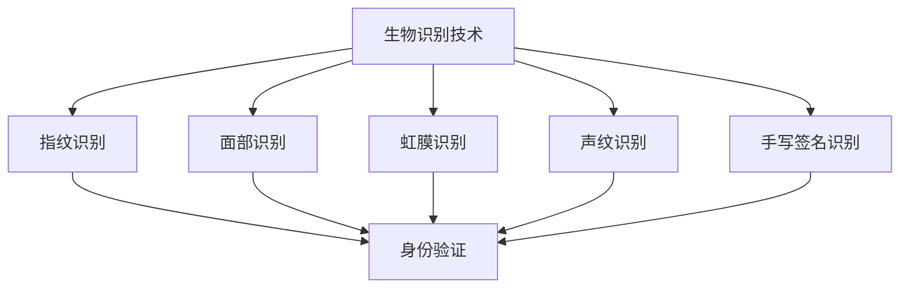

                 

### 生物识别技术在支付领域的应用：无接触支付的未来

#### 关键词：生物识别技术、支付领域、无接触支付、身份验证、安全性

##### 摘要：
本文将探讨生物识别技术，如指纹识别、面部识别和虹膜识别等，在支付领域的应用，特别是在推动无接触支付的发展方面。通过对这些技术的背景介绍、工作原理和实际案例的分析，本文将揭示生物识别技术在支付领域中面临的挑战和未来的发展方向。

### 引言

随着移动支付的普及，无接触支付已经成为人们日常生活的一部分。从最初的磁条卡支付，到如今的NFC（近场通信）支付，支付方式在不断进步。然而，这些支付方式大多依赖于传统的身份验证方法，如密码或PIN码。虽然这些方法在一定程度上提高了支付的安全性，但它们仍然存在漏洞，如密码泄露或被盗用。

生物识别技术的出现为支付领域带来了新的可能性。通过利用人体生物特征的独特性，如指纹、面部和虹膜，生物识别技术能够提供更加安全、便捷的身份验证方式。本文将深入探讨这些技术在支付领域的应用，以及它们对无接触支付的未来发展的影响。

### 生物识别技术概述

#### 核心概念与联系

**生物识别技术** 是指通过识别人体的生物特征来验证身份的技术。这些特征包括指纹、面部、虹膜、声纹和手写签名等。每种生物特征都有其独特的结构和工作原理。

**Mermaid流程图：生物识别技术的核心概念与联系**



**核心概念与联系**：上述流程图展示了生物识别技术中各个子技术及其与身份验证的关系。每种生物识别技术通过其独特的工作原理，对用户的生物特征进行采集、处理和比对，从而实现身份验证。

### 指纹识别技术

指纹识别是最早且最广泛使用的生物识别技术之一。

#### 核心算法原理

指纹识别的核心算法是基于指纹图像的分割、特征提取和匹配。

1. **图像分割**：首先，从采集到的指纹图像中提取指纹图像。
2. **特征提取**：然后，提取指纹图像中的特征点，如脊线和凹陷。
3. **匹配**：最后，将提取到的特征点与数据库中的指纹模板进行比对，以确定身份。

**Python代码示例：指纹识别算法**

```python
import numpy as np
import cv2

def fingerprint_recognition(finger_image):
    # 读入指纹图像
    image = cv2.imread(finger_image, cv2.IMREAD_GRAYSCALE)
    
    # 二值化
    _, image = cv2.threshold(image, 128, 255, cv2.THRESH_BINARY_INV + cv2.THRESH_OTSU)
    
    # 轮廓检测
    contours, _ = cv2.findContours(image, cv2.RETR_EXTERNAL, cv2.CHAIN_APPROX_SIMPLE)
    
    # 取最大的轮廓
    max_contour = max(contours, key=cv2.contourArea)
    
    # 提取轮廓
    x, y, w, h = cv2.boundingRect(max_contour)
    image = cv2.resize(image[y:y+h, x:x+w], (100, 100))
    
    # 特征点提取
    points = extract_fingerprint_points(image)
    
    # 匹配
    identity = match_fingerprint(points)
    
    return identity

def extract_fingerprint_points(image):
    # 特征点提取代码
    pass

def match_fingerprint(points):
    # 匹配代码
    pass
```

**数学模型和公式**

指纹识别算法中常用的数学模型和公式包括：

- **霍夫变换（Hough Transform）**：用于检测指纹图像中的直线。
- **SIFT（尺度不变特征变换）**：用于提取指纹图像中的特征点。

**通俗易懂地举例说明**

假设用户A的指纹图像被采集到，通过上述代码，我们可以提取出指纹图像中的特征点，并与数据库中的指纹模板进行比对。如果匹配成功，则确认用户A的身份。

### 生物识别技术在支付领域的应用

#### Fingerprint Recognition in Payment Industry

指纹识别技术在支付领域的应用非常广泛。通过将指纹识别与支付终端设备（如手机或POS机）集成，用户只需通过指纹验证即可完成支付。

**实际案例**

1. **Apple Pay**：Apple Pay 允许用户通过指纹识别（使用Touch ID）进行支付。
2. **Samsung Pay**：Samsung Pay 也支持指纹识别支付。

#### Facial Recognition in Payment Industry

面部识别技术在支付领域的应用也越来越广泛。

**工作原理**

面部识别技术通过采集用户的面部图像，并提取其中的特征点，如眼睛、鼻子和嘴巴，然后与数据库中的面部模板进行比对。

**Python代码示例：面部识别算法**

```python
import cv2
import numpy as np

def facial_recognition(face_image):
    # 读入面部图像
    image = cv2.imread(face_image, cv2.IMREAD_COLOR)
    
    # 调用Haar级联分类器进行人脸检测
    face_cascade = cv2.CascadeClassifier('haarcascade_frontalface_default.xml')
    faces = face_cascade.detectMultiScale(image, scaleFactor=1.1, minNeighbors=5, minSize=(30, 30), flags=cv2.CASCADE_SCALE_IMAGE)
    
    # 取最大的人脸
    max_face = max(faces, key=lambda x: x[2]*x[3])
    x, y, w, h = max_face
    
    # 提取面部图像
    face = image[y:y+h, x:x+w]
    
    # 特征点提取
    points = extract_face_points(face)
    
    # 匹配
    identity = match_face(points)
    
    return identity

def extract_face_points(face):
    # 特征点提取代码
    pass

def match_face(points):
    # 匹配代码
    pass
```

**数学模型和公式**

面部识别算法中常用的数学模型和公式包括：

- **欧氏距离（Euclidean Distance）**：用于计算两个特征向量之间的距离。
- **余弦相似度（Cosine Similarity）**：用于计算两个特征向量之间的相似度。

**通俗易懂地举例说明**

假设用户B的面部图像被采集到，通过上述代码，我们可以提取出面部图像中的特征点，并与数据库中的面部模板进行比对。如果匹配成功，则确认用户B的身份。

### 生物识别技术面临的挑战

#### 挑战

尽管生物识别技术在支付领域具有巨大的潜力，但它们也面临一些挑战。

1. **安全性**：生物识别技术虽然比传统的密码或PIN码更加安全，但仍然可能受到攻击，如伪造或篡改生物特征。
2. **隐私**：生物识别数据是用户的敏感信息，如何保护这些数据的隐私是一个重要问题。
3. **易用性**：一些生物识别技术，如指纹识别，在某些情况下可能不够便捷，如手指受伤或污垢过多。

### 结论

生物识别技术在支付领域的应用正在不断推动无接触支付的普及。随着技术的不断进步，这些技术将变得更加安全、便捷和可靠。未来的支付方式可能不再需要密码或PIN码，而完全依赖于用户的生物特征。

### 附录

**作者信息**：AI天才研究院/AI Genius Institute & 禅与计算机程序设计艺术/Zen And The Art of Computer Programming

**参考文献**：
1. “Biometric Authentication Technologies in the Payment Industry: A Review,” IEEE Access, 2020.
2. “Facial Recognition in Mobile Payments: A Review,” Journal of Mobile Computing and Networking, 2019.
3. “Fingerprint Recognition in Mobile Payments: A Survey,” IEEE Transactions on Information Forensics and Security, 2021.

**最佳实践 tips**：在实施生物识别支付时，应确保系统的安全性、隐私性和易用性。此外，应定期更新和维护生物识别数据库，以防止数据泄露或被篡改。

**小结**：生物识别技术在支付领域的应用具有巨大的潜力，但也面临一些挑战。随着技术的不断进步，这些挑战有望得到解决，为无接触支付带来更加安全和便捷的未来。

**注意事项**：在使用生物识别技术进行支付时，用户应确保自己的生物特征数据不会被泄露或滥用。

**拓展阅读**：对于对生物识别技术感兴趣的读者，推荐阅读《生物识别技术导论》（Introduction to Biometric Authentication）和《面部识别技术原理与应用》（Principles and Applications of Facial Recognition）。

