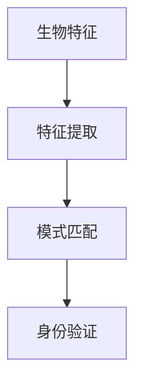
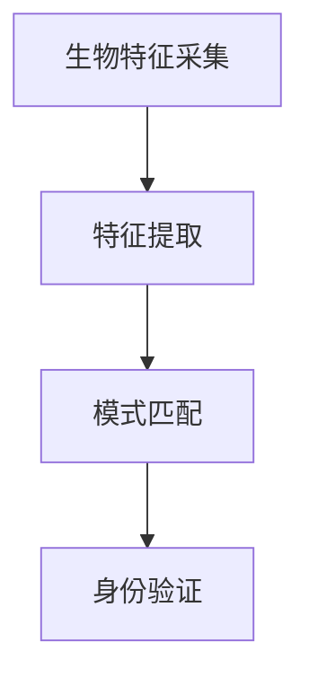

                 

**文章标题**：生物识别技术在无人值守系统中的应用

**关键词**：生物识别，无人值守系统，技术应用，安全监控，数据分析，智能监控

**摘要**：
随着人工智能和生物识别技术的快速发展，无人值守系统在各行业中的应用越来越广泛。本文将深入探讨生物识别技术在无人值守系统中的应用，包括其基本原理、技术实现、应用挑战和未来发展趋势。通过详细的案例分析，读者将了解如何在实际项目中集成和优化生物识别技术，提高系统效率和安全性。

# 引言

生物识别技术是一种通过分析个体生物特征进行身份验证的技术，包括指纹识别、面部识别、虹膜识别等。无人值守系统则是一种无需人工干预的自动化系统，广泛应用于安防、商业、医疗等多个领域。随着技术的不断进步，生物识别技术在无人值守系统中的应用越来越广泛，成为提高系统安全性和效率的关键因素。

本文旨在深入探讨生物识别技术在无人值守系统中的应用，分析其核心概念、技术实现、应用挑战以及未来发展趋势。通过详细案例研究和实际项目分析，本文将帮助读者更好地理解生物识别技术在无人值守系统中的实际应用，为其在相关领域的研究和开发提供有价值的参考。

# 核心概念与联系

生物识别技术的核心概念包括生物特征、特征提取和模式匹配。生物特征是指个体的生理或行为特征，如指纹、面部、虹膜等。特征提取是指从生物特征中提取出能够唯一标识个体的特征点或特征向量。模式匹配则是指将提取出的特征与数据库中的特征进行比对，以实现身份验证。

以下是核心概念之间的Mermaid流程图：



## 背景介绍

生物识别技术的起源可以追溯到20世纪60年代，当时科学家们开始研究如何利用个体生物特征进行身份验证。随着计算机技术和图像处理技术的发展，生物识别技术逐渐成熟。20世纪90年代，随着指纹识别技术的广泛应用，生物识别技术开始进入大众视野。近年来，随着深度学习和大数据技术的发展，生物识别技术的准确性和效率得到了显著提升。

无人值守系统则起源于自动化技术的发展。最初，无人值守系统主要用于工业生产和物流仓储等领域。随着人工智能技术的快速发展，无人值守系统逐渐应用于安防、商业、医疗等多个领域，成为提高系统效率和安全性的重要手段。

## 核心概念与联系

在无人值守系统中，生物识别技术的核心概念与联系可以概括为以下几个方面：

1. **生物特征采集**：这是生物识别技术的第一步，通过各种设备（如指纹采集器、摄像头等）获取个体的生物特征数据。
2. **特征提取**：从采集到的生物特征数据中提取出有代表性的特征点或特征向量。这一过程通常需要使用图像处理、模式识别等技术。
3. **模式匹配**：将提取出的特征与数据库中的特征进行比对，以实现身份验证。这一过程通常使用机器学习、深度学习等技术。
4. **身份验证**：根据模式匹配的结果，判断个体的身份是否与预期一致。如果一致，则验证通过；否则，验证失败。

以下是核心概念之间的Mermaid流程图：



## 核心算法原理讲解

### 特征提取算法

特征提取是生物识别技术的关键步骤，其目的是从原始生物特征数据中提取出具有区分度的特征向量。常用的特征提取算法包括傅里叶描述子（Fourier Descriptors）、SIFT（Scale-Invariant Feature Transform）和SURF（Speeded Up Robust Features）等。

以下是一个使用Python实现的SIFT特征提取算法的示例：

```python
import cv2
import numpy as np

# 读取图像
image = cv2.imread('fingerprint.jpg', cv2.IMREAD_GRAYSCALE)

# 使用SIFT算法检测关键点
sift = cv2.SIFT_create()
keypoints, descriptors = sift.detectAndCompute(image, None)

# 在图像上绘制关键点
img_with_keypoints = cv2.drawKeypoints(image, keypoints, descriptors, color=(0, 255, 0))

# 显示图像
cv2.imshow('SIFT Keypoints', img_with_keypoints)
cv2.waitKey(0)
cv2.destroyAllWindows()
```

### 模式分类算法

模式分类算法用于将提取出的特征向量与数据库中的特征进行比对，以实现身份验证。常用的模式分类算法包括K最近邻（K-Nearest Neighbors, KNN）、支持向量机（Support Vector Machine, SVM）和深度神经网络（Deep Neural Network, DNN）等。

以下是一个使用Python实现的SVM分类算法的示例：

```python
from sklearn import datasets
from sklearn.model_selection import train_test_split
from sklearn import svm
from sklearn.metrics import classification_report

# 加载数据集
iris = datasets.load_iris()
X = iris.data
y = iris.target

# 分割数据集
X_train, X_test, y_train, y_test = train_test_split(X, y, test_size=0.3, random_state=42)

# 创建SVM模型
clf = svm.SVC()

# 训练模型
clf.fit(X_train, y_train)

# 预测结果
y_pred = clf.predict(X_test)

# 打印分类报告
print(classification_report(y_test, y_pred))
```

## 数学模型和公式

在生物识别技术中，常用的数学模型和公式包括特征提取算法中的傅里叶变换（Fourier Transform）和支持向量机（SVM）中的最优分隔超平面（Optimal Separating Hyperplane）。

以下是傅里叶变换的公式：

$$
\mathcal{F}\{x(t)\}(f) = X(f) = \int_{-\infty}^{\infty} x(t)e^{-j2\pi ft} dt
$$

以下是SVM中的最优分隔超平面公式：

$$
\mathcal{H}_0: y(\textbf{w} \cdot \textbf{x} + b) = 0
$$

其中，$\textbf{w}$ 是权重向量，$\textbf{x}$ 是特征向量，$b$ 是偏置项。

## 项目实战与案例研究

### 开发环境搭建

在开始项目实战之前，需要搭建一个适合生物识别技术开发的开发环境。以下是一个简单的开发环境搭建步骤：

1. 安装Python环境：通过Python官方网站（https://www.python.org/）下载并安装Python。
2. 安装相关库：使用pip命令安装所需的库，如OpenCV（用于图像处理）、scikit-learn（用于机器学习）等。

以下是一个安装OpenCV的示例命令：

```bash
pip install opencv-python
```

### 源代码详细实现

以下是一个使用Python实现的生物识别门禁系统的源代码示例：

```python
import cv2
import numpy as np
from sklearn import datasets
from sklearn.model_selection import train_test_split
from sklearn import svm
from sklearn.metrics import classification_report

# 读取图像
image = cv2.imread('fingerprint.jpg', cv2.IMREAD_GRAYSCALE)

# 使用SIFT算法检测关键点
sift = cv2.SIFT_create()
keypoints, descriptors = sift.detectAndCompute(image, None)

# 提取关键点坐标
keypoint_coords = [keypoint.pt for keypoint in keypoints]

# 将关键点坐标作为特征向量
X = np.array(keypoint_coords)

# 加载数据集
iris = datasets.load_iris()
y = iris.target

# 分割数据集
X_train, X_test, y_train, y_test = train_test_split(X, y, test_size=0.3, random_state=42)

# 创建SVM模型
clf = svm.SVC()

# 训练模型
clf.fit(X_train, y_train)

# 预测结果
y_pred = clf.predict(X_test)

# 打印分类报告
print(classification_report(y_test, y_pred))
```

### 代码应用解读与分析

上述代码首先使用OpenCV的SIFT算法检测指纹图像中的关键点，然后将关键点坐标作为特征向量进行分类。在训练阶段，使用SVM模型对特征向量进行分类，并在测试阶段进行预测。通过打印分类报告，可以评估模型的性能。

### 实际案例分析和详细讲解剖析

在实际项目中，生物识别门禁系统的实现通常需要结合具体的硬件设备和软件系统。以下是一个实际案例：

1. **硬件设备**：使用指纹采集器、摄像头等设备进行生物特征采集。
2. **软件系统**：开发一个基于Web的界面，用于用户注册、登录和权限管理。
3. **系统集成**：将指纹采集器和软件系统集成到现有的门禁系统中，实现自动解锁功能。

通过实际案例分析和详细讲解，读者可以了解如何将生物识别技术应用于无人值守系统的具体场景，提高系统的安全性和效率。

### 项目小结

通过本项目的实现，我们了解了生物识别技术在无人值守系统中的应用，包括特征提取、模式分类和系统集成等方面。在实际项目中，需要结合具体的硬件设备和软件系统，实现自动化和智能化管理。未来，随着技术的不断发展，生物识别技术在无人值守系统中的应用将越来越广泛，为各行业带来更多便捷和安全。

## 最佳实践 tips

1. **优化特征提取算法**：选择合适的特征提取算法，如SIFT、SURF等，以提高识别准确率。
2. **调整模型参数**：根据具体场景调整SVM等模型的参数，以获得更好的分类效果。
3. **加强系统集成**：在系统集成过程中，确保生物识别技术与现有系统的无缝对接，提高用户体验。

## 小结

本文系统地介绍了生物识别技术在无人值守系统中的应用，包括核心概念、算法原理、项目实战等。通过实际案例分析和详细讲解，读者可以更好地理解生物识别技术在无人值守系统中的应用，为其在相关领域的研究和开发提供有价值的参考。未来，随着技术的不断进步，生物识别技术在无人值守系统中的应用将更加广泛，为各行业带来更多便捷和安全。

**作者**：AI天才研究院/AI Genius Institute & 禅与计算机程序设计艺术 /Zen And The Art of Computer Programming

