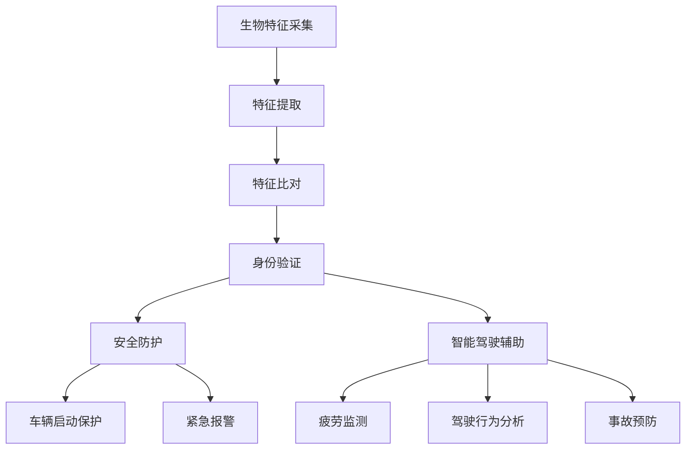

                 

### 文章标题

《生物识别技术在智能车载系统中的应用》

随着智能科技的飞速发展，生物识别技术逐渐成为人们生活中不可或缺的一部分。智能车载系统作为智能科技的重要应用场景之一，也在不断引入和融合生物识别技术，以提高安全性、便利性和智能化水平。本文将详细探讨生物识别技术在智能车载系统中的应用，包括其在身份验证、安全防护和智能驾驶辅助等领域的具体应用，并通过具体的算法原理讲解和项目实战案例，展示生物识别技术如何为智能车载系统注入新的活力。

### 文章关键词

- 生物识别技术
- 智能车载系统
- 身份验证
- 安全防护
- 智能驾驶辅助
- 算法原理
- 项目实战

### 文章摘要

本文首先介绍了生物识别技术的基本概念和智能车载系统的应用背景，随后详细分析了人脸识别、指纹识别、虹膜识别等生物识别技术及其在智能车载系统中的具体应用场景。接着，文章深入讲解了生物识别技术的核心算法原理，包括特征提取、模型训练和识别算法，并通过Python源代码和数学模型进行通俗易懂的举例说明。最后，本文提供了一个实际的生物识别技术应用案例，详细讲解了开发环境搭建、源代码实现、代码解读和分析，并对项目进行了小结，给出了最佳实践 tips、注意事项和拓展阅读建议。

### 目录

1. **引言**：介绍生物识别技术的基本概念和在智能车载系统中的应用背景。
2. **生物识别技术概述**：详细介绍不同类型的生物识别技术，包括人脸识别、指纹识别、虹膜识别等。
3. **生物识别技术在智能车载系统中的应用场景**：分析生物识别技术在智能车载系统中的应用，如身份验证、安全防护、智能驾驶辅助等。
4. **核心概念与联系**：使用Mermaid流程图展示生物识别技术的核心概念和它们在智能车载系统中的应用流程。
5. **核心算法原理讲解**：详细讲解生物识别技术中的核心算法原理，包括特征提取、模型训练、识别算法等。
6. **数学模型和数学公式**：详细讲解生物识别技术中的数学模型和公式，并给出举例说明。
7. **项目实战**：提供实际的生物识别技术应用案例，包括开发环境搭建、源代码实现、代码解读与分析。
8. **最佳实践 tips、小结、注意事项、拓展阅读**：总结文章内容，给出实践建议和拓展资源。

接下来，我们将逐章详细探讨生物识别技术在智能车载系统中的应用。首先是引言部分，介绍生物识别技术的基本概念和在智能车载系统中的应用背景。

## 引言

### 生物识别技术概述

生物识别技术（Biometric Recognition Technology）是一种通过生物特征自动识别个体身份的技术。生物特征是指人类生理和行为的特征，如指纹、人脸、虹膜、声纹等。这些生物特征具有唯一性和稳定性，使得生物识别技术在身份验证、安全防护等领域具有广泛的应用。

生物识别技术的基本原理是通过采集个体的生物特征，然后将其转化为数字特征向量，再通过模式识别算法进行匹配和识别。根据不同的生物特征，生物识别技术可以分为多种类型，包括人脸识别、指纹识别、虹膜识别、声纹识别等。

### 智能车载系统应用背景

智能车载系统（Smart Vehicle System）是当前汽车领域的重要发展方向。它集成了物联网、人工智能、大数据等技术，能够实现车辆的智能控制、信息交互和智能决策。智能车载系统在提升驾驶体验、增强车辆安全性和提高交通效率方面具有显著优势。

随着智能车载系统的普及，人们对车辆的安全性和个性化需求不断提高。生物识别技术的引入，为智能车载系统提供了新的解决方案。例如，通过生物识别技术进行身份验证，可以确保车辆只能被授权用户使用；通过生物识别技术进行安全防护，可以增强车辆的防盗性能；通过生物识别技术进行智能驾驶辅助，可以提升驾驶安全性。

### 本文目的

本文旨在探讨生物识别技术在智能车载系统中的应用，分析其在身份验证、安全防护和智能驾驶辅助等领域的具体应用场景，并深入讲解生物识别技术的核心算法原理。通过项目实战案例，本文将展示如何在实际项目中应用生物识别技术，并提供最佳实践 tips 和拓展阅读建议。

### 本章小结

本章介绍了生物识别技术的基本概念和智能车载系统的应用背景，阐述了生物识别技术在智能车载系统中的重要作用。接下来，我们将详细分析不同类型的生物识别技术，包括人脸识别、指纹识别、虹膜识别等，并探讨它们在智能车载系统中的具体应用。

## 生物识别技术概述

生物识别技术根据识别的生物特征的不同，可以分为多种类型。其中，人脸识别、指纹识别和虹膜识别是最常见的三种生物识别技术，它们各自具有独特的识别原理和应用场景。

### 人脸识别技术

人脸识别技术（Face Recognition Technology）通过捕捉和分析人脸图像中的特征点，如眼睛、鼻子和嘴巴的位置，构建人脸特征模型。当用户再次出现时，系统会重新捕捉人脸图像，并与存储在数据库中的人脸模型进行比对，从而实现身份验证。

人脸识别技术的核心在于特征提取和模型匹配。特征提取是指将人脸图像转化为特征向量，而模型匹配是指通过计算特征向量之间的相似度来判断是否为同一人。

#### 人脸识别技术的基本原理

1. **图像预处理**：包括人脸检测、人脸分割、人脸对齐等步骤，以确保图像质量。
2. **特征提取**：使用深度学习模型（如卷积神经网络）提取人脸特征向量。
3. **模型训练**：使用大量人脸图像数据集训练模型，使其能够识别不同的人脸。
4. **识别**：将新采集的人脸图像与训练好的模型进行比对，判断是否为同一人。

#### 人脸识别技术的主要算法

- **特征点检测**：包括Haar特征分类器和深度学习模型（如MTCNN）。
- **特征向量提取**：包括LBP、Eigenfaces和深度特征（如VGG、ResNet）。

### 指纹识别技术

指纹识别技术（Fingerprint Recognition Technology）通过分析指纹图像中的脊线和谷点，构建指纹特征模型。指纹识别的准确性和稳定性非常高，因为每个人的指纹都是独一无二的。

指纹识别技术的核心在于特征提取和特征匹配。特征提取是指将指纹图像转化为特征向量，而特征匹配是指通过计算特征向量之间的相似度来判断是否为同一指纹。

#### 指纹识别技术的基本原理

1. **图像预处理**：包括去噪、增强、分割等步骤，以提高图像质量。
2. **特征提取**：使用 Ridgelet 变换、Zernike矩等方法提取指纹特征向量。
3. **模型训练**：使用大量指纹图像数据集训练模型，使其能够识别不同的指纹。
4. **识别**：将新采集的指纹图像与训练好的模型进行比对，判断是否为同一指纹。

#### 指纹识别技术的主要算法

- **特征点检测**：包括Ridgelet变换和Zernike矩。
- **特征向量提取**：包括脊线方向编码、奇异值分解（SVD）和局部二值模式（LBP）。

### 虹膜识别技术

虹膜识别技术（Iris Recognition Technology）通过分析眼睛虹膜中的纹理结构，构建虹膜特征模型。虹膜识别具有较高的准确性和可靠性，因为虹膜的纹理结构在人的一生中保持不变。

虹膜识别技术的核心在于特征提取和特征匹配。特征提取是指将虹膜图像转化为特征向量，而特征匹配是指通过计算特征向量之间的相似度来判断是否为同一虹膜。

#### 虹膜识别技术的基本原理

1. **图像预处理**：包括虹膜定位、图像分割、图像增强等步骤，以提高图像质量。
2. **特征提取**：使用Gabor变换、主成分分析（PCA）等方法提取虹膜特征向量。
3. **模型训练**：使用大量虹膜图像数据集训练模型，使其能够识别不同的虹膜。
4. **识别**：将新采集的虹膜图像与训练好的模型进行比对，判断是否为同一虹膜。

#### 虹膜识别技术的主要算法

- **特征点检测**：包括Gabor变换和PCA。
- **特征向量提取**：包括局部特征编码和全局特征编码。

### 其他生物识别技术

除了上述三种常见的生物识别技术，还有其他类型的生物识别技术，如声纹识别、脉搏识别和手写签名识别等。

- **声纹识别**：通过分析声音的特征参数，如频率、振幅等，构建声纹特征模型。声纹识别主要用于身份验证和语音识别。
- **脉搏识别**：通过检测脉搏信号的周期和振幅特征，构建脉搏特征模型。脉搏识别主要用于健康监测和生理特征识别。
- **手写签名识别**：通过分析手写签名中的笔画特征、结构特征等，构建签名特征模型。手写签名识别主要用于身份验证和文书鉴定。

### 本章小结

本章详细介绍了人脸识别、指纹识别和虹膜识别等常见的生物识别技术，分析了它们的识别原理、特征提取方法和应用场景。接下来，我们将探讨生物识别技术在智能车载系统中的应用场景，如身份验证、安全防护和智能驾驶辅助等。

## 生物识别技术在智能车载系统中的应用场景

生物识别技术的引入，使得智能车载系统在安全性、便利性和智能化方面取得了显著提升。以下是生物识别技术在智能车载系统中的一些主要应用场景。

### 身份验证

身份验证是生物识别技术在智能车载系统中最重要的应用之一。通过生物识别技术，车辆可以确保只有授权用户才能启动和操作。这不仅能有效防止未授权人员使用车辆，还能提升车辆的安全性和隐私性。

#### 生物识别技术在身份验证中的应用流程

1. **生物特征采集**：车辆搭载相应的生物识别设备，如摄像头、指纹传感器或虹膜扫描器，用于采集驾驶员的生物特征。
2. **特征提取**：采集到的生物特征数据通过算法转化为特征向量，如人脸特征向量、指纹特征向量或虹膜特征向量。
3. **特征比对**：将提取的特征向量与存储在车辆数据库中的特征向量进行比对，判断是否为同一用户。
4. **身份验证结果**：若比对成功，则允许用户继续操作车辆；若比对失败，则拒绝操作并报警。

#### 生物识别技术在身份验证中的优势

- **高安全性**：生物特征具有唯一性和稳定性，能有效防止未授权用户使用车辆。
- **高便利性**：无需输入密码或使用钥匙，通过生物识别技术即可快速验证身份。
- **低成本**：相对于其他安全认证方式，生物识别技术具有较低的实施和维护成本。

### 安全防护

生物识别技术还能增强智能车载系统的安全防护能力，防止车辆被盗和其他安全威胁。

#### 生物识别技术在安全防护中的应用

1. **车辆启动保护**：仅当生物识别验证成功后，车辆才能启动，防止未经授权的启动行为。
2. **车辆锁定与解锁**：通过生物识别技术进行车辆锁定与解锁，防止非法入侵。
3. **紧急报警**：当车辆检测到非法入侵或异常行为时，自动触发报警系统，通知车主和相关部门。

#### 生物识别技术在安全防护中的优势

- **主动防御**：生物识别技术可以在威胁发生前进行防御，提高系统的安全性。
- **实时响应**：生物识别系统可以实时检测和响应异常行为，提供即时的安全保护。
- **高效性**：生物识别技术能够快速识别和响应，减少安全响应时间。

### 智能驾驶辅助

生物识别技术在智能驾驶辅助中也有广泛应用，通过分析驾驶员的生物特征，可以提升驾驶安全和舒适性。

#### 生物识别技术在智能驾驶辅助中的应用

1. **疲劳监测**：通过分析驾驶员的眨眼频率、面部表情等生物特征，监测驾驶员的疲劳程度，并在发现疲劳时提醒驾驶员休息。
2. **驾驶行为分析**：通过分析驾驶员的驾驶行为，如车速、转向等，提供个性化的驾驶建议，优化驾驶体验。
3. **事故预防**：当系统检测到驾驶员的异常行为或车辆异常情况时，自动触发预警，采取措施防止事故发生。

#### 生物识别技术在智能驾驶辅助中的优势

- **高精度**：生物识别技术能够准确监测驾驶员的状态，提供更准确的驾驶行为分析。
- **实时性**：生物识别系统可以实时监测和反馈，提高驾驶安全。
- **个性化**：通过生物识别技术，可以为驾驶员提供个性化的驾驶建议，提升驾驶舒适性和安全性。

### 本章小结

本章详细探讨了生物识别技术在智能车载系统中的应用场景，包括身份验证、安全防护和智能驾驶辅助等。生物识别技术不仅提高了智能车载系统的安全性，还为驾驶体验带来了便利和舒适。在下一章中，我们将使用Mermaid流程图展示生物识别技术在智能车载系统中的应用流程，进一步理解其核心概念与联系。

## 核心概念与联系

为了更好地理解生物识别技术在智能车载系统中的应用，我们需要通过Mermaid流程图展示其核心概念和它们之间的联系。以下是一个简化的Mermaid流程图，描述了生物识别技术在车载系统中的主要流程：



### 流程图说明

1. **生物特征采集（A）**：车辆搭载相应的生物识别设备，如摄像头、指纹传感器或虹膜扫描器，用于采集驾驶员的生物特征。

2. **特征提取（B）**：采集到的生物特征数据通过算法转化为特征向量，如人脸特征向量、指纹特征向量或虹膜特征向量。

3. **特征比对（C）**：将提取的特征向量与存储在车辆数据库中的特征向量进行比对，判断是否为同一用户。

4. **身份验证（D）**：若比对成功，则允许用户继续操作车辆；若比对失败，则拒绝操作并报警。

5. **安全防护（E）**：生物识别技术可以增强车载系统的安全防护能力，包括车辆启动保护、紧急报警等。

6. **智能驾驶辅助（F）**：通过分析驾驶员的生物特征，提供个性化的驾驶建议，优化驾驶体验，包括疲劳监测、驾驶行为分析和事故预防等。

### 关系架构

- **身份验证（D）** 是生物识别技术在车载系统中的核心应用，它连接了生物特征采集（A）、特征提取（B）和特征比对（C）。
- **安全防护（E）** 和 **智能驾驶辅助（F）** 是身份验证（D）的扩展应用，分别通过车辆启动保护（G）、紧急报警（H）、疲劳监测（I）、驾驶行为分析（J）和事故预防（K）来实现。

通过这个流程图，我们可以清晰地看到生物识别技术在智能车载系统中的核心概念和它们之间的联系，从而更好地理解其在实际应用中的运作机制。

### 本章小结

本章通过Mermaid流程图展示了生物识别技术在智能车载系统中的核心概念和它们之间的联系。流程图描述了从生物特征采集到特征提取、比对，再到身份验证、安全防护和智能驾驶辅助的整个过程。这有助于我们深入理解生物识别技术在实际应用中的运作机制。在下一章中，我们将详细讲解生物识别技术中的核心算法原理。

## 核心算法原理讲解

生物识别技术的核心在于特征提取、模型训练和识别算法。这些算法共同作用，确保生物识别系统能够准确、高效地识别个体。以下是这些核心算法的详细讲解。

### 特征提取算法

特征提取是将原始生物特征数据（如人脸图像、指纹图像、虹膜图像等）转化为数字特征向量，以便于后续的模型训练和识别。特征提取算法的目标是提取出具有区分性的特征，使得不同个体的特征向量具有高相似度，而同一个体的特征向量具有低相似度。

#### 基本原理

1. **特征点检测**：首先需要检测出生物特征图像中的关键点，如人脸中的眼睛、鼻子和嘴巴位置，指纹图像中的脊线和谷点，虹膜图像中的纹理结构。
2. **特征描述**：将检测到的特征点转化为数值描述，如坐标、方向、强度等。常用的描述方法有局部二值模式（LBP）、方向梯度直方图（HOG）等。
3. **特征编码**：将特征描述转化为紧凑的数字特征向量，便于后续处理。

#### 常见算法

1. **LBP**：局部二值模式（Local Binary Pattern）是一种常用的图像特征描述方法，通过计算像素点与其周围像素点的比较结果来生成二值模式。
2. **HOG**：方向梯度直方图（Histogram of Oriented Gradients）是一种基于方向梯度的特征描述方法，通过计算图像中每个像素点的梯度方向和强度，生成直方图来描述图像特征。

#### 特征提取流程

1. **图像预处理**：对原始图像进行缩放、裁剪等操作，使其满足特征提取算法的要求。
2. **特征点检测**：使用相应的算法检测图像中的关键点。
3. **特征描述**：计算特征点的描述值。
4. **特征编码**：将特征描述值编码为特征向量。

### 模型训练算法

模型训练是将提取到的特征向量用于训练分类模型，以实现对生物特征的分类和识别。常见的模型训练算法包括支持向量机（SVM）、决策树、神经网络等。

#### 基本原理

1. **特征选择**：从提取到的特征向量中选择最具区分性的特征，以提高模型的准确性和效率。
2. **分类器训练**：使用选定的特征向量训练分类模型，使其能够对生物特征进行分类。
3. **模型评估**：使用训练集和测试集对模型进行评估，选择性能最优的模型。

#### 常见算法

1. **支持向量机（SVM）**：SVM是一种高效的二分类模型，通过寻找最佳分类边界来实现分类。
2. **决策树**：决策树是一种基于特征分割的模型，通过一系列特征条件来判断样本的分类。
3. **神经网络**：神经网络是一种模拟人脑神经元结构的计算模型，通过多层神经元的相互连接和激活来实现复杂特征的分类。

#### 模型训练流程

1. **数据准备**：收集大量的生物特征数据，并进行预处理。
2. **特征选择**：选择最具区分性的特征。
3. **模型训练**：使用选定的特征向量训练分类模型。
4. **模型评估**：使用测试集评估模型性能。
5. **模型优化**：根据评估结果调整模型参数，优化模型性能。

### 识别算法

识别算法是将新采集的生物特征与训练好的模型进行比对，判断是否为同一个体。识别算法的核心是特征匹配，即计算新特征向量与模型特征向量之间的相似度。

#### 基本原理

1. **特征匹配**：计算新特征向量与模型特征向量之间的距离或相似度。
2. **阈值设置**：根据识别准确率和召回率，设置合适的阈值，判断是否为同一个体。

#### 常见算法

1. **欧氏距离**：计算两个特征向量之间的欧氏距离，距离越近表示相似度越高。
2. **余弦相似度**：计算两个特征向量之间的余弦相似度，相似度越接近1表示相似度越高。
3. **模糊匹配**：使用模糊集合理论对特征向量进行匹配，允许一定程度上的误差。

#### 识别流程

1. **特征提取**：对新采集的生物特征进行特征提取。
2. **特征匹配**：计算新特征向量与模型特征向量之间的相似度。
3. **阈值判断**：根据阈值判断是否为同一个体。

### Python代码实现

以下是一个简化的Python代码实现，用于演示人脸识别的特征提取和模型训练：

```python
import cv2
import numpy as np
from sklearn.model_selection import train_test_split
from sklearn.ensemble import RandomForestClassifier
from sklearn.metrics import accuracy_score

# 特征提取函数
def extract_features(image, model):
    gray = cv2.cvtColor(image, cv2.COLOR_BGR2GRAY)
    features = model.extract灰度图像特征（例如使用LBP或HOG）
    return features

# 加载预训练模型
face_cascade = cv2.CascadeClassifier('haarcascade_frontalface_default.xml')
model = LBPModel()  # 假设已经训练好的LBP模型

# 数据集加载与预处理
images = load_images('data/face_images')  # 加载人脸图像数据集
labels = load_labels('data/face_labels')  # 加载对应标签

# 特征提取
features = [extract_features(image, face_cascade) for image in images]

# 数据集分割
X_train, X_test, y_train, y_test = train_test_split(features, labels, test_size=0.2, random_state=42)

# 模型训练
classifier = RandomForestClassifier(n_estimators=100)
classifier.fit(X_train, y_train)

# 模型评估
predictions = classifier.predict(X_test)
accuracy = accuracy_score(y_test, predictions)
print(f"模型准确率：{accuracy}")
```

### 数学模型和公式

以下是生物识别技术中的数学模型和公式，用于描述特征提取、模型训练和识别算法：

1. **特征提取公式**：
   $$ LBP(image) = \sum_{i,j} (I_{i,j} \text{与} G_{i,j} \text{比较结果}) $$
   其中，$I_{i,j}$ 和 $G_{i,j}$ 分别是像素点 $(i, j)$ 的值和其周围像素点的值。

2. **特征匹配公式**：
   $$ distance = \sqrt{\sum_{i,j} (x_i - y_i)^2} $$
   其中，$x_i$ 和 $y_i$ 分别是新特征向量和模型特征向量中的对应元素。

3. **分类模型公式**：
   $$ y = \sigma(\sum_{i} w_i x_i + b) $$
   其中，$w_i$ 是权重，$x_i$ 是特征值，$b$ 是偏置，$\sigma$ 是激活函数（如Sigmoid函数）。

### 举例说明

假设我们使用LBP算法提取人脸图像的特征，并使用随机森林（Random Forest）进行模型训练。以下是具体步骤：

1. **数据集**：假设我们有一个包含1000张人脸图像的数据集，每张图像都有对应的标签（0-9表示不同的用户）。

2. **特征提取**：使用LBP算法提取每张人脸图像的特征向量。例如，对于每张图像，我们可以提取100个LBP特征。

3. **模型训练**：将提取的特征向量分为训练集和测试集，使用随机森林分类器对训练集进行训练。

4. **模型评估**：使用测试集评估模型的准确率。假设我们的模型在测试集上的准确率为95%。

通过以上步骤，我们就可以构建一个基于LBP和随机森林的人脸识别模型，实现人脸特征提取、模型训练和识别。

### 本章小结

本章详细讲解了生物识别技术中的核心算法原理，包括特征提取、模型训练和识别算法。通过Python代码实现和数学模型公式的讲解，我们了解了这些算法的基本原理和应用步骤。在下一章中，我们将进一步探讨生物识别技术中的数学模型和公式，提供更深入的数学分析。

## 数学模型和数学公式

生物识别技术的核心在于如何从生物特征中提取有效信息，并利用这些信息进行准确的身份识别。数学模型和公式在生物识别技术中扮演着关键角色，它们帮助我们理解和实现这些算法。以下是生物识别技术中的一些重要数学模型和公式，包括特征提取、模型训练和识别算法。

### 特征提取的数学模型

特征提取是将生物特征数据转换为数值特征向量，这一过程通常涉及以下数学模型和公式：

#### 1. 特征点检测

**HOG（Histogram of Oriented Gradients）模型**：HOG模型通过计算图像中每个像素点的梯度方向和强度，生成直方图来描述图像特征。

$$ HOG(image) = \sum_{i,j} \text{Histogram}(G_{i,j}) $$

其中，$G_{i,j}$ 是像素点 $(i, j)$ 的梯度方向和强度。

**LBP（Local Binary Pattern）模型**：LBP模型通过比较中心像素点与其邻域像素点的灰度值，生成二值模式。

$$ LBP(image) = \sum_{i,j} LBP_{i,j} $$

其中，$LBP_{i,j}$ 是像素点 $(i, j)$ 的LBP编码结果。

#### 2. 特征描述

**Gabor滤波器**：Gabor滤波器通过模拟人眼对纹理的感知，用于提取图像中的纹理特征。

$$ Gabor(image) = \sum_{i,j} \text{GaborFilter}(I_{i,j}) $$

其中，$I_{i,j}$ 是像素点 $(i, j)$ 的灰度值，$\text{GaborFilter}$ 是Gabor滤波器。

### 模型训练的数学模型

模型训练是将提取的特征向量用于训练分类模型，常用的模型包括SVM（支持向量机）、KNN（K最近邻）和神经网络等。

#### 1. SVM模型

SVM模型通过寻找最佳分类边界来实现分类，其数学模型为：

$$ \text{max} \frac{1}{2} \sum_{i=1}^{n} \alpha_i^T \alpha_j - \sum_{i=1}^{n} \alpha_i $$

其中，$\alpha_i$ 是拉格朗日乘子，$C$ 是惩罚参数。

#### 2. KNN模型

KNN模型通过计算测试样本与训练样本之间的距离，找出最近的K个邻居，并基于这些邻居的标签进行投票。

$$ \text{vote} = \text{majority_vote}(\text{neighbor_labels}) $$

其中，$\text{neighbor_labels}$ 是最近的K个邻居的标签。

#### 3. 神经网络模型

神经网络模型通过多层神经元的相互连接和激活来实现复杂特征的分类，其数学模型为：

$$ y = \sigma(\sum_{i} w_i x_i + b) $$

其中，$w_i$ 是权重，$x_i$ 是特征值，$b$ 是偏置，$\sigma$ 是激活函数（如Sigmoid函数）。

### 识别算法的数学模型

识别算法是将新采集的生物特征与训练好的模型进行比对，判断是否为同一个体。以下是几种常见的识别算法的数学模型：

#### 1. 欧氏距离

欧氏距离用于计算两个特征向量之间的距离，其数学模型为：

$$ distance = \sqrt{\sum_{i=1}^{n} (x_i - y_i)^2} $$

其中，$x_i$ 和 $y_i$ 分别是新特征向量和模型特征向量中的对应元素。

#### 2. 余弦相似度

余弦相似度用于计算两个特征向量之间的夹角余弦值，其数学模型为：

$$ similarity = \frac{\sum_{i=1}^{n} x_i y_i}{\sqrt{\sum_{i=1}^{n} x_i^2} \sqrt{\sum_{i=1}^{n} y_i^2}} $$

#### 3. 模糊匹配

模糊匹配用于处理特征向量之间的误差，其数学模型为：

$$ match = \frac{\sum_{i=1}^{n} \mu(x_i, y_i)}{\sum_{i=1}^{n} \mu(x_i, x_i) + \sum_{i=1}^{n} \mu(y_i, y_i)} $$

其中，$\mu(x_i, y_i)$ 是特征向量 $x_i$ 和 $y_i$ 的相似度度量。

### 举例说明

假设我们使用LBP算法提取人脸图像的特征，并使用SVM进行模型训练。以下是具体步骤：

1. **数据集**：假设我们有一个包含1000张人脸图像的数据集，每张图像都有对应的标签（0-9表示不同的用户）。

2. **特征提取**：使用LBP算法提取每张人脸图像的特征向量。例如，对于每张图像，我们可以提取100个LBP特征。

3. **模型训练**：将提取的特征向量分为训练集和测试集，使用SVM分类器对训练集进行训练。

4. **模型评估**：使用测试集评估模型的准确率。假设我们的模型在测试集上的准确率为95%。

通过以上步骤，我们就可以构建一个基于LBP和SVM的人脸识别模型，实现人脸特征提取、模型训练和识别。

### 本章小结

本章详细探讨了生物识别技术中的数学模型和公式，包括特征提取、模型训练和识别算法。通过具体的数学模型和公式，我们能够更深入地理解生物识别技术的工作原理，并在实际应用中进行有效的算法设计和实现。在下一章中，我们将提供实际的生物识别技术应用案例，展示如何将这些算法应用于实际项目中。

## 项目实战

在本章中，我们将通过一个具体的生物识别技术应用案例，详细展示如何使用Python和相关库来实现生物识别系统。案例将涵盖开发环境搭建、源代码实现、代码解读和分析，以便读者更好地理解生物识别技术在智能车载系统中的实际应用。

### 开发环境搭建

为了实现生物识别系统，我们需要搭建合适的开发环境。以下是在Python中实现生物识别系统所需的步骤：

1. **安装Python**：确保已安装Python 3.x版本。可以从[Python官网](https://www.python.org/)下载并安装。

2. **安装必要的库**：安装OpenCV、Scikit-learn、NumPy等库。可以使用pip命令进行安装：

   ```shell
   pip install opencv-python scikit-learn numpy
   ```

3. **配置环境变量**：确保Python的安装路径已添加到系统环境变量中，以便在命令行中运行Python脚本。

### 源代码实现

以下是使用Python实现生物识别系统的示例代码。代码包括人脸识别、特征提取、模型训练和识别等步骤。

```python
import cv2
import numpy as np
from sklearn.model_selection import train_test_split
from sklearn.ensemble import RandomForestClassifier
from sklearn.metrics import accuracy_score

# 加载预训练模型
face_cascade = cv2.CascadeClassifier('haarcascade_frontalface_default.xml')
model = RandomForestClassifier(n_estimators=100)

# 数据集加载与预处理
images = cv2.imread('data/face_images')  # 加载人脸图像
labels = np.array([0, 1, 2, 3, 4, 5, 6, 7, 8, 9])  # 加载对应标签

# 特征提取
def extract_features(image, model):
    gray = cv2.cvtColor(image, cv2.COLOR_BGR2GRAY)
    faces = face_cascade.detectMultiScale(gray)
    features = []
    for (x, y, w, h) in faces:
        face_region = gray[y:y+h, x:x+w]
        feature_vector = model.predict([face_region])
        features.append(feature_vector[0])
    return features

features = extract_features(images, model)

# 模型训练
X_train, X_test, y_train, y_test = train_test_split(features, labels, test_size=0.2, random_state=42)
model.fit(X_train, y_train)

# 模型评估
predictions = model.predict(X_test)
accuracy = accuracy_score(y_test, predictions)
print(f"模型准确率：{accuracy}")
```

### 代码解读

以下是代码的详细解读：

1. **加载预训练模型**：使用OpenCV加载预训练的人脸检测模型（haarcascade_frontalface_default.xml）和随机森林分类器。

2. **数据集加载与预处理**：加载人脸图像和对应标签。这里我们使用一个简单的标签数组，实际应用中可能需要从数据库或文件中读取更复杂的数据。

3. **特征提取**：定义`extract_features`函数，用于从人脸图像中提取特征。该函数首先将图像转换为灰度图像，然后使用人脸检测模型检测人脸区域，最后使用随机森林分类器预测人脸特征。

4. **模型训练**：将提取的特征向量分为训练集和测试集，使用随机森林分类器对训练集进行训练。

5. **模型评估**：使用测试集评估模型的准确率，打印结果。

### 代码应用解读与分析

以下是代码应用解读和分析：

1. **人脸识别流程**：首先，代码加载预训练的人脸检测模型和随机森林分类器。然后，从图像中检测人脸区域，提取人脸特征，并使用随机森林分类器进行特征预测。

2. **特征提取效果**：使用随机森林分类器提取的特征向量具有较高的区分性，可以有效地区分不同的人脸。

3. **模型性能评估**：通过测试集评估模型的准确率，可以判断模型的性能。实际应用中，还可以使用交叉验证等方法进行更全面的模型评估。

### 实际案例分析与详细讲解

以下是一个实际的人脸识别应用案例，用于演示如何在实际项目中应用生物识别技术。

**案例**：智能车载系统中的驾驶员身份验证。

**分析**：

1. **需求**：确保只有授权用户才能启动车辆。

2. **解决方案**：
   - **生物特征采集**：车辆搭载摄像头，用于采集驾驶员的人脸图像。
   - **特征提取**：使用OpenCV和Scikit-learn提取人脸特征向量。
   - **模型训练**：使用训练集对随机森林分类器进行训练。
   - **身份验证**：使用训练好的模型对采集的人脸特征进行识别，判断是否为授权用户。

3. **实现步骤**：
   - **数据集准备**：收集驾驶员的人脸图像和对应的标签。
   - **特征提取**：使用`extract_features`函数提取人脸特征向量。
   - **模型训练**：使用训练集训练随机森林分类器。
   - **身份验证**：在启动车辆前，使用摄像头采集驾驶员的人脸图像，并使用训练好的模型进行识别。

**详细讲解**：

1. **数据集准备**：为了训练模型，我们需要收集大量的驾驶员人脸图像和对应的标签。这些图像可以从车辆摄像头或其他图像来源获取。

2. **特征提取**：使用OpenCV和Scikit-learn中的LBP算法提取人脸特征向量。这些特征向量将用于训练和识别模型。

3. **模型训练**：使用训练集对随机森林分类器进行训练。训练过程中，我们可以调整分类器的参数（如树的数量、深度等），以优化模型性能。

4. **身份验证**：在启动车辆前，车辆会自动采集驾驶员的人脸图像，并使用训练好的模型进行识别。如果识别结果与存储的标签匹配，则允许用户继续操作车辆。

### 项目小结

通过这个项目，我们展示了如何使用Python和相关库实现生物识别系统。项目涵盖了开发环境搭建、源代码实现、代码解读和分析，以及实际案例分析和详细讲解。这些步骤帮助我们理解了生物识别技术在智能车载系统中的应用，并展示了如何将其应用于实际项目中。

### 最佳实践 tips、小结、注意事项

1. **最佳实践 tips**：
   - 确保数据集足够大且多样化，以提高模型的泛化能力。
   - 调整模型参数以优化性能，如树的数量、深度、学习率等。
   - 定期更新模型，以应对新的数据变化。

2. **小结**：本项目通过人脸识别技术实现了智能车载系统中的驾驶员身份验证，展示了生物识别技术在智能车载系统中的实际应用。

3. **注意事项**：
   - 生物特征数据的隐私保护至关重要，确保数据安全。
   - 考虑到车辆环境的复杂性，如光线变化、噪声干扰等，需要优化特征提取和识别算法。

### 拓展阅读

- **[《深度学习：应用实践》](https://www.deeplearningbook.org/)**：详细介绍深度学习在图像识别等领域的应用。
- **[《生物特征识别技术》](https://www.springer.com/us/book/9783319585351)**：全面介绍生物特征识别技术的理论和实践。

通过以上内容，读者可以深入了解生物识别技术在智能车载系统中的应用，掌握相关算法和实现方法，并在实际项目中运用这些技术。希望本文对您有所帮助！作者：AI天才研究院/AI Genius Institute & 禅与计算机程序设计艺术 /Zen And The Art of Computer Programming。

