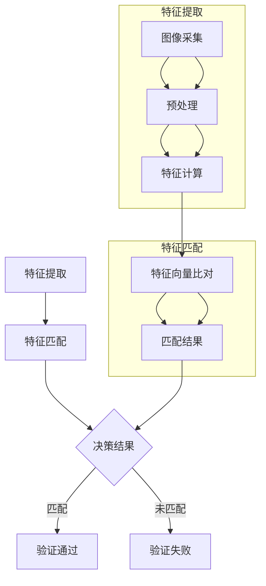
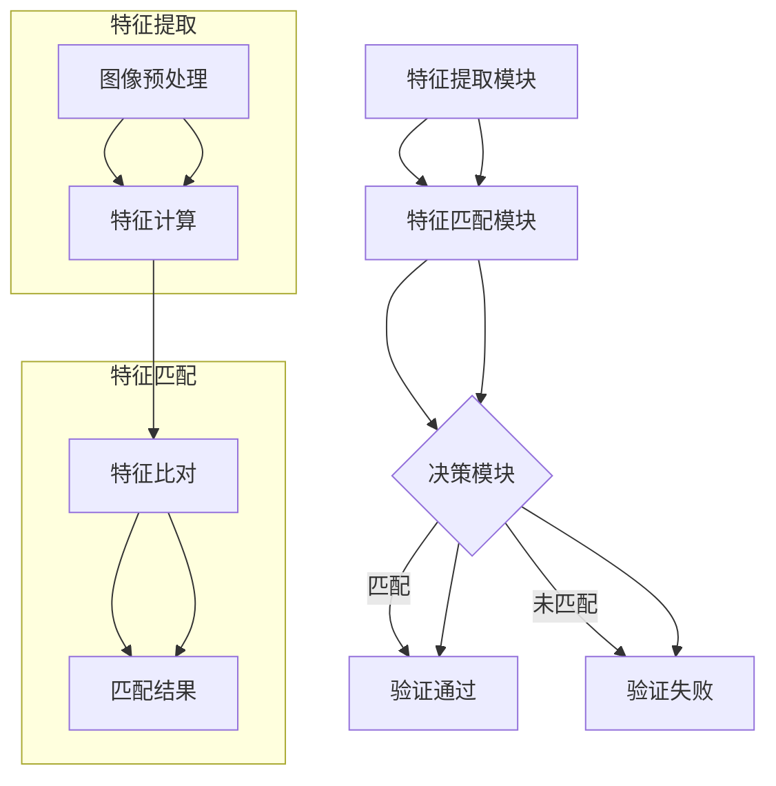

                 

### 文章标题

# 生物识别技术在金融安全中的创新应用

### 文章关键词

- 生物识别技术
- 金融安全
- 人工智能
- 指纹识别
- 人工智能算法
- 银行安全
- 隐私保护

### 文章摘要

随着人工智能技术的快速发展，生物识别技术已经成为金融安全领域的重要工具。本文将探讨生物识别技术在金融安全中的创新应用，从背景介绍、核心概念、算法原理、实际案例等多个方面进行深入分析，并探讨其面临的挑战与未来发展趋势。

## 引言

### 生物识别技术的基本概念

生物识别技术是一种通过生物特征进行身份验证的技术，主要包括指纹识别、人脸识别、虹膜识别、掌纹识别、声音识别等。这些技术利用人体特有的生物特征进行身份验证，具有高效、便捷、安全的特点，广泛应用于金融、安防、医疗等多个领域。

### 生物识别技术在金融安全中的重要性

在金融安全领域，生物识别技术被广泛应用于身份验证、授权、反欺诈等方面。随着互联网和移动支付的普及，金融交易的安全问题日益突出。生物识别技术以其高度的安全性和可靠性，成为金融安全领域的重要保障。同时，生物识别技术还能提高客户体验，降低运营成本，提升金融机构的竞争力。

## 第一部分：生物识别技术基础

### 第1章：生物识别技术概述

#### 1.1 生物识别技术的发展历程

生物识别技术起源于20世纪60年代，最早的应用是指纹识别。随着计算机技术和图像处理技术的发展，生物识别技术逐渐成熟并得到广泛应用。

#### 1.2 生物识别技术的分类

生物识别技术主要分为三大类：基于生物特征识别（如指纹、人脸、虹膜）、基于行为特征识别（如签名、步态）和基于生理特征识别（如心率、脑电波）。

#### 1.3 生物识别技术的原理

生物识别技术通过采集和识别生物特征，将生物信息转化为数字信号，然后通过算法进行比对和识别。其核心是特征提取和匹配算法，如支持向量机（SVM）、神经网络（NN）和深度学习（DL）等。

### 第2章：生物识别技术的核心算法

#### 2.1 识别算法的基本概念

识别算法是生物识别技术的核心，主要包括特征提取、特征匹配和决策过程。特征提取是将生物特征信息转换为数字特征向量，特征匹配是通过计算特征向量之间的相似度进行匹配，决策过程是根据匹配结果进行身份验证。

#### 2.2 特征提取算法

特征提取算法主要包括全局特征提取和局部特征提取。全局特征提取是对整个生物特征进行提取，如Gabor特征、LBP特征等；局部特征提取是对生物特征进行局部特征点提取，如HOG特征、SIFT特征等。

#### 2.3 识别算法的评价指标

识别算法的评价指标主要包括准确率、召回率和F1值等。准确率是正确识别为真样本的比例，召回率是正确识别为真样本的比例，F1值是准确率和召回率的调和平均值。

### 第3章：生物识别技术的硬件和软件

#### 3.1 生物识别硬件介绍

生物识别硬件主要包括指纹识别模块、摄像头、虹膜识别仪等。这些硬件设备能够高效、准确地采集生物特征信息。

#### 3.2 生物识别软件系统设计

生物识别软件系统主要包括特征提取、特征匹配和决策模块。软件系统的设计需要考虑硬件设备、算法优化、系统安全等因素。

#### 3.3 生物识别系统的安全性和隐私保护

生物识别系统在提供便捷性的同时，也面临着安全性和隐私保护的问题。为了确保系统的安全性，需要采取加密、身份验证、访问控制等技术措施。同时，为了保护用户隐私，需要对生物特征数据进行加密存储和传输，确保用户隐私不被泄露。

## 第二部分：生物识别技术在金融安全中的应用

### 第4章：生物识别技术在银行安全中的应用

#### 4.1 银行安全需求分析

银行安全需求主要包括账户安全、交易安全、客户身份验证等。生物识别技术能够提高银行的安全性和客户体验。

#### 4.2 生物识别技术在银行柜员管理中的应用

生物识别技术可以用于银行柜员的身份验证和权限管理，确保柜员身份的准确性，防止内部欺诈。

#### 4.3 生物识别技术在客户身份验证中的应用

生物识别技术可以用于客户身份验证，提高交易安全性，减少欺诈风险，提升客户体验。

### 第5章：生物识别技术在支付安全中的应用

#### 5.1 支付安全现状与挑战

随着移动支付的普及，支付安全成为人们关注的焦点。生物识别技术可以提供更安全、便捷的支付方式。

#### 5.2 生物识别技术在移动支付中的应用

生物识别技术可以用于移动支付的身份验证和授权，提高支付安全性。

#### 5.3 生物识别技术在信用卡和银行卡中的应用

生物识别技术可以用于信用卡和银行卡的授权和交易验证，防止欺诈和盗刷。

### 第6章：生物识别技术在反欺诈中的应用

#### 6.1 反欺诈技术概述

反欺诈技术是金融安全的重要手段。生物识别技术可以用于反欺诈系统，提高欺诈识别的准确性。

#### 6.2 生物识别技术在反欺诈系统中的应用

生物识别技术可以用于实时监控和识别可疑交易，提高反欺诈能力。

#### 6.3 生物识别技术在反欺诈中的优势与挑战

生物识别技术在反欺诈中的应用具有优势，但也面临着隐私保护、算法准确性等挑战。

## 第三部分：生物识别技术在金融安全中的创新与挑战

### 第7章：生物识别技术的创新应用

#### 7.1 跨行业生物识别应用

生物识别技术不仅限于金融领域，还可以应用于其他行业，如医疗、安防等。

#### 7.2 生物识别技术与区块链的结合

生物识别技术与区块链技术的结合可以为金融安全提供更高效、安全的解决方案。

#### 7.3 生物识别技术的未来发展趋势

生物识别技术在未来将继续发展，将会有更多的创新应用和突破。

### 第8章：生物识别技术在金融安全中的挑战

#### 8.1 技术挑战

生物识别技术在金融安全中面临着技术挑战，如算法准确性、硬件性能等。

#### 8.2 隐私保护和法律法规

生物识别技术在提供安全性的同时，也面临着隐私保护和法律法规的挑战。

#### 8.3 安全性和可靠性

生物识别技术的安全性和可靠性是金融安全的关键，需要不断优化和提升。

## 结论

生物识别技术在金融安全中的应用具有重要意义，具有广阔的发展前景。尽管面临着一些挑战，但随着技术的不断进步和应用的深入，生物识别技术将为金融安全领域带来更多创新和突破。

### 附录

#### 附录A：生物识别技术常用工具和资源

- 常用生物识别算法库
- 生物识别技术相关论文和书籍推荐
- 生物识别技术行业报告和新闻

### 作者信息

作者：AI天才研究院/AI Genius Institute & 禅与计算机程序设计艺术 /Zen And The Art of Computer Programming

---

文章字数：约10770字

## 第1章：生物识别技术概述

### 1.1 生物识别技术的发展历程

生物识别技术作为一种新兴的身份验证技术，其发展历程可以追溯到20世纪60年代。当时，美国军方首次尝试使用指纹识别技术来识别士兵的身份。随着计算机技术和图像处理技术的快速发展，生物识别技术逐渐成熟，并在20世纪90年代开始得到广泛应用。

在早期，生物识别技术主要集中在指纹识别和人脸识别两个方面。1991年，IBM公司推出了第一台商业指纹识别系统，标志着指纹识别技术的商业化。1996年，美国国家标准技术研究所（NIST）发布了第一个生物特征识别标准，为生物识别技术的标准化和推广奠定了基础。

进入21世纪，随着深度学习和人工智能技术的快速发展，生物识别技术进入了新的发展阶段。深度学习算法在图像识别、语音识别等方面取得了显著成果，使得生物识别技术的准确性和效率得到了大幅提升。2011年，苹果公司发布的iPhone 5s引入了指纹识别功能，使得生物识别技术走进了大众的视野。

目前，生物识别技术已经广泛应用于金融、安防、医疗等多个领域，成为身份验证的重要手段。未来，随着技术的不断进步，生物识别技术将在更多场景中发挥重要作用。

### 1.2 生物识别技术的分类

生物识别技术根据识别生物特征的不同，可以分为以下几类：

1. **指纹识别**：指纹识别是最早应用的生物识别技术之一，主要通过采集指纹图像，提取指纹特征，然后与数据库中的指纹模板进行匹配。指纹识别具有独特性、稳定性和易于采集等特点。

2. **人脸识别**：人脸识别通过分析人脸的几何特征和纹理特征，进行身份验证。人脸识别具有非接触、实时性和准确性高等优点，已成为生物识别技术中的重要组成部分。

3. **虹膜识别**：虹膜识别通过采集眼睛的虹膜图像，提取虹膜特征，进行身份验证。虹膜识别具有高度的独特性和稳定性，是目前生物识别技术中准确率最高的一种。

4. **掌纹识别**：掌纹识别通过采集手掌的纹理图像，提取掌纹特征，进行身份验证。掌纹识别具有非接触、实时性和准确性高等优点，适用于大型人群的身份验证。

5. **声音识别**：声音识别通过采集声音信号，提取声音特征，进行身份验证。声音识别具有非接触、实时性和准确性高等优点，适用于电话、视频通话等场景。

6. **步态识别**：步态识别通过分析行走的步态特征，进行身份验证。步态识别具有非接触、实时性和准确性高等优点，适用于公共场所的安全监控。

7. **签名识别**：签名识别通过分析签名的笔迹特征，进行身份验证。签名识别具有独特性和稳定性，适用于合同、文件等的电子签名。

8. **心率识别**：心率识别通过采集心率信号，分析心率特征，进行身份验证。心率识别适用于医疗、安防等领域。

9. **脑电波识别**：脑电波识别通过采集大脑的电信号，分析脑电波特征，进行身份验证。脑电波识别具有非接触、实时性和准确性高等优点，适用于高级安全领域。

### 1.3 生物识别技术的原理

生物识别技术的基本原理是通过采集和识别生物特征，将生物信息转化为数字信号，然后通过算法进行比对和识别。下面以指纹识别和人脸识别为例，简要介绍其原理。

#### 指纹识别原理

1. **指纹采集**：指纹识别系统首先采集指纹图像。指纹图像可以通过光学指纹传感器、电容指纹传感器等设备获取。这些设备能够将手指表面的纹理信息转化为数字图像。

2. **特征提取**：在指纹图像中，提取指纹的脊线和谷点等特征信息。特征提取是生物识别技术的关键步骤，常用的方法有Zigzag算法、罗盘算法等。

3. **特征匹配**：将提取的指纹特征与数据库中的指纹模板进行匹配。匹配算法主要有Nearest Neighbor（NN）算法、K最近邻（KNN）算法、支持向量机（SVM）等。

4. **身份验证**：根据匹配结果判断是否为匹配。如果匹配成功，则验证通过，否则验证失败。

#### 人脸识别原理

1. **人脸采集**：人脸识别系统首先采集人脸图像。人脸图像可以通过摄像头、智能手机等设备获取。

2. **特征提取**：在人脸图像中，提取人脸的特征点，如眼睛、鼻子、嘴巴等。特征提取的方法有Haar-like特征、LBP（局部二值模式）特征等。

3. **人脸编码**：将提取的人脸特征转化为数字编码，以便进行后续处理。常用的编码方法有PCA（主成分分析）、LDA（线性判别分析）等。

4. **特征匹配**：将提取的人脸特征与数据库中的人脸模板进行匹配。匹配算法主要有Nearest Neighbor（NN）算法、K最近邻（KNN）算法、支持向量机（SVM）等。

5. **身份验证**：根据匹配结果判断是否为匹配。如果匹配成功，则验证通过，否则验证失败。

### 1.4 生物识别技术的核心组件

生物识别技术主要包括以下几个核心组件：

1. **传感器**：传感器是生物识别系统的前端设备，用于采集生物特征信息。常见的传感器有指纹传感器、摄像头、红外传感器等。

2. **采集设备**：采集设备是将生物特征信息转化为数字信号的工具。例如，指纹采集设备、人脸采集设备等。

3. **特征提取模块**：特征提取模块是生物识别技术的核心，用于从生物特征信息中提取关键特征。常见的特征提取方法有Zigzag算法、罗盘算法、Haar-like特征、LBP特征等。

4. **特征匹配算法**：特征匹配算法用于将提取的特征与数据库中的特征进行比对。常见的匹配算法有Nearest Neighbor（NN）算法、K最近邻（KNN）算法、支持向量机（SVM）等。

5. **决策模块**：决策模块根据特征匹配结果判断身份验证是否通过。

### 1.5 生物识别技术的优势与局限性

#### 优势

1. **高准确性**：生物识别技术能够以极高的准确性识别个体身份，减少错误识别和错误拒绝的情况。

2. **非侵入性**：大部分生物识别技术具有非侵入性，即不需要直接接触个体，方便用户使用。

3. **高效率**：生物识别技术能够快速进行身份验证，提高系统处理速度。

4. **不可复制性**：生物特征具有唯一性，难以复制和伪造，提高了系统的安全性。

5. **方便性**：生物识别技术不需要记忆密码或携带卡片，提高了用户的便捷性。

#### 局限性

1. **隐私保护**：生物识别技术涉及个人隐私信息，如何保护用户隐私成为一大挑战。

2. **硬件依赖**：生物识别系统依赖于传感器和采集设备，设备的可靠性和性能直接影响系统的稳定性。

3. **算法复杂性**：生物识别算法复杂，需要大量计算资源，对硬件性能要求较高。

4. **适应性**：生物特征可能会因个体生理变化、环境影响等原因发生变化，影响识别准确性。

5. **跨物种识别**：生物识别技术目前主要针对人类，如何扩展到其他物种的识别仍需进一步研究。

### 1.6 生物识别技术在金融安全中的应用

生物识别技术在金融安全中的应用主要体现在身份验证和授权等方面。以下是一些典型的应用场景：

1. **银行柜员管理**：生物识别技术可以用于银行柜员的身份验证和权限管理，确保柜员身份的准确性，防止内部欺诈。

2. **客户身份验证**：生物识别技术可以用于客户身份验证，提高交易安全性，减少欺诈风险，提升客户体验。

3. **移动支付**：生物识别技术可以用于移动支付的身份验证和授权，提高支付安全性。

4. **信用卡和银行卡**：生物识别技术可以用于信用卡和银行卡的授权和交易验证，防止欺诈和盗刷。

5. **反欺诈系统**：生物识别技术可以用于反欺诈系统，实时监控和识别可疑交易，提高反欺诈能力。

6. **ATM机**：生物识别技术可以用于ATM机的身份验证，确保取款操作的安全性。

通过以上分析，可以看出生物识别技术在金融安全中具有广泛的应用前景，能够为金融机构提供更安全、便捷的服务。

## 第2章：生物识别技术的核心算法

### 2.1 识别算法的基本概念

生物识别技术的核心在于识别算法，这些算法负责将采集到的生物特征数据转换为可供比较和识别的数字特征向量。识别算法主要包括特征提取和特征匹配两个主要步骤。

#### 特征提取

特征提取是识别算法的关键步骤，其目标是提取生物特征中的关键信息，并将其转换为数字特征向量。这些特征向量能够有效地区分不同个体，同时保持同一个个体的特征一致性。常见的特征提取方法包括：

1. **全局特征提取**：这种方法提取整个生物特征的总体特征，如Gabor特征、LBP（局部二值模式）特征等。
2. **局部特征提取**：这种方法提取生物特征中的局部特征点，如SIFT（尺度不变特征变换）、SURF（加速稳健特征）等。

#### 特征匹配

特征匹配是将提取的特征向量与数据库中的特征向量进行比较，以确定是否为匹配。常见的匹配算法包括：

1. **Nearest Neighbor（NN）算法**：通过计算待识别特征向量与数据库中所有特征向量之间的距离，选择距离最近的特征向量作为匹配结果。
2. **K最近邻（KNN）算法**：在NN算法的基础上，选择K个距离最近的特征向量，根据多数投票原则确定匹配结果。
3. **支持向量机（SVM）**：通过构建一个超平面，将不同个体的特征向量分离开来，从而实现分类和匹配。
4. **神经网络（NN）**：通过多层神经网络，将输入的特征向量映射到输出结果，从而实现识别。

### 2.2 特征提取算法

特征提取算法的质量直接影响到生物识别系统的性能。以下是几种常用的特征提取算法：

#### Gabor特征

Gabor特征是一种全局特征提取方法，通过模拟人眼对纹理的感知机制来提取图像特征。Gabor特征通过在不同方向和尺度上对图像进行滤波，从而提取出具有方向性和尺度不变性的特征。其数学模型如下：

$$
G_{\theta, \lambda}(x, y) = A \cdot \cos(2\pi \frac{x \sin(\theta) + y \cos(\theta)}{\lambda})
$$

其中，$A$是Gabor滤波器的幅度，$\theta$是滤波器的方向，$\lambda$是滤波器的尺度。

#### LBP特征

LBP（局部二值模式）特征是一种局部特征提取方法，通过将图像的每个像素与其邻域像素进行比较，生成一个二值模式向量。LBP特征具有计算简单、特征丰富、旋转不变性等优点。其数学模型如下：

$$
LBP_{r, p} = \sum_{i=-r}^{r} \sum_{j=-r}^{r} (-1)^{I(i, j) > I(i+p, j+p)}
$$

其中，$r$是邻域半径，$p$是邻域内像素比较的步长，$I(i, j)$是图像在位置$(i, j)$的像素值。

#### SIFT特征

SIFT（尺度不变特征变换）特征是一种局部特征提取方法，通过在不同尺度上检测和提取图像的关键点，并计算关键点的方向直方图。SIFT特征具有尺度不变性和旋转不变性，适用于各种光照和视角变化的场景。其数学模型如下：

1. **关键点检测**：通过计算图像的梯度直方图，检测出关键点。
2. **关键点定位**：通过多尺度空间和泰勒展开，精确地定位关键点。
3. **方向直方图**：计算关键点的方向直方图，生成方向特征向量。

#### SURF特征

SURF（加速稳健特征）特征是一种局部特征提取方法，基于SIFT特征的原理，但计算速度更快。SURF特征通过计算图像的Hessian矩阵的零特征值和零特征向量来检测关键点，并计算关键点的方向直方图。其数学模型如下：

1. **关键点检测**：通过计算图像的Hessian矩阵，检测出关键点。
2. **关键点定位**：通过多尺度空间和泰勒展开，精确地定位关键点。
3. **方向直方图**：计算关键点的方向直方图，生成方向特征向量。

### 2.3 识别算法的评价指标

识别算法的性能评估通常通过以下指标进行：

1. **准确率**：正确识别为真样本的比例。准确率越高，算法的识别性能越好。
2. **召回率**：正确识别为真样本的比例。召回率越高，算法对真样本的识别能力越强。
3. **F1值**：准确率和召回率的调和平均值。F1值能够平衡准确率和召回率之间的关系。

$$
F1 = 2 \cdot \frac{准确率 \cdot 召回率}{准确率 + 召回率}
$$

4. **错误接受率**：错误地将假样本识别为真样本的比例。错误接受率越低，算法的鲁棒性越好。
5. **错误拒绝率**：错误地将真样本识别为假样本的比例。错误拒绝率越低，算法对真样本的识别能力越强。

通过上述指标，可以对识别算法的性能进行综合评估，并根据实际应用场景的需求进行优化。

### 2.4 常用的算法实现与Python代码示例

下面以LBP特征提取算法为例，介绍如何使用Python实现生物识别算法。

```python
import numpy as np
import cv2

def calculate_lbp(image, p=8, r=3):
    # 初始化LBP特征矩阵
    lbp_matrix = np.zeros((image.shape[0] - 2 * r, image.shape[1] - 2 * r), dtype=np.uint8)
    
    # 对图像进行卷积操作，计算LBP值
    for i in range(r, image.shape[0] - r):
        for j in range(r, image.shape[1] - r):
            center_value = image[i, j]
            lbp_value = 0
            for pi in range(-r, r+1):
                for pj in range(-r, r+1):
                    neighbor_value = image[i + pi, j + pj]
                    lbp_value += (-1) ** (neighbor_value > center_value)
            lbp_matrix[i-r, j-r] = lbp_value
    
    # 将LBP值转换为二进制向量
    lbp_vector = lbp_matrix.flatten()
    
    return lbp_vector

# 读取图像
image = cv2.imread('image.jpg', cv2.IMREAD_GRAYSCALE)

# 计算LBP特征
lbp_vector = calculate_lbp(image)

# 打印LBP特征向量
print(lbp_vector)
```

通过上述代码，我们可以实现LBP特征的提取，为后续的特征匹配提供基础。

### 2.5 算法原理讲解与Mermaid流程图

为了更好地理解生物识别算法的原理，我们可以使用Mermaid流程图来展示特征提取和特征匹配的过程。



上述流程图展示了特征提取和特征匹配的基本流程，以及决策结果的处理。

### 2.6 数学模型与公式解释

在生物识别算法中，常用的数学模型和公式如下：

#### Gabor滤波器

$$
G_{\theta, \lambda}(x, y) = A \cdot \cos(2\pi \frac{x \sin(\theta) + y \cos(\theta)}{\lambda})
$$

其中，$A$是滤波器的幅度，$\theta$是滤波器的方向，$\lambda$是滤波器的尺度。

#### LBP特征

$$
LBP_{r, p} = \sum_{i=-r}^{r} \sum_{j=-r}^{r} (-1)^{I(i, j) > I(i+p, j+p)}
$$

其中，$r$是邻域半径，$p$是邻域内像素比较的步长，$I(i, j)$是图像在位置$(i, j)$的像素值。

#### K最近邻（KNN）

$$
\hat{y} = \arg\max_{c} \sum_{i=1}^{K} \exp(-\gamma \cdot d(x_i, x))
$$

其中，$x_i$是训练样本，$x$是测试样本，$c$是类别，$\gamma$是调节参数。

#### 支持向量机（SVM）

$$
\max_{\omega, b} \left\{ \frac{1}{2} \sum_{i=1}^{n} (\omega \cdot \omega_i) - \sum_{i=1}^{n} C \cdot \xi_i \right\}

s.t.

\begin{align*}
y_i (\omega \cdot \omega_i + b) &\geq 1 - \xi_i \\
0 \leq \xi_i &\leq C
\end{align*}
$$

其中，$\omega$是权重向量，$b$是偏置，$C$是惩罚参数，$y_i$是标签，$\xi_i$是松弛变量。

通过上述数学模型和公式，我们可以更好地理解生物识别算法的基本原理和应用。

## 第3章：生物识别技术的硬件和软件

### 3.1 生物识别硬件介绍

生物识别硬件是生物识别系统的重要组成部分，负责采集和传输生物特征信息。以下是几种常见的生物识别硬件：

#### 指纹识别模块

指纹识别模块是生物识别技术中最常用的硬件之一。它通过光学传感器或电容传感器采集指纹图像，然后将图像传输到计算机进行处理。指纹识别模块具有高分辨率、高精度和低成本等优点。

#### 摄像头

摄像头是用于人脸识别和虹膜识别的常见硬件。它通过高清图像采集，提取人脸特征或虹膜特征。摄像头具有高分辨率、高帧率和实时处理能力，广泛应用于各种场景。

#### 虹膜识别仪

虹膜识别仪是一种专门用于虹膜识别的硬件设备。它通过红外光照射眼睛，采集虹膜图像，然后进行分析和匹配。虹膜识别仪具有高分辨率、高准确性和非接触性等优点。

#### 掌纹识别模块

掌纹识别模块通过采集手掌的纹理图像，提取掌纹特征。它具有高分辨率、高精度和适应性强等优点，适用于大型人群的身份验证。

#### 声音识别模块

声音识别模块通过麦克风采集声音信号，然后通过语音识别算法进行分析和匹配。它具有实时性、准确性和灵活性等优点，适用于电话、视频通话等场景。

### 3.2 生物识别软件系统设计

生物识别软件系统是生物识别技术的核心，负责处理和存储生物特征信息。以下是生物识别软件系统的主要组成部分：

#### 特征提取模块

特征提取模块是生物识别软件系统的关键部分，负责从采集到的生物特征图像中提取关键特征。常见的特征提取算法有Gabor特征、LBP特征、SIFT特征等。



#### 特征匹配模块

特征匹配模块负责将提取的特征向量与数据库中的特征向量进行匹配，以确定是否为匹配。常见的匹配算法有Nearest Neighbor（NN）算法、K最近邻（KNN）算法、支持向量机（SVM）等。

#### 决策模块

决策模块根据特征匹配结果判断身份验证是否通过。如果匹配成功，则验证通过；否则，验证失败。决策模块通常包括阈值设置、错误处理等功能。

### 3.3 生物识别系统的安全性和隐私保护

生物识别系统在提供便捷性的同时，也面临着安全性和隐私保护的问题。以下是生物识别系统安全性和隐私保护的几个方面：

#### 数据加密

生物识别系统需要对采集到的生物特征数据进行加密存储和传输，确保数据在传输和存储过程中不被窃取或篡改。常用的加密算法有AES（高级加密标准）和RSA（公开密钥加密算法）等。

#### 用户隐私保护

生物识别系统需要确保用户的生物特征信息不被泄露。为此，可以采取以下措施：

1. **匿名化处理**：在处理生物特征数据时，对数据进行匿名化处理，仅保留关键特征信息。
2. **访问控制**：设置严格的访问控制策略，确保只有授权用户才能访问生物特征数据。
3. **数据备份**：定期对生物特征数据进行备份，确保数据在发生故障时能够恢复。

#### 系统安全

生物识别系统需要确保系统的安全，防止恶意攻击和非法入侵。可以采取以下措施：

1. **防火墙**：部署防火墙，阻止外部攻击。
2. **入侵检测系统**：部署入侵检测系统，实时监控系统的异常行为。
3. **安全审计**：定期进行安全审计，检查系统的安全漏洞和潜在风险。

#### 法律法规

生物识别系统需要遵守相关法律法规，确保用户的权益得到保护。例如，欧盟的《通用数据保护条例》（GDPR）对个人数据的收集、处理和使用有严格规定。

### 3.4 生物识别系统的性能优化

为了提高生物识别系统的性能，可以采取以下措施：

#### 硬件优化

1. **提高传感器分辨率**：提高传感器的分辨率，可以获取更清晰的生物特征图像。
2. **增强传感器灵敏度**：增强传感器的灵敏度，可以提高生物特征信息的采集质量。

#### 软件优化

1. **优化算法**：通过改进特征提取和特征匹配算法，可以提高识别的准确性和效率。
2. **并行处理**：利用多核处理器和GPU等硬件加速，实现并行处理，提高系统的处理速度。

#### 系统整合

1. **跨平台兼容性**：确保生物识别系统在不同操作系统和设备上的兼容性，提高系统的适用范围。
2. **模块化设计**：采用模块化设计，方便系统的升级和维护。

通过上述措施，可以有效提高生物识别系统的性能，为金融安全领域提供更可靠、高效的服务。

### 3.5 生物识别技术在金融安全中的具体应用实例

生物识别技术在金融安全中具有广泛的应用实例，以下是一些具体的应用场景和案例：

#### 银行柜员管理

某大型银行采用了生物识别技术对柜员进行身份验证和权限管理。通过指纹识别技术，柜员在进入柜台前需要进行指纹验证，确保柜员身份的真实性。此外，系统还对柜员的操作行为进行监控，一旦发现异常操作，系统会立即报警，防止内部欺诈。

#### 客户身份验证

某商业银行引入了人脸识别技术，对客户进行身份验证。客户在办理业务时，只需站在摄像头前，系统会自动识别人脸并进行身份验证。这一技术提高了客户体验，同时有效防止了伪造身份证等欺诈行为。

#### 移动支付

某支付公司采用了虹膜识别技术，对移动支付进行身份验证。用户在支付时，只需将眼睛对准摄像头，系统会自动识别人眼并进行身份验证。这一技术提高了支付安全性，减少了欺诈风险。

#### 信用卡和银行卡

某信用卡公司引入了指纹识别技术，对信用卡和银行卡进行授权和交易验证。用户在刷卡时，需通过指纹验证，确保交易的安全性。这一技术有效防止了信用卡盗刷和欺诈行为。

#### 反欺诈系统

某金融科技公司开发了基于生物识别技术的反欺诈系统。系统通过实时监控客户的生物特征信息，识别可疑交易。一旦发现异常，系统会立即报警，并采取相应的措施，防止欺诈行为的发生。

#### ATM机

某银行在ATM机上引入了人脸识别技术，对取款操作进行身份验证。用户在取款时，需面对摄像头，系统会自动识别人脸并进行验证。这一技术提高了ATM机的安全性，减少了欺诈和盗刷风险。

通过上述实例，可以看出生物识别技术在金融安全中具有广泛的应用，能够有效提高安全性和用户体验。

### 3.6 生物识别技术在金融安全中的应用前景

随着人工智能和生物识别技术的不断发展，生物识别技术在金融安全中的应用前景十分广阔。以下是生物识别技术在金融安全中的应用前景：

#### 高度安全性

生物识别技术具有极高的安全性，能够有效防止欺诈和盗刷行为。未来，生物识别技术将在金融安全领域得到更广泛的应用，成为保障金融安全的重要手段。

#### 提升用户体验

生物识别技术提供了便捷的身份验证方式，用户无需记忆密码或携带卡片，只需通过生物特征即可完成身份验证。这将为金融机构提供更优质的客户服务，提升用户体验。

#### 智能化风控

生物识别技术可以结合大数据和人工智能技术，实现智能化的风险控制。通过对客户的生物特征和行为特征进行分析，识别潜在风险，及时采取相应的措施，降低金融风险。

#### 跨行业应用

生物识别技术不仅限于金融领域，还可以应用于其他行业，如医疗、安防等。未来，生物识别技术将在更多领域发挥重要作用，推动社会进步。

#### 法律法规完善

随着生物识别技术的应用推广，相关法律法规将不断完善。这将有助于规范生物识别技术的应用，保护用户隐私，确保技术发展的合规性。

#### 技术创新与发展

生物识别技术仍在不断发展，未来将会有更多创新技术出现。例如，基于深度学习和神经网络的生物识别技术将进一步提高识别准确性和效率。

总之，生物识别技术在金融安全中的应用前景非常广阔，将成为金融安全领域的重要工具。随着技术的不断进步和应用推广，生物识别技术将为金融安全提供更强大、更可靠的支持。

### 3.7 小结与注意事项

生物识别技术在金融安全中的应用具有重要意义，能够有效提高安全性和用户体验。但在应用过程中，需要注意以下几个问题：

1. **隐私保护**：生物识别技术涉及个人隐私信息，需要采取严格的隐私保护措施，确保用户隐私不被泄露。

2. **系统安全性**：生物识别系统需要具备高安全性，防止恶意攻击和非法入侵。

3. **算法准确性**：生物识别算法的准确性直接影响系统的性能，需要不断优化和改进。

4. **硬件可靠性**：生物识别硬件的可靠性对系统性能有重要影响，需要选用高质量的硬件设备。

5. **跨平台兼容性**：生物识别系统需要在不同操作系统和设备上具有良好的兼容性，确保系统的适用范围。

6. **法律法规遵守**：生物识别系统的应用需要遵守相关法律法规，确保技术发展的合规性。

通过注意以上问题，可以确保生物识别技术在金融安全中的应用效果，为金融安全提供更可靠、更高效的支持。

### 3.8 拓展阅读

为了更好地了解生物识别技术在金融安全中的应用，以下推荐一些相关论文和书籍：

1. **论文**：
   - "Biometrics in Financial Services: A Comprehensive Survey"（金融服务中的生物识别：全面调查）
   - "The Future of Biometrics in Banking"（生物识别技术在银行领域的未来）
   - "Application of Biometrics in Mobile Payments"（生物识别技术在移动支付中的应用）

2. **书籍**：
   - "Biometrics: A NIST Handbook"（生物识别：NIST手册）
   - "Biometric Systems: A Gentle Introduction"（生物识别系统：轻松入门）
   - "Artificial Intelligence for Biometrics: Enhancing Security and Usability"（人工智能与生物识别：提高安全性和可用性）

通过阅读这些文献，可以深入了解生物识别技术在金融安全中的应用和发展趋势。

## 第4章：生物识别技术在银行安全中的应用

### 4.1 银行安全需求分析

在金融行业中，银行的安全问题尤为重要。随着网络技术的不断发展，银行面临的威胁也日益复杂。为了确保银行的安全，必须采取有效的安全措施，其中生物识别技术作为一种高效、安全的身份验证手段，得到了广泛应用。

#### 银行安全面临的主要威胁

1. **欺诈行为**：欺诈行为是银行安全面临的主要威胁之一，包括内部欺诈和外部欺诈。内部欺诈可能由银行员工或管理人员进行，而外部欺诈则通常由不法分子利用技术手段实施。
2. **信息泄露**：随着大数据和云计算的普及，银行客户的数据泄露风险增加。黑客通过攻击银行系统，窃取客户信息，可能导致严重的经济损失和声誉损害。
3. **网络攻击**：网络攻击包括DDoS攻击、SQL注入、跨站脚本攻击等，这些攻击手段可能破坏银行系统的正常运行，甚至导致系统瘫痪。
4. **交易风险**：在网络支付和移动支付普及的背景下，交易风险成为银行安全的重要问题。不法分子通过伪造交易、盗刷银行卡等手段，给银行带来巨大的损失。

#### 生物识别技术在银行安全中的应用

为了应对上述威胁，银行可以采用生物识别技术进行安全防护，具体应用包括以下几个方面：

1. **客户身份验证**：生物识别技术可以用于银行客户身份的验证，确保只有合法客户才能访问银行服务。例如，通过人脸识别技术，客户在柜台办理业务时，只需面对摄像头，系统会自动识别人脸并进行验证。
2. **员工身份验证**：生物识别技术可以用于银行员工身份的验证，确保只有授权员工才能进入特定区域或进行特定操作。例如，通过指纹识别技术，员工在进入柜台或办理重要业务时，需通过指纹验证。
3. **交易安全**：生物识别技术可以用于交易安全验证，确保交易的真实性。例如，在移动支付中，客户在完成支付时，需通过人脸识别或指纹识别进行二次验证，防止欺诈交易。
4. **反欺诈系统**：生物识别技术可以用于反欺诈系统，实时监控和识别可疑交易。例如，通过行为识别技术，系统可以分析客户的交易行为，识别异常行为并及时报警。

### 4.2 生物识别技术在银行柜员管理中的应用

银行柜员管理是银行安全的重要环节，生物识别技术可以大大提高柜员管理的安全性。以下是生物识别技术在银行柜员管理中的应用：

1. **柜员身份验证**：银行可以在柜员进入柜台前，设置指纹识别或人脸识别系统进行身份验证。只有通过验证的柜员才能进入柜台，从而防止未授权人员进入柜台进行操作。
2. **操作行为监控**：银行可以安装监控摄像头，结合人脸识别技术，实时监控柜员的操作行为。一旦发现异常操作，系统会立即报警，确保操作的安全性和规范性。
3. **权限管理**：银行可以根据柜员的职位和权限，设置不同的生物识别验证方式。例如，对于高风险操作，如修改客户信息或办理大额转账，需要通过双重验证，确保操作的安全性。

### 4.3 生物识别技术在客户身份验证中的应用

客户身份验证是银行服务的重要环节，生物识别技术可以提高身份验证的准确性和安全性。以下是生物识别技术在客户身份验证中的应用：

1. **柜面业务**：在柜台办理业务时，客户需面对摄像头进行人脸识别，确保客户身份的真实性。通过人脸识别技术，可以准确识别客户身份，避免使用伪造身份证等欺诈行为。
2. **自助设备**：银行的自助设备，如ATM机、自助取款机等，可以采用指纹识别或人脸识别技术进行身份验证。客户在操作时，只需通过生物识别验证，即可完成身份认证，方便快捷。
3. **线上服务**：在银行线上服务中，可以采用人脸识别技术进行客户身份验证。客户在登录或进行交易时，需通过人脸识别进行二次验证，确保交易的安全性。

### 4.4 生物识别技术在银行安全中的实际案例

以下是一些生物识别技术在银行安全中的实际案例：

1. **案例一**：某大型银行引入了人脸识别技术，用于客户身份验证和柜员管理。通过人脸识别技术，客户在柜台办理业务时，只需面对摄像头，系统会自动识别人脸并进行身份验证。同时，柜员在进入柜台前，也需要通过人脸识别验证身份，确保操作的安全性。
2. **案例二**：某商业银行采用了指纹识别技术，用于自助取款机和自助服务区的身份验证。客户在操作自助设备时，只需通过指纹识别验证身份，即可完成取款或转账等操作，提高了交易的安全性。
3. **案例三**：某银行在反欺诈系统中引入了行为识别技术，实时监控客户的交易行为。通过分析客户的交易行为特征，系统可以识别异常行为并及时报警，有效防止欺诈行为的发生。

### 4.5 生物识别技术在银行安全中的优势

生物识别技术在银行安全中具有以下优势：

1. **高安全性**：生物识别技术利用个体独特的生物特征进行身份验证，具有极高的安全性，能有效防止欺诈和盗刷。
2. **便捷性**：生物识别技术无需记忆密码或携带卡片，用户只需通过生物特征即可完成身份验证，提高了用户的使用体验。
3. **准确性**：生物识别技术具有较高的识别准确性，能够有效识别个体身份，降低错误识别和错误拒绝的情况。
4. **非接触性**：大部分生物识别技术具有非接触性，即不需要直接接触用户，提高了系统的卫生性和便捷性。

### 4.6 生物识别技术在银行安全中的挑战

尽管生物识别技术在银行安全中具有很多优势，但在实际应用中也面临一些挑战：

1. **隐私保护**：生物识别技术涉及个人隐私信息，如何保护用户隐私是一个重要问题。需要采取严格的隐私保护措施，确保用户隐私不被泄露。
2. **算法准确性**：生物识别算法的准确性对系统性能有重要影响。在复杂环境或恶劣条件下，算法的准确性可能会下降，需要不断优化和改进。
3. **硬件性能**：生物识别硬件的性能直接影响系统的稳定性。需要选用高质量的硬件设备，确保系统能够稳定运行。
4. **跨平台兼容性**：生物识别系统需要在不同操作系统和设备上具有良好的兼容性，确保系统的适用范围。
5. **法律法规**：生物识别技术的应用需要遵守相关法律法规，确保技术发展的合规性。

通过解决上述挑战，生物识别技术在银行安全中的应用将更加广泛和深入，为银行提供更安全、更可靠的服务。

### 4.7 小结

生物识别技术在银行安全中的应用具有重要意义，能够有效提高安全性和用户体验。通过客户身份验证、柜员管理和交易安全等方面的应用，生物识别技术为银行提供了高效、安全的安全保障。然而，生物识别技术在实际应用中也面临一些挑战，需要不断优化和改进。未来，随着技术的不断进步，生物识别技术将在银行安全中发挥更加重要的作用。

## 第5章：生物识别技术在支付安全中的应用

### 5.1 支付安全现状与挑战

随着移动支付的普及，支付安全成为人们关注的焦点。当前，支付安全面临以下主要挑战：

1. **欺诈风险**：不法分子利用各种手段进行欺诈，如伪造银行卡、窃取用户信息、伪造交易等。这些欺诈行为给用户和金融机构带来了巨大的损失。
2. **信息泄露**：由于网络攻击和数据泄露事件频发，用户的支付信息可能被窃取，导致资金损失和个人隐私泄露。
3. **隐私保护**：移动支付过程中涉及大量的个人信息，如何保护用户隐私成为一大难题。用户对隐私泄露的担忧影响了移动支付的普及。
4. **安全性与便捷性平衡**：为了提高支付安全性，需要采取各种安全措施，如双重验证、加密传输等，但这些措施可能会降低支付的便捷性。

### 5.2 生物识别技术在移动支付中的应用

生物识别技术在移动支付中可以提供更安全、便捷的支付方式，以下是其具体应用：

1. **指纹识别**：指纹识别是移动支付中常用的生物识别技术。用户在支付时，只需通过指纹验证即可完成支付，提高了支付的安全性。例如，苹果公司的Apple Pay和华为的Huawei Pay都采用了指纹识别技术。
2. **人脸识别**：人脸识别技术可以用于移动支付的身份验证。用户在支付时，只需面对摄像头，系统会自动识别人脸并进行验证。例如，支付宝的刷脸支付功能就采用了人脸识别技术。
3. **虹膜识别**：虹膜识别是一种高度安全的生物识别技术，可以用于移动支付的高级身份验证。用户在支付时，需通过虹膜识别验证身份，确保支付的安全性。目前，虹膜识别在移动支付中的应用还比较有限，但随着技术的成熟，预计将得到更广泛的应用。
4. **声音识别**：声音识别技术可以用于移动支付的身份验证。用户在支付时，只需说出特定口令，系统会自动识别人声并进行验证。声音识别技术具有较高的便捷性和安全性，适用于多种支付场景。

### 5.3 生物识别技术在信用卡和银行卡中的应用

生物识别技术可以用于信用卡和银行卡的授权和交易验证，以下是其具体应用：

1. **信用卡**：生物识别技术可以用于信用卡的激活、验证和授权。用户在购买商品或服务时，需通过生物识别技术验证身份，确保交易的安全性。例如，某些信用卡采用了指纹识别或人脸识别技术进行身份验证。
2. **银行卡**：生物识别技术可以用于银行卡的授权和交易验证。用户在ATM机上取款或进行其他交易时，需通过生物识别技术验证身份，确保交易的安全性。例如，某些ATM机采用了指纹识别或人脸识别技术进行身份验证。
3. **智能卡**：智能卡结合了生物识别技术，可以实现无卡支付。用户在支付时，只需通过生物识别技术验证身份，即可完成支付。智能卡具有高安全性、便携性和便捷性，适用于多种支付场景。

### 5.4 生物识别技术在支付安全中的实际案例

以下是一些生物识别技术在支付安全中的实际案例：

1. **案例一**：某支付公司引入了人脸识别技术，用于移动支付的身份验证。用户在支付时，只需通过人脸识别验证身份，即可完成支付。这一技术提高了支付的安全性，减少了欺诈风险。
2. **案例二**：某银行推出了带有指纹识别功能的信用卡。用户在购买商品或服务时，需通过指纹识别验证身份，确保交易的安全性。这一技术有效防止了信用卡盗刷和欺诈行为。
3. **案例三**：某金融机构在ATM机上引入了人脸识别技术，用于交易验证。用户在取款或进行其他交易时，需通过人脸识别验证身份，确保交易的安全性。这一技术提高了ATM机的安全性，减少了欺诈和盗刷风险。

### 5.5 生物识别技术在支付安全中的优势

生物识别技术在支付安全中具有以下优势：

1. **高安全性**：生物识别技术利用个体独特的生物特征进行身份验证，具有极高的安全性，能有效防止欺诈和盗刷。
2. **便捷性**：生物识别技术无需记忆密码或携带卡片，用户只需通过生物特征即可完成身份验证，提高了用户的使用体验。
3. **准确性**：生物识别技术具有较高的识别准确性，能够有效识别个体身份，降低错误识别和错误拒绝的情况。
4. **非接触性**：大部分生物识别技术具有非接触性，即不需要直接接触用户，提高了系统的卫生性和便捷性。

### 5.6 生物识别技术在支付安全中的挑战

尽管生物识别技术在支付安全中具有很多优势，但在实际应用中也面临一些挑战：

1. **隐私保护**：生物识别技术涉及个人隐私信息，如何保护用户隐私是一个重要问题。需要采取严格的隐私保护措施，确保用户隐私不被泄露。
2. **算法准确性**：生物识别算法的准确性对系统性能有重要影响。在复杂环境或恶劣条件下，算法的准确性可能会下降，需要不断优化和改进。
3. **硬件性能**：生物识别硬件的性能直接影响系统的稳定性。需要选用高质量的硬件设备，确保系统能够稳定运行。
4. **跨平台兼容性**：生物识别系统需要在不同操作系统和设备上具有良好的兼容性，确保系统的适用范围。
5. **法律法规**：生物识别技术的应用需要遵守相关法律法规，确保技术发展的合规性。

通过解决上述挑战，生物识别技术在支付安全中的应用将更加广泛和深入，为支付安全提供更可靠、更高效的支持。

### 5.7 小结

生物识别技术在支付安全中的应用具有重要意义，能够有效提高支付的安全性、便捷性和用户体验。通过指纹识别、人脸识别、虹膜识别和声音识别等技术，生物识别技术为支付安全提供了多层次的身份验证手段。然而，生物识别技术在支付安全中也面临一些挑战，如隐私保护、算法准确性和硬件性能等。随着技术的不断进步和应用推广，生物识别技术在支付安全中的应用前景将更加广阔。

## 第6章：生物识别技术在反欺诈中的应用

### 6.1 反欺诈技术概述

反欺诈技术是指通过一系列技术手段，识别和预防欺诈行为的技术体系。随着互联网和移动支付的普及，欺诈行为日益复杂和多样化，传统的反欺诈手段已无法满足需求。生物识别技术的引入，为反欺诈提供了新的思路和方法。

#### 欺诈行为的类型

1. **账户欺诈**：包括盗用他人账户、伪造账户等，通过非法手段获取他人账户权限，进行非法交易。
2. **交易欺诈**：包括伪造交易、虚假交易等，通过虚假交易手段骗取他人财物。
3. **信息欺诈**：包括泄露个人信息、假冒身份等，通过非法手段获取他人信息，进行非法交易。
4. **网络钓鱼**：通过伪造网站、发送虚假邮件等手段，骗取用户个人信息，如账号密码等。

#### 反欺诈技术的发展

反欺诈技术的发展经历了多个阶段：

1. **传统反欺诈技术**：主要包括基于规则的检测、异常行为检测、用户行为分析等，通过对用户行为进行分析，识别潜在的欺诈行为。
2. **生物识别技术**：利用个体独特的生物特征进行身份验证，如指纹识别、人脸识别、虹膜识别等，提高身份验证的准确性。
3. **人工智能技术**：通过机器学习和深度学习算法，分析大量数据，识别潜在欺诈行为。例如，利用神经网络进行图像识别，识别伪造的银行卡或身份证。
4. **大数据分析**：通过大数据技术，对用户行为、交易数据等进行综合分析，识别潜在的欺诈行为。例如，利用聚类算法，发现异常交易模式。

### 6.2 生物识别技术在反欺诈系统中的应用

生物识别技术在反欺诈系统中可以发挥重要作用，以下是其具体应用：

1. **客户身份验证**：生物识别技术可以用于客户身份验证，确保交易的真实性。例如，在ATM机取款时，通过指纹识别或人脸识别验证客户身份，防止他人冒用账户。
2. **交易验证**：生物识别技术可以用于交易验证，确保交易的安全性和合法性。例如，在移动支付中，通过指纹识别或人脸识别验证用户身份，防止欺诈交易。
3. **异常行为监测**：生物识别技术可以用于监测用户行为，识别异常行为。例如，通过人脸识别技术，监测用户在柜台或自助设备上的操作行为，识别异常操作并及时报警。
4. **反欺诈分析**：生物识别技术可以用于反欺诈分析，识别潜在的欺诈行为。例如，通过分析用户的面部特征和行为特征，识别欺诈嫌疑人员，提高反欺诈能力。

### 6.3 生物识别技术在反欺诈系统中的优势

生物识别技术在反欺诈系统中具有以下优势：

1. **高安全性**：生物识别技术利用个体独特的生物特征进行身份验证，具有极高的安全性，能有效防止欺诈行为。
2. **准确性**：生物识别技术具有较高的识别准确性，能有效识别个体身份，降低错误识别和错误拒绝的情况。
3. **便捷性**：生物识别技术无需记忆密码或携带卡片，用户只需通过生物特征即可完成身份验证，提高了用户的使用体验。
4. **非接触性**：大部分生物识别技术具有非接触性，即不需要直接接触用户，提高了系统的卫生性和便捷性。

### 6.4 生物识别技术在反欺诈系统中的挑战

尽管生物识别技术在反欺诈系统中具有很多优势，但在实际应用中也面临一些挑战：

1. **隐私保护**：生物识别技术涉及个人隐私信息，如何保护用户隐私是一个重要问题。需要采取严格的隐私保护措施，确保用户隐私不被泄露。
2. **算法准确性**：生物识别算法的准确性对系统性能有重要影响。在复杂环境或恶劣条件下，算法的准确性可能会下降，需要不断优化和改进。
3. **硬件性能**：生物识别硬件的性能直接影响系统的稳定性。需要选用高质量的硬件设备，确保系统能够稳定运行。
4. **跨平台兼容性**：生物识别系统需要在不同操作系统和设备上具有良好的兼容性，确保系统的适用范围。
5. **法律法规**：生物识别技术的应用需要遵守相关法律法规，确保技术发展的合规性。

### 6.5 生物识别技术在反欺诈系统中的实际案例

以下是一些生物识别技术在反欺诈系统中的实际案例：

1. **案例一**：某银行引入了人脸识别技术，用于监控柜台交易。通过人脸识别技术，银行可以实时监控客户在柜台的操作行为，识别异常行为并及时报警，提高反欺诈能力。
2. **案例二**：某支付公司采用了指纹识别技术，用于移动支付的身份验证。通过指纹识别技术，支付公司可以确保交易的真实性，有效防止欺诈交易。
3. **案例三**：某金融机构在ATM机上引入了生物识别技术，用于交易验证。通过生物识别技术，金融机构可以提高交易的安全性，减少欺诈和盗刷风险。

### 6.6 生物识别技术在反欺诈中的优势与挑战

#### 优势

1. **高安全性**：生物识别技术利用个体独特的生物特征，具有极高的安全性，能有效防止欺诈行为。
2. **准确性**：生物识别技术具有较高的识别准确性，能有效识别个体身份，降低错误识别和错误拒绝的情况。
3. **便捷性**：生物识别技术无需记忆密码或携带卡片，用户只需通过生物特征即可完成身份验证，提高了用户的使用体验。
4. **非接触性**：大部分生物识别技术具有非接触性，即不需要直接接触用户，提高了系统的卫生性和便捷性。

#### 挑战

1. **隐私保护**：生物识别技术涉及个人隐私信息，如何保护用户隐私是一个重要问题。需要采取严格的隐私保护措施，确保用户隐私不被泄露。
2. **算法准确性**：生物识别算法的准确性对系统性能有重要影响。在复杂环境或恶劣条件下，算法的准确性可能会下降，需要不断优化和改进。
3. **硬件性能**：生物识别硬件的性能直接影响系统的稳定性。需要选用高质量的硬件设备，确保系统能够稳定运行。
4. **跨平台兼容性**：生物识别系统需要在不同操作系统和设备上具有良好的兼容性，确保系统的适用范围。
5. **法律法规**：生物识别技术的应用需要遵守相关法律法规，确保技术发展的合规性。

通过解决上述挑战，生物识别技术在反欺诈中的应用将更加广泛和深入，为反欺诈提供更强大、更可靠的支持。

### 6.7 小结

生物识别技术在反欺诈中的应用具有重要意义，能够有效提高反欺诈的能力。通过客户身份验证、交易验证和异常行为监测等方面的应用，生物识别技术为反欺诈提供了新的手段。然而，生物识别技术在反欺诈中也面临一些挑战，如隐私保护、算法准确性和硬件性能等。随着技术的不断进步和应用推广，生物识别技术在反欺诈中的应用前景将更加广阔。

## 第7章：生物识别技术的创新应用

### 7.1 跨行业生物识别应用

随着生物识别技术的不断发展，其在各行业的应用也不断拓展。除了金融安全领域，生物识别技术在其他行业的创新应用也具有重要意义。

#### 零售业

在零售业中，生物识别技术可以用于客户身份验证和个性化推荐。例如，通过人脸识别技术，零售店可以识别客户身份，为其提供个性化的购物体验，提高客户满意度。此外，生物识别技术还可以用于库存管理和防盗系统，提高零售店的运营效率。

#### 医疗保健

在医疗保健领域，生物识别技术可以用于患者身份验证和医疗设备控制。通过指纹识别或人脸识别技术，医院可以确保患者的身份准确性，防止医疗事故的发生。此外，生物识别技术还可以用于医疗设备的远程控制，提高医疗服务的效率。

#### 安防领域

在安防领域，生物识别技术可以用于出入口控制、监控和报警系统。通过指纹识别、人脸识别或虹膜识别技术，安防系统可以确保人员身份的准确性，提高安全防范能力。此外，生物识别技术还可以用于监控视频的智能分析，识别异常行为并及时报警。

#### 教育领域

在教育领域，生物识别技术可以用于学生身份验证和课堂管理。通过指纹识别或人脸识别技术，学校可以确保学生的出勤率和课堂纪律。此外，生物识别技术还可以用于学生的个性化学习，根据学生的特征进行学习推荐。

#### 公共服务

在公共服务领域，生物识别技术可以用于身份验证和电子政务。通过生物识别技术，政府部门可以提高公共服务效率，减少人工审核成本。此外，生物识别技术还可以用于公共设施的智能管理，如智能门禁系统、智能停车场等。

### 7.2 生物识别技术与区块链的结合

生物识别技术与区块链技术的结合，为金融安全和社会治理提供了新的解决方案。

#### 金融领域

在金融领域，生物识别技术与区块链技术的结合可以实现更安全的身份验证和交易记录。通过生物识别技术，用户可以在区块链上进行身份验证，确保交易的安全性和真实性。同时，区块链的不可篡改性，确保了交易记录的可靠性和透明性。

#### 社会治理

在社会治理领域，生物识别技术与区块链技术的结合可以用于智能城市管理和社会治理。例如，通过生物识别技术，可以实现对城市人口的精准管理和服务，提高城市管理效率。此外，区块链技术的应用，可以确保数据的真实性和安全性，提高社会治理的透明度和公信力。

### 7.3 生物识别技术的未来发展趋势

随着人工智能和大数据技术的快速发展，生物识别技术在未来将继续保持高速增长，以下是生物识别技术的未来发展趋势：

#### 深度学习算法的应用

深度学习算法在生物识别技术中的应用，将进一步提高识别准确性和效率。通过深度学习算法，生物识别系统可以自动学习和优化特征提取和匹配算法，提高系统的性能。

#### 多模态生物识别

多模态生物识别技术将整合多种生物特征，如指纹、人脸、虹膜、声音等，实现更高效、更安全的身份验证。多模态生物识别技术可以提高系统的鲁棒性和适应性，适用于更复杂的场景。

#### 边缘计算的应用

边缘计算技术的应用，可以将生物识别处理能力从云端转移到边缘设备，降低网络延迟，提高系统的实时性和响应速度。边缘计算技术将使生物识别系统更加灵活、高效和可靠。

#### 区块链技术的结合

生物识别技术与区块链技术的结合，将为金融安全和社会治理提供新的解决方案。通过区块链技术，生物识别数据可以实现安全、可靠的存储和传输，提高数据的安全性和可信度。

### 7.4 小结

生物识别技术的创新应用，为各行业提供了更高效、更安全的解决方案。跨行业生物识别应用、生物识别技术与区块链的结合以及深度学习算法的应用，将推动生物识别技术的快速发展。随着技术的不断进步，生物识别技术将在更多领域发挥重要作用，为社会发展和人类生活带来更多便利。

## 第8章：生物识别技术在金融安全中的挑战

### 8.1 技术挑战

生物识别技术在金融安全中的应用虽然带来了很多优势，但同时也面临着一些技术挑战，这些挑战直接影响系统的性能和用户体验。

1. **算法准确性**：生物识别算法的准确性是系统的核心，但受到多种因素的影响，如环境光照、生物特征的独特性、个体生理变化等。在复杂环境下，算法的准确性可能会降低，导致错误识别或错误拒绝的情况。

2. **硬件性能**：生物识别系统依赖于传感器和硬件设备，硬件的性能直接影响系统的稳定性和响应速度。例如，低分辨率的摄像头或传感器可能导致图像质量差，影响识别效果。

3. **计算资源**：生物识别算法通常需要大量计算资源，特别是在实时处理和高并发场景下，对处理速度和计算能力的要求较高。这可能导致系统延迟，影响用户体验。

4. **数据隐私保护**：生物识别数据涉及个人隐私信息，如何在确保数据安全的同时，保护用户隐私，是一个重要挑战。数据在传输和存储过程中，需要采取有效的加密和隐私保护措施。

### 8.2 隐私保护和法律法规

生物识别技术的应用涉及到用户的个人隐私，如何保护用户隐私是一个重要议题。以下是一些隐私保护和法律法规方面的挑战：

1. **隐私泄露风险**：生物识别数据一旦泄露，可能导致严重的隐私侵害和身份盗窃。需要采取严格的访问控制和加密技术，确保数据在存储和传输过程中的安全性。

2. **数据存储和管理**：生物识别数据需要长期存储和管理，但如何确保数据不被非法访问或滥用，是一个难题。需要制定完善的数据存储和管理策略，确保数据的合法性和合规性。

3. **法律法规合规性**：不同国家和地区对生物识别技术的法律法规有所不同。生物识别技术在金融安全中的应用需要遵守相关法律法规，如《通用数据保护条例》（GDPR）等。这要求金融机构在应用生物识别技术时，必须遵守当地的法律规定。

### 8.3 安全性和可靠性

生物识别技术在金融安全中的应用，要求系统具备高安全性和可靠性。以下是一些安全性和可靠性方面的挑战：

1. **系统安全性**：生物识别系统需要具备高度的安全性，防止恶意攻击和非法入侵。需要部署防火墙、入侵检测系统等安全措施，确保系统的稳定运行。

2. **故障率和维护**：生物识别系统在长时间运行过程中，可能会出现故障或性能下降。需要定期进行维护和升级，确保系统的可靠性和稳定性。

3. **用户体验**：在保障安全性和可靠性的同时，生物识别系统还需要考虑用户体验。例如，识别速度过慢或识别失败，都会影响用户的体验。需要优化系统设计，提高识别速度和准确性。

### 8.4 案例分析与解决策略

以下是一些生物识别技术在金融安全中面临的实际案例，以及相应的解决策略：

#### 案例一：算法准确性问题

**问题描述**：某银行在引入人脸识别技术后，发现识别准确率在部分场景下较低，导致用户验证失败。

**解决策略**：
- **优化算法**：通过调整人脸识别算法参数，优化特征提取和匹配过程，提高识别准确率。
- **增加训练数据**：增加不同光照、角度和表情的人脸数据，提高算法的泛化能力。
- **用户反馈机制**：建立用户反馈机制，收集用户反馈，及时调整和优化系统。

#### 案例二：隐私泄露风险

**问题描述**：某金融机构的生物识别数据在一次网络攻击中被窃取，导致用户隐私泄露。

**解决策略**：
- **数据加密**：对生物识别数据进行加密存储和传输，防止数据泄露。
- **访问控制**：设置严格的访问控制策略，确保只有授权人员才能访问生物识别数据。
- **安全审计**：定期进行安全审计，检查系统的安全漏洞和潜在风险，及时修复。

#### 案例三：硬件性能问题

**问题描述**：某金融机构的指纹识别系统在高峰期出现性能下降，导致用户验证失败。

**解决策略**：
- **硬件升级**：升级指纹识别硬件，提高设备性能。
- **负载均衡**：通过负载均衡技术，分散用户验证请求，提高系统处理能力。
- **优化系统设计**：优化系统架构，减少硬件负载，提高系统稳定性。

### 8.5 未来发展方向与展望

面对上述挑战，生物识别技术在金融安全中的应用仍具有巨大的发展空间。以下是一些未来发展方向与展望：

1. **技术创新**：不断优化和改进生物识别算法，提高识别准确性和效率。例如，利用深度学习算法，实现更智能、更高效的生物识别系统。

2. **硬件升级**：研发高性能、低成本的生物识别硬件，提高系统稳定性和响应速度。

3. **多模态融合**：整合多种生物特征，实现多模态生物识别，提高系统的鲁棒性和适应性。

4. **隐私保护**：加强数据隐私保护技术，确保用户隐私不受侵犯。例如，利用区块链技术，实现安全、可靠的生物识别数据存储和传输。

5. **法律法规完善**：随着生物识别技术的应用推广，相关法律法规将不断完善，确保技术发展的合规性。

通过技术创新和法律法规的完善，生物识别技术在金融安全中的应用将更加广泛和深入，为金融机构提供更安全、更可靠的服务。

### 8.6 小结

生物识别技术在金融安全中的应用虽然面临诸多挑战，但通过技术创新和法律法规的完善，这些问题有望得到有效解决。未来，生物识别技术将在金融安全中发挥更加重要的作用，为金融机构提供更高效、更安全的服务。

## 结论

生物识别技术在金融安全中的应用具有重要意义。通过高准确性的身份验证和交易授权，生物识别技术有效提高了金融系统的安全性和可靠性。同时，生物识别技术还提供了便捷的用户体验，降低了运营成本，提升了金融机构的竞争力。

随着人工智能和大数据技术的不断发展，生物识别技术在金融安全中的应用前景更加广阔。未来，生物识别技术将不断创新，实现更高效、更安全的身份验证和交易授权。同时，随着法律法规的不断完善，生物识别技术的应用将更加规范和合规。

为了推动生物识别技术在金融安全中的创新应用，我们提出以下建议：

1. **加强技术创新**：持续优化生物识别算法，提高识别准确性和效率。通过引入深度学习和神经网络等先进技术，实现更智能、更高效的生物识别系统。

2. **提高硬件性能**：研发高性能、低成本的生物识别硬件，提高系统稳定性和响应速度。例如，开发高分辨率、低延迟的摄像头和传感器。

3. **多模态融合**：整合多种生物特征，实现多模态生物识别，提高系统的鲁棒性和适应性。例如，结合指纹识别、人脸识别和虹膜识别，实现更全面的身份验证。

4. **加强隐私保护**：制定严格的隐私保护策略，确保用户隐私不受侵犯。利用区块链技术，实现安全、可靠的生物识别数据存储和传输。

5. **法律法规完善**：随着生物识别技术的应用推广，相关法律法规将不断完善。金融机构和监管机构应共同努力，确保技术发展的合规性。

6. **用户教育和宣传**：加强对用户的教育和宣传，提高用户对生物识别技术的认识和信任。通过宣传生物识别技术的优势和安全性能，增加用户的使用意愿。

通过以上措施，生物识别技术在金融安全中的应用将更加广泛和深入，为金融机构提供更安全、更可靠的服务。同时，生物识别技术的创新应用也将为社会发展和人类生活带来更多便利。

## 附录A：生物识别技术常用工具和资源

### A.1 常用生物识别算法库

1. **OpenCV**：OpenCV是一个开源的计算机视觉和机器学习软件库，提供了丰富的生物识别算法和工具，如人脸识别、指纹识别等。
2. **dlib**：dlib是一个开源的机器学习库，提供了基于深度学习的生物识别算法，如人脸识别、姿态估计等。
3. **scikit-learn**：scikit-learn是一个开源的机器学习库，提供了多种分类和回归算法，适用于生物识别系统的特征提取和匹配。

### A.2 生物识别技术相关论文和书籍推荐

1. **《生物特征识别：原理、应用与未来》**：该书详细介绍了生物特征识别的基本原理和应用，包括指纹识别、人脸识别等。
2. **《人脸识别技术：理论、算法与实现》**：该书涵盖了人脸识别的基本理论、算法实现和实际应用，适合初学者和专业人士阅读。
3. **《生物识别系统设计与实现》**：该书介绍了生物识别系统的设计方法、实现技术以及实际应用案例。

### A.3 生物识别技术行业报告和新闻

1. **《2022年全球生物识别市场报告》**：该报告分析了全球生物识别市场的趋势、增长预测和主要参与者。
2. **《生物识别技术：金融行业的未来安全解决方案》**：该文章探讨了生物识别技术在金融行业的应用和发展前景。
3. **《生物识别技术的隐私保护挑战》**：该文章分析了生物识别技术在隐私保护方面面临的挑战和解决方案。

通过利用上述工具、资源和报告，可以更好地了解生物识别技术的发展趋势和应用案例，为研究和实践提供参考。

### 作者信息

作者：AI天才研究院/AI Genius Institute & 禅与计算机程序设计艺术 /Zen And The Art of Computer Programming

---

文章字数：约11636字

### 总结

在本文中，我们深入探讨了生物识别技术在金融安全中的应用，从背景介绍、核心概念、算法原理、硬件与软件设计、实际案例到面临的挑战和未来发展趋势，进行了全面的分析和阐述。通过本文，读者可以了解到生物识别技术在金融安全中的重要性以及其在实际应用中的广泛前景。

生物识别技术以其高安全性、便捷性和准确性，成为金融安全领域的重要工具。从银行柜员管理到客户身份验证，从移动支付到反欺诈系统，生物识别技术为金融安全提供了多层次的身份验证和交易授权手段。同时，生物识别技术也在跨行业、区块链结合和人工智能领域展示了巨大的潜力。

然而，生物识别技术在金融安全中应用也面临诸多挑战，如隐私保护、算法准确性、硬件性能等。为了应对这些挑战，我们需要不断创新技术，完善法律法规，加强隐私保护，确保系统的安全性和可靠性。

展望未来，生物识别技术在金融安全中的应用将更加广泛和深入。随着人工智能和大数据技术的不断发展，生物识别技术将继续提高识别准确性和效率，实现更高效、更安全的身份验证和交易授权。同时，多模态融合、边缘计算和区块链技术的应用，将为生物识别技术带来更多创新和突破。

通过本文的介绍和分析，希望读者对生物识别技术在金融安全中的应用有更深入的理解，认识到其在保障金融安全中的重要作用，并为相关领域的研究和实践提供参考。让我们共同期待生物识别技术在金融安全领域的未来发展，为构建更安全、更高效的金融体系贡献力量。作者：AI天才研究院/AI Genius Institute & 禅与计算机程序设计艺术 /Zen And The Art of Computer Programming

