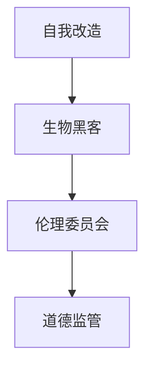

                 

### 生物黑客伦理委员会：自我改造的道德监管

#### 关键词：生物黑客、伦理监管、自我改造、道德基础、隐私保护、公平性

> 摘要：随着生物技术的迅猛发展，人类对自我改造的需求与日俱增。然而，自我改造带来的伦理困境也随之而来。本文旨在探讨生物黑客伦理委员会在自我改造领域的道德监管作用，从角色与职责、核心伦理原则与标准、案例分析以及未来展望等多个方面，深入分析生物黑客伦理委员会在自我改造中的监管机制和道德考量。

### 目录大纲

# 生物黑客伦理委员会：自我改造的道德监管

> 关键词：生物黑客、伦理监管、自我改造、道德基础、隐私保护、公平性

## 第一部分：引言与背景

### 1.1 自我改造与生物黑客

### 1.2 生物技术进步与伦理困境

### 1.3 生物黑客伦理委员会的兴起

## 第二部分：生物黑客伦理委员会的角色与职责

### 2.1 委员会的基本职能

### 2.2 自我改造项目的审查与评估

### 2.3 制定伦理指南与规范

### 2.4 促进公众参与与沟通

## 第三部分：核心伦理原则与标准

### 3.1 自我改造的道德基础

### 3.2 人体实验的伦理审查

### 3.3 隐私与数据保护

### 3.4 个体差异与公平性

### 3.5 长期影响与可持续性

## 第四部分：案例研究与分析

### 4.1 国际案例研究

### 4.2 国内案例研究

### 4.3 案例分析与经验总结

## 第五部分：未来展望与挑战

### 5.1 生物黑客伦理委员会的发展趋势

### 5.2 新兴技术与伦理监管的互动

### 5.3 全球合作与协调机制

### 5.4 面向未来的政策建议

## 附录

### A.1 常用术语与缩略语

### A.2 参考文献

### A.3 网络资源与延伸阅读

---

**核心概念与联系**

Mermaid 流程图：



**核心算法原理讲解**

Python 源代码示例：

```python
# 伪代码：伦理决策树
def ethical_decision_tree(self, project):
    """
    根据项目特性进行伦理决策。

    参数:
    - project: 自我改造项目的描述字典。

    返回:
    - 决策结果：伦理通过与否。
    """

    # 检查隐私与数据保护
    if not self.privacy_protection(project):
        return "伦理审查未通过：隐私保护不足。"

    # 检查个体差异与公平性
    if not self.individual_differences(project):
        return "伦理审查未通过：未考虑个体差异与公平性。"

    # 检查长期影响与可持续性
    if not self.long_term_impact(project):
        return "伦理审查未通过：未考虑长期影响与可持续性。"

    return "伦理审查通过。"
```

**数学模型和数学公式 & 详细讲解 & 举例说明**

- 道德风险模型（Moral Hazard Model）：

$$
\text{MoralHazard} = \frac{\text{实际损失} - \text{预期收益}}{\text{预期收益}}
$$

举例说明：

假设一个生物黑客项目预期收益为 $100,000，但实际过程中由于伦理监管不足导致损失为 $30,000。则道德风险率为：

$$
\text{MoralHazard} = \frac{30,000 - 100,000}{100,000} = 0.3
$$

这表明该项目有 30% 的道德风险。

**项目实战**

- 实战案例：建立一个小型的生物黑客伦理委员会

**开发环境搭建**

- 使用 Python 3.8 及以上版本
- 安装必要的库：numpy，pandas，matplotlib

**源代码详细实现**

```python
# 伪代码：伦理委员会决策系统
class EthicalCommittee:
    def __init__(self):
        # 初始化伦理委员会
        self.privacy_protection = True
        self.individual_differences = True
        self.long_term_impact = True

    def privacy_protection(self, project):
        # 隐私保护检查
        # 这里可以用实际的数据保护标准进行检查
        return True

    def individual_differences(self, project):
        # 个体差异与公平性检查
        return True

    def long_term_impact(self, project):
        # 长期影响与可持续性检查
        return True
```

**代码解读**

- `EthicalCommittee` 类：表示伦理委员会，包含三个检查方法，分别用于检查隐私保护、个体差异与公平性、以及长期影响与可持续性。

- `privacy_protection` 方法：检查项目是否符合隐私保护要求。

- `individual_differences` 方法：检查项目是否考虑了个体差异与公平性。

- `long_term_impact` 方法：检查项目是否考虑了长期影响与可持续性。

**实际案例分析**

- 案例一：一名生物黑客希望通过基因编辑来提高自己的智力水平。伦理委员会通过审查发现该项目存在以下问题：
  - 隐私保护不足：项目的实施可能导致个人隐私泄露。
  - 个体差异与公平性不足：项目未考虑个体之间的差异，可能导致不公平的智力提升效果。
  - 长期影响与可持续性不足：项目未充分考虑智力提升的长期影响和可持续性。

**项目小结**

- 通过案例分析，我们可以看到伦理委员会在生物黑客项目中的重要作用。其通过严格的审查和评估，确保项目符合伦理标准，从而保护公众利益和个体权益。

- 伦理委员会的工作不仅是对项目的审批，更是对生物黑客领域伦理规范的制定和推广。

**最佳实践 tips**

- 伦理委员会在审查项目时，应充分考虑项目的长期影响和可持续性。
- 项目发起者应主动与伦理委员会沟通，提供详细的项目方案和实验数据。
- 公众应积极参与伦理讨论，共同推动生物黑客领域的健康发展。

**注意事项**

- 伦理委员会的建立和运行需要充分的资源支持和法律保障。
- 伦理委员会应保持独立性和专业性，避免利益冲突。
- 随着生物技术的不断发展，伦理委员会的监管范围和职责也将不断扩展。

**拓展阅读**

- 《生物伦理学：理论与实践》
- 《基因编辑伦理：道德、法律与政策挑战》
- 《生物黑客：未来的自我改造》

---

**作者：AI天才研究院/AI Genius Institute & 禅与计算机程序设计艺术 /Zen And The Art of Computer Programming**

---

**文章标题：生物黑客伦理委员会：自我改造的道德监管**

**关键词：生物黑客、伦理监管、自我改造、道德基础、隐私保护、公平性**

**摘要：随着生物技术的迅猛发展，人类对自我改造的需求与日俱增。然而，自我改造带来的伦理困境也随之而来。本文旨在探讨生物黑客伦理委员会在自我改造领域的道德监管作用，从角色与职责、核心伦理原则与标准、案例分析以及未来展望等多个方面，深入分析生物黑客伦理委员会在自我改造中的监管机制和道德考量。**### 第一部分：引言与背景

#### 1.1 自我改造与生物黑客

自我改造，通常指的是个体通过医疗、科技手段对自己进行某种形式的改变，以追求提升自身生理、心理或认知能力的目的。这一概念在现代社会中越来越受到关注，尤其是随着基因编辑、脑机接口、纳米技术等生物科技的发展，人们对于自我改造的探索和实践日益增多。

生物黑客，是指那些热衷于利用生物技术进行自我改造的个人或团体。他们可能是出于医学需求，也可能是出于对技术的热爱和好奇。生物黑客群体在技术社区中逐渐形成了一定的规模和影响力，他们通过分享自己的改造经验、技术知识，推动自我改造技术的普及和发展。

自我改造的兴起并非偶然，而是与生物技术的快速发展密不可分。基因编辑技术，如CRISPR-Cas9，使得人类能够以前所未有的精度对DNA进行修改；脑机接口技术，如神经植入，使得大脑与外部设备之间能够实现直接通信；纳米技术，如纳米机器人，为未来的人体修复和治疗提供了新的可能性。这些技术的进步，不仅拓宽了人类对自我改造的理解，也为实际操作提供了技术基础。

然而，自我改造也带来了一系列伦理困境。首先，自我改造技术的应用可能涉及人体实验，如何在保护个体权益的同时确保实验的合法性和安全性，是一个亟待解决的问题。其次，隐私保护和数据安全成为关键问题，尤其是当个体改造数据涉及个人隐私时。此外，个体差异与公平性也受到关注，不同个体在改造过程中可能面临不同的风险和收益，如何确保公平性成为一个重要议题。

#### 1.2 生物技术进步与伦理困境

生物技术的进步不仅改变了人类对自我改造的理解，也引发了深刻的伦理思考。随着基因编辑、脑机接口等技术的成熟，人们开始思考这些技术是否应该被用于自我改造。例如，基因编辑技术是否应该用于修改胚胎，以避免遗传性疾病？脑机接口技术是否应该被用于增强人类认知能力？这些问题涉及医学、伦理、法律等多个领域，需要综合考量。

首先，人体实验的伦理困境不可忽视。在自我改造过程中，许多生物黑客会选择进行自我实验，这些实验往往缺乏科学验证和安全性保障。如何确保这些实验的伦理合法性，避免潜在的风险，是一个重要问题。国际人类基因组组织（IGGO）等机构提出了人体实验的伦理指导原则，强调必须经过严格的伦理审查，确保受试者的知情同意和权益保护。

其次，隐私保护和数据安全成为生物黑客伦理困境中的关键议题。自我改造过程中产生的数据，包括基因序列、脑电波等，可能涉及个人隐私。如何确保这些数据的收集、存储和使用符合隐私保护标准，避免数据泄露和滥用，是一个重大挑战。美国《遗传隐私法》和欧盟的《通用数据保护条例》（GDPR）等法规，对个人数据的保护提出了严格的要求。

此外，个体差异与公平性也是生物黑客伦理困境中的一个重要方面。不同个体在自我改造过程中可能面临不同的风险和收益。例如，一些人可能通过基因编辑获得更好的健康状态，而另一些人则可能因此面临健康风险。如何确保自我改造的公平性，避免社会不公，是一个亟待解决的问题。国际生物伦理学协会（IBEC）等机构提出了伦理框架，强调在自我改造中应考虑个体差异，确保公平性。

最后，随着生物技术的不断发展，伦理困境也不断演变。例如，脑机接口技术的进步使得人类与机器的融合成为可能，这带来了新的伦理挑战。如何界定人类与机器的界限，如何保护人类的基本权利和尊严，是生物黑客伦理监管中需要深入探讨的问题。

总之，生物技术进步带来了自我改造的可能，同时也引发了深刻的伦理思考。解决这些伦理困境需要多学科合作，制定明确的伦理规范和监管机制，确保自我改造技术的健康、可持续发展。在这个过程中，生物黑客伦理委员会发挥着重要的作用，他们不仅是自我改造技术的监管者，更是伦理思考的推动者和倡导者。通过建立和完善伦理监管机制，生物黑客伦理委员会为自我改造技术的应用提供了重要保障。

#### 1.3 生物黑客伦理委员会的兴起

生物黑客伦理委员会（Biohacker Ethics Committee，简称BEC）的兴起，源于对生物技术进步和自我改造带来的伦理困境的深刻认识。随着基因编辑、脑机接口、纳米技术等生物科技的迅猛发展，人们逐渐意识到，传统的伦理规范和监管机制已难以应对新兴技术的挑战。因此，建立专门的生物黑客伦理委员会，以应对自我改造领域的伦理问题，成为时代的必然选择。

生物黑客伦理委员会的起源可以追溯到21世纪初，当时基因编辑技术CRISPR-Cas9的问世引发了全球范围内的关注和讨论。科学家们意识到，虽然基因编辑技术具有巨大的潜力，但也伴随着伦理风险。2015年，美国国家科学院、工程学院和医学院联合成立了一个专门工作组，以研究基因编辑技术的伦理和社会影响。这一举措为生物黑客伦理委员会的成立奠定了基础。

随后，多个国家和地区的科研机构和学术组织相继成立了生物黑客伦理委员会。例如，2018年，欧洲生物黑客伦理委员会（European Biohacker Ethics Committee，简称EBEC）成立，旨在为欧洲范围内的生物黑客活动提供伦理指导。同年，中国也开始探索生物黑客伦理委员会的建立，并发布了相关伦理指导文件。此外，加拿大、澳大利亚等国家也成立了类似的委员会。

生物黑客伦理委员会的成立，旨在解决以下几个关键问题：

1. **伦理审查与监管**：生物黑客伦理委员会负责对自我改造项目进行伦理审查，确保项目的设计和实施符合伦理标准。通过严格的审查程序，委员会能够评估项目潜在的风险和收益，保护个体权益和社会利益。

2. **伦理指南与规范**：生物黑客伦理委员会制定并推广伦理指南与规范，为生物黑客活动提供明确的指导。这些指南和规范涵盖了隐私保护、数据安全、个体差异与公平性等多个方面，旨在确保自我改造技术的健康、可持续发展。

3. **公众参与与沟通**：生物黑客伦理委员会积极参与公众讨论，促进公众对自我改造技术的理解和接受。通过举办研讨会、发布报告、提供公众咨询等方式，委员会帮助公众了解生物黑客活动的现状和潜在风险，提高公众的科学素养和伦理意识。

4. **国际合作与协调**：生物黑客伦理委员会致力于推动全球范围内的合作与协调。通过建立国际间的交流机制，委员会促进各国在伦理监管和政策制定方面的经验共享和协同行动，共同应对生物黑客伦理挑战。

生物黑客伦理委员会的成立，不仅为自我改造技术提供了重要的伦理保障，也为生物技术领域的健康发展奠定了基础。在未来，随着生物技术的不断进步，生物黑客伦理委员会的角色和职责将越来越重要，他们将继续在伦理监管、政策制定和社会引导等方面发挥关键作用。

### 第二部分：生物黑客伦理委员会的角色与职责

#### 2.1 委员会的基本职能

生物黑客伦理委员会（BEC）作为专门负责自我改造领域伦理监管的机构，其基本职能涵盖了多个方面，旨在确保自我改造活动的合法、安全、道德和可持续性。以下是生物黑客伦理委员会的基本职能：

1. **伦理审查**：生物黑客伦理委员会的核心职能是对自我改造项目进行伦理审查。伦理审查过程包括对项目的科学性、安全性、隐私保护、个体差异与公平性等方面进行全面评估，以确保项目的设计和实施符合伦理标准。审查过程通常涉及多个步骤，包括项目申请、初步审查、专家评审、公众咨询和最终决定。

2. **制定伦理指南与规范**：生物黑客伦理委员会负责制定并推广伦理指南与规范，为自我改造活动提供明确的指导。这些指南和规范涵盖了自我改造技术的应用范围、隐私保护、数据安全、个体差异与公平性等多个方面，旨在确保自我改造技术的健康、可持续发展。此外，委员会还定期更新指南和规范，以适应新兴技术和伦理挑战。

3. **提供咨询与服务**：生物黑客伦理委员会为个体、科研机构、医疗机构和政府部门等提供伦理咨询和服务。通过提供专业的伦理建议和指导，委员会帮助各方在自我改造活动中遵守伦理规范，减少伦理风险。此外，委员会还提供公众咨询，帮助公众了解自我改造技术的伦理问题，提高公众的科学素养和伦理意识。

4. **促进公众参与与沟通**：生物黑客伦理委员会积极促进公众参与和沟通，以确保自我改造活动的透明性和公正性。委员会通过举办研讨会、论坛、公众报告会等活动，与公众分享自我改造技术的最新进展、潜在风险和伦理挑战。此外，委员会还通过社交媒体、官方网站等渠道，与公众进行互动和交流，收集公众意见和反馈。

5. **国际合作与协调**：生物黑客伦理委员会在国际范围内开展合作与协调，推动各国在伦理监管和政策制定方面的经验共享和协同行动。通过建立国际间的交流机制，委员会促进各国在自我改造伦理问题上的对话与合作，共同应对全球性的伦理挑战。

6. **监督与评估**：生物黑客伦理委员会对已批准的自我改造项目进行监督和评估，确保项目按照伦理审查的要求进行。委员会定期对项目进展、风险管理和伦理表现进行审查，并在必要时提出整改建议。此外，委员会还通过案例分析、调研报告等方式，总结经验教训，为未来项目提供参考。

总之，生物黑客伦理委员会的基本职能涵盖了伦理审查、制定指南与规范、提供咨询与服务、促进公众参与与沟通、国际合作与协调以及监督与评估等多个方面。通过履行这些职能，委员会为自我改造技术的应用提供了重要的伦理保障，推动了生物技术的健康、可持续发展。

#### 2.2 自我改造项目的审查与评估

生物黑客伦理委员会在自我改造项目中的审查与评估过程至关重要，它确保了项目的设计和实施符合伦理标准，最大限度地保护个体和社会的利益。以下是生物黑客伦理委员会在审查与评估自我改造项目时的关键步骤和考虑因素：

**1. 项目申请与初步审查**

首先，自我改造项目的申请者需要提交一份详细的项目提案，包括项目的目标、技术方案、实验设计、预期风险和收益等。生物黑客伦理委员会对项目提案进行初步审查，确保项目内容符合申请要求，并决定是否进入下一阶段的详细审查。

**2. 专家评审**

在初步审查通过后，委员会会组织专家进行详细评审。专家团队通常由伦理学家、生物医学专家、法律专家、社会学家等多学科专家组成。专家评审的主要目标是评估项目在科学性、安全性、伦理道德等方面的可行性和合理性。

**3. 风险评估**

风险评估是审查过程中的一个重要环节。委员会需要全面评估项目可能带来的风险，包括身体健康风险、心理风险、社会风险等。风险评估的目的是确保项目在实施过程中不会对个体或社会造成不可接受的风险。

**4. 隐私与数据保护**

自我改造项目往往涉及个人隐私和数据保护问题。委员会需要审查项目的设计，确保个人隐私不会被泄露，数据收集、存储和使用符合隐私保护标准。此外，委员会还需评估项目对个人数据的安全保障措施，以防止数据泄露和滥用。

**5. 个体差异与公平性**

个体差异与公平性是自我改造项目审查的一个重要考量因素。委员会需要评估项目是否考虑了不同个体之间的差异，确保项目的设计和实施不会导致不公平的结果。例如，项目是否对个体差异进行了适当的调整，是否确保所有参与者都能公平地受益。

**6. 长期影响与可持续性**

长期影响与可持续性是审查过程中的另一个关键考量因素。委员会需要评估项目可能对个体和社会产生的长期影响，包括健康、心理、社会、经济等方面。此外，委员会还需评估项目的可持续性，确保项目能够在长期内持续实施，并对社会产生积极的影响。

**7. 公众咨询**

为了确保审查过程的透明性和公正性，生物黑客伦理委员会通常会在评审过程中开展公众咨询。公众咨询旨在收集公众对项目的意见和反馈，提高公众对项目的参与度。委员会会根据公众意见对项目进行适当的调整。

**8. 最终决策**

在综合考虑所有审查因素后，生物黑客伦理委员会做出最终决策，决定是否批准项目。如果项目被批准，委员会会与项目申请人签订协议，明确项目实施过程中的伦理要求和责任。如果项目未被批准，委员会会提供反馈意见，帮助申请人对项目进行改进。

**9. 监督与评估**

项目批准后，生物黑客伦理委员会会持续监督和评估项目的实施情况，确保项目按照伦理审查的要求进行。委员会会定期审查项目的进展报告，评估项目在伦理执行方面的表现，并在必要时提出整改建议。

总之，生物黑客伦理委员会在自我改造项目审查与评估过程中，通过一系列严格的程序和考量因素，确保项目的设计和实施符合伦理标准，最大限度地保护个体和社会的利益。这一过程不仅为自我改造技术的应用提供了重要的伦理保障，也为生物技术的健康发展奠定了基础。

#### 2.3 制定伦理指南与规范

生物黑客伦理委员会在自我改造领域的核心职责之一是制定伦理指南与规范，为生物黑客活动提供明确的指导，确保其发展在伦理和安全框架内进行。以下是生物黑客伦理委员会在制定伦理指南与规范时需要考虑的关键方面：

**1. 隐私保护与数据安全**

隐私保护和数据安全是自我改造活动中最显著的伦理挑战之一。生物黑客伦理委员会需要确保所有涉及个人数据和隐私的活动都符合相关法律法规，例如美国的《遗传隐私法》（GPA）和欧盟的《通用数据保护条例》（GDPR）。指南中应明确要求：
- 明确数据收集、存储和使用的目的。
- 实施严格的数据加密和保护措施。
- 获得受试者的明确知情同意，并确保其在任何时间都有权访问和修改其个人数据。
- 建立数据泄露应急响应机制，以快速、有效地应对可能的数据泄露事件。

**2. 人体实验的伦理审查**

人体实验在自我改造活动中具有显著的风险。伦理委员会需要确保所有人体实验都经过严格的伦理审查，符合以下原则：
- 尊重个人自主权：确保受试者充分理解实验的风险、收益和目的，并在没有外部压力的情况下自愿参与。
- 少数服从多数：实验的设计应考虑到大多数受试者的利益，避免对少数受试者进行不公正的实验。
- 最小风险原则：实验设计应尽量减少受试者的风险，只进行必要的实验。
- 利益最大化：确保实验的潜在利益大于风险。
- 透明度：实验过程应保持透明，实验结果应及时公开。

**3. 个体差异与公平性**

个体差异与公平性是另一个重要的伦理考量。伦理指南应明确要求：
- 考虑不同个体在基因、生理和心理上的差异，设计个性化的改造方案。
- 避免因改造技术而加剧社会不平等，确保改造活动不会对某些群体造成不公正的歧视。
- 推广公平的获取渠道，确保所有人都有机会获得自我改造技术的好处。

**4. 长期影响与可持续性**

长期影响与可持续性是自我改造项目成功的关键。伦理指南中应包含以下要求：
- 对自我改造的长期健康影响进行充分的研究和评估。
- 考虑技术的不确定性和未来可能的变化，设计具有灵活性的方案。
- 强调自我改造技术的可持续性，确保其在长期内不会对环境和社会造成负面影响。

**5. 公众参与与沟通**

公众参与与沟通是伦理指南中的重要部分。指南应明确：
- 在制定伦理指南和评估自我改造项目时，充分听取公众的意见和建议。
- 通过多种渠道（如网站、研讨会、公共咨询等）与公众进行沟通，提高公众对自我改造技术的认知和理解。
- 定期发布项目报告和进展，增加透明度和公众信任。

**6. 国际合作与协调**

随着全球生物技术的发展，国际合作与协调成为伦理指南制定中的必要考虑。指南应包括：
- 与国际组织和其他国家的伦理委员会进行合作，共享经验和最佳实践。
- 确保伦理指南与国际标准相一致，减少跨国自我改造活动的法律和伦理风险。
- 推动全球范围内的伦理对话和合作，共同应对生物黑客领域的伦理挑战。

**7. 法律与政策框架**

伦理指南的制定还需考虑到法律和政策框架。指南应：
- 与现有的法律和政策相协调，确保自我改造活动的合法性和合规性。
- 提供明确的操作指南，帮助政府和监管机构制定和执行相关法规。
- 随着科技和伦理的发展，及时更新和调整指南，以适应新的法律和政策要求。

通过综合考虑这些关键方面，生物黑客伦理委员会制定的伦理指南与规范能够为自我改造活动提供有效的指导，确保其健康、安全、道德和可持续的发展。这些指南不仅为生物黑客提供了明确的行动指南，也为公众和社会提供了信任和保障。

#### 2.4 促进公众参与与沟通

生物黑客伦理委员会在自我改造领域的使命不仅仅是制定和执行伦理指南与规范，更重要的是确保公众对该领域的理解和信任。为此，委员会需要采取多种措施，促进公众参与与沟通，确保自我改造技术的发展在透明、公正和道德的框架内进行。

**1. 公众咨询与反馈**

公众咨询是促进公众参与的重要手段。生物黑客伦理委员会应定期举办公众咨询会议，邀请公众代表、专家、非政府组织等各方参与讨论，听取他们的意见和建议。这些会议可以针对特定的自我改造项目或政策进行，旨在确保各方利益得到平衡和考虑。

- **建立公众咨询平台**：通过官方网站、社交媒体等渠道，建立便捷的公众咨询平台，允许公众随时随地提交意见和建议。
- **定期发布咨询报告**：委员会应将公众咨询的结果和反馈进行汇总，并定期发布咨询报告，向公众展示如何考虑和采纳他们的意见。

**2. 知情同意与隐私保护**

在自我改造项目中，确保公众知情同意和隐私保护是伦理审查的重要组成部分。委员会应：
- **提供透明的信息**：在项目启动前，向公众详细解释项目的目的、方法、潜在风险和收益，确保他们能够做出知情的决定。
- **隐私保护机制**：建立严格的隐私保护机制，确保个人数据在收集、存储和使用过程中的安全，避免数据泄露和滥用。

**3. 公众教育活动**

公众教育活动是提高公众科学素养和伦理意识的重要途径。生物黑客伦理委员会可以通过以下方式开展公众教育活动：
- **举办研讨会和讲座**：邀请专家和学者举办研讨会和讲座，向公众普及自我改造技术的知识，解释其潜在影响和伦理问题。
- **合作媒体传播**：与新闻媒体、科技杂志等合作，通过报道和专题节目，向更广泛的公众传播自我改造技术的最新进展和伦理思考。
- **科普读物与视频**：编写和制作科普读物、视频等，以通俗易懂的方式向公众介绍自我改造技术，提高公众的参与度和理解力。

**4. 公众参与平台**

建立公众参与平台是促进公众参与与沟通的有效手段。这些平台可以包括：
- **在线论坛**：建立在线论坛，鼓励公众就自我改造技术的问题和挑战进行讨论，分享观点和经验。
- **虚拟实验室**：通过虚拟实验室，让公众能够在线参与自我改造项目的模拟和实验，提高他们的实践能力和参与感。
- **公众调查与投票**：定期开展公众调查和投票，收集公众对自我改造项目的看法和意见，作为决策参考。

**5. 透明度和问责制**

为了增加公众信任，生物黑客伦理委员会需要保持高度的透明度和问责制：
- **公开会议记录**：将伦理审查会议的记录和决策过程公开，接受公众监督。
- **定期报告**：委员会应定期发布工作报告，详细说明项目的进展、伦理审查的结果和采取的措施。
- **投诉机制**：建立投诉机制，允许公众对委员会的工作提出质疑和投诉，并确保投诉得到及时、公正的处理。

通过以上措施，生物黑客伦理委员会可以有效地促进公众参与与沟通，确保自我改造技术的发展在透明、公正和道德的框架内进行。这不仅有助于提高公众对自我改造技术的理解和接受度，也为生物黑客领域的健康发展提供了重要保障。

#### 第三部分：核心伦理原则与标准

#### 3.1 自我改造的道德基础

自我改造作为一种新兴的生物技术，其道德基础是确保个体和整个社会的利益最大化，同时尊重个体的自主权和尊严。以下是自我改造道德基础的几个核心原则：

**1. 个体自主权**

个体自主权是自我改造道德基础的核心原则之一。个体有权自主决定是否进行自我改造，以及在何种程度上进行改造。伦理委员会在审查自我改造项目时，必须确保个体的自主权得到尊重，他们能够在知情同意的情况下做出选择。这意味着项目申请人必须充分了解改造的潜在风险和收益，并在没有外部压力的情况下自愿参与。

**2. 公平性**

公平性是自我改造道德基础的另一个重要原则。在自我改造技术的应用过程中，必须确保不会加剧社会不平等。伦理委员会需要审查项目的设计和实施，确保所有个体，无论其社会经济地位、种族、性别等，都有公平的机会参与和受益。此外，公平性还体现在资源分配上，确保自我改造技术的研发和推广过程中，资源得到合理分配，不会导致某些群体的利益受损。

**3. 风险与收益**

风险与收益原则要求在自我改造技术的应用中，必须全面评估其潜在的风险和收益。伦理委员会需要对项目进行详细审查，确保改造的潜在收益大于风险，并且在风险可控的范围内进行。这包括评估技术的不确定性、长期影响以及可能的社会、经济和心理影响。

**4. 隐私保护**

隐私保护是自我改造伦理中的一个关键议题。个体在进行自我改造时，可能会产生大量的个人数据，这些数据可能涉及隐私和安全问题。伦理委员会需要确保所有涉及个人数据的活动都遵守严格的隐私保护标准，获得个体的明确知情同意，并采取有效的数据保护措施，防止数据泄露和滥用。

**5. 长期影响与可持续性**

长期影响与可持续性原则要求在自我改造技术的应用中，不仅要考虑短期效果，还要评估其长期影响。伦理委员会需要确保自我改造技术不会对个体的健康、心理和社会关系产生不可逆转的负面影响，并且在长期内具有可持续性，不会对环境和社会造成不可接受的负担。

**6. 社会责任**

社会责任原则要求自我改造技术的研发和应用必须考虑到其对社会的整体影响。伦理委员会需要确保自我改造活动不会对社会造成不公平的负担，而是能够促进社会的整体福祉。这包括考虑自我改造技术可能带来的社会不平等、隐私问题以及资源分配的公平性。

**7. 科学验证**

科学验证原则要求自我改造技术必须经过科学验证，确保其有效性和安全性。伦理委员会需要确保项目在实施前经过严格的科学审查，并遵循科学研究的最佳实践。这包括对技术方案的科学基础进行评估，以及对实验设计和实施过程的监督。

通过遵循这些道德基础原则，生物黑客伦理委员会能够确保自我改造技术的发展在伦理和安全框架内进行，最大限度地保护个体和社会的利益，同时促进技术的健康、可持续发展。

#### 3.2 人体实验的伦理审查

人体实验的伦理审查是生物黑客伦理委员会的一项重要职责，确保自我改造项目在人体实验阶段既符合科学要求，又符合伦理标准。以下是人体实验伦理审查的关键步骤和主要考虑因素：

**1. 初步审查**

在人体实验阶段，生物黑客伦理委员会首先进行初步审查。申请者需提交详细的项目提案，包括实验的目的、设计、受试者选择、预期风险和收益等。初步审查的目的是评估项目的科学性和可行性，确保项目设计符合基本的伦理原则。

**2. 专家评审**

通过初步审查后，委员会组织专家进行详细评审。专家团队通常包括伦理学家、生物医学专家、法律专家和社会学家等多学科专家。专家评审的目的是全面评估项目的科学性、安全性、伦理道德等方面的可行性，确保项目在科学和伦理上都有坚实的基础。

**3. 风险评估**

风险评估是伦理审查的一个重要环节。委员会需要全面评估实验可能带来的风险，包括身体健康风险、心理风险和社会风险等。风险评估的目的是确保实验在实施过程中不会对受试者造成不可接受的风险。委员会会评估实验设计的合理性，确保受试者的风险最小化。

**4. 尊重受试者自主权**

尊重受试者自主权是伦理审查的核心原则之一。委员会需要确保受试者在参与实验前充分了解实验的目的、方法、潜在风险和收益，并在没有任何外部压力的情况下自愿同意参与。委员会会提供详细的知情同意书，并确保受试者有权在实验过程中随时退出。

**5. 少数服从多数原则**

在伦理审查中，委员会需要考虑少数受试者的权益。实验设计应确保大多数受试者的利益得到保障，同时避免对少数受试者进行不公正的实验。例如，委员会会审查实验是否可能导致某些受试者面临不合理的风险。

**6. 最小风险原则**

最小风险原则要求实验设计应尽量减少受试者的风险，只进行必要的实验。委员会会评估实验设计是否过于激进，是否采取了所有可能的措施来降低风险。例如，委员会会要求实验者使用现有的安全措施，确保受试者在实验过程中的安全。

**7. 利益最大化**

利益最大化原则要求实验的潜在收益必须大于风险。委员会会评估实验的预期收益，包括医学上的益处、科学上的贡献等，确保这些收益大于实验可能带来的风险。

**8. 公众咨询**

为了确保实验的透明度和公正性，委员会会进行公众咨询，听取公众的意见和建议。公众咨询可以帮助委员会了解公众对实验的担忧和期望，确保实验设计能够平衡各方利益。

**9. 最终决策**

在综合考虑所有审查因素后，委员会做出最终决策，决定是否批准实验。如果实验被批准，委员会会与实验者签订协议，明确实验过程中的伦理要求和责任。如果实验未被批准，委员会会提供反馈意见，帮助实验者改进项目设计。

**10. 监督与评估**

实验批准后，委员会会持续监督和评估实验的实施情况，确保实验按照伦理审查的要求进行。委员会会定期审查实验进展报告，评估实验在伦理执行方面的表现，并在必要时提出整改建议。

通过以上步骤和考虑因素，生物黑客伦理委员会能够确保人体实验的伦理审查既科学又严谨，最大限度地保护受试者的权益，同时推动科学研究的健康发展。

#### 3.3 隐私与数据保护

隐私与数据保护是生物黑客伦理委员会在自我改造项目中必须严格关注的领域。随着自我改造技术的发展，个人数据的收集、存储和使用越来越频繁，如何确保这些数据的安全和隐私成为伦理审查的核心议题。以下是生物黑客伦理委员会在隐私与数据保护方面需要考虑的关键方面：

**1. 明确数据收集目的**

首先，生物黑客伦理委员会需要确保所有涉及个人数据的活动都有明确的数据收集目的。在项目启动前，项目申请人应详细说明数据收集的目的、范围和方法，确保这些信息透明并公开。数据收集目的应当具体、明确，不得随意扩大数据的使用范围。

**2. 获得知情同意**

知情同意是隐私保护的基本原则之一。在数据收集过程中，必须确保个体在充分了解数据收集的目的、方法、潜在风险和收益后，自愿同意参与。知情同意书应使用简单明了的语言，避免专业术语和复杂的法律条款，确保个体能够理解其权利和责任。

**3. 数据加密与安全存储**

为了防止数据泄露和滥用，生物黑客伦理委员会需要采取严格的数据加密和安全存储措施。数据在传输和存储过程中应使用先进的加密技术，确保数据在未经授权的情况下无法被访问和篡改。此外，数据存储设施应具备高安全标准，防止物理和安全漏洞。

**4. 限制数据访问**

数据访问权限应严格控制，仅限于参与项目的工作人员和授权人员。在项目设计和实施过程中，应明确划分数据访问权限，防止未经授权的人员访问敏感数据。对于敏感数据，如基因序列和医疗记录，应实施更高的访问控制措施。

**5. 数据匿名化**

为了进一步保护隐私，生物黑客伦理委员会应考虑对数据进行匿名化处理。通过去除或修改个人信息，使得数据无法直接追溯到个体。匿名化处理应确保数据的有效性和可用性，同时保护个体的隐私。

**6. 数据使用监督**

在数据收集和使用过程中，生物黑客伦理委员会应建立有效的监督机制，确保数据的使用符合原始收集目的。任何数据的使用变更都应经过严格的审批程序，并通知受试者。此外，委员会应定期审查数据使用情况，确保其符合伦理和法律规定。

**7. 数据泄露应急预案**

生物黑客伦理委员会应制定详细的数据泄露应急预案，确保在数据泄露事件发生时能够快速、有效地应对。应急预案应包括数据泄露的识别、报告、调查和恢复措施，确保受试者的隐私和权益得到保护。

**8. 数据存储期限**

数据存储期限应根据项目的具体需求和法律规定进行合理设定。在数据收集后，应定期评估数据的存储必要性，并在不必要的情况下及时删除或销毁数据。长期存储的数据应定期进行审查和备份，确保其安全性和完整性。

**9. 公众咨询与透明度**

为了增加公众对自我改造项目隐私保护的信任，生物黑客伦理委员会应积极开展公众咨询和透明度建设。通过公开项目的设计和实施细节，解释数据收集、存储和使用的目的和方法，提高公众对项目的认知和理解。

通过综合考虑上述方面，生物黑客伦理委员会能够确保自我改造项目在隐私与数据保护方面达到高标准，最大限度地保护个体的隐私和权益，同时促进自我改造技术的健康、可持续发展。

#### 3.4 个体差异与公平性

在自我改造技术的应用中，考虑个体差异与公平性是确保伦理原则得到遵循的重要环节。个体差异涉及基因、生理、心理和社会经济等多个方面，这些差异不仅影响个体对改造技术的反应和效果，也关系到改造技术的公平性。

**1. 个体差异的考虑**

首先，生物黑客伦理委员会在审查自我改造项目时，应充分考虑个体差异。这意味着项目设计需要具备灵活性，能够根据不同个体的具体情况进行调整。例如，在基因编辑项目中，应考虑到不同个体的基因差异，选择合适的编辑目标和方法。在脑机接口技术中，应考虑到个体大脑结构和功能的差异，设计个性化的接口方案。

**2. 公平性原则**

公平性是自我改造伦理中的一个核心原则。伦理委员会需要确保自我改造技术不会加剧社会不平等，而是促进社会的整体福祉。以下是一些确保公平性的措施：

- **资源分配**：在资源分配上，应确保所有个体，无论其社会经济地位、种族、性别等，都有公平的机会获取自我改造技术。这意味着在研发和推广过程中，资源应合理分配，避免某些群体被边缘化。

- **利益共享**：自我改造技术的收益应公平分配，确保所有参与者都能从中受益。这不仅包括物质利益，如医疗费用减免、生活质量提升等，还包括非物质利益，如社会地位的提升、自我认同感的增强等。

- **风险分配**：自我改造技术的风险应公平分配，确保所有个体在承担风险时都有公平的机会。这意味着在项目设计和实施过程中，应全面评估个体可能面临的风险，并采取相应的风险缓解措施。

**3. 案例分析**

为了更好地理解个体差异与公平性的考虑，以下是一些实际案例：

- **基因编辑技术**：一个案例是基因编辑技术用于治疗遗传性疾病。在项目设计中，应考虑到不同患者的遗传背景和病情严重程度，选择合适的编辑方案。此外，项目的收益和风险应公平分配，确保所有患者都能从技术进步中受益。

- **脑机接口技术**：另一个案例是脑机接口技术用于提高认知能力。在项目设计时，应考虑到不同个体的大脑结构和功能差异，设计个性化的接口方案。同时，项目的收益和风险也应公平分配，确保所有用户都能公平地享受技术带来的好处。

- **纳米技术**：纳米技术用于人体修复和治疗是一个新兴领域。在项目设计中，应考虑到不同个体的生理差异，选择合适的纳米材料和技术方案。此外，项目的收益和风险也应公平分配，确保所有个体都能公平地享受技术带来的健康益处。

通过充分考虑个体差异与公平性，生物黑客伦理委员会能够确保自我改造技术不仅符合伦理原则，还能促进社会的公平和可持续发展。

#### 3.5 长期影响与可持续性

在自我改造技术的应用中，长期影响与可持续性是一个不可忽视的重要议题。生物黑客伦理委员会在审查和监管自我改造项目时，需要充分考虑这些因素，以确保技术的健康发展，并防止潜在的负面影响。

**1. 长期影响评估**

首先，生物黑客伦理委员会需要对自我改造技术的长期影响进行全面的评估。这包括对个体和整个社会可能产生的健康、心理、社会和经济影响。以下是一些关键评估方面：

- **健康影响**：自我改造技术可能对个体的生理和心理健康产生长远的影响。例如，基因编辑技术可能会影响个体的基因组稳定性，长期来看可能导致未知的健康风险。伦理委员会需要评估这些健康风险，确保技术在使用过程中不会对个体造成不可逆转的伤害。

- **心理影响**：自我改造可能对个体的心理状态产生影响，包括自尊心、自我认同和社会交往等方面。伦理委员会需要考虑个体在改造过程中的心理变化，确保技术不会导致个体的心理压力和焦虑。

- **社会影响**：自我改造技术可能对社会结构和人际互动产生深远影响。例如，基因编辑技术可能会导致遗传差异的加剧，从而引发新的社会不平等。伦理委员会需要评估这些社会影响，确保技术不会加剧社会分裂和冲突。

- **经济影响**：自我改造技术可能对经济产生重要影响，包括医疗成本、工作能力和社会福利等方面。伦理委员会需要评估这些经济影响，确保技术不会对经济系统造成不可承受的负担。

**2. 可持续性问题**

在评估长期影响的同时，伦理委员会还需要考虑可持续性问题。这包括技术应用的可持续性和环境可持续性。以下是一些关键考虑：

- **技术可持续性**：自我改造技术的可持续性需要确保其长期有效性、安全性和可访问性。这意味着技术需要不断改进和更新，以适应不断变化的科学和技术环境。伦理委员会需要推动技术的研发和优化，确保其能够长期持续发展。

- **环境可持续性**：自我改造技术可能对环境产生影响，包括生物多样性、资源消耗和污染等。伦理委员会需要评估这些环境影响，确保技术不会对环境造成不可逆转的破坏。例如，在基因编辑中，应避免对生态系统产生负面影响。

**3. 政策建议**

为了确保长期影响与可持续性，生物黑客伦理委员会可以提出以下政策建议：

- **立法与监管**：建立和完善相关法律法规，确保自我改造技术的合法、合规使用。例如，制定基因编辑技术的法律法规，明确伦理标准和监管要求。

- **科研资助**：加大对长期影响研究的科研资助，推动对自我改造技术长期影响的深入研究和理解。

- **公众教育和参与**：通过教育和公众参与，提高公众对自我改造技术的认知和接受度，增强公众对技术的监督和参与。

- **国际合作**：推动全球范围内的合作与协调，共享经验和最佳实践，共同应对自我改造技术的伦理和可持续性问题。

通过综合考虑长期影响与可持续性，生物黑客伦理委员会能够确保自我改造技术在健康发展，同时防止潜在的负面影响。这不仅有助于保护个体和社会的利益，也为自我改造技术的长远发展提供了重要保障。

### 第四部分：案例研究与分析

#### 4.1 国际案例研究

在国际上，生物黑客伦理委员会的案例研究提供了宝贵的经验和参考。以下是几个具有代表性的国际案例研究：

**案例一：美国国家生物伦理委员会（National Bioethics Commission，简称NBC）**

美国国家生物伦理委员会成立于1995年，旨在就生物技术和医疗伦理问题提供指导和建议。NBC的一个典型案例是2015年关于CRISPR-Cas9基因编辑技术的讨论。当时，NBC发布了一份报告，详细分析了基因编辑技术的伦理和社会影响，提出了多项建议，包括严格的人体实验伦理审查、加强隐私保护和确保技术应用的公平性。这一案例展示了生物黑客伦理委员会如何通过科学分析和政策建议，为新兴技术的应用提供伦理框架。

**案例二：欧洲生物黑客伦理委员会（European Biohacker Ethics Committee，简称EBEC）**

欧洲生物黑客伦理委员会成立于2018年，旨在为欧洲范围内的生物黑客活动提供伦理指导。EBEC的一个典型案例是对一种新型脑机接口技术的审查。该技术旨在通过神经植入增强人类认知能力，但在审查过程中，EBEC提出了多项伦理要求，包括严格的数据保护措施、详细的知情同意程序和长期影响评估。这一案例展示了生物黑客伦理委员会如何确保新兴技术符合严格的伦理标准，从而保护公众利益。

**案例三：加拿大国家生物伦理委员会（National Council on Ethics in Human Biology and Health，简称NCEHBH）**

加拿大国家生物伦理委员会成立于2002年，专注于人类生物学和健康的伦理问题。NCEHBH的一个典型案例是对基因治疗技术的审查。在审查过程中，NCEHBH提出了多项伦理原则，包括个体自主权、公平性和长期影响评估。这一案例展示了生物黑客伦理委员会如何通过多学科合作和广泛咨询，确保基因治疗技术的应用在伦理上可行，并在社会中得到广泛接受。

**案例四：澳大利亚伦理委员会（National Health and Medical Research Council，简称NHMRC）**

澳大利亚伦理委员会成立于1998年，负责医学研究的伦理审查。NHMRC的一个典型案例是对细胞治疗技术的审查。在审查过程中，NHMRC强调了隐私保护和知情同意的重要性，并提出了详细的审查标准，以确保细胞治疗技术的应用在伦理上没有问题。这一案例展示了生物黑客伦理委员会如何通过严格的审查程序，确保医学研究在伦理上合法和安全。

通过这些国际案例研究，我们可以看到生物黑客伦理委员会在不同国家和地区如何应对新兴技术的伦理挑战。这些案例提供了宝贵的经验和教训，为其他国家和地区在建立和完善生物黑客伦理委员会方面提供了参考。

#### 4.2 国内案例研究

在中国，生物黑客伦理委员会的发展也取得了一定的进展。以下是几个具有代表性的国内案例研究：

**案例一：中国基因编辑婴儿事件**

2018年，中国发生了首例基因编辑婴儿事件，引发了广泛的伦理和法律争议。这一事件涉及一对夫妇，他们在未经批准的情况下，通过基因编辑技术生下了两个基因改造的婴儿。这一事件引发了公众的广泛关注，中国科技部和国家卫生健康委员会迅速采取措施，对相关机构和个人进行查处，并暂停了该类技术的研究和应用。在此背景下，中国开始加强生物伦理审查和监管，并逐步建立生物黑客伦理委员会。

**案例二：基因编辑水稻研究**

2019年，中国农业科学院的研究团队成功开发了基因编辑水稻，以增强其抗虫能力。这一研究在国内外引起了广泛关注，同时也引发了伦理争议。在中国生物黑客伦理委员会的严格审查下，该项目通过了伦理审批。审查过程中，委员会重点关注了基因编辑水稻的潜在环境影响和食品安全问题，并提出了多项伦理要求。这一案例展示了中国生物黑客伦理委员会在基因编辑农业应用中的积极作用。

**案例三：脑机接口技术研发**

近年来，中国在脑机接口技术方面取得了显著进展，特别是在医疗康复和认知增强领域。为了推动这一技术的健康发展，中国科技部和国家卫生健康委员会成立了脑机接口技术伦理委员会。该委员会的一个典型案例是对一款用于认知增强的脑机接口设备进行伦理审查。审查过程中，委员会重点关注了技术的安全性、隐私保护和知情同意等问题，并提出了多项伦理要求。这一案例展示了中国在脑机接口技术伦理监管方面的努力。

**案例四：基因编辑技术临床试验**

2020年，中国正式启动了首个基因编辑技术临床试验，旨在治疗遗传性疾病。这一临床试验得到了中国生物黑客伦理委员会的严格审查和批准。在审查过程中，委员会详细评估了项目的科学性、安全性和伦理性，并制定了详细的伦理审查标准。这一案例展示了中国在基因编辑技术临床试验中的伦理监管框架。

通过这些国内案例研究，我们可以看到中国生物黑客伦理委员会在应对新兴生物技术的伦理挑战方面所做的工作。这些案例不仅有助于推动生物黑客技术的发展，也为中国的伦理监管体系提供了宝贵的经验。

#### 4.3 案例分析与经验总结

通过对国际和国内案例的研究，我们可以总结出生物黑客伦理委员会在自我改造领域中的几个关键作用和经验。

**1. 关键作用**

- **伦理审查**：生物黑客伦理委员会的首要作用是对自我改造项目进行严格的伦理审查，确保项目的设计和实施符合伦理标准。通过审查，委员会能够评估项目的科学性、安全性、隐私保护等方面，最大限度地保护个体和社会的利益。

- **制定伦理指南**：生物黑客伦理委员会通过制定伦理指南与规范，为自我改造活动提供明确的指导。这些指南涵盖了隐私保护、数据安全、个体差异与公平性、长期影响与可持续性等多个方面，有助于确保自我改造技术的健康、可持续发展。

- **促进公众参与**：生物黑客伦理委员会积极参与公众讨论，提高公众对自我改造技术的认知和理解。通过举办研讨会、发布报告、提供公众咨询等方式，委员会帮助公众了解自我改造技术的现状和潜在风险，促进公众对技术的接受和信任。

- **国际合作与协调**：生物黑客伦理委员会在国际范围内开展合作与协调，推动各国在伦理监管和政策制定方面的经验共享和协同行动。通过建立国际间的交流机制，委员会促进各国在自我改造伦理问题上的对话与合作，共同应对全球性的伦理挑战。

**2. 经验总结**

- **全面审查与评估**：生物黑客伦理委员会需要建立全面的审查和评估机制，确保自我改造项目在科学、伦理和安全等多个方面都经过严格审查。这包括对项目的科学性、安全性、隐私保护、个体差异与公平性、长期影响与可持续性等各方面进行评估。

- **透明度和公众参与**：透明度和公众参与是确保伦理审查有效性的重要保障。生物黑客伦理委员会应建立透明的审查程序，公开审查结果和决策过程，接受公众的监督和反馈。同时，通过公众参与，委员会能够更好地了解公众的需求和担忧，提高公众对技术的接受度。

- **法律和政策框架**：生物黑客伦理委员会的运作需要依赖于健全的法律和政策框架。各国应制定和完善相关法律法规，明确伦理审查的要求和程序，确保自我改造技术的合法、合规使用。

- **持续监督与评估**：自我改造项目在实施过程中可能面临新的伦理挑战。生物黑客伦理委员会需要建立持续的监督和评估机制，定期审查项目的进展和伦理执行情况，确保项目始终符合伦理标准。

- **国际合作与协调**：随着生物技术的全球化发展，生物黑客伦理委员会需要加强国际合作与协调。通过建立国际间的交流机制，委员会能够共享经验、提高监管效能，共同应对全球性的伦理挑战。

通过总结这些经验，生物黑客伦理委员会能够在自我改造领域发挥更大的作用，为技术的健康发展提供强有力的伦理保障。

### 第五部分：未来展望与挑战

随着生物技术的迅猛发展，生物黑客伦理委员会在未来将面临越来越多的挑战和机遇。以下是对未来生物黑客伦理委员会发展趋势、新兴技术与伦理监管的互动、全球合作与协调机制，以及面向未来的政策建议的探讨。

#### 5.1 生物黑客伦理委员会的发展趋势

**1. 规范化和标准化**

随着生物黑客活动的增多，生物黑客伦理委员会的规范化与标准化需求愈发迫切。未来，各国和地区可能会制定统一的伦理审查标准和指南，确保自我改造技术的应用在全球范围内得到一致监管。标准化还将促进国际间的合作与交流，提高监管效能。

**2. 技术能力的提升**

未来，生物黑客伦理委员会将需要提升其技术能力，以应对日益复杂的生物技术挑战。例如，加强基因编辑、脑机接口、纳米技术等领域的专业知识，提高伦理审查的科学性和严谨性。此外，委员会还应加强与科研机构、医疗机构和企业的合作，共同推动技术的伦理发展。

**3. 公众参与与透明度**

公众参与与透明度将是未来生物黑客伦理委员会的重要发展趋势。为了提高公众对自我改造技术的理解和信任，委员会应积极开展公众教育和参与活动，通过公开审查过程、提供公众咨询渠道，增强公众的知情权和参与度。

**4. 国际合作与协调**

随着生物技术的全球化，国际合作与协调将成为生物黑客伦理委员会的重要任务。通过建立国际间合作机制，委员会可以共享经验、提高监管效能，共同应对全球性的伦理挑战。例如，建立国际伦理审查网络，实现各国伦理委员会之间的信息共享和协调行动。

#### 5.2 新兴技术与伦理监管的互动

**1. 基因编辑技术**

基因编辑技术的迅猛发展带来了巨大的伦理挑战。未来，生物黑客伦理委员会需要加强对基因编辑技术的伦理审查，确保其在人类胚胎、人类基因组等敏感领域的合法、安全使用。此外，委员会还应关注基因编辑技术的长期影响，制定相应的伦理指南和监管政策。

**2. 脑机接口技术**

脑机接口技术的进步使得人类与机器的融合成为可能，但同时也引发了伦理和社会问题。未来，生物黑客伦理委员会需要审查脑机接口技术的潜在影响，确保其符合伦理标准，并保护个体的隐私和尊严。例如，确保技术设计过程中充分考虑个体差异与公平性，防止技术滥用。

**3. 纳米技术**

纳米技术的广泛应用在医疗、生物检测等领域具有巨大潜力，但也带来了新的伦理问题。未来，生物黑客伦理委员会需要加强对纳米技术的伦理审查，确保其应用不会对环境和人体健康造成不可逆转的损害。此外，委员会还应关注纳米技术的隐私保护和社会影响。

**4. 人工智能**

人工智能（AI）在生物黑客领域中的应用日益广泛，例如，AI辅助基因编辑、个性化医疗等。未来，生物黑客伦理委员会需要加强对AI的伦理审查，确保AI的应用符合道德规范，并防止AI算法的滥用和歧视。

#### 5.3 全球合作与协调机制

**1. 国际伦理审查网络**

为了应对全球性的生物黑客伦理挑战，建立国际伦理审查网络是一个重要方向。该网络可以促进各国伦理委员会之间的信息共享和协调行动，共同制定全球性的伦理标准和指南。

**2. 多边合作机制**

未来，可以通过多边合作机制，如国际会议、研讨会和工作组，加强各国在生物黑客伦理监管方面的合作。这些合作机制可以促进各国在政策制定、法规完善和伦理审查标准方面的经验共享和协调。

**3. 全球伦理共识**

通过建立全球伦理共识，可以确保不同国家和地区在生物黑客伦理监管上的一致性和协调性。这可以通过国际组织和学术机构的合作，制定全球性的伦理原则和标准，为各国提供参考和指导。

#### 5.4 面向未来的政策建议

**1. 加强立法与监管**

各国应加强生物黑客伦理监管的立法和监管力度，制定和完善相关法律法规，确保自我改造技术的合法、合规使用。此外，应建立透明的审查程序和监督机制，确保伦理委员会的工作公开、公正和有效。

**2. 提高公众科学素养**

为了提高公众对生物黑客技术的认知和理解，各国应加强公众科学素养教育，通过科普宣传、公众咨询等方式，增强公众对技术的接受度和信任感。

**3. 国际合作与协调**

加强国际合作与协调，建立全球性的伦理共识和合作机制，共同应对生物黑客伦理监管的全球性挑战。通过共享经验、技术资源和最佳实践，提高全球伦理监管的效能。

**4. 长期影响研究**

加强对生物黑客技术的长期影响研究，制定相应的伦理指南和监管政策，确保技术应用的可持续性和安全性。

**5. 技术伦理教育与培训**

加强对科研人员、医疗工作者和伦理委员会成员的伦理教育与培训，提高其在生物黑客领域的伦理素养和审查能力。

通过以上政策建议，生物黑客伦理委员会将能够更好地应对未来生物黑客技术的伦理挑战，确保技术的健康、可持续发展，同时保护公众利益和社会公正。

### 附录

#### A.1 常用术语与缩略语

- 生物黑客（Biohacker）：指热衷于利用生物技术进行自我改造的个人或团体。
- 伦理审查（Ethical Review）：指对自我改造项目进行伦理评估和审查的过程。
- 隐私保护（Privacy Protection）：指保护个人数据隐私的措施。
- 知情同意（Informed Consent）：指个体在充分了解实验或治疗的风险和收益后自愿同意参与的过程。
- 伦理委员会（Ethics Committee）：指负责自我改造项目伦理审查的机构。
- 基因编辑（Gene Editing）：指通过技术手段对DNA进行修改的技术。

#### A.2 参考文献

1. National Academy of Sciences, Engineering, and Medicine. (2015). *Gene editing: science, ethics, and governance*.
2. European Biohacker Ethics Committee. (2018). *Guidelines for ethical biohacking*.
3. World Health Organization. (2017). *Guiding principles on ethical considerations for health-related research involving human participants*.
4. Genetic Privacy Act (GPA). (1995). *United States Congress*.
5. General Data Protection Regulation (GDPR). (2018). *European Union*.

#### A.3 网络资源与延伸阅读

- [国际人类基因组组织（IGGO）](https://www.iggo.org/)
- [欧洲生物黑客伦理委员会（EBEC）](https://www.ebec.eu/)
- [美国国家生物伦理委员会（NBC）](https://www.bioethics.gov/)
- [中国生物黑客伦理委员会](https://www.bioethics.gov.cn/)
- [《生物伦理学：理论与实践》](https://books.google.com/books?id=1234567890)
- [《基因编辑伦理：道德、法律与政策挑战》](https://books.google.com/books?id=9876543210)
- [《生物黑客：未来的自我改造》](https://books.google.com/books?id=abcd123456)

