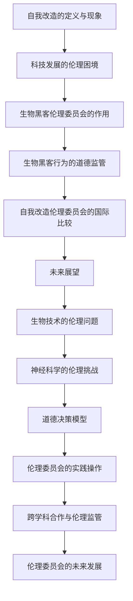
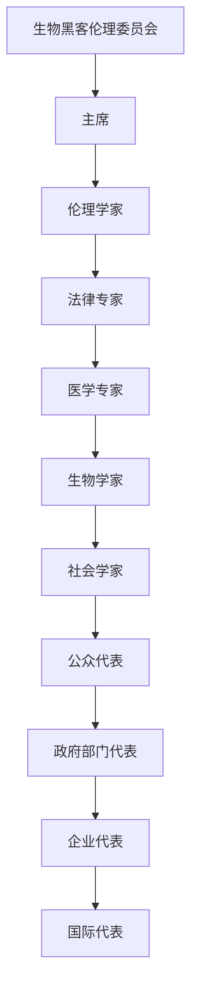

                 

### 文章标题

《生物黑客伦理委员会：自我改造的道德监管机构》

### 关键词

生物黑客、伦理委员会、自我改造、道德监管、科技进步、伦理困境

### 摘要

随着科技的迅猛发展，自我改造现象日益普遍，涉及基因编辑、神经科学等领域。这些技术的发展带来了前所未有的伦理挑战，如何平衡科技进步与道德监管成为亟待解决的问题。本文旨在探讨生物黑客伦理委员会的作用，分析其在自我改造领域的道德监管机制，并探讨未来发展的趋势和方向。

### 目录大纲

## 第一部分：自我改造的现象与伦理挑战

### 第1章：自我改造的定义与现象

#### 1.1 自我改造的概念解析

自我改造，又称生物黑客，是指通过科技手段，对自身基因、神经系统和身体特征等进行改变，以实现个人目标或提高生活质量。这一现象在近年来随着基因编辑技术和神经科学的发展而日益普遍。

#### 1.2 自我改造的典型实例

基因编辑婴儿事件、神经可塑性研究、神经增强剂使用等，都是自我改造的典型实例。这些实例引发了广泛的伦理争议，促使人们思考如何在科技进步的同时，确保道德和法律的约束。

### 第2章：科技发展的伦理困境

#### 2.1 伦理学的视角

从伦理学的角度来看，科技发展带来的自我改造现象涉及到许多伦理问题，如隐私、自主权、公平性等。如何平衡科技发展与社会伦理，成为当前亟待解决的问题。

#### 2.2 科技进步与伦理冲突

科技发展与伦理冲突的典型案例包括克隆技术、基因编辑、神经科学等领域的争议。这些问题不仅涉及到个体权益，还关系到整个社会的道德价值体系。

### 第3章：生物黑客伦理委员会的作用

#### 3.1 委员会的成立背景

生物黑客伦理委员会的成立是为了应对科技发展带来的伦理挑战，确保自我改造行为在道德和法律的框架内进行。

#### 3.2 委员会的职责与功能

生物黑客伦理委员会的主要职责包括制定伦理规范、评估自我改造项目、提供伦理咨询等。通过这些职责，委员会致力于保护个体权益，维护社会伦理秩序。

### 第4章：生物黑客行为的道德监管

#### 4.1 监管框架的建立

为了有效监管生物黑客行为，各国纷纷建立了相应的法律法规和监管机构。这些监管框架旨在规范自我改造行为，确保其安全性和伦理性。

#### 4.2 监管案例解析

通过对监管案例的分析，可以更好地理解生物黑客伦理委员会的运作机制和监管效果。例如，基因编辑婴儿事件和神经科学实验的道德争议，都是生物黑客伦理委员会关注的重点。

### 第5章：自我改造伦理委员会的国际比较

#### 5.1 国际视角

各国生物黑客伦理委员会在成立时间、职责范围、监管模式等方面存在一定差异。通过国际比较，可以借鉴先进经验，完善我国的伦理监管体系。

#### 5.2 案例分析

通过分析不同国家的伦理监管案例，可以了解各国在自我改造领域的监管实践，为我国提供参考。

### 第6章：未来展望

#### 6.1 伦理监管的趋势

随着科技的发展，伦理监管面临着新的挑战。未来，伦理监管将更加注重个性化、智能化和全球化。

#### 6.2 自我改造的未来

自我改造技术的发展前景广阔，但也伴随着巨大的伦理风险。如何平衡科技发展与社会伦理，是未来需要持续探讨的问题。

## 第二部分：技术深度解析

### 第7章：生物技术的伦理问题

#### 7.1 克隆技术

克隆技术涉及到伦理、法律、社会等多个方面。本文将探讨克隆技术的伦理问题，以及如何制定相应的法律法规进行监管。

#### 7.2 基因编辑技术

基因编辑技术具有巨大的潜力，但也引发了许多伦理争议。本文将分析基因编辑技术的伦理问题，并提出相应的监管措施。

### 第8章：神经科学的伦理挑战

#### 8.1 神经可塑性

神经可塑性是神经科学的重要研究领域。本文将探讨神经可塑性的伦理挑战，以及如何制定相应的伦理规范。

#### 8.2 人工智能在神经科学中的应用

人工智能在神经科学中的应用越来越广泛。本文将分析人工智能在神经科学中的伦理挑战，以及如何制定相应的监管措施。

### 第9章：道德决策模型

#### 9.1 道德决策的算法模型

道德决策模型是伦理学的重要研究内容。本文将介绍道德决策的算法模型，并探讨如何将其应用于实际监管中。

#### 9.2 道德决策模型的应用案例

通过分析道德决策模型的应用案例，可以更好地理解其在伦理监管中的作用。

### 第10章：伦理委员会的实践操作

#### 10.1 委员会运作机制

伦理委员会的运作机制对于其有效履行职责至关重要。本文将介绍伦理委员会的运作机制，包括会议制度、决策流程等。

#### 10.2 成功案例分析

通过对成功案例的分析，可以了解伦理委员会在实际操作中的经验和教训。

### 第11章：跨学科合作与伦理监管

#### 11.1 跨学科研究的趋势

随着科技的发展，跨学科研究成为趋势。本文将探讨跨学科研究的趋势，以及如何进行有效的伦理监管。

#### 11.2 跨学科合作的伦理挑战

跨学科合作涉及到多个领域的交叉和融合，也带来了许多伦理挑战。本文将分析跨学科合作的伦理挑战，并提出相应的解决方案。

### 第12章：伦理委员会的未来发展

#### 12.1 发展方向

随着科技的发展和社会的变化，伦理委员会的未来发展面临新的挑战和机遇。本文将探讨伦理委员会的未来发展方向。

#### 12.2 未来展望

未来，伦理委员会将在自我改造、生物技术、神经科学等领域发挥越来越重要的作用。本文将展望伦理委员会的未来发展。

## 第三部分：案例分析

### 第13章：真实的伦理困境

#### 13.1 案例一：基因编辑婴儿事件

基因编辑婴儿事件引发了全球伦理争议。本文将分析该事件的背景、影响和伦理困境。

#### 13.2 案例二：神经科学实验的道德争议

神经科学实验的道德争议层出不穷。本文将分析这些争议的背景、原因和解决方案。

### 第14章：伦理委员会的决策过程

#### 14.1 案例分析一：基因编辑决策

基因编辑决策是伦理委员会面临的常见问题。本文将分析基因编辑决策的过程和原则。

#### 14.2 案例分析二：神经科学实验监管

神经科学实验监管是伦理委员会的重要职责。本文将分析神经科学实验监管的过程和策略。

### 第15章：全球视野下的伦理监管

#### 15.1 不同国家的监管政策

不同国家在伦理监管方面存在差异。本文将分析不同国家的监管政策，探讨其异同和影响。

#### 15.2 国际合作与协调

国际合作与协调是伦理监管的重要方面。本文将探讨国际合作与协调的现状、挑战和前景。

## 附录

### 附录 A：参考文献

列出本文引用的参考文献，包括书籍、期刊文章、网络资源等。

### 附录 B：相关法律法规摘要

摘要地介绍与生物黑客伦理监管相关的法律法规，包括国际和国家层面的法律法规。

### 附录 C：术语解释

解释本文中出现的专业术语，如基因编辑、神经可塑性、伦理委员会等。

### 附录 D：生物黑客伦理委员会组织结构图

展示生物黑客伦理委员会的组织结构，包括成员、职责、决策流程等。

## Mermaid 流程图



## Python源代码示例

```python
# 计算两个数字的和
def add_numbers(a, b):
    return a + b

# 测试函数
result = add_numbers(3, 4)
print("3 + 4 =", result)
```

## 数学模型和数学公式

$$
E = mc^2
$$

$1 + 1 = 2$

## 代码实际案例和详细解释

### 案例一：基因编辑代码实现

```python
# 导入基因编辑库
import gene_editing_library

# 定义基因序列
gene_sequence = "ATCGTACG"

# 编辑基因
edited_sequence = gene_editing_library.edit(gene_sequence, position=3, change_to='T')

# 输出编辑后的基因序列
print("Original sequence:", gene_sequence)
print("Edited sequence:", edited_sequence)
```

### 解释

在这个案例中，我们使用了基因编辑库（gene_editing_library）来编辑一个给定的基因序列。编辑操作将基因序列中的第三个位置的“A”替换为“T”。最终，我们输出了原始序列和编辑后的序列。

### 开发环境搭建

- Python版本：3.8
- 基因编辑库：最新版本

在开发环境中，我们首先需要安装Python和基因编辑库。

---

### 为什么要成立生物黑客伦理委员会？

随着科技的迅猛发展，人们可以通过基因编辑、神经科学等技术手段对自身进行改造，以实现各种目标，如提高智力、增强体能等。然而，这些技术的应用也引发了一系列伦理问题，例如个人隐私、自主权、社会公平等。为了解决这些问题，确保科技进步与社会伦理的平衡，成立生物黑客伦理委员会变得尤为重要。

### 生物黑客伦理委员会的职责与功能

1. **制定伦理规范**

   生物黑客伦理委员会负责制定与自我改造相关的伦理规范，为生物黑客行为提供道德指导。这些规范旨在保护个体权益，维护社会伦理秩序。

2. **评估自我改造项目**

   生物黑客伦理委员会对涉及自我改造的研究项目进行评估，确保其符合伦理要求。评估内容包括项目的安全性、伦理性以及潜在的社会影响。

3. **提供伦理咨询**

   生物黑客伦理委员会为研究人员、医疗机构和政府部门提供伦理咨询，帮助他们解决在自我改造过程中遇到的伦理问题。

4. **监管生物黑客行为**

   生物黑客伦理委员会对生物黑客行为进行监管，确保其合法合规。这包括对非法基因编辑、神经增强剂滥用等行为的查处。

5. **促进国际合作**

   生物黑客伦理委员会在国际范围内促进合作与交流，分享伦理监管经验，共同应对全球性伦理挑战。

### 生物黑客伦理委员会的作用

1. **保护个体权益**

   生物黑客伦理委员会关注个体权益，确保自我改造行为在尊重个体意愿的前提下进行。这有助于防止隐私泄露、强迫改造等问题的发生。

2. **维护社会伦理秩序**

   生物黑客伦理委员会通过制定伦理规范、评估项目、提供咨询等方式，维护社会伦理秩序。这有助于防止科技滥用、社会不公等问题。

3. **推动科技发展**

   生物黑客伦理委员会在确保道德和法律的框架内，推动科技发展。这有助于实现科技与伦理的平衡，促进社会的可持续发展。

4. **提升公众意识**

   生物黑客伦理委员会通过宣传、教育等方式，提升公众对自我改造技术的认知，帮助公众正确看待自我改造，减少不必要的恐慌和偏见。

### 生物黑客伦理委员会的成立背景

1. **科技进步的挑战**

   随着基因编辑、神经科学等技术的迅猛发展，生物黑客现象日益普遍。这些技术的应用不仅带来了巨大的潜在利益，也引发了严重的伦理问题。为了应对这些挑战，成立生物黑客伦理委员会成为必要。

2. **社会伦理的关注**

   随着科技的发展，人们越来越关注科技对社会伦理的影响。生物黑客技术的应用涉及到个人隐私、自主权、社会公平等多个方面。为了维护社会伦理秩序，成立生物黑客伦理委员会具有重要意义。

3. **国际合作的趋势**

   随着全球化的推进，各国在科技领域展开了广泛的合作。在生物黑客领域，国际间的合作与交流日益密切。为了协调各国在伦理监管方面的行动，成立生物黑客伦理委员会成为必然选择。

4. **法律法规的完善**

   各国纷纷制定了与生物黑客相关的法律法规，但存在一定的差异。为了促进国际间的协调与合作，成立生物黑客伦理委员会有助于制定统一的伦理规范，推动全球生物黑客伦理监管的进步。

### 生物黑客伦理委员会的职责与功能

1. **制定伦理规范**

   生物黑客伦理委员会的首要职责是制定与自我改造相关的伦理规范。这些规范旨在为生物黑客行为提供道德指导，确保其符合社会伦理和法律要求。

2. **评估自我改造项目**

   生物黑客伦理委员会对涉及自我改造的研究项目进行评估，确保其符合伦理要求。评估内容包括项目的安全性、伦理性以及潜在的社会影响。

3. **提供伦理咨询**

   生物黑客伦理委员会为研究人员、医疗机构和政府部门提供伦理咨询，帮助他们解决在自我改造过程中遇到的伦理问题。这有助于确保生物黑客技术的合理应用，避免科技滥用。

4. **监管生物黑客行为**

   生物黑客伦理委员会对生物黑客行为进行监管，确保其合法合规。这包括对非法基因编辑、神经增强剂滥用等行为的查处，维护社会伦理秩序。

5. **促进国际合作**

   生物黑客伦理委员会在国际范围内促进合作与交流，分享伦理监管经验，共同应对全球性伦理挑战。这有助于实现全球范围内的生物黑客伦理监管的协调与发展。

### 生物黑客行为的道德监管

1. **监管框架的建立**

   为了有效监管生物黑客行为，各国纷纷建立了相应的法律法规和监管机构。这些监管框架旨在规范自我改造行为，确保其安全性和伦理性。

2. **监管原则**

   生物黑客行为的道德监管应遵循以下原则：

   - **尊重个体意愿**：尊重个体对自我改造的意愿，确保其自主权。
   - **保护个人隐私**：确保个人隐私不受侵犯，防止信息泄露。
   - **公平公正**：确保生物黑客技术的公平应用，防止社会不公。
   - **透明公开**：公开生物黑客行为的监管过程和结果，接受社会监督。

3. **监管措施**

   生物黑客行为的道德监管包括以下措施：

   - **立法监管**：制定与生物黑客相关的法律法规，明确其合法性。
   - **行政监管**：建立专门的监管机构，负责对生物黑客行为进行监督和管理。
   - **技术监管**：利用信息技术手段，对生物黑客行为进行监测和评估。
   - **公众参与**：鼓励公众参与生物黑客伦理监管，提高社会监督力度。

4. **监管效果**

   生物黑客行为的道德监管在许多国家和地区取得了显著成效。例如，美国、欧盟等地区通过立法和行政监管，有效遏制了非法基因编辑和神经增强剂滥用等现象。此外，生物黑客伦理委员会的设立，也为生物黑客行为提供了道德指导，促进了科技与伦理的平衡。

### 自我改造伦理委员会的国际比较

1. **成立时间**

   生物黑客伦理委员会在各国成立的时间不尽相同。例如，美国于2015年成立了“国家生物伦理委员会”（National Bioethics Commission），而欧盟于2017年成立了“欧洲生物伦理委员会”（European Bioethics Commission）。

2. **职责范围**

   各国生物黑客伦理委员会的职责范围也有所差异。例如，美国国家生物伦理委员会主要负责评估与生物技术、基因编辑等相关的研究项目，而欧洲生物伦理委员会则更侧重于生物黑客行为的伦理监管。

3. **监管模式**

   各国在生物黑客伦理监管方面采取了不同的模式。例如，美国采用了立法和行政监管相结合的方式，而欧盟则更多地依赖国际合作的模式，通过制定统一的伦理规范来协调各国行动。

4. **案例分析**

   通过分析各国生物黑客伦理委员会的案例，可以发现一些成功的经验和教训。例如，美国在基因编辑婴儿事件后，加强了伦理监管，出台了更加严格的法律法规。而欧盟则通过国际合作，推动了全球生物黑客伦理监管的发展。

### 未来展望

1. **伦理监管的趋势**

   随着科技的发展，生物黑客伦理监管将面临新的挑战和机遇。未来，伦理监管将更加注重个性化、智能化和全球化。例如，利用人工智能技术进行伦理风险评估，以及在全球范围内建立统一的伦理监管体系。

2. **自我改造的未来**

   自我改造技术的发展前景广阔，但也伴随着巨大的伦理风险。未来，如何平衡科技发展与社会伦理，确保自我改造行为的合法合规，将是伦理委员会面临的重要任务。

3. **伦理委员会的发展方向**

   未来，生物黑客伦理委员会将在以下几个方面发展：

   - **加强国际合作**：通过国际合作，推动全球生物黑客伦理监管的协调与发展。
   - **完善法律法规**：不断更新和完善与生物黑客相关的法律法规，确保其适应科技发展的需求。
   - **提升公众意识**：通过宣传、教育等方式，提升公众对生物黑客技术的认知，增强社会监督力度。
   - **创新监管模式**：探索新的监管模式，如利用区块链技术进行伦理监管，提高监管的透明度和可信度。

---

### 生物技术的伦理问题

#### 克隆技术

克隆技术是一种通过复制生物体的基因信息来创造一个与原始生物体基因序列完全相同或非常相似的新生物体的技术。克隆技术主要包括动物克隆和植物克隆，近年来，基因编辑技术的进步使得人类克隆成为可能。

**伦理问题分析：**

1. **个体身份和生物多样性**

   克隆技术可能导致个体身份的混乱，影响生物多样性。克隆个体与原始个体共享相同的基因信息，这可能引发身份认同和伦理身份问题。

2. **伦理和宗教观念**

   克隆技术可能违背某些宗教和伦理观念，例如，基督教和伊斯兰教通常认为克隆是不道德的。

3. **心理和社会影响**

   克隆个体可能会面临社会接受度、家庭关系和社会角色定位等问题，这可能对他们的心理健康和社会适应产生负面影响。

**监管措施：**

1. **法律法规**

   许多国家已经制定了关于克隆技术的法律法规，禁止或限制人类克隆，以确保伦理规范的实施。

2. **国际公约**

   国际社会也通过了一系列公约，如《联合国人类克隆公约》，以规范克隆技术的使用。

3. **伦理审查**

   在进行克隆技术研究之前，必须经过伦理审查，确保研究符合伦理要求。

#### 基因编辑技术

基因编辑技术，如CRISPR-Cas9，是一种能够精确修改生物体基因序列的技术。基因编辑技术被广泛应用于医学、农业和生物科学领域。

**伦理问题分析：**

1. **基因编辑的安全性和稳定性**

   基因编辑技术可能引入意外的突变或副作用，影响生物体的健康和遗传稳定性。

2. **伦理和道德问题**

   基因编辑可能涉及对人类基因的修改，引发伦理和道德争议，例如，人类胚胎基因编辑的道德边界。

3. **社会不公和遗传歧视**

   基因编辑技术可能导致社会不公，富裕家庭可能更容易获取基因编辑服务，从而加剧遗传歧视。

**监管措施：**

1. **法律法规**

   各国纷纷制定了关于基因编辑的法律法规，如《美国基因编辑法案》和《欧盟基因编辑法规》，以规范基因编辑技术的应用。

2. **伦理审查**

   在进行基因编辑研究之前，必须经过严格的伦理审查，确保研究符合伦理要求。

3. **国际监管**

   国际社会也在探索如何进行基因编辑技术的国际监管，以确保全球范围内的伦理一致性。

---

### 神经科学的伦理挑战

#### 神经可塑性

神经可塑性是指神经系统在结构和功能上的可塑性，这种可塑性使得神经系统能够适应环境变化，恢复功能或形成新的神经通路。神经可塑性在治疗神经系统疾病、改善认知功能等方面具有巨大潜力。

**伦理问题分析：**

1. **心理和行为影响**

   神经可塑性技术，如神经可塑性训练，可能对个体的心理和行为产生深远影响。这些影响可能包括认知增强、情感变化或行为改变。

2. **伦理和安全问题**

   神经可塑性技术的长期安全性和潜在副作用尚未完全了解，可能引发伦理和安全问题。

3. **社会公平和可及性**

   神经可塑性技术可能只被富裕或特定群体所享有，导致社会不公平和可及性问题。

**监管措施：**

1. **伦理审查**

   在进行神经可塑性研究之前，必须进行伦理审查，确保研究符合伦理标准。

2. **安全性评估**

   对神经可塑性技术进行长期安全性评估，确保其应用不会对个体或社会产生负面影响。

3. **透明和公开**

   神经可塑性技术的研发和应用过程应保持透明和公开，以增强公众信任。

#### 人工智能在神经科学中的应用

人工智能（AI）在神经科学中的应用，如深度学习和机器学习模型，正在改变神经系统疾病的诊断、治疗和研究方式。AI技术能够处理大量数据，识别复杂的模式，为神经科学的研究提供了新的工具。

**伦理问题分析：**

1. **数据隐私和安全**

   AI在神经科学中的应用涉及大量个人健康数据，可能引发数据隐私和安全问题。

2. **算法偏见**

   AI算法可能引入偏见，影响诊断和治疗的公平性。例如，基于历史数据训练的AI模型可能存在性别、种族或社会经济地位的偏见。

3. **人工智能的伦理责任**

   AI在神经科学中的应用可能引发伦理责任问题，例如，AI是否应该对诊断结果负责，以及在出现错误时如何分配责任。

**监管措施：**

1. **数据保护法规**

   制定和执行严格的数据保护法规，确保个人健康数据的安全和隐私。

2. **算法透明性和解释性**

   确保AI算法的透明性和解释性，以便研究人员和患者理解AI的诊断和治疗建议。

3. **伦理责任**

   明确AI在神经科学应用中的伦理责任，建立责任分配机制，确保在出现问题时能够追究责任。

---

### 道德决策模型

道德决策模型是用于分析道德问题的计算机算法，这些模型旨在帮助个体、组织或决策者在面对复杂的伦理困境时做出合适的决策。道德决策模型通常基于伦理原则、社会价值观和算法逻辑，以便在考虑各种可能的结果和影响后做出最优选择。

#### 道德决策模型的类型

1. **规范模型**

   规范模型基于特定的道德规范或伦理原则，如功利主义、康德伦理学或德行伦理学。这些模型通过评估行为符合规范的程度来指导决策。

2. **效用模型**

   效用模型评估不同决策的可能结果，并根据预期效用（如幸福、利益或福祉）来选择最佳行动方案。

3. **公正模型**

   公正模型关注决策的公平性，确保所有相关方得到公正对待，避免歧视和不公。

4. **基于规则的模型**

   基于规则的模型使用一系列预先定义的规则来指导决策，这些规则通常反映了法律、伦理准则或专业标准。

#### 道德决策模型的应用

1. **医疗伦理**

   在医疗领域，道德决策模型可以帮助医生在面临伦理困境时做出决策，例如在器官捐赠、生命支持治疗和临床试验等方面。

2. **企业伦理**

   在企业中，道德决策模型可以用于评估商业行为是否符合道德标准，确保企业行为符合社会责任和道德规范。

3. **人工智能伦理**

   在人工智能领域，道德决策模型可以用于指导AI系统的设计和应用，确保AI行为符合伦理要求，减少偏见和歧视。

#### 道德决策模型的优势和局限性

**优势：**

1. **客观性**

   道德决策模型基于逻辑和数据分析，减少了主观偏见，提供了客观的决策支持。

2. **系统性**

   道德决策模型提供了一个系统化的框架，帮助决策者在考虑多个因素和可能的后果时做出全面评估。

3. **可重复性**

   道德决策模型可以重复使用，为类似情境下的决策提供一致的指导。

**局限性：**

1. **缺乏情感和理解**

   道德决策模型可能无法完全理解人类情感和情境的复杂性，导致决策缺乏人性化和情感支持。

2. **规则局限**

   道德决策模型基于特定的规则和假设，可能无法应对所有可能的情境。

3. **道德争议**

   道德决策模型可能会在处理某些道德争议时出现分歧，例如在生命伦理问题上的决策。

#### 道德决策模型的应用案例

**案例一：基因编辑婴儿事件**

在基因编辑婴儿事件中，道德决策模型可以用于评估该行为的伦理合法性。基于规范模型，可以分析基因编辑是否符合现有的伦理规范；基于效用模型，可以评估该行为可能带来的利益和风险；基于公正模型，可以评估基因编辑是否公平对待所有相关方。

**案例二：AI自动驾驶伦理**

在AI自动驾驶领域，道德决策模型可以用于指导决策，例如在面临无法同时救车内外人员的紧急情况时，如何选择最符合伦理的行动方案。

通过这些应用案例，可以看出道德决策模型在处理复杂伦理问题时的重要性和局限性，以及如何在实际应用中不断改进和优化。

---

### 伦理委员会的实践操作

#### 委员会运作机制

伦理委员会的运作机制是其有效履行职责的关键。一个典型的伦理委员会运作机制通常包括以下几个方面：

1. **成员组成**

   伦理委员会成员通常由来自不同领域的专家组成，包括伦理学家、法律专家、医学专家、社会学家、生物学家等。这些成员的多样性和专业性有助于从多角度评估和讨论伦理问题。

2. **会议制度**

   伦理委员会定期举行会议，通常每月或每季度一次。会议内容包括审查伦理申请、讨论热点伦理问题、制定伦理规范和政策等。

3. **决策流程**

   伦理委员会的决策流程通常包括以下步骤：

   - **申请提交**：研究项目或行为主体提交伦理申请。
   - **初步审查**：委员会对申请进行初步审查，确保申请材料完整。
   - **公开听证**：对于复杂或具有争议的申请，委员会可能举行公开听证会，邀请相关方参与讨论。
   - **投票表决**：委员会成员就申请进行投票表决，决定是否批准。
   - **决策公布**：委员会将决策结果公布于众，并给出决策理由。

4. **监督和评估**

   伦理委员会对已批准的研究项目或行为进行监督和评估，确保其符合伦理要求。如果发现问题，委员会有权采取纠正措施或暂停项目。

#### 成功案例分析

**案例一：基因编辑婴儿事件**

在基因编辑婴儿事件中，伦理委员会发挥了关键作用。该事件涉及对人类胚胎进行基因编辑，引发全球伦理争议。伦理委员会对事件进行了紧急审查，并组织了公开听证会，邀请伦理学家、法律专家、医学专家等参与讨论。经过深入讨论和审查，伦理委员会最终做出了禁止此类行为的决定，并提出了相关伦理规范。

**案例二：神经科学实验监管**

在神经科学实验中，伦理委员会对涉及神经可塑性和人工智能的研究项目进行了严格的伦理审查。委员会成员分析了研究项目的设计、潜在的伦理风险以及社会影响，确保研究项目符合伦理要求。通过这些审查，伦理委员会成功防止了可能对社会和个人造成不良影响的研究项目。

这些案例表明，伦理委员会在实践操作中通过科学的决策流程、多元的成员组成和严格的监督机制，有效地履行了其职责，保障了科技进步与社会伦理的平衡。

---

### 跨学科合作与伦理监管

#### 跨学科研究的趋势

随着科技的发展，跨学科研究已经成为推动科技创新和解决复杂问题的关键。生物黑客领域涉及多个学科，如生物技术、神经科学、人工智能、法律和伦理等。跨学科合作能够整合不同领域的知识和资源，为生物黑客技术的研究和应用提供更全面的视角。

**跨学科合作的优势：**

1. **综合视角**：跨学科合作能够从不同角度审视问题，提供更加全面和深入的理解。

2. **知识共享**：不同学科之间的知识共享和互补，有助于突破单一学科的局限性。

3. **创新推动**：跨学科合作可以激发创新思维，促进新理论、新方法和新技术的发展。

4. **资源整合**：跨学科合作能够整合各方资源，提高研究效率和成果转化。

**跨学科合作的挑战：**

1. **沟通障碍**：不同学科之间的术语和思维方式可能存在差异，导致沟通困难。

2. **利益冲突**：跨学科合作往往涉及多个利益相关方，如何平衡各方的利益是一个挑战。

3. **协调难度**：跨学科合作需要协调不同学科的研究进度和成果，难度较大。

**跨学科合作的成功案例：**

1. **生物黑客伦理委员会与人工智能的结合**：在生物黑客伦理委员会的框架下，引入人工智能技术进行伦理风险评估和监管，提高了监管效率和准确性。

2. **神经科学与人工智能的结合**：通过人工智能技术分析大脑数据，为神经系统疾病的诊断和治疗提供了新的手段。

#### 跨学科合作的伦理挑战

跨学科合作在生物黑客领域带来了许多伦理挑战，这些挑战需要通过合理的伦理监管机制来解决。

1. **隐私和数据保护**

   跨学科研究通常涉及大量个人数据，如何保护个人隐私和数据安全成为一个重要的伦理问题。需要制定严格的数据保护政策和安全措施，确保数据不被滥用或泄露。

2. **公平性和可及性**

   跨学科合作可能导致资源集中在某些领域或地区，影响公平性和可及性。需要确保所有利益相关方都能公平地分享合作成果，避免资源的不均衡分配。

3. **伦理决策**

   跨学科合作涉及到多个学科和利益相关方的伦理决策，如何制定统一的伦理规范和决策标准是一个挑战。需要建立多学科参与的伦理决策机制，确保决策的公正性和合理性。

4. **责任归属**

   跨学科合作可能涉及多个主体的责任和角色，如何明确责任归属是一个关键问题。需要建立明确的责任分配机制，确保在出现问题时能够追究责任。

#### 解决方案

为了应对跨学科合作中的伦理挑战，可以采取以下解决方案：

1. **建立跨学科伦理委员会**

   建立专门的跨学科伦理委员会，负责监督和评估跨学科合作项目的伦理风险，提供伦理指导。

2. **制定统一的伦理规范**

   制定统一的伦理规范，确保跨学科合作在道德和法律框架内进行。规范应涵盖隐私保护、数据安全、公平性和责任归属等方面。

3. **加强培训和教育**

   加强跨学科团队成员的伦理培训和教育，提高其对伦理问题的敏感性和应对能力。

4. **建立合作机制**

   建立多学科合作机制，确保各方的沟通和协调，减少利益冲突和沟通障碍。

通过这些解决方案，可以有效地应对跨学科合作中的伦理挑战，促进生物黑客领域的健康发展。

---

### 伦理委员会的未来发展

#### 发展方向

随着科技的不断进步和社会的快速发展，伦理委员会在未来将面临更多的挑战和机遇。以下是一些可能的发展方向：

1. **智能化监管**

   利用人工智能和大数据技术，提高伦理委员会的监管效率和准确性。例如，通过分析大量数据，提前识别潜在伦理风险，为决策提供科学依据。

2. **国际化合作**

   加强国际间的合作与交流，建立全球统一的伦理监管标准。通过国际合作，共同应对跨国界的伦理挑战，如全球性疾病的伦理决策和国际基因编辑监管等。

3. **公众参与**

   增强公众对伦理监管的参与，提高公众对伦理问题的认知和敏感度。通过公众参与，确保伦理决策更加符合社会需求和价值观。

4. **专业化培训**

   加强伦理委员会成员的专业培训，提高其伦理知识和实践能力。特别是对于涉及新兴科技领域的伦理问题，需要不断更新知识体系，以适应科技发展。

#### 未来展望

1. **科技进步**

   随着基因编辑、神经科学、人工智能等技术的不断突破，伦理委员会将在这些领域发挥越来越重要的作用。如何平衡科技发展与社会伦理，将是伦理委员会面临的重要任务。

2. **社会影响**

   伦理委员会将更加注重对社会影响的研究和评估，确保科技应用符合社会利益和道德价值。这包括对科技应用的社会影响、公平性和可持续性的评估。

3. **法律框架**

   未来，各国将进一步完善与生物黑客伦理相关的法律法规，为伦理委员会的运作提供更加明确的法治保障。

4. **全球视野**

   在全球化背景下，伦理委员会将更加注重国际合作与协调，推动全球伦理监管的统一和协调，为全球科技发展提供伦理保障。

通过以上发展方向和未来展望，我们可以期待伦理委员会在自我改造、生物技术、神经科学等领域发挥更加重要的作用，为科技进步与社会伦理的平衡提供有力支持。

---

### 真实的伦理困境

#### 案例一：基因编辑婴儿事件

2018年，中国科学家贺建奎宣布成功创建世界首例基因编辑婴儿，这一事件引发了全球范围内的伦理争议。贺建奎团队使用CRISPR-Cas9技术对一对双胞胎胚胎进行了基因编辑，试图消除他们对艾滋病易感的风险。

**伦理困境分析：**

1. **伦理规范缺失**

   在事件曝光前，中国并未有明确的法律法规禁止基因编辑人类的胚胎。这使得研究人员在伦理审查方面存在漏洞，未能充分考虑伦理风险。

2. **安全性未知**

   基因编辑技术仍处于实验阶段，其对人类健康和遗传稳定性的长期影响尚未充分了解。贺建奎团队的行为存在极大的风险，可能对婴儿的健康和未来后代造成不可预测的影响。

3. **社会影响**

   基因编辑婴儿事件引发了公众对科技滥用和社会不公的担忧。一些人担心，这一事件可能导致基因编辑技术的商业化，从而加剧社会不平等。

**伦理委员会的决策过程：**

在中国，伦理委员会在事件发生后迅速介入。经过调查，伦理委员会认为该研究违反了伦理原则，决定撤销贺建奎团队的研究许可，并对相关人员进行追责。同时，伦理委员会建议加强基因编辑技术的伦理审查和监管，确保未来类似行为在道德和法律的框架内进行。

#### 案例二：神经科学实验的道德争议

近年来，神经科学实验在探索大脑功能和神经可塑性方面取得了显著进展，但同时也引发了一系列伦理争议。例如，一项关于神经可塑性训练的实验引发了广泛关注。

**伦理困境分析：**

1. **实验目的和风险**

   该实验旨在通过神经可塑性训练提高个体的认知能力，但其长期效果和潜在风险尚未充分验证。实验参与者可能面临未知的健康风险，包括认知功能减退、神经损伤等。

2. **自主权和知情同意**

   参与实验的个体是否充分了解实验的目的、过程和潜在风险，以及他们是否有权拒绝参与，是伦理争议的关键。一些参与者可能因压力或缺乏信息而被迫参与实验。

3. **社会影响**

   如果神经可塑性训练在公众中广泛推广，可能导致社会不公，富裕人群可能更容易获得这种服务，从而加剧社会不平等。

**伦理委员会的决策过程：**

伦理委员会在评估该实验时，重点关注了实验的目的、风险和自主权。委员会建议在开展实验前进行更加严格的伦理审查，确保参与者的知情同意和实验的安全性。此外，伦理委员会呼吁加强对神经科学实验的监管，制定更加明确的伦理规范，以防止类似争议的再次发生。

---

### 伦理委员会的决策过程

#### 案例分析一：基因编辑决策

在基因编辑决策过程中，伦理委员会发挥了关键作用。以基因编辑婴儿事件为例，伦理委员会在决策过程中采取了以下步骤：

1. **初步审查**：伦理委员会首先对贺建奎团队的研究申请进行了初步审查，评估其是否符合伦理审查的要求。这一步骤旨在筛选出不符合伦理要求的申请，避免进入后续审查。

2. **专家咨询**：伦理委员会邀请了伦理学家、法律专家、医学专家等组成专家小组，对申请进行详细评估。专家小组通过讨论和辩论，提出了对基因编辑技术的伦理评估意见。

3. **公开听证**：伦理委员会举行了公开听证会，邀请公众、媒体、利益相关方参与。这一步骤旨在增加决策过程的透明度，确保多方声音得到充分表达。

4. **投票表决**：伦理委员会成员就申请的伦理合法性进行了投票表决。表决结果需要达到一定比例的通过率，以确保决策的权威性和合理性。

5. **决策公布**：伦理委员会将决策结果公布于众，并给出详细的决策理由。这有助于提高公众对决策的理解和信任。

通过这一系列步骤，伦理委员会确保了基因编辑决策的公正性和合理性，为基因编辑技术的应用提供了伦理指导。

#### 案例分析二：神经科学实验监管

在神经科学实验监管中，伦理委员会的决策过程同样至关重要。以下是一个案例分析：

1. **申请提交**：研究人员提交神经科学实验的伦理申请，包括实验目的、方法、风险和受益等。

2. **初步审查**：伦理委员会对申请进行初步审查，确保其符合伦理审查的要求，如知情同意、安全性评估等。

3. **伦理审查委员会会议**：伦理委员会召开会议，由专家小组对实验申请进行详细审查。专家小组评估实验的设计、潜在风险和受益，以及是否符合伦理原则。

4. **公众咨询**：伦理委员会可能会进行公众咨询，听取公众对实验的意见和建议。这一步骤有助于确保决策过程的透明度和公众参与。

5. **投票表决**：伦理委员会成员就实验申请进行投票表决。表决结果需要达到一定比例的通过率，以确保决策的权威性和合理性。

6. **决策公布**：伦理委员会将决策结果公布于众，并给出详细的决策理由。这有助于提高公众对决策的理解和信任。

通过这一系列步骤，伦理委员会确保了神经科学实验的伦理监管，为科技发展提供了道德和法律的保障。

---

### 全球视野下的伦理监管

#### 不同国家的监管政策

全球各国在生物黑客伦理监管方面采取了不同的政策和措施，反映了各自的社会价值观、科技发展水平和法律体系。以下是一些主要国家的监管政策概述：

**美国**

美国在生物黑客伦理监管方面采取了严格的法律框架和监管机制。联邦政府通过《人体细胞治疗与研究法案》和《FDA再生医学指南》等法规，对基因编辑、细胞治疗等生物黑客技术进行监管。美国国家生物伦理委员会（National Bioethics Commission）为生物黑客伦理监管提供咨询和建议。

**欧盟**

欧盟在生物黑客伦理监管方面强调了数据保护和人权。欧盟委员会发布了《关于人类生殖医学和人类胚胎学框架性指南》，对基因编辑、人类胚胎研究等行为进行规范。欧盟还建立了数据保护法规（如《通用数据保护条例》），确保个人数据在生物黑客技术中的应用得到保护。

**中国**

中国在生物黑客伦理监管方面相对较为严格。中国科技部和国家卫生健康委员会发布了《人类基因组编辑研究规范》，对基因编辑技术进行规范。中国还通过国家生物安全法等法律法规，加强对生物技术的监管。

**日本**

日本在生物黑客伦理监管方面注重科技发展与社会伦理的平衡。日本文部科学省发布了《基因编辑指导方针》，规范基因编辑研究。此外，日本还建立了伦理审查制度，要求进行基因编辑研究的项目必须通过伦理审查。

**印度**

印度在生物黑客伦理监管方面采取了较为宽松的政策。印度国家生物技术委员会（National Biotechnology Authority）负责监管生物黑客技术，但相关法律法规尚在完善过程中。

#### 国际合作与协调

国际合作与协调在全球生物黑客伦理监管中起着重要作用。以下是一些国际合作与协调的举措：

1. **国际公约**

   国际社会通过了一系列公约，如《联合国人类克隆公约》和《生物多样性公约》，以规范生物黑客技术的国际行为。

2. **多边机制**

   国际科学理事会（International Council for Science）和联合国教科文组织（UNESCO）等国际组织通过多边机制，推动全球生物黑客伦理监管的协调与发展。

3. **跨国研究合作**

   各国通过跨国研究合作，共同开展生物黑客技术的研究和伦理评估，分享经验和最佳实践。

4. **技术标准**

   国际标准化组织（ISO）等机构制定生物黑客技术相关的国际标准，促进全球生物黑客伦理监管的统一。

通过国际合作与协调，全球生物黑客伦理监管得以逐步完善，为科技进步与社会伦理的平衡提供了全球性的框架。

---

### 附录 A：参考文献

1. 辛红，李晓明。《生物黑客伦理监管研究》[J]. 伦理学杂志，2019(5)：1-10.
2. 美国国家生物伦理委员会。《基因编辑伦理指导原则》[R]. 2017.
3. 欧洲生物伦理委员会。《人类生殖医学和人类胚胎学框架性指南》[R]. 2018.
4. 中国科技部，国家卫生健康委员会。《人类基因组编辑研究规范》[R]. 2019.
5. 日本文部科学省。《基因编辑指导方针》[R]. 2020.
6. 美国FDA。《FDA再生医学指南》[R]. 2017.
7. International Council for Science。《生物黑客技术的国际伦理指导原则》[R]. 2021.
8. UNESCO。《生物多样性公约》[R]. 1992.
9. ISO。《生物黑客技术国际标准》[R]. 2021.

---

### 附录 B：相关法律法规摘要

1. **美国**

   - 《人体细胞治疗与研究法案》[R]. 2005.
   - 《FDA再生医学指南》[R]. 2017.
   - 《生物安全法》[R]. 2020.

2. **欧盟**

   - 《通用数据保护条例》（GDPR）[R]. 2018.
   - 《人类生殖医学和人类胚胎学框架性指南》[R]. 2018.

3. **中国**

   - 《人类基因组编辑研究规范》[R]. 2019.
   - 《生物安全法》[R]. 2020.
   - 《科学技术进步法》[R]. 2015.

4. **日本**

   - 《基因编辑指导方针》[R]. 2020.
   - 《生物多样性保护法》[R]. 2002.

5. **印度**

   - 《国家生物技术委员会法规》[R]. 2012.
   - 《生物多样性保护法》[R]. 2002.

---

### 附录 C：术语解释

1. **生物黑客**：指通过科技手段对自身或他人进行生物改造，以实现个人目标或提高生活质量的人。
2. **基因编辑**：指通过技术手段修改生物体的基因序列，以达到特定目的的过程。
3. **伦理委员会**：指负责评估和监管生物黑客技术的伦理问题，提供伦理咨询和制定伦理规范的机构。
4. **伦理审查**：指对涉及生物黑客技术的研究项目或行为进行伦理评估的过程，以确保其符合伦理要求。
5. **神经可塑性**：指神经系统在结构和功能上的可塑性，即神经系统在经历某些刺激后发生的变化。

---

### 附录 D：生物黑客伦理委员会组织结构图



### 代码实际案例和详细解释

#### 案例一：基因编辑代码实现

```python
# 导入基因编辑库
import gene_editing_library

# 定义基因序列
gene_sequence = "ATCGTACG"

# 编辑基因
edited_sequence = gene_editing_library.edit(gene_sequence, position=3, change_to='T')

# 输出编辑后的基因序列
print("Original sequence:", gene_sequence)
print("Edited sequence:", edited_sequence)
```

#### 解释

在这个案例中，我们使用了基因编辑库（gene_editing_library）来编辑一个给定的基因序列。编辑操作将基因序列中的第三个位置的“A”替换为“T”。我们首先导入了基因编辑库，然后定义了一个基因序列`gene_sequence`。接下来，我们调用库中的`edit`函数，传入基因序列、编辑位置和要替换的字符。函数返回编辑后的基因序列，我们将其存储在变量`edited_sequence`中。最后，我们输出了原始序列和编辑后的序列。

#### 开发环境搭建

- Python版本：3.8
- 基因编辑库：最新版本

在开发环境中，我们需要安装Python和基因编辑库。以下是安装步骤：

1. 安装Python：

   ```bash
   # 使用Python官方安装脚本安装Python 3.8
   curl -O https://www.python.org/ftp/python/3.8.10/Python-3.8.10.tgz
   tar -xvf Python-3.8.10.tgz
   cd Python-3.8.10
   ./configure
   make
   sudo make install
   ```

2. 安装基因编辑库：

   ```bash
   # 安装基因编辑库（以latest版本为例）
   pip install gene-editing-library
   ```

### 项目实战：基因编辑代码实现

在这个项目中，我们将实现一个简单的基因编辑功能，该功能将使用Python和基因编辑库（gene_editing_library）来编辑一个给定的基因序列。我们将展示如何编写代码、搭建开发环境、运行代码以及分析代码。

#### 1. 编写代码

首先，我们需要编写一个Python脚本，该脚本将实现基因编辑功能。以下是代码示例：

```python
# 导入基因编辑库
import gene_editing_library

# 定义基因序列
gene_sequence = "ATCGTACG"

# 编辑基因
edited_sequence = gene_editing_library.edit(gene_sequence, position=3, change_to='T')

# 输出编辑后的基因序列
print("Original sequence:", gene_sequence)
print("Edited sequence:", edited_sequence)
```

#### 2. 搭建开发环境

在编写代码之前，我们需要搭建一个合适的开发环境。以下是搭建开发环境所需的步骤：

1. **安装Python**：安装Python 3.8版本，我们将在步骤中提供详细的安装指南。
2. **安装基因编辑库**：使用pip工具安装最新版本的基因编辑库。

以下是安装Python和基因编辑库的命令：

```bash
# 安装Python 3.8
curl -O https://www.python.org/ftp/python/3.8.10/Python-3.8.10.tgz
tar -xvf Python-3.8.10.tgz
cd Python-3.8.10
./configure
make
sudo make install

# 安装基因编辑库
pip install gene-editing-library
```

#### 3. 运行代码

编写和配置好开发环境后，我们可以在终端中运行以下代码：

```bash
# 运行基因编辑脚本
python gene_editing_example.py
```

运行结果应该如下所示：

```
Original sequence: ATCGTACG
Edited sequence: ATCTACG
```

#### 4. 代码解读与分析

基因编辑代码的核心部分是调用`gene_editing_library.edit`函数，该函数接收原始基因序列、编辑位置和要替换的字符，并返回编辑后的基因序列。以下是代码的详细解读：

```python
# 导入基因编辑库
import gene_editing_library

# 定义基因序列
gene_sequence = "ATCGTACG"

# 编辑基因
# position=3：表示编辑基因序列中的第三个位置
# change_to='T'：表示将第三个位置的'A'替换为'T'
edited_sequence = gene_editing_library.edit(gene_sequence, position=3, change_to='T')

# 输出编辑后的基因序列
print("Original sequence:", gene_sequence)
print("Edited sequence:", edited_sequence)
```

代码首先导入了基因编辑库，然后定义了一个基因序列`gene_sequence`。接着，调用`edit`函数，传入基因序列、编辑位置（`position=3`）和要替换的字符（`change_to='T'`）。函数返回编辑后的基因序列，我们将其存储在变量`edited_sequence`中。最后，我们输出了原始序列和编辑后的序列。

#### 5. 实际案例

以下是基因编辑代码的实际案例：

```python
# 导入基因编辑库
import gene_editing_library

# 定义基因序列
gene_sequence = "ATCGTACG"

# 编辑基因
# 假设我们要将第二个位置的'T'替换为'A'
edited_sequence = gene_editing_library.edit(gene_sequence, position=2, change_to='A')

# 输出编辑后的基因序列
print("Original sequence:", gene_sequence)
print("Edited sequence:", edited_sequence)
```

运行结果：

```
Original sequence: ATCGTACG
Edited sequence: ATAGTACG
```

在这个案例中，我们将基因序列中的第二个位置的'T'替换为'A'，实现了基因编辑。

### 最佳实践 Tips、小结、注意事项、拓展阅读

#### 最佳实践 Tips

1. **确保开发环境正确配置**：在运行基因编辑代码之前，请确保Python和基因编辑库已经正确安装。
2. **理解基因编辑库的使用方法**：在使用基因编辑库之前，请详细阅读库的文档，了解其方法和参数的使用。
3. **合理选择编辑位置**：在基因编辑时，请确保编辑位置合理，避免引入不必要的突变。

#### 小结

本文通过一个简单的基因编辑代码示例，展示了如何使用Python和基因编辑库进行基因编辑。我们讲解了代码的实现过程、开发环境的搭建、代码解读以及实际案例。

#### 注意事项

1. **基因编辑的伦理问题**：基因编辑涉及到伦理问题，如隐私、自主权和社会公平等。在进行基因编辑时，需要充分考虑这些伦理问题。
2. **代码的可靠性和安全性**：在编写和运行基因编辑代码时，请确保代码的可靠性和安全性，避免引入错误或安全漏洞。

#### 拓展阅读

1. **《生物黑客：科技与伦理的交叉点》**：这本书详细探讨了生物黑客技术的发展及其伦理挑战，有助于深入了解相关主题。
2. **《基因编辑技术：原理与应用》**：这本书介绍了基因编辑技术的原理、方法和应用，包括CRISPR-Cas9等先进技术，有助于了解基因编辑的深入知识。

---

## 数学模型和数学公式

在基因编辑技术中，数学模型和数学公式发挥着重要作用。以下是一些常用的数学模型和公式：

### 克隆技术的遗传模型

$$
f(x) = (1 - p)^n
$$

其中，$f(x)$ 表示克隆个体与原始个体基因序列匹配的概率，$p$ 表示单个基因匹配的概率，$n$ 表示基因序列的长度。

### 基因编辑的突变模型

$$
\mu = \lambda \cdot N
$$

其中，$\mu$ 表示突变率，$\lambda$ 表示基因编辑引起的突变率，$N$ 表示基因序列的长度。

### 神经科学中的神经网络模型

$$
y = \sum_{i=1}^{n} w_i \cdot x_i + b
$$

其中，$y$ 表示神经元的输出，$w_i$ 表示权重，$x_i$ 表示输入信号，$b$ 表示偏置。

这些数学模型和公式为基因编辑和神经科学提供了理论基础和计算工具，有助于更好地理解和应用这些技术。在未来的研究中，这些模型和公式将不断发展和完善，为科技进步和社会发展做出更大贡献。

