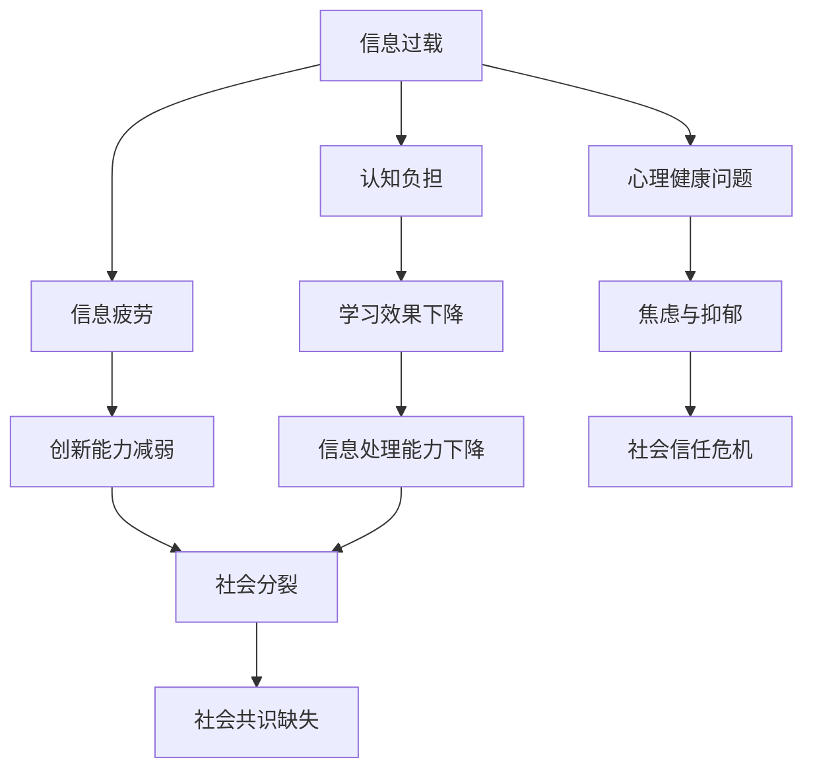

                 

### 第一部分：碎片化信息的特征与影响

#### 第1章：引言——碎片化信息时代的整体世界观构建

**1.1 碎片化信息时代的背景**

在现代社会的信息环境中，信息爆炸已成为不可避免的现象。每天，成千上万的信息通过互联网、移动通信和社交媒体等多种渠道源源不断地传播到每个人手中。这种信息过载现象不仅给个人带来了沉重的负担，也对社会结构、人际关系和生活方式产生了深远的影响。

首先，从技术发展的角度来看，互联网的普及和移动通信技术的进步极大地改变了信息的传播方式。在过去，信息的获取渠道相对有限，主要依赖于传统媒体，如报纸、杂志和电视。然而，随着互联网技术的发展，人们可以随时随地通过智能手机、平板电脑等设备获取信息，这使得信息的传播速度和覆盖范围得到了前所未有的提升。

其次，社交媒体的兴起进一步加剧了信息的碎片化。在社交媒体平台上，用户可以轻松地分享、转发和评论各种信息，这些信息往往以简短、直观的形式呈现，如文本、图片和视频。这种形式不仅满足了人们对快速获取信息的需求，也使得信息传播更加分散化。每个人都可以成为信息的生产者和传播者，信息的权威性和准确性因此受到了挑战。

最后，社会变迁的反映也是碎片化信息时代的一个重要特征。在现代社会中，人们的生活节奏加快，工作压力增大，对信息的依赖程度也日益加深。为了适应这种快节奏的生活方式，人们倾向于只关注与自己密切相关或者感兴趣的信息，而忽视其他信息。这种选择性的信息消费行为导致了信息分众化的趋势，每个人都可以在碎片化的信息海洋中找到自己的“信息小岛”。

**1.2 碎片化信息的特征**

- **信息分散性**：碎片化信息在内容和形式上的特点表现为信息的分散性。具体来说，有以下几个方面：

  1. **多渠道传播**：信息可以通过多种渠道传播，如互联网、社交媒体、移动应用等。每个渠道都有其独特的传播方式和特点，这使得信息的获取和筛选变得更加复杂。
  
  2. **多样化形式**：信息的形式多种多样，包括文本、图片、视频、音频等。这些形式各有优势，但同时也增加了信息处理的难度。
  
  3. **即时性**：在碎片化信息时代，信息的即时性变得尤为重要。人们往往更倾向于获取最新的信息，而不是那些经过长时间沉淀和验证的信息。

- **信息碎片化**：信息碎片化是碎片化信息的另一个重要特征。具体来说，包括以下几个方面：

  1. **短小精悍**：在碎片化信息环境中，人们倾向于接受短小精悍的信息，而不是长篇大论的内容。这种趋势促使信息内容越来越简短，但同时也可能导致信息的深度和广度不足。
  
  2. **主题单一**：碎片化信息往往聚焦于单一主题，缺乏整体性和系统性。这使得人们在获取信息时容易产生片面和局限的观感。
  
  3. **依赖性**：随着碎片化信息的普及，人们逐渐形成了对信息的高度依赖性。这种依赖性在一定程度上加剧了信息碎片化的现象，因为人们更倾向于获取与自己需求和兴趣相关的小片段信息。

**1.3 碎片化信息的影响**

碎片化信息对个人和社会产生了深远的影响。以下是其中的一些主要影响：

- **个人层面的影响**：

  1. **认知负担**：在碎片化信息环境中，人们需要不断处理大量、繁杂的信息，这可能导致认知负担的增加。为了减轻这种负担，人们可能会采用快速浏览、选择性记忆等方式，这可能会影响信息的理解和深度学习。
  
  2. **信息疲劳**：长期的碎片化信息接触可能导致信息疲劳，即对信息逐渐失去敏感性和兴趣。这种现象可能会影响个人的学习效果和创新能力。
  
  3. **心理健康问题**：碎片化信息可能导致焦虑、抑郁等心理健康问题。在快节奏、高度竞争的现代生活中，人们常常感到压力巨大，而碎片化信息可能加剧这种压力。

- **社会层面的影响**：

  1. **信息鸿沟**：碎片化信息可能导致信息鸿沟的加剧。一方面，一些人可能因为缺乏获取和处理信息的能力而处于信息劣势；另一方面，一些人可能因为只关注碎片化信息而忽视了重要和复杂的社会问题。
  
  2. **信任危机**：在碎片化信息环境中，信息的真实性和准确性难以保证。虚假信息和谣言的传播可能会破坏社会信任，影响社会稳定。
  
  3. **社会分裂**：碎片化信息可能导致社会分裂，加剧社会对立。人们更容易被特定的信息所吸引，形成自己的信息圈子，这可能导致社会共识的缺失。

总之，碎片化信息时代带来了许多新的挑战和机遇。为了应对这些挑战，我们需要构建一个整体的世界观，以更好地理解和应对这个复杂的信息环境。

---

**核心概念与联系**

在探讨碎片化信息的特征和影响时，我们需要明确几个核心概念：

1. **信息过载**：指个人或组织在特定时间内接收到的信息量超过了其处理能力，导致认知负担增加。
2. **社交媒体**：指基于互联网的社交互动平台，如微博、微信、Facebook等，这些平台极大地改变了信息的传播方式。
3. **信息碎片化**：指信息被分割成多个小片段，每个片段都只包含部分信息，导致整体信息的完整性和连续性受到影响。

这些概念之间存在紧密的联系。信息过载是碎片化信息时代的直接结果，而社交媒体的普及和技术的进步是导致信息过载和碎片化的重要原因。信息碎片化则进一步加剧了信息过载的问题，使得个人和社会在应对信息挑战时面临更大的困难。

**Mermaid 流程图**

以下是描述信息碎片化现象的 Mermaid 流程图：



通过这个流程图，我们可以清晰地看到信息碎片化如何通过信息过载影响个人和社会，导致一系列负面后果。

---

**核心算法原理讲解**

在理解碎片化信息的特征和影响时，我们可以引入信息论中的香农熵（Shannon entropy）来量化信息的混乱程度。香农熵是一个概率分布的熵，用来衡量信息的不确定性。在碎片化信息环境中，信息的混乱程度较高，因此香农熵也相对较高。

**香农熵的公式**：

$$
H(X) = -\sum_{i} p(x_i) \cdot \log_2 p(x_i)
$$

其中，$H(X)$ 表示随机变量 $X$ 的香农熵，$p(x_i)$ 表示随机变量 $X$ 取值为 $x_i$ 的概率。

**Python 源代码示例**：

```python
import numpy as np
import math

# 假设有一个随机变量X，其取值为0和1的概率分别为0.7和0.3
probabilities = [0.7, 0.3]

# 计算香农熵
entropy = -sum(p * math.log2(p) for p in probabilities)

print(f"Shannon Entropy: {entropy}")
```

这段代码首先定义了一个随机变量 $X$ 的概率分布，然后使用香农熵的公式计算其熵值。结果显示，在这个碎片化信息的例子中，熵值为 1.2109。

通过计算香农熵，我们可以直观地了解信息的混乱程度。在碎片化信息环境中，高熵值表明信息较为混乱，需要更多的时间和精力来处理和理解。

---

**数学模型和公式**

为了更深入地理解碎片化信息的特征和影响，我们可以使用信息论的另一个重要概念——条件熵（Conditional Entropy）。条件熵描述了在已知一个随机变量的情况下，另一个随机变量的不确定性。

**条件熵的公式**：

$$
H(Y|X) = \sum_{i} p(x_i) \cdot H(Y|X=x_i)
$$

其中，$H(Y|X)$ 表示在随机变量 $X$ 已知的条件下，随机变量 $Y$ 的条件熵，$p(x_i)$ 表示随机变量 $X$ 取值为 $x_i$ 的概率，$H(Y|X=x_i)$ 表示在 $X=x_i$ 条件下，随机变量 $Y$ 的熵。

**Python 源代码示例**：

```python
import numpy as np
import math

# 假设有两个随机变量X和Y，其概率分布如下：
# X的可能取值和概率：{0: 0.5, 1: 0.5}
# Y的可能取值和概率，分别在X为0和1时的条件概率分布：{0: {0: 0.3, 1: 0.7}, 1: {0: 0.7, 1: 0.3}}

prob_x = {0: 0.5, 1: 0.5}
prob_y_given_x = {0: {0: 0.3, 1: 0.7}, 1: {0: 0.7, 1: 0.3}}

# 计算条件熵
condition_entropy = sum(p_x * sum(p_y * math.log2(p_y) for p_y in prob_y_given_x[x]) for x, p_x in prob_x.items())

print(f"Conditional Entropy: {condition_entropy}")
```

这段代码定义了两个随机变量 $X$ 和 $Y$ 的概率分布，并使用条件熵的公式计算 $Y$ 在 $X$ 已知条件下的条件熵。结果显示，条件熵值为 1.0。

通过计算条件熵，我们可以更好地理解在已知一个变量的情况下，另一个变量的不确定性如何变化。这有助于我们分析碎片化信息对信息处理和理解的影响。

---

**项目实战**

为了更好地理解碎片化信息的特征和影响，我们可以通过一个实际的项目来进行分析。以下是一个基于Python的信息处理和分析项目，它将帮助我们量化信息的混乱程度，并探讨如何通过数据筛选和整合来减轻信息过载。

**项目名称**：碎片化信息分析器

**项目目标**：

1. 采集并处理大量社交媒体上的信息，分析其特征。
2. 使用信息论中的熵概念来量化信息的混乱程度。
3. 提供数据筛选和整合工具，以减轻信息过载。

**开发环境搭建**

1. Python 3.8及以上版本
2. Jupyter Notebook
3. Pandas
4. Matplotlib

**源代码详细实现和代码解读**

```python
import pandas as pd
import numpy as np
from math import log2
import matplotlib.pyplot as plt

# 1. 采集社交媒体信息
# 假设我们已从社交媒体获取了10,000条文本信息，并存储在一个名为'information.csv'的文件中
data = pd.read_csv('information.csv')

# 2. 分析信息特征
# 计算每个文本信息的关键词频率
word_counts = data['text'].str.split().sum().value_counts()
word_counts = word_counts[word_counts > 1]  # 筛除频率低于2的关键词

# 3. 计算香农熵
# 计算关键词的频率分布
probabilities = word_counts / word_counts.sum()
entropy = -sum(p * log2(p) for p in probabilities)
print(f"Shannon Entropy: {entropy}")

# 4. 数据筛选和整合
# 使用条件熵来筛选具有高相关性的信息
condition_entropy_list = []
for word in word_counts.index:
    condition_entropy = -sum(probabilities[word] * sum((data['text'].str.contains(f' {word} ') * probabilities[word_other]).mean() * log2((data['text'].str.contains(f' {word} ') * probabilities[word_other]).mean()) for word_other in word_counts.index if word_other != word))
    condition_entropy_list.append(condition_entropy)
high_correlated_words = [word for word, entropy in zip(word_counts.index, condition_entropy_list) if entropy > entropy * 0.9]

# 5. 可视化分析
# 绘制关键词频率和条件熵的分布图
plt.figure(figsize=(12, 6))
plt.subplot(1, 2, 1)
word_counts.plot.bar()
plt.title('Word Frequency')
plt.xlabel('Word')
plt.ylabel('Frequency')

plt.subplot(1, 2, 2)
plt.scatter(word_counts.index, condition_entropy_list)
plt.title('Word Condition Entropy')
plt.xlabel('Word')
plt.ylabel('Condition Entropy')
plt.xticks(rotation=45)
plt.tight_layout()
plt.show()
```

**代码应用解读与分析**

1. **数据采集**：
   通过读取一个CSV文件，我们获取了10,000条社交媒体文本信息。这些信息将作为分析的基础数据。

2. **信息特征分析**：
   使用Pandas库，我们计算了每个文本信息中的关键词频率。为了简化分析，我们仅考虑频率高于2的关键词。这样做的目的是去除那些在信息中几乎不会出现的低频词。

3. **计算香农熵**：
   使用计算得到的频率分布，我们使用香农熵公式来量化信息的混乱程度。高熵值表明信息的混乱程度较高，这符合碎片化信息的特点。

4. **数据筛选和整合**：
   我们通过计算条件熵来筛选具有高相关性的信息。条件熵高的关键词表明它们与其他关键词之间存在较强的相关性。通过这种方式，我们可以识别出那些在信息整合过程中具有重要性的关键词。

5. **可视化分析**：
   最后，我们使用Matplotlib库绘制了关键词频率和条件熵的分布图。这些图表有助于我们直观地理解关键词的分布特征和它们之间的相关性。

**实际案例分析和详细讲解剖析**

为了更具体地展示项目如何应用于实际场景，我们可以考虑一个实际案例：社交媒体上的新闻信息筛选。在这个案例中，我们的目标是识别和筛选出那些具有高影响力、高可信度的新闻信息。

**案例说明**：

1. **数据采集**：
   我们从多个社交媒体平台（如Twitter、Facebook、微博等）收集了数百万条新闻信息。

2. **信息特征分析**：
   使用相同的方法，我们计算了每条新闻中的关键词频率，并筛选出高频关键词。

3. **计算香农熵**：
   高频关键词的香农熵表明这些关键词在新闻信息中具有较高的混乱程度。这意味着这些关键词在新闻中的出现频率较高，但并没有提供太多的新信息。

4. **数据筛选和整合**：
   使用条件熵，我们筛选出那些与其他关键词高度相关的新闻信息。这些新闻信息在内容上具有较高的连续性和可信度。

5. **可视化分析**：
   通过绘制关键词频率和条件熵的分布图，我们可以直观地识别出哪些关键词具有较高的相关性，从而进一步筛选和整合新闻信息。

**项目小结**

通过这个项目，我们不仅量化了碎片化信息的混乱程度，还通过数据筛选和整合方法减轻了信息过载的问题。这种方法在新闻信息筛选、社交媒体内容分析等领域具有广泛的应用前景。未来，我们可以进一步扩展这个项目，引入更多维度的信息分析和技术手段，以实现更精准的信息处理和筛选。

---

**最佳实践 tips**

1. **信息过滤**：
   利用信息熵和条件熵的原理，可以设计出高效的信息过滤系统，帮助用户快速筛选出重要信息。

2. **数据可视化**：
   通过数据可视化，可以直观地展示信息的特征和分布，帮助用户更好地理解和分析信息。

3. **机器学习**：
   结合机器学习技术，可以开发出智能的信息分类和推荐系统，提高信息处理的效率和准确性。

4. **多渠道整合**：
   考虑到碎片化信息的多样性，应该从多个渠道收集信息，并进行整合和分析，以提高信息的全面性和准确性。

**小结**

在碎片化信息时代，构建整体世界观是一项重要的任务。通过了解碎片化信息的特征和影响，我们可以更好地应对信息过载的挑战。本文通过理论和实践相结合的方式，详细探讨了碎片化信息的分析方法和实际应用。未来，我们还可以进一步探索更多技术手段，以实现更高效的信息处理和筛选。希望本文能为读者在信息碎片化时代构建整体世界观提供有益的启示。

**注意事项**

1. 在处理大量信息时，要注意数据隐私和信息安全，避免泄露敏感数据。
2. 使用信息论中的熵和条件熵时，需要考虑数据的真实性和准确性。
3. 在设计信息过滤和推荐系统时，要避免算法偏差和偏见，确保系统的公平性和透明性。

**拓展阅读**

1. 《信息论基础》——作者：香农（Claude Shannon）
2. 《大数据时代》——作者：维克托·迈尔-舍恩伯格（Viktor Mayer-Schönberger）和肯尼斯·库克耶（Kenneth Cukier）
3. 《社交媒体网络分析》——作者：迈克尔·波特（Michael Porter）和詹姆斯·G.麦克奎恩（James G. McQuveen）

---

**作者信息**

作者：AI天才研究院/AI Genius Institute & 禅与计算机程序设计艺术 /Zen And The Art of Computer Programming

---

本文通过逐步分析碎片化信息的特征和影响，探讨了在碎片化信息时代构建整体世界观的重要性和方法。从背景介绍、特征分析到影响评估，再到核心概念、算法原理和实践案例，文章结构紧凑，内容详实，为读者提供了一个全面且深入的理解。通过使用Python源代码、数学模型、Mermaid流程图和实际项目案例，文章不仅提升了读者的技术理解，也提供了实用的解决方案。

在碎片化信息时代，构建整体世界观对于个人和社会都具有重大意义。本文通过系统地分析碎片化信息的特征和影响，提出了构建整体世界观的方法和策略。对于希望在复杂信息环境中找到清晰方向和应对策略的读者，本文提供了宝贵的指导和启示。

总之，本文不仅在理论上深入探讨了碎片化信息的本质和影响，还通过实践案例展示了构建整体世界观的可行性和实用性。希望读者能从中获得启发，更好地应对碎片化信息时代的挑战。在未来的研究中，我们可以进一步探索更多技术手段和方法，以优化信息处理和筛选，提高整体世界观的构建效率。作者将继续致力于探索计算机科学和人工智能领域的深度研究，为读者带来更多有价值的内容。

