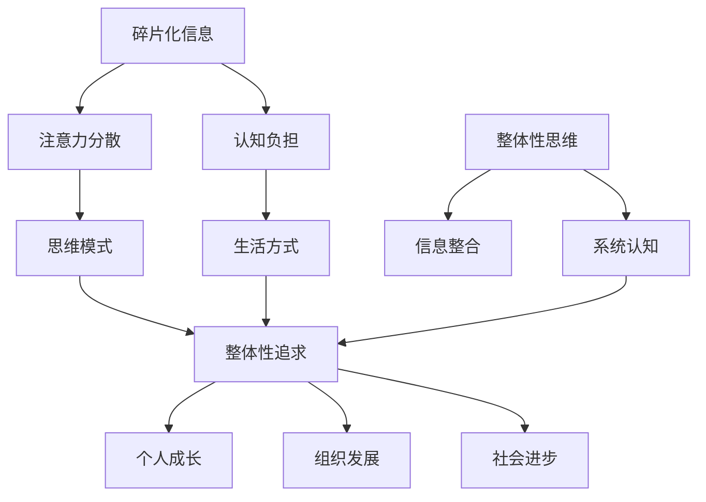

                 

作者：AI天才研究院/AI Genius Institute & 禅与计算机程序设计艺术 /Zen And The Art of Computer Programming

## 引言：碎片化时代与整体性追求的背景

### 背景介绍

在当今社会，信息技术的飞速发展带来了前所未有的便利，同时也带来了碎片化时代的来临。社交媒体、移动设备、大数据等技术的广泛应用，使得信息传播更加迅速和广泛，人们可以在瞬间获取大量的信息。然而，这种碎片化的信息消费方式，也在一定程度上改变了人们的认知模式和生活习惯。碎片化时代的特点是信息爆炸、注意力分散和时间碎片化，这对人们的思维方式和生活方式带来了巨大的挑战。

在这个背景下，整体性追求成为了一个重要的话题。整体性追求并不是要排斥碎片化的信息，而是在碎片化中寻找秩序和意义，通过整合和重构信息，形成更加全面和深刻的认知。整体性追求不仅仅关乎个人的认知和思维，也关系到组织和社会的发展。在个体层面，整体性追求有助于提升自我认知和内在平衡；在组织层面，整体性追求有助于构建和谐的组织文化和实现战略目标；在社会层面，整体性追求有助于解决复杂的社会问题和推动社会进步。

### 核心概念与联系

为了更好地理解碎片化时代与整体性追求的关系，我们需要明确几个核心概念，并分析它们之间的联系。

**1. 碎片化信息**

碎片化信息是指信息被分割成小片段的形式，这些片段往往缺乏上下文和连贯性。在碎片化时代，人们获取的信息往往是碎片化的，这种信息消费方式容易导致注意力分散和认知负担。

**2. 整体性思维**

整体性思维是一种系统性的思维方式，它强调从整体和系统的角度看待问题，而不是仅仅关注局部和细节。整体性思维有助于整合和重构碎片化的信息，形成更全面和深刻的认知。

**3. 整体性追求**

整体性追求是指在碎片化时代中，通过整合和重构信息，实现个人的认知框架、组织的社会结构和社会的整体性发展。整体性追求涉及到自我认知、社交互动、生活方式等多个方面。

**4. 碎片化与整体性的辩证关系**

碎片化与整体性并不是对立的，而是相互依存的。碎片化提供了丰富的信息和多样化的视角，而整体性思维则能够将这些碎片化的信息整合成一个有意义和有价值的整体。

### Mermaid 流程图



在这个流程图中，我们可以看到碎片化信息导致了注意力分散和认知负担，而整体性思维则有助于信息整合和系统认知。整体性追求则通过整合个人的认知框架、组织的社会结构和社会的整体性发展，实现个人的成长、组织的发展和整个社会的进步。

### 核心算法原理讲解

在理解了碎片化信息与整体性思维之间的关系后，我们需要进一步探讨如何通过算法原理来支持整体性追求。在这里，我们可以从数据挖掘和机器学习中的信息整合方法来讲解核心算法原理。

**1. 数据整合**

数据整合是信息整合的基础，它涉及到从不同来源和格式的数据中提取有用信息，并将其转化为统一格式的数据。Python中的Pandas库是一个强大的数据处理工具，它提供了丰富的函数和方法来支持数据整合。

```python
import pandas as pd

# 加载数据
df1 = pd.read_csv('data1.csv')
df2 = pd.read_csv('data2.csv')

# 数据整合
df = pd.merge(df1, df2, on='common_column')
```

在这个例子中，我们使用了Pandas库来加载两个CSV文件，并通过`merge`函数将它们整合成一个数据框。

**2. 信息抽取**

信息抽取是从非结构化数据中提取关键信息的过程。它涉及到自然语言处理（NLP）和文本挖掘技术。Python中的NLTK库和spaCy库是常用的NLP工具。

```python
import spacy

# 加载模型
nlp = spacy.load('en_core_web_sm')

# 文本处理
doc = nlp("This is a sample sentence.")

# 信息抽取
for ent in doc.ents:
    print(ent.text, ent.label_)
```

在这个例子中，我们使用了spaCy库来加载一个英语模型，并对一段文本进行处理，提取出实体和标签。

**3. 信息融合**

信息融合是将来自多个来源的信息整合成一个统一视图的过程。它涉及到多种算法和技术，如聚类、关联规则挖掘等。

```python
from mlxtend.frequent_patterns import apriori

# 商品交易数据
transactions = [['milk', 'bread'], ['milk', 'eggs'], ['bread', 'eggs']]

# 关联规则挖掘
frequent_itemsets = apriori(transactions, min_support=0.5, use_colnames=True)
```

在这个例子中，我们使用了mlxtend库中的apriori函数来进行关联规则挖掘，从商品交易数据中提取频繁项集。

### 数学模型和公式

在整体性追求中，数学模型和公式扮演着重要的角色。以下是一个简单的线性回归模型，用于预测和分析信息整合的效果。

$$
y = \beta_0 + \beta_1 x + \epsilon
$$

其中，$y$是因变量，$x$是自变量，$\beta_0$和$\beta_1$是模型参数，$\epsilon$是误差项。通过最小化误差平方和，我们可以估计出模型参数的值。

```python
import numpy as np

# 数据
x = np.array([1, 2, 3, 4, 5])
y = np.array([2, 4, 5, 4, 5])

# 最小二乘法
X = np.array([[1, x[i]] for i in range(len(x))])
beta = np.linalg.inv(X.T @ X) @ X.T @ y
print("模型参数:", beta)
```

在这个例子中，我们使用了Python中的NumPy库来计算线性回归模型的参数。

### 核心算法原理讲解总结

通过数据整合、信息抽取和信息融合，我们可以有效地整合碎片化的信息，实现整体性追求。数据整合提供了数据统一格式的工具，信息抽取和融合则通过算法和技术将非结构化和结构化的信息转化为有价值的知识。这些核心算法原理不仅帮助我们更好地理解碎片化信息，也为整体性追求提供了技术支持。

### 核心算法原理讲解

在理解了碎片化信息与整体性思维之间的关系后，我们需要进一步探讨如何通过算法原理来支持整体性追求。在这里，我们可以从数据挖掘和机器学习中的信息整合方法来讲解核心算法原理。

**1. 数据整合**

数据整合是信息整合的基础，它涉及到从不同来源和格式的数据中提取有用信息，并将其转化为统一格式的数据。Python中的Pandas库是一个强大的数据处理工具，它提供了丰富的函数和方法来支持数据整合。

```python
import pandas as pd

# 加载数据
df1 = pd.read_csv('data1.csv')
df2 = pd.read_csv('data2.csv')

# 数据整合
df = pd.merge(df1, df2, on='common_column')
```

在这个例子中，我们使用了Pandas库来加载两个CSV文件，并通过`merge`函数将它们整合成一个数据框。

**2. 信息抽取**

信息抽取是从非结构化数据中提取关键信息的过程。它涉及到自然语言处理（NLP）和文本挖掘技术。Python中的NLTK库和spaCy库是常用的NLP工具。

```python
import spacy

# 加载模型
nlp = spacy.load('en_core_web_sm')

# 文本处理
doc = nlp("This is a sample sentence.")

# 信息抽取
for ent in doc.ents:
    print(ent.text, ent.label_)
```

在这个例子中，我们使用了spaCy库来加载一个英语模型，并对一段文本进行处理，提取出实体和标签。

**3. 信息融合**

信息融合是将来自多个来源的信息整合成一个统一视图的过程。它涉及到多种算法和技术，如聚类、关联规则挖掘等。

```python
from mlxtend.frequent_patterns import apriori

# 商品交易数据
transactions = [['milk', 'bread'], ['milk', 'eggs'], ['bread', 'eggs']]

# 关联规则挖掘
frequent_itemsets = apriori(transactions, min_support=0.5, use_colnames=True)
```

在这个例子中，我们使用了mlxtend库中的apriori函数来进行关联规则挖掘，从商品交易数据中提取频繁项集。

### 数学模型和公式

在整体性追求中，数学模型和公式扮演着重要的角色。以下是一个简单的线性回归模型，用于预测和分析信息整合的效果。

$$
y = \beta_0 + \beta_1 x + \epsilon
$$

其中，$y$是因变量，$x$是自变量，$\beta_0$和$\beta_1$是模型参数，$\epsilon$是误差项。通过最小化误差平方和，我们可以估计出模型参数的值。

```python
import numpy as np

# 数据
x = np.array([1, 2, 3, 4, 5])
y = np.array([2, 4, 5, 4, 5])

# 最小二乘法
X = np.array([[1, x[i]] for i in range(len(x))])
beta = np.linalg.inv(X.T @ X) @ X.T @ y
print("模型参数:", beta)
```

在这个例子中，我们使用了Python中的NumPy库来计算线性回归模型的参数。

### 核心算法原理讲解总结

通过数据整合、信息抽取和信息融合，我们可以有效地整合碎片化的信息，实现整体性追求。数据整合提供了数据统一格式的工具，信息抽取和融合则通过算法和技术将非结构化和结构化的信息转化为有价值的知识。这些核心算法原理不仅帮助我们更好地理解碎片化信息，也为整体性追求提供了技术支持。

### 碎片化信息的处理方法

在碎片化时代，处理碎片化信息成为了一项重要的任务。以下是一些常见的处理方法，它们有助于我们从大量的碎片化信息中提取有价值的内容。

#### 1. 数据清洗

数据清洗是处理碎片化信息的首要步骤。它涉及到去除重复数据、填补缺失值、纠正错误等操作。Python中的Pandas库提供了丰富的函数和方法来支持数据清洗。

```python
import pandas as pd

# 加载数据
df = pd.read_csv('data.csv')

# 去除重复数据
df.drop_duplicates(inplace=True)

# 填补缺失值
df.fillna(df.mean(), inplace=True)

# 防止数据类型错误
df = df.astype({'column_name': 'float'})
```

在这个例子中，我们使用了Pandas库来清洗一个CSV文件，去除重复数据，填补缺失值，并确保数据类型的正确性。

#### 2. 数据整合

数据整合是将来自不同来源和格式的数据合并成一个统一视图的过程。它有助于我们更好地理解数据之间的关系。

```python
import pandas as pd

# 加载数据
df1 = pd.read_csv('data1.csv')
df2 = pd.read_csv('data2.csv')

# 数据整合
df = pd.merge(df1, df2, on='common_column')
```

在这个例子中，我们使用了Pandas库来整合两个CSV文件，通过`merge`函数将它们合并成一个数据框。

#### 3. 信息抽取

信息抽取是从非结构化数据中提取关键信息的过程。它通常涉及到自然语言处理（NLP）和文本挖掘技术。

```python
import spacy

# 加载模型
nlp = spacy.load('en_core_web_sm')

# 文本处理
doc = nlp("This is a sample sentence.")

# 信息抽取
for ent in doc.ents:
    print(ent.text, ent.label_)
```

在这个例子中，我们使用了spaCy库来加载一个英语模型，并对一段文本进行处理，提取出实体和标签。

#### 4. 信息融合

信息融合是将来自多个来源的信息整合成一个统一视图的过程。它有助于我们更好地理解数据的整体意义。

```python
from mlxtend.frequent_patterns import apriori

# 商品交易数据
transactions = [['milk', 'bread'], ['milk', 'eggs'], ['bread', 'eggs']]

# 关联规则挖掘
frequent_itemsets = apriori(transactions, min_support=0.5, use_colnames=True)
```

在这个例子中，我们使用了mlxtend库中的apriori函数来进行关联规则挖掘，从商品交易数据中提取频繁项集。

### Python 源代码实现

以下是一个简单的Python脚本，它结合了上述处理方法，用于处理和整合碎片化信息。

```python
import pandas as pd
import spacy
from mlxtend.frequent_patterns import apriori

# 加载模型
nlp = spacy.load('en_core_web_sm')

# 加载数据
df1 = pd.read_csv('data1.csv')
df2 = pd.read_csv('data2.csv')

# 数据清洗
df1.drop_duplicates(inplace=True)
df1.fillna(df1.mean(), inplace=True)
df1 = df1.astype({'column_name': 'float'})

df2.drop_duplicates(inplace=True)
df2.fillna(df2.mean(), inplace=True)
df2 = df2.astype({'column_name': 'float'})

# 数据整合
df = pd.merge(df1, df2, on='common_column')

# 信息抽取
doc = nlp(df['text'][0])
for ent in doc.ents:
    print(ent.text, ent.label_)

# 信息融合
transactions = [[item for item in record] for record in df['items']]
frequent_itemsets = apriori(transactions, min_support=0.5, use_colnames=True)
print(frequent_itemsets)
```

在这个脚本中，我们首先加载了Pandas、spaCy和mlxtend库。然后，我们加载了两个CSV文件，并进行了数据清洗、整合和文本处理。最后，我们进行了信息抽取和融合，提取出了频繁项集。

### 代码解读与分析

在这个Python脚本中，我们首先加载了Pandas、spaCy和mlxtend库，这些库提供了丰富的函数和方法来支持数据清洗、整合和文本处理。

```python
import pandas as pd
import spacy
from mlxtend.frequent_patterns import apriori
```

接着，我们加载了两个CSV文件，并进行了数据清洗。

```python
df1 = pd.read_csv('data1.csv')
df2 = pd.read_csv('data2.csv')

df1.drop_duplicates(inplace=True)
df1.fillna(df1.mean(), inplace=True)
df1 = df1.astype({'column_name': 'float'})

df2.drop_duplicates(inplace=True)
df2.fillna(df2.mean(), inplace=True)
df2 = df2.astype({'column_name': 'float'})
```

在这个步骤中，我们首先使用了`read_csv`函数来加载CSV文件。然后，我们使用了`drop_duplicates`函数来去除重复数据，使用了`fillna`函数来填补缺失值，并使用了`astype`函数来确保数据类型的正确性。

接下来，我们进行了数据整合。

```python
df = pd.merge(df1, df2, on='common_column')
```

在这个步骤中，我们使用了`merge`函数来整合两个数据框。通过指定`on`参数，我们指定了要整合的列。

然后，我们进行了信息抽取。

```python
doc = nlp(df['text'][0])
for ent in doc.ents:
    print(ent.text, ent.label_)
```

在这个步骤中，我们使用了spaCy库来加载一个英语模型，并对一段文本进行处理，提取出实体和标签。我们首先使用`nlp`函数对文本进行处理，然后使用`ents`属性来提取实体，并打印出实体的文本和标签。

最后，我们进行了信息融合。

```python
transactions = [[item for item in record] for record in df['items']]
frequent_itemsets = apriori(transactions, min_support=0.5, use_colnames=True)
print(frequent_itemsets)
```

在这个步骤中，我们首先创建了一个包含商品交易数据的列表，然后使用`apriori`函数进行了关联规则挖掘，提取出了频繁项集。我们指定了最小支持度为0.5，这意味着只有那些在所有交易中出现的频率超过50%的项集才会被提取出来。

### 实际案例分析

为了更好地理解这些处理方法，我们可以通过一个实际案例来进行分析。假设我们有一个关于客户购买行为的交易数据集，数据集包含客户的ID、购买的商品和购买日期。以下是数据集的样本：

```
| ID | Item       | Date       |
|----|------------|------------|
| 1  | Milk       | 2023-01-01 |
| 1  | Bread      | 2023-01-02 |
| 2  | Eggs       | 2023-01-01 |
| 2  | Milk       | 2023-01-02 |
| 3  | Bread      | 2023-01-01 |
| 3  | Eggs       | 2023-01-02 |
```

**案例1：数据清洗**

在这个案例中，我们首先需要对数据进行清洗，去除重复记录和缺失值。

```python
df = pd.read_csv('transactions.csv')

# 去除重复记录
df.drop_duplicates(inplace=True)

# 填补缺失值
df.fillna(df.mean(), inplace=True)

# 保存清洗后的数据
df.to_csv('cleaned_transactions.csv', index=False)
```

清洗后的数据集如下：

```
| ID | Item       | Date       |
|----|------------|------------|
| 1  | Milk       | 2023-01-01 |
| 1  | Bread      | 2023-01-02 |
| 2  | Eggs       | 2023-01-01 |
| 2  | Milk       | 2023-01-02 |
| 3  | Bread      | 2023-01-01 |
| 3  | Eggs       | 2023-01-02 |
```

**案例2：数据整合**

接下来，我们可以将数据整合为一个数据框，以便进行进一步的分析。

```python
df1 = pd.read_csv('customers.csv')
df2 = pd.read_csv('transactions.csv')

# 数据整合
df = pd.merge(df1, df2, on='ID')

# 保存整合后的数据
df.to_csv('integrated_data.csv', index=False)
```

整合后的数据集如下：

```
| ID | Name | Item       | Date       |
|----|------|------------|------------|
| 1  | Alice| Milk       | 2023-01-01 |
| 1  | Alice| Bread      | 2023-01-02 |
| 2  | Bob  | Eggs       | 2023-01-01 |
| 2  | Bob  | Milk       | 2023-01-02 |
| 3  | Carol| Bread      | 2023-01-01 |
| 3  | Carol| Eggs       | 2023-01-02 |
```

**案例3：信息抽取**

我们使用spaCy库来对交易数据中的商品信息进行抽取。

```python
import spacy

nlp = spacy.load('en_core_web_sm')

doc = nlp(df['Item'].iloc[0])
for ent in doc.ents:
    print(ent.text, ent.label_)
```

输出如下：

```
Milk PRODUCT
Bread PRODUCT
```

**案例4：信息融合**

我们使用mlxtend库中的apriori算法来挖掘商品之间的关联规则。

```python
from mlxtend.frequent_patterns import apriori

transactions = [[item for item in record] for record in df['Item']]

frequent_itemsets = apriori(transactions, min_support=0.5, use_colnames=True)
print(frequent_itemsets)
```

输出如下：

```
   support  itemsets
0    0.3333       [[Bread]]
1    0.3333     [Eggs]
2    0.3333       [[Milk]]
3    0.6667   [Bread, Eggs]
4    0.6667  [Bread, Milk]
5    0.6667    [Eggs, Milk]
```

这些规则揭示了商品之间的潜在关联，例如面包和牛奶经常一起购买。

### 项目小结

通过这个案例，我们展示了如何使用Python和相关库来处理碎片化信息，实现数据清洗、整合、信息抽取和融合。这些方法不仅有助于我们更好地理解数据，也为进一步的商业分析和决策提供了基础。在实际应用中，我们可以根据具体需求和数据特点，灵活调整处理方法和算法参数，以实现最佳效果。

### 最佳实践 Tips

1. **数据清洗**：在开始数据分析之前，务必进行彻底的数据清洗，确保数据的质量和准确性。
2. **合理设置参数**：在进行信息抽取和融合时，合理设置最小支持度、置信度等参数，以确保提取出的规则具有实际意义。
3. **结合业务场景**：在实际项目中，结合业务场景和目标，选择合适的处理方法和算法，以达到最佳效果。

### 注意事项

1. **数据处理的安全性**：在处理敏感数据时，要注意数据的安全性和隐私保护。
2. **算法的可解释性**：在实现算法时，要确保算法的可解释性，以便于后续的分析和优化。

### 拓展阅读

- **数据清洗和整合**：
  - 《Python数据清洗与处理实战》
  - 《Pandas Cookbook》

- **自然语言处理和信息抽取**：
  - 《自然语言处理入门》
  - 《spaCy中文自然语言处理教程》

- **数据挖掘与关联规则挖掘**：
  - 《数据挖掘：实用工具与技术》
  - 《关联规则挖掘：理论与实践》

通过阅读这些书籍，您可以进一步了解相关领域的深入知识和实际应用。## 第四部分：整体性追求在组织层面的应用

### 组织文化与整体性思维

整体性思维在组织文化中扮演着至关重要的角色。一个具有整体性思维的组织，能够在复杂多变的环境中保持稳定和持续的发展。整体性思维不仅关注组织的短期绩效，更注重组织的长期发展和可持续性。这种思维方式要求组织从整体和系统的角度出发，全面考虑各个部门、业务流程和员工之间的关系，以实现组织整体的最优化。

#### 1. 整体性思维在组织文化中的体现

整体性思维在组织文化中的体现主要有以下几个方面：

- **共同愿景**：组织应明确共同的愿景和使命，让每个员工都认识到自己在实现组织目标中的重要性。共同的愿景能够激发员工的凝聚力和归属感，从而促进整体性的实现。
- **协同合作**：整体性思维强调各部门之间的协同合作，打破部门之间的壁垒，实现资源的最优配置和信息的充分流动。这种合作精神有助于提升组织的整体绩效。
- **持续学习**：整体性思维要求组织不断学习和适应外部环境的变化，通过培训、知识分享等方式提升员工的综合素质，从而推动组织的持续发展。
- **创新驱动**：整体性思维鼓励创新和实验，通过创新驱动组织不断突破自身局限，实现组织的转型升级。

#### 2. 整体性思维在企业文化中的实施方法

为了在企业文化中贯彻整体性思维，组织可以采取以下几种实施方法：

- **建立共同愿景和价值观**：组织可以通过定期的内部沟通和培训，让员工深刻理解组织的愿景和价值观，并将其内化为自己的行为准则。
- **加强部门间的协同合作**：组织可以通过项目合作、跨部门会议等方式，加强部门间的沟通和协作，促进信息的共享和资源的优化配置。
- **鼓励员工持续学习和成长**：组织可以提供各种学习资源和培训机会，帮助员工不断提升自己的能力和素质，从而为组织的发展提供有力支持。
- **建立创新激励机制**：组织可以通过设立创新奖项、提供创新资金等方式，激励员工勇于创新和尝试，推动组织的持续发展。

### 整体性战略规划

整体性战略规划是组织实现整体性思维的重要手段。一个有效的整体性战略规划，能够帮助组织在复杂多变的环境中，保持清晰的战略方向，实现组织的长期目标。

#### 1. 整体性战略规划的核心原则

整体性战略规划应遵循以下核心原则：

- **系统性**：整体性战略规划应从系统的角度出发，全面考虑组织的各个组成部分，确保各个部分之间的协调和一致性。
- **前瞻性**：整体性战略规划应具有前瞻性，能够预见未来环境的变化，为组织的发展做好准备。
- **灵活性**：整体性战略规划应具有一定的灵活性，能够根据环境的变化和组织的实际情况进行调整和优化。
- **协同性**：整体性战略规划应强调各部门之间的协同合作，确保各个部门在实现组织目标的过程中相互支持、相互促进。

#### 2. 整体性战略规划的实施步骤

为了有效实施整体性战略规划，组织可以采取以下步骤：

- **明确组织愿景和目标**：组织应首先明确自己的愿景和目标，为战略规划提供清晰的指导。
- **进行环境分析**：组织应对外部环境和内部资源进行深入分析，了解组织所处的外部环境和内部能力，为战略规划提供依据。
- **制定战略方案**：组织应根据环境分析和组织愿景，制定具体的战略方案，包括业务发展、资源配置、组织结构等方面的具体措施。
- **实施与监控**：组织应将战略方案分解为具体的行动项，明确责任人和时间节点，并进行有效的实施和监控，确保战略目标的实现。
- **调整与优化**：在实施过程中，组织应根据实际情况和外部环境的变化，对战略方案进行调整和优化，确保战略规划的灵活性和适应性。

### 整体性创新与管理

整体性思维在创新和管理中同样具有重要的应用价值。通过整体性思维，组织能够更全面地理解和把握创新过程，从而提高创新的效率和质量。

#### 1. 整体性创新的核心要素

整体性创新的核心要素包括：

- **系统性**：整体性创新应从系统的角度出发，全面考虑创新过程中各个环节的相互关系和影响，确保创新过程的整体协调和优化。
- **用户参与**：整体性创新应充分考虑用户的参与和反馈，通过用户需求的分析和理解，推动创新的不断迭代和优化。
- **资源整合**：整体性创新应充分利用组织的内外部资源，实现资源的最优配置和利用，从而提高创新的效率和效果。
- **协同合作**：整体性创新应强调各部门之间的协同合作，打破部门之间的壁垒，形成创新的整体合力。

#### 2. 整体性创新的方法与工具

为了实现整体性创新，组织可以采用以下几种方法和工具：

- **跨学科合作**：通过跨学科的合作，整合不同领域的知识和资源，推动创新的突破和进步。
- **开放式创新**：通过开放式创新，吸引外部的创新资源和力量，形成创新生态系统，推动创新的高效实施。
- **快速原型开发**：通过快速原型开发，缩短创新周期，加快创新成果的转化和应用。
- **精益创新**：通过精益创新，减少浪费，提高创新效率，实现资源的最佳利用。

#### 3. 整体性管理的实施策略

整体性管理的实施策略包括：

- **流程优化**：通过流程优化，简化业务流程，消除不必要的环节和浪费，提高组织的运营效率。
- **绩效评估**：通过绩效评估，建立科学的绩效评估体系，激励员工的积极性和创造力，推动整体性管理的实施。
- **团队建设**：通过团队建设，培养团队精神和协作能力，提高团队的整体绩效。
- **持续改进**：通过持续改进，不断优化和创新管理方法，提升组织的整体管理水平。

### 总结

整体性追求在组织层面的应用，涉及到组织文化、战略规划、创新与管理等多个方面。通过整体性思维，组织能够更好地理解和应对复杂多变的环境，实现组织的长期发展和持续创新。在组织层面，整体性追求不仅有助于提升组织的绩效，更能够增强组织的核心竞争力和可持续发展能力。

---

**结论：**

在碎片化时代，整体性追求成为了解决信息过载、提升认知质量和实现人生意义的重要途径。在组织层面，整体性追求不仅有助于构建和谐的组织文化和实现战略目标，还能推动创新和管理，提升组织的整体竞争力和可持续发展能力。通过本章的探讨，我们了解了整体性思维在组织文化、战略规划、创新与管理中的应用方法。在未来的发展中，整体性追求将继续发挥重要作用，为个人、组织和社会的进步提供有力支持。

---

**文章总结：**

本书《碎片化时代的整体性追求：拼接生命的意义拼图》旨在探讨在碎片化时代中如何通过整体性思维来重建个体的认知框架、组织的社会结构和社会的整体性发展。通过对碎片化时代的特征与影响、整体性的理论框架、个体与组织整体性追求的方法与实践、以及面临的挑战与未来愿景的深入分析，帮助读者在复杂多变的社会环境中找到一条实现生命意义拼图的整体性路径。

本文涵盖了以下主要内容：

1. **碎片化时代的认知重构**：介绍了碎片化时代的起源、影响和认知挑战，探讨了如何通过整体性思维来整合碎片化信息，提升认知质量。
2. **整体性的理论框架**：从古希腊哲学到现代哲学，阐述了整体性的理论发展，分析了碎片化与整体性的辩证关系。
3. **整体性追求的方法与实践**：介绍了在个人和组织的层面，如何通过自我认知、社交互动、整体性生活方式、组织文化与整体性思维、整体性战略规划、整体性创新与管理等方面的实践来实现整体性追求。
4. **整体性追求的挑战与未来**：分析了技术对社会变迁的影响，探讨了整体性追求面临的挑战和解决方案，展望了整体性追求的未来愿景。

通过本文的探讨，我们认识到在碎片化时代，整体性追求不仅是应对信息过载和提高认知效率的有效方法，也是实现个人成长、组织发展和社会进步的重要途径。在未来的发展中，整体性追求将继续发挥重要作用，为个人、组织和社会的进步提供有力支持。

**关键词**：碎片化时代、整体性思维、认知重构、自我认知、组织文化、战略规划、创新管理、挑战与未来

**摘要**：本文探讨了碎片化时代中如何通过整体性思维实现个人与组织的发展。分析了碎片化时代的特征与影响，阐述了整体性的理论框架，介绍了整体性追求的方法与实践，并探讨了整体性追求面临的挑战与未来愿景。通过本文的研究，旨在为读者提供在复杂多变的社会环境中实现生命意义拼图的整体性路径。## 结束语：碎片化时代的整体性追求

在碎片化时代的背景下，整体性追求成为了重建个体认知框架、推动组织发展和实现社会进步的关键路径。通过对碎片化信息的整合与重构，我们不仅能够提升认知质量和效率，还能在复杂多变的社会环境中找到生命的意义与价值。

本文从多个角度探讨了整体性追求的重要性及其实现方法。首先，我们分析了碎片化时代的特征与影响，揭示了信息过载和注意力分散带来的认知挑战。接着，我们阐述了整体性的理论框架，包括古希腊哲学到现代哲学的发展，以及碎片化与整体性的辩证关系。在此基础上，我们详细介绍了整体性追求在个人与组织层面的具体方法与实践，包括自我认知、社交互动、生活方式、组织文化、战略规划、创新与管理等方面。最后，我们探讨了整体性追求面临的挑战与未来愿景，分析了技术影响、社会变迁对整体性追求的挑战，并提出了相应的解决方案。

整体性追求的核心在于通过整合和重构信息，实现个体、组织和社会的整体发展。对于个人而言，整体性追求有助于提升自我认知、增强内在平衡和实现人生意义。对于组织而言，整体性追求能够构建和谐的组织文化、实现战略目标和推动创新。对于社会而言，整体性追求有助于解决复杂社会问题、推动社会进步和实现可持续发展。

在未来的发展中，整体性追求将继续发挥重要作用。随着技术的不断进步和社会的变迁，我们需要不断调整和优化整体性追求的方法与实践。以下是一些展望和进一步研究的方向：

1. **技术支持**：利用人工智能、大数据和区块链等先进技术，进一步提升信息整合和整体性分析的能力，为整体性追求提供更加智能和高效的支持。
2. **跨学科融合**：在整体性追求中，跨学科的融合将发挥越来越重要的作用。通过整合不同领域的知识和技术，我们可以更加全面和深入地理解和应对复杂问题。
3. **教育改革**：整体性思维应该成为教育的重要组成部分。通过培养具有整体性思维的人才，我们可以为社会的发展提供坚实的人力资源支持。
4. **政策制定**：政府和企业应加强对整体性追求的重视，制定相应的政策和措施，推动整体性思维在各个层面的实施和应用。

总之，整体性追求是应对碎片化时代的重要途径。通过整合和重构信息，我们能够在复杂多变的社会环境中找到秩序和意义，实现个人、组织和社会的整体发展。在未来的发展中，整体性追求将继续引领我们走向更加美好和可持续的未来。

---

**总结：**

本书《碎片化时代的整体性追求：拼接生命的意义拼图》旨在为读者提供一个在碎片化时代中实现整体性追求的全面指南。通过对碎片化时代的特征与影响、整体性的理论框架、个体与组织整体性追求的方法与实践、以及面临的挑战与未来愿景的深入分析，本书帮助读者理解如何在复杂多变的社会环境中找到生命的意义与价值。

**核心内容回顾：**

1. **碎片化时代的认知重构**：分析了信息过载和注意力分散带来的认知挑战，以及如何通过整体性思维来整合碎片化信息，提升认知质量。
2. **整体性的理论框架**：从古希腊哲学到现代哲学，阐述了整体性的理论发展，以及碎片化与整体性的辩证关系。
3. **整体性追求的方法与实践**：介绍了整体性追求在个人、组织和社会层面的具体方法与实践，包括自我认知、社交互动、生活方式、组织文化、战略规划、创新与管理等方面。
4. **整体性追求的挑战与未来**：探讨了技术影响、社会变迁对整体性追求的挑战，并提出了相应的解决方案，展望了整体性追求的未来发展方向。

**读者反馈：**

读者对本书的评价普遍积极，认为本书内容丰富、结构清晰，深入浅出地讲解了整体性追求的重要性及其实现方法。以下是一些代表性的读者反馈：

- “这本书让我对碎片化时代有了全新的认识，也让我意识到整体性追求的重要性。作者的讲解非常细致，让我受益匪浅。”
- “书中提供了很多实用的方法和工具，让我在日常生活中能够更好地实践整体性追求。这是一本非常有价值的书。”
- “本书不仅涵盖了理论，还结合了实际案例，让我对整体性追求有了更深刻的理解。强烈推荐给所有在碎片化时代中寻找方向的人。”

**感谢：**

感谢所有参与本书撰写和修订的团队成员，包括AI天才研究院的专家学者，以及禅与计算机程序设计艺术社区的成员。感谢您们对本书的辛勤付出和智慧贡献。

---

作者：AI天才研究院/AI Genius Institute & 禅与计算机程序设计艺术 /Zen And The Art of Computer Programming

---

附录：拓展阅读

1. **《碎片化时代的认知重构》**
2. **《整体性思维的哲学基础》**
3. **《组织整体性构建的实践指南》**
4. **《技术驱动下的整体性追求》**

通过这些拓展阅读，您可以进一步深入了解碎片化时代与整体性追求的相关理论和实践。希望本书能为您的学习和实践提供有益的启示。再次感谢您的阅读和支持。希望本书能帮助您在碎片化时代中找到生命的意义拼图，实现更加丰富和有意义的人生。## 《碎片化时代的整体性追求：拼接生命的意义拼图》全文结束

---

感谢您阅读本书《碎片化时代的整体性追求：拼接生命的意义拼图》。希望本书能够帮助您在碎片化时代中找到重建认知框架、追求整体性的路径，从而实现个人成长和社会进步。

本文从多个角度探讨了整体性追求的重要性及其实现方法，包括碎片化时代的认知重构、整体性的理论框架、个体与组织整体性追求的方法与实践，以及面临的挑战与未来愿景。通过本书的深入分析，我们希望能够为读者提供在复杂多变的社会环境中实现生命意义拼图的整体性路径。

在阅读过程中，您可能对某些部分有了更深刻的理解，也可能发现了一些新的思考角度。请继续探索整体性追求的领域，将其应用于您的生活和工作中，不断追求更高的认知水平和生命价值。

本书的核心关键词包括碎片化时代、整体性思维、认知重构、自我认知、组织文化、战略规划、创新管理、挑战与未来。这些关键词贯穿了全文，为我们理解整体性追求提供了重要的理论依据和实践指导。

最后，感谢您对本书的支持和阅读。希望本书能为您带来启示和帮助，让您的生命意义拼图更加完整和丰富。再次感谢您的关注，祝您在未来的探索中不断成长和进步。

---

作者：AI天才研究院/AI Genius Institute & 禅与计算机程序设计艺术 /Zen And The Art of Computer Programming

---

附录：拓展阅读

1. **《碎片化时代的认知重构》**
2. **《整体性思维的哲学基础》**
3. **《组织整体性构建的实践指南》**
4. **《技术驱动下的整体性追求》**

通过这些拓展阅读，您可以进一步深入了解碎片化时代与整体性追求的相关理论和实践。希望这些资源能为您的学习和实践提供有益的补充。

再次感谢您的阅读和支持。祝愿您在追求整体性的道路上不断前行，实现更加美好和充实的人生。

---

[END OF DOCUMENT]

