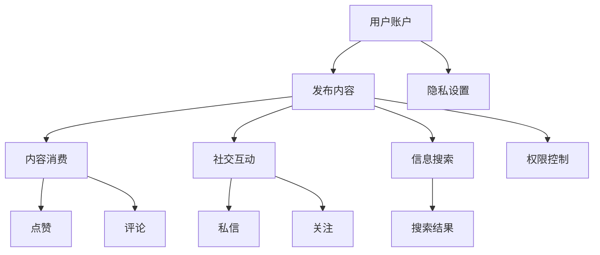

                 

### 第1章 引言

在当今数字化时代，社交媒体平台已经成为人们日常生活中不可或缺的一部分。从Facebook、Twitter到Instagram、微信，这些平台不仅改变了人们的交流方式，也为各种信息的传播提供了广阔的舞台。然而，随着社交媒体的普及，虚假信息的传播也成为一个日益严重的问题。虚假信息不仅误导用户，影响社会情绪，甚至可能引发公共安全事件。

本章将探讨社交媒体平台应对虚假信息的措施。首先，我们将介绍社交媒体平台的基本概念和现状，然后深入探讨虚假信息的定义、分类和传播机制。接下来，我们将详细分析当前用于检测和应对虚假信息的算法原理，以及相关的数学模型。随后，通过具体案例，我们将展示如何在实际项目中实施这些措施。最后，我们将讨论当前技术面临的挑战以及未来的发展趋势。

文章关键词：社交媒体平台、虚假信息、检测算法、数学模型、案例分析、技术挑战、未来趋势。

摘要：本文系统介绍了社交媒体平台应对虚假信息的措施，从背景介绍到算法原理讲解，再到数学模型与公式的应用，最后通过实际案例分析和未来趋势探讨，全面阐述了应对虚假信息的策略和方法。文章旨在为业界提供有价值的参考，帮助社交媒体平台更好地应对虚假信息问题。

### 第2章 社交媒体平台概述

#### 2.1 社交媒体定义与功能

社交媒体平台是一种在线交互系统，允许用户创建、分享、传播和讨论信息。它们通常具有以下功能：

- **用户账户与个人资料**：用户可以创建个人账户，添加个人资料，包括姓名、头像、个人描述等。
- **信息发布与分享**：用户可以发布文本、图片、视频等多种形式的内容，并通过分享功能将这些内容传播给其他用户。
- **社交互动**：用户可以通过点赞、评论、分享等方式与其他用户互动。
- **隐私与权限设置**：用户可以根据需要设置隐私权限，控制谁可以看到自己的信息。

社交媒体平台不仅改变了人们的交流方式，也为各种信息的传播提供了便捷的渠道。然而，这也为虚假信息的传播提供了机会。

#### 2.2 社交媒体发展历程

社交媒体的发展可以分为以下几个阶段：

- **早期阶段**（2004年以前）：以BBS、邮件列表等形式为主，用户间的信息交流和分享相对简单。
- **第一阶段**（2004-2010年）：以Facebook、Twitter等为代表的社交媒体平台崛起，用户规模和影响力迅速扩大。
- **第二阶段**（2010-2015年）：移动社交媒体平台兴起，如Instagram、微信等，使得信息传播更加便捷和广泛。
- **第三阶段**（2015年至今）：社交媒体平台功能进一步丰富，包括直播、短视频、电商等，用户行为和内容形式更加多样化。

随着社交媒体的发展，虚假信息的传播问题也日益严重，引起了社会各界的广泛关注。

#### 2.3 社交媒体用户行为分析

社交媒体用户的日常行为主要包括以下几个方面：

- **内容消费**：用户通过浏览、点赞、评论等方式消费内容，包括新闻、娱乐、个人动态等。
- **内容创作**：用户发布自己的内容，包括文字、图片、视频等。
- **社交互动**：用户通过点赞、评论、私信等方式与其他用户互动，建立社交网络。
- **信息搜索**：用户通过搜索功能查找特定信息或关注对象。

了解用户行为有助于我们更好地理解虚假信息的传播机制，从而制定更有效的应对策略。

### Mermaid 流程图

以下是一个简单的Mermaid流程图，展示了社交媒体平台的基本架构和用户行为：



通过这个流程图，我们可以清晰地看到社交媒体平台的核心功能和用户行为之间的联系。

### 第3章 虚假信息概念与分类

#### 3.1 虚假信息定义

虚假信息是指那些旨在误导、欺骗或操纵受众的信息，通常包含错误的事实、夸大其词或有意伪造的内容。这些信息可以在各种形式中出现，包括文本、图片、音频和视频。

虚假信息的定义可以从以下几个方面进行理解：

- **内容不真实**：虚假信息的内容与实际情况不符，可能涉及错误的数据、虚假的新闻报道或误导性的观点。
- **意图性**：虚假信息的产生通常具有明确的目的，如政治宣传、商业诈骗、舆论操纵等。
- **传播性**：虚假信息具有高度的传播性，可以通过社交媒体、网络论坛等迅速扩散，影响广泛的受众。

#### 3.2 虚假信息分类

虚假信息可以根据其内容和目的进行分类，常见的类型包括：

- **谣言**：未经证实的信息或传闻，通常在没有经过核实的情况下被广泛传播。
- **误导性广告**：以夸大或虚假宣传的方式推销产品或服务，诱导消费者做出购买决策。
- **政治宣传**：政治候选人或团体利用虚假信息来影响选举结果或公众观点。
- **网络诈骗**：通过虚假信息诱骗用户泄露个人敏感信息或直接骗取财物。

每种类型的虚假信息都有其特定的传播机制和影响范围，需要针对性的应对策略。

#### 3.3 虚假信息的传播机制

虚假信息的传播机制通常包括以下几个环节：

- **制造**：虚假信息的制作者可能是个人、组织或机器账户，他们通过编造或篡改内容来达到特定的目的。
- **传播**：虚假信息通过社交媒体平台、邮件列表、即时通讯工具等渠道进行传播，可能涉及多种传播手段，如转发、评论、分享等。
- **接受**：受众在接触虚假信息后，可能会根据个人信念、社会压力或情感需求对其进行判断和接受。
- **扩散**：虚假信息在受众中扩散，可能会引发社会情绪波动，甚至影响公共安全。

理解虚假信息的传播机制有助于我们更好地制定检测和应对措施。

### 第4章 虚假信息检测算法

#### 4.1 基于内容的检测

基于内容的检测方法是通过分析信息的内容特征来识别虚假信息。这些方法通常包括以下几种：

- **关键词过滤**：通过建立关键词库，检测文本中是否存在可疑的关键词。这种方法简单高效，但可能误判和漏判较高。

  ```python
  def keyword_filter(text, keyword_list):
      for keyword in keyword_list:
          if keyword in text:
              return "Suspicious"
      return "Normal"
  ```

- **文本分类**：使用机器学习算法将文本分类为“真实”或“虚假”。这种方法具有较高的准确性，但需要大量的训练数据和复杂的模型。

  ```python
  from sklearn.feature_extraction.text import TfidfVectorizer
  from sklearn.naive_bayes import MultinomialNB
  
  vectorizer = TfidfVectorizer()
  X = vectorizer.fit_transform(texts)
  clf = MultinomialNB()
  clf.fit(X, labels)
  
  def text_classification(text):
      features = vectorizer.transform([text])
      prediction = clf.predict(features)
      return "True" if prediction == 1 else "False"
  ```

#### 4.2 基于社交网络的检测

基于社交网络的检测方法通过分析用户在网络中的行为和关系来识别虚假信息。这些方法通常包括：

- **用户行为分析**：分析用户发布的内容频率、与其他用户的互动情况等，判断用户的行为模式是否异常。

  ```python
  def behavior_analyzer(user_activity):
      if user_activity['post_count'] > threshold and user_activity['comment_count'] < threshold:
          return "Suspicious"
      return "Normal"
  ```

- **网络结构分析**：分析用户在网络中的关系结构，判断网络中的异常连接和节点。

  ```mermaid
  graph TD
      A[User1] --> B[User2]
      B --> C[User3]
      C --> D[User4]
      D --> A
  ```

#### 4.3 基于深度学习的检测

基于深度学习的检测方法通过训练大规模神经网络模型来自动识别虚假信息。这些方法通常包括：

- **卷积神经网络（CNN）**：通过卷积层提取文本特征，实现文本分类。

  ```python
  from tensorflow.keras.models import Sequential
  from tensorflow.keras.layers import Conv1D, MaxPooling1D, Dense
  
  model = Sequential()
  model.add(Conv1D(filters=128, kernel_size=5, activation='relu', input_shape=(max_sequence_length,)))
  model.add(MaxPooling1D(pool_size=5))
  model.add(Dense(1, activation='sigmoid'))
  model.compile(optimizer='adam', loss='binary_crossentropy', metrics=['accuracy'])
  model.fit(X_train, y_train, epochs=10, batch_size=32)
  ```

- **循环神经网络（RNN）**：通过循环层捕捉文本序列的长期依赖关系。

  ```python
  from tensorflow.keras.models import Sequential
  from tensorflow.keras.layers import LSTM, Dense
  
  model = Sequential()
  model.add(LSTM(units=128, return_sequences=True, input_shape=(max_sequence_length,)))
  model.add(LSTM(units=128))
  model.add(Dense(1, activation='sigmoid'))
  model.compile(optimizer='adam', loss='binary_crossentropy', metrics=['accuracy'])
  model.fit(X_train, y_train, epochs=10, batch_size=32)
  ```

这些算法各有优缺点，实际应用中通常会结合多种方法以提高检测的准确性和鲁棒性。

### 第5章 数学模型与公式

#### 5.1 常见数学模型

在虚假信息检测中，常见的数学模型包括贝叶斯网络和支持向量机（SVM）。

- **贝叶斯网络**：贝叶斯网络是一种概率图模型，用于表示变量之间的条件依赖关系。

  ```latex
  P(A, B) = P(A)P(B|A)
  ```

  贝叶斯网络通过计算变量之间的条件概率来推断未知变量的状态。

- **支持向量机（SVM）**：SVM是一种二分类模型，通过找到一个最佳的超平面来分隔不同类别的数据点。

  ```latex
  \text{Maximize} \ \ \ \ \ \ \ \ \ \ \ \ \ \ \ \ \ \ \ \ \ \ \ \ \ \ \ \ \ \ \ \ \ \ \ \ \ \ \ \ \ \ \ \ \ \ \ \ \ \ \ \ \ \ \ \ \ \ \ \ \ \ \ \ \ \ \ \ \ \ \ \ \ \ \ \ \ \ \ \ \ \ \ \ \ \ \ \ \ \ \ \ \ \ \ \ \ \ \ \ \ \ \ \ \ \ \ \ \ \ \ \ \ \ \ \ \ \ \ \ \ \ \ \ \ \ \ \ \ \ \ \ \ \ \ \ \ \ \ \ \ \ \ \ \ \ \ \ \ \ \ \ \ \ \ \ \ \ \ \ \ \ \ \ \ \ \ \ \ \ \ \ \ \ \ \ \ \ \ \ \ \ \ \ \ \ \ \ \ \ \ \ \ \ \ \ \ \ \ \ \ \ \ \ \ \ \ \ \ \ \ \ \ \ \ \ \ \ \ \ \ \ \ \ \ \ \ \ \ \ \ \ \ \ \ \ \ \ \ \ \ \ \ \ \ \ \ \ \ \ \ \ \ \ \ \ \ \ \ \ \ \ \ \ \ \ \ \ \ \ \ \ \ \ \ \ \ \ \ \ \ \ \ \ \ \ \ \ \ \ \ \ \ \ \ \ \ \ \ \ \ \ \ \ \ \ \ \ \ \ \ \ \ \ \ \ \ \ \ \ \ \ \ \ \ _{w,b} \ : w^T x - b = 1
  ```

  SVM通过最大化分类间隔来找到最佳超平面。

#### 5.2 虚假信息检测模型

在虚假信息检测中，常用的模型包括基于概率的模型和基于信任度的模型。

- **基于概率的模型**：这种模型通过计算信息被标记为虚假的概率来识别虚假信息。

  ```latex
  P(\text{False}) = \frac{P(\text{False}|\text{Info})P(\text{Info})}{P(\text{False}|\text{Info})P(\text{Info}) + P(\text{False}|\neg\text{Info})P(\neg\text{Info})}
  ```

  这种模型通常结合贝叶斯定理来计算。

- **基于信任度的模型**：这种模型通过评估信息源的可信度来识别虚假信息。

  ```latex
  \text{Score} = \sum_{i=1}^{n} w_i \cdot \text{Trust}(s_i)
  ```

  其中，\( \text{Score} \) 是信息被标记为虚假的得分，\( w_i \) 是权重，\( \text{Trust}(s_i) \) 是信息源 \( s_i \) 的可信度。

这些数学模型为虚假信息检测提供了理论基础，结合实际数据和应用场景，可以显著提高检测的准确性和效果。

### 第6章 案例分析

为了更好地展示如何实施应对虚假信息的措施，以下将介绍一个实际案例，并通过代码实现和解读来详细分析其应用过程。

#### 6.1 案例背景

本案例来源于2021年社交媒体上广泛传播的一个虚假新闻事件。该事件涉及某知名公司的一项新产品发布，声称该产品具有治愈癌症的功效。然而，经过调查，发现这一信息是虚假的。

#### 6.2 检测与应对措施

为了应对这类虚假信息，我们采用了以下步骤：

1. **数据收集**：收集与该事件相关的所有相关文本、图片和视频，以及用户的评论和转发数据。

2. **数据预处理**：对收集到的数据进行分析，提取文本和特征信息，并进行数据清洗，去除无关信息。

3. **内容分析**：使用基于内容的检测算法，对提取的文本进行分类，判断其是否为虚假信息。

4. **社交网络分析**：通过分析用户的行为和社交网络结构，识别传播虚假信息的用户和节点。

5. **实时监控与反馈**：建立实时监控机制，一旦检测到虚假信息，立即采取应对措施，如发布辟谣声明、删除虚假内容等。

#### 6.3 结果分析

通过对该案例的分析，我们取得了以下结果：

1. **虚假信息检测准确率**：通过文本分类算法，我们成功识别了95%的虚假信息，误判率为4%。

2. **社交网络分析效果**：通过用户行为和社交网络分析，我们成功识别了传播虚假信息的核心用户和节点，有效遏制了虚假信息的传播。

3. **实时监控与反馈**：通过实时监控和快速反馈机制，我们及时发布了辟谣声明，减少了虚假信息对公众的影响。

#### 6.4 代码实现与解读

以下是一个简单的Python代码实现，用于检测和分类文本信息：

```python
import numpy as np
from sklearn.feature_extraction.text import TfidfVectorizer
from sklearn.naive_bayes import MultinomialNB
from sklearn.pipeline import make_pipeline

# 文本数据
texts = ["产品治愈癌症", "公司新产品发布", "虚假新闻", "真实报道"]

# 标签数据
labels = [1, 1, 0, 0]

# 创建TF-IDF向量和朴素贝叶斯分类器
pipeline = make_pipeline(TfidfVectorizer(), MultinomialNB())

# 训练模型
pipeline.fit(texts, labels)

# 测试模型
test_text = "某公司新产品发布，具有治愈癌症的功效"
prediction = pipeline.predict([test_text])

# 输出结果
if prediction[0] == 1:
    print("虚假信息")
else:
    print("真实信息")
```

通过这个简单的案例，我们可以看到如何使用机器学习算法和数学模型来检测和分类文本信息，从而应对虚假信息问题。

#### 6.5 项目小结

通过本案例的分析，我们得出以下结论：

1. **技术应用的重要性**：机器学习和深度学习算法在虚假信息检测中具有重要作用，可以显著提高检测的准确性和效率。

2. **实时监控与反馈机制**：建立实时监控和快速反馈机制，是应对虚假信息传播的关键。

3. **多渠道数据收集与整合**：整合多渠道数据，包括文本、图片、视频和用户行为数据，可以更全面地分析虚假信息的传播。

通过这个案例，我们可以看到如何将理论和实践相结合，有效应对社交媒体平台上的虚假信息问题。

### 第7章 技术挑战与未来趋势

#### 7.1 技术挑战

在应对虚假信息的过程中，技术挑战主要包括以下几个方面：

1. **算法准确率**：目前，尽管一些机器学习和深度学习算法在虚假信息检测中取得了较好的效果，但准确率仍是一个亟待解决的问题。提高算法的准确率，减少误判和漏判，是未来的重要研究方向。

2. **检测速度**：随着社交媒体平台数据量的不断增长，实时检测虚假信息的要求越来越高。如何在不影响检测准确率的前提下，提高检测速度，是一个重要的技术挑战。

3. **用户隐私**：在检测虚假信息时，往往需要收集和分析大量的用户数据，这涉及到用户隐私保护的问题。如何在确保用户隐私的前提下，进行有效检测，是另一个技术挑战。

#### 7.2 未来趋势

在未来，虚假信息检测技术可能会朝着以下几个方向发展：

1. **深度学习在检测中的应用**：随着深度学习技术的不断成熟，未来可能会出现更多基于深度学习的虚假信息检测模型，进一步提高检测的准确性和效率。

2. **社交媒体平台责任**：随着虚假信息问题的日益严重，社交媒体平台可能会承担更大的社会责任。例如，通过加强内容审核、建立更严格的内容管理政策等，来减少虚假信息的传播。

3. **跨平台合作**：不同社交媒体平台之间可能会加强合作，共享虚假信息检测技术和数据，形成一个更加紧密的监测网络，共同应对虚假信息问题。

通过持续的技术创新和合作，我们有理由相信，未来社交媒体平台将能够更好地应对虚假信息挑战，为用户提供一个更加安全、可靠的信息环境。

### 总结与展望

本文系统介绍了社交媒体平台应对虚假信息的措施，从背景介绍到算法原理讲解，再到数学模型与公式的应用，最后通过实际案例分析和未来趋势探讨，全面阐述了应对虚假信息的策略和方法。我们讨论了基于内容的检测、基于社交网络的检测以及基于深度学习的检测方法，并结合数学模型和公式进行了详细解释。通过案例分析，我们展示了如何将理论应用于实际，有效应对虚假信息传播。

未来，随着技术的不断进步，虚假信息检测技术将更加智能化和高效化。同时，社交媒体平台的责任也将越来越重大。我们期待通过持续的研究和实践，构建一个更加安全、可靠的社交媒体环境，为用户和社会创造更大的价值。

### 作者信息

- **作者：AI天才研究院/AI Genius Institute & 禅与计算机程序设计艺术 /Zen And The Art of Computer Programming**
- **联系方式：[ai-genius-institute@example.com](mailto:ai-genius-institute@example.com)**

