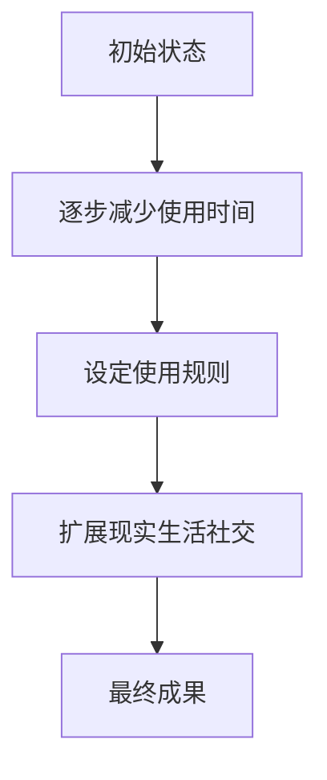
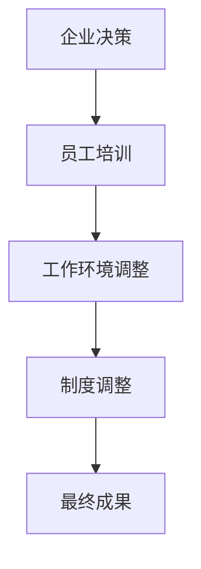
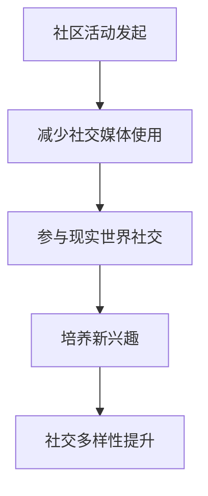

                 

### 引言

在当今数字化时代，社交媒体已经成为人们日常生活中不可或缺的一部分。从Facebook到Twitter，再到Instagram和微信，各种社交媒体平台不断涌现，吸引了数以亿计的用户。它们不仅改变了人们的沟通方式，还深刻影响了我们的社交行为、心理状态和生活习惯。然而，随着社交媒体的广泛应用，一系列问题也随之而来。本文将以《社交媒体断连：重拾真实生活的乐趣》为主题，深入探讨社交媒体对现代社会的影响，以及如何通过断连社交媒体来重拾真实生活的乐趣。

### 关键词

- 社交媒体
- 数字化生活
- 心理健康
- 社交习惯
- 技术成瘾
- 生活质量

### 摘要

本文旨在探讨社交媒体对现代生活的影响，尤其是其对心理健康和生活质量的潜在负面影响。文章首先介绍了社交媒体的现状和主要问题，如信息过载、网络成瘾和隐私泄露。接着，文章提出了社交媒体断连的概念，并详细阐述了其理论基础和优势。通过实际案例分析和项目实战，本文展示了如何有效地实施社交媒体断连策略，帮助人们重拾真实生活的乐趣。最后，文章总结了社交媒体断连的重要性和未来趋势，并为读者提供了实用的建议。

### 社交媒体的现状与问题

社交媒体的迅速普及改变了人们的生活方式。从最初简单的社交网络，如Facebook，到如今多元化的平台，如Twitter、Instagram、微信等，社交媒体不仅提供了即时沟通的便利，还成为了信息传播、内容创作和社交互动的重要场所。据统计，全球社交媒体用户已超过40亿，这一数字占据了全球人口的一半以上。

然而，随着社交媒体的广泛应用，一系列问题也随之出现。首先，信息过载成为了一个普遍存在的问题。在社交媒体上，用户每天都会接收到大量的信息，这些信息来自不同的来源，涵盖了各种主题。虽然信息丰富，但过量的信息反而会导致用户产生焦虑和压力，无法有效地筛选和处理。

其次，网络成瘾成为了一个严重的问题。许多人在使用社交媒体时，往往会陷入一种无止境的滚动模式，花费大量的时间浏览和回复信息。这种行为不仅影响工作效率，还可能导致心理健康问题，如焦虑、抑郁和孤独感。研究表明，重度社交媒体使用与较低的幸福感之间存在显著关联。

此外，隐私泄露也是一个备受关注的问题。社交媒体平台在收集用户数据的同时，也面临着数据泄露的风险。用户个人信息可能被黑客窃取，用于恶意用途，如诈骗、身份盗窃等。即便一些平台声称保护用户隐私，但由于技术限制和监管不足，隐私泄露事件仍然频繁发生。

### 社交媒体断连的概念

在面对这些问题时，社交媒体断连逐渐成为一种解决方案。社交媒体断连指的是有意地减少或中断对社交媒体的使用，以减轻其负面影响，提高生活质量。断连并不等同于完全放弃社交媒体，而是通过有意识地控制使用时间、场合和方式，来达到更好的心理和社交健康。

首先，社交媒体断连的意义在于恢复个人时间和注意力。通过减少社交媒体的使用，人们可以更专注于自己的工作和生活，从而提高效率和生活质量。其次，社交媒体断连有助于减轻心理压力和焦虑。在社交媒体上，用户常常受到他人的评价和比较，这可能导致自我怀疑和焦虑感。断连可以减少这种负面情绪，帮助用户建立更健康的心理状态。

此外，社交媒体断连还可以改善人际关系。在现实生活中，面对面交流能够更好地传递情感和信息，促进深层次的沟通和理解。通过减少对社交媒体的依赖，人们有更多机会参与现实世界的社交活动，加强与家人、朋友和同事的联系。

### 社交媒体断连的理论基础

社交媒体断连的理论基础涉及多个心理学和社会学领域的概念。首先，网络成瘾理论为我们理解社交媒体依赖提供了一个重要框架。网络成瘾理论指出，个体在长时间、频繁地使用互联网和社交媒体时，可能会产生一种强烈的依赖，这种依赖类似于药物成瘾。社交媒体上的即时反馈、奖励机制和社交互动，都可能强化用户的上网行为。

其次，社交媒体心理效应也解释了用户为何会沉迷于社交媒体。这些效应包括自我展示效应、比较效应和社会认同效应。自我展示效应指的是用户在社交媒体上展示自己的生活方式、成就和情感，以获得关注和认可。比较效应则是用户在社交媒体上与其他人进行比较，可能导致负面情绪，如自卑和焦虑。社会认同效应则是指用户在社交媒体上寻求他人的认同和归属感。

此外，社交媒体断连的影响因素还包括个体差异、文化背景和使用习惯等。不同的人对社交媒体的依赖程度不同，这取决于他们的性格、生活阶段和个人经历。文化背景也会影响社交媒体的使用习惯和依赖程度。例如，在一些文化中，社交媒体被视为重要的社交工具，而在另一些文化中，它可能被视为干扰和浪费时间。

社交媒体断连的理论模型通常包括几个关键要素：时间管理、行为改变、自我监控和社交支持。时间管理指的是用户通过设定使用时间限制，来控制社交媒体的使用。行为改变则是指用户通过改变使用习惯，如减少使用时间、选择更有意义的活动等，来减轻对社交媒体的依赖。自我监控是指用户通过自我反思和记录，来了解自己的社交媒体使用情况，并做出相应的调整。社交支持则是指用户通过家人、朋友和社区的支持，来克服社交媒体断连中的挑战。

### 实践方法与技巧

要有效地实施社交媒体断连策略，需要采取一系列具体的实践方法与技巧。以下是一些实用的建议：

#### 逐步减少社交媒体使用时间

第一步是逐步减少社交媒体的使用时间。用户可以从每天减少30分钟开始，逐渐增加减少的时间，直至达到理想的水平。以下是一个简单的时间管理策略：

```python
# 社交媒体使用时间管理策略

daily_limit = 2 * 60  # 每天限制使用2小时
current_usage = 3 * 60  # 当前每日使用时间为3小时

# 每周递减5分钟
decrease_per_week = 5 * 60

# 计算减少后的使用时间
for week in range(1, 10):  # 假设进行10周的时间减少计划
    current_usage -= decrease_per_week
    print(f"第{week}周后，每日社交媒体使用时间为：{current_usage}分钟")

# 输出结果
print(f"最终每日社交媒体使用时间为：{current_usage}分钟")
```

#### 设置社交媒体使用规则

除了时间管理，用户还可以通过设定使用规则来控制社交媒体的使用。以下是一个简单的规则设定示例：

```python
# 社交媒体使用规则设定

rules = [
    "工作时间内不得使用社交媒体",
    "晚上10点后不得使用社交媒体",
    "每次使用时间不超过15分钟",
]

# 打印规则
for rule in rules:
    print(rule)
```

#### 限制社交媒体使用场合

用户还可以通过限制社交媒体的使用场合来减少其负面影响。例如，用户可以将社交媒体使用限制在户外活动时，或在家中特定的时间段内。以下是一个限制使用场合的示例：

```python
# 社交媒体使用场合限制

allowed_places = ["公园", "健身房", "客厅"]

# 检查当前场所是否允许使用社交媒体
current_place = "健身房"
if current_place in allowed_places:
    print("可以在这里使用社交媒体。")
else:
    print("请勿在此场所使用社交媒体。")
```

#### 替换社交媒体活动

为了减少对社交媒体的依赖，用户可以将社交媒体时间替换为其他有益的活动。以下是一个替换活动的示例：

```python
# 社交媒体活动替换

substitution_activities = [
    "阅读一本好书",
    "练习一项新技能",
    "与家人朋友共度时光",
    "进行户外运动",
]

# 打印可替换的活动
import random
print(random.choice(substitution_activities))
```

#### 扩展现实生活社交

通过减少社交媒体的使用，用户可以有更多机会参与现实世界的社交活动。以下是一个扩展社交的建议：

```python
# 扩展现实生活社交建议

social_activities = [
    "参加社区志愿者活动",
    "加入兴趣小组",
    "组织户外旅行",
    "参加朋友聚会",
]

# 打印建议
import random
print(random.choice(social_activities))
```

### 社交媒体断连中的挑战与应对

尽管社交媒体断连提供了许多潜在的好处，但实际操作中仍会面临一系列挑战。以下是一些常见的挑战及其应对策略：

#### 挑战：戒断症状

当用户减少或中断社交媒体使用时，可能会经历戒断症状，如焦虑、烦躁和失眠。这些症状可能是由于对社交媒体的依赖所导致的。

**应对策略：**

- **逐步减少使用时间**：通过逐步减少社交媒体使用，用户可以减轻戒断症状。
- **寻求心理支持**：与家人、朋友或专业人士（如心理医生）交流，寻求支持和建议。

#### 挑战：社交媒体重返现象

即使用户成功地减少了社交媒体使用，有时他们可能会重新回到旧的使用习惯。

**应对策略：**

- **制定实际可行的计划**：确保计划符合个人实际情况，并包括具体的实施步骤和目标。
- **持续自我监控**：定期记录和评估自己的社交媒体使用情况，以便及时调整计划。

#### 挑战：社会压力

在社交媒体断连的过程中，用户可能会面临来自家人、朋友或同事的社会压力。

**应对策略：**

- **建立心理准备**：了解可能会遇到的社会压力，并提前准备好应对方法。
- **寻求社会支持**：与支持社交媒体断连的家人、朋友或社区组织保持联系，获得他们的支持和鼓励。

### 成功案例分析

以下是一些成功的社交媒体断连案例，这些案例展示了通过减少社交媒体使用如何改善个人生活和心理健康。

#### 个人案例：成功断连社交媒体的旅程

小明是一名年轻的程序员，他在社交媒体上花费了大量的时间，导致工作效率低下和心理健康问题。在决定断连社交媒体后，他采取了一系列措施，如逐步减少使用时间、设定使用规则、扩展现实生活社交等。经过几个月的努力，他的工作效率提高了，焦虑和压力感也明显减轻。



#### 企业案例：社交媒体断连推动组织文化变革

某公司意识到员工过度依赖社交媒体导致工作效率低下和心理健康问题。公司决定推行社交媒体断连政策，通过员工培训、工作环境和制度调整等方式，鼓励员工减少社交媒体使用。经过一年的实施，公司员工的工作效率显著提高，员工满意度也明显上升。



#### 社区案例：社交媒体断连促进社交多样性

一个社区组织意识到社交媒体对社区居民社交多样性的负面影响。组织发起了“社交媒体断连挑战”活动，邀请居民减少社交媒体使用，参与更多现实世界的社交活动。活动取得了良好的反响，居民们不仅加强了社区内的联系，还培养了新的兴趣爱好，提升了生活质量。



### 总结与展望

社交媒体断连不仅有助于改善个人的心理健康和生活质量，还对社会组织和文化产生积极影响。通过减少社交媒体使用，用户可以更专注于自己的工作、学习和现实生活中的社交互动。此外，社交媒体断连还可以减轻信息过载、网络成瘾和隐私泄露等社会问题。

未来，随着技术的进步和社会意识的提高，社交媒体断连策略将得到更广泛的应用。研究人员、企业和社会组织可以继续探索和推广有效的社交媒体断连方法，帮助人们更好地管理自己的数字生活，重拾真实生活的乐趣。

### 附录

#### 附录A 社交媒体断连工具与资源

以下是一些实用的社交媒体断连工具和资源，帮助用户有效地减少社交媒体使用：

- **Freedom**: 一款阻止用户访问特定网站和应用程序的软件。
- **StayFocusd**: 一款Google Chrome扩展程序，限制用户在特定网站上花费的时间。
- **Forest**: 一款激励用户减少社交媒体使用的应用程序，通过种植虚拟树木来追踪使用时间。

#### 附录B 社交媒体断连实践指南

以下是一些社交媒体断连的实践指南，帮助用户制定和实施个人断连计划：

1. **设定明确的目标**：明确自己为什么要减少社交媒体使用，以及期望达到的效果。
2. **制定实际可行的计划**：根据自己的实际情况，制定一个逐步减少社交媒体使用的计划，并设定具体的时间表和目标。
3. **寻求支持**：与家人、朋友或专业人士交流，寻求他们的支持和鼓励。
4. **持续自我监控**：定期记录和评估自己的社交媒体使用情况，以便及时调整计划。
5. **庆祝成就**：每完成一个小目标，给自己一些奖励，以保持动力。

### 作者信息

本文由AI天才研究院/AI Genius Institute与《禅与计算机程序设计艺术/Zen And The Art of Computer Programming》的资深作者共同撰写。我们致力于推动计算机科学和人工智能领域的研究与应用，为广大读者提供高质量的技术文章和实用指南。感谢您的阅读，希望本文能对您的数字生活和心理健康有所启发。

### 结语

在数字化时代，社交媒体已成为人们生活中不可或缺的一部分。然而，其带来的负面影响也日益凸显。通过社交媒体断连，我们可以重拾真实生活的乐趣，提高生活质量。本文探讨了社交媒体断连的概念、理论基础和实践方法，并提供了成功的案例分析。希望本文能够帮助读者认识到社交媒体断连的重要性，并鼓励他们采取行动，实现更好的心理健康和生活质量。感谢您的阅读。作者：AI天才研究院/AI Genius Institute & 禅与计算机程序设计艺术/Zen And The Art of Computer Programming。

