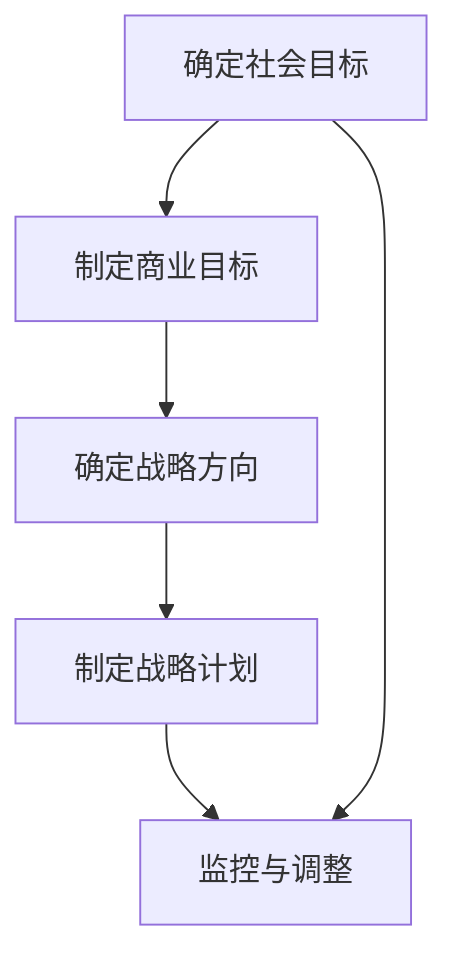

                 

### 概念与起源

**社会企业的定义与核心特征**

社会企业，是指那些在经营过程中既追求经济利益，又注重实现社会目标的企业实体。它们与传统企业最大的区别在于，社会企业在实现商业盈利的同时，还强调对社会和环境产生积极的影响。社会企业的定义虽然多样，但基本特征可以归纳为以下几点：首先，社会企业具有明确的社会使命，这通常是解决某个社会问题或提高社会福利。其次，社会企业在运作过程中，注重社会效益的衡量，而不仅仅是财务收益。最后，社会企业通常具有一种独特的治理结构，确保其社会目标得以实现。

**社会企业的起源与发展历程**

社会企业这一概念最早可以追溯到19世纪末20世纪初的欧洲。当时，许多社会活动家和慈善家开始探索将商业手段应用于社会问题的解决。例如，英国的社会改革家约翰·罗素（John Ruskin）和约瑟夫·斯蒂芬斯（Joseph Sturge）创立了“圭亚那殖民公司”（Guiana Trading & Land Company），这是一家旨在为圭亚那地区提供可持续发展的社会企业。随着时间的推移，社会企业的概念逐渐成熟，尤其是在20世纪末和21世纪初，随着全球化和可持续发展理念的兴起，社会企业得到了广泛的发展和认可。

**传统企业与不同点**

传统企业主要关注的是利润的最大化，而社会企业则更加注重社会效益的实现。传统企业在决策过程中，往往以经济指标为核心，而社会企业在考虑盈利的同时，更注重社会责任和环境影响。此外，传统企业可能追求规模扩张和市场占有率，而社会企业则更注重实现社会目标和社会效益的持久性。

**核心概念与联系**

为了更好地理解社会企业的核心概念，我们首先需要明确几个关键术语：

- **社会目标（Social Mission）**：指社会企业所追求的社会使命或解决的问题。例如，提供低收入家庭的住房、改善环境保护等。
- **商业目标（Business Objectives）**：指社会企业通过经营活动所追求的经济利益，如销售收入、市场占有率等。
- **平衡（Balance）**：指社会企业在追求社会目标和商业目标之间找到的平衡点。

这些核心概念之间的关系可以用Mermaid流程图来表示：


**社会影响力评估**

社会影响力评估（Social Impact Assessment）是社会企业的重要工具，它用于衡量企业在实现其社会目标方面的效果。这种评估通常包括以下几个方面：

- **定量评估**：使用具体的指标和数据来衡量社会企业对社会和环境的影响，如减少的碳排放量、提高的生活质量等。
- **定性评估**：通过访谈、调查和观察等方法，了解社会企业对受影响群体的实际影响。

**法律框架与监管环境**

社会企业的法律框架和监管环境因国家和地区而异。许多国家为了鼓励社会企业的发展，专门制定了相关的法律法规，如社会企业法案、社会责任法等。这些法律通常规定了社会企业的资格条件、运营要求、税收优惠等。

在中国，社会企业的发展也受到了国家政策的大力支持。近年来，中国政府发布了多个文件，鼓励企业承担社会责任，推动社会企业的快速发展。例如，《国务院关于鼓励社会力量兴办教育若干意见》和《国务院关于促进慈善事业健康发展的意见》等政策文件，为社会企业提供了重要的政策支持和法律保障。

**核心概念与联系 Mermaid 流程图**

以下是社会企业核心概念之间的关系架构 Mermaid 流程图：


**总结**

社会企业作为一种新型的企业形式，既追求商业盈利，又注重社会效益。通过明确的社会目标、有效的社会影响力评估和独特的法律框架，社会企业能够更好地实现其社会使命。在下一部分中，我们将进一步探讨社会企业的商业模式创新和战略规划。这将为读者提供更深入的理解，帮助大家更好地把握社会企业的本质和运作机制。

### 商业模式创新与战略规划

**社会企业的商业模式创新**

社会企业的商业模式创新是其实现社会目标与商业目标平衡的重要手段。与传统企业相比，社会企业需要在盈利和社会效益之间找到一个最佳的平衡点。以下是一些社会企业在商业模式创新方面的关键原则和方法：

**1. 多元化收入模式**

社会企业可以通过多元化收入模式来确保稳定的财务来源。例如，除了传统的销售收入，社会企业还可以通过政府资助、捐款、服务外包等多种方式获得收入。这种多元化的收入模式不仅能够降低财务风险，还可以为社会企业提供更稳定的运营保障。

**2. 社会投资回报率（SROI）**

社会投资回报率是一种衡量社会企业投资效益的重要指标。它通过计算企业实现社会目标所带来的社会价值与其成本之间的比率，来评估企业的社会影响力。例如，一家致力于提供教育资源的公司，可以通过计算其教育成果（如提高学生的考试成绩）与投入成本之间的比率，来衡量其社会投资回报率。

**3. 合作伙伴关系**

社会企业可以通过建立合作伙伴关系，扩大其社会影响力。合作伙伴可以是政府机构、非政府组织、企业或其他社会企业。通过合作，社会企业可以共享资源、技术和市场，从而更有效地实现其社会目标。

**4. 社会企业联盟**

社会企业联盟是由多个社会企业组成的协作网络，旨在共同推动社会进步。这种联盟可以通过资源共享、联合行动和共同推广等方式，实现更大的社会效益。例如，多个社会企业可以联合开展一项环保项目，共同解决某一地区的水污染问题。

**核心概念与联系**

为了更好地理解社会企业商业模式创新的原则和方法，我们可以用Mermaid流程图来表示它们之间的关系：

```mermaid
graph TD
A[多元化收入模式] --> B[社会投资回报率(SROI)]
A --> C[合作伙伴关系]
C --> D[社会企业联盟]
B --> D
```

**社会企业战略规划与实施**

战略规划是社会企业实现长期目标的关键步骤。有效的战略规划不仅能够明确企业的方向，还能够为企业的运营提供明确的指导。以下是一些社会企业在战略规划方面的重要原则和步骤：

**1. 确定社会目标**

社会企业首先需要明确其社会目标，这通常是解决某个具体的社会问题或提高某个特定群体的生活质量。例如，一家致力于消除贫困的社会企业可能会将其社会目标定为提高低收入家庭的收入水平。

**2. 制定商业目标**

在明确社会目标之后，社会企业需要制定相应的商业目标，以确保其社会目标的实现。商业目标可以包括提高销售收入、扩大市场份额、降低运营成本等。

**3. 确定战略方向**

社会企业需要根据其社会目标和商业目标，确定其战略方向。战略方向可以是长期的市场拓展、技术升级、品牌建设等。

**4. 制定战略计划**

战略计划是战略方向的细化，包括具体的行动方案、时间表和资源分配。社会企业需要制定详细的战略计划，以确保其战略方向的实现。

**5. 监控与调整**

战略规划不是一成不变的，社会企业需要定期监控其战略执行情况，并根据实际情况进行调整。这种监控和调整可以通过定期的绩效评估、市场调研和反馈机制来实现。

**核心概念与联系**

以下是社会企业战略规划的重要核心概念及其关系的 Mermaid 流程图：



**社会企业如何创造价值**

社会企业通过以下几种方式创造价值：

- **经济价值**：通过经营活动实现盈利，为社会提供就业机会，促进经济发展。
- **社会价值**：通过解决社会问题或提高社会福利，实现其社会目标，如减少贫困、改善环境、提高教育水平等。
- **环境价值**：通过可持续的经营模式，减少对环境的负面影响，促进生态平衡。

**核心概念与联系**

为了更直观地理解社会企业如何创造价值，我们可以用Mermaid流程图来表示经济价值、社会价值和环境价值之间的关系：


**总结**

社会企业在商业模式创新和战略规划方面具有独特的优势和挑战。通过多元化收入模式、社会投资回报率、合作伙伴关系和社会企业联盟等创新手段，社会企业能够实现社会目标与商业目标的平衡。有效的战略规划则为社会企业提供了实现长期目标的明确路径。在下一部分中，我们将探讨社会企业如何实现可持续发展，以及可持续发展的核心要素。

### 社会企业如何实现可持续发展

**可持续发展的核心要素**

可持续发展是指满足当前需求而不损害后代满足其需求的能力。对于社会企业而言，实现可持续发展不仅是为了应对全球环境和社会挑战，更是其长期成功的关键。以下是一些社会企业实现可持续发展的核心要素：

**1. 资源管理**

资源管理是社会企业实现可持续发展的基础。这包括对能源、水资源和原材料的高效利用以及减少浪费。例如，社会企业可以通过采用节能技术和可再生能源，降低其碳足迹，减少对环境的影响。

**2. 环境保护**

环境保护是可持续发展的重要组成部分。社会企业可以通过减少污染、保护生态系统和推广环保产品等方式，积极应对环境问题。例如，一些社会企业在生产过程中使用生物降解材料，减少塑料污染。

**3. 社会责任**

社会责任是社会企业的核心理念之一。这包括对员工、社区和利益相关者的关怀和支持。社会企业可以通过提供公平的就业机会、支持社区发展项目和促进教育等方式，履行其社会责任。

**4. 经济效益**

经济效益是可持续发展的重要保障。社会企业需要通过有效的商业模式和战略规划，实现持续的经济增长，确保其运营的可持续性。例如，通过创新产品和服务，提高市场竞争力，实现稳定的收入来源。

**社会企业的可持续发展实践**

以下是一些社会企业在可持续发展方面的成功实践：

**1. 无国界医生（Medecins Sans Frontières）**

无国界医生是一家全球性的社会企业，致力于提供紧急医疗援助和人道主义服务。其可持续发展实践包括：

- **资源管理**：无国界医生采用先进的医疗技术和设备，提高医疗服务的效率和质量。
- **环境保护**：在医疗援助项目中，无国界医生注重减少碳足迹，例如通过使用可再生能源和环保材料。
- **社会责任**：无国界医生为受援助地区的居民提供培训和就业机会，帮助他们提高生活质量。
- **经济效益**：通过多元化的收入来源和有效的财务管理，无国界医生确保了其长期运营的可持续性。

**2. 绿色和平（Greenpeace）**

绿色和平是一家全球性的环保社会企业，致力于保护地球环境。其可持续发展实践包括：

- **资源管理**：绿色和平推广可持续农业、渔业和能源利用，减少对自然资源的消耗。
- **环境保护**：通过开展环保宣传活动、法律诉讼和公益项目，绿色和平积极应对全球环境问题。
- **社会责任**：绿色和平支持环保教育，鼓励公众参与环保行动，提高社会环保意识。
- **经济效益**：绿色和平通过筹款和资助项目，确保了其在环保领域的持续影响。

**3. 中国扶贫基金会**

中国扶贫基金会是一家专注于扶贫开发和社会服务的社会企业。其可持续发展实践包括：

- **资源管理**：中国扶贫基金会通过精准扶贫、产业扶贫和公益项目，提高贫困地区居民的生活水平。
- **环境保护**：在扶贫项目中，中国扶贫基金会注重生态保护和可持续发展，避免破坏当地生态环境。
- **社会责任**：中国扶贫基金会支持教育、医疗、文化和社区发展，帮助贫困地区实现全面振兴。
- **经济效益**：通过项目资助和社会服务，中国扶贫基金会促进了贫困地区的经济发展。

**实现可持续发展的重要性**

实现可持续发展对于社会企业的长期成功至关重要。首先，可持续发展能够提升企业的社会声誉，增强公众对企业的信任和认可。其次，可持续发展有助于企业应对环境和社会挑战，降低运营风险。最后，可持续发展能够确保企业长期稳定的财务收益，为企业的持续发展提供坚实保障。

**总结**

社会企业通过资源管理、环境保护、社会责任和经济效益等核心要素，实现可持续发展。成功的社会企业在这些方面都有卓越的表现，并通过具体的实践案例展示了可持续发展的有效路径。在下一部分中，我们将探讨社会企业的发展趋势和未来挑战。

### 社会企业的发展趋势

**全球趋势**

社会企业在全球范围内正呈现出快速发展的趋势。这一趋势主要受到以下几个因素的影响：

**1. 可持续发展理念的普及**

随着全球对可持续发展的关注度不断提高，越来越多的企业和个人开始意识到，在追求经济利益的同时，也需要关注社会和环境问题。社会企业的理念正是这一趋势的产物。

**2. 法律法规的支持**

许多国家和地区已经制定了相关政策，鼓励和规范社会企业的发展。例如，欧盟推出了《社会企业法案》，美国通过《社会企业税法》提供税收优惠，这些政策为全球社会企业的发展提供了良好的法律环境。

**3. 投资者的关注**

社会企业吸引了越来越多的投资者，包括私人投资者、风投和政府基金。这些投资者不仅关注企业的财务表现，更看重其在社会和环境方面的贡献。

**4. 公众意识的提升**

公众对社会责任的关注和认知不断提升，越来越多的消费者愿意购买和参与那些对社会和环境有积极影响的产品和服务，这为社会企业提供了广阔的市场机会。

**中国的发展机遇**

在中国，社会企业的发展也面临着巨大的机遇：

**1. 政策支持**

中国政府高度重视社会企业的发展，出台了一系列政策文件，如《国务院关于鼓励社会力量兴办教育若干意见》和《国务院关于促进慈善事业健康发展的意见》。这些政策为中国的社会企业提供了重要的法律和政策支持。

**2. 市场需求**

随着中国经济的发展和人民生活水平的提高，社会需求日益多样化。社会企业可以满足这些需求，如提供高质量的教育、医疗服务和环境保护服务等。

**3. 企业社会责任**

越来越多的中国企业开始重视企业社会责任，通过开展社会企业项目，提升企业形象，增强公众信任。例如，阿里巴巴、腾讯等科技巨头已纷纷成立社会企业，积极参与公益事业。

**4. 公众参与**

中国公众对社会问题的关注和参与度不断提高，越来越多的个人和团体愿意参与到社会企业的项目中来，共同推动社会进步。

**技术创新对社会企业的影响**

技术创新对社会企业的发展具有深远的影响。以下是一些关键的技术趋势：

**1. 互联网技术**

互联网技术的普及为社会企业提供了更广泛的传播渠道和更高效的运营方式。通过互联网，社会企业可以更快速地接触到目标受众，开展在线募捐、宣传和推广活动。

**2. 大数据和人工智能**

大数据和人工智能技术可以帮助社会企业更好地了解社会需求，优化运营决策，提高效率。例如，通过分析大数据，社会企业可以更准确地预测市场需求，调整项目策略。

**3. 可持续技术**

可持续技术的发展为社会企业提供了更多环保解决方案。例如，太阳能、风能等可再生能源技术的应用，可以降低社会企业的能源消耗和碳排放。

**4. 区块链技术**

区块链技术在社会企业中的应用，可以提升透明度和信任度。例如，通过区块链，社会企业的捐赠和项目进展可以实时公开，确保资金的透明使用。

**总结**

社会企业在全球范围内正呈现出快速发展的趋势，这一趋势在中国也得到了积极响应。技术创新为社会企业提供了更多的发展机遇，帮助其更有效地实现社会目标。在下一部分中，我们将探讨社会企业面临的未来挑战。

### 技术创新对社会企业的影响

随着科技的快速发展，互联网、大数据、人工智能、区块链等创新技术正逐渐融入社会企业的运营和战略中，为社会企业带来了前所未有的机遇和挑战。

**互联网技术的影响**

互联网技术的普及为社会企业提供了广泛的传播渠道和更高效的运营方式。通过互联网，社会企业可以突破地域限制，快速接触到全球目标受众。以下是一些具体影响：

- **在线募捐和宣传**：互联网使得社会企业能够通过在线募捐平台、社交媒体和网站等渠道，方便地开展募捐活动，提高公众的参与度。
- **透明度提升**：社会企业可以通过互联网实时公开项目的进展、资金使用情况，增强公众对企业的信任。
- **市场营销**：通过互联网进行精准的市场营销，社会企业可以更有效地吸引潜在支持者和消费者，扩大社会影响力。

**大数据和人工智能的应用**

大数据和人工智能技术为社会企业提供了强大的数据分析和决策支持能力。以下是一些关键应用：

- **需求分析**：通过大数据分析，社会企业可以深入了解目标群体的需求和偏好，从而制定更有效的项目策略。
- **优化运营**：大数据分析可以帮助社会企业优化资源分配、降低运营成本，提高运营效率。
- **预测和决策**：人工智能技术可以通过机器学习算法，预测社会需求变化和市场趋势，为社会企业提供更科学的决策支持。

**可持续技术的影响**

可持续技术的发展为社会企业提供了更多环保解决方案，有助于实现企业的可持续发展目标。以下是一些关键应用：

- **可再生能源**：社会企业可以通过采用太阳能、风能等可再生能源，减少对化石燃料的依赖，降低碳排放。
- **环保材料**：使用环保材料和绿色生产工艺，减少对环境的污染，提升产品的可持续性。
- **生态农业**：推广生态农业技术，提高农产品的品质和产量，同时保护生态环境。

**区块链技术的作用**

区块链技术以其透明性和不可篡改的特性，为社会企业带来了新的机遇。以下是一些具体应用：

- **资金透明**：社会企业可以通过区块链技术，确保募捐资金的透明使用，防止资金挪用和滥用。
- **供应链管理**：通过区块链技术，社会企业可以实时监控产品的供应链，确保产品质量和安全性。
- **数据共享**：区块链技术可以促进社会企业之间以及与企业合作伙伴之间的数据共享，提高协作效率。

**技术创新的优势与挑战**

技术创新为社会企业带来了显著的优势，但也带来了一些挑战：

- **优势**：
  - 提高运营效率：通过自动化和智能化技术，社会企业可以大幅提高运营效率，减少人力成本。
  - 增强透明度：区块链等技术的应用，可以增强社会企业的透明度，提高公众信任。
  - 扩大影响力：互联网和大数据技术可以帮助社会企业更广泛地传播其理念和项目，吸引更多支持者。

- **挑战**：
  - 技术成本：引入新技术往往需要较大的资金投入，对社会企业特别是初创企业构成一定压力。
  - 技术风险：新技术的不确定性和潜在风险可能影响企业的运营和战略实施。
  - 技术能力：社会企业需要具备一定的技术能力，以有效利用新技术，提升企业的竞争力。

**总结**

技术创新对社会企业的发展具有重要意义。通过互联网、大数据、人工智能、区块链等技术的应用，社会企业可以更高效地实现其社会目标，提升其社会影响力。同时，技术创新也带来了新的挑战，社会企业需要不断学习和适应，以充分发挥技术的优势，应对未来的变化。

### 社会企业面临的未来挑战

尽管社会企业在过去几十年中取得了显著的发展，但它们依然面临着诸多挑战，这些挑战不仅影响企业的运营，也对其长期发展构成威胁。

**1. 法律法规的挑战**

社会企业在不同国家和地区的法律法规环境中面临着不同的挑战。一些国家虽然已经制定了支持社会企业的政策，但相关法律法规仍然不够完善，导致社会企业在法律界定、税务优惠、资金募集等方面遇到困难。例如，社会企业在税收优惠方面可能面临不确定性，使得企业的财务规划更加复杂。

**2. 资金筹集的困难**

社会企业在运营过程中往往需要大量的资金支持，包括项目启动资金、运营成本和长期投资。然而，与传统的商业企业相比，社会企业在资金筹集方面面临更多的挑战。一方面，社会企业往往无法提供与传统企业类似的财务回报，这使得私人投资者和风险投资机构对其兴趣不大。另一方面，社会企业的资金需求可能涉及多个领域，如社会服务、环境保护等，这增加了资金筹集的难度。

**3. 运营管理的挑战**

社会企业在运营管理方面也面临着独特的挑战。由于社会企业不仅要追求经济利益，还要实现社会目标，这要求企业具备较高的管理能力和跨领域的知识。具体挑战包括：

- **利益平衡**：如何在社会目标和商业目标之间找到平衡点，确保两者都能得到有效实现。
- **人才招聘**：吸引和留住既具备商业才能又具有社会责任感的人才，对社会企业来说是一项重要任务。
- **项目管理**：有效管理复杂多样的社会项目，确保项目按照预定目标和时间表进行。

**4. 社会认可度的问题**

社会企业的社会目标是其核心价值，但社会目标的实现往往需要时间和资源的积累，这使得社会企业难以在短时间内获得广泛的认可。公众和社会对新兴社会企业的信任度可能不高，这需要企业通过持续的努力和良好的业绩来逐步建立信誉。

**应对挑战的策略与方法**

为了应对上述挑战，社会企业可以采取以下策略和方法：

**1. 加强法律法规建设**

社会企业应积极参与政策制定，推动相关法律法规的完善。同时，企业应主动了解和适应不同国家和地区的法律法规环境，确保合规运营。

**2. 创新资金筹集方式**

社会企业可以通过多种途径筹集资金，如政府资助、社会募捐、企业合作、国际援助等。此外，企业可以探索与金融机构的合作，开发适合社会企业的金融产品，如社会影响力债券等。

**3. 提高运营管理能力**

社会企业应注重内部管理能力的提升，建立专业的管理团队，制定科学的战略规划，确保企业高效运营。此外，企业可以通过培训和合作，提高员工的综合素质和专业能力。

**4. 加强社会认可度建设**

社会企业应通过透明公开的项目进展和成果，增强公众对企业的信任和认可。同时，企业可以通过与媒体合作、参与社会活动、举办公益项目等方式，提高社会影响力。

**总结**

社会企业在面临未来挑战的同时，也蕴含着巨大的发展机遇。通过加强法律法规建设、创新资金筹集方式、提高运营管理能力和加强社会认可度建设，社会企业可以更好地应对挑战，实现可持续发展。

### 社会企业家的特质与素养

社会企业家是推动社会企业发展的关键力量。他们不仅具备传统企业家所需的商业智慧和创新能力，还拥有独特的社会责任感和使命感。以下是对社会企业家的核心特质和素养的详细探讨。

**1. 社会责任感**

社会责任感是社会企业家最基本的特质之一。他们深知企业在社会中的作用和责任，致力于通过商业手段解决社会问题，改善社会福利。这种责任感驱使社会企业家不断探索创新，寻找解决社会问题的最佳方案。

**2. 使命感**

使命感是社会企业家与生俱来的品质。他们不仅关注企业的经济利益，更关心社会和环境的长远发展。社会企业家通常有一个明确的社会目标，这成为他们努力和奋斗的动力源泉。

**3. 创新精神**

创新精神是社会企业家的重要素养。在商业领域，创新是推动企业持续发展的关键。社会企业家在创新方面尤为突出，他们敢于挑战传统观念，勇于尝试新的商业模式和技术，以实现社会目标。

**4. 领导力**

领导力是社会企业家成功的关键。他们具备强大的领导能力，能够激励和引导团队成员共同实现目标。社会企业家不仅具备战略思维，还能够灵活应对各种挑战，保持企业的稳定发展。

**5. 沟通能力**

沟通能力是社会企业家不可或缺的素养。社会企业家需要与各种利益相关者进行有效的沟通，包括政府机构、投资者、员工和社会公众。良好的沟通能力有助于企业建立良好的社会关系，提高企业的透明度和公信力。

**6. 跨领域能力**

社会企业家通常具备跨领域能力，能够在商业、社会、环境等多个领域进行综合思考和决策。这种跨领域能力使社会企业家能够更好地平衡商业目标和社交目标，实现可持续发展。

**成功案例与经验反思**

以下是一些成功的社会企业家及其创业历程，通过他们的故事，我们可以看到社会企业家如何克服困难，实现社会目标。

**案例 1：无国界医生（Medecins Sans Frontières）**

无国界医生（MSF）的创始人之一伯纳德·库什曼（Bernard Kouchner）是一位医生和外交官。在经历了多次人道主义援助行动后，他意识到，传统的医疗援助方式难以应对复杂的人道主义危机。于是，他决定创立MSF，旨在为全球战乱地区和受灾人群提供紧急医疗援助。MSF的成功得益于其独立自主、不偏袒任何一方的原则，以及高效的运营模式。在库什曼的领导下，MSF成为全球知名的人道主义组织，为无数受困人群带来了希望。

**案例 2：绿色和平（Greenpeace）**

绿色和平（Greenpeace）的创始人之一戴维·麦卡锡（Dave McTaggart）是一位环境保护主义者。在1969年，他带领一支小船队前往美国阿拉斯加，抗议石油公司在此地进行石油开采。这一行动引起了全球关注，也标志着绿色和平的诞生。绿色和平的成功经验在于其坚定的环保理念、全球性的组织和多样化的活动方式。麦卡锡等创始人通过持续的宣传活动和实际行动，吸引了大量关注和支持者，为全球环境保护事业做出了巨大贡献。

**反思与启示**

通过这些成功案例，我们可以看到，社会企业家在创业过程中面临着诸多挑战，但他们通过坚定的信念、创新的思维和卓越的领导力，成功地实现了社会目标。以下是一些反思与启示：

- **明确社会目标**：社会企业家应首先明确自己的社会目标，并始终坚持这一目标。
- **创新与灵活**：在实现社会目标的过程中，社会企业家需要不断创新，灵活应对各种挑战。
- **团队建设**：社会企业家需要建立一支有共同目标和价值观的团队，共同为实现社会目标努力。
- **持续学习**：社会企业家应保持持续学习的态度，不断提升自己的专业能力和领导力。

**总结**

社会企业家是推动社会企业发展的重要力量。他们具备独特的责任感、使命感、创新精神、领导力和沟通能力。通过成功案例的启示，我们可以更好地理解社会企业家如何克服困难，实现社会目标。在下一部分中，我们将探讨社会企业家如何履行社会责任，以及社会企业的伦理问题。

### 社会企业家的社会责任与伦理

社会企业家在追求商业成功的同时，还肩负着重要的社会责任和伦理使命。他们需要在社会、环境以及企业内部管理等多个方面履行责任，确保企业运营的可持续性和道德性。

**社会责任的履行**

社会企业家通过以下几种方式履行其社会责任：

**1. 社会公益项目**

社会企业家通常积极参与各种社会公益项目，通过捐赠、志愿服务和支持非营利组织等方式，改善社会福利。例如，亚马逊创始人杰夫·贝索斯（Jeff Bezos）成立了蓝色起源（Blue Origin）和贝索斯公益基金会（Bezos Day One Fund），致力于推动太空探索和解决教育不平等问题。

**2. 社会问题解决**

社会企业家通过其商业活动直接解决社会问题。例如，咖啡连锁品牌星巴克（Starbucks）推出“包容性招聘”计划，旨在为曾经遭受监禁的人提供就业机会，帮助他们重新融入社会。

**3. 员工关怀**

社会企业家注重员工的福利和职业发展，通过提供良好的工作环境、培训机会和晋升通道，确保员工的权益和幸福感。例如，谷歌（Google）一直被视为员工福利的最佳雇主之一，提供了丰富的员工福利和职业发展计划。

**伦理问题的处理**

在运营过程中，社会企业家面临着诸多伦理问题，需要采取适当的措施加以解决：

**1. 资金透明**

社会企业家需要确保企业资金使用的透明度，避免资金挪用和滥用。通过建立透明的财务制度，公开项目进展和资金使用情况，社会企业家可以赢得公众的信任。

**2. 供应链伦理**

社会企业在供应链管理中需要关注伦理问题，确保供应商遵守道德规范。例如，苹果公司（Apple）在供应链管理中实施了严格的社会责任标准，确保供应商遵守劳动法规和环保要求。

**3. 公平竞争**

社会企业家应遵守市场竞争规则，避免不正当竞争行为，如价格操纵、虚假宣传等。公平竞争有助于维护市场秩序，保护消费者权益。

**4. 价值观引导**

社会企业家需要通过企业文化建设和员工培训，引导员工树立正确的价值观，确保企业的伦理行为。例如，微软（Microsoft）通过推行“以价值观为导向”的管理哲学，培养员工的道德素养和责任感。

**案例分析：无国界医生（Medecins Sans Frontières）**

无国界医生（MSF）作为全球知名的社会企业，其社会责任和伦理实践值得深入分析：

**1. 社会责任**

MSF致力于为全球战乱地区和受灾人群提供紧急医疗援助，其社会责任体现在以下几个方面：

- **医疗援助**：MSF在冲突地区和受灾国家提供紧急医疗救援，如治疗战争受害者、应对疫情等。
- **公共卫生**：MSF开展广泛的公共卫生项目，如抗击疟疾、艾滋病等传染病。
- **人道主义援助**：MSF为难民和流离失所者提供生活必需品和庇护所。

**2. 伦理问题**

MSF在处理伦理问题方面采取了以下措施：

- **中立性**：MSF坚持中立原则，不偏袒任何一方，确保为所有需要帮助的人提供援助。
- **资金透明**：MSF通过公开财务报告和项目进展，确保资金使用的透明度。
- **员工伦理**：MSF对员工进行伦理培训，确保他们在工作中遵守职业道德。

**总结**

社会企业家在履行社会责任和解决伦理问题时，需要采取多种措施，确保企业的可持续发展。通过具体的案例和实践，我们可以看到社会企业在社会责任和伦理方面的卓越表现，这些经验对其他社会企业家具有借鉴意义。在下一部分中，我们将探讨社会企业的政策环境与支持。

### 政策环境与支持

社会企业在全球范围内的发展离不开良好的政策环境与支持。政府的政策制定和执行对于社会企业的成长、可持续发展以及其对社会问题的解决能力具有重要影响。

**政府政策与社会企业的关系**

首先，政府政策对社会组织和企业行为具有显著的引导和规范作用。社会企业的运作涉及多个领域，包括社会福利、环境保护、教育和健康等。因此，政府通过制定相应的政策和法规，可以为社会企业提供明确的方向和合法的基础，鼓励其积极参与社会问题解决。

例如，许多国家和地区出台了专门针对社会企业的法律法规，如欧盟的《社会企业法案》和美国的《社会企业税法》。这些法律为社会企业提供了税收优惠、融资支持、资格认证等多方面的政策支持，极大地促进了社会企业的发展。

**具体政策措施**

以下是一些常见的政府政策措施，用于支持社会企业：

**1. 税收优惠**

税收优惠是政府支持社会企业的重要手段。通过减免税收、提供税收抵扣等方式，政府可以减轻社会企业的财务负担，提高其资金使用效率。例如，一些国家对于社会企业的盈利部分给予税收减免，鼓励其将更多资金用于社会目标。

**2. 融资支持**

社会企业在创业初期和项目运营过程中，往往面临资金不足的问题。政府可以通过设立专项基金、提供低息贷款和补贴等方式，为社会企业提供融资支持。例如，英国政府设立了“社会企业投资基金”，旨在为有潜力的社会企业提供资金支持。

**3. 优惠政策**

政府还可以通过提供各种优惠政策，如减租、减费、简化审批流程等，降低社会企业的运营成本，提高其市场竞争力。例如，一些国家为社会企业提供优惠的土地使用政策，帮助其在初期阶段降低成本。

**4. 教育和培训**

政府通过提供教育和培训项目，可以提升社会企业家的素质和能力，增强其运营管理能力。例如，许多国家和地区设立了社会企业孵化器和培训中心，为初创社会企业提供咨询、培训和市场对接服务。

**国际经验与启示**

以下是一些国家和地区在社会企业政策支持方面的成功经验：

**1. 挪威**

挪威是欧洲社会企业发展的领先者之一。挪威政府通过设立“社会企业支持基金”和提供税收优惠，鼓励社会企业的发展。此外，挪威政府还设立了专门的社会企业学院，为社会企业家提供系统的教育和培训。

**2. 澳大利亚**

澳大利亚政府通过多项政策支持社会企业的发展。例如，澳大利亚政府设立了“社会企业创新基金”，用于资助有潜力的社会企业项目。此外，澳大利亚政府还与多个非政府组织和私人企业合作，共同推动社会企业的发展。

**3. 中国**

中国政府近年来也加大了对社会企业的支持力度。例如，中国政府出台了《社会企业促进法》和《慈善事业发展法》，为社会企业提供了法律保障。此外，中国政府还通过设立专项基金和提供税收优惠，鼓励社会企业的发展。

**政策支持的启示**

通过对国际经验的总结，我们可以得出以下启示：

- **政策制定应具前瞻性**：政府应制定长远规划，关注社会发展的趋势，提前布局社会企业的政策支持。
- **多元化支持手段**：政府应采取多元化的支持手段，包括财政支持、融资支持、教育和培训等，全面提升社会企业的竞争力。
- **跨部门协作**：政府应加强各部门的协作，形成合力，共同推动社会企业的发展。
- **透明和可持续**：政府应确保政策支持措施的透明度和可持续性，增强社会企业对政策环境的信任。

**总结**

政策环境与社会企业的发展密切相关。通过制定和实施有效的政策支持措施，政府可以激发社会企业的活力，推动其实现社会目标，共同构建更加和谐和可持续的社会。在下一部分中，我们将探讨社会企业的未来发展趋势。

### 总结与展望

本文通过对社会企业的概念、商业模式创新、战略规划、可持续发展、未来趋势、技术创新、挑战与解决方案、企业家特质与素养、社会责任与伦理以及政策环境与支持等多方面的探讨，系统地阐述了社会企业的内涵、特点和运作机制。

**核心观点**

1. **社会企业是一种新兴的企业形式，既追求经济利益，又注重社会效益。**
2. **社会企业的商业模式创新和战略规划是其实现平衡发展的关键。**
3. **可持续发展是社会企业的长期目标，需要关注资源管理、环境保护、社会责任和经济效益。**
4. **技术创新为社会企业提供了新的发展机遇，但同时也带来新的挑战。**
5. **社会企业家具备社会责任感、使命感、创新精神和领导力等特质。**
6. **政策支持是促进社会企业发展的重要保障。**

**未来展望**

随着全球可持续发展理念的普及和技术创新的加速，社会企业将迎来更加广阔的发展空间。以下是社会企业未来发展的几个方向：

**1. 跨界合作与整合**

社会企业将通过跨界合作和资源整合，实现更高效的社会影响。例如，社会企业与科技公司合作，利用大数据和人工智能技术提升运营效率，增强社会影响力。

**2. 可持续商业模式创新**

社会企业将继续探索和推广可持续商业模式，通过创新的产品和服务，解决社会和环境问题。例如，绿色金融、循环经济等新模式将成为社会企业的重要发展方向。

**3. 公众参与与社会影响力评估**

社会企业将更加注重公众参与和社会影响力评估，通过透明公开的运营数据和成果，增强公众对企业的信任和认可。社会影响力评估将成为企业战略规划的重要参考。

**4. 国际合作与全球扩展**

社会企业将在全球范围内扩展影响力，通过国际合作，共同应对全球性社会问题。例如，通过跨国项目，解决气候变化、贫困和卫生问题等。

**5. 政策环境优化**

政府将继续优化政策环境，提供更多支持和激励措施，鼓励社会企业的发展。政策透明度、税收优惠、融资支持等将成为政府支持社会企业的重要手段。

**总结**

社会企业作为一种新兴的企业形式，具有巨大的发展潜力和社会价值。通过创新、合作和持续发展，社会企业将在未来发挥更加重要的作用，为建设更加公平、和谐和可持续的社会贡献力量。

**作者信息**

作者：AI天才研究院/AI Genius Institute & 禅与计算机程序设计艺术 /Zen And The Art of Computer Programming

本文由AI天才研究院撰写，结合禅与计算机程序设计艺术的哲学思想，旨在为读者提供深入、全面的社会企业技术博客文章。希望通过本文，读者能够对社会企业有更深刻的理解和认识，共同推动社会企业的发展。

