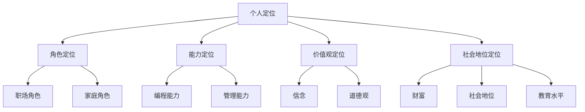

                 

### 1.2 个人定位的概念与内涵

**定义**  
个人定位是指一个人在社会中的角色、地位、能力、价值观等方面的定位，它反映了一个人在社会关系中的位置和作用。它不仅涉及个人在职业领域中的角色定位，如职场角色、家庭角色等，还包括个人的能力定位、价值观定位以及社会地位定位等方面。

**维度与要素**  
- **角色定位**：角色定位是指个人在社会中的具体角色，如职业角色、家庭角色等。例如，一个人在职场中可能是一个程序员、项目经理或CTO，而在家庭中可能是父亲、母亲或家庭成员。
- **能力定位**：能力定位是指个人在特定领域内的能力和技能水平，如编程能力、管理能力等。一个人的能力定位决定了他在职场中的竞争力和职业发展潜力。
- **价值观定位**：价值观定位是指个人的信念、价值观、道德观等。个人的价值观影响着他的行为和决策，进而影响其在社会中的定位。
- **社会地位定位**：社会地位定位是指个人在社会阶层中的位置，如财富、社会地位、教育水平等。社会地位定位不仅影响个人的生活质量，也影响其社会关系和职业发展。

**内涵**  
个人定位的内涵丰富，不仅包含了个人在社会中的角色、地位和能力，还涉及到个人的价值观、信仰和追求。一个全面的个人定位不仅要有清晰的职业目标和能力定位，还要有明确的价值观和社会责任感。

**重要性**  
个人定位对于个人的职业发展、社会关系建立、个人成长等方面具有重要意义：

- **职业发展**：明确的个人定位有助于个人在职业生涯中找到合适的发展方向，提高职业成就。例如，一个程序员如果明确了自己的技能优势和职业目标，就可以有针对性地提升自己的技能，进而提升职业竞争力。
- **社会关系**：个人定位也影响个人的社会关系网络。一个有明确个人定位的人更容易与他人建立有意义的联系，从而扩大自己的社交圈。
- **个人成长**：个人定位有助于个人认识自己的优势和不足，从而有针对性地进行自我提升，实现个人成长。

接下来，我们将通过Mermaid流程图来展示个人定位的核心概念和实体之间的关系架构。

在这个流程图中，我们可以清晰地看到个人定位的各个维度和要素之间的关系。角色定位包括了职场角色和家庭角色，能力定位包括了编程能力和管理能力，价值观定位包括了信念和道德观，社会地位定位则包括了财富、社会地位和教育水平。

**总结**  
个人定位是一个多维度的概念，它涉及到个人在社会中的角色、能力、价值观和社会地位。明确的个人定位对于个人的职业发展、社会关系建立和个人成长具有重要意义。理解个人定位的概念和内涵，有助于我们更好地认识自己，规划自己的职业生涯，实现个人价值。

接下来，我们将进一步探讨社会变革对个人定位的影响，以及个人定位面临的挑战和机遇。

