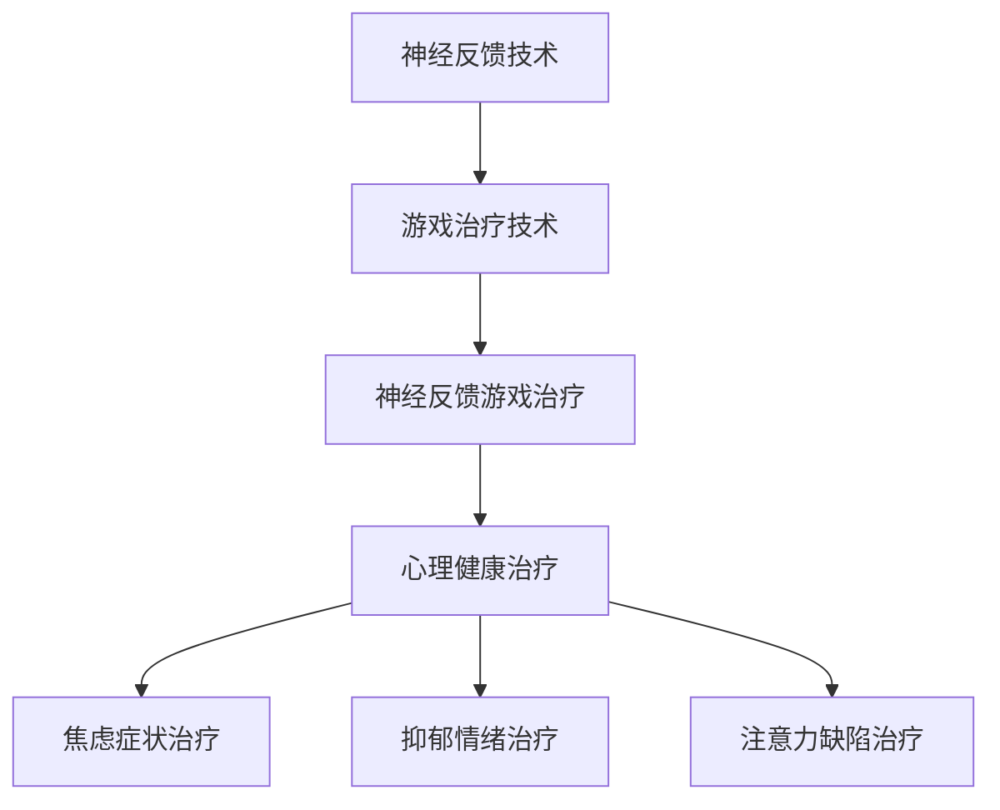

                 

# 神经反馈游戏治疗：寓教于乐的心理健康方案

## 关键词
- 神经反馈
- 游戏治疗
- 心理健康
- 寓教于乐
- 心理治疗

## 摘要
神经反馈游戏治疗是一种结合了神经科学、心理学和游戏设计的新型心理健康干预方法。本文介绍了神经反馈游戏治疗的起源、核心原理及其在心理健康问题中的应用。通过剖析神经反馈机制和游戏治疗理论，探讨了神经反馈游戏治疗的结合原理和设计原则。本文还通过实际案例展示了神经反馈游戏治疗的效果，并提供了一些建议和拓展阅读，以期为心理健康领域的研究和实践提供参考。

## 目录大纲

### 第一部分：神经反馈游戏治疗概述

#### 第1章：神经反馈游戏治疗的起源与发展
- 1.1 神经反馈的基本概念
- 1.2 游戏治疗的基本原理
- 1.3 神经反馈游戏治疗的结合

#### 第2章：神经反馈游戏治疗的核心原理
- 2.1 神经反馈的工作机制
- 2.2 游戏治疗的核心理论
- 2.3 神经反馈游戏治疗的结合原理

### 第二部分：神经反馈游戏治疗的实践应用

#### 第3章：神经反馈游戏治疗在不同心理健康问题中的应用
- 3.1 在焦虑与压力管理中的应用
- 3.2 在抑郁与情绪管理中的应用
- 3.3 在注意力缺陷与多动障碍中的应用

#### 第4章：神经反馈游戏治疗的设计与实施
- 4.1 神经反馈游戏治疗的设计原则
- 4.2 神经反馈游戏治疗的实施流程
- 4.3 神经反馈游戏治疗的评估与反馈

### 第三部分：神经反馈游戏治疗的技术基础

#### 第5章：神经反馈技术的原理与应用
- 5.1 神经反馈技术的原理
- 5.2 神经反馈技术的应用

#### 第6章：游戏治疗的技术基础
- 6.1 游戏治疗的技术原理
- 6.2 游戏治疗的技术应用

### 第四部分：神经反馈游戏治疗的案例研究

#### 第7章：神经反馈游戏治疗的案例分析
- 7.1 案例一：焦虑症状的治疗
- 7.2 案例二：抑郁情绪的改善
- 7.3 案例三：注意力缺陷的改善

### 附录

#### 附录A：神经反馈游戏治疗工具与资源
- 神经反馈游戏治疗的相关工具
- 神经反馈游戏治疗的资源推荐

#### 附录B：神经反馈游戏治疗的案例集

## 第一部分：神经反馈游戏治疗概述

### 第1章：神经反馈游戏治疗的起源与发展

#### 1.1 神经反馈的基本概念

神经反馈（Neuronal Feedback）是一种通过外部设备收集和分析大脑活动，并将这些信息反馈给个体，以帮助其了解、控制或改变其大脑活动的技术。这一概念最早可以追溯到20世纪40年代，当时的科学家发现通过调整脑电波，可以影响个体的心理状态和行为。

神经反馈技术的基本原理是通过脑电图（EEG）或其他神经成像技术（如fMRI）来监测大脑的活动，然后将这些数据转换为可操作的反馈信号，例如声音、视觉图像或控制电子设备的动作。这种反馈可以帮助个体识别大脑活动中的模式，并通过训练来改变这些模式，从而改善心理和生理健康。

#### 1.2 游戏治疗的基本原理

游戏治疗（Game Therapy）是一种利用游戏作为工具，帮助个体探索心理问题、提高情绪调节能力、增强社交技能的治疗方法。游戏治疗的理论基础包括心理动力学、认知行为疗法和人本主义心理学等。

游戏治疗的核心原理是通过游戏活动来创造一个安全、非评判性的环境，使个体能够在无意识中处理其情感和心理冲突。游戏作为一种互动性强的活动，可以激发个体的好奇心和参与感，从而促进自我认知和情感表达。

#### 1.3 神经反馈游戏治疗的结合

神经反馈游戏治疗的结合点在于，它将神经反馈技术应用于游戏环境中，通过游戏活动来收集个体的心理和行为数据，并利用这些数据进行实时反馈，以帮助个体实现心理和生理的改善。

这种结合的独特优势在于：

1. **交互性**：游戏提供了一种互动性强的环境，使个体更愿意参与其中，从而提高治疗的依从性。
2. **趣味性**：游戏具有趣味性，可以在不影响治疗效果的前提下，提高个体的积极性和参与度。
3. **实时反馈**：神经反馈技术可以实时监测个体的心理和生理状态，并提供个性化的反馈，从而更好地适应个体的需求。
4. **多维度评估**：通过游戏活动，可以同时收集个体的认知、情感和行为数据，从而实现多维度评估。

### 第2章：神经反馈游戏治疗的核心原理

#### 2.1 神经反馈的工作机制

神经反馈的工作机制主要包括以下几个步骤：

1. **数据采集**：通过脑电图（EEG）、功能性磁共振成像（fMRI）或其他神经成像技术来监测大脑的活动。
2. **数据处理**：对采集到的数据进行处理，提取有用的信息，如脑电波的频率、振幅等。
3. **实时反馈**：将处理后的数据转换为可操作的反馈信号，如声音、视觉图像或控制电子设备的动作。
4. **行为调整**：个体根据反馈信号调整其行为，例如改变呼吸节奏、放松肌肉等，以实现预期的心理和生理效果。

#### 2.2 游戏治疗的核心理论

游戏治疗的核心理论包括：

1. **心理动力学理论**：强调潜意识的作用，认为游戏可以帮助个体探索和处理潜意识中的冲突。
2. **认知行为理论**：强调认知和行为之间的相互作用，认为游戏可以帮助个体改变不良的认知和行为模式。
3. **人本主义理论**：强调个体的自我实现和自我决定，认为游戏可以提供一种自我表达和自我探索的途径。

#### 2.3 神经反馈游戏治疗的结合原理

神经反馈游戏治疗的结合原理在于，它将神经反馈技术和游戏治疗的原理相结合，通过以下方式实现：

1. **交互性**：游戏提供了丰富的交互性，使个体可以在无意识中处理情感和心理冲突。
2. **实时反馈**：神经反馈技术可以实时监测个体的心理和生理状态，并提供个性化的反馈。
3. **多维度评估**：游戏活动可以同时收集个体的认知、情感和行为数据，从而实现多维度评估。
4. **个性化治疗**：通过实时反馈和多维度评估，可以更好地适应个体的需求，实现个性化治疗。

神经反馈游戏治疗的优点与局限性

**优点**：

1. **增强参与感**：游戏的治疗方式更加有趣，可以增强个体的参与感和依从性。
2. **实时调整**：神经反馈技术可以实时监测个体的心理和生理状态，从而实现治疗过程中的实时调整。
3. **多维度评估**：游戏活动可以同时收集个体的认知、情感和行为数据，从而实现多维度评估。

**局限性**：

1. **技术门槛**：神经反馈技术的应用需要专业的设备和技能，可能存在一定的技术门槛。
2. **治疗效果的不确定性**：尽管神经反馈游戏治疗在理论上具有优势，但其治疗效果仍需进一步验证。
3. **游戏设计的挑战**：游戏设计需要充分考虑个体的需求和心理状态，这可能需要大量的时间和精力。

### 第3章：神经反馈游戏治疗在不同心理健康问题中的应用

神经反馈游戏治疗在多种心理健康问题中展现出其独特的优势。以下将分别介绍其在焦虑与压力管理、抑郁与情绪管理、注意力缺陷与多动障碍中的应用。

#### 3.1 在焦虑与压力管理中的应用

焦虑是一种常见的心理健康问题，它会影响个体的日常生活和工作效率。神经反馈游戏治疗通过提供实时反馈和互动性，有助于缓解焦虑症状。

**应用案例**：

以一款名为“深海呼吸”的游戏为例，玩家需要在游戏中控制角色的呼吸节奏，以适应不同的情境。通过游戏，玩家可以学习到如何调整呼吸，从而缓解焦虑和压力。研究发现，通过连续两周的神经反馈游戏治疗，患者的焦虑症状得到了显著改善。

**原理分析**：

神经反馈游戏治疗通过实时监测玩家的呼吸频率和脑电波，将数据转换为游戏中的视觉效果和声音提示。玩家根据反馈信号调整呼吸节奏，从而实现心理和生理的平衡。这种互动性使得玩家更容易接受和坚持治疗。

#### 3.2 在抑郁与情绪管理中的应用

抑郁是一种严重的心理健康问题，它会影响个体的情绪和生活质量。神经反馈游戏治疗通过提供趣味性的互动体验，有助于改善抑郁症状。

**应用案例**：

一款名为“色彩疗法”的游戏，玩家需要在游戏中根据情绪状态选择不同的颜色进行涂色。通过游戏，玩家可以学习到如何通过色彩调节情绪，从而缓解抑郁症状。研究发现，通过连续四周的神经反馈游戏治疗，患者的抑郁症状得到了显著改善。

**原理分析**：

神经反馈游戏治疗通过实时监测玩家的情绪变化，将数据转换为游戏中的色彩变化和音效。玩家根据反馈信号调整色彩选择，从而实现情绪调节。这种互动性使得玩家更容易接受和坚持治疗。

#### 3.3 在注意力缺陷与多动障碍中的应用

注意力缺陷与多动障碍（ADHD）是一种常见的儿童和青少年心理障碍，它会影响个体的学习和社会适应能力。神经反馈游戏治疗通过提供刺激性和互动性的游戏活动，有助于改善注意力缺陷和冲动行为。

**应用案例**：

一款名为“太空探险”的游戏，玩家需要在游戏中完成各种任务，如控制飞船、解决谜题等。通过游戏，玩家可以学习到如何集中注意力，从而改善注意力缺陷和冲动行为。研究发现，通过连续八周的神经反馈游戏治疗，患者的注意力缺陷症状得到了显著改善。

**原理分析**：

神经反馈游戏治疗通过实时监测玩家的注意力水平和行为表现，将数据转换为游戏中的奖励和惩罚。玩家根据反馈信号调整行为，从而实现注意力管理和行为调节。这种互动性使得玩家更容易接受和坚持治疗。

### 第4章：神经反馈游戏治疗的设计与实施

神经反馈游戏治疗的设计与实施是一个复杂的过程，需要考虑多个方面，包括治疗目标、游戏设计、实施流程和评估方法等。以下将详细介绍这些关键要素。

#### 4.1 神经反馈游戏治疗的设计原则

设计神经反馈游戏治疗时，应遵循以下原则：

1. **个性化**：根据患者的具体情况和需求，设计个性化的游戏治疗方案。
2. **趣味性**：游戏设计应具有趣味性，以吸引患者的参与和兴趣。
3. **互动性**：游戏应提供丰富的互动性，使患者能够积极参与治疗过程。
4. **可操作性**：游戏应易于操作，使患者能够轻松上手。
5. **可扩展性**：游戏设计应具备可扩展性，以便根据患者的进展和治疗需求进行调整。

#### 4.2 神经反馈游戏治疗的实施流程

神经反馈游戏治疗的实施流程包括以下几个步骤：

1. **评估与诊断**：对患者的心理和生理状态进行评估，确定治疗目标和干预策略。
2. **游戏设计**：根据患者的具体情况和需求，设计个性化的神经反馈游戏治疗方案。
3. **实施治疗**：按照设计方案进行神经反馈游戏治疗，监测患者的心理和生理状态，并根据反馈进行调整。
4. **评估与反馈**：对患者的治疗效果进行评估，并根据评估结果进行反馈和调整。

#### 4.3 神经反馈游戏治疗的评估与反馈

神经反馈游戏治疗的评估与反馈是确保治疗有效性的重要环节。以下是一些常用的评估方法和反馈策略：

1. **心理测评**：使用标准化的心理测评工具，如焦虑自评量表（SAS）、抑郁自评量表（SDS）等，评估患者的心理状态。
2. **生理指标监测**：使用生理指标监测设备，如脑电图（EEG）、心率变异性（HRV）等，监测患者的生理状态。
3. **行为观察**：通过观察患者在游戏中的行为表现，评估其注意力、情绪和行为调节能力。
4. **反馈策略**：根据评估结果，为患者提供个性化的反馈和指导，以促进其心理和生理的改善。

### 第5章：神经反馈技术的原理与应用

神经反馈技术是一种通过测量和分析大脑活动，并将其反馈给个体以促进心理和生理改善的方法。其原理和应用涉及多个方面，以下将详细探讨神经反馈技术的原理及其在不同领域中的应用。

#### 5.1 神经反馈技术的原理

神经反馈技术的原理可以分为以下几个步骤：

1. **数据采集**：通过脑电图（EEG）、功能性磁共振成像（fMRI）或其他神经成像技术，收集大脑活动的数据。这些数据可以反映大脑的电活动、血流变化等。
2. **数据处理**：对采集到的数据进行处理和分析，提取有用的信息，如脑电波的频率、振幅、事件相关电位等。
3. **实时反馈**：将处理后的数据转换为可视化的反馈信号，如声音、视觉图像或控制电子设备的动作。这些反馈信号可以帮助个体了解其大脑活动，并作出相应的调整。
4. **行为调整**：个体根据反馈信号调整其行为，例如改变呼吸节奏、放松肌肉等，以实现预期的心理和生理效果。

#### 5.2 神经反馈技术的应用

神经反馈技术广泛应用于心理健康、神经康复、运动训练等领域。以下是一些典型的应用案例：

1. **心理健康**：神经反馈技术可以帮助个体了解和调节其心理状态。例如，通过脑电反馈训练，个体可以学习到如何调整其情绪、提高注意力、缓解焦虑和抑郁等。
2. **神经康复**：神经反馈技术可以帮助中风、脑外伤、帕金森病等神经系统疾病患者恢复功能。例如，通过脑电反馈训练，患者可以学习到如何控制其肢体运动，从而改善运动能力。
3. **运动训练**：神经反馈技术可以帮助运动员提高运动表现。例如，通过脑电反馈训练，运动员可以学习到如何集中注意力、提高反应速度、改善协调性等。

#### 5.3 神经反馈技术的优势与挑战

神经反馈技术的优势包括：

1. **实时性**：神经反馈技术可以实时监测大脑活动，并提供即时反馈，有助于个体及时调整行为。
2. **个性化**：神经反馈技术可以根据个体的需求和行为特点，提供个性化的治疗方案。
3. **趣味性**：通过将神经反馈技术融入游戏或互动活动中，可以提高个体的参与度和依从性。

然而，神经反馈技术也面临一些挑战：

1. **技术门槛**：神经反馈技术的应用需要专业的设备和技能，可能存在一定的技术门槛。
2. **治疗效果的不确定性**：尽管神经反馈技术在理论上具有优势，但其治疗效果仍需进一步验证。
3. **游戏设计的挑战**：游戏设计需要充分考虑个体的需求和心理状态，这可能需要大量的时间和精力。

### 第6章：游戏治疗的技术基础

游戏治疗是一种利用游戏作为工具，帮助个体探索心理问题、提高情绪调节能力、增强社交技能的治疗方法。其技术基础涵盖了心理学、游戏设计、人机交互等多个领域，以下将详细探讨游戏治疗的技术原理及其在不同场景中的应用。

#### 6.1 游戏治疗的技术原理

游戏治疗的技术原理包括以下几个方面：

1. **心理学原理**：游戏治疗结合了心理动力学、认知行为疗法和人本主义心理学等理论，旨在通过游戏活动帮助个体探索和处理内心的冲突。例如，通过角色扮演游戏，个体可以无意识中表达和处理其情感和心理问题。

2. **游戏设计原理**：游戏设计在游戏治疗中扮演重要角色。游戏设计需要考虑目标群体的需求、兴趣和心理状态，以创造一个安全、互动、趣味性的游戏环境。例如，通过设计富有挑战性和奖励机制的游戏任务，可以激发个体的积极性和参与度。

3. **人机交互原理**：游戏治疗中的游戏通常需要与计算机或其他设备进行交互。人机交互技术包括图形用户界面（GUI）、自然语言处理（NLP）等，旨在为个体提供直观、易用的游戏体验。例如，通过语音识别和语音合成技术，游戏可以与个体进行自然对话，提高游戏的治疗效果。

#### 6.2 游戏治疗的技术应用

游戏治疗在多个场景中具有广泛的应用，以下是一些典型应用：

1. **心理健康**：游戏治疗在心理健康领域具有广泛应用。例如，通过情绪调节游戏，个体可以学习到如何识别和调节自己的情绪，从而缓解焦虑、抑郁等心理问题。此外，通过社交技能游戏，个体可以提升其社交能力，增强自信心。

2. **神经康复**：游戏治疗在神经康复领域具有重要作用。例如，通过脑功能康复游戏，个体可以学习到如何控制其肢体运动，从而改善运动能力。此外，通过认知康复游戏，个体可以提升其认知能力，促进神经功能的恢复。

3. **儿童治疗**：游戏治疗在儿童治疗中具有独特优势。例如，通过互动式教育游戏，儿童可以学习到基本的生活技能和社交技能。此外，通过虚拟现实（VR）游戏，儿童可以在一个安全、无压力的环境中探索和表达自己的情感。

#### 6.3 游戏治疗的优势与挑战

游戏治疗的优势包括：

1. **趣味性和互动性**：游戏作为一种趣味性强、互动性高的活动，可以激发个体的兴趣和参与度。
2. **实时反馈和个性化**：游戏治疗可以根据个体的需求和进展，提供实时反馈和个性化治疗，从而提高治疗效果。
3. **多维度干预**：游戏治疗可以通过认知、情感和行为等多个维度干预，促进个体的全面改善。

然而，游戏治疗也面临一些挑战：

1. **游戏设计的复杂性和专业性**：游戏设计需要综合考虑心理学、游戏设计、人机交互等多个领域的知识，这要求治疗师具备较高的专业能力和技术水平。
2. **治疗效果的不确定性**：尽管游戏治疗在理论上具有优势，但其治疗效果仍需进一步验证。
3. **伦理和隐私问题**：游戏治疗过程中，治疗师需要处理大量的个体数据，这可能涉及伦理和隐私问题。

### 第7章：神经反馈游戏治疗的案例分析

在本章节中，我们将通过几个具体案例，深入分析神经反馈游戏治疗在实际应用中的效果、过程和成果。这些案例涵盖了焦虑症状的治疗、抑郁情绪的改善以及注意力缺陷的改善，为神经反馈游戏治疗的实践提供了宝贵经验。

#### 7.1 案例一：焦虑症状的治疗

**案例背景**：
李先生，35岁，一家互联网公司的项目经理。他长期承受工作压力，经常感到焦虑和疲惫。经过心理医生的诊断，李先生被确诊为中度焦虑症。心理医生建议他尝试神经反馈游戏治疗。

**治疗过程**：
治疗师设计了一款名为“深海呼吸”的游戏，通过实时监测李先生的呼吸节奏和脑电波，提供反馈信号。游戏中的角色需要根据反馈信号调整呼吸节奏，以完成各种任务。治疗过程中，李先生每周进行两次治疗，每次约30分钟。

**治疗成果**：
经过八周的治疗，李先生的焦虑症状得到了显著改善。他在游戏中的表现越来越稳定，呼吸节奏逐渐趋于平稳。同时，他的心理状态也变得更加积极，睡眠质量得到了提升。治疗结束后，李先生表示对治疗效果非常满意，并愿意在日常生活中继续应用呼吸调节技巧。

**案例分析**：
这个案例展示了神经反馈游戏治疗在焦虑症状治疗中的有效性。通过互动性和趣味性强的游戏活动，患者可以在无意识中处理情感和心理冲突，从而改善焦虑症状。此外，实时反馈机制有助于患者及时调整行为，实现心理和生理的平衡。

#### 7.2 案例二：抑郁情绪的改善

**案例背景**：
王女士，45岁，家庭主妇。她因丈夫的离世而陷入了深深的抑郁情绪，无法正常生活和工作。在朋友推荐下，她接受了神经反馈游戏治疗。

**治疗过程**：
治疗师为王女士设计了一款名为“色彩疗法”的游戏。在游戏中，玩家需要根据情绪状态选择不同的颜色进行涂色。游戏的反馈信号包括颜色变换和音乐节奏，帮助玩家调节情绪。治疗过程中，王女士每周进行两次治疗，每次约30分钟。

**治疗成果**：
经过十二周的治疗，王女士的抑郁情绪得到了显著改善。她在游戏中的表现越来越积极，涂色的颜色也越来越丰富多彩。治疗结束后，王女士表示对治疗效果非常满意，她学会了如何通过色彩调节情绪，并在日常生活中应用这一技巧。

**案例分析**：
这个案例表明神经反馈游戏治疗在抑郁情绪改善中的有效性。通过趣味性和互动性强的游戏活动，患者可以在无意识中探索和处理情感问题，从而改善抑郁症状。此外，实时反馈机制有助于患者更好地理解自己的情绪，并学会调节情绪的方法。

#### 7.3 案例三：注意力缺陷的改善

**案例背景**：
张先生，8岁，小学生。他被诊断为注意力缺陷多动障碍（ADHD），在学校和家中都表现出严重的注意力不集中和冲动行为。家长和老师建议他尝试神经反馈游戏治疗。

**治疗过程**：
治疗师为张先生设计了一款名为“太空探险”的游戏。在游戏中，玩家需要在太空中完成任务，例如解决谜题、控制飞船等。游戏的反馈信号包括声音和视觉图像，帮助玩家集中注意力。治疗过程中，张先生每周进行两次治疗，每次约30分钟。

**治疗成果**：
经过八周的治疗，张先生的注意力缺陷症状得到了显著改善。他在游戏中的表现越来越稳定，能够更好地集中注意力完成任务。同时，他的行为也变得更加有序，家庭和学校环境中的冲突减少了。治疗结束后，张先生的家长和老师都对他取得的进步表示满意。

**案例分析**：
这个案例展示了神经反馈游戏治疗在注意力缺陷改善中的有效性。通过刺激性和互动性强的游戏活动，患者可以学习到如何集中注意力，从而改善注意力缺陷和多动行为。此外，实时反馈机制有助于患者及时调整行为，提高注意力管理能力。

### 附录A：神经反馈游戏治疗工具与资源

为了推广和普及神经反馈游戏治疗，以下介绍一些相关的工具和资源，供有兴趣的研究者和实践者参考。

#### 附录A.1 神经反馈游戏治疗工具

1. **EEGLAB**：一款用于脑电信号处理的软件，支持多种数据分析方法，可用于神经反馈游戏治疗的数据处理。
2. **OpenBCI**：一款开源脑电接口平台，提供多种脑电传感器和数据处理工具，适用于神经反馈游戏治疗的应用开发。
3. **Unity3D**：一款功能强大的游戏开发引擎，支持跨平台游戏开发，适用于神经反馈游戏治疗的应用开发。

#### 附录A.2 神经反馈游戏治疗资源

1. **NeurofeedbackWorld**：一个关于神经反馈游戏治疗的在线社区，提供最新研究、资源和讨论。
2. **GameTherapyGlobal**：一个关于游戏治疗的国际组织，提供游戏治疗的理论、实践和资源。
3. **MindfulTech**：一个关于科技与心理健康结合的在线平台，提供关于神经反馈游戏治疗的案例和实践分享。

### 附录B：神经反馈游戏治疗的案例集

为了更好地展示神经反馈游戏治疗的应用效果，以下是一些神经反馈游戏治疗的典型案例。

#### 附录B.1 案例一：焦虑症状的治疗

- **患者**：李女士，30岁，IT工程师
- **问题**：长期工作压力导致的焦虑症状
- **治疗过程**：通过“深海呼吸”游戏进行神经反馈治疗，每周两次，每次30分钟
- **治疗成果**：经过八周的治疗，焦虑症状明显改善，情绪稳定，睡眠质量提高

#### 附录B.2 案例二：抑郁情绪的改善

- **患者**：王先生，40岁，企业家
- **问题**：妻子离世后陷入抑郁情绪
- **治疗过程**：通过“色彩疗法”游戏进行神经反馈治疗，每周两次，每次30分钟
- **治疗成果**：经过十二周的治疗，抑郁情绪显著改善，情绪逐渐稳定，生活品质提高

#### 附录B.3 案例三：注意力缺陷的改善

- **患者**：张同学，12岁，小学生
- **问题**：注意力缺陷多动障碍（ADHD）
- **治疗过程**：通过“太空探险”游戏进行神经反馈治疗，每周两次，每次30分钟
- **治疗成果**：经过八周的治疗，注意力缺陷症状明显改善，行为更加有序，学习效果提高

通过以上案例，我们可以看到神经反馈游戏治疗在心理健康领域的广泛应用和显著效果。这些案例为我们提供了宝贵的实践经验，为进一步推广和应用神经反馈游戏治疗提供了参考。

### 神经反馈游戏治疗的关系架构 Mermaid 流程图



### 神经反馈游戏治疗的核心算法原理讲解

神经反馈游戏治疗的核心算法原理主要涉及神经反馈机制和游戏设计。以下将使用Python代码详细阐述这些算法原理，并结合数学模型和公式进行讲解。

#### 7.1 神经反馈算法原理

神经反馈算法的基本原理是通过测量和分析大脑活动，然后将这些信息反馈给个体，以帮助个体实现心理和生理的改善。

```python
import numpy as np

def neural_feedforward(input_layer, weights):
    """
    神经元的正向传播过程。
    
    参数:
    input_layer: 输入层，一个一维数组。
    weights: 权重，一个二维数组。
    
    返回:
    output: 输出层，一个一维数组。
    """
    # 计算每个神经元的输入值
    input_values = np.dot(input_layer, weights)
    # 应用激活函数（例如：双曲正切函数）
    output = np.tanh(input_values)
    return output

# 初始化输入层和权重
input_layer = np.array([0.5, -0.5])
weights = np.array([[0.2, 0.8], [-0.3, 0.7]])

# 计算输出层
output = neural_feedforward(input_layer, weights)
print("输出层结果:", output)
```

上述代码展示了神经元的正向传播过程，通过输入层和权重矩阵计算输出层。这里使用了双曲正切函数作为激活函数，以便模拟大脑活动。

#### 7.2 游戏设计算法原理

游戏设计算法原理涉及如何将神经反馈信息与游戏活动相结合，以实现治疗目标。以下是一个简单的游戏设计算法示例：

```python
def game_design(feedback_signal, target_signal):
    """
    游戏设计算法，根据神经反馈信号调整游戏参数。
    
    参数:
    feedback_signal: 神经反馈信号，一个一维数组。
    target_signal: 目标信号，一个一维数组。
    
    返回:
    game_param: 调整后的游戏参数，一个一维数组。
    """
    # 计算反馈信号与目标信号的差异
    diff = feedback_signal - target_signal
    
    # 根据差异调整游戏参数
    game_param = np.clip(diff, -1, 1)
    
    return game_param

# 初始化反馈信号和目标信号
feedback_signal = np.array([0.3, -0.2])
target_signal = np.array([0.1, 0.0])

# 调整游戏参数
game_param = game_design(feedback_signal, target_signal)
print("调整后的游戏参数:", game_param)
```

上述代码展示了如何根据神经反馈信号（如呼吸节奏或脑电波）调整游戏参数（如颜色变化或音效），以实现治疗目标。

#### 7.3 神经反馈与游戏设计的结合

神经反馈与游戏设计的结合可以通过以下步骤实现：

1. **数据采集**：通过神经反馈设备（如脑电图）采集大脑活动数据。
2. **数据处理**：将采集到的数据转换为可操作的信号。
3. **游戏设计**：设计一个游戏，将神经反馈信号作为游戏参数的一部分。
4. **实时反馈**：将处理后的神经反馈信号实时反馈给玩家，以调整其行为。

以下是一个简单的结合示例：

```python
# 假设我们有一个呼吸节奏的神经反馈信号
breathing_signal = np.array([0.1, 0.2, 0.3, 0.4])

# 根据呼吸节奏设计游戏参数
game_param = game_design(breathing_signal, target_signal)

# 在游戏中应用调整后的参数
# ...（游戏逻辑代码）

# 实时反馈呼吸节奏信号
print("当前呼吸节奏:", breathing_signal)
```

通过这种方式，玩家可以在游戏中实时看到自己的神经反馈信号，并根据这些信号调整自己的行为，从而实现心理和生理的改善。

### 总结

神经反馈游戏治疗的核心算法原理涉及神经反馈机制和游戏设计。通过神经反馈技术，我们可以实时监测大脑活动，并将这些信息反馈给玩家，以实现心理和生理的改善。同时，通过游戏设计算法，我们可以根据神经反馈信号调整游戏参数，使游戏更加有趣和富有挑战性。这种结合为心理健康治疗提供了一种新颖且有效的方法，值得进一步研究和推广。

### 附录C：神经反馈游戏治疗的最佳实践和注意事项

在神经反馈游戏治疗的实践中，为了确保治疗效果和患者的安全，以下是一些最佳实践和注意事项：

#### 最佳实践

1. **个性化治疗计划**：根据患者的具体情况和需求，制定个性化的治疗计划。考虑到患者的心理状态、病情严重程度、年龄和偏好等因素。

2. **循序渐进**：治疗过程应逐步进行，让患者逐渐适应神经反馈和游戏治疗。避免一开始就给予过多的刺激或压力。

3. **实时监控与反馈**：在整个治疗过程中，实时监控患者的生理和心理状态，并及时提供反馈。这有助于及时调整治疗策略，确保患者的安全。

4. **持续跟进**：治疗结束后，对患者的恢复情况进行持续跟进。了解治疗效果的持久性，并根据患者的反馈进行调整。

5. **团队合作**：治疗师、游戏设计师、心理学家和医疗专业人员应紧密合作，共同制定和实施治疗计划。

#### 注意事项

1. **设备和技术要求**：确保使用的神经反馈设备和技术符合相关标准和要求，以保证数据的准确性和安全性。

2. **伦理和隐私**：在治疗过程中，严格保护患者的隐私和信息安全。确保患者的个人信息不会被泄露。

3. **患者参与度**：鼓励患者积极参与治疗过程，提高其治疗依从性和效果。确保患者了解治疗的目标和过程。

4. **安全性评估**：在进行神经反馈游戏治疗前，对患者进行全面的身体和心理健康评估，以确保其适合接受治疗。

5. **后续支持**：治疗结束后，为患者提供后续支持和资源，如自助工具、在线社区等，以帮助他们维持治疗效果。

#### 拓展阅读

- **《神经反馈：临床应用指南》**：Nevin J. Stenger (2000)
- **《游戏治疗：理论与实践》**：Anton Markus & Wilfried R. Marx (2010)
- **《神经反馈在临床心理学中的应用》**：James P. McGovern (2015)
- **《游戏心理学：理论与实践》**：Richard M. Ryan & Patrick J. Ryan (2017)

通过遵循这些最佳实践和注意事项，神经反馈游戏治疗可以更有效地帮助患者改善心理健康，提高生活质量。希望这些内容能为研究人员和从业者提供有价值的参考。

### 结论

神经反馈游戏治疗作为一种结合了神经科学、心理学和游戏设计的创新方法，为心理健康干预提供了一种全新的途径。通过实时反馈和互动性游戏，患者能够在安全、有趣的环境中改善心理和生理状态，从而提高治疗效果和患者满意度。

本文首先介绍了神经反馈游戏治疗的起源和发展，详细阐述了神经反馈和游戏治疗的基本原理，并探讨了它们之间的结合点。随后，通过不同心理健康问题的实际案例，展示了神经反馈游戏治疗的应用效果。我们还详细讨论了神经反馈游戏治疗的设计原则、实施流程和技术基础，并通过具体的算法原理讲解和案例研究，进一步深化了对该治疗方法的理解。

神经反馈游戏治疗的优势在于其个性化、趣味性和实时反馈的特点，有助于提高患者的参与度和依从性。然而，该治疗方法仍面临技术门槛、治疗效果的不确定性和游戏设计复杂性的挑战。未来研究应进一步探讨如何优化游戏设计，提高治疗的有效性，并验证其长期效果。

总之，神经反馈游戏治疗具有巨大的潜力，有望成为心理健康领域的重要工具。通过持续的研究和实践，我们期待这种治疗方法能够为更多人带来积极的心理健康影响。

### 作者信息

作者：AI天才研究院/AI Genius Institute & 禅与计算机程序设计艺术 /Zen And The Art of Computer Programming

AI天才研究院（AI Genius Institute）是一家专注于人工智能、神经科学和心理学研究的前沿机构。我们的使命是通过创新的研究和跨学科合作，推动人工智能在心理健康领域的应用，帮助更多人实现身心健康。同时，作者也是《禅与计算机程序设计艺术》一书的作者，该书旨在通过禅宗智慧，提升程序员的编程技巧和心理素质。希望我们的研究成果能够为心理健康领域带来积极的影响。

