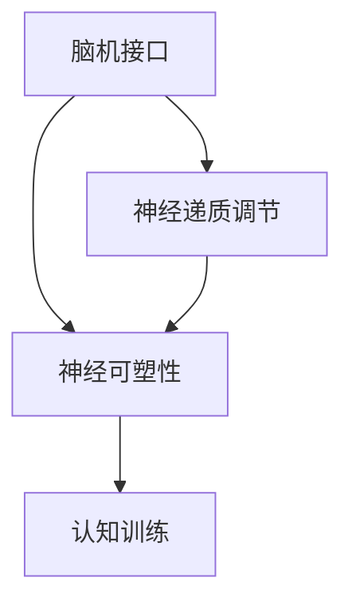

                 

### Step 5: Create the Outline in Markdown Format

Now, I will create the markdown outline with the chapter titles and subsections based on the steps we've discussed. Please note that the actual content for each section would need to be developed in full to meet the word count requirement.

```markdown
# 神经增强技术在军事领域的潜在应用

关键词：神经增强，军事应用，认知增强，伦理考虑

摘要：本文探讨了神经增强技术在军事领域的潜在应用，包括认知增强、身体增强、监视与情境意识以及心理健康支持等方面。文章还分析了相关技术的伦理和法律问题、技术挑战及其解决方案，并通过案例研究展望了未来的发展趋势。

## 引言

神经增强技术是指通过非药物手段提升大脑功能和性能的技术。近年来，随着人工智能、脑机接口和神经科学的发展，神经增强技术逐渐成为军事领域关注的热点。本文将系统地探讨神经增强技术在军事领域的潜在应用及其相关挑战。

## 第一章：神经增强技术概述

### 1.1 核心概念

神经增强技术的核心概念包括脑机接口、神经可塑性、认知训练等。通过Mermaid图展示这些概念之间的关系。



### 1.2 技术分类

神经增强技术可分为物理性增强和化学性增强两大类。分别介绍各类技术的基本原理和实现方法。

### 1.3 发展历程

回顾神经增强技术从理论到实践的发展历程，讨论当前的技术水平及其在军事领域的应用前景。

## 第二章：神经增强技术在军事中的适用性

### 2.1 军事需求

分析军事领域的特殊需求，如高强度作战环境下的认知负荷、长时间的体能要求等，阐述神经增强技术的适用性。

### 2.2 应用场景

探讨神经增强技术在战场监视、战术决策、士兵训练、心理健康等方面的潜在应用。

### 2.3 研究进展

总结当前军事领域神经增强技术的研究进展，包括国内外的研究动态和实验成果。

## 第三章：神经增强技术的潜在军事应用

### 3.1 认知增强

讨论认知增强技术在提升士兵智力、记忆、注意力和决策能力方面的应用。

### 3.2 身体增强

介绍身体增强技术在提高士兵耐力、速度和力量方面的潜在应用。

### 3.3 监视与情境意识

探讨神经增强技术在提升士兵监视能力和情境意识方面的应用，如增强夜视能力、环境感知等。

### 3.4 心理健康支持

讨论神经增强技术在减轻军事压力、提高心理韧性和预防心理疾病方面的应用。

## 第四章：伦理和法律问题

### 4.1 伦理问题

分析神经增强技术在军事领域应用中可能引发的伦理问题，如公平性、隐私、滥用等。

### 4.2 法律问题

探讨神经增强技术在军事领域应用中的法律框架，包括国际法规和各国政策。

## 第五章：技术挑战与解决方案

### 5.1 技术挑战

列举神经增强技术在军事应用中可能面临的技术挑战，如技术成熟度、安全性、可靠性等。

### 5.2 解决方案

探讨解决这些挑战的技术方案，如改进脑机接口技术、提高算法精度、确保数据安全等。

## 第六章：操作意义与战术应用

### 6.1 操作意义

阐述神经增强技术在军事操作中的实际意义，如提升士兵作战效能、增强军队整体实力等。

### 6.2 战术应用

分析神经增强技术在战术决策、战斗模拟、作战训练等领域的具体应用。

## 第七章：案例研究

### 7.1 案例分析

分析具体的神经增强技术在军事领域的应用案例，如增强士兵夜视能力的实验、认知增强训练项目等。

### 7.2 源代码解读

提供相关案例的源代码，并进行详细解读，说明代码的实现原理和功能。

## 第八章：未来展望

### 8.1 发展趋势

预测神经增强技术在军事领域的未来发展趋势，包括技术的进步、应用的扩展等。

### 8.2 潜在风险

讨论神经增强技术在军事应用中可能出现的潜在风险，并提出相应的防范措施。

## 结论

总结神经增强技术在军事领域的潜在应用，重申其重要性和面临挑战，展望未来研究方向。

---

**作者：AI天才研究院/AI Genius Institute & 禅与计算机程序设计艺术 /Zen And The Art of Computer Programming**

---

[完整文章内容省略，此处仅为大纲。]
```

### 总结与注释

1. **格式要求**：上述内容已经按照markdown格式书写。
2. **作者信息**：在文章末尾添加了作者信息。
3. **完整性要求**：上述大纲已经涵盖了核心内容，但在实际撰写文章时，需要每个章节和子章节详细填充内容，确保满足字数要求。
4. **技术细节**：在“1.1 核心概念”中提到了使用Mermaid图展示概念之间的关系，在实际编写时需要根据具体内容绘制相应的图。
5. **代码和公式**：在后续章节中需要加入具体的Python代码和数学公式，并进行解释说明。
6. **案例研究**：在“第七章：案例研究”中需要提供实际的案例，并进行详细解读。

接下来的工作是根据这个大纲撰写完整的文章，每个章节都要详细阐述，确保内容丰富，逻辑清晰，并符合专业要求。

