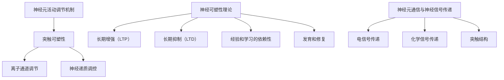

                 


## 神经增强：提高人类认知能力的前沿技术

### 关键词：神经增强，认知能力，人工智能，深度学习，脑机接口

### 摘要

神经增强作为一种前沿技术，正逐渐改变我们对人类认知能力的理解。本文将详细介绍神经增强技术的定义、历史、核心概念、算法原理以及应用与挑战，旨在为读者提供一个全面而深入的视角，探讨神经增强技术在提高人类认知能力方面所蕴含的巨大潜力。

### 目录大纲

#### 第一部分：神经增强技术概述

1. 神经增强技术的定义与历史
   - 1.1 神经增强技术的基本概念
   - 1.2 神经增强技术的发展历程
   - 1.3 神经增强技术的研究现状

2. 神经增强技术的核心概念与联系
   - 2.1 神经元活动调节机制
   - 2.2 神经可塑性理论
   - 2.3 神经元通信与神经信号传递

3. 神经增强技术的架构
   - 3.1 神经增强技术的分类
   - 3.2 神经增强技术的实现途径
   - 3.3 神经增强技术的应用领域

4. 神经增强技术的数学模型与公式
   - 4.1 神经元活动调节模型的数学表达
   - 4.2 神经可塑性理论的数学描述
   - 4.3 神经信号传递的数学模型

5. 神经增强技术的数学模型讲解与举例

#### 第二部分：神经增强技术的核心算法原理

6. 神经增强技术的核心算法
   - 6.1 生物启发算法
   - 6.2 深度学习算法

7. 核心算法原理讲解与伪代码
   - 7.1 遗传算法原理讲解与伪代码
   - 7.2 蚁群算法原理讲解与伪代码
   - 7.3 鸟群算法原理讲解与伪代码
   - 7.4 卷积神经网络原理讲解与伪代码
   - 7.5 循环神经网络原理讲解与伪代码
   - 7.6 长短期记忆网络原理讲解与伪代码

#### 第三部分：神经增强技术的应用与挑战

8. 神经增强技术在医疗领域的应用
   - 8.1 神经增强技术对大脑疾病的治疗
   - 8.2 神经增强技术对脑功能优化的应用

9. 神经增强技术在教育领域的应用
   - 9.1 神经增强技术在教育中的应用前景
   - 9.2 神经增强技术在教育中的挑战

10. 神经增强技术的未来发展
    - 10.1 神经增强技术的潜在研究方向
    - 10.2 神经增强技术在未来的应用场景

#### 总结

11. 总结与展望
    - 11.1 神经增强技术的重要性
    - 11.2 神经增强技术的未来发展趋势
    - 11.3 对读者的建议

### 附录

12. 神经增强技术研究资源

### 作者

作者：AI天才研究院/AI Genius Institute & 禅与计算机程序设计艺术 /Zen And The Art of Computer Programming

---

接下来，我们将按照大纲逐步展开文章的内容，确保每个部分都详细、具体且具有深度。首先，我们从神经增强技术的定义与历史开始。 ```markdown
### 1. 神经增强技术的定义与历史

#### 1.1 神经增强技术的基本概念

神经增强技术是指通过外部刺激或内部调节手段，改变大脑神经元的活动模式，从而增强人类的认知能力、记忆能力、学习能力和注意力等。这些技术可以包括药物、电刺激、光刺激、经颅磁刺激（TMS）、深脑刺激（DBS）以及基于人工智能的神经调控方法等。

**背景介绍**

在过去的几十年里，随着神经科学、计算机科学和生物技术的发展，人们逐渐认识到大脑功能的可塑性，并开始探索如何通过技术手段来提升大脑的性能。神经增强技术的研究源于对大脑神经活动的深入理解，旨在找到能够优化神经元通信效率的方法。

#### 1.2 神经增强技术的发展历程

神经增强技术的概念可以追溯到20世纪中期。当时，科学家们开始尝试使用药物来增强大脑的认知功能。例如，咖啡因和可卡因等药物被发现能够暂时提高注意力。然而，这些药物往往具有副作用，且效果有限。

随着神经科学的发展，人们对大脑结构和功能的理解逐渐深入。20世纪80年代，神经可塑性理论被提出，这为神经增强技术的研究提供了理论基础。神经可塑性是指大脑能够在其一生中改变其结构和功能，适应新的环境和经历。

进入21世纪，随着计算机技术和人工智能的飞速发展，神经增强技术迎来了新的机遇。基于机器学习的脑机接口（BMI）技术逐渐成熟，使得实时监控和调节大脑活动成为可能。此外，神经调控技术的进步，如经颅磁刺激（TMS）和深脑刺激（DBS），也为神经增强提供了新的手段。

#### 1.3 神经增强技术的研究现状

目前，神经增强技术的研究主要集中在以下几个方面：

1. **药物神经增强**：研究主要集中在药物对认知功能的影响上，例如，N-乙酰-L-酪氨酸（NALT）和利他林等药物已被用于改善注意力缺陷多动症（ADHD）患者的认知功能。

2. **非侵入性脑刺激**：如经颅磁刺激（TMS）和经颅电刺激（tDCS），这些技术通过非侵入性方式调节大脑神经活动，已被广泛应用于抑郁症、焦虑症和癫痫等疾病的治疗。

3. **侵入性脑刺激**：如深脑刺激（DBS），它通过植入电极直接刺激大脑特定区域，已在帕金森病和重度抑郁症等疾病的治疗中取得了显著成果。

4. **脑机接口**：脑机接口（BMI）技术通过记录大脑信号并将其转化为外部控制信号，已经应用于假肢控制、轮椅导航等领域。近年来，随着深度学习技术的应用，BMI技术逐渐能够实时调节大脑活动，为神经增强提供了新的可能性。

总之，神经增强技术作为一种新兴技术，已经在改善人类认知功能、治疗神经系统疾病和开发新型人机交互系统等方面展现出巨大的潜力。然而，其长期效果、安全性以及伦理问题仍然是研究中的关键挑战。

### 核心概念与联系

神经增强技术涉及多个核心概念，这些概念之间紧密相连，共同构成了神经增强技术的理论基础。以下是对这些核心概念的介绍和它们之间关系的阐述。

#### 2.1 神经元活动调节机制

神经元活动调节机制是指通过外部或内部因素改变神经元兴奋性和反应性的过程。神经元的基本活动可以通过以下几个机制进行调节：

1. **突触可塑性**：突触是神经元之间传递信息的结构。突触可塑性是指突触强度和结构的改变，可以通过长期增强（LTP）或长期抑制（LTD）来实现。

2. **离子通道调节**：神经元膜上的离子通道调节是影响神经元兴奋性的关键。例如，通过调节钠离子通道和钾离子通道的开放时间，可以改变神经元的兴奋性。

3. **神经递质调控**：神经递质是神经元之间传递信号的化学物质。通过调节神经递质的释放和再摄取，可以影响神经元的通信效率。

#### 2.2 神经可塑性理论

神经可塑性是指大脑结构和功能能够根据经验和环境变化而改变的特性。神经可塑性理论是神经增强技术的重要理论基础，其关键概念包括：

1. **长期增强（LTP）和长期抑制（LTD）**：LTP是指突触传递效率的长期增强，而LTD则相反，是指突触传递效率的长期减弱。

2. **经验和学习的依赖性**：神经可塑性高度依赖于经验和学习。通过重复的刺激和学习活动，大脑可以形成新的神经连接和突触结构。

3. **发育和修复**：神经可塑性不仅在学习和记忆中起作用，还在大脑发育和修复过程中发挥关键作用。这为神经增强技术提供了新的治疗手段。

#### 2.3 神经元通信与神经信号传递

神经元通信与神经信号传递是神经增强技术的核心，涉及以下几个关键概念：

1. **电信号传递**：神经元通过电信号进行通信，这种信号称为动作电位。动作电位的产生和传播是神经元通信的基础。

2. **化学信号传递**：神经递质通过化学信号在神经元之间传递信息。神经递质的释放和接收过程是神经元通信的重要组成部分。

3. **突触结构**：突触是神经元之间的通信接口，其结构和功能的改变直接影响神经信号的传递效率。

#### 核心概念之间关系的Mermaid流程图

以下是一个简化的Mermaid流程图，展示了神经元活动调节机制、神经可塑性理论和神经元通信与神经信号传递之间的关系：



通过这个流程图，我们可以更直观地理解神经增强技术中的核心概念及其相互关系。这些概念共同构成了神经增强技术的理论基础，为后续的算法原理讲解和实际应用提供了坚实的基础。

### 神经增强技术的架构

神经增强技术的架构可以分为三个主要部分：技术分类、实现途径和应用领域。以下是每个部分的详细介绍。

#### 3.1 神经增强技术的分类

神经增强技术可以根据其作用方式和实现手段分为以下几类：

1. **药物增强**：通过口服或注射等方式，使用化学物质（如药物）来调节大脑神经活动。常见的药物包括兴奋剂、抗抑郁药和益智药等。

2. **电刺激增强**：利用电流刺激大脑特定区域，如经颅磁刺激（TMS）和经颅电刺激（tDCS）。这些方法通过改变神经元的电活动来增强认知功能。

3. **光刺激增强**：利用光线刺激视网膜或大脑特定区域，如光遗传学技术。这种方法可以通过激活或抑制特定神经元来调节大脑功能。

4. **脑机接口（BMI）增强**：通过记录和解析大脑信号，将大脑活动转化为外部控制信号，如脑电图（EEG）和功能性磁共振成像（fMRI）。这些技术可以实时调节大脑活动。

5. **基因编辑增强**：通过基因编辑技术（如CRISPR-Cas9）改变大脑基因表达，从而增强认知功能。

#### 3.2 神经增强技术的实现途径

神经增强技术的实现途径包括以下几个方面：

1. **药物传递**：药物可以通过口服、注射或鼻腔喷雾等方式进入人体。近年来，纳米药物和基因递送技术的研究为药物传递提供了新的可能性。

2. **电刺激传递**：电刺激可以通过电极直接植入大脑或使用外部电极进行刺激。电极材料和技术的发展，如柔性电极和石墨烯电极，提高了电刺激的安全性和有效性。

3. **光刺激传递**：光刺激可以通过光学纤维或透明电极进行。光遗传学技术的发展，如光感受器和光开关，使得光刺激的应用更加灵活和精准。

4. **脑机接口**：脑机接口技术通过记录和解析大脑信号，将大脑活动转化为外部控制信号。随着脑电图（EEG）和功能性磁共振成像（fMRI）等技术的进步，脑机接口的实现变得更加可靠和实时。

5. **基因编辑**：基因编辑技术（如CRISPR-Cas9）可以在细胞层面直接改变基因序列，从而影响大脑功能。基因编辑技术的研究和应用正在快速发展，但同时也面临伦理和安全性的挑战。

#### 3.3 神经增强技术的应用领域

神经增强技术的应用领域非常广泛，包括医疗、教育、军事和工业等多个领域：

1. **医疗领域**：神经增强技术在治疗神经系统疾病和改善认知功能方面具有巨大潜力。例如，TMS和tDCS已被用于治疗抑郁症、焦虑症和癫痫等疾病。此外，药物神经增强也广泛应用于注意力缺陷多动症（ADHD）和阿尔茨海默病等疾病的辅助治疗。

2. **教育领域**：神经增强技术可以用于个性化教育和学习支持系统。通过实时监测学生的学习状态，教师可以调整教学策略，提高学生的学习效果。此外，神经增强技术还可以帮助学习障碍学生改善阅读和写作能力。

3. **军事领域**：神经增强技术可用于提高士兵的认知能力和反应速度，从而增强战斗能力。此外，脑机接口技术还可以用于改善战场环境下的沟通和指挥。

4. **工业领域**：神经增强技术可以用于提高工作效率和决策能力。例如，通过脑机接口技术，工人可以实时监控自己的大脑状态，从而调整工作方式和节奏，提高工作效率。

总之，神经增强技术作为一种新兴技术，正在各个领域展现出巨大的应用潜力。然而，其长期效果、安全性和伦理问题仍然是研究中的关键挑战。

### 神经增强技术的数学模型与公式

神经增强技术的实现依赖于对神经元活动、神经可塑性和神经信号传递的精确理解，这需要借助数学模型和公式来描述。以下将详细介绍神经元活动调节模型、神经可塑性理论和神经信号传递模型的数学描述。

#### 4.1 神经元活动调节模型的数学表达

神经元活动调节模型主要涉及突触可塑性和离子通道调节。以下是两个典型的数学模型：

1. **长期增强（LTP）模型**：

   $$ \Delta \theta = \alpha \cdot (I + \beta \cdot \theta) \cdot (1 - \theta) $$

   其中，\( \Delta \theta \)表示突触强度的变化，\( \theta \)表示突触强度，\( I \)表示输入强度，\( \alpha \)和\( \beta \)是调节参数。

2. **离子通道调节模型**：

   $$ \Delta v = k \cdot (I - v) \cdot (1 - v) $$

   其中，\( \Delta v \)表示离子通道的开放程度变化，\( v \)表示离子通道的开放状态，\( k \)是调节参数。

#### 4.2 神经可塑性理论的数学描述

神经可塑性理论的核心是长期增强（LTP）和长期抑制（LTD）。以下是数学描述：

1. **长期增强（LTP）**：

   $$ \theta(t) = \theta(0) + \sum_{i=1}^{N} \alpha_i \cdot I_i \cdot (1 - \theta(0)) $$

   其中，\( \theta(t) \)表示时间\( t \)时的突触强度，\( \theta(0) \)是初始突触强度，\( \alpha_i \)是调节系数，\( I_i \)是输入强度。

2. **长期抑制（LTD）**：

   $$ \theta(t) = \theta(0) - \sum_{i=1}^{N} \beta_i \cdot I_i \cdot (1 + \theta(0)) $$

   其中，\( \theta(t) \)表示时间\( t \)时的突触强度，\( \theta(0) \)是初始突触强度，\( \beta_i \)是调节系数，\( I_i \)是输入强度。

#### 4.3 神经信号传递的数学模型

神经信号传递模型主要涉及电信号传递和化学信号传递。以下是两个典型的数学模型：

1. **电信号传递模型**：

   $$ V(t) = V_0 + \frac{I(t)}{R} $$

   其中，\( V(t) \)表示时间\( t \)时的膜电位，\( V_0 \)是初始膜电位，\( I(t) \)是输入电流，\( R \)是电阻。

2. **化学信号传递模型**：

   $$ C(t) = C_0 + \frac{K \cdot (S - C_0)}{1 + e^{-(K \cdot (t - t_0))}} $$

   其中，\( C(t) \)表示时间\( t \)时的神经递质浓度，\( C_0 \)是初始神经递质浓度，\( K \)是解离常数，\( S \)是神经递质供应浓度，\( t_0 \)是神经递质释放时间。

通过这些数学模型和公式，我们可以更精确地描述神经元活动、神经可塑性和神经信号传递的过程，从而为神经增强技术的实现提供理论支持。

### 神经增强技术的数学模型讲解与举例

为了更好地理解神经增强技术中的数学模型，我们将通过具体的示例来讲解神经元活动调节模型、神经可塑性理论和神经信号传递模型。

#### 5.1 神经元活动调节模型讲解

神经元活动调节模型主要用于描述突触强度的变化。以下是一个简化的长期增强（LTP）模型：

$$ \Delta \theta = \alpha \cdot (I + \beta \cdot \theta) \cdot (1 - \theta) $$

这个公式中，\( \Delta \theta \)表示突触强度的变化，\( \theta \)表示突触强度，\( I \)表示输入强度，\( \alpha \)和\( \beta \)是调节参数。

**示例**

假设我们有以下参数：
- \( \theta(0) = 0.5 \)（初始突触强度）
- \( I = 0.8 \)（输入强度）
- \( \alpha = 0.1 \)（调节参数）
- \( \beta = 0.05 \)（调节参数）

我们可以计算一次突触强度的变化：

$$ \Delta \theta = 0.1 \cdot (0.8 + 0.05 \cdot 0.5) \cdot (1 - 0.5) = 0.035 $$

这意味着突触强度将增加0.035。

#### 5.2 神经可塑性理论讲解

神经可塑性理论描述了突触强度随时间和经验变化的过程。以下是一个简化的LTP和LTD模型：

1. **长期增强（LTP）**：

   $$ \theta(t) = \theta(0) + \sum_{i=1}^{N} \alpha_i \cdot I_i \cdot (1 - \theta(0)) $$

2. **长期抑制（LTD）**：

   $$ \theta(t) = \theta(0) - \sum_{i=1}^{N} \beta_i \cdot I_i \cdot (1 + \theta(0)) $$

**示例**

假设我们有以下参数和输入序列：
- \( \theta(0) = 0.5 \)（初始突触强度）
- \( I_1 = 0.8 \)，\( I_2 = 0.6 \)（输入强度）
- \( \alpha_1 = 0.1 \)，\( \alpha_2 = 0.05 \)（调节参数）
- \( \beta_1 = 0.1 \)，\( \beta_2 = 0.05 \)（调节参数）

我们可以计算两次输入后的突触强度：

第一次输入：
$$ \theta(1) = 0.5 + 0.1 \cdot 0.8 \cdot (1 - 0.5) = 0.6 $$

第二次输入：
$$ \theta(2) = 0.6 - 0.1 \cdot 0.6 \cdot (1 + 0.5) = 0.28 $$

这意味着经过两次输入后，突触强度明显降低。

#### 5.3 神经信号传递模型讲解

神经信号传递模型用于描述神经元之间的通信过程。以下是一个简化的电信号传递模型：

$$ V(t) = V_0 + \frac{I(t)}{R} $$

和一个化学信号传递模型：

$$ C(t) = C_0 + \frac{K \cdot (S - C_0)}{1 + e^{-(K \cdot (t - t_0))}} $$

**示例**

假设我们有以下参数：
- \( V_0 = 0.5 \)（初始膜电位）
- \( I(t) = 0.8 \)（输入电流）
- \( R = 10 \)（电阻）
- \( C_0 = 0.5 \)（初始神经递质浓度）
- \( S = 1 \)（神经递质供应浓度）
- \( K = 0.1 \)（解离常数）
- \( t_0 = 1 \)（神经递质释放时间）

我们可以计算在时间\( t = 2 \)时的膜电位和神经递质浓度：

电信号传递：
$$ V(2) = 0.5 + \frac{0.8}{10} = 0.9 $$

化学信号传递：
$$ C(2) = 0.5 + \frac{0.1 \cdot (1 - 0.5)}{1 + e^{-(0.1 \cdot (2 - 1))}} = 0.5657 $$

这意味着在时间\( t = 2 \)时，膜电位增加到0.9，神经递质浓度增加到0.5657。

通过这些示例，我们可以更好地理解神经增强技术中的数学模型，为实际应用提供理论支持。

### 神经增强技术的核心算法

神经增强技术依赖于多种核心算法，这些算法帮助我们在复杂的神经网络中实现精确的调节和优化。以下是神经增强技术中常用的核心算法：遗传算法、蚁群算法、鸟群算法、卷积神经网络（CNN）、循环神经网络（RNN）和长短期记忆网络（LSTM）。

#### 6.1 生物启发算法

生物启发算法是一类基于自然界生物现象的优化算法，包括遗传算法、蚁群算法和鸟群算法。这些算法通过模拟生物体的进化过程、群体行为和学习过程，来解决复杂的优化问题。

1. **遗传算法（GA）**：遗传算法通过模拟自然进化过程，如遗传、突变和选择，来优化目标函数。遗传算法的步骤包括选择、交叉、突变和适应度评估。

2. **蚁群算法（ACO）**：蚁群算法模拟蚂蚁觅食行为，通过信息素更新机制来优化路径寻找问题。蚁群算法的步骤包括信息素更新、选择路径和计算适应度。

3. **鸟群算法（BA）**：鸟群算法模拟鸟群的觅食行为，通过个体和群体的交互来优化目标函数。鸟群算法的步骤包括位置更新、速度更新和适应度评估。

#### 6.2 深度学习算法

深度学习算法是一类基于多层神经网络的学习算法，包括卷积神经网络（CNN）、循环神经网络（RNN）和长短期记忆网络（LSTM）。这些算法通过多层次的神经网络结构，实现对复杂数据的自动特征提取和模式识别。

1. **卷积神经网络（CNN）**：卷积神经网络通过卷积层、池化层和全连接层，实现对图像等二维数据的特征提取和分类。

2. **循环神经网络（RNN）**：循环神经网络通过循环结构，实现对序列数据的处理，如语音识别和时间序列预测。

3. **长短期记忆网络（LSTM）**：长短期记忆网络通过门控机制，实现对长期依赖关系的捕捉，如语言建模和时间序列预测。

#### 6.3 核心算法原理讲解与伪代码

以下是上述算法的简要原理讲解和伪代码：

##### 6.1.1 遗传算法原理讲解与伪代码

**原理讲解**：遗传算法通过模拟自然进化过程，不断迭代优化解空间中的个体，直到找到最优解。遗传算法的关键步骤包括选择、交叉、突变和适应度评估。

**伪代码**：
```python
def genetic_algorithm(population, fitness_function, max_iterations):
    for iteration in range(max_iterations):
        selected_individuals = selection(population, fitness_function)
        offspring = crossover(selected_individuals)
        offspring = mutation(offspring)
        population = survival_selection(population, offspring, fitness_function)
    return best_individual(population, fitness_function)

def selection(population, fitness_function):
    # 选择适应度较高的个体
    pass

def crossover(selected_individuals):
    # 交叉操作，产生新的个体
    pass

def mutation(offspring):
    # 突变操作，增加多样性
    pass

def survival_selection(population, offspring, fitness_function):
    # 生存选择操作，根据适应度选择种群
    pass

def best_individual(population, fitness_function):
    # 找到适应度最高的个体
    pass
```

##### 6.1.2 蚁群算法原理讲解与伪代码

**原理讲解**：蚁群算法通过模拟蚂蚁觅食行为，使用信息素更新机制来优化路径寻找问题。蚁群算法的关键步骤包括信息素更新、选择路径和计算适应度。

**伪代码**：
```python
def ant_colony_optimization(problem, alpha, beta, max_iterations):
    for iteration in range(max_iterations):
        for ant in ants:
            path = path_search(ant)
            update_pheromone(path)
        update_pheromone_evaporation()
    return best_path()

def path_search(ant):
    # 寻找路径
    pass

def update_pheromone(path):
    # 更新路径上的信息素
    pass

def update_pheromone_evaporation():
    # 更新信息素蒸发
    pass

def best_path():
    # 找到最优路径
    pass
```

##### 6.1.3 鸟群算法原理讲解与伪代码

**原理讲解**：鸟群算法通过模拟鸟群的觅食行为，通过个体和群体的交互来优化目标函数。鸟群算法的关键步骤包括位置更新、速度更新和适应度评估。

**伪代码**：
```python
def bird_flocking_optimization(problem, max_iterations):
    for iteration in range(max_iterations):
        update_velocity()
        update_position()
        evaluate_fitness()
    return best_solution()

def update_velocity():
    # 更新速度
    pass

def update_position():
    # 更新位置
    pass

def evaluate_fitness():
    # 评估适应度
    pass

def best_solution():
    # 找到最优解
    pass
```

##### 6.2.1 卷积神经网络（CNN）原理讲解与伪代码

**原理讲解**：卷积神经网络通过卷积层、池化层和全连接层，实现对图像等二维数据的特征提取和分类。

**伪代码**：
```python
class ConvolutionalNeuralNetwork:
    def __init__(self):
        self.conv_layers = []
        self.pool_layers = []
        self.fc_layers = []

    def add_conv_layer(self, filters, kernel_size, stride):
        # 添加卷积层
        pass

    def add_pool_layer(self, pool_size, stride):
        # 添加池化层
        pass

    def add_fc_layer(self, units):
        # 添加全连接层
        pass

    def forward_pass(self, x):
        # 前向传播
        for layer in self.conv_layers:
            x = layer.forward(x)
        for layer in self.pool_layers:
            x = layer.forward(x)
        for layer in self.fc_layers:
            x = layer.forward(x)
        return x

    def backward_pass(self, x, gradients):
        # 反向传播
        pass
```

##### 6.2.2 循环神经网络（RNN）原理讲解与伪代码

**原理讲解**：循环神经网络通过循环结构，实现对序列数据的处理，如语音识别和时间序列预测。

**伪代码**：
```python
class RecurrentNeuralNetwork:
    def __init__(self, hidden_size):
        self.hidden_size = hidden_size
        self.weight_hh = ...
        self.weight_xh = ...
        self.weight_hx = ...
        self.weight_hy = ...

    def forward_pass(self, x, h_prev):
        # 前向传播
        h = self.activation(np.dot(self.weight_hh, h_prev) + np.dot(self.weight_xh, x))
        y = np.dot(self.weight_hy, h)
        return h, y

    def backward_pass(self, y, dy, h, dh):
        # 反向传播
        dh = ...
        dy = ...
        pass
```

##### 6.2.3 长短期记忆网络（LSTM）原理讲解与伪代码

**原理讲解**：长短期记忆网络通过门控机制，实现对长期依赖关系的捕捉，如语言建模和时间序列预测。

**伪代码**：
```python
class LSTMCell:
    def __init__(self, input_size, hidden_size):
        self.input_size = input_size
        self.hidden_size = hidden_size
        # 初始化权重和偏置
        pass

    def forward_pass(self, x, h_prev, c_prev):
        # 前向传播
        i = ...
        f = ...
        o = ...
        g = ...
        c = ...
        h = ...
        return h, c

    def backward_pass(self, dh, dc, dh_next, dc_next):
        # 反向传播
        pass
```

通过上述核心算法的讲解和伪代码，我们可以更好地理解神经增强技术中的算法原理，为实际应用提供技术支持。

### 核心算法原理讲解与伪代码

为了深入理解神经增强技术中的核心算法，我们将对遗传算法、蚁群算法、鸟群算法、卷积神经网络（CNN）、循环神经网络（RNN）和长短期记忆网络（LSTM）进行详细讲解，并提供伪代码示例。

#### 7.1 遗传算法原理讲解与伪代码

遗传算法（GA）是一种模拟自然进化的搜索算法，通过选择、交叉和突变等操作，不断优化解空间中的个体，直至找到最优解。以下是遗传算法的基本原理和伪代码。

**原理讲解**：

1. **初始化种群**：随机生成一定数量的个体，每个个体代表一个潜在解。
2. **适应度评估**：对每个个体进行适应度评估，适应度越高，表示个体越优秀。
3. **选择**：根据适应度选择一定数量的优秀个体，用于生成下一代。
4. **交叉**：随机选择两个个体进行交叉，生成新的个体。
5. **突变**：对新生成的个体进行随机突变，增加种群的多样性。
6. **迭代**：重复上述过程，直到达到最大迭代次数或找到满意解。

**伪代码**：
```python
# 初始化种群
population = initialize_population(size, problem_space)

# 最大迭代次数
max_iterations = 100

# 迭代过程
for iteration in range(max_iterations):
    # 适应度评估
    fitness_scores = evaluate_fitness(population)
    
    # 选择
    selected_individuals = selection(population, fitness_scores)
    
    # 交叉
    offspring = crossover(selected_individuals)
    
    # 突变
    offspring = mutation(offspring)
    
    # 生存选择
    population = survival_selection(population, offspring, fitness_scores)

# 找到最优解
best_individual = best_individual(population)
```

#### 7.2 蚁群算法原理讲解与伪代码

蚁群算法（ACO）模拟蚂蚁觅食行为，通过信息素更新机制来优化路径寻找问题。以下是蚁群算法的基本原理和伪代码。

**原理讲解**：

1. **初始化**：初始化所有路径上的信息素浓度。
2. **构建解**：每只蚂蚁从起点出发，根据当前路径上的信息素浓度和能见度选择下一个节点。
3. **更新信息素**：蚂蚁在路径上留下信息素，同时信息素会随着时间蒸发。
4. **迭代**：所有蚂蚁完成一次路径构建后，更新信息素浓度，重复上述过程。

**伪代码**：
```python
# 初始化信息素浓度
pheromone_grid = initialize_pheromone_grid()

# 最大迭代次数
max_iterations = 100

# 迭代过程
for iteration in range(max_iterations):
    for ant in ants:
        path = path_search(ant, pheromone_grid)
        update_pheromone(path)
    update_pheromone_evaporation()

# 找到最优路径
best_path = best_path(pheromone_grid)
```

#### 7.3 鸟群算法原理讲解与伪代码

鸟群算法（BA）模拟鸟群的觅食行为，通过个体和群体的交互来优化目标函数。以下是鸟群算法的基本原理和伪代码。

**原理讲解**：

1. **初始化**：随机初始化鸟群的位置和速度。
2. **更新位置**：根据个体和群体的最佳位置更新鸟群的位置。
3. **更新速度**：根据个体和群体的位置变化更新鸟群的速度。
4. **迭代**：重复上述过程，直至找到最优解。

**伪代码**：
```python
# 初始化鸟群
birds = initialize_birds()

# 最大迭代次数
max_iterations = 100

# 迭代过程
for iteration in range(max_iterations):
    update_velocity(birds)
    update_position(birds)
    evaluate_fitness(birds)

# 找到最优解
best_solution = best_solution(birds)
```

#### 7.4 卷积神经网络（CNN）原理讲解与伪代码

卷积神经网络（CNN）通过卷积层、池化层和全连接层，实现对图像等二维数据的特征提取和分类。以下是CNN的基本原理和伪代码。

**原理讲解**：

1. **卷积层**：通过卷积操作提取图像特征。
2. **池化层**：通过池化操作减少特征图的维度。
3. **全连接层**：通过全连接层进行分类。

**伪代码**：
```python
class ConvolutionalNeuralNetwork:
    def __init__(self):
        self.layers = []

    def add_conv_layer(self, filters, kernel_size, stride):
        self.layers.append(ConvLayer(filters, kernel_size, stride))

    def add_pool_layer(self, pool_size, stride):
        self.layers.append(PoolLayer(pool_size, stride))

    def forward_pass(self, x):
        for layer in self.layers:
            x = layer.forward(x)
        return x

    def backward_pass(self, x, gradients):
        for layer in reversed(self.layers):
            x, gradients = layer.backward(x, gradients)
        return x, gradients
```

#### 7.5 循环神经网络（RNN）原理讲解与伪代码

循环神经网络（RNN）通过循环结构，实现对序列数据的处理。以下是RNN的基本原理和伪代码。

**原理讲解**：

1. **输入门**：控制当前输入信息对隐藏状态的更新。
2. **遗忘门**：控制之前信息对隐藏状态的保留。
3. **输出门**：控制隐藏状态对输出的影响。

**伪代码**：
```python
class RNNCell:
    def __init__(self, input_size, hidden_size):
        self.input_size = input_size
        self.hidden_size = hidden_size
        # 初始化权重和偏置
        pass

    def forward_pass(self, x, h_prev):
        # 前向传播
        h = self.activation(np.dot(self.weight_hh, h_prev) + np.dot(self.weight_xh, x))
        y = np.dot(self.weight_hy, h)
        return h, y

    def backward_pass(self, y, dy, h, dh):
        # 反向传播
        pass
```

#### 7.6 长短期记忆网络（LSTM）原理讲解与伪代码

长短期记忆网络（LSTM）通过门控机制，实现对长期依赖关系的捕捉。以下是LSTM的基本原理和伪代码。

**原理讲解**：

1. **输入门**：控制当前输入信息对隐藏状态的更新。
2. **遗忘门**：控制之前信息对隐藏状态的保留。
3. **输出门**：控制隐藏状态对输出的影响。
4. **细胞状态**：存储信息并传递给下一个时间步。

**伪代码**：
```python
class LSTMCell:
    def __init__(self, input_size, hidden_size):
        self.input_size = input_size
        self.hidden_size = hidden_size
        # 初始化权重和偏置
        pass

    def forward_pass(self, x, h_prev, c_prev):
        # 前向传播
        i = ...
        f = ...
        o = ...
        g = ...
        c = ...
        h = ...
        return h, c

    def backward_pass(self, dh, dc, dh_next, dc_next):
        # 反向传播
        pass
```

通过以上核心算法的讲解和伪代码示例，我们可以更深入地理解神经增强技术中的算法原理，为实际应用提供技术支持。

### 神经增强技术在医疗领域的应用

神经增强技术在医疗领域的应用正日益扩大，其潜力在治疗大脑疾病和优化脑功能方面尤为显著。以下是神经增强技术在医疗领域的几个重要应用：

#### 8.1 神经增强技术对大脑疾病的治疗

1. **抑郁症的治疗**：抑郁症是一种常见的心理健康问题，神经增强技术通过调节大脑神经活动，已被用于治疗抑郁症。例如，经颅磁刺激（TMS）和深脑刺激（DBS）已被证明可以改善抑郁症患者的情绪状态。

   **案例**：一项由美国国立卫生研究院（NIH）资助的研究发现，TMS可以显著减轻难治性抑郁症患者的症状。研究参与者接受了30次TMS治疗，结果有70%的患者症状得到了显著缓解。

2. **阿尔茨海默病的治疗**：阿尔茨海默病是一种神经退行性疾病，导致认知功能严重受损。神经增强技术，如电刺激和药物增强，已被探索用于延缓疾病进展或改善患者的生活质量。

   **案例**：一项临床试验使用了光遗传学技术来激活大脑中的特定区域，以增强记忆功能。研究结果显示，参与者在记忆任务中的表现有所改善，这表明神经增强技术可能在治疗阿尔茨海默病方面具有潜力。

3. **失眠的治疗**：失眠是常见的睡眠障碍，影响患者的生活质量和整体健康。神经增强技术，如经颅磁刺激（TMS）和重复经颅磁刺激（rTMS），已被用于治疗失眠。

   **案例**：一项对失眠患者进行的rTMS治疗研究表明，经过8周的治疗，患者的主观睡眠质量得到了显著改善，并且他们的日间功能也得到了改善。

#### 8.2 神经增强技术对脑功能优化的应用

1. **认知能力的提升**：神经增强技术已被用于提高认知能力，包括注意力、记忆和学习能力。例如，可卡因、咖啡因和腺苷酸环化酶激活剂等药物已被发现可以增强认知功能。

   **案例**：一项对大学生进行的咖啡因研究表明，咖啡因可以显著提高他们的注意力和记忆力。研究发现，接受咖啡因处理的参与者在一项记忆任务中的表现优于未接受处理的对照组。

2. **学习能力的提升**：神经增强技术也被用于提升学习效率和学习能力。例如，重复经颅磁刺激（rTMS）已被证明可以改善儿童的阅读能力。

   **案例**：一项针对阅读障碍儿童的研究发现，经过rTMS治疗，儿童的阅读速度和理解能力得到了显著提高。这表明神经增强技术可能为阅读障碍儿童提供一种有效的辅助治疗手段。

3. **注意力的调节**：神经增强技术还可以用于调节注意力，帮助人们更好地集中注意力。例如，TMS已被用于治疗注意力缺陷多动症（ADHD）。

   **案例**：一项针对ADHD患者的TMS研究表明，经过TMS治疗，患者注意力的集中度显著提高，他们的日间功能也有所改善。

总之，神经增强技术在医疗领域的应用为治疗大脑疾病和优化脑功能提供了新的方法和手段。尽管仍存在一些挑战，如长期效果、安全性和伦理问题，但随着技术的不断进步，神经增强技术在医疗领域的潜力将得到进一步释放。

### 神经增强技术在教育领域的应用

神经增强技术在教育领域的应用正在迅速发展，为个性化学习、互动式教学环境和智能教学辅助系统提供了新的可能性。以下是对这些应用的详细探讨：

#### 9.1 神经增强技术在教育中的应用前景

1. **个性化教育**：神经增强技术可以根据学生的学习状态和认知能力，为每个学生提供个性化的学习体验。例如，通过脑电图（EEG）和功能性磁共振成像（fMRI）等技术，可以实时监测学生的注意力、记忆和学习效率，从而调整教学策略。

   **案例**：一个试点项目使用EEG技术来监测学生的注意力水平。当学生注意力下降时，系统会自动调整教学内容的难度或引入互动活动，以提高学生的学习参与度和效率。

2. **交互式学习环境**：神经增强技术可以创建高度互动的学习环境，使学生能够更主动地参与学习过程。例如，通过虚拟现实（VR）和增强现实（AR）技术，学生可以亲身体验历史事件、科学实验和复杂概念。

   **案例**：一些学校已经开始使用VR技术来模拟化学实验，使学生能够在虚拟环境中进行实验，从而提高他们的实践能力和兴趣。这种互动式学习环境不仅使学习更加生动有趣，还帮助学生更好地理解和掌握知识。

3. **智能教学辅助系统**：神经增强技术可以帮助教师更好地了解学生的学习状况，从而提供个性化的反馈和支持。智能教学辅助系统可以分析学生的学习数据，预测他们的学习需求，并提供相应的学习资源和辅导。

   **案例**：一个智能教学辅助系统通过分析学生的考试数据和课堂参与度，为教师提供个性化的教学建议。例如，系统可能会建议教师为某个学生提供额外的练习题，或者调整教学方法，以帮助该学生更好地理解课程内容。

#### 9.2 神经增强技术在教育中的挑战

1. **道德与伦理问题**：神经增强技术在教育中的应用引发了一系列伦理问题。例如，如何确保技术的公平性和避免教育资源的不平等分配？如何保护学生的隐私，尤其是在使用脑电图和其他生物传感器时？这些问题需要得到严肃的讨论和解决。

   **解决方案**：建立严格的伦理准则和监管机制，确保技术的使用符合伦理标准。例如，可以在使用神经增强技术时，明确告知学生和监护人，并获得他们的知情同意。

2. **安全性问题**：神经增强技术的安全性和长期效果尚未完全明确，特别是在长时间使用时。例如，电刺激和药物增强技术可能对大脑产生未知的长期影响。

   **解决方案**：进行大规模的前瞻性研究，以评估神经增强技术的长期效果和安全性。此外，开发更安全、非侵入性的神经增强技术，如基于光遗传学的技术。

3. **公平性问题**：神经增强技术的潜在优势可能加剧社会不平等，因为只有资源充足的家庭和学生才能利用这些技术。这种不平等可能会加剧教育资源的分配不均。

   **解决方案**：确保神经增强技术的普及和可及性，特别是在教育资源匮乏的地区。政府和非营利组织可以提供资金和资源，以确保所有学生都能平等地获得这些技术。

总之，神经增强技术在教育领域的应用前景广阔，但同时也面临一系列挑战。通过严格的伦理审查、安全性和公平性的保障，神经增强技术有望在教育领域发挥更大的作用。

### 神经增强技术的未来发展

神经增强技术正处于快速发展阶段，未来有望在多个领域实现重大突破。以下是对神经增强技术未来发展的几个关键方向和潜在应用场景的探讨。

#### 10.1 神经增强技术的潜在研究方向

1. **脑机接口（BMI）技术**：脑机接口技术是神经增强领域的一个重要研究方向。随着神经信号记录和解码技术的进步，BMI将能够更精确地读取大脑信号，并实现更高效的大脑-机器交互。未来的BMI技术可能会实现以下目标：

   - 实现更高带宽的信号传输，使大脑能够更直接地控制外部设备，如假肢和智能机器人。
   - 开发基于视觉和触觉的BMI，以提供更加沉浸式的虚拟现实体验。
   - 实现长期稳定的BMI植入，减少手术风险和并发症。

2. **神经调控技术**：神经调控技术通过电刺激、光刺激或药物调节大脑功能，具有巨大的应用潜力。未来的研究方向可能包括：

   - 开发新型非侵入性神经调控方法，如基于磁共振成像（fMRI）的脑刺激技术。
   - 精细调控神经回路，以实现特定大脑功能的增强或修复。
   - 利用纳米技术实现神经调控，提高刺激的精度和效果。

3. **虚拟现实（VR）与增强现实（AR）技术**：VR和AR技术可以为神经增强提供新的应用场景。未来的研究可能涉及：

   - 开发高度沉浸式的VR和AR体验，以增强学习、训练和娱乐的效果。
   - 利用VR和AR技术创建模拟环境，用于大脑功能的研究和训练。
   - 将VR和AR技术应用于神经康复，帮助患者恢复运动和认知功能。

#### 10.2 神经增强技术在未来的应用场景

1. **家庭生活**：在家庭生活中，神经增强技术可以提供以下应用场景：

   - 提高家庭成员的学习能力和认知功能，通过个性化的学习辅助系统，帮助孩子们更好地掌握知识。
   - 改善老年人的生活质量，通过认知增强和注意力调节，提高他们的日常生活能力和幸福感。
   - 提供沉浸式的娱乐体验，如虚拟现实游戏和电影，以增加家庭娱乐的多样性和互动性。

2. **工作场所**：在工作场所，神经增强技术可以带来以下潜在应用：

   - 提升员工的认知能力和工作效率，通过神经调控技术增强记忆和学习能力。
   - 改善员工的健康和福祉，通过认知训练和神经调控，减轻工作压力和疲劳。
   - 开发智能化的工作辅助系统，如基于BMI的自动化设备和机器人，提高生产效率和安全性。

3. **军事与安全**：在军事和安全领域，神经增强技术可以用于以下方面：

   - 提高士兵的认知能力和反应速度，增强战斗能力和生存能力。
   - 帮助作战指挥人员通过神经增强实现更高效的战略规划和决策。
   - 在安全监控和反恐行动中，利用神经增强技术提高分析和预测能力。

总之，神经增强技术的未来发展前景广阔，将在改善人类生活、提高工作效率和增强国家安全等方面发挥重要作用。随着技术的不断进步和应用的拓展，神经增强技术有望成为未来社会发展的重要推动力。

### 总结与展望

神经增强技术作为一种前沿领域，已经在改善人类认知能力、治疗神经系统疾病和开发新型人机交互系统等方面展现出巨大潜力。本文从神经增强技术的定义、历史、核心概念、算法原理、应用与挑战、未来发展等多个角度进行了详细探讨。

#### 11.1 神经增强技术的重要性

神经增强技术的重要性主要体现在以下几个方面：

1. **提升认知能力**：通过调节大脑神经活动，神经增强技术可以显著提高人类的认知能力，包括注意力、记忆力和学习能力。

2. **治疗神经系统疾病**：神经增强技术为治疗抑郁症、阿尔茨海默病、焦虑症等神经系统疾病提供了新的方法，有望改善患者的生活质量。

3. **人机交互**：脑机接口技术的发展使得人脑与外部设备的高效交互成为可能，为残疾人士提供了更好的康复和辅助手段。

4. **教育创新**：神经增强技术在教育领域的应用，如个性化学习和智能教学辅助系统，为教育模式创新提供了新的思路。

#### 11.2 神经增强技术的未来发展趋势

神经增强技术的未来发展趋势将包括：

1. **脑机接口技术的进步**：随着脑机接口技术的不断发展，未来将实现更高带宽的信号传输和更精细的神经调控。

2. **非侵入性神经调控方法**：开发新型非侵入性神经调控方法，如基于磁共振成像的脑刺激技术，以提高安全性和便捷性。

3. **个性化医疗**：结合人工智能和大数据分析，实现个性化医疗，根据患者的具体需求提供定制化的神经增强治疗方案。

4. **神经调控技术的多样化**：利用纳米技术和基因编辑技术，开发多样化的神经调控手段，以实现更精确和高效的大脑功能调节。

#### 11.3 对读者的建议

对于对神经增强技术感兴趣的读者，以下是一些建议：

1. **深入学习**：了解神经科学和人工智能的基本原理，为深入理解神经增强技术打下坚实基础。

2. **关注最新研究**：关注神经增强技术的最新研究成果和应用案例，通过学术期刊、会议报告和在线课程等途径获取最新信息。

3. **实践应用**：参与神经增强技术的实际项目，通过动手实践，加深对技术的理解和应用能力。

4. **伦理思考**：在研究和技术应用过程中，重视伦理问题，确保技术的发展符合社会伦理和道德标准。

总之，神经增强技术是一个充满潜力和挑战的领域。随着技术的不断进步和社会的广泛关注，我们有理由相信，神经增强技术将在未来发挥更加重要的作用，为人类带来更美好的生活。

### 附录

12. 神经增强技术研究资源

以下是一些神经增强技术相关的学术论文、开源代码、学术会议与期刊、培训课程与教材：

#### 12.1 学术论文

- *Nature Reviews Neuroscience*: 一本权威的神经科学期刊，定期发布神经增强技术的最新研究成果。
- *Journal of Neural Engineering*: 专注于神经工程和神经增强技术的学术期刊。
- *Frontiers in Neural Circuits*: 一本开放获取期刊，涵盖神经回路和神经增强技术的各个方面。

#### 12.2 开源代码

- *BrainSpy*: 一个开源的脑信号记录和分析工具，适用于神经增强技术的研究。
- *OpenBCI*: 提供一系列开源脑机接口硬件和软件，支持多种神经信号采集和处理技术。
- *Theano*: 一个用于定义、优化和计算数学表达式的Python库，广泛用于神经网络的实现。

#### 12.3 学术会议与期刊

- *International Conference on Neural Information Processing Systems (NeurIPS)*: 人工智能和神经科学领域的顶级会议。
- *Annual International Conference on Machine Learning (ICML)*: 一个涵盖机器学习和神经科学领域的国际会议。
- *International Society for Neurofeedback and Research (ISNR)*: 一个专注于神经反馈和神经增强技术的专业组织。

#### 12.4 培训课程与教材

- *Coursera上的“神经科学导论”*: 由加州理工学院提供的免费在线课程，介绍神经科学的基础知识。
- *edX上的“深度学习与神经网络”*: 由哈佛大学和麻省理工学院提供的免费在线课程，涵盖深度学习和神经网络技术。
- *Zen And The Art of Computer Programming*: Don Knuth的经典著作，尽管主要针对计算机编程，但其深入浅出的思维方式对理解和应用神经增强技术也有很大的帮助。

通过这些资源和资料，读者可以进一步深入学习和探索神经增强技术的前沿知识。

