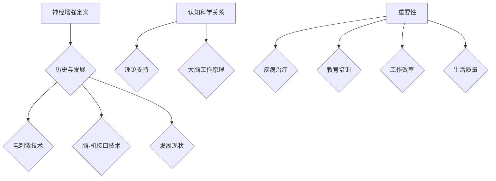

                 

### 第1章：神经增强概述

#### 1.1 神经增强的定义

神经增强（Neural Enhancement）是指利用技术手段对人类大脑的神经活动进行干预，以提升认知能力、情绪调节、记忆等功能的一种技术。其核心在于通过直接或间接的方式，调节神经元的电信号传递，从而优化大脑的信息处理能力。

在认知科学领域，神经增强被视为一种可能实现人类潜能提升的有效途径。传统的认知增强手段，如药物、训练等，往往局限于某一特定方面，而神经增强则试图通过更直接、精准的方式影响大脑功能。

#### 1.2 神经增强的历史与发展

神经增强技术的发展可以追溯到20世纪中期。早期的研究主要集中在电刺激技术，通过植入电极直接刺激大脑特定区域来改善认知功能。随着神经科学和工程学的发展，脑-机接口（Brain-Computer Interface, BCI）技术的出现，使得神经增强进入了新的阶段。

近年来，随着神经影像学、信号处理、生物材料等技术的进步，神经增强技术的应用范围不断扩大，从医疗领域扩展到教育、工业等多个方面。例如，神经刺激器被用于治疗癫痫、帕金森病等神经系统疾病，而脑-机接口技术则被应用于辅助肢体瘫痪患者进行日常活动。

#### 1.3 神经增强与认知科学的关系

神经增强与认知科学之间存在紧密的联系。认知科学关注人类思维过程和认知功能的机制，而神经增强则试图通过技术手段直接干预这些机制，以提升认知能力。

通过神经增强技术，研究人员可以更深入地理解大脑的工作原理，探索认知功能的潜在提升途径。同时，认知科学的研究成果也为神经增强技术的研发提供了理论支持。

#### 1.4 神经增强的重要性

神经增强技术在提高人类认知能力方面具有重要意义。首先，它有望解决一些严重的神经系统疾病，如阿尔茨海默病、帕金森病等。其次，神经增强技术可以用于教育和培训，帮助人们更好地学习新知识和技能。此外，神经增强还有助于提高工作效率，增强情绪调节能力，从而改善生活质量。

然而，神经增强技术也带来了一系列伦理和社会问题，如技术滥用、隐私保护等。这些问题需要我们在推动神经增强技术发展的同时，进行深入思考和规范管理。

**流程图：**

#### 1.5 文章摘要

本文旨在探讨神经增强技术，包括其定义、历史与发展、与认知科学的关系以及重要性。文章首先介绍了神经增强的定义和基本概念，随后回顾了其发展历史，并探讨了神经增强与认知科学之间的紧密联系。文章还分析了神经增强技术在提高人类认知能力方面的潜在应用，并讨论了其可能带来的伦理和社会问题。通过本文的探讨，我们可以更全面地了解神经增强技术的现状及其未来发展趋势。

