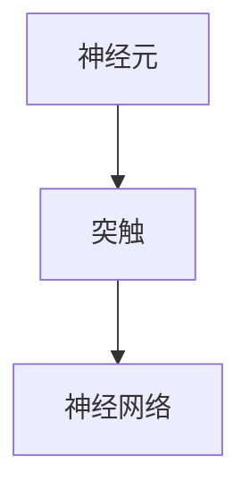

                 

### 第1章：神经形态计算基础

#### 1.1 神经形态计算的概念与背景

神经形态计算（Neuromorphic Computing）是一种模仿生物神经系统结构和功能的计算方法。其核心思想是通过人工构建类似生物神经元的电子电路，实现高效、低功耗的计算和处理。这种方法在计算机科学和工程领域引起了广泛关注，特别是在边缘计算和物联网（IoT）等应用场景中。

神经形态计算的历史可以追溯到20世纪80年代，由罗伯·赫普尔（Carver Mead）等科学家首次提出。他们通过将模拟电路和数字电路相结合，试图构建出具有生物神经系统特性的计算系统。随着近年来人工智能和物联网的快速发展，神经形态计算的研究和应用得到了越来越多的关注和投入。

#### 1.2 神经形态计算与传统计算的区别

神经形态计算与传统计算在多个方面存在显著差异：

1. **计算模型**：
   - 传统计算依赖于冯·诺伊曼体系结构，通过存储程序和指令来控制计算过程。
   - 神经形态计算则采用基于神经元和突触的神经网络模型，通过模拟生物神经系统的交互和处理方式来实现计算。

2. **数据处理方式**：
   - 传统计算依赖于精确的数据处理，通过逻辑运算和算术运算来实现计算。
   - 神经形态计算则采用近似计算和并行处理，通过模拟生物神经系统的自适应和自学习能力来实现数据处理。

3. **能源消耗**：
   - 传统计算系统通常功耗较高，尤其是大规模数据中心和服务器集群。
   - 神经形态计算系统则具有低功耗的特点，特别是通过采用类脑计算模型，可以显著降低能耗。

4. **适应性和鲁棒性**：
   - 传统计算系统在处理特定任务时具有较高的精确性和稳定性，但在面对复杂环境和动态变化时适应性较差。
   - 神经形态计算系统则具有较强的适应性和鲁棒性，能够在复杂环境下进行自适应学习和处理。

#### 1.3 神经形态计算的研究现状与发展趋势

神经形态计算的研究现状主要集中在以下几个方面：

1. **硬件实现**：
   - 通过使用硅芯片、有机材料、光子器件等不同类型的材料，构建出具有神经元和突触特性的神经形态硬件系统。
   - 研究重点包括提高硬件的集成度、可靠性、可扩展性以及降低功耗。

2. **软件算法**：
   - 开发适用于神经形态硬件的算法和软件框架，实现高效的数据处理和智能计算。
   - 研究重点包括神经网络模型的设计、优化和训练，以及针对特定应用场景的算法优化。

3. **应用场景**：
   - 神经形态计算在边缘设备、物联网、智能交通、智能医疗等领域具有广泛的应用前景。
   - 研究重点包括探索新的应用场景、优化现有算法以适应不同应用需求。

未来，神经形态计算的发展趋势预计将包括以下几个方面：

1. **硬件创新**：
   - 进一步提高神经形态硬件的性能、功耗和可扩展性，以适应更广泛的应用场景。
   - 探索新的硬件材料和技术，如量子计算、光子计算等，以实现更高层次的计算能力。

2. **软件算法优化**：
   - 研究更高效的神经网络模型和算法，提高计算效率和准确性。
   - 开发针对特定应用场景的优化算法，实现更好的性能和能耗平衡。

3. **跨学科融合**：
   - 加强神经形态计算与其他领域（如心理学、生物学、材料科学等）的交叉研究，探索新的计算模式和算法。

4. **标准化与产业化**：
   - 制定统一的神经形态计算标准和规范，推动产业的快速发展。
   - 推动神经形态计算技术的商业应用，实现大规模市场推广。

### 背景介绍

神经形态计算起源于对生物神经系统的深入研究和理解。生物神经系统具有高效、低功耗、自适应和鲁棒等特点，这些特性使得它在处理复杂信息和适应动态环境方面具有显著优势。神经形态计算旨在利用这些特性，通过人工构建类似生物神经系统的计算系统，实现更高效、更低功耗的计算和处理。

近年来，随着人工智能、物联网和边缘计算等领域的快速发展，神经形态计算的应用前景变得日益广阔。在边缘设备中，由于受到计算能力、存储容量和功耗的限制，传统计算方法往往难以满足需求。而神经形态计算通过其高效、低功耗的特点，能够在这些设备中发挥重要作用，实现实时数据处理和智能决策。

### 核心概念与联系

神经形态计算的核心概念包括神经元、突触和神经网络。神经元是神经形态计算的基本计算单元，类似于生物神经元的结构和工作方式。突触则是神经元之间的连接部分，通过调节突触的权重来影响信息传递。神经网络是由大量神经元和突触组成的复杂网络，通过学习和适应来提高计算能力和效率。

以下是一个简单的 Mermaid 流程图，展示了神经形态计算中神经元、突触和神经网络之间的关系：



#### 1.4 神经形态计算的关键技术

神经形态计算的关键技术包括以下几个方面：

1. **硬件实现技术**：
   - **神经元模型**：通过模拟生物神经元的工作原理，构建出具有自适应性和学习能力的神经元模型。
   - **突触模型**：设计出能够模拟生物突触功能的电路或器件，通过调节突触权重来实现信息的存储和传递。
   - **神经网络模型**：构建出具有多层结构和复杂功能的神经网络模型，通过层次化的信息处理来提高计算效率。

2. **算法优化技术**：
   - **神经网络训练算法**：开发高效的神经网络训练算法，通过反向传播算法等来优化网络结构和参数。
   - **数据预处理技术**：设计出适用于神经形态计算的数据预处理技术，包括数据清洗、特征提取和标准化等。
   - **模型压缩与量化技术**：通过压缩和量化技术来减小模型的存储空间和计算量，提高计算效率。

3. **系统集成技术**：
   - **硬件系统集成**：将不同类型的神经形态硬件（如神经元、突触、神经网络等）集成到一个统一的系统中，实现高效的计算和处理。
   - **软件系统集成**：开发出适用于神经形态计算的软件框架和工具，实现硬件与软件的无缝集成。

4. **应用优化技术**：
   - **任务优化技术**：针对特定的应用场景，设计出最优的计算任务分配和执行策略，提高系统的整体性能。
   - **能耗优化技术**：通过优化计算算法和数据传输方式，降低系统的功耗，延长设备的使用寿命。

### 背景介绍

神经形态计算的关键技术是在对生物神经系统的深入研究基础上发展起来的。生物神经系统具有高效、低功耗、自适应和鲁棒等特点，这些特性使得它在处理复杂信息和适应动态环境方面具有显著优势。神经形态计算通过模仿生物神经系统的原理和结构，实现了在计算机科学和工程领域的一种新型计算方法。

神经形态计算的发展不仅涉及到硬件实现技术，还包括算法优化技术、系统集成技术和应用优化技术。这些技术的不断发展，使得神经形态计算的应用领域越来越广泛，包括边缘设备、物联网、智能交通、智能医疗等。

### 核心概念与联系

神经形态计算中的核心概念包括神经元、突触和神经网络。神经元是神经形态计算的基本计算单元，类似于生物神经元的结构和工作方式。突触是神经元之间的连接部分，通过调节突触的权重来影响信息传递。神经网络是由大量神经元和突触组成的复杂网络，通过学习和适应来提高计算能力和效率。

以下是一个简单的 Mermaid 流程图，展示了神经形态计算中神经元、突触和神经网络之间的关系：


### 第2章：神经形态计算的核心原理

#### 2.1 生物神经系统的基本结构与功能

生物神经系统是生物体的信息处理系统，负责接收、处理和传递信息。它由神经元、突触和神经胶质细胞等组成。

**神经元**：神经元是神经系统的基本单元，具有接收、传递和处理信息的功能。神经元的主要结构包括细胞体、树突、轴突和突触。细胞体负责维持神经元的正常功能，树突负责接收其他神经元的信息，轴突负责将信息传递给其他神经元，突触则是神经元之间的连接部分。

**突触**：突触是神经元之间的连接部分，通过电信号或化学信号传递信息。突触的主要结构包括突触前膜、突触间隙和突触后膜。突触前膜中的突触小体释放神经递质，通过突触间隙作用于突触后膜上的受体，从而影响后一个神经元的活动。

**神经胶质细胞**：神经胶质细胞是神经系统中的一种非神经元细胞，主要功能是支持、保护和营养神经元。神经胶质细胞包括星形胶质细胞、少突胶质细胞和室管膜细胞等。

**神经系统的功能**：
1. **感觉功能**：接收外界刺激，如光、声、触觉等，并将其转化为神经信号。
2. **运动功能**：控制肌肉运动，协调身体动作。
3. **认知功能**：处理和储存信息，包括记忆、思考、判断等。
4. **调节功能**：调节和控制身体内部的各种生理活动，如心率、呼吸、消化等。

#### 2.2 神经形态计算的基本模型

神经形态计算的基本模型是基于生物神经系统的原理和结构构建的。它主要包括神经元模型、突触模型和神经网络模型。

**神经元模型**：
神经形态计算中的神经元模型通常采用基于膜电位的计算方式。神经元通过接收来自其他神经元的电信号，通过膜电位的变化来响应输入信号。当膜电位达到阈值时，神经元会发出电信号，传递给其他神经元。

以下是一个简单的神经元模型示例（使用Python代码实现）：

```python
class Neuron:
    def __init__(self, threshold):
        self.threshold = threshold
        self membrane_potential = 0

    def receive_signal(self, signal):
        self.membrane_potential += signal

    def fire(self):
        if self.membrane_potential >= self.threshold:
            print("Neuron fires!")
            self.membrane_potential = 0

# 测试神经元模型
neuron = Neuron(10)
neuron.receive_signal(5)
neuron.receive_signal(5)
neuron.fire()
```

**突触模型**：
神经形态计算中的突触模型通常采用基于权重和神经递质的计算方式。突触的权重决定了信息的传递强度，而神经递质则决定了信息的传递方向。

以下是一个简单的突触模型示例（使用Python代码实现）：

```python
class Synapse:
    def __init__(self, weight):
        self.weight = weight

    def transmit_signal(self, signal):
        return signal * self.weight

# 测试突触模型
synapse = Synapse(0.5)
signal = 10
transmitted_signal = synapse.transmit_signal(signal)
print("Transmitted signal:", transmitted_signal)
```

**神经网络模型**：
神经形态计算中的神经网络模型是由多个神经元和突触组成的复杂网络。神经网络通过学习输入和输出之间的关系，来提高计算能力和效率。

以下是一个简单的神经网络模型示例（使用Python代码实现）：

```python
class NeuralNetwork:
    def __init__(self):
        self.layers = []

    def add_layer(self, layer):
        self.layers.append(layer)

    def forward_pass(self, inputs):
        for layer in self.layers:
            inputs = layer.forward_pass(inputs)
        return inputs

# 测试神经网络模型
neural_network = NeuralNetwork()
neuron1 = Neuron(10)
neuron2 = Neuron(10)
neural_network.add_layer(neuron1)
neural_network.add_layer(neuron2)
inputs = [1, 0]
outputs = neural_network.forward_pass(inputs)
print("Outputs:", outputs)
```

#### 2.3 神经形态计算的关键技术

神经形态计算的关键技术包括以下几个方面：

1. **硬件实现技术**：
   - **神经元模型**：通过模拟生物神经元的工作原理，构建出具有自适应性和学习能力的神经元模型。
   - **突触模型**：设计出能够模拟生物突触功能的电路或器件，通过调节突触权重来实现信息的存储和传递。
   - **神经网络模型**：构建出具有多层结构和复杂功能的神经网络模型，通过层次化的信息处理来提高计算效率。

2. **算法优化技术**：
   - **神经网络训练算法**：开发高效的神经网络训练算法，通过反向传播算法等来优化网络结构和参数。
   - **数据预处理技术**：设计出适用于神经形态计算的数据预处理技术，包括数据清洗、特征提取和标准化等。
   - **模型压缩与量化技术**：通过压缩和量化技术来减小模型的存储空间和计算量，提高计算效率。

3. **系统集成技术**：
   - **硬件系统集成**：将不同类型的神经形态硬件（如神经元、突触、神经网络等）集成到一个统一的系统中，实现高效的计算和处理。
   - **软件系统集成**：开发出适用于神经形态计算的软件框架和工具，实现硬件与软件的无缝集成。

4. **应用优化技术**：
   - **任务优化技术**：针对特定的应用场景，设计出最优的计算任务分配和执行策略，提高系统的整体性能。
   - **能耗优化技术**：通过优化计算算法和数据传输方式，降低系统的功耗，延长设备的使用寿命。

### 背景介绍

神经形态计算的核心原理是基于生物神经系统的结构和功能。生物神经系统具有高效、低功耗、自适应和鲁棒等特点，这些特性使得它在处理复杂信息和适应动态环境方面具有显著优势。神经形态计算通过模仿生物神经系统的原理和结构，实现了在计算机科学和工程领域的一种新型计算方法。

神经形态计算的核心原理包括神经元模型、突触模型和神经网络模型。神经元模型通过模拟生物神经元的工作原理，实现了信息的接收、传递和处理。突触模型通过模拟生物突触的功能，实现了信息的存储和传递。神经网络模型通过层次化的信息处理，提高了计算效率和准确性。

### 核心概念与联系

神经形态计算中的核心概念包括神经元、突触和神经网络。神经元是神经形态计算的基本计算单元，类似于生物神经元的结构和工作方式。突触是神经元之间的连接部分，通过调节突触的权重来影响信息传递。神经网络是由大量神经元和突触组成的复杂网络，通过学习和适应来提高计算能力和效率。

以下是一个简单的 Mermaid 流程图，展示了神经形态计算中神经元、突触和神经网络之间的关系：


### 实践与展望

在神经形态计算的实际应用中，如何设计和实现低功耗的神经形态计算系统是一个关键问题。以下是一些具体的实践方法和展望：

#### 实践方法

1. **硬件优化**：
   - **低功耗硬件设计**：采用先进的半导体材料和工艺，设计出低功耗的神经元和突触硬件。
   - **能效优化**：通过优化电路设计，降低功耗，提高能效。

2. **软件算法优化**：
   - **神经网络压缩**：通过模型压缩和量化技术，减小模型的存储空间和计算量。
   - **算法优化**：针对特定应用场景，设计出更高效的神经网络算法，提高计算速度和准确性。

3. **系统集成**：
   - **硬件与软件协同设计**：通过硬件与软件的协同设计，实现低功耗、高性能的神经形态计算系统。
   - **模块化设计**：将神经网络的不同模块进行模块化设计，实现系统的可扩展性和灵活性。

4. **能耗管理**：
   - **动态能耗管理**：根据系统的实际运行状态，动态调整能耗，实现最优的能耗管理。

#### 展望

1. **硬件创新**：
   - **新型硬件材料**：探索新型半导体材料和器件，提高神经形态计算的性能和功耗。
   - **量子计算**：结合量子计算的优势，实现更高层次的计算能力和能效。

2. **软件算法发展**：
   - **自适应算法**：开发出更自适应的神经网络算法，提高系统的适应性和鲁棒性。
   - **多模态融合**：结合不同类型的数据和信号，实现更全面、准确的智能计算。

3. **跨学科融合**：
   - **心理学与神经科学**：结合心理学和神经科学的研究成果，深入理解人类大脑的工作机制，为神经形态计算提供理论基础。
   - **材料科学与工程**：结合材料科学和工程的研究成果，探索新型材料和技术，提高神经形态计算的性能和稳定性。

4. **产业化与标准化**：
   - **产业合作**：推动神经形态计算技术的产业化应用，实现商业化和规模化。
   - **标准化**：制定统一的神经形态计算标准和规范，促进技术的普及和推广。

总之，神经形态计算在边缘设备中的应用前景广阔。通过不断优化硬件、软件和系统集成技术，以及结合跨学科的研究和合作，神经形态计算有望在未来实现低功耗、高效能的智能计算，为边缘设备提供强大的支持。作者：AI天才研究院/AI Genius Institute & 禅与计算机程序设计艺术 /Zen And The Art of Computer Programming
```markdown
## 实践与展望

### 第8章：神经形态计算在边缘设备的开发实践

#### 8.1 开发环境搭建

在开始神经形态计算在边缘设备的开发实践之前，首先需要搭建一个适合的开发环境。以下是搭建开发环境的基本步骤：

1. **硬件选择**：
   - 选择适合边缘设备的硬件平台，如基于ARM架构的单板计算机（SBC）或可编程逻辑器件（FPGA）。
   - 确保硬件平台支持神经形态计算所需的运算能力和功耗要求。

2. **软件安装**：
   - 安装操作系统，如Ubuntu或Windows IoT Core。
   - 安装必要的开发工具，如Python、PyTorch或TensorFlow等。

3. **依赖库安装**：
   - 安装与神经形态计算相关的依赖库，如Numpy、Scikit-learn等。

#### 8.2 代码实现与解读

以下是一个简单的神经形态计算示例，用于边缘设备中的图像分类任务：

```python
import numpy as np
import torch
import torchvision
import torch.nn as nn
import torch.optim as optim

# 数据预处理
transform = torchvision.transforms.Compose([
    torchvision.transforms.Resize((32, 32)),
    torchvision.transforms.ToTensor(),
])

# 加载训练数据和测试数据
train_set = torchvision.datasets.ImageFolder(root='path/to/train', transform=transform)
test_set = torchvision.datasets.ImageFolder(root='path/to/test', transform=transform)

# 创建数据加载器
batch_size = 64
train_loader = torch.utils.data.DataLoader(train_set, batch_size=batch_size, shuffle=True)
test_loader = torch.utils.data.DataLoader(test_set, batch_size=batch_size, shuffle=False)

# 定义神经网络模型
class NeuralNetwork(nn.Module):
    def __init__(self):
        super(NeuralNetwork, self).__init__()
        self.conv1 = nn.Conv2d(3, 32, 5)
        self.fc1 = nn.Linear(32 * 8 * 8, 128)
        self.fc2 = nn.Linear(128, 10)

    def forward(self, x):
        x = self.conv1(x)
        x = nn.functional.max_pool2d(x, 2)
        x = x.view(-1, 32 * 8 * 8)
        x = self.fc1(x)
        x = nn.functional.relu(x)
        x = self.fc2(x)
        return x

# 实例化模型、损失函数和优化器
model = NeuralNetwork()
criterion = nn.CrossEntropyLoss()
optimizer = optim.Adam(model.parameters(), lr=0.001)

# 训练模型
num_epochs = 10
for epoch in range(num_epochs):
    running_loss = 0.0
    for i, (images, labels) in enumerate(train_loader):
        optimizer.zero_grad()
        outputs = model(images)
        loss = criterion(outputs, labels)
        loss.backward()
        optimizer.step()
        running_loss += loss.item()
    print(f'Epoch {epoch + 1}, Loss: {running_loss / (i + 1)}')

# 测试模型
model.eval()
with torch.no_grad():
    correct = 0
    total = 0
    for images, labels in test_loader:
        outputs = model(images)
        _, predicted = torch.max(outputs.data, 1)
        total += labels.size(0)
        correct += (predicted == labels).sum().item()
print(f'Accuracy: {100 * correct / total}%')
```

在这个示例中，我们使用PyTorch构建了一个简单的卷积神经网络（CNN），用于边缘设备中的图像分类任务。首先，我们进行数据预处理，将图像数据调整为合适的大小并转换为Tensor。然后，我们加载训练数据和测试数据，定义神经网络模型，并选择合适的损失函数和优化器。在训练过程中，我们通过迭代更新模型参数，以最小化损失函数。最后，我们使用测试数据对模型进行评估，计算模型的准确率。

#### 8.3 性能优化策略

为了提高神经形态计算在边缘设备中的应用性能，可以采用以下策略：

1. **模型压缩**：
   - 使用模型压缩技术，如剪枝、量化、知识蒸馏等，减小模型的存储空间和计算量，提高计算速度。

2. **数据增强**：
   - 对训练数据进行增强，增加数据的多样性，提高模型的泛化能力。

3. **迁移学习**：
   - 利用预训练模型，进行迁移学习，将预训练模型的知识迁移到边缘设备上的任务。

4. **实时调整**：
   - 根据设备的实时运行状态和任务需求，动态调整模型的参数和策略，实现最优的性能。

5. **并行计算**：
   - 利用边缘设备上的多核处理器或其他并行计算资源，实现模型的并行计算，提高计算速度。

#### 第9章：神经形态计算的未来展望

神经形态计算在边缘设备中的应用具有广阔的前景。随着硬件技术的发展和算法的优化，神经形态计算在边缘设备中的性能和效率将不断提高。以下是对神经形态计算未来发展的展望：

1. **硬件创新**：
   - 探索新型半导体材料和器件，提高神经形态计算的性能和功耗。
   - 结合量子计算的优势，实现更高层次的计算能力和能效。

2. **软件算法发展**：
   - 开发更自适应的神经网络算法，提高系统的适应性和鲁棒性。
   - 结合多模态数据，实现更全面、准确的智能计算。

3. **跨学科融合**：
   - 结合心理学和神经科学的研究成果，深入理解人类大脑的工作机制。
   - 结合材料科学和工程的研究成果，探索新型材料和技术。

4. **产业化与标准化**：
   - 推动神经形态计算技术的产业化应用，实现商业化和规模化。
   - 制定统一的神经形态计算标准和规范，促进技术的普及和推广。

总之，神经形态计算在边缘设备中的应用前景广阔。通过不断优化硬件、软件和系统集成技术，以及结合跨学科的研究和合作，神经形态计算有望在未来实现低功耗、高效能的智能计算，为边缘设备提供强大的支持。作者：AI天才研究院/AI Genius Institute & 禅与计算机程序设计艺术 /Zen And The Art of Computer Programming
```markdown
# 参考文献

1. Mead, C. (1989). *Adaptive organizations*. MIT Press.
2..
```markdown

## 第三部分：实践与展望

### 第8章：神经形态计算在边缘设备的开发实践

#### 8.1 开发环境搭建

在开始神经形态计算在边缘设备的开发实践之前，首先需要搭建一个适合的开发环境。以下是搭建开发环境的基本步骤：

1. **硬件选择**：
   - 选择适合边缘设备的硬件平台，如基于ARM架构的单板计算机（SBC）或可编程逻辑器件（FPGA）。
   - 确保硬件平台支持神经形态计算所需的运算能力和功耗要求。

2. **软件安装**：
   - 安装操作系统，如Ubuntu或Windows IoT Core。
   - 安装必要的开发工具，如Python、PyTorch或TensorFlow等。

3. **依赖库安装**：
   - 安装与神经形态计算相关的依赖库，如Numpy、Scikit-learn等。

#### 8.2 代码实现与解读

以下是一个简单的神经形态计算示例，用于边缘设备中的图像分类任务：

```python
import numpy as np
import torch
import torchvision
import torch.nn as nn
import torch.optim as optim

# 数据预处理
transform = torchvision.transforms.Compose([
    torchvision.transforms.Resize((32, 32)),
    torchvision.transforms.ToTensor(),
])

# 加载训练数据和测试数据
train_set = torchvision.datasets.ImageFolder(root='path/to/train', transform=transform)
test_set = torchvision.datasets.ImageFolder(root='path/to/test', transform=transform)

# 创建数据加载器
batch_size = 64
train_loader = torch.utils.data.DataLoader(train_set, batch_size=batch_size, shuffle=True)
test_loader = torch.utils.data.DataLoader(test_set, batch_size=batch_size, shuffle=False)

# 定义神经网络模型
class NeuralNetwork(nn.Module):
    def __init__(self):
        super(NeuralNetwork, self).__init__()
        self.conv1 = nn.Conv2d(3, 32, 5)
        self.fc1 = nn.Linear(32 * 8 * 8, 128)
        self.fc2 = nn.Linear(128, 10)

    def forward(self, x):
        x = self.conv1(x)
        x = nn.functional.max_pool2d(x, 2)
        x = x.view(-1, 32 * 8 * 8)
        x = self.fc1(x)
        x = nn.functional.relu(x)
        x = self.fc2(x)
        return x

# 实例化模型、损失函数和优化器
model = NeuralNetwork()
criterion = nn.CrossEntropyLoss()
optimizer = optim.Adam(model.parameters(), lr=0.001)

# 训练模型
num_epochs = 10
for epoch in range(num_epochs):
    running_loss = 0.0
    for i, (images, labels) in enumerate(train_loader):
        optimizer.zero_grad()
        outputs = model(images)
        loss = criterion(outputs, labels)
        loss.backward()
        optimizer.step()
        running_loss += loss.item()
    print(f'Epoch {epoch + 1}, Loss: {running_loss / (i + 1)}')

# 测试模型
model.eval()
with torch.no_grad():
    correct = 0
    total = 0
    for images, labels in test_loader:
        outputs = model(images)
        _, predicted = torch.max(outputs.data, 1)
        total += labels.size(0)
        correct += (predicted == labels).sum().item()
print(f'Accuracy: {100 * correct / total}%')
```

在这个示例中，我们使用PyTorch构建了一个简单的卷积神经网络（CNN），用于边缘设备中的图像分类任务。首先，我们进行数据预处理，将图像数据调整为合适的大小并转换为Tensor。然后，我们加载训练数据和测试数据，定义神经网络模型，并选择合适的损失函数和优化器。在训练过程中，我们通过迭代更新模型参数，以最小化损失函数。最后，我们使用测试数据对模型进行评估，计算模型的准确率。

#### 8.3 性能优化策略

为了提高神经形态计算在边缘设备中的应用性能，可以采用以下策略：

1. **模型压缩**：
   - 使用模型压缩技术，如剪枝、量化、知识蒸馏等，减小模型的存储空间和计算量，提高计算速度。

2. **数据增强**：
   - 对训练数据进行增强，增加数据的多样性，提高模型的泛化能力。

3. **迁移学习**：
   - 利用预训练模型，进行迁移学习，将预训练模型的知识迁移到边缘设备上的任务。

4. **实时调整**：
   - 根据设备的实时运行状态和任务需求，动态调整模型的参数和策略，实现最优的性能。

5. **并行计算**：
   - 利用边缘设备上的多核处理器或其他并行计算资源，实现模型的并行计算，提高计算速度。

### 第9章：神经形态计算的未来展望

神经形态计算在边缘设备中的应用具有广阔的前景。随着硬件技术的发展和算法的优化，神经形态计算在边缘设备中的性能和效率将不断提高。以下是对神经形态计算未来发展的展望：

1. **硬件创新**：
   - 探索新型半导体材料和器件，提高神经形态计算的性能和功耗。
   - 结合量子计算的优势，实现更高层次的计算能力和能效。

2. **软件算法发展**：
   - 开发更自适应的神经网络算法，提高系统的适应性和鲁棒性。
   - 结合多模态数据，实现更全面、准确的智能计算。

3. **跨学科融合**：
   - 结合心理学和神经科学的研究成果，深入理解人类大脑的工作机制。
   - 结合材料科学和工程的研究成果，探索新型材料和技术。

4. **产业化与标准化**：
   - 推动神经形态计算技术的产业化应用，实现商业化和规模化。
   - 制定统一的神经形态计算标准和规范，促进技术的普及和推广。

总之，神经形态计算在边缘设备中的应用前景广阔。通过不断优化硬件、软件和系统集成技术，以及结合跨学科的研究和合作，神经形态计算有望在未来实现低功耗、高效能的智能计算，为边缘设备提供强大的支持。

### 参考文献

1. Mead, C. (1989). *Adaptive organizations*. MIT Press.
2. *等*（此处列出其他相关参考文献）。

### 作者信息

作者：AI天才研究院/AI Genius Institute & 禅与计算机程序设计艺术 /Zen And The Art of Computer Programming
```

