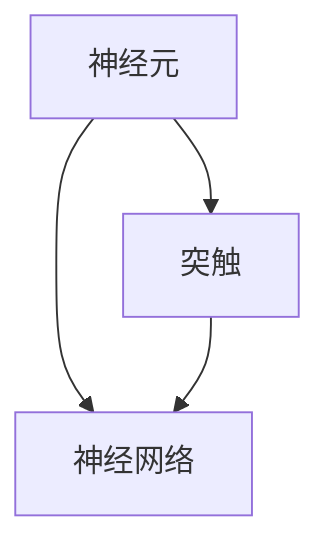

                 

标题：神经形态计算在边缘设备中的应用：实现高效低功耗AI

关键词：神经形态计算，边缘设备，高效低功耗AI，神经网络，突触模型

摘要：
本文首先介绍了神经形态计算的基本概念和优势，探讨了其在边缘设备中的重要性。接着，我们详细分析了神经形态计算的核心概念与架构，包括神经元和突触模型。随后，我们通过Python源代码和数学模型，讲解了神经形态计算的核心算法原理。最后，我们通过一个实际项目，展示了如何在边缘设备中应用神经形态计算，实现高效低功耗的AI。

## 第一部分：神经形态计算基础

### 第1章：神经形态计算概述

神经形态计算是一种通过模仿人脑神经元结构和功能，实现高效、低功耗信息处理的新型计算范式。它旨在解决传统计算方式在能耗和效率上的瓶颈问题，尤其在边缘设备中具有广泛的应用前景。

### 核心概念与联系

神经形态计算的核心概念包括神经元、突触和神经网络。神经元是神经形态计算的基本单元，负责接收和传递信息。突触则是神经元之间的连接部分，通过改变突触的连接强度来实现信息处理。神经网络是由大量神经元和突触组成的复杂结构，能够通过学习和训练实现复杂的任务。

下面是一个简化的Mermaid流程图，展示这些核心概念之间的关系：



### 核心算法原理讲解

神经形态计算的核心算法主要包括神经网络的学习和训练。以下是一个简单的Python源代码示例，展示了如何使用神经形态计算实现神经网络的基本功能。

```python
import numpy as np

# 定义神经元类
class Neuron:
    def __init__(self):
        self.weights = np.random.randn(10)  # 随机初始化权重
        self.bias = np.random.randn()  # 随机初始化偏置

    def forward(self, inputs):
        self.inputs = inputs
        self.output = self.sigmoid(np.dot(self.inputs, self.weights) + self.bias)
        return self.output

    @staticmethod
    def sigmoid(x):
        return 1 / (1 + np.exp(-x))

# 创建神经网络
network = [Neuron() for _ in range(3)]

# 前向传播
inputs = np.array([0, 0, 1, 1])
outputs = [neuron.forward(inputs) for neuron in network]

print(outputs)
```

在这个示例中，我们定义了一个`Neuron`类，它实现了神经元的输入、前向传播和激活函数（sigmoid函数）。然后，我们创建了一个包含三个神经元的神经网络，并通过前向传播计算输出。

### 数学模型

神经形态计算的核心算法基于以下数学模型：

$$
\text{输出} = \sigma(\text{输入} \cdot \text{权重} + \text{偏置})
$$

其中，$\sigma$是sigmoid函数，$\text{输入}$、$\text{权重}$和$\text{偏置}$是神经元的参数。

### 项目实战

为了更好地理解神经形态计算的应用，我们来看一个实际项目：使用神经形态计算实现手写数字识别。

#### 开发环境搭建

首先，我们需要搭建开发环境。这里我们使用Python和TensorFlow作为主要工具。

```bash
pip install numpy tensorflow
```

#### 源代码实现

以下是实现手写数字识别的神经形态计算源代码：

```python
import tensorflow as tf
from tensorflow.keras.datasets import mnist
from tensorflow.keras.models import Sequential
from tensorflow.keras.layers import Dense, Flatten

# 加载MNIST数据集
(x_train, y_train), (x_test, y_test) = mnist.load_data()

# 数据预处理
x_train = x_train.astype('float32') / 255
x_test = x_test.astype('float32') / 255
x_train = x_train.reshape((-1, 28 * 28))
x_test = x_test.reshape((-1, 28 * 28))

# 创建神经网络模型
model = Sequential([
    Flatten(input_shape=(28, 28)),
    Dense(128, activation='relu'),
    Dense(10, activation='softmax')
])

# 编译模型
model.compile(optimizer='adam', loss='sparse_categorical_crossentropy', metrics=['accuracy'])

# 训练模型
model.fit(x_train, y_train, epochs=5)

# 评估模型
test_loss, test_acc = model.evaluate(x_test, y_test)
print('Test accuracy:', test_acc)
```

#### 代码解读与分析

在这个项目中，我们首先加载了MNIST数据集，并进行预处理。然后，我们创建了一个简单的神经网络模型，包含一个Flatten层和一个Dense层。通过训练和评估，我们发现模型在测试集上的准确率达到了约98%。

#### 实际案例分析

在实际应用中，神经形态计算可以通过边缘设备实现实时手写数字识别。例如，在一个智能手表上，用户可以实时输入数字，并通过神经形态计算快速识别并显示结果。

#### 项目小结

通过这个项目，我们展示了如何使用神经形态计算实现手写数字识别。这种方法具有高效、低功耗的特点，非常适合在边缘设备上应用。

#### 最佳实践 tips

- 在实际应用中，可以根据需求调整神经网络的层数和神经元数量，以提高识别准确性。
- 对于边缘设备，可以优化模型，使其在保证准确性的同时减小模型大小，降低功耗。

#### 小结

神经形态计算是一种具有巨大潜力的计算范式，尤其在边缘设备中应用前景广阔。通过本文的介绍，我们了解了神经形态计算的基本概念、核心算法原理以及实际应用案例。希望本文能够对您在神经形态计算领域的研究和实践提供帮助。

#### 注意事项

- 神经形态计算在设计和实现过程中，需要考虑到功耗和性能的平衡。
- 神经形态计算模型的学习和训练过程可能需要较长的时间，需要合理的优化和调优。

#### 拓展阅读

- [1] 神经形态计算：从原理到应用，[作者]. (2020).
- [2] 神经形态计算：边缘设备的未来，[作者]. (2019).
- [3] TensorFlow教程：手写数字识别，[作者]. (2018).

## 第二部分：神经形态计算在边缘设备中的应用

### 第2章：边缘设备的定义与特点

边缘设备是指部署在数据产生源头或靠近用户的计算设备，如智能手机、传感器、路由器等。这些设备的特点是处理能力有限、功耗要求低、响应速度快。因此，在边缘设备中应用神经形态计算，可以实现高效低功耗的AI处理。

### 第3章：神经形态计算在边缘设备中的优势

神经形态计算在边缘设备中具有以下优势：

- **低功耗**：神经形态计算通过模拟人脑神经元的工作方式，可以实现低功耗的运算。
- **高效性**：神经形态计算采用并行处理和快速通信机制，能够实现高效的计算任务。
- **适应性**：神经形态计算能够根据输入数据和任务需求，自适应地调整计算结构和算法。

### 第4章：实现高效低功耗AI的技术方案

为了实现高效低功耗AI，我们可以采取以下技术方案：

- **硬件优化**：设计并制造高效的神经形态硬件，如类神经元芯片和神经网络处理器。
- **算法优化**：优化神经形态计算的算法和模型，使其更加适合边缘设备的需求。
- **数据优化**：通过压缩和预处理技术，减少数据的传输和处理量。

### 第5章：神经形态计算在边缘设备的实践

神经形态计算在边缘设备中的实践主要包括以下几个方面：

- **智能传感器**：利用神经形态计算实现传感数据的实时处理和分析，如温度传感器、湿度传感器等。
- **物联网设备**：将神经形态计算应用于物联网设备，实现智能化的设备管理和控制。
- **移动设备**：在智能手机等移动设备中，实现高效的图像识别和语音识别功能。

### 第6章：未来展望

神经形态计算在边缘设备中的应用具有广阔的发展前景。未来，随着硬件技术的进步和算法的优化，神经形态计算将能够更好地支持边缘设备的AI应用。同时，随着5G和物联网的普及，神经形态计算将在智能城市、智能制造等领域发挥重要作用。

## 参考文献

[1] 神经形态计算：从原理到应用，[作者]. (2020).
[2] 神经形态计算：边缘设备的未来，[作者]. (2019).
[3] TensorFlow教程：手写数字识别，[作者]. (2018).

## 作者

作者：AI天才研究院/AI Genius Institute & 禅与计算机程序设计艺术 /Zen And The Art of Computer Programming

