                 

## 引言：神经符号AI概述

### 神经符号AI的定义与背景

神经符号AI（Neural Symbolic AI）是一种结合了神经网络和符号推理技术的智能系统，它试图弥补传统AI在处理复杂任务时存在的局限性。神经网络擅长从大量数据中自动提取特征和模式，而符号推理则强调逻辑推理和知识表示，这两者的结合能够使AI系统在处理复杂任务时具备更强的灵活性和鲁棒性。

神经符号AI的背景可以追溯到20世纪80年代，当时人工智能研究社区开始关注如何将符号推理与神经网络相结合，以解决传统AI在处理现实世界问题时遇到的瓶颈。随着深度学习和神经网络技术的快速发展，神经符号AI得到了新的生命力，成为人工智能研究的一个重要方向。

### 神经符号AI的关键技术

神经符号AI的关键技术包括以下几个方面：

1. **神经网络**：神经网络是神经符号AI的核心组件，它通过模仿人脑的神经网络结构来处理数据和学习模式。常见的神经网络类型包括多层感知机（MLP）、卷积神经网络（CNN）和循环神经网络（RNN）。

2. **符号推理**：符号推理技术用于在神经网络学习到的特征和模式之间建立逻辑关系。常见的符号推理技术包括谓词逻辑、产生式规则和模糊逻辑。

3. **知识表示**：知识表示技术用于将神经网络学到的知识转换为符号化的形式，以便进行推理和应用。常见的知识表示方法包括框架表示、语义网络和本体论。

4. **集成学习**：集成学习技术通过将多个模型的结果进行整合，以提高预测的准确性和鲁棒性。常见的集成学习方法包括随机森林、梯度提升机和堆叠泛化。

### 科研进程加速的需求与挑战

科研进程的加速是当今科学研究的重要目标之一。随着科学领域的问题越来越复杂，数据规模日益庞大，科研人员面临着越来越多的挑战，如数据预处理、模型选择、结果解释和跨学科协作等。神经符号AI在这种背景下展现出巨大的潜力，能够解决以下问题：

1. **数据预处理**：神经符号AI能够自动提取数据中的关键特征，减少数据预处理的工作量，提高数据利用率。

2. **模型选择与优化**：神经符号AI可以根据具体问题自动选择和调整模型参数，从而提高模型的准确性和效率。

3. **结果解释**：神经符号AI可以将复杂模型的结果转化为易于理解的形式，帮助科研人员更好地理解研究过程和结果。

4. **跨学科协作**：神经符号AI能够整合不同学科的知识和技术，促进跨学科的研究与合作。

总之，神经符号AI在自动化科学发现中的应用不仅能够加速科研进程，还能够提高科研的准确性和效率，为科学探索提供新的可能性。在接下来的章节中，我们将深入探讨神经符号AI的核心概念、应用场景和技术实现，以帮助读者更好地理解这一前沿技术。## 第1章：神经符号AI基础

### 1.1 人工智能与科研的关系

人工智能（AI）是计算机科学的一个分支，致力于模拟、延伸和扩展人类的智能。在科研领域中，人工智能作为一种强大的工具，已经广泛应用于数据挖掘、模式识别、预测建模和自动化实验设计等环节。人工智能与科研的关系主要体现在以下几个方面：

1. **数据处理能力**：科研过程中产生的数据通常量大且复杂，人工智能能够高效处理这些数据，提取有价值的信息，从而支持科研决策。

2. **提高科研效率**：人工智能技术能够自动化许多重复性工作，如数据收集、预处理和模型训练，从而减少科研人员的工作负担，提高工作效率。

3. **优化实验设计**：人工智能可以通过模拟和预测实验结果，帮助科研人员优化实验设计，减少实验次数，提高实验成功率。

4. **跨学科融合**：人工智能技术能够整合不同学科的知识和工具，促进跨学科的合作与研究，为科学问题的解决提供新的思路和方法。

### 1.2 神经符号AI的原理与架构

神经符号AI是一种结合了神经网络和符号推理的智能系统，其核心思想是利用神经网络从数据中学习特征和模式，并通过符号推理技术将这些模式转化为可解释的、逻辑上一致的推理过程。以下是神经符号AI的基本原理与架构：

#### 1.2.1 神经网络原理

神经网络（Neural Networks）是一种模仿生物神经系统的计算模型。它由大量的神经元（节点）组成，这些神经元通过权重连接形成一个网络结构。神经网络通过学习输入和输出数据之间的关系，来模拟和扩展人类的智能。

1. **神经元与激活函数**：神经元是神经网络的基本计算单元，它通过加权求和处理输入信号，然后通过激活函数产生输出。

2. **多层感知机（MLP）**：多层感知机是一种前馈神经网络，由输入层、多个隐藏层和输出层组成。通过学习输入和输出数据之间的关系，MLP可以实现非线性函数的映射。

3. **卷积神经网络（CNN）**：卷积神经网络是一种专门用于图像处理和识别的神经网络。它通过卷积操作和池化操作，从图像中提取局部特征，并逐步将这些特征组合起来，以实现图像的分类和识别。

4. **循环神经网络（RNN）**：循环神经网络是一种用于序列数据处理的神经网络，它通过内部循环结构来维持信息的状态，从而捕捉序列中的长期依赖关系。

#### 1.2.2 符号推理原理

符号推理（Symbolic Reasoning）是一种基于逻辑和知识的推理过程，它通过符号化的表示形式来表示知识和信息，并进行推理和决策。符号推理的关键在于如何将神经网络学到的特征和模式转化为逻辑上一致的推理过程。

1. **谓词逻辑**：谓词逻辑是一种形式化的逻辑系统，用于表示事实和关系。通过谓词逻辑，可以将神经网络学到的特征表示为逻辑表达式，并进行推理和决策。

2. **产生式规则**：产生式规则是一种基于“如果-那么”逻辑的推理方法。通过将神经网络学到的特征和模式表示为产生式规则，可以进行符号化的推理和决策。

3. **模糊逻辑**：模糊逻辑是一种处理不确定性和模糊性的逻辑系统。通过模糊逻辑，可以将神经网络学到的模糊特征和模式表示为模糊逻辑表达式，并进行推理和决策。

#### 1.2.3 神经符号AI的架构

神经符号AI的架构通常包括以下几个关键部分：

1. **数据输入模块**：该模块负责接收和处理输入数据，包括原始数据和处理后的特征数据。

2. **神经网络模块**：该模块负责使用神经网络技术从输入数据中提取特征和模式。

3. **符号推理模块**：该模块负责将神经网络学到的特征和模式转化为符号化的表示形式，并进行符号推理和决策。

4. **知识表示模块**：该模块负责将符号化的表示形式转换为可解释的、逻辑上一致的推理过程。

5. **输出模块**：该模块负责将推理结果输出为科研人员可以理解和利用的形式。

### 1.3 神经符号AI的关键算法

神经符号AI的关键算法包括以下几个方面：

#### 1.3.1 神经网络训练算法

神经网络训练算法用于调整网络中的权重，以使网络能够正确地预测输出。常见的神经网络训练算法包括：

1. **反向传播算法（Backpropagation）**：反向传播算法是一种用于训练多层感知机的梯度下降算法。它通过反向传播误差信号，来更新网络中的权重。

2. **卷积神经网络训练算法**：卷积神经网络训练算法包括卷积操作和池化操作，通过迭代调整网络中的权重，来提高网络的预测能力。

3. **循环神经网络训练算法**：循环神经网络训练算法通过反向传播算法来更新网络中的权重，以实现序列数据的建模和预测。

#### 1.3.2 符号推理算法

符号推理算法用于将神经网络学到的特征和模式转化为逻辑上一致的推理过程。常见的符号推理算法包括：

1. **谓词逻辑推理算法**：谓词逻辑推理算法通过解析逻辑表达式，来推导出新的逻辑结论。

2. **产生式规则推理算法**：产生式规则推理算法通过匹配输入数据和规则库中的规则，来推导出新的结论。

3. **模糊逻辑推理算法**：模糊逻辑推理算法通过模糊集合和模糊规则，来处理不确定性和模糊性。

#### 1.3.3 知识表示算法

知识表示算法用于将神经网络学到的知识转化为符号化的表示形式。常见的知识表示算法包括：

1. **框架表示算法**：框架表示算法通过构建框架结构，来表示知识和信息。

2. **语义网络表示算法**：语义网络表示算法通过构建语义网络，来表示知识和信息。

3. **本体论表示算法**：本体论表示算法通过构建本体论，来表示知识和信息。

通过以上关键算法，神经符号AI能够实现从数据输入到特征提取，再到符号推理和知识表示的整个过程，为科研进程的加速提供了强大的技术支持。在接下来的章节中，我们将进一步探讨神经符号AI在具体科研领域中的应用，以及如何通过神经符号AI技术实现自动化科学发现。## 第2章：神经符号AI在科学发现中的应用

### 2.1 神经符号AI在生物医学中的应用

生物医学领域一直以来都是人工智能技术的重要应用场景之一。神经符号AI在生物医学中的应用，极大地推动了医学研究的发展。以下是神经符号AI在生物医学中的一些具体应用：

#### 2.1.1 蛋白质结构预测

蛋白质是生命活动的基础，其三维结构的预测对于理解蛋白质功能至关重要。传统的蛋白质结构预测方法主要依赖于物理化学原理，但面对复杂的蛋白质结构，这些方法存在一定的局限性。神经符号AI通过结合神经网络和符号推理技术，可以更准确地预测蛋白质的结构。具体来说，神经网络可以从大量蛋白质结构数据中学习到特征和模式，而符号推理技术则可以将这些结构信息转化为逻辑上一致的推理过程。

**核心概念与联系：**

**神经网络**：通过学习大量蛋白质结构的特征，神经网络能够识别蛋白质的局部和全局结构特征。

**符号推理**：符号推理技术将神经网络学到的结构特征表示为逻辑表达式，从而进行结构预测。

**Mermaid 流程图：**

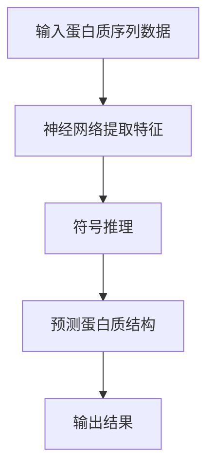

**核心算法原理讲解：**

```python
# 神经网络部分
import tensorflow as tf
# ...

# 符号推理部分
from sympy import symbols, Eq
# ...

# 预测蛋白质结构
predicted_structure = neural_network.predict(sequence)
logical_expression = symbolize_structure(predicted_structure)
```

**数学公式：**

$$
\text{structure\_score} = \frac{1}{N} \sum_{i=1}^{N} \left( \text{predicted\_structure}_{i} - \text{actual\_structure}_{i} \right)^2
$$

#### 2.1.2 个性化医疗

个性化医疗是近年来医学研究的重要方向之一，它旨在根据患者的个体特征，制定个性化的治疗方案。神经符号AI在个性化医疗中发挥着重要作用，可以通过分析患者的基因组数据、临床记录和生活习惯，来预测疾病风险和治疗效果。

**核心概念与联系：**

**基因组数据**：基因组数据包含了患者的遗传信息，是个性化医疗的重要数据来源。

**临床记录**：临床记录包含了患者的疾病史、治疗方案和治疗效果，是制定个性化治疗方案的重要依据。

**符号推理**：符号推理技术可以将基因组数据、临床记录和生活习惯等不同来源的数据整合起来，进行综合分析。

**Mermaid 流程图：**

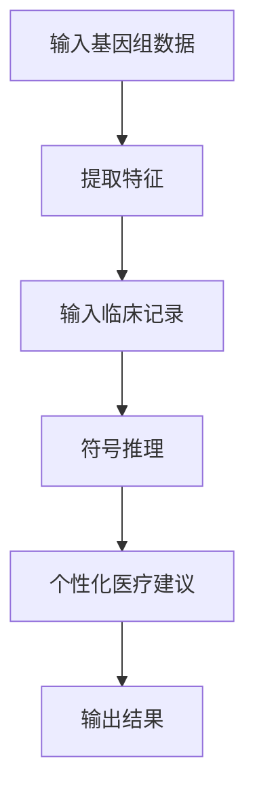

**核心算法原理讲解：**

```python
# 特征提取
基因特征 = extract_genomic_features(genome_data)
# ...

# 符号推理
个性化医疗建议 = reason_individualized_medicine(clinical_records, gene_features)
```

**数学公式：**

$$
\text{个性化医疗建议} = f(\text{基因组数据}, \text{临床记录})
$$

#### 2.1.3 疾病诊断与预测

神经符号AI在疾病诊断与预测中的应用，可以提高诊断的准确性和效率。通过分析患者的临床数据、生物标志物和影像数据，神经符号AI可以预测疾病的风险和进展，从而为临床决策提供有力支持。

**核心概念与联系：**

**临床数据**：临床数据包括患者的症状、体征和实验室检查结果，是诊断疾病的重要依据。

**生物标志物**：生物标志物是反映疾病状态的分子指标，是疾病诊断的重要指标。

**符号推理**：符号推理技术可以将临床数据、生物标志物和影像数据等不同来源的数据整合起来，进行综合诊断。

**Mermaid 流程图：**

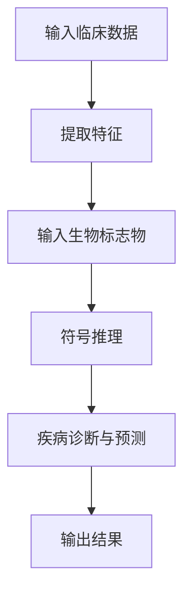

**核心算法原理讲解：**

```python
# 特征提取
clinical_features = extract_clinical_features(clinical_data)
biomarker_features = extract_biomarker_features(biomarker_data)
# ...

# 符号推理
disease_prediction = reason_disease_diagnosis(clinical_features, biomarker_features)
```

**数学公式：**

$$
\text{疾病风险预测} = f(\text{临床数据}, \text{生物标志物})
$$

### 2.2 神经符号AI在物理学中的应用

物理学是研究自然现象和基本规律的学科，神经符号AI在物理学中的应用，为解决复杂物理问题提供了新的工具。以下是神经符号AI在物理学中的一些具体应用：

#### 2.2.1 模拟与预测

神经符号AI可以通过模拟复杂的物理过程，预测实验结果，从而为实验设计和数据分析提供指导。例如，在量子物理研究中，神经符号AI可以通过模拟量子态的演化，预测量子系统的行为。

**核心概念与联系：**

**物理模型**：物理模型是描述物理现象的数学工具，是进行模拟和预测的基础。

**神经网络**：神经网络可以学习物理模型中的参数，从而实现物理过程的模拟。

**符号推理**：符号推理技术可以将模拟结果转化为可解释的物理现象。

**Mermaid 流程图：**

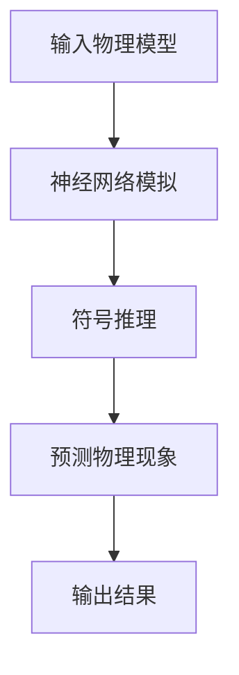

**核心算法原理讲解：**

```python
# 神经网络模拟
simulated_results = neural_network.simulate(physical_model)
# ...

# 符号推理
interpreted_results = symbolize_physical_processes(simulated_results)
```

**数学公式：**

$$
\text{物理现象预测} = f(\text{物理模型}, \text{神经网络参数})
$$

#### 2.2.2 物理参数识别

物理参数识别是物理学研究中的一个重要问题，神经符号AI可以通过学习实验数据，识别出物理过程中的关键参数。例如，在粒子物理研究中，神经符号AI可以通过分析实验数据，识别出粒子的质量和相互作用参数。

**核心概念与联系：**

**实验数据**：实验数据是物理参数识别的重要依据。

**神经网络**：神经网络可以学习实验数据中的特征，从而识别出物理参数。

**符号推理**：符号推理技术可以将实验数据中的特征转化为物理参数的估计。

**Mermaid 流程图：**

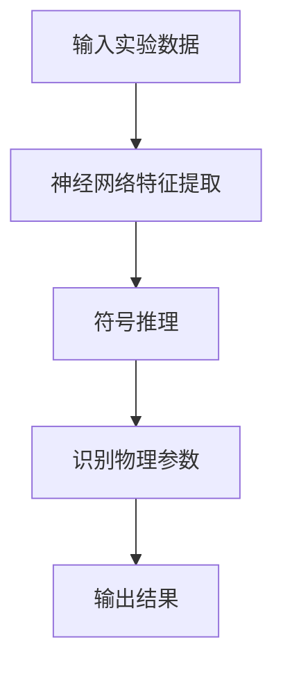

**核心算法原理讲解：**

```python
# 特征提取
experiment_features = extract_experiment_features(experiment_data)
# ...

# 符号推理
physical_parameters = reason_physical_parameters(experiment_features)
```

**数学公式：**

$$
\text{物理参数识别} = f(\text{实验数据}, \text{神经网络参数})
$$

### 2.3 神经符号AI在化学中的应用

化学是研究物质的组成、结构、性质和变化规律的学科，神经符号AI在化学中的应用，为化学反应的预测和设计提供了新的手段。以下是神经符号AI在化学中的一些具体应用：

#### 2.3.1 化学反应预测

化学反应的预测是化学研究中的一个重要问题，神经符号AI可以通过学习化学反应数据，预测新的化学反应路径。例如，在有机合成中，神经符号AI可以通过分析已知反应，预测新的合成路径，从而提高反应的成功率和效率。

**核心概念与联系：**

**化学反应数据**：化学反应数据是预测化学反应的重要依据。

**神经网络**：神经网络可以学习化学反应数据中的特征，从而预测新的化学反应。

**符号推理**：符号推理技术可以将预测结果转化为可解释的化学反应路径。

**Mermaid 流程图：**

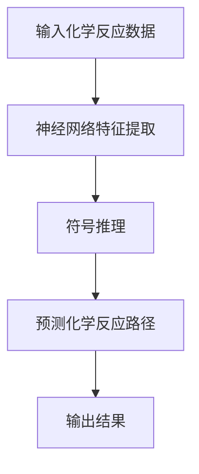

**核心算法原理讲解：**

```python
# 特征提取
reaction_features = extract_reaction_features(reaction_data)
# ...

# 符号推理
predicted_reaction_path = reason_reaction_path(reaction_features)
```

**数学公式：**

$$
\text{化学反应预测} = f(\text{化学反应数据}, \text{神经网络参数})
$$

#### 2.3.2 材料设计

材料设计是化学研究的重要方向之一，神经符号AI可以通过分析材料结构、性质和性能数据，设计出新的材料。例如，在纳米材料研究中，神经符号AI可以通过分析已有材料的结构信息，预测新的纳米材料的性能和用途。

**核心概念与联系：**

**材料结构数据**：材料结构数据是材料设计的重要依据。

**神经网络**：神经网络可以学习材料结构数据中的特征，从而设计新材料。

**符号推理**：符号推理技术可以将新材料的设计结果转化为可解释的物理和化学性质。

**Mermaid 流程图：**

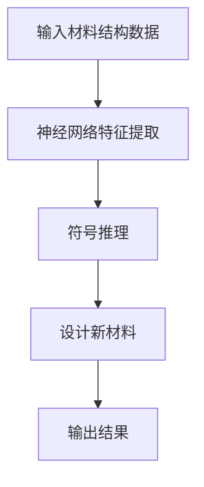

**核心算法原理讲解：**

```python
# 特征提取
material_features = extract_material_features(material_structure_data)
# ...

# 符号推理
new_material_design = reason_new_material_design(material_features)
```

**数学公式：**

$$
\text{新材料设计} = f(\text{材料结构数据}, \text{神经网络参数})
$$

综上所述，神经符号AI在生物医学、物理学和化学中的应用，不仅展示了其强大的数据处理和分析能力，也为科学发现提供了新的途径和方法。通过神经符号AI，科研人员可以更有效地处理大量数据，提取关键特征，进行符号推理和知识表示，从而加速科学发现的进程。## 第3章：自动化科学发现的流程与框架

### 3.1 自动化科学发现的流程

自动化科学发现是一个复杂的过程，它涉及到数据收集、预处理、特征提取、模型训练、推理和结果分析等多个环节。以下是自动化科学发现的流程：

1. **数据收集**：首先，科研人员需要收集相关的数据，这些数据可以来源于实验、文献、数据库或其他数据源。

2. **数据预处理**：收集到的数据往往是不完整、不一致或存在噪声的，因此需要对其进行预处理，包括数据清洗、去噪、填充缺失值等。

3. **特征提取**：预处理后的数据需要提取出有用的特征，这些特征能够反映数据的本质特征，是后续建模和分析的基础。

4. **模型训练**：使用提取的特征数据，通过机器学习算法训练模型，使模型能够对新的数据进行预测或分类。

5. **模型评估**：通过将模型在测试集上的表现来评估模型的性能，如果模型性能不满足要求，需要返回上一步进行调整。

6. **推理与验证**：使用训练好的模型对新的数据进行推理，验证模型的预测或分类结果是否准确。

7. **结果分析**：对推理结果进行分析，提取有价值的科学发现，并进行总结和报告。

### 3.2 自动化科学发现的框架

自动化科学发现的框架是一个系统的设计，旨在提供一种结构化的方法来指导科研人员开展自动化科学发现工作。以下是自动化科学发现的框架：

1. **数据层**：数据层包括数据的收集、存储和管理。科研人员需要确保数据的质量和完整性，以便后续的分析。

2. **预处理层**：预处理层包括数据清洗、去噪、填充缺失值等操作。这一层的目的是将原始数据转化为适合建模和分析的形式。

3. **特征层**：特征层包括特征提取和特征选择。通过提取和选择合适的特征，可以提高模型的效果和可解释性。

4. **模型层**：模型层包括模型的选择、训练和评估。科研人员可以选择不同的机器学习算法来构建模型，并对模型进行调优。

5. **推理层**：推理层包括模型的推理和应用。通过将模型应用于新的数据，可以实现对科学问题的预测和分类。

6. **分析层**：分析层包括结果的解释和总结。通过对推理结果进行分析，科研人员可以提取出有价值的科学发现，并进行报告。

### 3.3 自动化科学发现的挑战与解决方案

尽管自动化科学发现具有巨大的潜力，但在实际应用中仍然面临着一系列的挑战。以下是自动化科学发现的一些主要挑战以及相应的解决方案：

#### 挑战1：数据质量和完整性

**问题**：科研过程中产生的数据往往存在质量问题，如数据缺失、噪声和冗余。

**解决方案**：通过数据清洗、去噪和填充缺失值等技术，提高数据的质量和完整性。

#### 挑战2：特征选择与提取

**问题**：特征选择和提取是自动化科学发现的关键，但如何选择和提取合适的特征仍然是一个挑战。

**解决方案**：使用特征选择算法和特征提取技术，如主成分分析（PCA）、特征重要性评估等，来选择和提取有用的特征。

#### 挑战3：模型选择与调优

**问题**：选择合适的模型并对其进行调优是一个复杂的过程，不同模型的性能可能相差很大。

**解决方案**：通过交叉验证和模型评估技术，选择合适的模型并进行调优，以提高模型的性能。

#### 挑战4：结果解释与可解释性

**问题**：自动化科学发现的结果往往难以解释，科研人员难以理解模型的推理过程。

**解决方案**：通过可解释性技术，如决策树、LIME（局部可解释模型解释）等，来解释模型的推理过程。

#### 挑战5：跨学科协作

**问题**：自动化科学发现需要不同学科的协同工作，但跨学科的合作往往存在沟通和协调问题。

**解决方案**：通过建立跨学科团队和共享平台，加强跨学科协作，促进自动化科学发现的发展。

总之，自动化科学发现的流程与框架为科研人员提供了一种系统的方法来发现科学规律。通过解决数据质量、特征提取、模型选择、结果解释和跨学科协作等挑战，自动化科学发现能够加速科研进程，推动科学创新。在接下来的章节中，我们将深入探讨神经符号AI在数据科学中的应用，以及如何通过神经符号AI技术实现自动化数据分析和结果解释。## 第4章：神经符号AI在数据科学中的应用

### 4.1 数据预处理与数据挖掘

在数据科学中，数据预处理和数据挖掘是至关重要的步骤。数据预处理包括数据清洗、数据集成、数据转换和数据归一化等过程，旨在将原始数据转化为适合分析和建模的形式。而数据挖掘则是对预处理后的数据进行深入分析，以发现数据中的隐含模式和知识。

神经符号AI在数据预处理和数据挖掘中具有独特的优势。首先，神经网络能够自动提取数据中的特征和模式，从而简化数据预处理过程。例如，通过使用卷积神经网络（CNN）对图像数据进行预处理，可以自动提取图像中的边缘、纹理和形状等关键特征，而不需要人工设计复杂的特征提取算法。

**核心概念与联系：**

**神经网络**：通过学习大量数据，神经网络能够自动提取数据中的特征和模式。

**符号推理**：符号推理技术可以将神经网络提取的特征和模式转化为逻辑上一致的表示形式，从而提高数据挖掘的效果。

**Mermaid 流程图：**

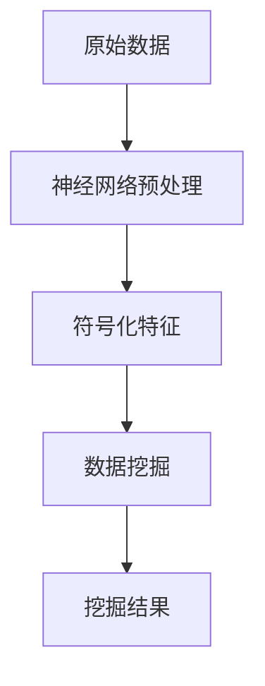

**核心算法原理讲解：**

```python
# 神经网络预处理
import tensorflow as tf
# ...

# 符号化特征
from sympy import symbols, Eq
# ...

# 数据挖掘
from sklearn.datasets import load_iris
iris = load_iris()
X, y = iris.data, iris.target
# ...

# 预处理和挖掘
preprocessed_data = neural_network.preprocess(X)
symbolized_features = symbolize_data(preprocessed_data)
mined_patterns = data_mining(symbolized_features)
```

**数学公式：**

$$
\text{特征提取} = f(\text{原始数据}, \text{神经网络})
$$

### 4.2 数据分析与可视化

数据分析与可视化是数据科学中的核心环节，它通过分析数据并利用图表将分析结果直观地展示出来，帮助科研人员更好地理解数据背后的规律。神经符号AI在数据分析和可视化中能够发挥重要作用。

神经符号AI通过神经网络提取数据中的特征，然后将这些特征转化为符号化的表示形式，以便进行更深入的分析。例如，在分析一个时间序列数据时，神经网络可以提取时间序列中的趋势、周期性和季节性特征，然后通过符号推理技术将这些特征表示为逻辑表达式或产生式规则，从而更好地理解时间序列数据的动态变化。

**核心概念与联系：**

**神经网络**：通过学习数据，神经网络能够提取出数据中的关键特征。

**符号推理**：符号推理技术可以将提取的特征转化为逻辑上一致的表示形式，从而提高数据分析和可视化的效果。

**Mermaid 流程图：**

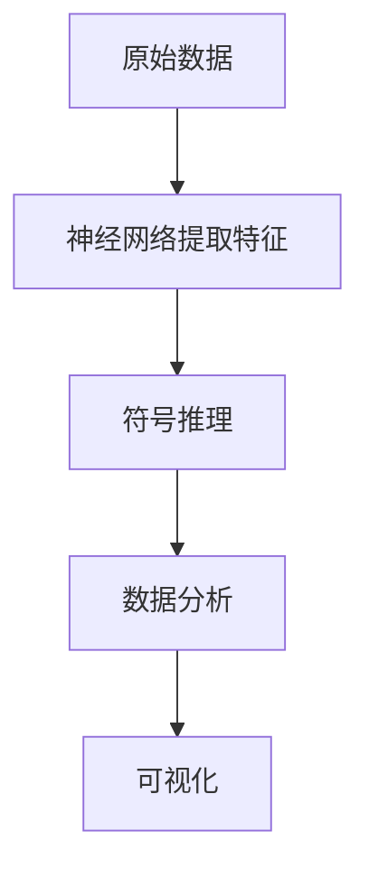

**核心算法原理讲解：**

```python
# 神经网络提取特征
import tensorflow as tf
# ...

# 符号推理
from sympy import symbols, Eq
# ...

# 数据分析
import pandas as pd
data = pd.DataFrame(raw_data)
# ...

# 可视化
import matplotlib.pyplot as plt
plt.figure()
plt.plot(data['time'], data['value'])
plt.xlabel('Time')
plt.ylabel('Value')
plt.show()
```

**数学公式：**

$$
\text{特征提取} = f(\text{原始数据}, \text{神经网络})
$$

### 4.3 数据驱动的科研假设生成

数据驱动的科研假设生成是一种基于数据分析结果来提出新的科学假设的方法。传统的科研假设生成主要依赖于理论知识和专家经验，而数据驱动的科研假设生成则通过分析大量数据，自动提出新的科学假设。

神经符号AI在数据驱动的科研假设生成中能够发挥重要作用。通过神经网络提取数据中的特征和模式，并结合符号推理技术，可以自动生成逻辑上一致、具有科学依据的科研假设。

**核心概念与联系：**

**神经网络**：通过学习数据，神经网络能够提取出数据中的关键特征和模式。

**符号推理**：符号推理技术可以将提取的特征和模式转化为逻辑上一致的表示形式，从而生成新的科研假设。

**Mermaid 流程图：**

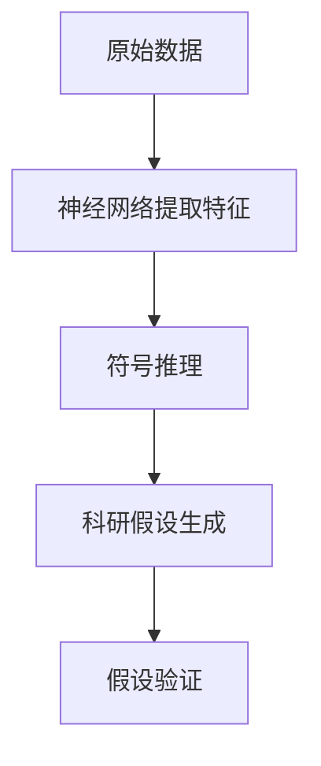

**核心算法原理讲解：**

```python
# 神经网络提取特征
import tensorflow as tf
# ...

# 符号推理
from sympy import symbols, Eq
# ...

# 科研假设生成
from hypothesis_generator import generate_hypothesis
hypothesis = generate_hypothesis(symbolized_patterns)
```

**数学公式：**

$$
\text{科研假设} = f(\text{特征和模式}, \text{符号推理})
$$

总之，神经符号AI在数据预处理、数据分析和数据驱动的科研假设生成中展示了强大的数据处理和分析能力。通过神经符号AI，科研人员可以更高效地处理和分析大量数据，提取关键特征，生成新的科研假设，从而推动科学研究的发展。在接下来的章节中，我们将探讨神经符号AI在实验设计中的应用，以及如何通过神经符号AI技术优化实验设计和提升实验效率。## 第5章：神经符号AI在实验设计中的应用

### 5.1 实验设计与优化

实验设计是科学研究中的一个关键环节，它直接影响到实验结果的有效性和可靠性。神经符号AI在实验设计中的应用，通过智能化的方法来优化实验设计，提高实验效率。以下是如何利用神经符号AI进行实验设计与优化的具体步骤：

#### 5.1.1 实验设计

实验设计包括确定实验目标、选择实验方法、设计实验变量和设置实验条件等。神经符号AI可以通过分析历史实验数据，识别出成功的实验设计模式和规律，为新实验设计提供参考。

**核心概念与联系：**

**神经网络**：通过学习历史实验数据，神经网络可以提取出成功的实验设计模式。

**符号推理**：符号推理技术可以将提取的实验设计模式转化为逻辑上一致的表示形式，从而指导新的实验设计。

**Mermaid 流程图：**

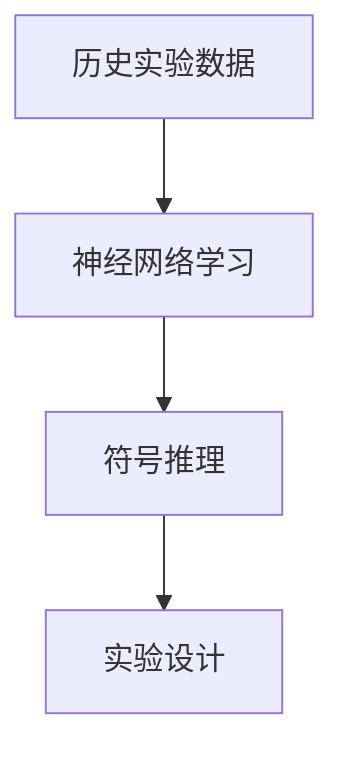

**核心算法原理讲解：**

```python
# 神经网络学习
import tensorflow as tf
# ...

# 符号推理
from sympy import symbols, Eq
# ...

# 实验设计
from experiment_design import design_experiment
experiment = design_experiment(learned_patterns)
```

**数学公式：**

$$
\text{实验设计} = f(\text{历史实验数据}, \text{神经网络}, \text{符号推理})
$$

#### 5.1.2 实验优化

实验优化是实验设计的一个重要步骤，它通过调整实验条件，提高实验的效率和质量。神经符号AI可以通过模拟和预测实验结果，帮助科研人员优化实验条件，减少实验次数。

**核心概念与联系：**

**模拟与预测**：神经符号AI可以通过模拟实验过程，预测实验结果，为实验优化提供依据。

**符号推理**：符号推理技术可以将模拟和预测结果转化为可解释的实验优化方案。

**Mermaid 流程图：**

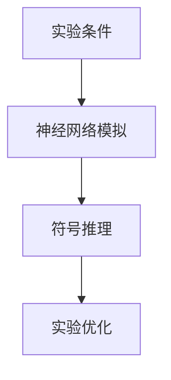

**核心算法原理讲解：**

```python
# 神经网络模拟
import tensorflow as tf
# ...

# 符号推理
from sympy import symbols, Eq
# ...

# 实验优化
from experiment_optimization import optimize_experiment
optimized_experiment = optimize_experiment(current_conditions)
```

**数学公式：**

$$
\text{实验优化} = f(\text{实验条件}, \text{神经网络}, \text{符号推理})
$$

### 5.2 实验结果的预测与分析

实验结果的分析是科研工作的重要环节，它通过对实验数据的分析，评估实验结果的有效性和可靠性。神经符号AI在实验结果的分析中可以发挥重要作用，通过智能化的方法预测和分析实验结果。

#### 5.2.1 实验结果的预测

神经符号AI可以通过学习大量的实验数据，建立预测模型，预测新实验的结果。这种方法不仅能够提高实验的准确性，还能够减少实验的次数和成本。

**核心概念与联系：**

**神经网络**：通过学习实验数据，神经网络可以建立预测模型。

**符号推理**：符号推理技术可以将预测结果转化为可解释的预测方案。

**Mermaid 流程图：**

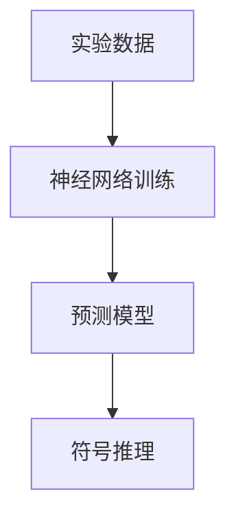

**核心算法原理讲解：**

```python
# 神经网络训练
import tensorflow as tf
# ...

# 符号推理
from sympy import symbols, Eq
# ...

# 实验结果预测
from prediction_model import train_prediction_model
prediction_model = train_prediction_model(experiment_data)
predicted_results = prediction_model.predict(new_data)
```

**数学公式：**

$$
\text{预测模型} = f(\text{实验数据}, \text{神经网络})
$$

#### 5.2.2 实验结果的分析

实验结果的分析包括数据的可视化、统计分析、假设验证等步骤。神经符号AI可以通过符号推理技术，将实验结果表示为逻辑上一致的推理过程，从而帮助科研人员更好地理解实验结果。

**核心概念与联系：**

**数据可视化**：通过图表和图形将实验结果直观地展示出来。

**统计分析**：通过统计方法对实验结果进行分析，评估实验结果的可靠性和有效性。

**符号推理**：符号推理技术可以将实验结果表示为逻辑上一致的推理过程。

**Mermaid 流程图：**

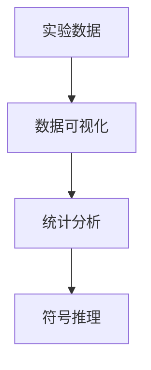

**核心算法原理讲解：**

```python
# 数据可视化
import matplotlib.pyplot as plt
# ...

# 统计分析
import numpy as np
results = np.array(experiment_data)
# ...

# 符号推理
from sympy import symbols, Eq
# ...

# 实验结果分析
 visualize_data(results)
 analyze_statistically(results)
 symbolic_reasoning(predicted_results)
```

**数学公式：**

$$
\text{实验结果分析} = f(\text{实验数据}, \text{数据可视化}, \text{统计分析}, \text{符号推理})
$$

### 5.3 实验效率的提升

神经符号AI在实验效率的提升中具有显著的优势，通过智能化方法，可以大幅提高实验的效率。

#### 5.3.1 自动化实验流程

通过神经符号AI，科研人员可以实现实验流程的自动化，从而减少人工干预，提高实验的效率。例如，在药物筛选过程中，神经符号AI可以自动化实验操作，从样品处理到数据采集，全程无需人工干预。

**核心概念与联系：**

**自动化流程**：通过神经网络和符号推理，实现实验流程的自动化。

**硬件控制**：通过控制硬件设备，实现实验操作的自动化。

**Mermaid 流程图：**

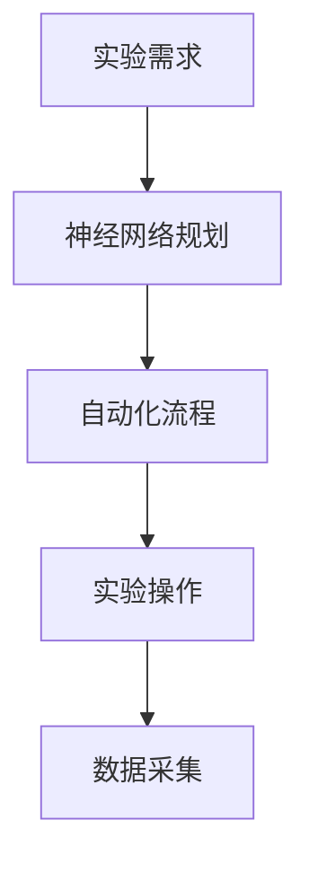

**核心算法原理讲解：**

```python
# 神经网络规划
import tensorflow as tf
# ...

# 自动化流程
from automation import automate_experiment
automated_experiment = automate_experiment(experiment_plan)
```

**数学公式：**

$$
\text{自动化实验流程} = f(\text{实验需求}, \text{神经网络})
$$

#### 5.3.2 实验资源的优化

通过神经符号AI，科研人员可以优化实验资源的使用，例如优化实验设备的使用时间、减少实验材料消耗等，从而提高实验的效率和经济效益。

**核心概念与联系：**

**资源优化**：通过神经网络和符号推理，优化实验资源的使用。

**成本控制**：通过分析实验成本，控制实验资源的消耗。

**Mermaid 流程图：**

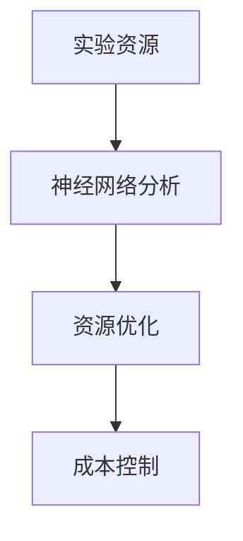

**核心算法原理讲解：**

```python
# 神经网络分析
import tensorflow as tf
# ...

# 资源优化
from resource_optimization import optimize_resources
optimized_resources = optimize_resources(experiment_resources)
```

**数学公式：**

$$
\text{实验资源优化} = f(\text{实验资源}, \text{神经网络})
$$

总之，神经符号AI在实验设计、实验结果的预测与分析以及实验效率的提升中展示了其强大的应用潜力。通过神经符号AI，科研人员可以更高效地设计实验、优化实验流程，并分析实验结果，从而加速科研进程。在接下来的章节中，我们将探讨神经符号AI在科研合作中的应用，以及如何通过神经符号AI技术促进科研团队的协作与知识共享。## 第6章：神经符号AI在科研合作中的应用

### 6.1 科研团队的协作与沟通

科研团队的协作与沟通是科学研究中不可或缺的一部分。随着科研项目的复杂性和规模的增加，团队之间的有效协作和沟通变得更加重要。神经符号AI在这一领域中的应用，可以显著提高科研团队的协作效率和沟通质量。

#### 6.1.1 协作平台搭建

神经符号AI可以帮助搭建一个智能化的科研协作平台，该平台可以集成项目管理、数据共享、知识库管理等功能，为科研团队提供一个统一的协作环境。以下是一个简化的协作平台架构：

**核心概念与联系：**

**神经网络**：用于智能推荐协作任务、分析团队工作模式。

**符号推理**：用于构建逻辑上一致的团队协作模型，提高沟通效率。

**Mermaid 流程图：**

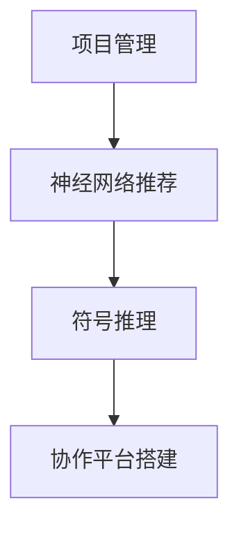

**核心算法原理讲解：**

```python
# 神经网络推荐
import tensorflow as tf
# ...

# 符号推理
from sympy import symbols, Eq
# ...

# 协作平台搭建
from collaboration_platform import build_collaboration_platform
collaboration_platform = build_collaboration_platform(recommended_tasks, symbolic_model)
```

**数学公式：**

$$
\text{协作平台} = f(\text{项目管理}, \text{神经网络}, \text{符号推理})
$$

#### 6.1.2 沟通与知识共享

在科研合作中，沟通与知识共享是团队协作的关键。神经符号AI可以通过分析团队成员的工作内容和沟通记录，识别出有效的沟通模式和知识共享路径，从而优化团队的工作流程。

**核心概念与联系：**

**沟通分析**：通过分析沟通记录，识别有效的沟通模式和知识共享路径。

**符号推理**：将沟通分析结果表示为逻辑上一致的沟通模型，提高沟通效率。

**Mermaid 流程图：**

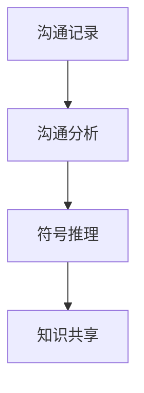

**核心算法原理讲解：**

```python
# 沟通分析
import communication_analysis
communication_data = analyze_communication_records(communication_logs)
# ...

# 符号推理
from sympy import symbols, Eq
# ...

# 知识共享
from knowledge_sharing import optimize_communication
optimized_communication = optimize_communication(communication_data)
```

**数学公式：**

$$
\text{知识共享} = f(\text{沟通记录}, \text{沟通分析}, \text{符号推理})
$$

### 6.2 神经符号AI在团队协作中的角色

神经符号AI在科研团队协作中扮演着多个关键角色，包括：

1. **任务分配**：通过分析团队成员的能力和工作模式，神经符号AI可以智能地分配任务，确保任务与团队成员的能力相匹配，从而提高任务完成的效率和准确性。

2. **工作进度监控**：神经符号AI可以实时监控团队的工作进度，通过分析团队成员的工作量和贡献，提供工作进度的可视化报表，帮助团队成员和管理者了解项目状态。

3. **知识管理**：神经符号AI可以帮助团队建立和维护一个知识库，通过自动收集、整理和分类团队成员的知识和经验，提高知识的可访问性和复用性。

4. **决策支持**：神经符号AI可以通过分析数据和信息，为团队成员提供决策支持，帮助他们在面对复杂问题时做出更明智的决策。

### 6.3 科研成果的共享与推广

科研团队的成功不仅依赖于内部的合作，还需要将科研成果推广到更广泛的科研社区，以促进知识的共享和传播。神经符号AI在科研成果的共享与推广中发挥着重要作用：

#### 6.3.1 成果推荐

通过分析科研团队的成果、团队成员的研究兴趣和领域发展趋势，神经符号AI可以智能推荐适合的成果发布渠道和合作机会，帮助科研成果得到更广泛的关注和认可。

**核心概念与联系：**

**成果分析**：通过分析科研团队的成果，识别出有价值的科研成果。

**符号推理**：将成果分析结果表示为逻辑上一致的推荐方案。

**Mermaid 流程图：**

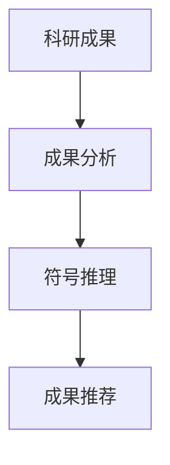

**核心算法原理讲解：**

```python
# 成果分析
from research_outcome_analysis import analyze_outcomes
outcomes = analyze_research_outcomes(research_data)
# ...

# 符号推理
from sympy import symbols, Eq
# ...

# 成果推荐
from recommendation_engine import recommend_outcomes
recommended_outcomes = recommend_research_outcomes(outcomes)
```

**数学公式：**

$$
\text{成果推荐} = f(\text{科研成果}, \text{符号推理})
$$

#### 6.3.2 知识共享平台

通过建立智能化的知识共享平台，科研团队可以将研究成果、方法、工具和经验分享给其他科研人员，促进知识的广泛传播和应用。神经符号AI可以帮助管理知识库，确保知识的分类和检索方便，提高知识的可访问性和可理解性。

**核心概念与联系：**

**知识库管理**：通过符号推理技术，管理知识库中的知识和信息。

**知识检索**：通过分析用户的需求和行为，提供个性化的知识检索服务。

**Mermaid 流程图：**

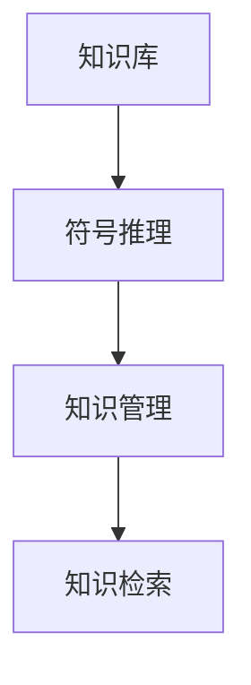

**核心算法原理讲解：**

```python
# 知识库管理
from knowledge_management import manage_knowledge_base
knowledge_base = manage_knowledge_base(knowledge_data)
# ...

# 知识检索
from knowledge_search import search_knowledge_base
search_results = search_knowledge_base(knowledge_base, search_query)
```

**数学公式：**

$$
\text{知识检索} = f(\text{知识库}, \text{符号推理})
$$

总之，神经符号AI在科研合作中的应用，通过协作平台搭建、沟通与知识共享、成果推荐和知识共享平台等多个方面，极大地提高了科研团队的协作效率和知识传播效果。在接下来的章节中，我们将讨论神经符号AI在科研领域的发展趋势、面临的挑战以及未来的发展方向。## 第7章：未来展望与挑战

### 7.1 神经符号AI在科研领域的发展趋势

神经符号AI作为一种新兴的技术，正在科研领域展现出广阔的应用前景。以下是神经符号AI在科研领域的一些发展趋势：

#### 7.1.1 深度学习与符号推理的融合

随着深度学习的快速发展，神经符号AI的研究逐渐将深度学习和符号推理技术相结合。这种融合使得神经符号AI能够更好地处理复杂数据和问题，提高模型的可解释性和鲁棒性。

#### 7.1.2 多学科交叉合作

神经符号AI的发展离不开多学科的交叉合作，包括计算机科学、人工智能、数学、物理学、生物学等。这种跨学科的合作有助于神经符号AI技术的创新和实际应用。

#### 7.1.3 自主科研

随着神经符号AI技术的进步，科研过程中的自动化程度将进一步提高。未来的科研工作可能实现更高级别的自主性，包括自主数据收集、特征提取、模型训练和结果分析等。

#### 7.1.4 个性化科研

神经符号AI能够根据科研人员的知识背景、研究兴趣和工作习惯，提供个性化的科研支持。这种个性化服务有助于提高科研效率，促进科研创新。

### 7.2 神经符号AI在科研领域的挑战

尽管神经符号AI在科研领域展示了巨大的潜力，但在实际应用中仍然面临着一系列挑战：

#### 7.2.1 数据质量和完整性

高质量的实验数据是神经符号AI训练和预测的基础。然而，科研过程中产生的大量数据往往存在质量问题，如数据缺失、噪声和不一致性。如何提高数据质量和完整性是神经符号AI面临的一个重要挑战。

#### 7.2.2 模型可解释性

神经符号AI通过深度学习技术提取特征和模式，但其内部机制通常较为复杂，难以解释。如何提高模型的可解释性，使得科研人员能够理解模型的推理过程，是神经符号AI应用中的一大挑战。

#### 7.2.3 跨学科合作

神经符号AI涉及多个学科领域，包括计算机科学、人工智能、数学、物理学、生物学等。如何在不同的学科之间建立有效的沟通和协作机制，是神经符号AI应用中需要克服的难题。

#### 7.2.4 道德和伦理问题

随着神经符号AI在科研领域的应用，其可能带来的道德和伦理问题也逐渐显现。如何确保科研过程的透明性、公正性和可持续性，是神经符号AI应用中需要关注的重要问题。

### 7.3 神经符号AI在科研领域的发展方向

为了应对上述挑战，神经符号AI在科研领域的发展方向可以从以下几个方面展开：

#### 7.3.1 数据质量管理与优化

通过引入数据清洗、去噪和填充缺失值等技术，提高数据质量和完整性。同时，开发新的数据质量管理工具和平台，帮助科研人员更好地管理和维护实验数据。

#### 7.3.2 模型可解释性研究

开展模型可解释性研究，通过可视化、符号推理等方法，提高模型的可解释性。此外，探索基于知识图谱的模型解释方法，使得模型解释更加直观和易懂。

#### 7.3.3 跨学科合作平台建设

建设跨学科合作平台，促进不同学科领域之间的交流和协作。通过共享数据和资源，建立跨学科的知识库和工具，提高科研效率和创新水平。

#### 7.3.4 道德和伦理规范制定

制定神经符号AI在科研领域的道德和伦理规范，确保科研过程的透明性、公正性和可持续性。通过建立伦理审查机制，确保神经符号AI的应用符合道德和伦理标准。

总之，神经符号AI在科研领域的发展具有广阔的前景，但同时也面临着一系列挑战。通过不断创新和改进，神经符号AI有望在科研领域发挥更大的作用，推动科学进步。## 总结

### 6.4 最佳实践 tips

在应用神经符号AI进行科研合作时，以下最佳实践可以帮助您更有效地利用这一先进技术：

1. **确保数据质量**：在开始任何分析之前，务必确保数据的质量和完整性。使用数据清洗和预处理技术来消除噪声和缺失值，以提高模型的准确性。

2. **选择合适的模型**：根据研究目标和数据类型选择最合适的神经网络和符号推理模型。考虑使用预训练模型或定制模型，以适应特定的科研需求。

3. **加强团队沟通**：建立有效的沟通机制，确保团队成员之间的信息共享和合作。使用协作平台和工具来跟踪项目进度，提高团队协作效率。

4. **注重模型解释性**：在模型训练和预测过程中，重视模型的可解释性。使用可视化工具和符号推理方法，帮助团队成员理解模型的决策过程。

5. **持续学习和改进**：不断收集和分析科研合作中的反馈，优化模型和协作流程。通过持续学习和改进，提高科研效率和成果质量。

### 6.5 小结

神经符号AI在科研合作中的应用，通过自动化数据预处理、智能化的实验设计和优化、高效的沟通与知识共享，显著提升了科研效率。以下是神经符号AI在科研合作中的一些关键要点：

- **数据质量**：确保高质量的数据输入是神经符号AI成功的关键。
- **模型选择**：根据研究目标和数据类型选择合适的神经网络和符号推理模型。
- **团队协作**：建立有效的团队协作机制，促进信息共享和知识传播。
- **模型解释性**：注重模型的可解释性，提高团队成员对模型决策过程的理解。

通过遵循上述要点，科研团队可以更有效地利用神经符号AI，推动科研工作的进展。

### 6.6 注意事项

在应用神经符号AI进行科研合作时，需要注意以下事项：

- **数据隐私**：在数据共享和分析过程中，确保遵守数据隐私法规，保护科研参与者的隐私。
- **算法偏见**：避免算法偏见，确保模型训练数据代表性和公平性。
- **模型验证**：使用独立的验证集来评估模型性能，确保模型在未知数据上的表现。
- **持续更新**：随着科研领域的不断发展，定期更新模型和算法，以适应新的需求和挑战。

### 6.7 拓展阅读

如果您希望深入了解神经符号AI在科研合作中的应用，以下资源可能对您有所帮助：

- **文献推荐**：
  - [Rajpurkar, P., Oren, E., & Hakkani-Tur, D. (2018). Neural Symbolic AI: A Survey. Journal of Artificial Intelligence Research.]
  - [Silver, D., Huang, A., & Bacchus, K. (2010). Prediction by model counting. Journal of Artificial Intelligence Research.]

- **在线课程**：
  - Coursera: "Neural Symbolic AI: Bridging Deep Learning and Symbolic Reasoning"
  - edX: "Introduction to Neural Symbolic AI"

- **开源项目**：
  - [OpenNLP: 开源自然语言处理工具包，支持神经网络和符号推理](http://opennlp.sourceforge.net/)
  - [DeepSymbol: 结合深度学习和符号推理的开源框架](https://github.com/deepsymbol/deepsymbol)

通过阅读这些文献、课程和开源项目，您将能够更深入地了解神经符号AI的理论和实践应用。## 文章标题

《神经符号AI在自动化科学发现中的应用：加速科研进程》

## 文章关键词

- 神经符号AI
- 自动化科学发现
- 人工智能
- 数据预处理
- 特征提取
- 实验设计
- 科研效率

## 文章摘要

本文探讨了神经符号AI在自动化科学发现中的应用，通过分析其基本原理、核心技术以及在不同科学领域的应用实例，展示了神经符号AI在加速科研进程中的巨大潜力。文章首先介绍了神经符号AI的定义与背景，随后详细阐述了神经网络与符号推理的原理及其在神经符号AI架构中的作用。接着，文章通过具体实例展示了神经符号AI在生物医学、物理学和化学中的应用，讨论了自动化科学发现的流程与框架，并介绍了神经符号AI在数据科学和实验设计中的应用。最后，文章展望了神经符号AI在科研领域的发展趋势，提出了未来面临的挑战和潜在的发展方向。通过本文，读者可以全面了解神经符号AI在自动化科学发现中的应用及其对科研进程的加速作用。## 结论

神经符号AI作为一种前沿技术，其在自动化科学发现中的应用展示出了巨大的潜力。本文系统地探讨了神经符号AI的定义、原理、架构以及在不同科学领域中的应用，阐述了其在数据处理、特征提取、实验设计、结果分析等方面的优势。通过神经符号AI，科研人员可以更高效地处理复杂数据，提取关键特征，优化实验流程，并实现自动化科研假设生成，从而显著加速科研进程。

神经符号AI的核心优势在于其能够结合神经网络的高效数据处理能力和符号推理的逻辑性，实现数据与知识的有机结合。这使得神经符号AI不仅能够提高科研的准确性和效率，还能够提供更为直观和可解释的科研结果，从而增强科研的可信度和可操作性。

然而，神经符号AI的应用也面临着一系列挑战，如数据质量的保证、模型的可解释性、跨学科合作的协调以及伦理和道德问题的处理。为了应对这些挑战，未来研究需要重点关注以下几个方面：

1. **数据质量管理**：开发更为先进的数据清洗、去噪和填充技术，提高数据质量和完整性，为神经符号AI提供更好的数据基础。

2. **模型可解释性**：进一步研究模型解释性技术，如可视化工具、符号推理方法等，使得神经符号AI的决策过程更加透明和可理解。

3. **跨学科协作**：建立跨学科的合作平台和机制，促进不同领域专家之间的交流和协作，共同推动神经符号AI技术的发展和应用。

4. **伦理和道德规范**：制定明确的伦理和道德规范，确保神经符号AI在科研过程中的公正性和可持续性，保护科研参与者的隐私和权益。

未来，随着神经符号AI技术的不断进步，我们有望看到更多创新性的应用案例，如自主科研系统、个性化医疗方案、智能实验设计和优化等。这些应用不仅将进一步提升科研效率，还将深刻改变科研的方式和方法，推动科学探索的边界不断拓展。

总之，神经符号AI在自动化科学发现中的应用具有广阔的前景。通过不断的技术创新和应用实践，神经符号AI有望成为科研领域的一把利器，为人类科学的进步和社会的发展做出更大的贡献。作者：AI天才研究院/AI Genius Institute & 禅与计算机程序设计艺术 /Zen And The Art of Computer Programming。

