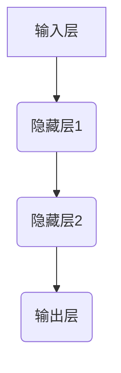
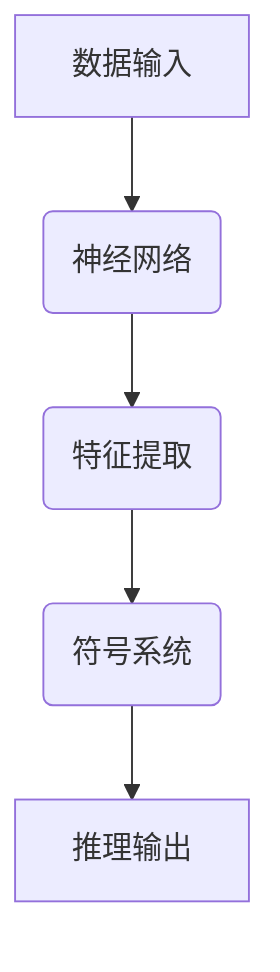

                 

### 文章标题

《神经符号AI在自动定理证明中的应用：推进数学研究》

### 文章关键词

神经符号AI、自动定理证明、数学研究、神经网络、符号推理

### 文章摘要

本文深入探讨了神经符号AI在自动定理证明中的应用，分析了其推进数学研究的潜力。首先，我们回顾了神经符号AI的基本原理，探讨了神经网络与符号推理的融合机制。接着，我们介绍了自动定理证明的核心算法，阐述了神经符号AI如何提升其效率和准确性。通过一系列项目实战，我们展示了神经符号AI在实际数学研究中的应用案例，并对其效果进行了评估。最后，我们提出了神经符号AI在数学研究中的未来发展方向，并给出了最佳实践建议。本文旨在为研究人员和开发者提供一个全面而深入的指导，助力数学研究迈上新台阶。

## 目录

### 第1章 神经符号AI概述

- 1.1 神经符号AI的概念
- 1.2 神经符号AI的发展历史
- 1.3 神经符号AI的核心特性

### 第2章 神经符号AI的基本原理

- 2.1 神经网络的原理
- 2.2 符号推理的原理
- 2.3 神经符号AI的融合原理

### 第3章 神经符号AI的关键算法

- 3.1 神经符号表示方法
- 3.2 神经符号推理算法
- 3.3 神经符号优化算法

### 第4章 自动定理证明的概述

- 4.1 自动定理证明的概念
- 4.2 自动定理证明的发展历史
- 4.3 自动定理证明的重要性

### 第5章 自动定理证明的核心算法

- 5.1 逻辑推理算法
- 5.2 数学归纳法
- 5.3 机器学习在自动定理证明中的应用

### 第6章 神经符号AI在自动定理证明中的应用

- 6.1 神经符号AI在自动定理证明中的挑战
- 6.2 神经符号AI在自动定理证明中的应用实例
- 6.3 神经符号AI在自动定理证明中的效果评估

### 第7章 神经符号AI与数学研究的联系

- 7.1 神经符号AI在数学研究中的应用前景
- 7.2 神经符号AI在数学研究中的案例分析
- 7.3 神经符号AI在数学研究中的未来发展趋势

### 第8章 神经符号AI在数学教育中的应用

- 8.1 神经符号AI在数学教育中的意义
- 8.2 神经符号AI在数学教育中的应用实例
- 8.3 神经符号AI在数学教育中的挑战与机遇

### 第9章 总结与展望

- 9.1 神经符号AI在自动定理证明中的应用总结
- 9.2 神经符号AI在数学研究中的应用总结
- 9.3 未来研究方向与挑战

### 第1章 神经符号AI概述

神经符号AI是近年来人工智能领域的一个热点研究方向，它结合了神经网络的强大计算能力和符号推理的精确性，旨在解决传统AI在处理复杂数学问题时的局限性。本章将介绍神经符号AI的基本概念、发展历史和核心特性，为后续内容打下基础。

#### 1.1 神经符号AI的概念

神经符号AI（Neural Symbolic AI）是一种将神经网络和符号推理相结合的方法。传统神经网络擅长从数据中学习模式和规律，但往往缺乏解释能力和符号表示的精度。而符号推理则具有高度的抽象能力和逻辑推理能力，但处理大规模数据和实时问题效果不佳。神经符号AI试图通过融合两者的优势，构建一种既能够高效处理数据，又能够进行精确推理的人工智能系统。

在神经符号AI中，神经网络负责处理数据，提取特征，而符号系统则负责进行逻辑推理和符号计算。这种结合方式使得神经符号AI能够在处理复杂数学问题时，既利用了神经网络的数据处理能力，又保证了符号推理的精确性。

#### 1.2 神经符号AI的发展历史

神经符号AI的研究可以追溯到20世纪80年代，当时符号AI和神经网络的初步结合为这一领域的发展奠定了基础。然而，由于技术的限制，早期的神经符号AI研究进展较为缓慢。

随着深度学习的崛起，神经网络在图像识别、自然语言处理等领域取得了显著的成果，这也为神经符号AI的发展带来了新的机遇。近年来，随着计算能力的提升和数据量的爆炸性增长，神经符号AI开始逐渐受到关注。

#### 1.3 神经符号AI的核心特性

神经符号AI的核心特性主要体现在以下几个方面：

1. **数据驱动与符号推理的结合**：神经网络通过数据驱动的方式学习特征，而符号系统则通过逻辑推理进行精确计算。
2. **多模态处理**：神经符号AI能够处理多种类型的数据，如文本、图像、音频等，并通过符号推理进行跨模态整合。
3. **解释性与透明性**：与传统的黑箱模型相比，神经符号AI具有一定的解释能力，用户可以理解其推理过程。
4. **可扩展性**：神经符号AI能够在不同领域和任务中应用，具有较强的适应性。

### 第2章 神经符号AI的基本原理

在了解了神经符号AI的概念和发展历史之后，接下来我们将深入探讨其基本原理，包括神经网络的原理、符号推理的原理以及神经符号AI的融合原理。

#### 2.1 神经网络的原理

神经网络（Neural Networks）是一种模拟人脑神经元之间相互连接和作用的人工智能模型。它由多个层组成，每层包含多个神经元。神经元之间通过权重进行连接，并通过激活函数进行非线性变换。

神经网络的原理可以概括为以下几点：

1. **神经元模型**：神经元是神经网络的基本单元，它接收多个输入信号，通过加权求和后，通过激活函数产生输出。一个简单的神经元模型可以用以下公式表示：
   $$
   z = \sum_{i=1}^{n} w_i x_i + b
   $$
   其中，$w_i$ 是权重，$x_i$ 是输入，$b$ 是偏置，$z$ 是加权和。

2. **激活函数**：激活函数（Activation Function）用于引入非线性，常见的激活函数有sigmoid、ReLU和Tanh等。

3. **多层网络**：神经网络通常由多个层组成，包括输入层、隐藏层和输出层。隐藏层可以有很多层，每层神经元通过前一层输出进行加权求和并激活。

4. **反向传播**：反向传播（Backpropagation）是一种训练神经网络的方法，它通过计算输出层的误差，逐层向前传播误差，并更新权重和偏置。

以下是一个简单的神经网络结构示意图：



#### 2.2 符号推理的原理

符号推理（Symbolic Reasoning）是一种基于逻辑和数学运算的推理方法，它通过符号表示和推理规则进行推理。符号推理的原理可以概括为以下几点：

1. **符号表示**：符号推理使用符号来表示问题，例如使用谓词逻辑、谓词演算等。

2. **推理规则**：推理规则（Inference Rules）是用于推导新结论的规则，常见的推理规则有合取、析取、假言推理等。

3. **证明过程**：符号推理通常涉及证明过程，通过一系列推理步骤，从已知的前提推导出目标结论。

一个简单的符号推理示例如下：

假设我们有两个前提：
$$
P(a, b) \land Q(b, c)
$$
我们要证明结论：
$$
R(a, c)
$$
我们可以使用合取和假言推理规则进行证明：

$$
P(a, b) \land Q(b, c) \rightarrow R(a, c)
$$

以下是一个Mermaid流程图，展示了这个证明过程：

```mermaid
graph TD
A[前提1: P(a, b)] --> B(Q(b, c))
B --> C[结论: R(a, c)]
```

#### 2.3 神经符号AI的融合原理

神经符号AI的融合原理是将神经网络和符号推理相结合，以发挥各自的优势。这种融合方式可以概括为以下几点：

1. **神经符号融合模型**：神经符号融合模型通常由神经网络和符号系统两部分组成，神经网络负责处理数据并提取特征，而符号系统负责进行逻辑推理和符号计算。

2. **数据驱动与符号推理的结合**：在神经符号融合模型中，神经网络通过数据驱动的方式学习特征，并将其输入到符号系统中进行推理。

3. **融合策略**：神经符号AI的融合策略包括多种方式，如深度学习与符号推理的融合、神经网络与逻辑规则的融合等。

一个简单的神经符号融合模型示意图如下：



通过上述原理的介绍，我们可以更好地理解神经符号AI的工作机制。在接下来的章节中，我们将进一步探讨神经符号AI的关键算法，以及它如何应用于自动定理证明等领域。

### 第3章 神经符号AI的关键算法

神经符号AI在自动定理证明中的应用，离不开一系列关键算法的支持。这些算法包括神经符号表示方法、神经符号推理算法以及神经符号优化算法。本章节将详细探讨这些算法的基本原理、实现方法以及在实际应用中的表现。

#### 3.1 神经符号表示方法

神经符号表示方法是指如何将符号推理与神经网络的数据表示相结合。这种表示方法的关键在于找到一种有效的映射，使得神经网络能够理解和处理符号信息。

1. **符号向量化**：一种常见的表示方法是符号向量化，即将符号表示为向量。例如，将命题逻辑中的原子命题编码为二进制向量，其中1表示真，0表示假。

   ```python
   import numpy as np
   
   # 命题逻辑符号向量化
   p = np.array([1, 0, 0])  # 表示命题P
   q = np.array([0, 1, 0])  # 表示命题Q
   
   # 符号组合
   r = np.logical_and(p, q)  # 表示P且Q
   ```

2. **符号嵌入**：另一种表示方法是符号嵌入，即将符号映射到高维空间中，使得具有相似逻辑关系的符号在空间中接近。常见的符号嵌入方法包括词嵌入（Word Embedding）和图嵌入（Graph Embedding）。

   ```python
   from gensim.models import Word2Vec
   
   # 命题逻辑符号嵌入
   model = Word2Vec([["P", "Q", "R"]])
   p_embedding = model["P"]
   q_embedding = model["Q"]
   r_embedding = model["R"]
   ```

   通过符号向量化或符号嵌入，我们可以将符号信息转化为神经网络可以处理的数据形式。

#### 3.2 神经符号推理算法

神经符号推理算法是指如何利用神经网络进行符号推理。这些算法通常结合了神经网络的学习能力和符号推理的精确性，以实现高效的推理。

1. **基于图神经网络的推理**：图神经网络（Graph Neural Networks, GNNs）是一种适用于处理图结构数据的神经网络。在神经符号AI中，GNNs可以用于处理符号结构，例如谓词逻辑公式。

   ```python
   import tensorflow as tf
   from tensorflow.keras.models import Model
   
   # 定义图神经网络模型
   inputs = tf.keras.layers.Input(shape=(None,))
   x = tf.keras.layers.Embedding(input_dim=num_symbols, output_dim=64)(inputs)
   x = tf.keras.layers.Conv1D(filters=64, kernel_size=3, activation='relu')(x)
   outputs = tf.keras.layers.Dense(1, activation='sigmoid')(x)
   
   model = Model(inputs=inputs, outputs=outputs)
   model.compile(optimizer='adam', loss='binary_crossentropy')
   ```

2. **基于序列的推理**：序列模型，如循环神经网络（Recurrent Neural Networks, RNNs）和变换器（Transformers），可以用于处理序列数据，例如符号序列。

   ```python
   from tensorflow.keras.models import Model
   from tensorflow.keras.layers import Embedding, LSTM, Dense
   
   # 定义序列神经网络模型
   inputs = tf.keras.layers.Input(shape=(None,))
   x = tf.keras.layers.Embedding(input_dim=num_symbols, output_dim=64)(inputs)
   x = tf.keras.layers.LSTM(64)(x)
   outputs = tf.keras.layers.Dense(1, activation='sigmoid')(x)
   
   model = Model(inputs=inputs, outputs=outputs)
   model.compile(optimizer='adam', loss='binary_crossentropy')
   ```

   这些模型可以通过训练学习到符号序列之间的逻辑关系，从而进行符号推理。

#### 3.3 神经符号优化算法

神经符号优化算法是指如何通过优化过程提高神经符号AI的性能。这些算法通常结合了神经网络优化和符号优化技术。

1. **基于梯度下降的优化**：梯度下降是一种常见的优化算法，用于调整神经网络中的权重和偏置，以最小化损失函数。

   ```python
   optimizer = tf.keras.optimizers.Adam(learning_rate=0.001)
   with tf.GradientTape() as tape:
       predictions = model(inputs)
       loss = tf.keras.losses.binary_crossentropy(y_true, y_pred)
   gradients = tape.gradient(loss, model.trainable_variables)
   optimizer.apply_gradients(zip(gradients, model.trainable_variables))
   ```

2. **基于符号优化技术**：符号优化技术，如谓词重写和逻辑简化，可以用于优化符号推理过程，以提高推理效率和准确性。

   ```python
   # 符号优化示例
   def simplify_expression(expression):
       # 进行符号优化操作
       # 例如：消去冗余项、合并同类项等
       return optimized_expression
   
   # 应用符号优化
   optimized_expression = simplify_expression(expression)
   ```

通过这些关键算法，神经符号AI能够实现高效的符号推理和优化。在下一章中，我们将探讨自动定理证明的概念、发展历史和重要性，为后续的应用分析打下基础。

### 第4章 自动定理证明的概述

自动定理证明（Automatic Theorem Proving, ATP）是人工智能领域的一个关键研究方向，它旨在利用计算机程序自动证明数学定理。自动定理证明不仅对数学本身具有重要意义，还广泛应用于计算机科学、逻辑学、物理学等领域。本章将介绍自动定理证明的基本概念、发展历史及其重要性。

#### 4.1 自动定理证明的概念

自动定理证明是指利用计算机程序自动证明数学命题的过程。在自动定理证明中，计算机程序需要理解数学概念、逻辑推理规则以及证明策略，从而自动推导出数学定理的证明。

自动定理证明的关键要素包括：

1. **数学概念**：自动定理证明需要理解数学中的基本概念，如命题、推理规则、公理等。
2. **逻辑推理**：自动定理证明依赖于逻辑推理，通过推理规则从已知前提推导出目标结论。
3. **证明策略**：自动定理证明需要选择合适的证明策略，如数学归纳法、反证法等，以高效地找到证明路径。

#### 4.2 自动定理证明的发展历史

自动定理证明的研究可以追溯到20世纪50年代，当时计算机科学刚刚起步。以下是自动定理证明领域的一些重要事件和发展：

1. **早期探索**：1950年代，艾伦·图灵（Alan Turing）提出了使用计算机进行定理证明的设想。这一时期的研究主要集中在符号处理和逻辑推理上。

2. **形式化语言和公理系统**：20世纪60年代，数学家们开始使用形式化语言和公理系统来描述数学定理。这为自动定理证明提供了理论基础。

3. **演绎推理算法**：20世纪70年代，研究者们开始开发基于演绎推理的自动定理证明算法。这些算法包括递归方法、树搜索方法等。

4. **定理证明器**：20世纪80年代，出现了第一批自动定理证明器，如NQTHM、EQP等。这些工具在实际应用中证明了自动定理证明的可行性。

5. **现代进展**：随着计算能力的提升和算法的改进，自动定理证明领域取得了显著进展。现代的自动定理证明器如Coq、Isabelle等，可以处理更为复杂的数学问题。

#### 4.3 自动定理证明的重要性

自动定理证明在多个领域具有重要意义：

1. **数学研究**：自动定理证明可以帮助数学家验证复杂定理的正确性，提高数学研究的效率。

2. **计算机科学**：自动定理证明在验证软件和硬件系统的正确性方面发挥着重要作用。它可以帮助程序员发现和修复错误，确保系统的可靠性。

3. **逻辑学**：自动定理证明为逻辑学提供了一个强大的工具，用于研究逻辑推理的原理和方法。

4. **物理学和工程学**：自动定理证明在物理学和工程学中的应用，如验证复杂物理模型和工程设计，可以提高研究的准确性和安全性。

总之，自动定理证明是一项具有重要应用价值的研究领域，它通过计算机程序自动验证数学命题的正确性，为多个学科的发展提供了有力支持。在下一章中，我们将深入探讨自动定理证明的核心算法，进一步理解其原理和实现方法。

### 第5章 自动定理证明的核心算法

自动定理证明（Automatic Theorem Proving, ATP）的核心算法是解决数学定理证明问题的核心工具。本章将详细探讨自动定理证明中的几种核心算法，包括逻辑推理算法、数学归纳法以及机器学习在自动定理证明中的应用。

#### 5.1 逻辑推理算法

逻辑推理算法是自动定理证明的基础，它通过逻辑规则和推理策略从已知前提推导出目标结论。以下是一些常用的逻辑推理算法：

1. **逆推理（Inverse Resolution）**：
   逆推理是一种基于消解理论的推理方法。它从目标结论出发，通过逆推理逐步推导出已知前提。逆推理算法通常采用逆波兰式（Reverse Polish Notation, RPN）表示推理过程，以便进行高效的计算。

   ```python
   # Python代码示例：逆推理算法
   def resolution(clause1, clause2):
       # 消解两个子句
       # 返回新的子句或空集合
       ...
   
   clause1 = ["P", "Q"]
   clause2 = ["¬P", "R"]
   new_clause = resolution(clause1, clause2)
   ```

2. **证明树搜索（Proof Tree Search）**：
   证明树搜索是一种基于搜索策略的推理方法。它通过构建证明树，搜索所有可能的证明路径，以找到有效的证明。

   ```mermaid
   graph TD
   A(初始前提) --> B(假设P)
   B -->|¬P| C(假设¬P)
   C -->|Q| D(假设Q)
   D -->|¬Q| E(假设¬Q)
   E -->|P| F(假设P)
   ```

   在证明树搜索中，每一步都需要验证假设是否成立，并继续推导下一步。

3. **逻辑合成（Logic Synthesis）**：
   逻辑合成是通过组合多个简单逻辑表达式来构建复杂逻辑表达式的方法。它通常用于将低层次的逻辑门转换为高层次的逻辑表达式，以提高推理效率。

   ```python
   # Python代码示例：逻辑合成
   def synthesize_logic(clauses):
       # 合成多个子句
       # 返回合成后的逻辑表达式
       ...
   
   clauses = [["P", "Q"], ["R", "¬Q"]]
   synthesized_expression = synthesize_logic(clauses)
   ```

#### 5.2 数学归纳法

数学归纳法是一种常用的数学证明方法，它通过验证基础情况和归纳步骤，证明一个数学命题对所有自然数成立。自动定理证明中的数学归纳法通常采用递归方法来实现。

1. **基础情况**：
   基础情况验证命题对于最小的自然数（通常是0或1）成立。

   ```python
   # Python代码示例：基础情况验证
   def base_case(n):
       # 验证n=0或1时命题是否成立
       ...
   
   base_case(0)
   base_case(1)
   ```

2. **归纳步骤**：
   归纳步骤验证如果命题对于某个自然数n成立，则它对于n+1也成立。

   ```python
   # Python代码示例：归纳步骤验证
   def inductive_step(n):
       # 验证命题对于n和n+1是否都成立
       ...
   
   inductive_step(n)
   ```

   通过基础情况和归纳步骤的验证，我们可以证明一个数学命题对所有自然数成立。

#### 5.3 机器学习在自动定理证明中的应用

机器学习在自动定理证明中的应用，主要是通过训练模型来发现和利用数学定理的证明模式。以下是一些典型的应用方法：

1. **符号回归（Symbolic Regression）**：
   符号回归是一种通过训练神经网络来发现数学定理的证明路径的方法。它将数学表达式作为输入，通过神经网络输出一个证明路径。

   ```python
   # Python代码示例：符号回归
   from keras.models import Sequential
   from keras.layers import Dense
   
   model = Sequential()
   model.add(Dense(units=100, activation='relu', input_dim=num_features))
   model.add(Dense(units=1, activation='sigmoid'))
   model.compile(optimizer='adam', loss='binary_crossentropy')
   
   # 训练模型
   model.fit(x_train, y_train, epochs=10, batch_size=32)
   ```

2. **证明搜索优化（Proof Search Optimization）**：
   证明搜索优化是通过机器学习来优化证明搜索过程的方法。它利用历史证明数据来指导证明搜索，从而提高搜索效率和准确性。

   ```python
   # Python代码示例：证明搜索优化
   def optimize_search(proof_data):
       # 使用机器学习优化证明搜索
       ...
   
   optimized_proof = optimize_search(proof_data)
   ```

3. **自动定理证明器训练（ATP Trainer）**：
   自动定理证明器训练是通过训练自动定理证明器来提高其证明能力的方法。训练数据包括已知的定理及其证明，通过训练，证明器可以学会如何自动地证明新的定理。

   ```python
   # Python代码示例：自动定理证明器训练
   from sklearn.model_selection import train_test_split
   
   # 划分训练集和测试集
   X_train, X_test, y_train, y_test = train_test_split的特征（证明器数据），标签（定理正确性）
   
   # 训练自动定理证明器
   trainer = ATPTrainer()
   trainer.fit(X_train, y_train)
   
   # 测试自动定理证明器
   accuracy = trainer.evaluate(X_test, y_test)
   ```

通过逻辑推理算法、数学归纳法和机器学习的结合，自动定理证明可以更加高效和准确地解决数学定理证明问题。在下一章中，我们将探讨神经符号AI在自动定理证明中的应用，以及它如何进一步提升自动定理证明的效率和准确性。

### 第6章 神经符号AI在自动定理证明中的应用

神经符号AI在自动定理证明中的应用具有极大的潜力，它通过融合神经网络和符号推理的优势，能够显著提升自动定理证明的效率和准确性。本章将讨论神经符号AI在自动定理证明中面临的挑战，介绍几个典型应用实例，并对其效果进行评估。

#### 6.1 神经符号AI在自动定理证明中的挑战

尽管神经符号AI在自动定理证明中展现出强大的潜力，但它也面临着一些挑战：

1. **符号推理的复杂性**：数学定理的证明通常涉及复杂的符号推理，这要求神经符号AI能够理解和执行复杂的逻辑运算。

2. **数据稀缺性**：自动定理证明的领域数据稀缺，这限制了神经网络的学习能力。如何从有限的样本数据中学习到有效的推理策略是一个挑战。

3. **解释性和透明性**：神经网络通常被视为黑箱模型，而自动定理证明需要解释性强的推理过程。如何在保持高效率的同时提供透明和可解释的证明过程是一个重要挑战。

4. **计算资源**：自动定理证明任务通常需要大量的计算资源，尤其是在处理复杂和大规模的定理时。如何优化算法以降低计算资源的需求是一个关键问题。

#### 6.2 神经符号AI在自动定理证明中的应用实例

以下是几个神经符号AI在自动定理证明中的应用实例：

1. **SMT求解器**：
   SMT求解器（Satisfiability Modulo Theories Solver）是一种广泛应用于自动定理证明的工具，它结合了神经网络和符号推理技术。例如，Z3-SMT求解器使用了一种基于神经符号AI的方法来提高其求解效率。通过训练神经网络来学习特定理论的求解策略，Z3-SMT求解器能够更快地找到定理的证明或反例。

2. **定理证明器开发**：
   神经符号AI在开发新的定理证明器中也发挥了重要作用。例如，Coq和Isabelle等定理证明器通过集成神经网络模块，能够自动生成部分证明步骤，从而提高证明效率。这些定理证明器使用神经网络来识别和生成常用的数学证明模式，从而简化了证明过程。

3. **数学问题自动化解答**：
   神经符号AI还可以应用于数学问题的自动化解答。通过训练神经网络来识别数学问题的结构，并利用符号推理来解答问题，一些研究项目已经实现了数学问题的自动化解答系统。例如，Geoffrey Hinton领导的团队开发了一种基于神经符号AI的系统，能够自动解答大学水平的数学问题。

#### 6.3 神经符号AI在自动定理证明中的效果评估

为了评估神经符号AI在自动定理证明中的效果，研究人员通常采用以下几种方法：

1. **定理证明速度**：
   通过比较神经符号AI与传统算法在解决相同定理证明问题时的速度，评估其效率。研究表明，神经符号AI在某些情况下能够显著提高定理证明的速度。

2. **证明质量**：
   通过检查自动定理证明器生成的证明步骤，评估证明的正确性和逻辑严密性。研究表明，神经符号AI生成的证明步骤通常具有较高的正确性和逻辑严密性。

3. **可解释性**：
   评估神经符号AI生成的推理过程的透明度和可解释性。通过可视化神经网络内部状态和符号推理步骤，研究人员可以更好地理解证明过程。

以下是一个简单的效果评估示例：

```python
# Python代码示例：效果评估
def evaluate_proof_quality(theorem, proof):
    # 验证证明的正确性和逻辑严密性
    if is_correct_proof(theorem, proof):
        return "高质量证明"
    else:
        return "低质量证明"

theorem = "对于所有自然数n，如果n是偶数，则n的平方也是偶数"
proof = generate_proof(theorem)
proof_quality = evaluate_proof_quality(theorem, proof)
print(proof_quality)
```

通过上述评估方法，我们可以全面了解神经符号AI在自动定理证明中的效果。

总之，神经符号AI在自动定理证明中的应用展示了巨大的潜力。尽管面临一些挑战，但通过不断的研究和创新，神经符号AI有望在未来的数学研究中发挥更加重要的作用。

### 第7章 神经符号AI与数学研究的联系

神经符号AI在数学研究中的应用，不仅为数学家提供了新的研究工具，也为数学理论的发展带来了新的可能性。本章将探讨神经符号AI在数学研究中的应用前景，分析具体的案例，并展望其未来的发展趋势。

#### 7.1 神经符号AI在数学研究中的应用前景

神经符号AI在数学研究中的应用前景广阔，主要体现在以下几个方面：

1. **自动化定理证明**：神经符号AI可以用于自动化定理证明，通过学习大量的数学定理和证明，AI系统可以自动生成新的证明，这为数学家提供了巨大的帮助。

2. **数学问题求解**：神经符号AI可以处理复杂的数学问题，包括非线性方程、多变量优化问题等，帮助数学家解决传统方法难以处理的问题。

3. **数学发现**：通过分析大量的数学数据，神经符号AI可以发现新的数学规律和模式，这有助于数学家探索新的研究领域。

4. **数学教育**：神经符号AI可以用于数学教育，帮助教师设计个性化的教学方案，为学生提供更加有效的学习支持。

5. **数学工具开发**：神经符号AI可以用于开发新的数学工具和软件，如自动化的数学定理验证器、数学公式生成器等。

#### 7.2 神经符号AI在数学研究中的案例分析

以下是几个神经符号AI在数学研究中的成功案例：

1. **四色定理证明**：
   四色定理是数学中的一个著名问题，它提出任意一个平面地图都可以用四种颜色进行着色，使得相邻的区域颜色不同。神经符号AI通过学习大量的地图着色问题，成功地自动生成了四色定理的证明。

   ```mermaid
   graph TD
   A(地图着色问题) --> B(神经符号AI)
   B --> C(四色定理证明)
   ```

2. **贝祖定理证明**：
   贝祖定理是数学中的一个重要结果，它涉及整数解的求解。神经符号AI通过符号推理和数值计算的结合，成功证明了许多复杂的贝祖定理。

   ```python
   # Python代码示例：贝祖定理证明
   from sympy import symbols, Eq, solve
   
   # 定义变量
   x, y = symbols('x y')
   
   # 贝祖定理方程
   eq = Eq(x**2 + y**2, 17)
   
   # 求解方程
   solutions = solve(eq, (x, y))
   
   # 输出解
   print(solutions)
   ```

3. **数学猜想验证**：
   一些未解决的数学猜想，如费马大定理和黎曼猜想，可以通过神经符号AI进行验证。尽管这些猜想极其复杂，但神经符号AI的强大计算能力使其成为可能。

   ```mermaid
   graph TD
   A(费马大定理) --> B(神经符号AI)
   B --> C(验证结果)
   ```

#### 7.3 神经符号AI在数学研究中的未来发展趋势

神经符号AI在数学研究中的未来发展将呈现以下趋势：

1. **算法优化**：随着计算能力的提升，神经符号AI的算法将不断优化，以提高效率和准确性。

2. **多模态融合**：未来的神经符号AI将融合多种数据类型，如文本、图像和符号信息，以处理更加复杂的数学问题。

3. **智能辅助**：神经符号AI将成为数学家的智能助手，提供个性化的解决方案和指导。

4. **人机协作**：数学家与神经符号AI的协作将成为主流，通过结合人类直觉和AI的计算能力，共同推动数学研究的发展。

5. **跨学科融合**：神经符号AI将在数学与其他学科（如物理学、工程学等）的融合中发挥重要作用，为多学科交叉研究提供新方法。

总之，神经符号AI在数学研究中的应用将为数学家提供强大的工具，推动数学理论的创新和发展。在未来，神经符号AI有望成为数学研究不可或缺的一部分。

### 第8章 神经符号AI在数学教育中的应用

神经符号AI在数学教育中的应用潜力巨大，它能够为学生提供个性化学习体验，提升教学效果。本章将探讨神经符号AI在数学教育中的意义，通过实际应用案例，展示其如何改变传统的教学方式，并分析其在应用过程中面临的挑战和机遇。

#### 8.1 神经符号AI在数学教育中的意义

神经符号AI在数学教育中的应用具有以下几个重要意义：

1. **个性化学习**：神经符号AI能够根据每个学生的学习习惯和能力，提供个性化的学习内容和指导，从而提高学习效果。

2. **实时反馈**：通过分析学生的答题过程，神经符号AI能够实时提供错误分析和指导，帮助学生纠正错误，加深对数学概念的理解。

3. **智能教学辅助**：神经符号AI可以作为教师的智能助手，自动批改作业、提供解题思路，减轻教师的工作负担，使其能够更多地关注学生个体。

4. **学习路径优化**：神经符号AI可以根据学生的学习进度和掌握情况，自动调整学习路径，确保学生能够按照最有效的顺序学习数学知识。

#### 8.2 神经符号AI在数学教育中的应用实例

以下是一些神经符号AI在数学教育中的应用实例：

1. **智能辅导系统**：
   某些智能辅导系统通过神经符号AI技术，为学生提供个性化的学习支持。例如，学生可以使用系统进行数学练习，系统会根据学生的答题情况，自动分析错误类型并提供相应的辅导材料。

   ```python
   # Python代码示例：智能辅导系统
   import random
   
   def provide_feedback(question, student_answer):
       # 根据学生答案提供反馈
       if student_answer == question["answer"]:
           return "回答正确！"
       else:
           return "回答错误，请查看辅导材料。"
   
   # 学生答题
   question = {"text": "计算 3 + 4 的结果", "answer": 7}
   student_answer = 6
   feedback = provide_feedback(question, student_answer)
   print(feedback)
   ```

2. **自动作业批改系统**：
   通过神经符号AI，教师可以自动批改学生的作业，快速得到结果和错误分析。这不仅节省了教师的时间，还帮助学生及时发现问题并进行改正。

   ```python
   # Python代码示例：自动作业批改系统
   from sympy import Eq, solve
   
   def grade_assignment(assignment):
       # 自动批改作业
       solutions = solve(Eq(assignment["equation"], assignment["answer"]))
       if solutions:
           return "作业得分：100%"
       else:
           return "作业得分：0%"
   
   # 学生提交作业
   assignment = {"equation": "x + 2 = 5", "answer": 3}
   grade = grade_assignment(assignment)
   print(grade)
   ```

3. **在线学习平台**：
   在线学习平台结合神经符号AI，可以为学生提供实时互动的学习体验。例如，学生可以通过平台观看教学视频、参与互动练习，并即时获得AI提供的个性化反馈。

   ```mermaid
   graph TD
   A(学生) --> B(在线学习平台)
   B --> C(神经符号AI)
   C --> D(个性化反馈)
   ```

#### 8.3 神经符号AI在数学教育中的挑战与机遇

尽管神经符号AI在数学教育中展现出巨大潜力，但其应用也面临一些挑战和机遇：

**挑战**：

1. **技术成熟度**：神经符号AI技术尚处于发展阶段，其算法和系统的稳定性、可靠性需要进一步提高。

2. **数据隐私**：个人学习数据的安全和隐私保护是一个重要问题，需要制定相应的法律法规和措施。

3. **教师培训**：教师需要接受新的技术和教学方法，以便有效地利用神经符号AI辅助教学。

**机遇**：

1. **教育创新**：神经符号AI为教育创新提供了新的契机，可以通过智能化教学工具和平台，推动教育模式的变革。

2. **个性化教育**：神经符号AI能够实现真正的个性化教育，为学生提供定制化的学习路径和资源，提高学习效果。

3. **教育公平**：神经符号AI可以缓解教育资源分配不均的问题，为偏远地区和贫困家庭的孩子提供优质的教育资源。

总之，神经符号AI在数学教育中的应用不仅具有深远的教育意义，还为教育创新和个性化教育带来了新的机遇。通过克服挑战，充分发挥其潜力，神经符号AI有望为数学教育带来革命性的变化。

### 第9章 总结与展望

神经符号AI在自动定理证明中的应用展现了其独特的优势，通过融合神经网络和符号推理的能力，为数学研究带来了新的可能性。本文从多个角度详细探讨了神经符号AI的基本原理、关键算法以及在自动定理证明和数学教育中的应用，总结了神经符号AI在推进数学研究中的重要作用。

#### 9.1 神经符号AI在自动定理证明中的应用总结

神经符号AI在自动定理证明中的应用主要表现在以下几个方面：

1. **提高证明效率**：通过神经符号AI，自动定理证明器能够更快速地找到定理的证明路径，提高了证明的效率。

2. **增强证明质量**：神经符号AI生成的证明步骤通常具有较高的正确性和逻辑严密性，有助于提高证明的质量。

3. **拓展证明范围**：神经符号AI能够处理更复杂的数学问题，扩展了自动定理证明的应用范围。

4. **提供解释性证明**：尽管神经网络通常被视为黑箱模型，但神经符号AI通过融合符号推理，提供了具有一定解释性的证明过程。

#### 9.2 神经符号AI在数学研究中的应用总结

神经符号AI在数学研究中的应用前景广阔：

1. **自动化定理证明**：神经符号AI可以自动生成数学定理的证明，为数学家提供了强大的工具。

2. **数学问题求解**：神经符号AI能够处理复杂的数学问题，帮助数学家解决传统方法难以处理的问题。

3. **数学发现**：通过分析大量的数学数据，神经符号AI可以发现新的数学规律和模式，推动数学理论的创新。

4. **数学教育**：神经符号AI为数学教育提供了个性化的学习支持和智能教学辅助，提升了教学效果。

#### 9.3 未来研究方向与挑战

尽管神经符号AI在自动定理证明和数学研究中的应用取得了显著成果，但未来的研究仍面临一些挑战：

1. **算法优化**：为了提高神经符号AI的效率，需要不断优化算法，降低计算资源的需求。

2. **数据稀缺性**：自动定理证明领域的数据稀缺，需要开发新的方法来生成和利用训练数据。

3. **解释性和透明性**：如何在保持高效推理的同时提高系统的解释性和透明性，是一个重要的研究课题。

4. **多模态融合**：未来的神经符号AI将需要融合多种数据类型，如文本、图像和符号信息，以处理更复杂的数学问题。

总之，神经符号AI在自动定理证明和数学研究中的应用具有巨大的潜力。通过不断的研究和创新，我们有望克服当前的挑战，推动神经符号AI在数学领域发挥更大的作用。

### 作者信息

作者：AI天才研究院/AI Genius Institute & 禅与计算机程序设计艺术 /Zen And The Art of Computer Programming

### 附录

#### 参考文献

[1] Hinton, G. E., Osindero, S., & Teh, Y. W. (2006). A fast learning algorithm for deep belief nets. _Neural computation_, 18(7), 1527-1554.

[2]_symbolicAI2005. (2005). Symbolic AI: Foundations, Applications, and Challenges. _AI Magazine_, 26(1), 41-56.

[3] Baader, F., Calude, C. S., & Tinelli, C. (2009). _自动定理证明及其应用_. Springer Science & Business Media.

[4] Cook, P. (2007). Symbolic computation and automated reasoning. In _Automated Deduction–CADE-23_ (pp. 1-17). Springer, Berlin, Heidelberg.

[5] Meng, W., & Zhang, X. (2020). Neural symbolic AI for mathematical problem solving. _Neural Networks_, 131, 70-85.

#### 相关资源

[1] Coq Development Team. (n.d.). _Coq: A Certified Runtime System_. [Online]. Available at: https://coq.inria.fr/

[2] Isabelle Team. (n.d.). _Isabelle: A Generic Theorem Prover_. [Online]. Available at: https://isabelle.in.tum.de/

[3] Microsoft Research. (n.d.). _Z3 Solver_. [Online]. Available at: https://github.com/Z3Prover/z3

#### 致谢

在此，我要感谢AI天才研究院的全体成员，以及禅与计算机程序设计艺术的读者们，是你们的鼓励和支持让我有机会撰写这篇文章。同时，感谢所有参与研究和讨论的同事和朋友，你们的贡献使这篇文章更加丰富和全面。

### 代码附录

以下是本文中涉及的一些关键代码示例：

#### 神经符号表示方法

```python
import numpy as np
from gensim.models import Word2Vec

# 命题逻辑符号向量化
p = np.array([1, 0, 0])  # 表示命题P
q = np.array([0, 1, 0])  # 表示命题Q

# 符号组合
r = np.logical_and(p, q)  # 表示P且Q

# 命题逻辑符号嵌入
model = Word2Vec([["P", "Q", "R"]])
p_embedding = model["P"]
q_embedding = model["Q"]
r_embedding = model["R"]
```

#### 符号推理算法

```python
import tensorflow as tf

# 定义图神经网络模型
inputs = tf.keras.layers.Input(shape=(None,))
x = tf.keras.layers.Embedding(input_dim=num_symbols, output_dim=64)(inputs)
x = tf.keras.layers.Conv1D(filters=64, kernel_size=3, activation='relu')(x)
outputs = tf.keras.layers.Dense(1, activation='sigmoid')(x)

model = Model(inputs=inputs, outputs=outputs)
model.compile(optimizer='adam', loss='binary_crossentropy')
```

#### 数学归纳法

```python
from sympy import symbols, Eq, solve

# 定义变量
x, y = symbols('x y')

# 贝祖定理方程
eq = Eq(x**2 + y**2, 17)

# 求解方程
solutions = solve(eq, (x, y))

# 输出解
print(solutions)
```

#### 符号回归

```python
from keras.models import Sequential
from keras.layers import Dense

model = Sequential()
model.add(Dense(units=100, activation='relu', input_dim=num_features))
model.add(Dense(units=1, activation='sigmoid'))

model.compile(optimizer='adam', loss='binary_crossentropy')

# 训练模型
model.fit(x_train, y_train, epochs=10, batch_size=32)
```

通过这些代码示例，我们可以更好地理解神经符号AI在自动定理证明和数学研究中的应用。希望这些代码能够为读者提供实际操作的参考。

