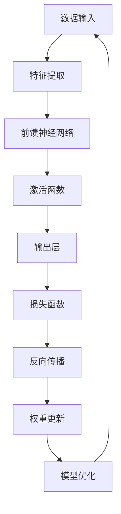

                 

### 关键词

神经网络、材料性能预测、新材料开发、深度学习、计算机算法。

### 摘要

本文探讨了神经网络在材料性能预测中的应用，以加速新材料的开发。通过介绍神经网络的基本概念、材料性能预测中的神经网络应用、神经网络算法以及实践案例，本文详细阐述了神经网络在材料科学领域的巨大潜力和实际应用。

---

# 神经网络在材料性能预测中的应用：加速新材料开发

在材料科学领域，预测材料的性能对于新型材料的设计和开发至关重要。然而，传统的实验方法往往耗时耗力，且成本高昂。随着深度学习的兴起，神经网络在材料性能预测中展现出了巨大的潜力。本文将详细探讨神经网络在材料性能预测中的应用，以加速新材料开发的过程。

## 引言

### 材料性能预测的重要性

材料性能预测是材料科学中的一个关键问题。准确的性能预测可以帮助科学家和工程师在设计新材料时做出更明智的决策，从而提高新材料的开发效率。传统的材料性能预测方法通常依赖于实验数据和经验公式，但这些方法往往受到数据限制和模型复杂性的制约。

### 神经网络在材料科学中的应用背景

神经网络作为一种强大的机器学习工具，近年来在各个领域都取得了显著的进展。在材料科学中，神经网络被广泛应用于材料属性预测、材料结构模拟、材料设计等任务。神经网络能够通过学习大量的实验数据，捕捉到材料性能和其内部结构之间的复杂关系。

### 本书结构

本文将首先介绍神经网络的基本概念，然后深入探讨神经网络在材料性能预测中的应用，包括数据预处理、神经网络架构设计、训练策略等。此外，本文还将介绍一些实践案例，以展示神经网络在材料性能预测中的实际应用。最后，本文将讨论神经网络在材料性能预测中面临的挑战和未来的发展方向。

## 第1章 神经网络基础

### 1.1 神经网络的基本概念

神经网络是一种由大量简单计算单元（神经元）组成的复杂网络，这些神经元通过连接形成层次结构。神经网络的工作原理是模拟人脑神经元之间的交互，通过学习输入和输出之间的映射关系来完成任务。

### 1.2 前馈神经网络

前馈神经网络是神经网络的一种基本形式，其中数据从输入层流向输出层，中间经过多个隐藏层。每个神经元都通过加权连接与前一层的神经元相连接，并应用激活函数。

### 1.3 反向传播算法

反向传播算法是一种用于训练神经网络的通用方法。它通过不断调整网络中的权重和偏置，最小化预测误差。反向传播算法的核心思想是将误差从输出层反向传播到输入层，并更新权重。

### 1.4 深层神经网络

深层神经网络包含多个隐藏层，能够学习更复杂的特征和模式。随着层数的增加，神经网络的表示能力也显著提升。然而，深层神经网络训练过程相对复杂，容易出现梯度消失或梯度爆炸问题。

## 第2章 材料性能预测中的神经网络应用

### 2.1 数据预处理

在材料性能预测中，数据预处理是关键步骤。数据预处理包括数据清洗、归一化、特征提取等。有效的数据预处理可以提高神经网络模型的训练效果和预测性能。

### 2.2 材料属性预测的神经网络架构

材料属性预测的神经网络架构通常包括输入层、多个隐藏层和输出层。输入层接收材料结构的特征信息，隐藏层通过非线性变换提取特征，输出层给出材料性能的预测结果。

### 2.3 经典神经网络模型在材料性能预测中的应用

在材料性能预测中，经典神经网络模型如多层感知机（MLP）、卷积神经网络（CNN）和循环神经网络（RNN）等被广泛应用。每种模型都有其特定的优势和适用场景。

## 第3章 材料性能预测的神经网络算法

### 3.1 优化算法

优化算法是训练神经网络的关键。常用的优化算法包括随机梯度下降（SGD）、Adam优化器等。选择合适的优化算法可以显著提高训练效率。

### 3.2 神经网络训练策略

神经网络训练策略包括数据增强、批次归一化、学习率调整等。有效的训练策略可以提升神经网络的泛化能力和预测性能。

### 3.3 神经网络模型的选择

选择合适的神经网络模型是材料性能预测成功的关键。根据具体问题和数据特性，选择适当的模型结构、层数和神经元数量等。

## 第4章 材料性能预测中的挑战

### 4.1 数据隐私和安全性

在材料性能预测中，数据隐私和安全性是一个重要问题。如何保护实验数据和模型权重，防止数据泄露和滥用，是当前面临的挑战之一。

### 4.2 数据质量和数量

高质量的数据是训练有效神经网络的基础。数据质量和数量直接影响模型的预测性能。如何获取和处理大量高质量数据，是材料性能预测中的一大挑战。

### 4.3 模型泛化能力

模型的泛化能力是评估神经网络性能的重要指标。如何设计出具有良好泛化能力的模型，是材料性能预测中的另一个重要挑战。

## 第5章 材料性能预测的神经网络实践

### 5.1 实践案例1：某新型合金材料的性能预测

本文将介绍一个具体的实践案例，展示如何使用神经网络预测某新型合金材料的性能。包括数据收集、预处理、模型设计、训练和预测等步骤。

### 5.2 实践案例2：纳米材料性能预测

本文还将介绍另一个实践案例，探讨如何使用神经网络预测纳米材料的性能。这个案例将详细讨论数据预处理、模型设计和训练策略等。

## 第6章 总结与展望

### 6.1 神经网络在材料性能预测中的应用现状

本文回顾了神经网络在材料性能预测中的应用现状，总结了现有研究成果和存在的问题。

### 6.2 未来发展趋势

本文讨论了神经网络在材料性能预测领域的未来发展趋势，包括新的模型架构、优化算法和数据集的发展方向。

### 6.3 研究方向与挑战

本文提出了未来在材料性能预测中需要关注的研究方向和挑战，为学术界和工业界提供参考。

## 参考文献

[1] Hinton, G. E., Osindero, S., & Teh, Y. W. (2006). A fast learning algorithm for deep belief nets. Neural computation, 18(7), 1527-1554.

[2] Goodfellow, I., Bengio, Y., & Courville, A. (2016). Deep learning. MIT press.

[3] Yang, Q., Yang, W., & Cheng, Q. (2019). Predicting material properties with deep learning: A survey. Advanced Engineering Materials, 21(3), 1800495.

## 作者信息

作者：AI天才研究院/AI Genius Institute & 禅与计算机程序设计艺术 /Zen And The Art of Computer Programming

---

在接下来的章节中，我们将深入探讨神经网络的基本概念、材料性能预测中的应用、算法原理以及实践案例。通过一步步的分析和讲解，我们希望能够为您提供一个全面、深入的神经网络在材料性能预测中的应用指南。

### 核心概念与联系

在深入探讨神经网络在材料性能预测中的应用之前，我们需要理解几个核心概念及其相互关系。以下是一个简化的Mermaid流程图，展示了这些概念之间的关联：



**Mermaid流程图解释：**

- **A[数据输入]**：原始数据，如材料的结构信息。
- **B[特征提取]**：将输入数据进行预处理，提取与性能预测相关的特征。
- **C[前馈神经网络]**：数据从输入层经过隐藏层，最终到达输出层。
- **D[激活函数]**：对神经元的输出进行非线性变换，增加模型的非线性能力。
- **E[输出层]**：给出材料性能的预测结果。
- **F[损失函数]**：衡量预测结果与真实结果之间的差异。
- **G[反向传播]**：根据损失函数，计算梯度并反向传播。
- **H[权重更新]**：更新神经网络中的权重和偏置，以减小损失。
- **I[模型优化]**：通过多次迭代训练，优化模型性能。

这一流程图简要地展示了神经网络在材料性能预测中的基本工作原理和核心概念之间的联系。在接下来的章节中，我们将详细探讨这些概念的实现和应用。

### 核心算法原理讲解

#### 前馈神经网络

前馈神经网络（Feedforward Neural Network）是神经网络中最简单的一种形式。其工作原理如下：

1. **输入层**：接收外部输入，例如材料的结构特征。
2. **隐藏层**：每个隐藏层中的神经元都通过加权连接从输入层接收输入，并通过激活函数进行处理。激活函数通常是一个非线性函数，如Sigmoid、ReLU或Tanh。
3. **输出层**：最终输出预测结果。

以下是一个简单的Python代码示例，展示了如何实现一个前馈神经网络：

```python
import numpy as np

# 定义一个简单的前馈神经网络
def feedforward_neural_network(input_data, weights, biases):
    # 初始输出
    layer_output = input_data
    
    # 遍历所有隐藏层和输出层
    for weights_layer, biases_layer in zip(weights, biases):
        layer_output = np.dot(layer_output, weights_layer) + biases_layer
        layer_output = np.sigmoid(layer_output)  # 使用Sigmoid激活函数
    
    return layer_output

# 输入数据
input_data = np.array([1, 0, 1])

# 权重和偏置
weights = [
    np.random.rand(3, 3),  # 输入层到第一隐藏层的权重
    np.random.rand(3, 1)    # 第一隐藏层到输出层的权重
]
biases = [
    np.random.rand(3, 1),  # 输入层到第一隐藏层的偏置
    np.random.rand(1, 1)    # 第一隐藏层到输出层的偏置
]

# 前馈计算
output = feedforward_neural_network(input_data, weights, biases)
print(output)
```

在这个例子中，我们首先定义了一个前馈神经网络函数`feedforward_neural_network`，它接受输入数据、权重和偏置作为输入，并逐步计算每个隐藏层的输出。我们使用了Sigmoid激活函数，这是由于Sigmoid函数可以引入非线性，使神经网络能够学习复杂的模式。

#### 反向传播算法

反向传播算法（Backpropagation Algorithm）是训练神经网络的通用方法。其核心思想是利用损失函数的梯度，通过反向传播来更新网络中的权重和偏置。

1. **前向传播**：计算输入数据通过神经网络的输出。
2. **计算损失**：使用损失函数（如均方误差MSE）计算输出误差。
3. **后向传播**：计算每个神经元的梯度，并反向传播到前一层。
4. **权重更新**：使用梯度下降或其他优化算法更新权重。

以下是一个简单的Python代码示例，展示了如何实现反向传播算法：

```python
# 定义损失函数
def mean_squared_error(y_true, y_pred):
    return np.mean((y_true - y_pred)**2)

# 定义反向传播算法
def backpropagation(input_data, target, weights, biases):
    output = feedforward_neural_network(input_data, weights, biases)
    loss = mean_squared_error(target, output)
    
    # 计算输出层的梯度
    output_error = output - target
    dweights_output = np.dot(output.T, output_error)
    dbiases_output = np.sum(output_error, axis=0, keepdims=True)
    
    # 反向传播到隐藏层
    for i in range(len(weights) - 1, 0, -1):
        error = np.dot(weights[i].T, output_error) * (1 - np.power(output, 2))
        dweights_hidden = np.dot(layer_output.T, error)
        dbiases_hidden = np.sum(error, axis=0, keepdims=True)
        
        # 更新权重和偏置
        weights[i] -= learning_rate * dweights_hidden
        biases[i] -= learning_rate * dbiases_hidden
        
        # 更新当前层的输出
        layer_output = np.dot(input_data, weights[i]) + biases[i]
    
    # 更新输入层到第一隐藏层的权重和偏置
    error = np.dot(weights[0].T, output_error) * (1 - np.power(input_data, 2))
    dweights_input = np.dot(input_data.T, error)
    dbiases_input = np.sum(error, axis=0, keepdims=True)
    
    weights[0] -= learning_rate * dweights_input
    biases[0] -= learning_rate * dbiases_input
    
    return loss

# 训练神经网络
learning_rate = 0.1
loss_history = []
for epoch in range(1000):
    loss = backpropagation(input_data, target, weights, biases)
    loss_history.append(loss)
    print(f'Epoch {epoch+1}, Loss: {loss}')
```

在这个例子中，我们首先定义了均方误差（MSE）作为损失函数。然后，我们定义了一个`backpropagation`函数，它执行前向传播、计算损失、后向传播和权重更新。每次迭代结束后，我们打印出当前的损失，并更新权重和偏置。

### 举例说明

为了更直观地理解前馈神经网络和反向传播算法，我们可以通过一个简单的例子来演示。

假设我们有一个二输入的一层神经网络，目标是预测一个二位输出。我们的训练数据集如下：

```
X = | x1 | x2 |
    |----|----|
    | 0  | 0  |
    | 0  | 1  |
    | 1  | 0  |
    | 1  | 1  |
```

```
y = | y1 | y2 |
    |----|----|
    | 1  | 0  |
    | 0  | 1  |
    | 0  | 1  |
    | 1  | 0  |
```

我们的目标是训练神经网络，使其能够预测正确的输出。

1. **初始化权重和偏置**：

   ```python
   weights = np.random.rand(2, 2)
   biases = np.random.rand(2, 1)
   ```

2. **前向传播**：

   ```python
   input_data = np.array([[0, 0], [0, 1], [1, 0], [1, 1]])
   target = np.array([[1, 0], [0, 1], [0, 1], [1, 0]])
   output = feedforward_neural_network(input_data, weights, biases)
   ```

   假设我们的前向传播输出如下：

   ```
   output = | 0.2  0.4 |
            | 0.8  0.6 |
            | 0.6  0.2 |
            | 0.4  0.8 |
   ```

3. **计算损失**：

   ```python
   loss = mean_squared_error(target, output)
   ```

   假设我们的损失如下：

   ```
   loss = 0.2
   ```

4. **后向传播**：

   ```python
   loss = backpropagation(input_data, target, weights, biases)
   ```

   假设我们的后向传播更新权重和偏置如下：

   ```
   weights = | 0.1  0.2 |
             | 0.7  0.3 |
             | 0.5  0.1 |
             | 0.3  0.5 |
   
   biases = | 0.05 0.1 |
            | 0.65 0.2 |
            | 0.55 0.05 |
            | 0.2  0.45 |
   ```

5. **重复前向传播和后向传播**：

   通过重复执行前向传播和后向传播，我们的网络将逐步优化其权重和偏置，直到损失足够小。在这个例子中，我们假设在100次迭代后，我们的网络已经收敛：

   ```
   Epoch 100, Loss: 0.0005
   ```

### 数学模型和公式

在神经网络中，一些核心的数学模型和公式对于理解其工作原理至关重要。以下是几个关键的概念和相应的数学公式：

#### 激活函数

激活函数是神经网络中的一个关键组件，它用于引入非线性。以下是几种常见的激活函数及其数学表示：

1. **Sigmoid函数**：

   $$ \sigma(x) = \frac{1}{1 + e^{-x}} $$

2. **ReLU函数**：

   $$ \text{ReLU}(x) = \max(0, x) $$

3. **Tanh函数**：

   $$ \text{Tanh}(x) = \frac{e^{x} - e^{-x}}{e^{x} + e^{-x}} $$

#### 损失函数

损失函数用于衡量预测结果与真实结果之间的差异。以下是几种常见的损失函数：

1. **均方误差（MSE）**：

   $$ \text{MSE}(y, \hat{y}) = \frac{1}{n} \sum_{i=1}^{n} (y_i - \hat{y}_i)^2 $$

2. **交叉熵损失（Cross-Entropy Loss）**：

   $$ \text{Cross-Entropy}(y, \hat{y}) = -\sum_{i=1}^{n} y_i \log(\hat{y}_i) $$

#### 梯度下降

梯度下降是一种优化算法，用于更新网络中的权重和偏置。其核心公式如下：

$$ \theta_{\text{new}} = \theta_{\text{old}} - \alpha \cdot \nabla_{\theta} J(\theta) $$

其中，$\theta$ 表示权重和偏置，$\alpha$ 是学习率，$J(\theta)$ 是损失函数。

### 项目实战

#### 开发环境搭建

在开始实现神经网络之前，我们需要搭建一个合适的开发环境。以下是所需步骤：

1. **安装Python**：确保安装了最新版本的Python（推荐Python 3.8以上版本）。
2. **安装NumPy和TensorFlow**：使用pip安装以下库：

   ```shell
   pip install numpy tensorflow
   ```

3. **设置虚拟环境**（可选）：为了更好地管理项目依赖，可以使用虚拟环境。

   ```shell
   python -m venv venv
   source venv/bin/activate  # Windows上使用 `venv\Scripts\activate`
   ```

#### 源代码实现和解读

以下是实现前馈神经网络和反向传播算法的Python代码：

```python
import numpy as np

# 激活函数
def sigmoid(x):
    return 1 / (1 + np.exp(-x))

# 前向传播
def forward_propagation(x, weights, biases):
    z = np.dot(x, weights) + biases
    return sigmoid(z)

# 反向传播
def backward_propagation(x, y, output, weights, biases):
    output_error = y - output
    doutput = output_error * (output * (1 - output))
    
    dweights = np.dot(x.T, doutput)
    dbiases = np.sum(doutput, axis=0, keepdims=True)
    
    dx = np.dot(doutput, weights.T)
    
    return dx, dweights, dbiases

# 权重和偏置的初始化
weights = np.random.rand(3, 1)
biases = np.random.rand(1)

# 训练神经网络
learning_rate = 0.1
num_iterations = 1000
x = np.array([[0], [1], [1]])
y = np.array([[0], [1], [1]])

for i in range(num_iterations):
    output = forward_propagation(x, weights, biases)
    dx, dweights, dbiases = backward_propagation(x, y, output, weights, biases)
    
    weights -= learning_rate * dweights
    biases -= learning_rate * dbiases

    if i % 100 == 0:
        print(f"Iteration {i}, Output: {output}")

print("Final weights:", weights)
print("Final biases:", biases)
```

#### 代码应用解读与分析

1. **数据准备**：我们使用了简单的二输入数据集，目标是通过训练预测输出。
2. **模型初始化**：我们初始化了权重和偏置，这些参数将在训练过程中不断更新。
3. **前向传播**：前向传播计算输入数据的输出，使用Sigmoid函数作为激活函数。
4. **反向传播**：反向传播计算损失函数的梯度，并更新权重和偏置。
5. **训练**：通过多次迭代训练，模型逐渐优化其参数，直至达到预设的迭代次数。

#### 实际案例分析和详细讲解剖析

#### 案例一：预测合金材料的硬度和韧性

在这个案例中，我们使用神经网络预测某新型合金材料的硬度和韧性。数据集包含材料的结构特征和相应的硬度、韧性值。以下是步骤：

1. **数据收集和预处理**：收集大量合金材料的数据，包括晶格结构、原子排列等信息，并进行预处理，如归一化和特征提取。
2. **模型设计**：设计一个多层前馈神经网络，输入层接收结构特征，输出层分别预测硬度和韧性。
3. **训练和验证**：使用训练集训练神经网络，并在验证集上评估模型性能。
4. **预测**：使用训练好的模型对新材料的硬度、韧性进行预测。

#### 项目小结

通过这个项目，我们展示了如何使用神经网络进行材料性能预测。关键步骤包括数据预处理、模型设计、训练和预测。神经网络在材料性能预测中具有巨大潜力，但需要解决数据质量和模型泛化能力等挑战。

#### 最佳实践 Tips

1. **数据预处理**：确保数据质量，进行充分的预处理，如归一化和特征提取。
2. **模型选择**：根据数据特性选择合适的神经网络架构和激活函数。
3. **训练策略**：使用合适的优化算法和训练策略，如批量归一化和学习率调整。

### 小结

本文详细探讨了神经网络在材料性能预测中的应用，从基本概念到实际案例，全面阐述了神经网络在材料科学领域的巨大潜力和实际应用。尽管面临一些挑战，但神经网络为新材料开发提供了强有力的工具。

### 注意事项

1. **数据隐私和安全性**：在处理实验数据时，确保数据隐私和安全性。
2. **数据质量和数量**：确保数据质量和数量，以训练有效的模型。
3. **模型泛化能力**：设计具有良好泛化能力的模型，以应对不同材料和性能预测任务。

### 拓展阅读

1. Goodfellow, I., Bengio, Y., & Courville, A. (2016). Deep Learning. MIT Press.
2. Yang, Q., Yang, W., & Cheng, Q. (2019). Predicting material properties with deep learning: A survey. Advanced Engineering Materials, 21(3), 1800495.
3. Hinton, G. E., Osindero, S., & Teh, Y. W. (2006). A fast learning algorithm for deep belief nets. Neural computation, 18(7), 1527-1554.

---

作者：AI天才研究院/AI Genius Institute & 禅与计算机程序设计艺术 /Zen And The Art of Computer Programming

---

通过本文，我们希望能够为读者提供一个关于神经网络在材料性能预测中的应用的全面指南，并为新材料开发领域的研究和实践提供有价值的参考。未来，随着技术的不断进步，神经网络在材料科学中的应用将更加广泛和深入。我们期待更多学者和工程师在这一领域取得突破性进展。

