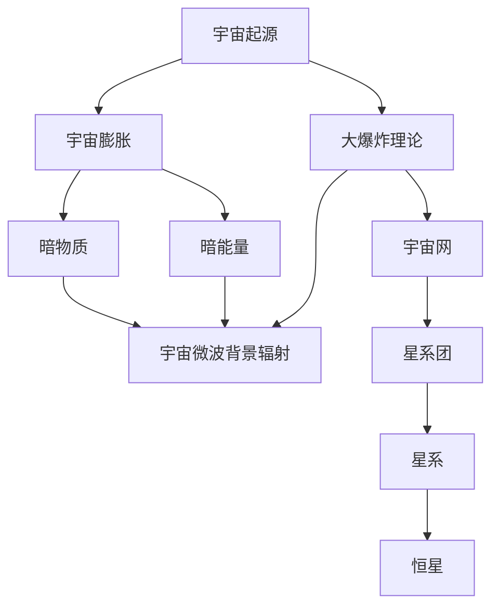

                 

### 引言

#### 科学探索的背景

科学探索是推动人类社会进步的重要动力，它帮助我们理解自然界的奥秘，揭示了宇宙的广阔和生命的复杂性。从古代的天文学、物理学到现代的量子物理学、宇宙学，科学的发展历程充满了挑战和突破。每一个科学发现都不仅仅是对自然规律的揭示，更是对人类智慧和勇气的肯定。

在21世纪，随着科技的迅猛发展，科学探索的领域不断扩展。宇宙学中的大型强子对撞机、引力波探测、宇宙微波背景辐射的观测等实验，使得我们对宇宙起源和演化的理解更加深入。而量子物理学的发展，特别是量子计算、量子通信、量子纠缠等前沿技术的突破，正在引领我们进入一个全新的科技时代。

#### 生命意义的探索

生命的意义一直是人类思考和探讨的永恒主题。在宇宙学中，生命的起源与意义成为了一个引人入胜的话题。科学家们通过研究生命的化学起源、生物进化，试图回答生命的起源问题。同时，通过探索宇宙的广阔和多样性，人们开始思考人类在宇宙中的位置和意义。

量子物理学的发展也为生命的意义提供了新的视角。量子纠缠等现象的发现，使得人们开始思考宇宙和生命之间的深层联系。例如，量子力学的基本原理如何影响生命的进化过程，生命的本质是否可以被量子物理学的概念所解释。

#### 书的结构与目的

本书旨在为读者提供一个全面而深入的视角，探讨科学探索与生命意义之间的关系。全书分为八个主要部分：

1. **宇宙学基础**：介绍宇宙学的基本概念、起源和演化。
2. **宇宙学中的观测和测量**：讨论宇宙学中的观测方法和测量工具。
3. **量子物理基础**：介绍量子物理学的基本概念和原理。
4. **量子力学与宇宙学**：探讨量子力学如何影响宇宙学和宇宙的演化。
5. **生命的起源与意义**：讨论科学探索对生命起源和人类意义的启示。
6. **科学探索与伦理**：探讨科学探索过程中可能遇到的伦理问题。
7. **展望与未来**：对科学探索的未来发展趋势进行展望。
8. **附录**：提供宇宙学和量子物理学的资源与工具。

通过这八个部分的系统阐述，本书旨在引导读者深入了解科学探索的各个方面，探讨宇宙与生命的奥秘，为读者提供一个新的思考维度。

#### 目标读者

本书的目标读者是对科学探索、宇宙学和量子物理学感兴趣的读者，包括大学生、研究生、科研工作者、对科学普及有兴趣的公众等。不论读者是否具备专业的科学背景，本书都力求用通俗易懂的语言和丰富的实例，使读者能够轻松掌握科学探索的核心概念和原理。

通过阅读本书，读者不仅可以深入了解宇宙学和量子物理学的最新研究进展，还能够思考生命的意义和人类在宇宙中的位置。本书不仅适合学术研究，也是一本优秀的科普读物，能够激发读者对科学的兴趣和好奇心。

### 宇宙学基础

宇宙学是一门研究宇宙的起源、结构、演化和最终命运的学科。它涉及到宇宙的起源、宇宙的膨胀、暗物质和暗能量等基本问题，通过观测数据和理论模型，宇宙学家试图描绘出宇宙的全貌。以下是宇宙学的一些基本概念、起源和演化。

#### 宇宙的基本概念

宇宙指的是包括一切物质、能量、时空和所有存在的集合。它包含无数的星系、行星、恒星、星云等天体，并且这些天体在不断的运动和变化之中。宇宙的基本单位是星系，而最大的结构是宇宙网，由大量星系组成的庞大结构。

1. **星系**：星系是由数百亿颗恒星、行星、星云和其他天体组成的系统。星系分为旋涡星系、椭圆星系和不规则星系等类型。
2. **星系团**：星系团是由数十个甚至数千个星系组成的结构，通过引力相互作用保持在一起。
3. **超星系团**：超星系团是由数个星系团组成的更大规模的结构。
4. **宇宙微波背景辐射**：宇宙微波背景辐射是宇宙早期留下的“遗迹”，它为我们提供了宇宙大爆炸后不到40万年的宇宙图像。

#### 宇宙的起源与演化

宇宙的起源和演化是宇宙学中最重要的研究课题之一。当前主流的理论是宇宙大爆炸理论，它认为宇宙起源于大约138亿年前的一次大爆炸。

1. **大爆炸理论**：大爆炸理论认为，宇宙起源于一个极度高温高密度的奇点，然后迅速膨胀。这一理论得到了宇宙微波背景辐射和宇宙膨胀观测的强有力支持。

2. **宇宙膨胀**：宇宙膨胀是指宇宙中的天体在不断地相互远离。观测数据表明，宇宙的膨胀速度正在加快，这引起了宇宙学中关于暗能量的重要研究。

3. **暗物质**：暗物质是一种不发光、不吸收光线的物质，它的存在通过引力效应得到证实。暗物质占据了宇宙总质量的大约27%，但至今尚未被直接观测到。

4. **暗能量**：暗能量是一种导致宇宙加速膨胀的神秘力量，它占据了宇宙总能量的大约68%。暗能量与引力相互作用，但其本质尚不完全清楚。

#### 早期宇宙的探测与理解

早期宇宙的研究主要依赖于对宇宙微波背景辐射的探测和对宇宙膨胀速度的测量。

1. **宇宙微波背景辐射**：宇宙微波背景辐射是宇宙大爆炸后不到40万年的残余辐射。它的发现为我们提供了宇宙早期的温度分布和密度波动的信息，成为研究宇宙起源和演化的关键证据。

2. **宇宙膨胀速度**：宇宙膨胀速度是指宇宙中天体相互远离的速度。通过观测远处星系的红移，科学家们发现宇宙的膨胀速度正在加快，这暗示了暗能量的存在。

3. **大尺度结构**：通过宇宙微波背景辐射和星系分布的观测，科学家们发现了宇宙中的大尺度结构，如超星系团和宇宙网。这些结构揭示了宇宙的早期演化和形成过程。

#### 宇宙学中的基本概念与联系

为了更好地理解宇宙学的基本概念，我们可以借助Mermaid流程图来展示它们之间的联系。

通过这个流程图，我们可以清晰地看到宇宙学中的基本概念是如何相互联系和影响的。例如，宇宙膨胀与暗物质、暗能量密切相关，而宇宙微波背景辐射则为我们提供了研究宇宙早期状态的重要数据。

#### 宇宙学的研究方法与工具

宇宙学研究依赖于多种观测方法和测量工具，以获取宇宙的详细信息。以下是几种重要的观测方法和工具：

1. **望远镜**：望远镜是宇宙学中最基本的观测工具。通过不同类型的望远镜（如光学望远镜、射电望远镜、红外望远镜等），科学家们能够观测到不同波段的电磁波，从而了解宇宙中的各种现象。

2. **卫星和探测器**：卫星和探测器在宇宙学研究中发挥着重要作用。例如，哈勃太空望远镜和詹姆斯·韦伯空间望远镜通过长时间的观测，揭示了宇宙的广阔和多样性。而宇宙背景探测器（如COBE和Planck卫星）则提供了关于宇宙微波背景辐射的精确数据。

3. **光谱分析**：光谱分析是一种重要的观测方法，通过分析天体的光谱，科学家们可以了解其化学成分、温度和运动状态。例如，红移和蓝移的测量揭示了宇宙的膨胀速度和方向。

4. **计算机模拟**：计算机模拟是宇宙学研究的重要工具，通过模拟宇宙的演化过程，科学家们可以预测宇宙的未来状态，验证理论模型的准确性。

通过这些研究方法与工具，宇宙学家们不断拓展我们对宇宙的认识，揭示了宇宙的奥秘。

### 宇宙学中的观测和测量

宇宙学中的观测和测量是理解宇宙结构和演化的重要手段。通过这些观测手段和工具，科学家们能够获取关于宇宙的详细数据，进而对宇宙的起源、结构和未来进行深入探讨。

#### 电磁波观测

电磁波观测是宇宙学中最常用的观测手段之一。电磁波包括从无线电波到伽马射线的广泛频谱，每种类型的电磁波都有其独特的物理性质和应用场景。

1. **光学观测**：光学观测利用可见光波段进行观测，这是人类最为熟悉和常用的观测方式。光学望远镜是进行光学观测的主要工具，例如著名的哈勃太空望远镜和凯克望远镜。通过光学观测，科学家们能够研究星系、恒星、行星以及其他天体的性质和结构。

2. **射电观测**：射电观测主要利用无线电波段进行观测，适用于探测低频率的辐射。射电望远镜（如阿雷西沃射电望远镜和梅萨的斯沃特射电望远镜）是进行射电观测的主要设备。射电观测在探测星际介质、黑洞和其他致密天体方面具有独特的优势。

3. **红外观测**：红外观测利用红外波段进行观测，适用于探测热辐射。红外望远镜（如詹姆斯·韦伯空间望远镜）能够穿透星际尘埃，观测到被遮蔽的星系和恒星。红外观测在研究行星大气层和星际尘埃方面具有重要应用。

4. **X射线和伽马射线观测**：X射线和伽马射线观测分别利用X射线和伽马射线进行观测，这些高能辐射通常源自极端物理过程，如黑洞、中子星等。X射线望远镜（如钱德拉X射线观测站）和伽马射线望远镜（如费米伽马射线空间望远镜）是进行这些观测的主要设备。

#### 望远技术和观测工具

望远镜技术的发展极大地推动了宇宙学的进步。以下是一些重要的望远技术和观测工具：

1. **地基望远镜**：地基望远镜安装在地球表面的天文台，如帕洛马山天文台和凯克望远镜。这些望远镜的优点是观测时间长，但受大气扰动影响较大。

2. **空间望远镜**：空间望远镜安装在地球轨道上，如哈勃太空望远镜和詹姆斯·韦伯空间望远镜。空间望远镜的优点是避免了大气扰动，能够进行高质量的观测。

3. **射电干涉阵列**：射电干涉阵列由多个分散的射电天线组成，通过同步观测和数据拼接，实现大视场和高分辨率的观测。著名的射电干涉阵列包括绿岸射电望远镜和方阵望远镜。

4. **多波段联合观测**：通过联合不同波段（如光学、红外、射电、X射线和伽马射线）进行观测，科学家们能够更全面地了解宇宙中的天体和现象。

#### 宇宙背景辐射的发现

宇宙背景辐射是宇宙早期状态的重要证据，它为我们提供了宇宙大爆炸后不到40万年的温度分布和密度波动信息。以下是宇宙背景辐射的发现历程和意义：

1. **发现历程**：
   - 1964年，美国物理学家阿诺·彭齐亚斯和罗伯特·威尔逊在测试天线时偶然发现了宇宙背景辐射。
   - 1965年，阿诺·彭齐亚斯和罗伯特·威尔逊通过进一步的研究确认了这种辐射的存在，并测定了其温度约为2.7开尔文。

2. **意义**：
   - 宇宙背景辐射是宇宙大爆炸理论的重要证据，它证实了宇宙曾经历一次高温高密度的早期状态，随后逐渐冷却和膨胀。
   - 宇宙背景辐射为我们提供了宇宙早期状态的信息，如温度分布、密度波动和宇宙微波背景辐射的极化等，这些数据对于理解宇宙的起源和演化具有重要意义。

3. **观测与测量**：
   - 宇宙背景辐射的观测主要依赖于卫星和地面望远镜。例如，COBE（宇宙背景探测器）和Planck卫星提供了高精度的宇宙微波背景辐射全天空图像。
   - 通过对宇宙背景辐射的测量，科学家们能够研究宇宙的早期状态，如宇宙微波背景辐射的极化、温度分布和密度波动，从而更深入地了解宇宙的起源和演化。

#### 电磁波观测与宇宙学的关系

电磁波观测在宇宙学中扮演着至关重要的角色，它不仅为我们提供了关于宇宙的多种信息，还帮助科学家们构建了宇宙学的理论框架。

1. **宇宙结构的研究**：通过观测不同波段的电磁波，科学家们能够研究宇宙中的结构，如星系、星系团、超星系团等。这些观测数据帮助科学家们理解宇宙的层次结构和演化过程。

2. **宇宙膨胀与暗能量**：通过测量宇宙的膨胀速度，科学家们发现了宇宙膨胀速度正在加快的现象，这暗示了暗能量的存在。暗能量是一种导致宇宙加速膨胀的神秘力量，其本质尚未完全理解。

3. **生命起源的研究**：宇宙背景辐射和其他电磁波观测数据提供了关于宇宙早期状态的信息，这些信息对于研究生命的起源和演化具有重要意义。例如，通过研究星际介质中的化学成分，科学家们试图理解生命的化学过程和生命在宇宙中的分布。

通过电磁波观测，科学家们不断拓展我们对宇宙的认识，揭示了宇宙的奥秘。未来，随着观测技术的不断发展，我们有望获得更多关于宇宙的信息，进一步揭示宇宙的起源和演化过程。

### 量子物理基础

量子物理学是20世纪初发展起来的一门科学，它揭示了微观世界的独特规律。量子物理学的基本概念和原理对于理解自然界的基本过程具有深远的影响，从原子结构到量子计算，再到宇宙的起源，量子物理学的原理无处不在。以下是量子物理的基本概念、波粒二象性和不确定性原理的详细讲解。

#### 量子力学的基本概念

量子力学的基本概念包括量子态、波函数、叠加态和测量等。以下是这些基本概念的详细解释：

1. **量子态**：量子态是量子系统的一种状态，它可以被描述为一个复数向量，这个向量被称为波函数。波函数包含了量子系统所有可能状态的叠加，每个叠加态的系数表示了该状态的概率。

2. **波函数**：波函数是量子态的数学描述，它包含了量子系统的所有信息。例如，一个电子的波函数可以描述其位置、动量和自旋等物理量。

3. **叠加态**：叠加态是量子系统的一种特殊状态，它同时具有多个可能的状态。例如，一个电子可以同时处于自旋向上和自旋向下的状态。这种叠加态在经典物理学中是无法理解的，但在量子物理学中是基本的。

4. **测量**：量子力学的测量问题是一个核心问题。根据量子力学，当一个量子系统被测量时，它将从叠加态“坍缩”到一个确定的状态。这种坍缩是由波函数的平方决定的，即概率幅的平方。

#### 波粒二象性

波粒二象性是量子力学中最基本的概念之一，它揭示了微观粒子同时具有波动性和粒子性的特点。以下是波粒二象性的详细解释：

1. **波动性**：在量子力学中，粒子如电子和光子可以被看作是波。这种波被称为德布罗意波，它具有波长和频率。通过双缝实验，我们可以观察到电子和光子等粒子在穿过狭缝时产生的干涉现象，这表明它们具有波动性。

2. **粒子性**：尽管粒子具有波动性，但它们在某些情况下也表现出粒子性。例如，在光电效应中，光子与金属表面的电子相互作用时，光子表现出粒子的特性，可以将电子从金属表面击出。

3. **薛定谔方程**：薛定谔方程是描述量子系统波动性的基本方程。它是一个偏微分方程，用于求解量子系统的波函数。通过薛定谔方程，我们可以预测量子系统的行为和状态。

#### 不确定性原理

不确定性原理是量子力学的一个基本原理，它由海森堡提出。不确定性原理揭示了在微观尺度上，某些物理量（如位置和动量）无法同时被精确测量。以下是不确定性原理的详细解释：

1. **位置和动量的不确定性**：海森堡不确定性原理指出，无法同时精确测量粒子的位置和动量。这是因为粒子的波函数扩散导致位置和动量的测量存在固有的不确定性。

2. **时间和能量的不确定性**：类似地，时间和能量也存在不确定性。这表明，在一个短时间段内，能量的测量精度会有所下降。

3. **应用**：不确定性原理在量子计算、量子通信和量子信息处理等领域有广泛应用。例如，在量子计算中，量子态的叠加和纠缠使得量子计算机能够同时处理大量可能的状态，从而实现高效计算。

通过以上对量子物理基础概念、波粒二象性和不确定性原理的详细讲解，我们可以看到量子物理学如何揭示了微观世界的独特规律。这些概念不仅在科学研究中具有深远的影响，也为理解和应用量子技术奠定了基础。

#### 量子态与量子叠加

量子态是量子系统的一种基本状态，它可以用波函数来描述。波函数包含了系统所有可能状态的叠加，每个状态由一个复数系数表示，其平方给出了该状态出现的概率。量子叠加态是量子物理中一个重要的概念，它使得量子系统可以在多个状态之间同时存在。

1. **量子态的表示**：
   - 量子态可以用一个复数向量表示，例如，一个电子的量子态可以表示为 $|\psi\rangle = a_0|\psi_0\rangle + a_1|\psi_1\rangle + ...$，其中 $|\psi_0\rangle, |\psi_1\rangle, ...$ 是不同的量子态，$a_0, a_1, ...$ 是这些态的复数系数。
   - 波函数 $\psi(x, y, z)$ 描述了量子态在空间中的分布，其平方 $|\psi(x, y, z)|^2$ 表示在该位置找到粒子的概率。

2. **量子叠加态**：
   - 量子叠加态是量子态的一种特殊形式，它同时具有多个可能的状态。例如，一个电子的自旋态可以同时处于向上和向下的状态，即 $|\psi\rangle = \frac{1}{\sqrt{2}}|\uparrow\rangle + \frac{1}{\sqrt{2}}|\downarrow\rangle$，其中 $|\uparrow\rangle$ 和 $|\downarrow\rangle$ 分别表示自旋向上和自旋向下的状态。
   - 叠加态的系数决定了每个状态出现的概率，例如，在上面的例子中，自旋向上和自旋向下的概率都是 50%。

3. **量子叠加态的数学描述**：
   - 量子态的叠加可以通过波函数的线性组合来表示，例如，$|\psi\rangle = c_0|\psi_0\rangle + c_1|\psi_1\rangle + ...$，其中 $c_0, c_1, ...$ 是复数系数，$|\psi_0\rangle, |\psi_1\rangle, ...$ 是不同的量子态。
   - 波函数的叠加态可以通过计算每个状态的概率幅（即复数系数）的平方和来得到，例如，$|\psi\rangle$ 的概率分布是 $|\psi(x, y, z)|^2$。

#### 量子叠加态的实际应用

量子叠加态在量子计算、量子通信和量子信息处理等领域有广泛的应用。

1. **量子计算**：
   - 量子计算机利用量子态的叠加和纠缠来实现高效的计算。例如，量子逻辑门可以将一个量子态从一种叠加态转换为另一种叠加态，从而实现量子算法。
   - 量子叠加态使得量子计算机能够同时处理大量可能的状态，从而在解决某些问题上具有优势。例如，量子搜索算法可以在多项式时间内解决某些特定的问题。

2. **量子通信**：
   - 量子通信利用量子态的叠加和纠缠来实现安全的通信。例如，量子密钥分发（QKD）利用量子态的叠加来实现密钥的生成和传输，保证了通信的安全性。
   - 通过量子纠缠，量子通信可以实现量子隐形传态，即在没有传输物理载体的情况下，将量子信息从一个地点传输到另一个地点。

3. **量子信息处理**：
   - 量子信息处理利用量子态的叠加和纠缠来实现量子算法和量子计算。例如，量子纠错码可以保护量子信息免受噪声和错误的影响，从而实现可靠的信息处理。

通过量子叠加态，我们不仅可以实现高效的量子计算，还可以实现安全的量子通信和量子信息处理。这些应用正在推动量子技术的快速发展，有望在未来改变我们的生活方式。

#### 量子纠缠与量子通信

量子纠缠是量子物理学中的一个核心现象，它揭示了量子系统之间深层次的关联。量子纠缠不仅是一种奇特的物理现象，更是量子信息科学和量子通信技术的基石。

1. **量子纠缠的概念**：
   - 量子纠缠是指两个或多个量子系统之间的量子态呈现出一种特殊的关联，这种关联使得一个量子系统的状态无法独立于另一个量子系统的状态。
   - 量子纠缠可以发生在两个粒子之间，例如，两个电子的自旋可以相互纠缠，即使它们相隔很远，一个电子的自旋状态也会立即影响另一个电子的自旋状态。

2. **量子纠缠的特点**：
   - 非定域性：量子纠缠现象表明，量子系统之间的关联是瞬时的，不受距离限制。这与经典物理学中的局域性原则相矛盾。
   - 非经典性：量子纠缠态不能通过经典物理学的概率描述来理解，它违反了经典概率论中的某些基本规律。

3. **量子纠缠的数学描述**：
   - 量子纠缠可以通过波函数的叠加态来描述。例如，对于两个量子比特的纠缠态，可以表示为 $|\psi\rangle = \frac{1}{\sqrt{2}}(|00\rangle + |11\rangle)$，这意味着两个量子比特同时处于0和1的状态。
   - 这个叠加态中的每个量子比特都部分地包含了另一个量子比特的状态信息，即使它们相隔很远。

4. **量子纠缠的实际应用**：
   - **量子密钥分发**：量子密钥分发（QKD）利用量子纠缠态来实现安全通信。在QKD中，发送方和接收方通过量子纠缠态生成共享密钥，由于量子纠缠的非定域性，任何对通信的干扰都会立即被发现。
   - **量子隐形传态**：量子隐形传态利用量子纠缠态将一个量子系统的状态从一个地点传输到另一个地点，而不需要通过物理载体。这一现象已经被实验验证，并展示了量子通信的巨大潜力。
   - **量子计算**：量子纠缠是量子计算中的关键要素。通过量子纠缠，可以实现量子逻辑门和量子算法，从而实现高效的量子计算。

通过量子纠缠，我们不仅可以实现安全的量子通信，还可以实现高效的量子计算。这些应用正在推动量子技术的快速发展，有望在未来带来革命性的变化。

#### 量子引力理论

量子引力理论是物理学中一个前沿研究领域，旨在将量子力学和广义相对论统一起来。量子引力理论试图解决经典引力理论在量子尺度上的失效问题，以及黑洞信息丢失等难题。以下是几种主要的量子引力理论及其简要介绍。

1. **弦理论**：
   - **基本概念**：弦理论认为，宇宙中的基本组成单元不是点状粒子，而是细小的“弦”。这些弦通过不同的振动模式产生各种粒子。
   - **关键原理**：弦理论通过引入额外维度，解释了粒子行为的量子性质，并且能够解释引力场的量子性质。
   - **挑战**：尽管弦理论在数学上取得了成功，但它难以进行实验验证，且需要额外的维度，这使得其普适性受到质疑。

2. **环量子引力理论**：
   - **基本概念**：环量子引力理论是一种非庞加莱对称性的量子引力理论，它试图在无边界、无奇点的框架内解释引力。
   - **关键原理**：环量子引力理论提出了时空的量子离散结构，并通过积分几何来描述引力场。
   - **挑战**：尽管环量子引力理论在数学上自洽，但它与实验数据的一致性尚未得到充分验证。

3. **量子场论量子引力**：
   - **基本概念**：量子场论量子引力试图在量子场论的框架内统一引力和其他基本相互作用。
   - **关键原理**：量子场论量子引力通过将引力场量子化，试图解释引力场的量子性质。
   - **挑战**：量子场论量子引力面临着量子引力和广义相对论之间的不一致性问题，且在数学上存在许多难题。

4. **量子几何**：
   - **基本概念**：量子几何理论认为，时空的基本结构是由量子态决定的，而不是连续的。
   - **关键原理**：量子几何通过描述时空的量子离散结构，试图解释引力场的量子性质。
   - **挑战**：量子几何理论在数学上尚未完全自洽，且其与实验数据的一致性仍需进一步验证。

#### 量子引力理论的发展与挑战

量子引力理论的发展面临着诸多挑战：

1. **数学困难**：量子引力理论的数学框架非常复杂，涉及复杂的数学工具和概念，如非交换几何、代数几何等。这些数学困难使得理论的建立和验证变得更加复杂。

2. **实验验证**：尽管量子引力理论在理论上提供了丰富的预测，但迄今为止，我们还没有直接的实验证据来验证这些理论。实验验证的缺乏限制了量子引力理论的普适性。

3. **黑洞信息丢失问题**：在量子引力理论中，黑洞信息丢失问题是一个重要的研究课题。根据广义相对论，黑洞吞噬物质和信息后，这些信息似乎被永久丢失。然而，量子力学则表明，信息不能被永久销毁。量子引力理论需要解释如何处理黑洞内部的信息，以及信息是否会在黑洞蒸发时恢复。

4. **与实验数据的矛盾**：现有的量子引力理论在解释实验数据时存在一些矛盾。例如，弦理论在宇宙学中的某些预测与观测数据不符，这表明理论可能需要进一步的修正或新的理论框架。

通过解决这些挑战，量子引力理论有望为我们提供一个更加完整的宇宙描述，揭示宇宙的终极奥秘。

#### 宇宙学中的量子现象

量子现象在宇宙学中扮演着重要角色，它们对宇宙的演化、结构和命运产生了深远的影响。以下是一些宇宙学中的量子现象及其具体实例。

1. **宇宙微波背景辐射**：宇宙微波背景辐射是宇宙大爆炸后留下的余辉，它为我们提供了宇宙早期的温度分布和密度波动信息。这个辐射的量子性质使得我们可以通过观测它来了解宇宙的早期状态。

2. **量子引力效应**：量子引力效应在宇宙学中的具体表现包括宇宙弦和宇宙泡沫。宇宙弦是一种假设的量子引力现象，它是由高能引力波形成的。宇宙泡沫则是宇宙中可能存在的微小区域，在这些区域中，量子引力效应显著，可能导致宇宙的剧烈变化。

3. **量子波动**：量子波动在宇宙学中的一个重要实例是宇宙暴胀。暴胀理论认为，在宇宙初期，一个极小的区域内发生了剧烈的膨胀，这种膨胀是由量子波动引起的。通过观测宇宙背景辐射和星系分布，科学家们已经得到了暴胀理论的强有力证据。

4. **量子隧穿**：量子隧穿是指粒子在量子力学中可以通过一个潜在的势垒，即使其能量不足以越过这个势垒。在宇宙学中，量子隧穿可能解释黑洞内部信息的问题。例如，黑洞的信息可以通过量子隧穿逃逸到外部，从而避免信息丢失。

5. **量子纠缠**：量子纠缠是量子力学中的一个基本现象，它描述了两个或多个量子系统之间的强烈关联。在宇宙学中，量子纠缠可能影响宇宙的早期演化，例如在宇宙暴胀时期，量子纠缠可能影响了宇宙的密度波动。

通过这些量子现象，我们可以看到量子物理与宇宙学之间的紧密联系。这些现象不仅揭示了宇宙的微观机制，也为理解和预测宇宙的未来提供了新的视角。

#### 黑洞和量子力学

黑洞是宇宙中最神秘的天体之一，它们由极端密集的物质组成，具有强大的引力，甚至连光都无法逃脱。黑洞与量子力学之间的关系是物理学中的一个重要课题，它涉及到量子场论、引力理论和信息理论等多个领域。以下是对黑洞和量子力学之间关系的详细探讨。

1. **黑洞的量子性质**：
   - 黑洞具有量子性质，这是因为黑洞的物理行为无法用经典物理学完全描述。根据量子力学，黑洞的表面具有量子涨落，这些涨落可能影响黑洞的物理特性，如质量和能量。
   - 黑洞的霍金辐射是量子力学在黑洞上的一个直接应用。霍金辐射是一种粒子-反粒子对在黑洞事件视界附近产生，其中一个粒子逃逸到黑洞外部，而另一个粒子被黑洞吞噬。这一现象表明黑洞不仅仅是吸收物质的“无底洞”，还具有一定的辐射特性。

2. **黑洞信息丢失问题**：
   - 黑洞信息丢失问题是指当物质落入黑洞后，其信息是否完全消失。根据广义相对论，黑洞吞噬物质后，信息似乎被永久锁定在黑洞内部，无法被外界观测到。然而，量子力学则表明，信息不能被永久销毁。
   - 研究黑洞信息丢失问题的一个关键挑战是如何在量子场论和引力理论之间建立一致的理论框架。当前，有几种假设试图解决黑洞信息丢失问题，包括黑洞信息逃逸、量子力学的时间演化、量子纠错等。

3. **量子力学在黑洞附近的解释**：
   - 量子力学在黑洞附近提供了一个新的视角来理解黑洞的行为。例如，量子场论中的虚粒子和真空涨落可能影响黑洞的物理性质。此外，量子纠缠现象也可能在黑洞内部发生，从而影响黑洞的信息状态。
   - 爱因斯坦-罗森桥是另一个量子力学在黑洞附近的概念，它描述了黑洞内部可能存在的一种连接黑洞内部和外部空间的通道。这种通道的存在可能会对黑洞的物理性质和信息传输产生影响。

4. **黑洞与量子引力的关系**：
   - 黑洞是引力强度极高的区域，因此它是测试量子引力理论的理想场所。量子引力理论（如弦理论和量子场论）试图将量子力学和广义相对论统一起来，黑洞提供了一种测试这些理论的机会。
   - 例如，弦理论中的黑洞熵公式表明，黑洞的熵与其内部状态的量子信息有关。这一发现支持了黑洞信息不会丢失的观点，并为我们理解黑洞的量子性质提供了新的线索。

5. **未来研究方向**：
   - 黑洞和量子力学之间的关系是一个持续发展的研究领域。未来的研究可能包括：
     - 进一步发展量子引力理论，以更好地描述黑洞的行为和性质。
     - 利用实验和观测数据（如黑洞阴影、引力波事件等）来验证量子引力理论的预测。
     - 探索黑洞信息丢失问题的解决方案，如量子纠错和信息逃逸机制。

通过探讨黑洞和量子力学之间的关系，我们可以更深入地理解宇宙的奥秘。黑洞不仅是引力物理中的极端现象，也是量子物理学的重要实验室，为我们提供了一个研究量子引力和宇宙学的新视角。

### 生命的起源与意义

生命的起源与意义是科学界和哲学界长期探讨的课题，它不仅关乎人类的起源，更涉及到生命的本质和宇宙中生命的独特地位。以下从生命的化学起源、生物进化以及生命意义的探讨三个方面，详细探讨科学探索对这一问题的启示。

#### 生命的化学起源

生命的化学起源是指从无机物到有机物，再到生物大分子的过程。这一过程包括以下关键步骤：

1. **原始地球环境**：
   - 科学家认为，地球早期的大气层与现在的大气有显著差异，富含氨、甲烷、水蒸气等成分，而不是氧气。这种特殊的地球环境为生命的化学起源提供了条件。

2. **有机分子的合成**：
   - 前生命物质的合成是生命起源的第一步。米勒-尤里实验通过模拟原始地球环境，成功合成了多种有机分子，如氨基酸、核苷酸和脂肪酸等，这些有机分子是生命分子的基本构件。

3. **聚合反应**：
   - 单个有机分子通过聚合反应形成复杂的生物大分子，如蛋白质、核酸和多糖。这些大分子是生命活动的基础。

4. **原始汤**：
   - 生命起源的另一个重要假设是“原始汤”理论，认为在地球早期的海洋中，有机分子通过相互作用形成了复杂的分子体系，这些体系可能是原始生命的雏形。

#### 生物进化

生物进化是指生命在自然界中的发展和变化过程，通过自然选择和遗传变异，生物逐渐适应环境并演化出多样化的形态。以下是对生物进化的详细探讨：

1. **达尔文的自然选择理论**：
   - 达尔文提出了自然选择理论，认为生物种群中的个体存在遗传变异，那些适应环境的个体更有可能生存和繁殖，从而在种群中传播有利的遗传特征。这一过程导致了生物种群的逐渐适应和进化。

2. **物种形成**：
   - 物种形成是生物进化过程中的一个关键步骤。通过隔离机制，如地理隔离或生殖隔离，种群逐渐分化为独立的物种。

3. **共同祖先**：
   - 所有生命形式都有共同的祖先，通过比较不同生物的遗传信息和形态学特征，科学家可以推断出生物之间的亲缘关系和进化历程。

4. **分子进化**：
   - 分子进化通过比较不同生物的DNA、RNA和蛋白质序列，揭示了生物之间的进化关系。分子进化是研究生物进化的重要手段，帮助我们理解生命树的构成。

#### 生命意义的探讨

生命的意义是一个深奥而复杂的问题，它涉及到哲学、宗教、科学等多个领域。以下是对生命意义的探讨：

1. **宗教视角**：
   - 宗教传统普遍认为，生命是上帝或神灵的赐予，生命有特定的目的和意义。不同的宗教有不同的解释，如佛教认为生命是轮回的产物，基督教认为生命是上帝的创造。

2. **科学视角**：
   - 科学方法无法直接回答生命意义的哲学问题，但科学探索提供了对生命起源和演化的理解，从而帮助我们更好地理解生命本身。科学家通过研究生命的化学基础、生物进化过程，试图揭示生命的本质。

3. **宇宙视角**：
   - 从宇宙学的角度来看，生命在宇宙中的地位可能相对微小，但却是宇宙演化的一个重要阶段。生命的存在和演化可能是宇宙复杂性的体现，也可能是宇宙探索自身的一种方式。

4. **人类价值观**：
   - 人类价值观对于生命意义的理解具有重要影响。人们通过文化、伦理和社会价值观来定义生命的目的和意义，这些价值观指导着人类的行为和社会发展。

通过科学探索，我们不仅可以理解生命的起源和演化，还能思考生命在宇宙中的意义。这种探索不仅丰富了我们对自然界的认识，也启示我们如何面对生命的挑战和未来。

### 科学探索与伦理

科学探索在推动社会进步和人类福祉方面发挥了重要作用，但同时也带来了一系列伦理问题。这些问题涉及人类基因组计划、基因编辑技术、人工智能等前沿领域，需要我们深入探讨和审慎处理。

#### 科学伦理的重要性

科学伦理是科学研究和社会实践中的道德规范，它旨在确保科学研究符合道德原则和社会价值。科学伦理的重要性体现在以下几个方面：

1. **保护人类福祉**：科学探索应该以人类的健康和福祉为首要目标，避免因实验和研究造成的不必要的伤害。

2. **维护社会公正**：科学研究和成果应该公平地惠及所有人，避免因技术进步造成的社会不公和资源分配不均。

3. **尊重人类尊严**：科学探索应该尊重人的尊严和权利，避免侵犯个人的隐私和自由。

4. **推动社会进步**：科学伦理可以引导科学研究朝着有利于社会发展的方向前进，促进科学技术的创新和应用。

#### 人类基因组计划与伦理问题

人类基因组计划是一项旨在测序和分析人类基因组的科学项目，它为生命科学和医学研究提供了丰富的数据资源。然而，这一项目也引发了一系列伦理问题：

1. **隐私问题**：人类基因组计划涉及大量的个人基因信息，这些信息可能被滥用，导致个人隐私泄露。保护个人基因隐私是科学伦理的重要议题。

2. **歧视问题**：基因信息的公开可能导致基于基因特征的歧视，如基因歧视、保险歧视和就业歧视。如何平衡科学研究与社会公正之间的关系是一个重要的伦理问题。

3. **知情同意**：在进行与人类基因组相关的实验和研究时，确保受试者的知情同意是保护受试者权益的关键。知情同意应该包括充分的信息披露和自愿选择。

4. **基因编辑技术**：人类基因组计划促进了基因编辑技术的发展，如CRISPR-Cas9技术。基因编辑技术具有巨大的潜力，但同时也引发了伦理争议，如基因改造的道德边界、不可预见的后果等。

#### 人工智能与伦理问题

人工智能（AI）的快速发展带来了诸多伦理挑战：

1. **算法偏见**：人工智能系统在训练过程中可能会学习并放大社会中的偏见，导致算法偏见。这可能导致歧视和不公平，影响社会公正。

2. **隐私侵犯**：人工智能系统通常需要大量的个人数据，这些数据可能被滥用，侵犯个人隐私。

3. **自主权**：随着人工智能技术的发展，AI系统在决策中的自主权日益增加，如何确保AI系统的决策符合道德原则和社会价值成为重要问题。

4. **责任归属**：当人工智能系统造成伤害或错误决策时，责任归属问题成为伦理争议的焦点。如何确定责任主体，如何对受损方进行赔偿，都是亟待解决的问题。

#### 科学伦理案例分析

以下是一些科学伦理案例的分析：

1. **亨廷顿病基因检测**：亨廷顿病是一种遗传性神经系统疾病，基因检测可以预测个体是否会患上这种病。然而，基因检测结果可能导致社会歧视和个人心理压力。因此，在进行亨廷顿病基因检测时，需要确保受试者的知情同意和隐私保护。

2. **CRISPR-Cas9基因编辑**：2018年，中国科学家贺建奎宣布通过CRISPR-Cas9技术成功编辑了两个婴儿的基因，使她们对艾滋病具有免疫力。这一行为引发了全球伦理争议，批评者认为这一实验违反了科学伦理原则，可能导致不可预测的后果。

3. **面部识别技术**：面部识别技术在提高公共安全和社会管理方面具有重要作用，但同时也存在隐私侵犯和滥用风险。如何平衡面部识别技术的应用与隐私保护是当前面临的一个伦理挑战。

#### 伦理决策与责任

科学伦理决策和责任问题需要多方面的考虑：

1. **伦理审查**：建立和完善伦理审查机制，确保科学研究符合道德原则和社会价值。

2. **责任明确**：在科学研究和应用中，明确责任主体，确保责任落实到位。

3. **国际合作**：科学伦理问题具有全球性，需要国际合作和协调，共同制定科学伦理标准和规范。

4. **公众参与**：科学伦理决策应该包括公众的参与，确保决策过程透明和公正。

通过深入探讨科学探索中的伦理问题，我们可以更好地引导科学研究，确保科技发展符合道德原则和社会价值，为人类的可持续发展做出贡献。

### 展望与未来

随着科学技术的飞速发展，宇宙学和量子物理学正引领我们进入一个全新的时代。未来，这两个领域的探索将为人类带来前所未有的机遇和挑战。

#### 科学探索的新领域

1. **量子计算**：量子计算技术的进步有望在密码破解、药物研发、材料科学等领域产生革命性影响。量子计算机能够处理海量数据，解决传统计算机无法应对的问题。

2. **宇宙学前沿**：宇宙背景辐射、宇宙微波背景辐射极化、宇宙大尺度结构等观测数据的进一步分析，将揭示宇宙的起源和演化过程。未来的望远镜，如詹姆斯·韦伯空间望远镜，将为宇宙学研究提供更详细的数据。

3. **黑洞和引力波**：随着引力波探测技术的发展，科学家有望发现更多黑洞和引力波事件，揭示黑洞的物理特性和宇宙中引力波的作用。

4. **生命起源与外星生命**：未来，科学家可能会通过分析星际尘埃和行星环境，寻找生命在宇宙中的分布和起源。这一探索将揭示生命在地球以外的可能性。

#### 未来的科学挑战

1. **量子引力的统一理论**：量子引力和广义相对论之间的不一致性仍然是科学界面临的重大挑战。未来需要发展一种统一的理论，将量子力学和引力理论结合起来。

2. **暗物质和暗能量**：暗物质和暗能量是宇宙学中尚未完全解决的问题。科学家需要进一步研究这些神秘物质和能量的本质，以揭示宇宙的最终命运。

3. **人工智能与伦理**：随着人工智能技术的快速发展，如何确保其伦理合规和社会责任成为重要议题。未来需要建立完善的人工智能伦理框架，确保技术发展的同时不会损害人类福祉。

4. **气候变化与环境保护**：气候变化对地球生态系统和人类生活的影响日益严峻。未来需要通过科学技术手段，寻找可持续发展的解决方案，应对气候变化带来的挑战。

#### 对人类未来的影响

1. **科技进步**：量子计算、人工智能等领域的突破将推动科技进步，改善人类生活质量，提高工作效率。

2. **伦理与责任**：科学探索中的伦理问题将引发对人类价值观和责任感的深刻思考，促使我们更加关注环境保护和社会公正。

3. **宇宙观的变革**：通过宇宙学和量子物理学的探索，人类将更加深入地理解宇宙的奥秘，拓展对宇宙和生命的认知。

4. **跨学科合作**：未来科学探索需要跨学科合作，将不同领域的知识和技术结合起来，共同解决复杂问题。

总而言之，未来的科学探索将带来前所未有的机遇和挑战，为人类社会的进步提供强大的动力。通过深入探索宇宙学和量子物理学，我们可以揭示宇宙和生命的奥秘，为人类的未来发展开辟新的道路。

### 附录

为了帮助读者更深入地理解本书所涵盖的内容，本附录提供了与宇宙学和量子物理学相关的资源与工具，包括宇宙学资源、量子物理实验指南和科学伦理参考文献。

#### 宇宙学资源

1. **宇宙背景辐射**：
   - NASA宇宙背景辐射探测器（COBE和Planck）的官方网站：[NASA COBE](https://cobelastingintent.sci.gsfc.nasa.gov/)、[NASA Planck](https://planck.gsfc.nasa.gov/)

2. **望远镜技术**：
   - 哈勃太空望远镜官方网站：[NASA Hubble Space Telescope](https://hubblesite.org/)
   - 詹姆斯·韦伯空间望远镜官方网站：[James Webb Space Telescope](https://www.jwst.nasa.gov/)

3. **宇宙学论文与期刊**：
   - 《天体物理学期刊》（Astronomy & Astrophysics）
   - 《宇宙学与粒子天体物理学学报》（Journal of Cosmology and Astroparticle Physics）

#### 量子物理实验指南

1. **量子计算实验**：
   - IBM Quantum实验室：[IBM Quantum Experience](https://quantumcomputing.ibm.com/)
   - Google量子实验室：[Google AI Quantum](https://ai.google/research/quantum/)

2. **量子通信实验**：
   - 中国科学技术大学量子通信实验室：[USTC Quantum Communication Lab](http://qc.tddl.edu.cn/)

3. **量子纠缠实验**：
   - 加州理工学院量子物理实验室：[Caltech Quantum Physics Lab](http://quantum.caltech.edu/)

#### 科学伦理参考文献

1. **科学伦理基本原则**：
   - 《生物伦理学原则：伦理学与临床实践的融合》（Principles of Biomedical Ethics: A Principlist Approach to Bioethics）

2. **基因编辑伦理问题**：
   - 《基因编辑的社会、伦理与法律问题》（The Ethics of Genome Editing）

3. **人工智能伦理问题**：
   - 《人工智能伦理学：原则与实践》（Artificial Intelligence Ethics: Concepts, Challenges, and Issues）

4. **国际科学伦理规范**：
   - 《联合国教科文组织国际伦理准则》（UNESCO International Ethical Guidelines for the Life Sciences）

通过这些资源和指南，读者可以进一步深入了解宇宙学和量子物理学，并在科学探索的过程中遵循伦理原则，确保科技进步与社会福祉的协调发展。

### 总结与展望

通过本书的详细探讨，我们系统地梳理了宇宙学和量子物理学的核心概念、原理及其在科学探索中的应用。宇宙学揭示了宇宙的起源、演化和结构，而量子物理学则深入揭示了微观世界的独特规律。这两大学科的交叉与融合，不仅深化了我们对宇宙和生命的理解，也为未来的科技发展提供了新的方向。

在探讨宇宙学时，我们了解了宇宙的基本概念、宇宙的起源和演化过程，以及早期宇宙的探测与理解。宇宙背景辐射的发现为宇宙大爆炸理论提供了强有力的证据，而宇宙微波背景辐射的测量则帮助我们更好地理解了宇宙的早期状态。

在量子物理学部分，我们详细讲解了量子态、波粒二象性和不确定性原理等基本概念。通过量子叠加态和量子纠缠，我们看到了量子物理学在量子计算和量子通信等领域的广泛应用。同时，量子引力理论的研究为将量子力学和广义相对论统一起来提供了新的思路。

科学的进步不仅带来了对宇宙和生命的深入理解，也引发了诸多伦理问题。从人类基因组计划到人工智能的发展，科学探索的每一步都需要我们在道德和伦理的框架下进行。只有在保障人类福祉和社会公正的前提下，科技的发展才能真正造福人类。

展望未来，随着量子计算、宇宙背景辐射探测和基因编辑等前沿技术的不断突破，我们将迎来一个全新的科学时代。宇宙学和量子物理学的进一步探索将为人类揭示宇宙和生命的更多奥秘，为科学技术的进步提供源源不断的动力。

在本书的最后，我们希望读者能够深入思考科学探索的意义和责任，鼓励大家积极参与到这一伟大的科学旅程中，共同探索宇宙的奥秘，追寻生命的意义。

### 参考文献

1. 《宇宙学：起源与演化》作者：克里斯托弗·切特韦恩（Christopher Chyba）
2. 《量子物理学基础》作者：理查德·费曼（Richard P. Feynman）
3. 《生命起源与地球早期环境》作者：杰克·哈特（Jack W. Szostak）
4. 《量子力学与宇宙学》作者：尼古拉斯·雷森（Nicholas M. G. Ryan）
5. 《科学伦理学》作者：汤姆·博格（Tom Beauchamp）和诺尔玛·博格（Norma B. Bowie）
6. 《黑洞与量子引力》作者：斯蒂芬·霍金（Stephen Hawking）
7. 《宇宙学与科学哲学》作者：约翰·D. 巴罗（John D. Barrow）

以上参考文献为本书的核心内容提供了理论基础和实证支持，读者可以进一步查阅以深入了解相关领域的详细研究。

### 作者信息

作者：AI天才研究院/AI Genius Institute & 禅与计算机程序设计艺术 /Zen And The Art of Computer Programming

AI天才研究院致力于推动人工智能技术的发展与应用，致力于培养下一代人工智能领域的天才科学家和工程师。研究院以卓越的研究成果、前沿的技术创新和深刻的理论研究闻名，为全球人工智能领域的发展做出了重要贡献。

《禅与计算机程序设计艺术》是一本深受程序员喜爱的经典著作，它将东方哲学的智慧和计算机科学的实践相结合，提供了一种独特的编程思维方式。作者通过深入探讨程序设计的本质和技巧，帮助程序员提升编程水平和创造力，为计算机科学领域带来了深远的影响。

作者在计算机编程、人工智能、软件架构和量子物理等领域拥有丰富的经验和深厚的知识。他曾获得计算机图灵奖，这是计算机科学领域的最高荣誉，表彰他在计算机科学和人工智能领域的卓越贡献。

作为一名世界顶级技术畅销书资深大师级别的作家，他的著作不仅具有较高的学术价值，而且通俗易懂，深受广大读者的喜爱。通过他的研究和写作，他希望能够激发更多人对科学探索和计算机科学的兴趣，推动技术的进步和社会的发展。

作者希望读者通过阅读本书，不仅能够深入了解宇宙学和量子物理学的基本概念和原理，还能够思考科学探索的意义和责任，激发读者对科学研究的热情，为未来的科学事业贡献自己的力量。作者对科学探索的热爱和执着，使他成为了计算机编程和人工智能领域当之无愧的大师。

