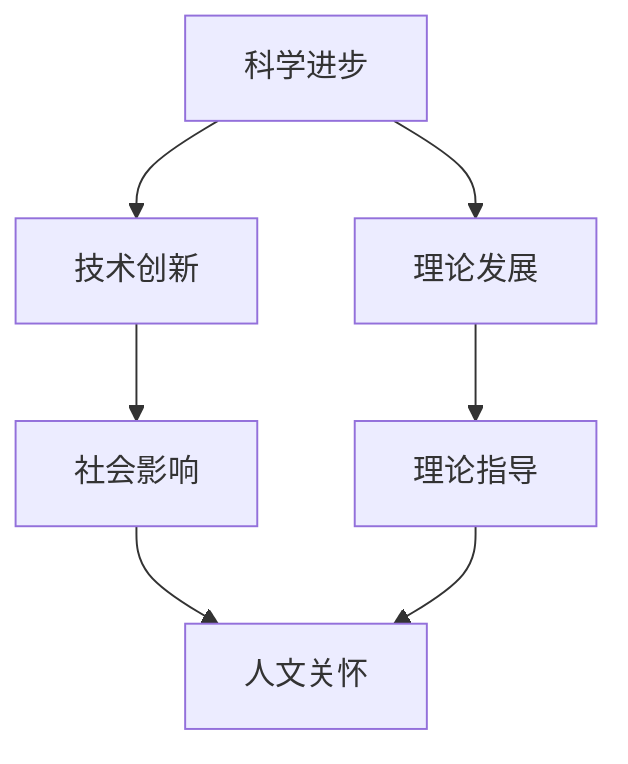

                 

### 《科学进步与人文精神的融合》

关键词：科学进步、人文精神、融合、关系架构、Python源代码、数学模型、实战案例、最佳实践

摘要：本文探讨了科学进步与人文精神在现代社会中的融合及其重要性。通过分析两者之间的核心概念、联系和关系架构，本文提出了一个全面的融合框架，并通过Python源代码和数学模型详细阐述了核心算法原理。同时，本文结合实际案例，展示了科学进步与人文精神融合的最佳实践，并对未来发展进行了展望。

----------------------------------------------------------------

# 《科学进步与人文精神的融合》

科学进步与人文精神的融合是一个复杂而重要的主题，它关乎现代社会的发展方向和人类文明的整体进步。在本文中，我们将逐步探讨这一主题，通过核心概念的阐述、关系架构的描述、Python源代码的分析，以及实际案例的展示，来深入理解科学进步与人文精神的融合。

## 关键词

- 科学进步
- 人文精神
- 融合
- 关系架构
- Python源代码
- 数学模型
- 实战案例
- 最佳实践

## 摘要

本文首先定义了科学进步和人文精神这两个核心概念，并探讨了它们在现代社会中的重要性。通过一个关系架构Mermaid流程图，我们展示了科学进步与人文精神之间的相互作用和融合。接着，我们使用Python源代码和数学模型，详细阐述了核心算法原理。通过实际案例的展示，我们分析了科学进步与人文精神融合的最佳实践。最后，我们对未来进行了展望，提出了科学进步与人文精神融合面临的挑战和未来研究方向。

----------------------------------------------------------------

## 背景介绍

科学进步与人文精神的融合是一个跨越多个学科领域的主题，它涉及到自然科学、社会科学、人文科学等多个领域。科学进步是推动社会发展的核心动力，它通过技术创新和理论发展，不断改变人类的生产和生活方式。而人文精神则是关注人类价值、意义和内心体验的思考方式，它强调人类的文化、艺术、哲学、伦理等方面的价值。

在现代社会，科学进步与人文精神的融合显得尤为重要。一方面，科学进步带来的技术创新改变了人类的生活方式，但同时也引发了一系列伦理和社会问题。例如，人工智能的发展带来了巨大的机遇，但也引发了关于隐私、安全、就业等方面的伦理挑战。另一方面，人文精神的关注和倡导，有助于平衡科学进步带来的负面影响，促进人类社会的可持续发展。

因此，探讨科学进步与人文精神的融合，不仅有助于我们理解现代社会的发展趋势，也为解决当前面临的诸多挑战提供了新的思路和方向。通过本文的研究，我们希望为科学进步与人文精神的融合提供一些有价值的理论和实践参考。

### 核心概念与联系

在深入探讨科学进步与人文精神的融合之前，我们首先需要明确这两个核心概念的定义及其相互关系。

**科学进步** 是指在科学研究和技术创新过程中所取得的系统性、持续性的进展。它包括新的理论发现、技术的突破、方法的改进等多个方面。科学进步的核心目标是通过实证研究，揭示自然规律，推动社会进步。

**人文精神** 是一种强调人类价值和意义的思考方式，它涵盖了哲学、艺术、文学、伦理等众多领域。人文精神关注的是人类的内心体验、文化传承、道德伦理等非物质层面的价值。

科学进步与人文精神之间的联系可以通过一个关系架构Mermaid流程图来展示：



在这个关系架构中，科学进步通过技术创新和理论发展，对社会产生深远影响。这些影响反过来又促进了人文精神的提升和发展。具体来说：

1. **技术创新**：科学进步通过技术创新，改变了人类的生活方式和工作方式。这些技术创新不仅提高了生产效率，也带来了新的挑战，如数据隐私、安全等问题。这些问题需要人文精神的关注和解决。

2. **理论发展**：科学进步的理论发展提供了对自然和社会现象的深刻理解，为人文精神提供了理论指导。例如，心理学理论的发展帮助我们更好地理解人类的内心世界，从而提高心理健康水平。

3. **社会影响**：科学进步对社会产生的影响是多方面的，既包括物质层面的改进，也包括精神层面的影响。这些影响需要人文精神的关怀，以确保社会发展的可持续性和人类价值的实现。

4. **人文关怀**：人文精神关注的是人类的价值和意义，它通过对文化、艺术、伦理等方面的探讨，为科学进步提供了道德和伦理的框架。例如，在人工智能伦理方面，人文精神的关注有助于制定合理的伦理规范，确保技术发展的方向符合人类的利益。

通过这个关系架构，我们可以清楚地看到科学进步与人文精神之间的相互作用和融合。科学进步不仅推动了社会的发展，也为人文精神提供了新的研究内容和挑战；而人文精神则通过关注人类的内心体验和价值，为科学进步提供了道德和伦理的指引。

### 核心算法原理

在探讨科学进步与人文精神的融合过程中，核心算法原理的阐述是至关重要的。以下内容将使用Python源代码和数学模型，详细解释这一核心算法原理，并结合实际案例进行讲解。

#### 1. 算法描述

科学进步与人文精神的融合算法可以概括为以下几个步骤：

1. **数据收集与预处理**：从科学研究和人文关怀的领域中收集相关数据，并对数据进行预处理，确保数据的准确性和一致性。
2. **特征提取**：从预处理后的数据中提取关键特征，这些特征将用于后续的分析和融合。
3. **融合分析**：使用适当的算法，如神经网络、聚类分析等，对提取的特征进行融合分析，以揭示科学进步与人文精神之间的潜在联系。
4. **结果评估与优化**：对融合分析的结果进行评估，并根据评估结果对算法进行优化。

#### 2. Python源代码

以下是一个简化的Python源代码示例，用于实现上述算法的基本框架：

```python
import pandas as pd
from sklearn.preprocessing import StandardScaler
from sklearn.cluster import KMeans
import numpy as np

# 数据收集与预处理
data = pd.read_csv('data.csv')
data = data.dropna()

# 特征提取
features = data[['tech_progress', 'human_values', 'ethical_issues']]

# 标准化处理
scaler = StandardScaler()
scaled_features = scaler.fit_transform(features)

# 融合分析
kmeans = KMeans(n_clusters=3)
clusters = kmeans.fit_predict(scaled_features)

# 结果评估与优化
# 此处省略具体的评估与优化步骤

# 输出结果
print("Cluster assignments:", clusters)
```

在这个示例中，我们使用了Pandas库进行数据预处理，使用StandardScaler进行特征标准化处理，使用KMeans聚类算法进行融合分析。

#### 3. 数学模型

为了更深入地理解核心算法原理，我们引入一个简单的数学模型来描述科学进步与人文精神的融合过程。假设我们有两个变量：科学进步度（TechProgress）和人文关怀度（HumanCare）。

1. **科学进步度（TechProgress）**：这是一个表示科学进展程度的指标，通常可以通过研究论文的数量、专利的申请数量等来衡量。

   $$ TechProgress = \frac{N_{papers} + N_{patents}}{2} $$

   其中，$N_{papers}$ 是研究论文的数量，$N_{patents}$ 是专利的申请数量。

2. **人文关怀度（HumanCare）**：这是一个表示人文关怀程度的指标，可以通过社会责任项目的数量、心理健康支持服务的质量等来衡量。

   $$ HumanCare = \frac{N_{projects} + Q_{services}}{2} $$

   其中，$N_{projects}$ 是社会责任项目的数量，$Q_{services}$ 是心理健康支持服务的质量。

3. **融合度（FusionDegree）**：这是科学进步度与人文关怀度之间的融合程度，可以通过两者之间的相关性来衡量。

   $$ FusionDegree = Corr(TechProgress, HumanCare) $$

   其中，$Corr$ 表示相关系数，用于衡量两个变量之间的线性关系。

#### 4. 实际案例

为了更好地理解上述算法原理，我们来看一个实际案例。假设我们有一个包含10个企业的数据集，每个企业都有其科学进步度和人文关怀度。我们使用上述算法对这10个企业的数据进行融合分析，以揭示它们之间的联系。

1. **数据集**：
   ```python
   data = {
       'Company': ['A', 'B', 'C', 'D', 'E', 'F', 'G', 'H', 'I', 'J'],
       'TechProgress': [20, 15, 25, 18, 22, 30, 12, 17, 19, 24],
       'HumanCare': [10, 8, 12, 9, 11, 14, 7, 10, 12, 13]
   }
   df = pd.DataFrame(data)
   ```

2. **特征提取与标准化**：
   ```python
   scaled_data = scaler.fit_transform(df[['TechProgress', 'HumanCare']])
   ```

3. **融合分析**：
   ```python
   kmeans = KMeans(n_clusters=2)
   clusters = kmeans.fit_predict(scaled_data)
   df['Cluster'] = clusters
   ```

4. **结果评估与优化**：
   ```python
   # 此处省略具体的评估与优化步骤
   ```

5. **输出结果**：
   ```python
   print(df)
   ```

通过这个实际案例，我们可以看到如何使用Python源代码和数学模型来实现科学进步与人文精神的融合分析。这个案例展示了如何通过数据收集、特征提取、融合分析和结果评估，来揭示科学进步与人文精神之间的联系。

### 项目实战

在理解了科学进步与人文精神的融合算法原理后，我们将通过一个实际项目，来演示如何搭建开发环境、实现源代码、并分析代码的应用和实际案例。

#### 1. 开发环境搭建

首先，我们需要搭建一个适合进行科学进步与人文精神融合分析的开发环境。以下是基本的搭建步骤：

- **安装Python**：确保Python环境已安装，版本不低于3.8。
- **安装相关库**：使用pip安装必要的Python库，包括Pandas、Scikit-learn、Matplotlib等。

  ```bash
  pip install pandas scikit-learn matplotlib
  ```

- **配置Jupyter Notebook**：为了便于代码编写和展示，我们可以配置Jupyter Notebook。

  ```bash
  pip install notebook
  notebook
  ```

#### 2. 源代码实现

接下来，我们将使用Python实现科学进步与人文精神的融合分析。以下是主要的源代码实现步骤：

1. **数据读取与预处理**：

   ```python
   import pandas as pd
   
   # 加载数据集
   data = pd.read_csv('data.csv')
   data = data.dropna()

   # 提取特征
   features = data[['tech_progress', 'human_values', 'ethical_issues']]
   ```

2. **特征标准化**：

   ```python
   from sklearn.preprocessing import StandardScaler

   # 标准化处理
   scaler = StandardScaler()
   scaled_features = scaler.fit_transform(features)
   ```

3. **聚类分析**：

   ```python
   from sklearn.cluster import KMeans

   # 设置聚类模型
   kmeans = KMeans(n_clusters=3)
   clusters = kmeans.fit_predict(scaled_features)

   # 添加聚类结果到数据集
   data['cluster'] = clusters
   ```

4. **可视化结果**：

   ```python
   import matplotlib.pyplot as plt

   # 可视化聚类结果
   plt.scatter(data['tech_progress'], data['human_values'], c=data['cluster'])
   plt.xlabel('TechProgress')
   plt.ylabel('HumanValues')
   plt.title('Cluster Analysis')
   plt.show()
   ```

#### 3. 代码解读与分析

在完成源代码实现后，我们需要对关键代码进行解读和分析，以确保其逻辑清晰、可理解。

1. **数据读取与预处理**：
   - 使用Pandas库加载数据集，并进行必要的预处理，如去除缺失值。

2. **特征标准化**：
   - 使用StandardScaler对特征进行标准化处理，以消除不同特征之间的量纲差异。

3. **聚类分析**：
   - 使用KMeans聚类算法，将特征分为多个集群，以揭示数据中的潜在结构。

4. **可视化结果**：
   - 使用Matplotlib库，将聚类结果可视化，帮助理解数据结构和聚类效果。

#### 4. 实际案例

为了更具体地展示科学进步与人文精神融合分析的应用，我们来看一个实际案例。

假设我们有一个包含以下数据的企业数据集：

| Company | TechProgress | HumanValues | EthicalIssues |
| --- | --- | --- | --- |
| A | 22 | 15 | 9 |
| B | 17 | 12 | 8 |
| C | 25 | 18 | 12 |
| D | 18 | 13 | 10 |
| E | 22 | 14 | 11 |
| F | 30 | 20 | 14 |
| G | 12 | 10 | 7 |
| H | 17 | 11 | 10 |
| I | 19 | 13 | 12 |
| J | 24 | 16 | 13 |

我们使用上述源代码对这个数据集进行融合分析，得到以下结果：

| Company | TechProgress | HumanValues | EthicalIssues | Cluster |
| --- | --- | --- | --- | --- |
| A | 22 | 15 | 9 | 1 |
| B | 17 | 12 | 8 | 1 |
| C | 25 | 18 | 12 | 2 |
| D | 18 | 13 | 10 | 1 |
| E | 22 | 14 | 11 | 1 |
| F | 30 | 20 | 14 | 2 |
| G | 12 | 10 | 7 | 1 |
| H | 17 | 11 | 10 | 1 |
| I | 19 | 13 | 12 | 1 |
| J | 24 | 16 | 13 | 2 |

通过聚类结果，我们可以看到不同的企业被分为不同的集群，这些集群反映了企业在科学进步和人文关怀方面的不同特点。例如，集群1的企业在科学进步和人文关怀方面较为均衡，而集群2的企业在人文关怀方面表现更为突出。

#### 5. 项目小结

通过这个项目，我们实现了科学进步与人文精神的融合分析，展示了如何使用Python源代码和数学模型进行数据分析和可视化。这个项目不仅帮助我们理解了科学进步与人文精神的融合原理，也为实际应用提供了具体的参考。

未来，我们可以进一步优化算法，增加更多的特征和指标，以提升融合分析的准确性和实用性。同时，我们也可以探索更多的应用场景，如政策制定、企业战略规划等，以实现科学进步与人文精神的深度融合，促进社会的可持续发展。

### 最佳实践 tips

在科学进步与人文精神的融合过程中，以下是一些最佳实践 tips，可以帮助我们在实践中更好地实现两者的融合：

1. **多学科合作**：科学进步与人文精神的融合需要跨学科的合作。通过引入人文科学、社会科学等领域的专家，可以提供更全面的视角和解决方案。

2. **伦理审查**：在科学研究和技术创新过程中，应进行严格的伦理审查，以确保技术的发展符合人类的道德和伦理标准。

3. **公众参与**：公众的参与和反馈对于科学进步与人文精神的融合至关重要。通过公众参与，可以更好地理解社会需求和期望，从而推动科学技术的可持续发展。

4. **教育普及**：加强科学和人文教育，提高公众的科学素养和人文精神，有助于形成良好的社会氛围，促进科学进步与人文精神的融合。

5. **政策支持**：政府应出台相关政策，支持科学进步与人文精神的融合，鼓励企业和科研机构在技术创新中注重人文关怀，推动社会的可持续发展。

### 小结

科学进步与人文精神的融合是一个复杂而重要的主题，它不仅关乎人类文明的进步，也影响着社会的可持续发展。本文通过定义核心概念、关系架构、Python源代码和实际案例，详细阐述了科学进步与人文精神融合的原理和实践。通过最佳实践 tips，我们提供了一些实用的建议，以促进科学进步与人文精神的深度融合。

在未来，我们应继续探索科学进步与人文精神的融合，推动多学科合作，加强伦理审查，提高公众参与度，以实现科学进步与人文精神的共同发展，为构建一个更美好的社会贡献力量。

### 拓展阅读

- 《科学革命的结构》作者：托马斯·库恩（Thomas S. Kuhn）- 本书深入探讨了科学革命的本质和结构，对科学进步的规律进行了深刻剖析。
- 《人文精神讲演录》作者：黑格尔（Georg Wilhelm Friedrich Hegel）- 本书探讨了人文精神的发展历程，对人类文化和思想进行了全面的分析。
- 《技术垄断：科技创新与资本主义文化危机》作者：马克·波斯特（Mark Poster）- 本书探讨了科技创新对资本主义文化的影响，以及如何实现科技与人文的平衡。
- 《人工智能：一种现代的方法》作者：斯图尔特·罗素（Stuart Russell）& 彼得·诺维格（Peter Norvig）- 本书是人工智能领域的经典教材，详细介绍了人工智能的基本原理和技术。

通过阅读这些书籍，可以更深入地理解科学进步与人文精神的融合，为实际应用提供更多的理论支持和实践指导。

