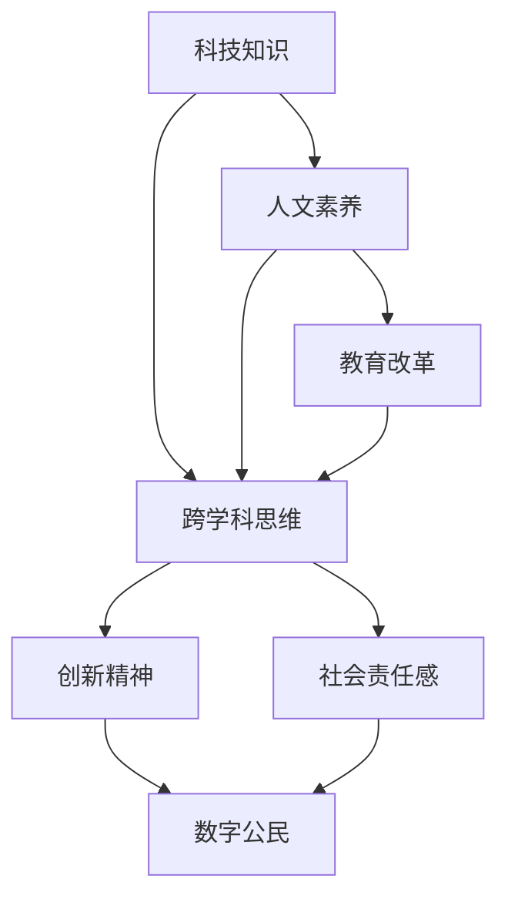

                 


### 《科技人文融合教育：培养全面发展的数字公民》

#### 关键词
科技人文融合、数字公民、教育改革、跨学科教学、人工智能教育

#### 摘要
本文旨在探讨科技与人文融合教育的重要性，以及如何通过这种教育模式培养具备全面发展能力的数字公民。文章首先概述了科技人文融合教育的背景和意义，接着深入分析了核心概念、理论与实践，并展示了实际应用案例。最后，文章提出了培养数字公民的策略，并展望了未来教育的发展趋势。

## 引言

随着科技的迅猛发展，人工智能、大数据、互联网+等新兴技术正深刻改变着我们的生活和社会结构。教育作为培养未来人才的关键领域，也面临着前所未有的挑战和机遇。科技人文融合教育应运而生，旨在通过将科技与人文知识相结合，培养具有批判性思维、创新能力和社会责任感的全面发展的数字公民。

本文将分为以下几个部分进行探讨：

1. **科技人文融合教育的背景与意义**：介绍科技人文融合教育的起源、发展现状及其在当今社会的重要性。
2. **核心概念与联系**：阐述科技与人文融合教育中的核心概念，并使用Mermaid流程图展示这些概念之间的关系。
3. **理论与实践**：分析科技人文融合教育的理论基础，介绍相关教学策略和实践方法。
4. **实际应用案例**：展示科技人文融合教育在基础教育、高等教育和其他教育领域中的应用案例。
5. **培养数字公民的策略**：提出具体策略，包括课程设计、教学方法、教育资源配置等方面。
6. **未来展望**：探讨科技人文融合教育的未来发展趋势，以及其对数字公民培养的影响。

### 科技人文融合教育的背景与意义

#### 科技与人文融合教育的起源

科技人文融合教育的概念最早可以追溯到20世纪末。随着信息技术的快速发展，人们逐渐认识到，单一领域的知识已经无法满足培养未来人才的需求。教育界开始探索如何将科技与人文知识相结合，以培养具有综合素质的人才。这一理念在21世纪初得到了进一步的发展和完善。

#### 科技人文融合教育的发展现状

近年来，全球范围内越来越多的高校和中小学开始尝试科技人文融合教育。例如，美国的一些顶尖大学开设了跨学科的课程，鼓励学生从不同角度思考问题，培养他们的创新能力。在中国，一些教育机构也积极推动科技与人文的结合，开展了形式多样的教育活动。

#### 科技人文融合教育的重要性

科技与人文融合教育具有重要的现实意义和长远价值：

1. **培养全面发展的数字公民**：通过融合教育，学生不仅能够掌握科技知识，还能培养人文素养，从而成为具备全面发展能力的数字公民。

2. **提升教育质量**：科技人文融合教育能够激发学生的学习兴趣，提高他们的学习效果，从而提升整体教育质量。

3. **促进社会进步**：科技人文融合教育有助于培养具有社会责任感和创新精神的人才，推动社会进步和可持续发展。

### 核心概念与联系

在科技人文融合教育中，几个核心概念至关重要，它们共同构成了教育体系的基础。以下是这些核心概念及其相互关系的Mermaid流程图：



- **科技知识**：指学生需要掌握的科技领域的基础知识，如人工智能、大数据、互联网+等。
- **人文素养**：包括文学、哲学、艺术等人文领域的知识，培养学生的文化素养和人文关怀。
- **跨学科思维**：鼓励学生从不同学科角度思考问题，培养综合分析和解决问题的能力。
- **创新精神**：强调学生在学习过程中要具备创新意识，勇于探索新知识、新方法。
- **社会责任感**：培养学生关心社会、服务社会的能力，培养具有社会责任感的公民。
- **数字公民**：具备全面发展能力的现代公民，能够在数字化时代中发挥积极作用。

这些核心概念相互关联，共同构成了科技人文融合教育的基本框架。Mermaid流程图直观地展示了这些概念之间的关系，有助于读者更好地理解科技人文融合教育的内涵和意义。

### 科技人文融合教育的理论基础

科技人文融合教育的理论基础涵盖了多个领域，包括教育哲学、跨学科教育理论和学习心理学。以下是这些理论的基本概念及其在科技人文融合教育中的应用。

#### 教育哲学

教育哲学关注教育的本质、目的和价值观。在科技人文融合教育中，教育哲学提供了以下几方面的指导：

1. **培养全面发展的个体**：教育哲学强调教育的目的是培养全面发展的人，而不仅仅是传授知识。科技人文融合教育通过结合科技与人文知识，旨在培养学生的思维能力、创新能力和社会责任感。

2. **自主性学习**：教育哲学鼓励学生主动学习、独立思考。科技人文融合教育通过跨学科项目和实践活动，激发学生的学习兴趣，培养他们的自主学习能力。

3. **终身学习理念**：教育哲学强调学习是一个终身的过程。科技人文融合教育通过不断更新课程内容，紧跟科技发展步伐，使学生能够适应不断变化的社会环境。

#### 跨学科教育理论

跨学科教育理论强调将不同学科的知识整合在一起，以解决实际问题。以下是跨学科教育理论在科技人文融合教育中的应用：

1. **问题导向学习**：跨学科教育理论鼓励学生从问题出发，综合运用不同学科的知识进行解决。科技人文融合教育通过设计跨学科项目，引导学生从多个角度分析问题，培养他们的综合思维能力。

2. **团队合作**：跨学科教育理论强调团队合作的重要性。科技人文融合教育通过小组合作学习，培养学生的团队协作能力和沟通能力。

3. **实践与应用**：跨学科教育理论注重理论知识与实践的结合。科技人文融合教育通过实验、项目和实践，使学生能够将所学知识应用于实际生活中。

#### 学习心理学

学习心理学研究学习过程和影响因素，为科技人文融合教育提供了以下指导：

1. **认知发展理论**：认知发展理论强调个体在不同阶段有不同的认知需求。科技人文融合教育根据学生的认知发展阶段，设计适合的教学内容和教学方法。

2. **学习动机理论**：学习动机理论关注如何激发学生的学习兴趣和动机。科技人文融合教育通过设计有趣的课程和活动，激发学生的学习兴趣，提高他们的学习积极性。

3. **情感教育**：学习心理学强调情感在教育中的重要性。科技人文融合教育通过培养人文素养，关注学生的情感需求，提高他们的心理素质。

#### 综合应用

科技人文融合教育将教育哲学、跨学科教育理论和学习心理学相结合，形成了一套系统的教育体系。以下是一个综合应用实例：

**实例**：在高中阶段，学校可以开设一门名为“科技与人文”的综合课程。该课程将涵盖科技领域的最新发展，如人工智能、大数据等，同时融入人文领域的知识，如文学、艺术等。课程设计注重问题导向学习，学生需要通过小组合作，分析一个具体的社会问题，如“人工智能对就业的影响”，并提交一份综合报告。通过这样的课程，学生不仅能够掌握科技知识和人文素养，还能培养他们的批判性思维、创新精神和团队合作能力。

总之，科技人文融合教育的理论基础为教育实践提供了丰富的理论支持和指导，有助于培养具备全面发展能力的数字公民。

### 科技人文融合教育的教学策略与实践方法

科技人文融合教育需要一系列创新的教学策略和方法，以确保学生在掌握科技知识和人文素养的同时，能够发展综合能力。以下是一些有效的教学策略和实践方法：

#### 1. 跨学科项目教学

跨学科项目教学是科技人文融合教育的核心策略之一。通过跨学科项目，学生可以将不同学科的知识整合在一起，解决实际问题。以下是一个具体的项目示例：

**项目示例**：在“科技与人文”课程中，可以设计一个名为“智能城市”的项目。学生需要从城市规划、人工智能、环境科学等多个角度出发，分析一个城市的问题，并提出解决方案。项目可以分为以下几个步骤：

1. **问题识别**：学生需要选择一个城市面临的具体问题，如交通拥堵、环境污染等。
2. **数据分析**：学生通过收集和分析数据，了解问题的现状和原因。
3. **解决方案设计**：学生利用人工智能技术，设计一个能够缓解该问题的解决方案，如智能交通系统、环境监测系统等。
4. **方案评估**：学生需要对设计的方案进行评估，包括技术可行性、经济成本、社会影响等。
5. **成果展示**：学生通过报告、演示等形式，向同学和教师展示他们的研究成果。

#### 2. 情境学习

情境学习是一种通过模拟真实情境，让学生在具体环境中学习和解决问题的方法。情境学习有助于培养学生的实践能力和问题解决能力。以下是一个情境学习示例：

**情境学习示例**：在一个关于“数字伦理”的课程中，可以设计一个名为“网络安全挑战”的情境。学生扮演网络安全专家，面临一个具体的网络安全事件，如网络攻击、数据泄露等。情境可以分为以下几个阶段：

1. **事件发生**：学生需要了解事件的具体情况，如攻击方式、受影响的系统等。
2. **初步分析**：学生通过分析攻击数据，确定攻击的来源和目的。
3. **应对措施**：学生需要设计一系列应对措施，如加强系统安全、更新安全策略等。
4. **效果评估**：学生需要评估应对措施的有效性，并进行调整。
5. **总结反思**：学生需要对整个事件进行总结，分享他们的经验和教训。

#### 3. 游戏化学习

游戏化学习通过将学习过程转化为游戏，激发学生的学习兴趣和积极性。以下是一个游戏化学习示例：

**游戏化学习示例**：在一个关于“编程基础”的课程中，可以设计一个名为“编程冒险”的游戏。学生在游戏中扮演程序员，通过完成各种编程任务，解锁新的游戏关卡。游戏可以分为以下几个阶段：

1. **基础任务**：学生通过完成简单的编程任务，如编写一个简单的程序，了解编程的基本概念。
2. **挑战任务**：学生需要解决更复杂的编程问题，如设计一个游戏逻辑、处理用户输入等。
3. **合作任务**：学生需要与其他同学合作，完成一个大型项目，如开发一个简单的网页。
4. **评分和反馈**：学生的任务完成情况将得到评分，并提供详细的反馈，帮助他们改进。

#### 4. 翻转课堂

翻转课堂将传统的教学方式颠倒过来，学生在课外学习理论知识，在课堂上进行实践和讨论。这种教学方法有助于提高学生的自主学习能力和课堂参与度。以下是一个翻转课堂示例：

**翻转课堂示例**：在一个关于“人工智能基础”的课程中，可以采用翻转课堂模式。学生首先通过在线课程学习人工智能的基本概念和原理，然后在课堂上进行实践和讨论。具体步骤如下：

1. **在线学习**：学生通过在线平台观看教学视频，学习人工智能的基本知识。
2. **课堂实践**：学生在课堂上使用编程工具，实际操作人工智能算法。
3. **课堂讨论**：学生分组讨论他们在实践中遇到的问题，并分享解决方案。
4. **教师指导**：教师对学生的讨论进行指导和反馈，帮助他们解决疑惑。

通过这些教学策略和实践方法，科技人文融合教育能够有效地培养学生的综合能力，为他们成为全面发展的数字公民打下坚实的基础。

### 科技人文融合教育在基础教育中的应用

科技人文融合教育在基础教育中的应用正逐渐成为教育改革的重要方向。通过整合科技与人文知识，基础教育阶段的教育模式能够更全面地培养学生的综合素质。以下是一些实际应用案例：

#### 1. 中小学综合课程

在中小学阶段，综合课程成为科技人文融合教育的重要载体。通过设计综合课程，学生可以在一个课程中学习到多个学科的知识。例如，在“科技与人文”综合课程中，学生可以学习科学、技术、工程和数学（STEM）知识，同时融合文学、艺术、历史等人文素养。以下是一个综合课程的设计案例：

**案例**：在小学五年级，学校开设了一门名为“我们的城市”的综合课程。课程内容涵盖了城市规划、建筑科学、环境科学等多个方面。学生通过实地考察、小组合作等方式，了解城市的运作原理，并设计一个理想的城市模型。学生不仅学习了科技知识，还培养了合作精神和创新意识。

#### 2. 项目学习

项目学习是一种以学生为中心的学习方式，通过实际项目促进学生深入学习和思考。科技人文融合教育在基础教育中运用项目学习，能够更好地激发学生的兴趣和创造力。以下是一个项目学习的案例：

**案例**：在初中阶段，学校开展了一个名为“未来城市”的项目学习。学生需要分组设计一个未来城市的概念图，包括交通、能源、环境等多个方面。学生通过研究相关资料、模拟实验和小组讨论，提出解决方案，并进行展示和答辩。项目学习不仅培养了学生的科技能力，还提升了他们的沟通能力和团队合作精神。

#### 3. 跨学科合作

跨学科合作是科技人文融合教育的重要组成部分。在基础教育中，教师通过跨学科合作，将不同学科的知识整合在一起，促进学生全面发展。以下是一个跨学科合作的案例：

**案例**：在高中阶段，学校开设了一门名为“可持续未来”的跨学科课程。课程由科学、技术、社会等多个学科的教师共同设计，涵盖气候变化、环境保护、可持续发展等多个主题。学生通过参与课程，不仅学习到多个学科的知识，还培养了跨学科思考和解决问题的能力。

#### 4. 创新实验室

创新实验室是科技人文融合教育在基础教育中的一种创新实践。通过创新实验室，学生可以亲身体验科技项目的研发过程，培养实践能力和创新精神。以下是一个创新实验室的案例：

**案例**：在小学六年级，学校建立了一个创新实验室。实验室配备了一系列科技工具和软件，学生可以自由选择感兴趣的项目进行研发。例如，一些学生选择了“智能家居”项目，通过编程和电子技术，设计了一套智能控制系统。创新实验室为学生提供了丰富的实践机会，激发了他们的学习热情和创造力。

#### 5. 家校合作

家校合作是科技人文融合教育成功实施的关键。通过家校合作，学校和家庭共同关注学生的成长，提供丰富的教育资源和支持。以下是一个家校合作的案例：

**案例**：在初中一年级，学校与家长会共同组织了一个名为“科技人文家庭日”的活动。家长和学生一起参与科技与人文主题的讲座、工作坊和实验活动。通过这样的活动，家长更深入地了解了科技人文融合教育的理念和方法，同时与孩子共同参与学习，增强了家庭教育的效果。

通过这些实际应用案例，科技人文融合教育在基础教育中发挥了重要作用。它不仅丰富了学生的知识体系，还培养了他们的综合能力和创新精神，为他们成为全面发展的数字公民奠定了坚实基础。

### 科技人文融合教育在高等教育中的应用

在高等教育中，科技人文融合教育的应用尤为显著，特别是在培养跨学科人才和创新型领导者方面。以下是一些具体案例，展示了科技人文融合教育在高等教育中的应用及其效果。

#### 1. 跨学科专业课程设计

许多高等教育机构已经认识到，传统的单一学科课程难以满足现代社会对复合型人才的需求。因此，他们开始设计跨学科专业课程，以培养学生的综合素质。例如，清华大学设立了“智能科学+人文”双学位专业，学生不仅需要学习人工智能、计算机科学等科技课程，还需修读文学、哲学、社会学等人文学科课程。这种跨学科课程设计使得学生能够将科技与人文知识相结合，培养他们的批判性思维和创新能力。

#### 2. 跨学科研究项目

跨学科研究项目是高等教育中实施科技人文融合教育的重要途径。通过跨学科研究项目，学生能够将所学知识应用于解决实际问题。例如，麻省理工学院（MIT）的“媒体实验室”（Media Lab）就是一个典型的跨学科研究项目，它汇聚了计算机科学、人工智能、设计、建筑等多个学科的专家，共同开展创新研究。学生可以通过参与这些项目，深入体验跨学科研究的全过程，提升他们的实践能力和创新精神。

#### 3. 创新型人才培养

科技人文融合教育在培养创新型领导者方面具有独特的优势。例如，斯坦福大学（Stanford University）的“创业与创新”课程，通过结合科技与商业知识，培养学生的创业精神和领导能力。学生不仅需要学习科技和商业原理，还需进行实际创业实践，例如创办初创企业。这样的课程设计有助于学生将科技与商业创新相结合，培养他们的创业能力和领导力。

#### 4. 教师培训与交流

为了更好地实施科技人文融合教育，高等教育机构还注重教师培训与交流。例如，哈佛大学（Harvard University）定期举办“教师跨学科教育研讨会”，邀请不同学科的教授分享跨学科教学的经验和策略。这些研讨会有助于教师了解最新的教育理论和实践方法，提升他们的跨学科教学能力。

#### 5. 国际合作与交流

国际合作与交流是促进科技人文融合教育发展的重要途径。例如，剑桥大学（University of Cambridge）与中国的一些高校建立了合作关系，共同开展跨学科教育和研究项目。通过国际合作，学生可以接触到不同文化背景的知识和经验，拓宽他们的国际视野，培养他们的全球竞争力。

#### 案例分析

以下是一个具体案例，展示了科技人文融合教育在高等教育中的应用及其效果：

**案例**：加州大学伯克利分校（University of California, Berkeley）的“智能城市与可持续发展”课程。该课程结合了计算机科学、环境科学、社会科学等多个学科的知识，旨在培养学生解决智能城市问题的能力。学生需要完成一系列项目任务，包括数据分析、系统设计、政策建议等。通过这一课程，学生不仅掌握了跨学科知识，还提升了他们的团队合作和问题解决能力。

总体而言，科技人文融合教育在高等教育中的应用不仅丰富了教育内容，还提升了学生的综合素质和创新能力。这种教育模式有助于培养具有全球视野和创新精神的领导者，为未来的社会发展做出贡献。

### 数字公民素养的培养

数字公民素养是指个体在数字化社会中所需的技能和素养，包括信息素养、批判性思维、沟通能力和社会责任感。以下从这几个方面详细探讨如何培养数字公民素养。

#### 1. 信息素养

信息素养是指个体获取、评估、使用和传播信息的能力。在数字时代，信息素养尤为重要。以下是一些培养信息素养的方法：

- **信息获取**：学校可以开设信息检索课程，教授学生如何使用各种数据库和搜索引擎获取信息。例如，可以使用Python编写简单的爬虫程序，从互联网上抓取数据。
  ```python
  import requests
  from bs4 import BeautifulSoup

  url = 'https://example.com'
  response = requests.get(url)
  soup = BeautifulSoup(response.text, 'html.parser')
  print(soup.title.text)
  ```
- **信息评估**：教育者应教会学生如何评估信息的真实性和可靠性。例如，通过检查来源、作者背景和引用，判断信息来源的可靠性。
- **信息使用**：学生需要学会如何有效地使用信息，包括整理、分析和分享信息。例如，使用Python进行数据分析和可视化，展示研究结果。
  ```python
  import pandas as pd
  import matplotlib.pyplot as plt

  data = pd.read_csv('data.csv')
  data.describe()
  plt.bar(data['Year'], data['Sales'])
  plt.xlabel('Year')
  plt.ylabel('Sales')
  plt.show()
  ```

#### 2. 批判性思维

批判性思维是指个体在分析和解决问题时，能够质疑现有观点，独立思考，做出合理判断的能力。以下是一些培养批判性思维的方法：

- **质疑与探究**：鼓励学生提问和探究，不轻易接受未经检验的观点。例如，通过开展辩论活动，培养学生的质疑精神。
- **案例分析**：通过分析真实案例，让学生学会批判性思考。例如，分析一起网络安全事件，探讨事件的原因和解决方案。
- **思维训练**：教育者可以设计思维训练活动，如逻辑思维游戏、脑筋急转弯等，提升学生的思维能力。

#### 3. 沟通能力

沟通能力是指个体在交流信息、表达观点和建立关系时，能够清晰、有效地传达思想的能力。以下是一些培养沟通能力的方法：

- **写作训练**：通过写作练习，提高学生的表达能力和逻辑思维。例如，撰写科技论文或报告，培养学生的学术写作能力。
- **演讲与演示**：鼓励学生参与演讲和演示活动，提升他们的公共演讲能力。例如，通过制作PPT和视频演示，展示研究成果。
- **角色扮演**：通过角色扮演活动，模拟不同场景中的沟通互动，提升学生的沟通技巧。

#### 4. 社会责任感

社会责任感是指个体在社会中承担责任，关心社会问题，积极参与社会活动的意识。以下是一些培养社会责任感的方法：

- **社区服务**：鼓励学生参与社区服务活动，如志愿服务、公益项目等，培养他们的社会责任感。
- **社会实践**：组织学生参与社会实践，如调研、实地考察等，了解社会问题和现实挑战。
- **公益活动**：通过参与公益活动，如捐款、捐物等，让学生亲身体验帮助他人的意义。

#### 综合培养策略

- **跨学科课程**：设计跨学科课程，结合科技和人文知识，培养学生的综合素养。
- **项目学习**：通过项目学习，将理论知识与实践相结合，提升学生的综合能力。
- **团队合作**：鼓励团队合作，培养学生的沟通能力和协作精神。

通过这些方法，学校和社会可以共同培养具备数字公民素养的人才，为建设一个和谐、可持续发展的数字化社会做出贡献。

### 批判性思维与沟通能力的培养

在数字时代，批判性思维与沟通能力是培养全面发展的数字公民不可或缺的核心素养。以下将详细探讨如何在教育过程中培养这些能力。

#### 1. 批判性思维的培养

批判性思维是一种能够使个体在分析和解决问题时保持独立性和逻辑性的思考方式。以下是一些具体的方法：

**1.1 质疑与探究**

教育者应鼓励学生在面对信息时保持质疑的态度，不轻易接受未经检验的观点。例如，在阅读一篇科技文章时，学生可以询问作者的研究假设、数据来源和分析方法，从而培养他们的批判性思维能力。

**1.2 分析与评估**

教育者可以通过设计案例分析和问题解决活动，引导学生学会分析和评估各种观点和解决方案。例如，通过分析人工智能应用中的伦理问题，学生可以深入思考技术对社会的影响，并评估不同解决方案的优缺点。

**1.3 思维训练**

通过思维训练活动，如逻辑思维游戏和批判性思维课程，可以系统地培养学生的批判性思维。例如，利用Python编写逻辑推理程序，让学生在编写代码的过程中锻炼逻辑思维。

```python
# 示例：利用Python编写逻辑推理程序
def logical_reasoning(p, q):
    if p and q:
        return True
    elif p and not q:
        return "Only if q is true"
    elif not p and q:
        return "Only if p is false"
    else:
        return False

print(logical_reasoning(True, True))
print(logical_reasoning(True, False))
print(logical_reasoning(False, True))
print(logical_reasoning(False, False))
```

#### 2. 沟通能力的培养

沟通能力是一种能够使个体有效传达思想、建立关系和解决问题的技能。以下是一些培养沟通能力的方法：

**2.1 写作训练**

通过写作训练，学生可以提升他们的表达能力和逻辑思维。教育者可以设计写作任务，如科技论文、博客文章等，让学生在写作过程中锻炼表达能力。

**2.2 演讲与演示**

演讲与演示是培养沟通能力的重要途径。教育者可以组织学生参加辩论、演讲比赛和项目展示，通过这些活动提升学生的演讲技巧和自信心。

**2.3 角色扮演**

角色扮演活动可以帮助学生在模拟的情境中练习沟通技巧。例如，模拟商务会议、新闻报道等场景，让学生在角色扮演中提高沟通能力。

#### 3. 综合培养策略

**3.1 跨学科项目**

跨学科项目能够将批判性思维和沟通能力结合起来，例如，在“科技与伦理”项目中，学生需要分析科技对社会的影响，并撰写报告进行展示，从而培养他们的批判性思维和沟通能力。

**3.2 团队合作**

团队合作能够培养学生的沟通能力和协作精神。在项目学习中，学生需要与团队成员密切合作，共同完成任务，这有助于他们在实践中提升沟通能力。

**3.3 反思与反馈**

教育者应鼓励学生进行自我反思，并在学习过程中给予及时的反馈。通过反思和反馈，学生可以更好地认识到自己的优势和不足，从而不断改进。

通过这些策略，学校和社会可以共同培养具备批判性思维和沟通能力的数字公民，为他们在未来的数字社会中取得成功奠定坚实基础。

### 社会责任感的培养

社会责任感是数字公民素养的重要组成部分，它体现了个体在社会中的责任和义务。以下从多个方面探讨如何在教育中培养学生的社会责任感。

#### 1. 志愿服务

志愿服务是一种有效的培养社会责任感的方式。通过参与志愿服务，学生不仅能够帮助他人，还能增强对社会的理解和认同。以下是一些具体方法：

- **组织志愿服务活动**：学校可以定期组织学生参与志愿服务，如支教、环保、社区服务等活动。例如，在假期期间，学生可以参加支教活动，为偏远地区的孩子提供教育支持。
- **志愿服务项目**：鼓励学生自主设计志愿服务项目，例如，为贫困家庭捐赠物资、为老年人提供陪伴服务等。通过这样的项目，学生能够深入体验社会问题，增强社会责任感。

#### 2. 社会实践

社会实践是另一种培养社会责任感的重要途径。通过实际参与社会活动，学生能够更深刻地理解社会问题，并积极参与解决。以下是一些具体方法：

- **实地考察**：组织学生进行社会考察活动，如访问贫困地区、参观社会福利机构等。通过实地考察，学生能够亲眼目睹社会问题，激发他们的社会责任感。
- **社会调研**：鼓励学生进行社会调研，探讨社会问题并提出解决方案。例如，学生可以调研环境污染问题，并提出减少污染的具体措施。

#### 3. 公益活动

公益活动是培养学生社会责任感的有效手段。通过参与公益活动，学生能够将所学知识应用于实际，并为社会做出贡献。以下是一些具体方法：

- **公益项目**：鼓励学生自主发起公益项目，例如，为贫困儿童筹集教育基金、为残疾人提供生活辅助等。通过这样的项目，学生不仅能够提升自己的社会责任感，还能带动更多的人参与公益活动。
- **公益宣传**：通过宣传公益活动，提高社会公众对相关问题的关注。例如，学生可以组织宣传活动，提高人们对环境保护的认识。

#### 4. 社会责任感教育课程

开设社会责任感教育课程是培养社会责任感的系统化方法。以下是一些课程设计建议：

- **课程内容**：课程内容应涵盖社会责任感的各个方面，如环境保护、社会正义、公共健康等。通过系统的学习，学生能够全面了解社会责任感的重要性。
- **案例分析**：通过分析真实案例，让学生了解社会责任感在社会发展中的作用。例如，分析一起重大环境污染事件，探讨责任主体的行为及其后果。
- **实践活动**：结合实践活动，如志愿服务、社会调研等，让学生在实践中培养社会责任感。

#### 综合培养策略

- **跨学科教育**：通过跨学科教育，将社会责任感培养融入不同学科的课程中，例如，在科技课程中讨论科技对社会的双重效应，在人文课程中探讨社会正义问题。
- **教师引导**：教师应在日常教学中注重培养学生的社会责任感，通过示范和引导，帮助学生树立正确的价值观。
- **家校合作**：学校和家庭应共同关注学生的社会责任感培养，通过家校合作，为学生提供更多的实践机会。

通过这些方法，学校和社会可以共同培养具备高度社会责任感的数字公民，为建设一个更加和谐、可持续发展的社会贡献力量。

### 总结与展望

科技人文融合教育作为一种创新的教育模式，已经在基础教育、高等教育和社会实践中取得了显著成果。它不仅丰富了学生的知识体系，还培养了他们的批判性思维、创新能力和社会责任感，为培养全面发展的数字公民奠定了坚实基础。

在未来，科技人文融合教育将继续发展，随着人工智能、大数据、区块链等新兴技术的不断进步，教育模式将更加多样化和个性化。以下是一些未来发展的趋势和展望：

1. **个性化教育**：通过人工智能和大数据技术，教育将更加个性化，学生可以根据自己的兴趣和需求选择课程和学习路径，实现个性化发展。

2. **跨学科融合**：跨学科教育将继续深化，不同学科之间的融合将更加紧密，教育内容将更加综合，以应对复杂的社会问题和挑战。

3. **国际交流与合作**：随着全球化的发展，国际教育交流与合作将日益频繁，教育模式将更加开放和多元化，学生可以接触到不同文化背景的知识和经验。

4. **社会责任教育**：未来教育将更加注重社会责任感的培养，通过志愿服务、社会调研和公益活动，学生将更深入地了解社会问题，积极参与社会建设。

5. **持续学习与终身教育**：在数字化时代，知识更新速度加快，终身学习将成为一种生活方式。教育将更加注重学习能力和学习习惯的培养，帮助学生适应快速变化的社会。

通过这些发展趋势，科技人文融合教育将继续发挥其重要作用，培养具备全面发展能力的数字公民，为构建一个更加和谐、可持续发展的社会贡献力量。作者：AI天才研究院/AI Genius Institute & 禅与计算机程序设计艺术 /Zen And The Art of Computer Programming。

