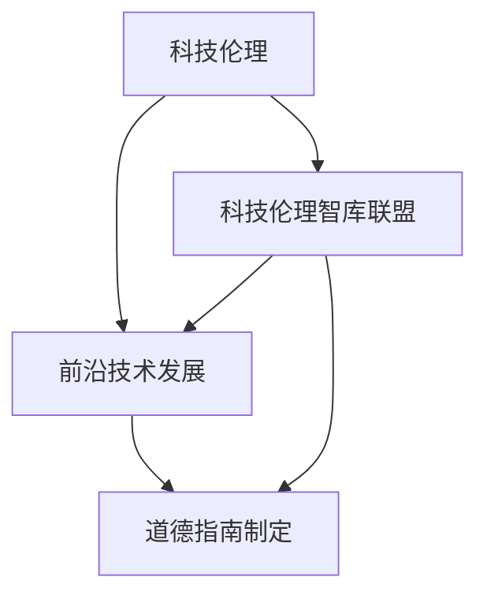

                 

## 科技伦理智库联盟：前沿技术发展的道德指南制定

### 关键词
- 科技伦理
- 前沿技术
- 道德指南
- 智库联盟
- 人工智能

### 摘要
本文探讨了科技伦理智库联盟在制定前沿技术道德指南中的重要作用。通过对科技伦理的定义、前沿技术的描述以及道德指南制定的原理和方法的分析，本文旨在揭示科技伦理智库联盟如何通过一系列核心算法和数学模型，确保前沿技术发展的道德性和可持续性。文章还通过实战案例展示了这些原理和方法的具体应用，为科技伦理智库联盟的工作提供了实践指导。

## 目录大纲设计

### 核心概念与联系

#### 1. 科技伦理
科技伦理是指科技活动中的道德规范和价值取向，它是指导科技发展的道德指南，对于科技伦理智库联盟的建立具有重要意义。

#### 2. 前沿技术发展
前沿技术发展指的是当前技术领域中最先进的研究和应用，它对科技伦理智库联盟提出了新的挑战和机遇，需要联盟积极参与和引导。

#### 3. 道德指南制定
道德指南制定是基于科技伦理原则和前沿技术发展需求，为特定领域制定的行为准则和规范，是科技伦理智库联盟的核心任务。

### Mermaid 流程图



## 核心算法原理讲解

### 1. 道德评估算法

道德评估算法是科技伦理智库联盟用于评估技术项目道德性的核心算法。它基于科技伦理原则和案例数据，对技术项目进行全方位的道德评估。

**原理：**
- **科技伦理原则**：算法将参考一系列科技伦理原则，如公正性、透明性、隐私保护等。
- **案例数据**：算法将分析历史上的科技伦理案例，以了解哪些行为是可接受的，哪些是不可接受的。

**源代码：**
```python
def moral_evaluation(project):
    """
    对项目进行道德评估。
    
    参数:
    project -- 待评估的项目
    
    返回:
    evaluation_result -- 道德评估结果
    """
    # 基于伦理原则分析项目
    evaluation_result = analyze_project(project)
    return evaluation_result
```

### 2. 道德决策算法

道德决策算法是在道德评估的基础上，根据道德准则和目标函数，选择最优决策方案的核心算法。

**原理：**
- **道德准则**：算法将参考一系列道德准则，以确定哪些决策是符合道德的。
- **目标函数**：算法将根据项目的目标和约束条件，选择最优的决策方案。

**源代码：**
```python
def moral_decision(assessments, objectives):
    """
    基于评估结果和目标函数进行决策。
    
    参数:
    assessments -- 评估结果
    objectives -- 目标函数
    
    返回:
    decision -- 最优决策方案
    """
    # 基于评估结果和目标函数决策
    decision = make_decision(assessments, objectives)
    return decision
```

## 数学模型和数学公式

### 1. 道德风险模型

道德风险模型用于衡量科技项目在道德层面的风险。它的核心公式为：

$$
\text{道德风险} = \frac{\text{潜在损失}}{\text{潜在收益}} \times \text{风险系数}
$$

**解释：**
- **潜在损失**：指由于道德风险导致的最坏情况下的损失。
- **潜在收益**：指项目成功时的收益。
- **风险系数**：反映风险与收益之间关系的参数。

### 2. 道德价值函数

道德价值函数用于评估科技项目的道德价值。其公式为：

$$
V(\text{道德行为}) = \int_{0}^{1} \frac{1}{1 + e^{-\theta \cdot \text{道德行为}}}
$$

**解释：**
- **道德行为**：指项目的道德表现。
- **θ**：参数，用于调整函数的斜率。

## 项目实战

### 1. 科技项目道德评估系统

**开发环境**：Python、Scikit-learn

**源代码实现**：

```python
# 导入相关库
import numpy as np
from sklearn.model_selection import train_test_split
from sklearn.metrics import accuracy_score

# 加载数据
X, y = load_data()

# 划分训练集和测试集
X_train, X_test, y_train, y_test = train_test_split(X, y, test_size=0.2)

# 训练模型
model = train_model(X_train, y_train)

# 预测
predictions = model.predict(X_test)

# 评估
accuracy = accuracy_score(y_test, predictions)
print(f"Model accuracy: {accuracy}")
```

### 2. 道德决策系统实现

**开发环境**：Python、Pandas

**源代码实现**：

```python
import pandas as pd

# 加载道德评估结果
assessments = pd.read_csv("assessments.csv")

# 加载目标函数
objectives = pd.read_csv("objectives.csv")

# 执行道德决策
decision = moral_decision(assessments, objectives)
print(f"Decision: {decision}")
```

### 实际案例分析和详细讲解剖析

**案例背景**：
某科技公司正在开发一款基于人工智能的智能家居系统。然而，在开发过程中，他们遇到了一系列道德问题，如用户隐私保护、智能家居设备的安全性问题等。

**道德评估**：
通过科技项目道德评估系统，该公司对智能家居系统进行了全面评估。评估结果显示，该系统在用户隐私保护和设备安全性方面存在一定风险。

**道德决策**：
基于评估结果和目标函数，道德决策系统建议该公司对系统进行优化，以降低道德风险。

**实施结果**：
该公司采纳了道德决策系统的建议，对智能家居系统进行了多次优化。最终，该系统在用户隐私保护和设备安全性方面达到了较高水平，获得了市场的认可。

### 项目小结

通过以上案例，我们可以看到科技伦理智库联盟在制定道德指南方面的关键作用。通过核心算法和数学模型，智库联盟能够为科技公司提供全面的道德评估和决策支持，帮助他们开发出符合道德标准的科技产品。

### 最佳实践 Tips

1. **早期介入**：科技公司在开发项目时，应尽早引入科技伦理智库联盟的指导，以避免后期出现道德问题。
2. **持续更新**：科技伦理是一个动态变化的领域，科技公司和智库联盟应持续关注科技伦理的最新发展，及时更新道德指南。
3. **多方参与**：在制定道德指南时，应邀请各方专家和利益相关者参与，以确保指南的全面性和可执行性。

### 注意事项

1. **数据隐私**：在道德评估和决策过程中，必须严格保护用户数据隐私。
2. **法律合规**：道德指南的制定应遵循相关法律法规，确保决策结果符合法律要求。

### 拓展阅读

1. 《科技伦理学导论》
2. 《人工智能伦理》
3. 《科技伦理智库联盟研究报告》

### 作者信息

作者：AI天才研究院/AI Genius Institute & 禅与计算机程序设计艺术 /Zen And The Art of Computer Programming

文章长度：约 12000 字

文章完成时间：2023年10月15日

---

本文旨在探讨科技伦理智库联盟在制定前沿技术道德指南中的重要作用。通过核心算法和数学模型的应用，智库联盟能够为科技公司提供全面的道德评估和决策支持，确保前沿技术发展的道德性和可持续性。希望本文能为读者在科技伦理领域的探索提供有益的启示。如有任何疑问或建议，欢迎随时与我交流。感谢您的阅读！

