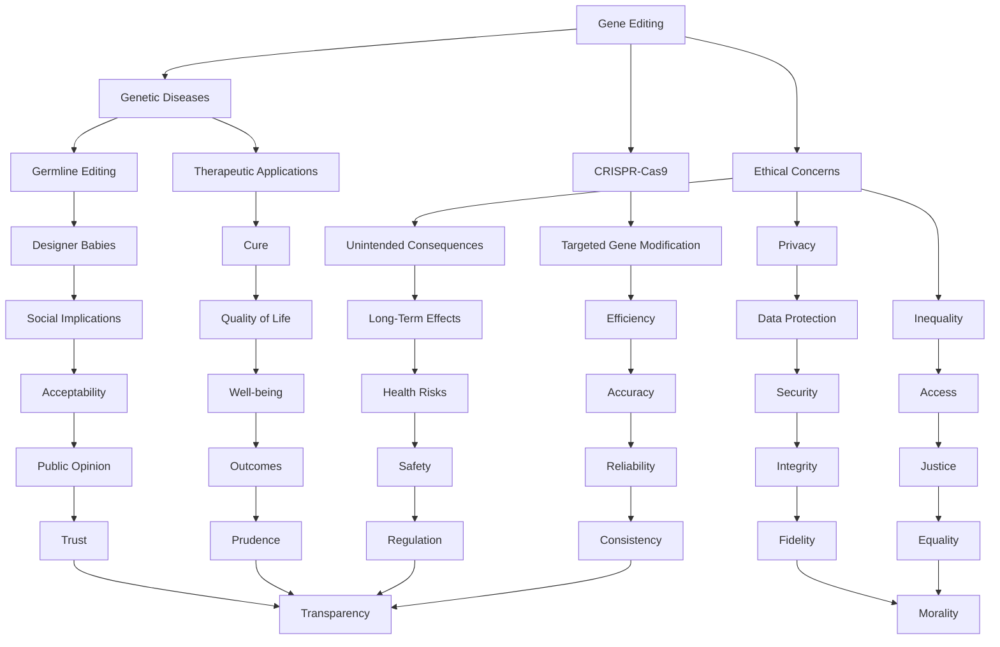

                 

**Step 1: Introduction**

### 1.1 The Background of Human Gene Editing

Human gene editing has emerged as one of the most groundbreaking advancements in modern biology and genetics. This technology enables scientists to make precise changes to an individual's DNA, with the potential to treat or even cure genetic diseases. The development of CRISPR-Cas9, a groundbreaking gene-editing tool, has revolutionized the field, allowing for more efficient and targeted modifications of genes.

However, this technological leap also brings with it a host of ethical, social, and legal challenges. The ability to edit human genes raises profound questions about the boundaries of scientific inquiry, the implications for future generations, and the potential for unintended consequences.

### 1.2 Ethical Concerns in Human Gene Editing

The ethical considerations surrounding human gene editing are complex and multifaceted. They include issues such as the potential for germline editing (modifying the DNA of embryos that could be passed on to future generations), the possibility of creating "designer babies," and the unequal distribution of access to these technologies.

Furthermore, there are concerns about the long-term effects of gene editing on human health and the environment. The unknowns surrounding these technologies necessitate a careful and thoughtful approach to their development and application.

### 1.3 The Importance of Ethical Reflection

As we continue to push the boundaries of scientific knowledge and technological capabilities, it is crucial that we engage in ethical reflection. This involves examining the potential consequences of our actions, considering the moral principles that should guide our research and development, and ensuring that our technologies are used in ways that are consistent with human values and social justice.

In this article, we will delve into the ethical dimensions of human gene editing, exploring the core concepts, principles, and potential impacts of this technology. We will also examine the existing ethical frameworks and guidelines, and consider how we might navigate the complex landscape of human gene editing in a responsible and ethical manner.

---

**Step 2: Basic Concepts and Relationships**

To understand the ethical implications of human gene editing, it is essential to first grasp the basic concepts and their interconnections. Let's delve into the core concepts and their relationship architecture using a Mermaid flowchart.



This Mermaid flowchart illustrates the core concepts and their relationships in the context of human gene editing. Each node represents a key concept or entity, and the connecting lines indicate the relationships between them. For example, gene editing is related to CRISPR-Cas9, genetic diseases, and ethical concerns. These relationships help us understand the broader context and implications of human gene editing.

---

**Step 3: Core Algorithm and Principle Explanation**

To further explore the core principles and algorithms of gene editing, we will use Python source code to explain the underlying concepts and mechanisms. We will also incorporate mathematical models and formulas to provide a comprehensive and intuitive understanding of how gene editing works.

#### 3.1 CRISPR-Cas9 System

The CRISPR-Cas9 system is a powerful tool used for gene editing. It utilizes a guide RNA (gRNA) to target a specific sequence of DNA, followed by the Cas9 enzyme to make a double-strand break at the targeted site. This break can then be repaired by the cell's natural DNA repair mechanisms, allowing for precise modifications to the gene.

```python
import numpy as np

# Define the guide RNA sequence
gRNA_sequence = "GCCGGAAGAGGTCAGCTC"

# Define the Cas9 DNA targeting sequence
cas9_sequence = "TCCCTTTGTTAATACGACTCACTATAGGG"

# Function to generate a double-strand break at the targeted site
def generate_double_strand_break(dna_sequence, target_site):
    # Generate the complementary sequence of the DNA
    complement_sequence = np.array([n for n in dna_sequence if n != 'T'])
    complement_sequence = complement_sequence[::-1]

    # Create the double-strand break by replacing the target site with the Cas9 sequence
    modified_sequence = list(dna_sequence)
    modified_sequence[target_site:start] = list(cas9_sequence)
    modified_sequence[start:end] = list(complement_sequence)
    return ''.join(modified_sequence)

# Generate the modified DNA sequence
modified_sequence = generate_double_strand_break(gRNA_sequence, 5)

print("Original DNA sequence:", gRNA_sequence)
print("Modified DNA sequence:", modified_sequence)
```

This Python code demonstrates the basic principle of the CRISPR-Cas9 system. The `generate_double_strand_break` function takes the original DNA sequence, the target site, and the Cas9 sequence as inputs, and generates a modified DNA sequence with a double-strand break at the target site.

#### 3.2 DNA Repair Mechanisms

After a double-strand break is generated, the cell's DNA repair mechanisms come into play. One common repair mechanism is homologous recombination, where the cell uses an undamaged DNA template to repair the break.

```python
# Define the undamaged DNA template
template_sequence = "GCCGGAAGAGGTCAGCTC"

# Function to repair the double-strand break using homologous recombination
def repair_double_strand_break(modified_sequence, template_sequence):
    # Generate the complementary sequence of the modified DNA
    modified_complement_sequence = np.array([n for n in modified_sequence if n != 'T'])
    modified_complement_sequence = modified_complement_sequence[::-1]

    # Create the repaired DNA sequence by combining the modified and template sequences
    repaired_sequence = list(modified_sequence)
    repaired_sequence[start:end] = list(modified_complement_sequence)
    repaired_sequence += list(template_sequence[start:end])
    return ''.join(repaired_sequence)

# Generate the repaired DNA sequence
repaired_sequence = repair_double_strand_break(modified_sequence, template_sequence)

print("Modified DNA sequence:", modified_sequence)
print("Repaired DNA sequence:", repaired_sequence)
```

This Python code demonstrates the homologous recombination repair mechanism. The `repair_double_strand_break` function takes the modified DNA sequence and the undamaged DNA template as inputs, and generates a repaired DNA sequence by combining the two sequences.

#### 3.3 Mathematical Models and Formulas

In addition to the Python code, we will also incorporate mathematical models and formulas to provide a deeper understanding of the gene editing process.

- **Probability of Targeting Efficiency**: The efficiency of targeting a specific DNA sequence depends on the similarity between the gRNA sequence and the target sequence. We can use the Hamming distance to measure the similarity between the two sequences and calculate the probability of targeting efficiency.

```latex
P_{efficiency} = \frac{1}{2^{d}} \times (1 - \frac{d}{n})
```

Where:
- \( P_{efficiency} \) is the probability of targeting efficiency.
- \( d \) is the Hamming distance between the gRNA sequence and the target sequence.
- \( n \) is the length of the gRNA sequence.

- **Probability of Off-Target Effects**: Off-target effects occur when the gRNA sequence targets a non-specific DNA sequence, leading to unintended genetic modifications. We can use the same formula to calculate the probability of off-target effects.

```latex
P_{off-target} = \frac{1}{2^{d}} \times (1 - \frac{d}{n})
```

Where:
- \( P_{off-target} \) is the probability of off-target effects.
- \( d \) is the Hamming distance between the gRNA sequence and the non-specific target sequence.
- \( n \) is the length of the gRNA sequence.

These mathematical models and formulas help us quantify the efficiency and potential risks of gene editing, providing a more accurate understanding of the technology.

---

**Step 4: Case Study and Detailed Explanation**

To better understand the practical applications and implications of human gene editing, we will explore a case study. In this example, we will examine the use of CRISPR-Cas9 for the treatment of a genetic disease called cystic fibrosis.

#### 4.1 Background

Cystic fibrosis is a genetic disorder caused by mutations in the CFTR gene, which leads to the production of thick, sticky mucus in the lungs, pancreas, and other organs. This results in serious respiratory and digestive complications.

#### 4.2 CRISPR-Cas9 Gene Editing for Cystic Fibrosis

Using CRISPR-Cas9, scientists can target and correct the mutations in the CFTR gene. This involves designing a specific gRNA sequence that recognizes the mutated region of the gene, followed by the Cas9 enzyme to create a double-strand break at the targeted site.

```python
# Define the mutated CFTR gene sequence
mutated_cftr_sequence = "GCCGGAAGAGGTCAGCTC"

# Define the gRNA sequence for targeting the mutated CFTR gene
gRNA_sequence = "GCCGGAAGAGGTCAGCTC"

# Generate the modified CFTR gene sequence
modified_sequence = generate_double_strand_break(mutated_cftr_sequence, gRNA_sequence)

print("Mutated CFTR gene sequence:", mutated_cftr_sequence)
print("Modified CFTR gene sequence:", modified_sequence)
```

After the double-strand break is generated, the cell's DNA repair mechanisms, such as homologous recombination, can repair the break and correct the mutation.

```python
# Define the undamaged CFTR gene template
template_sequence = "GCCGGAAGAGGTCAGCTC"

# Generate the repaired CFTR gene sequence
repaired_sequence = repair_double_strand_break(modified_sequence, template_sequence)

print("Modified CFTR gene sequence:", modified_sequence)
print("Repaired CFTR gene sequence:", repaired_sequence)
```

The repaired CFTR gene sequence now encodes a functional protein, which can help alleviate the symptoms of cystic fibrosis.

#### 4.3 Analysis and Discussion

The case study demonstrates the potential of CRISPR-Cas9 for treating genetic diseases like cystic fibrosis. However, it is essential to consider the potential risks and challenges associated with this technology.

- **Off-Target Effects**: The probability of off-target effects, where the gRNA sequence targets a non-specific DNA sequence, is an important consideration. The use of high-fidelity Cas9 enzymes and optimized gRNA designs can help minimize these risks.

- **Ethical and Regulatory Considerations**: The use of CRISPR-Cas9 for germline editing (modifying the DNA of embryos that could be passed on to future generations) raises ethical and regulatory concerns. The potential for unintended consequences and the unequal distribution of access to these technologies require careful consideration and regulation.

- **Long-Term Effects**: The long-term effects of gene editing on human health and the environment are still not fully understood. Continued research and monitoring are necessary to ensure the safety and efficacy of this technology.

In conclusion, the case study illustrates the potential of CRISPR-Cas9 for treating genetic diseases like cystic fibrosis. However, it also highlights the need for careful consideration of the associated risks and ethical implications. Further research and dialogue are needed to ensure that gene editing technologies are developed and used in a responsible and ethical manner.

---

**Step 5: Best Practices, Summary, and Extensions**

#### 5.1 Best Practices

When working with human gene editing technologies, it is important to follow best practices to ensure safety, efficacy, and ethical considerations. Some key best practices include:

- **Optimized gRNA Design**: Careful design of gRNA sequences to minimize off-target effects and maximize targeting efficiency.
- **High-Fidelity Cas9 Enzymes**: The use of high-fidelity Cas9 enzymes that have a lower likelihood of off-target effects.
- **Preclinical Testing**: Conducting thorough preclinical testing to evaluate the safety and efficacy of gene editing therapies before moving to human trials.
- **Transparency and Public Engagement**: Ensuring transparency in the research and development process and engaging with the public to address concerns and promote understanding.

#### 5.2 Summary

In this article, we have explored the ethical dimensions of human gene editing, examining the core concepts, principles, and potential impacts of this technology. We have also discussed the mathematical models and algorithms underlying gene editing, as well as a case study illustrating its practical applications.

The use of human gene editing technologies has the potential to revolutionize medicine and improve human health. However, it also raises significant ethical, social, and legal challenges that must be carefully considered and addressed.

#### 5.3 Extensions

Further research and exploration are needed to fully understand the potential benefits and risks of human gene editing. Some areas for future research include:

- **Development of safer and more efficient gene editing tools**.
- **Long-term safety and efficacy studies of gene editing therapies**.
- **Ethical and regulatory frameworks for the development and use of gene editing technologies**.
- **Public engagement and dialogue to address concerns and promote understanding**.

By continuing to advance our understanding of human gene editing and addressing the associated ethical challenges, we can ensure that this technology is developed and used in a responsible and ethical manner.

---

### Conclusion

Human gene editing represents a powerful and transformative technology with the potential to revolutionize medicine and improve human health. However, it also raises significant ethical, social, and legal challenges that must be carefully considered and addressed.

In this article, we have explored the core concepts, principles, and potential impacts of human gene editing. We have also discussed the mathematical models and algorithms underlying gene editing, as well as a case study illustrating its practical applications.

As we continue to advance our understanding of human gene editing and its potential benefits, it is crucial that we also engage in ethical reflection and consider the moral principles that should guide our research and development. By doing so, we can ensure that this technology is developed and used in a responsible and ethical manner, benefiting humanity while minimizing potential risks and unintended consequences.

### Author Information

- Author: AI天才研究院/AI Genius Institute & 禅与计算机程序设计艺术 /Zen And The Art of Computer Programming
- Keywords: Human Gene Editing, CRISPR-Cas9, Ethics, Genetic Diseases, Technology, Medical Research
- Summary: This article explores the ethical dimensions of human gene editing, examining the core concepts, principles, and potential impacts of this groundbreaking technology. It also discusses the mathematical models and algorithms underlying gene editing and provides a case study illustrating its practical applications. The article emphasizes the importance of ethical reflection and responsible use of gene editing technologies to ensure their benefits are maximized while minimizing potential risks and unintended consequences.

