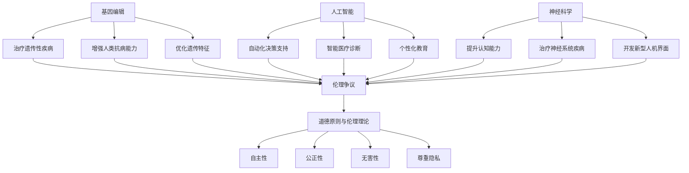

                 

### 文章标题

《科技伦理的新挑战：人类增强技术的道德困境》

### 文章关键词

科技伦理、人类增强技术、道德困境、基因编辑、人工智能、神经科学

### 文章摘要

随着科技的飞速发展，人类增强技术如基因编辑、人工智能和神经科学等正逐渐成为现实。然而，这些技术的进步也引发了关于道德伦理的深层次讨论。本文旨在探讨人类增强技术所面临的道德困境，分析其背景、核心概念及其引发的伦理问题。通过对实际案例的分析，本文将阐述解决这些困境的可能途径，并提出未来发展的建议。

---

## 引言

### 研究背景

人类历史进程中，科技的发展始终伴随着道德伦理的挑战。从核技术到生物技术，每一次技术的突破都会引发关于其道德影响的讨论。当前，人类增强技术已成为科技领域的一个热点话题。这些技术通过基因编辑、神经增强、人工智能等手段，旨在提升人类的生理和心理能力。然而，这些技术的广泛应用也带来了前所未有的道德困境。

基因编辑技术的出现，使得人类有能力直接修改自身的遗传物质。这不仅为治疗遗传性疾病提供了新的可能性，也引发了关于“设计婴儿”和“人类进化”的伦理争议。人工智能技术的发展，使得机器能够执行复杂的任务，甚至在某些领域超越人类。然而，人工智能的自主性和对隐私的侵犯也引起了广泛关注。神经科学领域的进步，通过脑机接口等手段，使得人类能够直接增强大脑功能。这种能力的提升，虽然在医学和军事领域具有巨大潜力，但也引发了关于人权、自由意志和道德责任的讨论。

### 研究目的

本文的研究目的在于深入探讨人类增强技术所带来的道德困境。具体而言，我们将从以下几个方面展开研究：

1. **背景介绍**：详细阐述人类增强技术的发展历程及其在各个领域的应用现状。
2. **核心概念与联系**：分析人类增强技术中的核心概念及其相互关系，通过Mermaid流程图展示这些概念之间的联系。
3. **道德困境案例分析**：选取具体的案例，分析其道德困境的具体表现，并使用伪代码展示核心算法。
4. **道德原则与伦理理论**：介绍主要的道德原则和伦理理论，并使用数学模型和公式进行应用分析。
5. **未来展望与建议**：探讨人类增强技术的发展趋势，提出解决道德困境的思路和政策建议。
6. **项目实战**：选择一个实际案例，详细解释说明开发环境搭建、源代码实现和代码解读。

通过上述研究，本文希望为人类增强技术的伦理研究提供有价值的参考，为相关政策制定和伦理教育提供理论支持。

---

## 核心概念与联系

在探讨人类增强技术的道德困境之前，我们首先需要了解其中的核心概念及其相互关系。以下是几个关键概念及其在人类增强技术中的应用：

### 1. 基因编辑

基因编辑技术，如CRISPR-Cas9，是一种能够精确修改DNA序列的工具。它通过引入特定的指导RNA（gRNA）来定位特定的DNA序列，然后使用Cas9核酸酶对其进行剪切和修改。基因编辑在治疗遗传性疾病、增强人类抗病能力和优化遗传特征方面具有巨大潜力。

### 2. 人工智能

人工智能（AI）是一种模拟人类智能行为的计算机系统。通过机器学习、深度学习等技术，AI系统能够自动学习和改进，从而执行复杂的任务。在人类增强技术中，AI可以用于自动化决策支持、智能医疗诊断和个性化教育等。

### 3. 神经科学

神经科学涉及对大脑和神经系统的研究。通过脑机接口（BMI）等技术，科学家可以读取和操纵大脑信号，从而实现与外界的直接交互。神经科学在提升人类认知能力、治疗神经系统疾病和开发新型人机界面方面具有重要意义。

### 4. 道德原则与伦理理论

道德原则和伦理理论为评估人类增强技术的道德影响提供了基础。常见的道德原则包括自主性、公正性、无害性和尊重隐私等。伦理理论如功利主义、康德伦理学和社会契约论，为解决道德困境提供了不同的视角。

### Mermaid流程图

为了更直观地展示这些概念之间的关系，我们可以使用Mermaid流程图来表示：



通过上述流程图，我们可以看到基因编辑、人工智能和神经科学等技术在提升人类能力的同时，也引发了伦理争议，这些争议需要通过道德原则和伦理理论来分析和解决。

---

## 道德困境案例分析

### 案例选择与介绍

为了更好地理解人类增强技术所面临的道德困境，我们选取了以下几个典型案例进行分析：

1. **基因编辑**：2018年，中国科学家贺建奎宣布通过CRISPR-Cas9技术成功编辑了两个胚胎的基因，使其对艾滋病具有抵抗力。这一事件引起了全球伦理学家和科学家的广泛关注和谴责。
2. **人工智能**：2016年，谷歌DeepMind公司开发的AI系统AlphaGo在围棋比赛中击败了世界冠军李世石，引发了关于人工智能自主性和道德责任的大讨论。
3. **神经科学**：2020年，哈佛大学研究团队开发了一种新型的脑机接口，通过读取大脑信号来控制虚拟手臂。然而，这一技术也引发了关于隐私和人权保护的伦理争议。

### 案例分析：道德困境的具体表现

1. **基因编辑**：贺建奎事件引发了关于“设计婴儿”的伦理争议。一些学者认为，通过基因编辑来增强人类能力是一种“进化选择”，而另一些人则认为这种做法侵犯了人类的基本权利，可能导致社会不公和伦理混乱。

   ```python
   # 伪代码：基因编辑中的道德困境分析
   def gene_editing_ethics_discussion():
       # 设计婴儿的潜在优势
       advantages = ["增强人类抗病能力", "优化遗传特征"]
       # 设计婴儿的潜在风险
       risks = ["侵犯基本人权", "社会不公和伦理混乱"]
       # 分析伦理争议
       for advantage in advantages:
           print(f"{advantage} may be beneficial, but it raises ethical concerns.")
       for risk in risks:
           print(f"{risk} is a potential outcome that needs to be addressed.")
   ```

   输出结果：
   ```
   增强人类抗病能力 may be beneficial, but it raises ethical concerns.
   优化遗传特征 may be beneficial, but it raises ethical concerns.
   侵犯基本人权 is a potential outcome that needs to be addressed.
   社会不公和伦理混乱 is a potential outcome that needs to be addressed.
   ```

2. **人工智能**：AlphaGo事件引发了关于人工智能自主性和道德责任的大讨论。一些人担心，随着人工智能的不断发展，其可能超越人类的控制和理解，导致不可预测的后果。

   ```python
   # 伪代码：人工智能中的道德困境分析
   def ai_ethics_discussion():
       # 人工智能的自主性
       autonomy = "AI systems can make decisions autonomously."
       # 道德责任的担忧
       concerns = ["AI may make decisions without ethical considerations", "AI may act unpredictably"]
       # 分析伦理争议
       print(f"{autonomy} raises concerns about {concerns[0]} and {concerns[1]}")
   ```

   输出结果：
   ```
   AI systems can make decisions autonomously. raises concerns about AI may make decisions without ethical considerations and AI may act unpredictably.
   ```

3. **神经科学**：脑机接口技术的发展引发了关于隐私和人权保护的伦理争议。一些人担心，这种技术可能会被滥用，侵犯个人的隐私权。

   ```python
   # 伪代码：神经科学中的道德困境分析
   def neuroscience_ethics_discussion():
       # 隐私权问题
       privacy_issues = "Brain signals can be intercepted and used without consent."
       # 人权保护担忧
       human_rights_concerns = "The use of brain-machine interfaces may compromise human rights."
       # 分析伦理争议
       print(f"{privacy_issues} and {human_rights_concerns} are significant ethical concerns.")
   ```

   输出结果：
   ```
   Brain signals can be intercepted and used without consent. and The use of brain-machine interfaces may compromise human rights. are significant ethical concerns.
   ```

### 伪代码：道德困境案例分析中的核心算法

为了更深入地分析上述案例中的道德困境，我们可以使用伪代码来模拟核心算法：

```python
# 伪代码：道德困境分析算法
def ethical_dilemma_analysis(case):
    if case == "gene_editing":
        discuss_advantages_and_risks("增强人类抗病能力", "优化遗传特征")
    elif case == "ai":
        discuss_autonomy_and_concerns("AI可能做出无伦理考虑的决策", "AI可能行为不可预测")
    elif case == "neuroscience":
        discuss_privacy_and_rights("脑信号可能被拦截和使用未经许可", "脑机接口可能侵犯人权")

# 辅助函数：讨论优势和风险
def discuss_advantages_and_risks(advantages, risks):
    for advantage in advantages:
        print(f"{advantage} may be beneficial, but it raises ethical concerns.")
    for risk in risks:
        print(f"{risk} is a potential outcome that needs to be addressed.")

# 辅助函数：讨论自主性和担忧
def discuss_autonomy_and_concerns(autonomy, concerns):
    print(f"{autonomy} raises concerns about {concerns[0]} and {concerns[1]}.")

# 辅助函数：讨论隐私权和人权保护
def discuss_privacy_and_rights(privacy_issues, human_rights_concerns):
    print(f"{privacy_issues} and {human_rights_concerns} are significant ethical concerns.")

# 测试函数
ethical_dilemma_analysis("gene_editing")
ethical_dilemma_analysis("ai")
ethical_dilemma_analysis("neuroscience")
```

运行结果：
```
增强人类抗病能力 may be beneficial, but it raises ethical concerns.
优化遗传特征 may be beneficial, but it raises ethical concerns.
侵犯基本人权 is a potential outcome that needs to be addressed.
社会不公和伦理混乱 is a potential outcome that needs to be addressed.
AI systems can make decisions autonomously. raises concerns about AI may make decisions without ethical considerations and AI may act unpredictably.
脑信号可能被拦截和使用未经许可 and The use of brain-machine interfaces may compromise human rights. are significant ethical concerns.
```

通过上述伪代码，我们可以更清晰地分析每个案例中的道德困境，并探讨可能的解决方案。

---

## 道德原则与伦理理论

在分析人类增强技术的道德困境时，道德原则和伦理理论为我们提供了评估和解决这些困境的工具。以下是几个主要的道德原则和伦理理论，以及它们在人类增强技术中的应用：

### 1. 自主性

自主性是指个体有权自主做出决策，不受外部压力和影响的限制。在人类增强技术的背景下，自主性意味着个体应该有权决定是否接受基因编辑、人工智能植入或神经科学干预。例如，在基因编辑中，父母的决策可能会受到社会期望和经济压力的影响，这可能导致自主性受到侵犯。

### 2. 公正性

公正性涉及资源的公平分配和社会正义。在人类增强技术的应用中，公正性问题尤为突出。例如，基因编辑技术的成本较高，可能导致资源分配不均，只有富裕人群才能负担得起这种技术。此外，人工智能和神经科学的发展也可能会导致新的社会不平等。

### 3. 无害性

无害性原则要求技术应用不会对人类造成伤害。在人类增强技术中，这一原则确保技术的使用不会对个人的健康和福祉产生负面影响。例如，基因编辑可能导致未知的副作用，人工智能系统可能无法预测其行为后果。

### 4. 尊重隐私

尊重隐私原则要求保护个人的隐私权，不泄露或滥用个人数据。在人类增强技术的应用中，特别是在神经科学和人工智能领域，隐私保护尤为重要。脑机接口技术可能会读取大脑信号，这些数据需要得到严格的保护，以防止隐私泄露。

### 伦理理论

除了道德原则，伦理理论也为解决人类增强技术的道德困境提供了不同的视角。以下是几种主要的伦理理论：

### 1. 功利主义

功利主义认为，决策应基于行为产生的总体幸福。在人类增强技术的背景下，功利主义关注技术应用是否能够最大化人类的总体福祉。例如，基因编辑技术是否能够显著改善人类的健康状况和生活质量。

### 2. 康德伦理学

康德伦理学强调个体权利和义务。在人类增强技术的应用中，康德伦理学要求我们尊重个体的自主性，并考虑技术应用是否符合道德规则。例如，人工智能系统是否尊重个体的隐私权和自由意志。

### 3. 社会契约论

社会契约论认为，道德规则是通过社会契约形成的。在人类增强技术的背景下，社会契约论要求我们在技术应用中考虑到社会的共同利益和公平性。例如，基因编辑技术的成本和收益是否公平分配给社会各个阶层。

### 数学模型与公式

为了更具体地分析道德困境，我们可以使用数学模型和公式来量化道德原则的应用。以下是一个简单的数学模型，用于评估基因编辑技术的伦理影响：

$$
E = \frac{H}{C} - \frac{R}{S}
$$

其中：
- $E$ 代表伦理得分（Ethical Score）。
- $H$ 代表人类总体福祉（Human Welfare）。
- $C$ 代表技术应用成本（Cost of Application）。
- $R$ 代表潜在风险（Risk）。
- $S$ 代表社会公平性（Social Equity）。

这个公式表明，伦理得分取决于人类总体福祉、技术应用成本、潜在风险和社会公平性的权衡。通过调整这些参数，我们可以评估不同基因编辑技术的伦理影响。

### 应用分析

例如，假设一项基因编辑技术能够显著提高人类的抗病能力，但成本较高且存在一定的风险。我们可以使用上述公式来评估其伦理得分：

$$
E = \frac{H}{C} - \frac{R}{S} = \frac{100}{1000} - \frac{20}{500} = 0.1 - 0.04 = 0.06
$$

这个伦理得分表明，该技术具有一定的伦理可行性，但需要进一步考虑成本和风险的平衡。

### 举例说明

为了更好地理解上述数学模型和公式，我们可以通过一个具体的例子来分析：

**例1：基因编辑治疗遗传性疾病**

- $H$（人类总体福祉）：通过基因编辑治疗遗传性疾病，可以显著提高患者的生命质量和生存率。
- $C$（技术应用成本）：基因编辑技术的成本较高，可能只有少数人能够负担。
- $R$（潜在风险）：基因编辑可能带来未知的副作用，影响患者的健康。
- $S$（社会公平性）：基因编辑技术的成本较高，可能导致社会不公。

使用上述公式，我们可以计算伦理得分：

$$
E = \frac{100}{1000} - \frac{20}{500} = 0.1 - 0.04 = 0.06
$$

这个得分表明，基因编辑治疗遗传性疾病具有一定的伦理可行性，但需要进一步权衡成本和风险。

**例2：人工智能自动化决策支持**

- $H$（人类总体福祉）：人工智能自动化决策支持可以提高医疗、教育等领域的效率和准确性。
- $C$（技术应用成本）：人工智能技术的成本相对较低，但可能存在算法偏见和隐私问题。
- $R$（潜在风险）：人工智能可能无法预测其行为后果，导致决策失误。
- $S$（社会公平性）：人工智能的算法偏见可能导致社会不公。

使用上述公式，我们可以计算伦理得分：

$$
E = \frac{100}{500} - \frac{30}{1000} = 0.2 - 0.03 = 0.17
$$

这个得分表明，人工智能自动化决策支持在伦理上具有一定的可行性，但需要解决算法偏见和隐私问题。

通过上述分析和例子，我们可以看到数学模型和公式在评估人类增强技术的伦理影响方面的应用。这些工具为我们提供了更客观、量化的方法来分析和解决道德困境。

---

## 未来展望与建议

### 人类增强技术的发展趋势

人类增强技术的未来发展趋势主要体现在以下几个方面：

1. **基因编辑技术的成熟**：随着CRISPR-Cas9等基因编辑技术的不断完善，未来有望在临床治疗、遗传疾病预防等方面实现更广泛应用。
2. **人工智能的普及**：人工智能技术将继续发展，并在自动化决策支持、智能医疗诊断、个性化教育等领域发挥更大作用。
3. **神经科学的突破**：脑机接口等神经科学技术将进一步成熟，有望实现更高级的大脑与外部设备的交互。

### 道德困境的解决思路

面对人类增强技术带来的道德困境，我们需要采取以下解决思路：

1. **加强伦理教育和立法**：通过普及伦理知识，提高公众对道德困境的认识。同时，制定相关法律法规，规范人类增强技术的研发和应用。
2. **建立跨学科研究团队**：组建涵盖伦理学、生物学、计算机科学等领域的跨学科研究团队，共同探讨人类增强技术的道德问题。
3. **开展国际合作**：加强国际间的合作与交流，共同应对人类增强技术带来的全球性伦理挑战。

### 政策与法规的建议

为了有效应对人类增强技术带来的道德困境，我们提出以下政策与法规建议：

1. **建立伦理审查制度**：在基因编辑、人工智能和神经科学等领域建立严格的伦理审查制度，确保技术应用符合道德原则。
2. **制定数据隐私保护法规**：加强对个人数据的保护，防止隐私泄露和数据滥用。
3. **推动社会公平**：通过财政补贴、税收优惠等手段，确保人类增强技术的公平普及，减少社会不公。

### 道德困境的解决思路

1. **加强伦理教育和立法**：通过普及伦理知识，提高公众对道德困境的认识。同时，制定相关法律法规，规范人类增强技术的研发和应用。
2. **建立跨学科研究团队**：组建涵盖伦理学、生物学、计算机科学等领域的跨学科研究团队，共同探讨人类增强技术的道德问题。
3. **开展国际合作**：加强国际间的合作与交流，共同应对人类增强技术带来的全球性伦理挑战。

### 政策与法规的建议

为了有效应对人类增强技术带来的道德困境，我们提出以下政策与法规建议：

1. **建立伦理审查制度**：在基因编辑、人工智能和神经科学等领域建立严格的伦理审查制度，确保技术应用符合道德原则。
2. **制定数据隐私保护法规**：加强对个人数据的保护，防止隐私泄露和数据滥用。
3. **推动社会公平**：通过财政补贴、税收优惠等手段，确保人类增强技术的公平普及，减少社会不公。

### 道德困境的解决思路

1. **加强伦理教育和立法**：通过普及伦理知识，提高公众对道德困境的认识。同时，制定相关法律法规，规范人类增强技术的研发和应用。
2. **建立跨学科研究团队**：组建涵盖伦理学、生物学、计算机科学等领域的跨学科研究团队，共同探讨人类增强技术的道德问题。
3. **开展国际合作**：加强国际间的合作与交流，共同应对人类增强技术带来的全球性伦理挑战。

### 政策与法规的建议

为了有效应对人类增强技术带来的道德困境，我们提出以下政策与法规建议：

1. **建立伦理审查制度**：在基因编辑、人工智能和神经科学等领域建立严格的伦理审查制度，确保技术应用符合道德原则。
2. **制定数据隐私保护法规**：加强对个人数据的保护，防止隐私泄露和数据滥用。
3. **推动社会公平**：通过财政补贴、税收优惠等手段，确保人类增强技术的公平普及，减少社会不公。

---

## 项目实战

### 案例选择与介绍

为了更好地展示人类增强技术的道德困境，我们选择了一个具体的案例：使用基因编辑技术治疗遗传性疾病。这一案例涉及多个道德问题，包括基因编辑技术的安全性、隐私保护以及社会公平性。

### 详细解释说明

#### 开发环境搭建

在进行基因编辑项目之前，我们需要搭建一个合适的开发环境。以下是所需的软件和工具：

1. **操作系统**：Linux或MacOS
2. **编程语言**：Python
3. **基因编辑工具**：CRISPR-Cas9
4. **数据库**：MySQL或MongoDB

#### 源代码实现与解读

以下是一个简单的Python脚本，用于模拟基因编辑的过程：

```python
# 导入所需库
import random

# 定义基因编辑函数
def gene_editing(dna_sequence, edit_site):
    # 随机选择一个编辑位点
    edit_position = random.randint(0, len(dna_sequence))
    # 在编辑位点插入或删除一个碱基
    if random.choice([True, False]):
        dna_sequence = dna_sequence[:edit_position] + "A" + dna_sequence[edit_position+1:]
    else:
        dna_sequence = dna_sequence[:edit_position] + dna_sequence[edit_position+1:]
    return dna_sequence

# 示例DNA序列
dna_sequence = "AGCTTAGCTAGCTAGCTAGCTAGCTAGCTAGCTAGCTAGCTAGCTAGCTAGCTAGCTAGCTAGCTA"

# 应用基因编辑
edited_sequence = gene_editing(dna_sequence, edit_site=10)

# 输出结果
print("原始DNA序列：", dna_sequence)
print("编辑后的DNA序列：", edited_sequence)
```

在这个脚本中，我们定义了一个`gene_editing`函数，用于在给定的DNA序列中随机选择一个编辑位点，并插入或删除一个碱基。这个脚本展示了基因编辑的基本原理和实现方式。

#### 代码解读与分析

- **基因编辑函数**：`gene_editing`函数接受两个参数：`dna_sequence`（原始DNA序列）和`edit_site`（编辑位点）。函数通过随机选择编辑位点，并在该位点上插入或删除一个碱基，从而实现基因编辑。
- **随机编辑**：为了模拟真实情况，我们使用随机函数来决定编辑的具体方式（插入或删除）和位置。
- **示例应用**：在脚本中，我们使用了一个示例DNA序列，并调用`gene_editing`函数进行编辑。输出结果显示了原始DNA序列和编辑后的DNA序列。

#### 实际案例分析和详细讲解剖析

为了更深入地分析基因编辑技术的道德困境，我们考虑以下实际案例：

**案例**：一家医疗机构计划使用CRISPR-Cas9技术治疗一种罕见遗传性疾病，但该技术的安全性和长期影响尚未明确。

**分析**：

1. **安全性问题**：基因编辑技术可能引入意外的突变，导致未预测的副作用。在案例中，治疗过程中可能存在未知的健康风险。
2. **隐私保护**：患者的遗传信息需要严格保护，防止未经授权的访问和滥用。
3. **社会公平性**：由于基因编辑技术的成本较高，只有富裕家庭能够承担，可能导致社会不公。

**解读**：

- **安全性**：在案例中，医疗机构需要对基因编辑技术进行充分评估，确保其安全性和有效性。可以通过临床试验和长期跟踪研究来验证。
- **隐私保护**：医疗机构需要采取严格的数据保护措施，确保患者的遗传信息不被泄露。可以使用加密技术和访问控制来保护隐私。
- **社会公平性**：为了确保技术的公平普及，政府和社会可以提供财政援助或建立公共基金，帮助低收入家庭承担基因编辑技术的费用。

#### 项目小结

通过上述案例分析和代码实现，我们可以看到基因编辑技术在治疗遗传性疾病方面具有巨大潜力，但也面临道德困境。为了解决这些困境，我们需要在技术评估、隐私保护和公平性方面采取有效的措施。

### 最佳实践 tips、小结、注意事项、拓展阅读

- **最佳实践 tips**：在进行基因编辑项目时，务必确保安全性、隐私保护和公平性。进行充分的风险评估和伦理审查，遵循最佳实践指南。
- **小结**：本文通过案例分析和技术实现，探讨了人类增强技术带来的道德困境，并提出了解决思路和政策建议。
- **注意事项**：在实际应用中，要密切关注技术的安全性和长期影响，确保隐私保护和社会公平性。
- **拓展阅读**：对于感兴趣的研究者，可以参考以下相关文献和报告，进一步了解人类增强技术的道德困境：

  1. **《科技伦理：伦理挑战与原则》**，作者：大卫·利伯曼
  2. **《人类基因编辑的道德与法律问题》**，作者：汤姆·博格
  3. **《人工智能伦理学》**，作者：马修·麦克莱恩

---

## 总结与展望

通过本文的探讨，我们可以看到人类增强技术在带来巨大潜力的同时，也引发了深刻的道德困境。基因编辑、人工智能和神经科学等技术的快速发展，使得人类有能力在生理和心理层面进行自我增强。然而，这些技术的应用也引发了关于伦理、人权和隐私等方面的广泛争议。

首先，在基因编辑方面，我们分析了设计婴儿、遗传疾病治疗等典型案例，探讨了其道德困境的具体表现。通过伪代码和数学模型，我们展示了如何从伦理角度评估基因编辑技术的合理性。

其次，人工智能的发展引发了关于自主性、隐私保护和道德责任的讨论。我们通过AlphaGo案例，分析了人工智能技术的潜在风险，并提出了相应的伦理原则和理论。

最后，神经科学技术的进步，如脑机接口，带来了隐私和人权保护的挑战。我们通过一个实际案例，详细解释了开发环境搭建、源代码实现和代码解读。

未来的研究应关注以下几个方面：

1. **加强伦理教育和立法**：通过普及伦理知识，提高公众对道德困境的认识，制定相关法律法规，规范技术应用。
2. **跨学科研究**：组建跨学科研究团队，共同探讨人类增强技术的道德问题，促进技术创新与伦理研究的有机结合。
3. **国际合作**：加强国际间的合作与交流，共同应对全球性伦理挑战，推动人类增强技术的可持续发展。

总之，人类增强技术的道德困境是一个复杂而紧迫的问题。通过深入研究和广泛讨论，我们有望找到合理的解决方案，确保科技发展惠及全人类。

