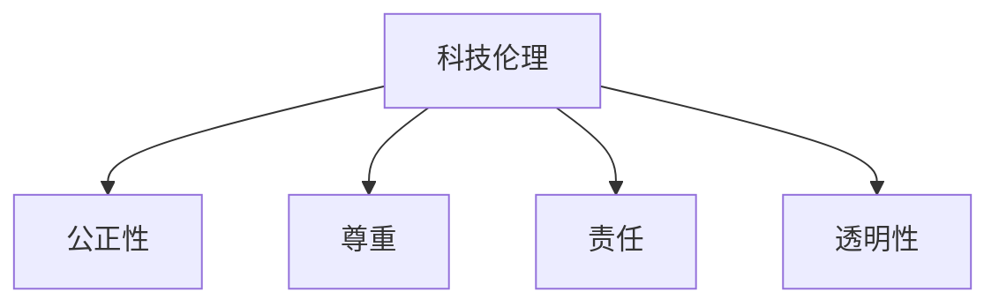
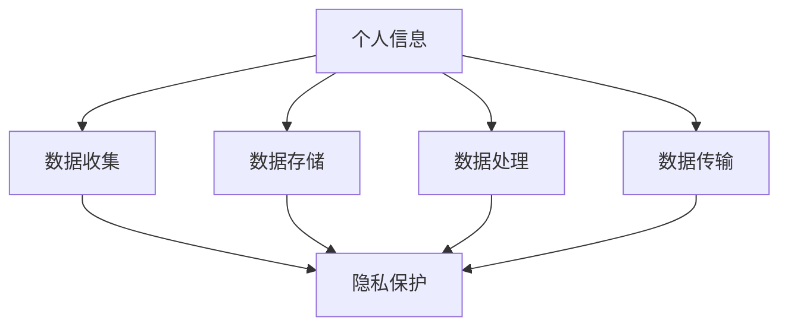
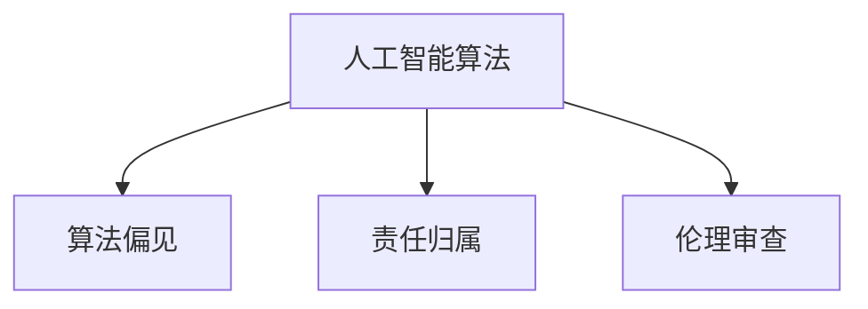
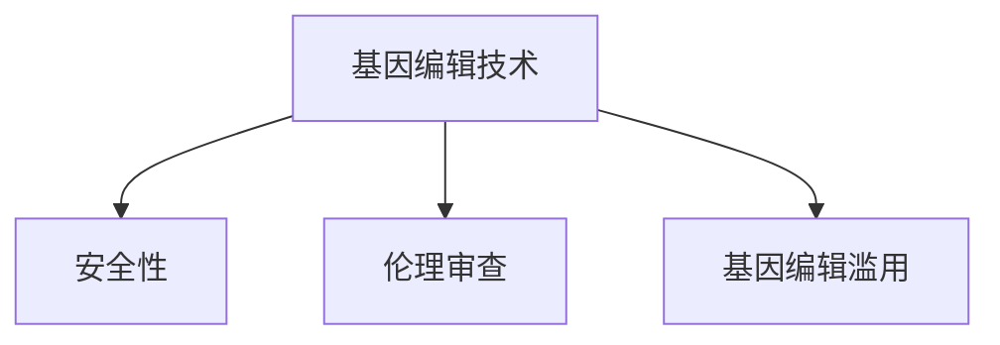
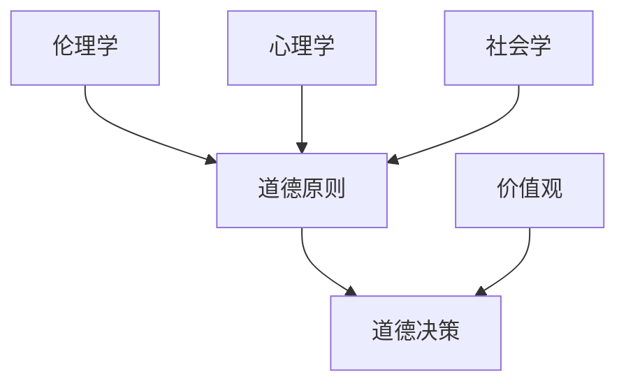
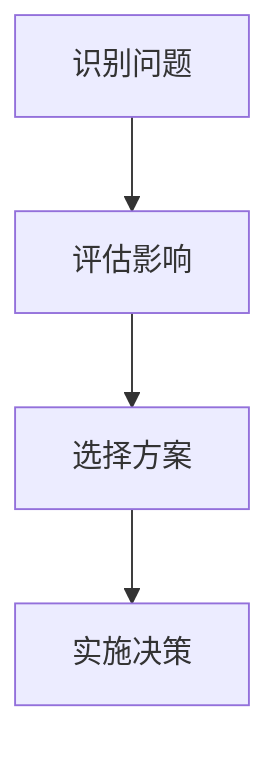
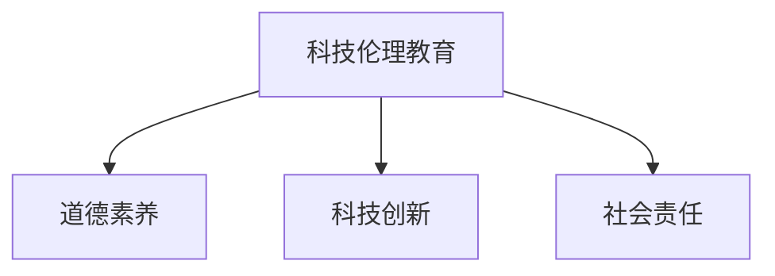
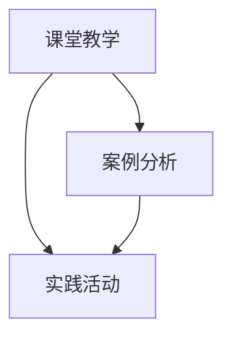
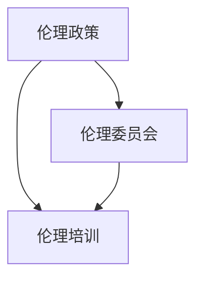

                 

# 《科技伦理的新挑战：在创新与道德间寻找平衡》

## 关键词

科技伦理、创新、道德、人工智能、数据隐私、基因编辑、道德决策框架

## 摘要

随着科技的迅猛发展，创新成为了推动社会进步的重要动力。然而，科技进步带来的伦理挑战也越来越显著。本文将深入探讨科技伦理的新挑战，分析创新与道德之间的平衡问题，并提出相应的解决策略。通过本文的阅读，读者将更好地理解科技伦理的基本概念、面临的挑战，以及如何在实际应用中寻求创新与道德的平衡。

## 引言

### 主题介绍

在科技飞速发展的今天，人工智能、基因编辑、大数据等前沿技术的出现，不仅带来了前所未有的便利，同时也引发了诸多伦理争议。如何确保科技进步符合道德规范，成为了一个亟待解决的问题。本书旨在探讨这一主题，通过分析科技伦理的新挑战，为科技工作者、政策制定者和公众提供有价值的参考。

### 书籍结构概述

本书共分为七个章节。第一章介绍科技伦理的基本概念，并概述本书的结构和目标。第二章和第三章详细分析科技创新中常见的伦理挑战，包括数据隐私保护和人工智能的道德责任。第四章至第六章探讨道德决策框架、道德教育与伦理指导，以及国际视角下的科技伦理。第七章展望科技伦理的未来发展趋势，并讨论未来可能面临的挑战。

### 预期读者

本书适用于对科技伦理感兴趣的各类读者，包括科技工作者、伦理学者、政策制定者、以及普通公众。通过本书，读者可以更好地理解科技伦理的重要性，提升自身在科技创新中的道德责任感。

## 第1章 科技伦理的基础概念

### 1.1 科技伦理的定义

科技伦理是指科技活动中的道德规范和价值观念，旨在确保科技进步符合人类的根本利益。科技伦理不仅关注科技本身，更强调科技对社会、环境、人类福祉的影响。在科技伦理的定义中，有四个核心原则被广泛接受，即公正性、尊重、责任和透明性。

### 1.2 科技伦理的重要性

科技伦理的重要性体现在多个方面。首先，科技伦理能够引导科技发展，确保科技进步符合社会需求，避免因追求利益而损害公共利益。其次，科技伦理有助于构建健康的社会环境，促进科技与人文的和谐发展。最后，科技伦理能够提升科技工作者的道德素养，增强其社会责任感，避免因科技滥用而导致的社会问题。

### 1.3 科技伦理的四大原则

#### 公正性

公正性是科技伦理的基本原则之一，强调科技发展应公平对待所有人，不偏袒特定群体。在资源分配、技术应用等方面，应确保公正性，避免造成社会不公。

#### 尊重

尊重原则要求科技活动应尊重个体的自主权、隐私权等基本权利。科技发展不应侵犯个人隐私，应尊重个体的知情权和选择权。

#### 责任

责任原则要求科技工作者在科技活动中承担相应的道德责任。科技工作者应确保其科技成果符合伦理规范，避免因科技滥用导致的社会问题。

#### 透明性

透明性原则要求科技活动的过程和结果应公开透明，接受社会监督。透明性有助于提升公众对科技的信任，促进科技与社会的良性互动。

### 1.4 科技伦理的核心概念实体关系架构

为了更好地理解科技伦理的核心概念，我们可以使用Mermaid流程图来展示这些概念之间的关系：

在这个流程图中，科技伦理作为核心概念，与其他三个原则相互关联，共同构成科技伦理的框架。

## 第2章 科技创新中的伦理挑战

### 2.1 数据隐私保护

随着大数据和人工智能技术的发展，数据隐私问题变得越来越突出。数据隐私保护涉及到个人信息的收集、存储、处理和传输等环节，其核心目标是确保个人信息不被未经授权的第三方获取和滥用。

#### 背景介绍

在数字时代，个人数据已经成为一种重要的资源。企业和政府通过收集和分析海量数据，能够实现精准营销、提高服务质量、制定更科学的政策等。然而，这种数据收集和使用行为也带来了严重的隐私问题。例如，个人信息泄露、滥用、交易等问题频繁发生，严重侵害了个人隐私权。

#### 核心概念与联系

为了更好地理解数据隐私保护，我们可以使用Mermaid流程图来展示其核心概念之间的关系：

在这个流程图中，个人信息作为核心概念，与数据收集、存储、处理和传输等环节相互关联，隐私保护贯穿整个数据生命周期。

### 2.2 人工智能的道德责任

人工智能技术的迅猛发展，使得其应用场景越来越广泛。然而，人工智能在带来便利的同时，也引发了一系列道德责任问题，如算法偏见、责任归属、伦理审查等。

#### 背景介绍

人工智能算法的偏见问题已经成为社会关注的焦点。例如，某些人工智能系统在招聘、信贷审批等应用中，可能会因算法偏见而歧视特定群体，导致不公平的结果。此外，人工智能系统的责任归属问题也备受争议。当人工智能系统发生错误或导致损失时，应如何界定责任，成为了一个亟待解决的问题。

#### 核心概念与联系

为了更好地理解人工智能的道德责任，我们可以使用Mermaid流程图来展示其核心概念之间的关系：

在这个流程图中，人工智能算法作为核心概念，与算法偏见、责任归属和伦理审查等环节相互关联，共同构成了人工智能的道德责任框架。

### 2.3 基因编辑与生物伦理

基因编辑技术的出现，为医学、农业等领域带来了巨大变革。然而，基因编辑技术也引发了一系列生物伦理问题，如基因编辑的安全性、伦理审查、基因编辑的滥用等。

#### 背景介绍

基因编辑技术，如CRISPR-Cas9，使得科学家可以精确地修改生物体的基因组。这一技术不仅在医学领域具有巨大潜力，如治疗遗传疾病，还在农业领域有广泛应用，如提高作物产量和抗病性。然而，基因编辑技术也存在一定的风险，如脱靶效应、未知的长期影响等。此外，基因编辑的滥用问题也引发了广泛的伦理争议，如设计婴儿、基因增强等。

#### 核心概念与联系

为了更好地理解基因编辑与生物伦理，我们可以使用Mermaid流程图来展示其核心概念之间的关系：

在这个流程图中，基因编辑技术作为核心概念，与安全性、伦理审查和基因编辑滥用等环节相互关联，共同构成了基因编辑与生物伦理的框架。

## 第3章 道德决策框架与实践

### 3.1 道德决策的理论基础

道德决策是指在面对道德困境时，根据道德原则和价值观做出合理的选择。道德决策的理论基础主要包括伦理学、心理学和社会学等学科的研究成果。这些理论为我们提供了分析道德决策的框架和方法。

#### 核心概念与联系

为了更好地理解道德决策的理论基础，我们可以使用Mermaid流程图来展示其核心概念之间的关系：

在这个流程图中，伦理学、心理学和社会学作为理论基础，共同影响了道德原则和价值观，进而指导道德决策的制定。

### 3.2 实践中的道德决策框架

在实际应用中，道德决策框架有助于科技工作者在面对伦理困境时，做出符合道德规范的选择。以下是一个常见的道德决策框架，包括四个步骤：识别问题、评估影响、选择方案、实施决策。

#### 步骤1：识别问题

识别问题是道德决策的第一步，旨在明确科技活动中的道德困境。这需要科技工作者具备敏锐的观察力和分析能力，能够从复杂的情境中捕捉到道德问题。

#### 步骤2：评估影响

评估影响是对道德困境可能带来的后果进行评估。这包括对利益相关者的影响、对环境的影响、对社会责任的影响等。通过评估影响，科技工作者可以更全面地了解道德困境的严重性。

#### 步骤3：选择方案

选择方案是根据评估结果，从多个可能的解决方案中选择一个最优方案。在选择方案时，科技工作者需要考虑道德原则和价值观，确保解决方案符合伦理规范。

#### 步骤4：实施决策

实施决策是将选定的方案付诸实践。在实施过程中，科技工作者需要持续关注决策的效果，及时调整方案，以应对可能出现的新问题。

#### 核心概念与联系

为了更好地理解道德决策框架，我们可以使用Mermaid流程图来展示其四个步骤之间的关系：

在这个流程图中，道德决策框架的四个步骤相互关联，形成一个闭环，确保科技工作者在面对伦理困境时，能够做出合理、符合伦理的决策。

### 3.3 道德决策案例分析

以下是一个道德决策案例分析，以数据隐私保护为例：

#### 案例背景

某公司开发了一款社交应用，收集了大量用户的个人信息，包括姓名、年龄、性别、地理位置等。然而，该公司在数据收集和使用过程中，并未充分保护用户隐私，导致用户数据被泄露。

#### 案例分析

1. **识别问题**：公司未能充分保护用户隐私，导致用户数据泄露，可能引发隐私侵犯、身份盗用等问题。

2. **评估影响**：数据泄露可能对用户造成严重的后果，如财务损失、个人信息滥用等。同时，公司也可能面临法律诉讼、信誉受损等问题。

3. **选择方案**：
   - **方案A**：加强数据保护措施，如加密技术、访问控制等。
   - **方案B**：公开道歉，提供一定赔偿，以挽回用户信任。
   - **方案C**：与用户沟通，了解用户需求，优化隐私保护政策。

4. **实施决策**：公司选择方案A，加强数据保护措施，并公开道歉，承诺改进隐私保护政策。

通过这个案例，我们可以看到，道德决策框架在处理数据隐私保护问题时，如何帮助公司识别问题、评估影响、选择方案和实施决策。

## 第4章 道德教育与伦理指导

### 4.1 科技伦理教育的重要性

科技伦理教育是培养科技工作者道德素养的重要手段。通过科技伦理教育，科技工作者可以更好地理解科技伦理的基本概念、原则和实践，提高其在科技创新中的道德责任感。

#### 背景介绍

科技伦理教育在科技人才培养中具有重要的地位。随着科技的迅猛发展，科技工作者在享受科技带来便利的同时，也面临着诸多伦理挑战。例如，人工智能、基因编辑等技术的快速发展，对科技工作者的道德素养提出了更高的要求。因此，科技伦理教育成为培养合格科技人才的关键环节。

#### 核心概念与联系

为了更好地理解科技伦理教育的重要性，我们可以使用Mermaid流程图来展示其核心概念之间的关系：

在这个流程图中，科技伦理教育作为核心概念，与道德素养、科技创新和社会责任相互关联，共同构成了科技伦理教育的框架。

### 4.2 科技伦理教育的方法

科技伦理教育的方法主要包括课堂教学、案例分析、实践活动等。

#### 课堂教学

课堂教学是科技伦理教育的基本形式，通过理论讲解、讨论和互动，帮助学生掌握科技伦理的基本概念和原则。

#### 案例分析

案例分析是科技伦理教育的重要方法，通过分析真实案例，学生可以更好地理解科技伦理问题，培养其分析和解决实际问题的能力。

#### 实践活动

实践活动是科技伦理教育的有效途径，通过模拟实验、角色扮演等，学生可以亲身体验科技伦理问题的复杂性，提高其实践能力和道德素养。

#### 核心概念与联系

为了更好地理解科技伦理教育的方法，我们可以使用Mermaid流程图来展示其核心概念之间的关系：

在这个流程图中，课堂教学、案例分析和实践活动作为科技伦理教育的方法，相互关联，共同构成了科技伦理教育的体系。

### 4.3 企业的伦理指导体系

企业伦理指导体系是企业确保科技活动符合道德规范的重要保障。以下是一个典型的企业伦理指导体系，包括伦理政策、伦理委员会、伦理培训等环节。

#### 伦理政策

伦理政策是企业制定的基本道德规范，明确企业在科技活动中的道德准则和行为规范。伦理政策应涵盖数据隐私保护、人工智能道德责任、环境保护等方面。

#### 伦理委员会

伦理委员会是企业负责伦理审查的机构，其职责包括对科技项目进行伦理评估、监督企业遵守伦理政策、处理伦理投诉等。

#### 伦理培训

伦理培训是企业提高员工道德素养的重要手段，通过培训，员工可以更好地理解企业伦理政策，提高其在科技创新中的道德责任感。

#### 核心概念与联系

为了更好地理解企业的伦理指导体系，我们可以使用Mermaid流程图来展示其核心概念之间的关系：

在这个流程图中，伦理政策、伦理委员会和伦理培训作为企业伦理指导体系的核心概念，相互关联，共同构成了企业的伦理指导框架。

## 第5章 国际视角下的科技伦理

### 5.1 国际科技伦理法规

国际科技伦理法规为各国在科技活动中提供了共同的道德准则和行为规范。以下是一些重要的国际科技伦理法规：

#### 1. 联合国《全球契约》

联合国《全球契约》要求各国企业在全球范围内遵守可持续发展的原则，包括环境保护、人权保护、公平贸易等。

#### 2. 欧盟《通用数据保护条例》（GDPR）

欧盟《通用数据保护条例》是全球最严格的数据隐私保护法规之一，旨在加强个人数据的保护，规范企业的数据收集和使用行为。

#### 3. 国际人工智能伦理准则

国际人工智能伦理准则旨在引导各国在人工智能领域的发展，确保人工智能技术的道德应用，防止人工智能滥用和歧视。

### 5.2 不同文化背景下的科技伦理差异

不同文化背景下的科技伦理存在显著差异，这源于不同文化对道德观念、价值观和社会责任的理解不同。

#### 东方文化背景下的科技伦理

东方文化背景下，科技伦理更注重集体主义、家庭和社会责任。例如，在儒家文化中，强调“仁爱”和“和谐”，科技发展应服务于社会整体利益。

#### 西方文化背景下的科技伦理

西方文化背景下，科技伦理更强调个人权利、自由和隐私。例如，在基督教文化中，强调“人性尊严”和“自由意志”，科技发展应尊重个体的权利和选择。

### 5.3 国际合作与伦理挑战

国际合作在科技伦理领域具有重要意义，但也面临一系列伦理挑战。以下是一些常见的国际合作与伦理挑战：

#### 1. 伦理规范不一致

各国在科技伦理规范上的不一致，可能导致国际合作中的伦理冲突和争议。例如，某些国家在数据隐私保护方面较为严格，而其他国家则较为宽松。

#### 2. 文化差异与伦理冲突

不同文化背景下的科技伦理差异，可能导致国际合作中的文化冲突和误解。例如，在基因编辑技术的国际合作中，东方文化背景下可能更关注伦理审查和安全性，而西方文化背景下可能更关注个体权利和自由。

#### 3. 伦理责任归属不清

国际合作中的伦理责任归属问题，可能影响科技项目的顺利进行。例如，在跨国公司研发的生物技术项目中，如何界定各方的伦理责任，成为一个重要问题。

### 5.4 国际合作与伦理挑战的解决策略

为了应对国际合作中的伦理挑战，可以采取以下解决策略：

#### 1. 建立全球伦理共识

通过国际对话和合作，建立全球科技伦理共识，制定统一的道德准则和行为规范，为各国提供共同的伦理指导。

#### 2. 加强国际伦理合作

各国应加强在科技伦理领域的国际合作，共同应对全球性的伦理挑战，促进科技与伦理的协调发展。

#### 3. 培养国际化的伦理素养

通过科技伦理教育和培训，提高科技工作者的国际视野和伦理素养，增强其在跨国合作中的道德责任感。

## 第6章 未来科技伦理的展望

### 6.1 科技伦理的发展趋势

未来，科技伦理将呈现出以下几个发展趋势：

#### 1. 伦理问题的多样化

随着科技的不断发展，新的科技伦理问题将不断涌现，如量子计算、区块链、虚拟现实等技术的伦理挑战。

#### 2. 伦理规范的完善

各国将加强科技伦理规范的建设，制定更加完善的法律法规，为科技创新提供明确的道德指导。

#### 3. 伦理教育与培训的普及

科技伦理教育和培训将成为科技人才培养的重要环节，提高科技工作者的道德素养，减少科技滥用和道德风险。

### 6.2 未来科技伦理的挑战

未来，科技伦理将面临以下几个挑战：

#### 1. 伦理决策的复杂性

随着科技的发展，科技伦理决策将变得更加复杂，涉及更多的利益相关者和更广泛的影响。如何做出科学、合理的伦理决策，成为未来科技伦理的重要课题。

#### 2. 伦理监管的挑战

各国在科技伦理监管方面存在差异，如何实现全球范围内的伦理监管统一，成为未来科技伦理的重要挑战。

#### 3. 伦理冲突与争议

随着科技的全球化，不同文化背景下的科技伦理冲突和争议将日益凸显，如何处理这些冲突和争议，成为未来科技伦理的重要任务。

### 6.3 科技伦理与人类未来

科技伦理与人类未来密切相关，未来的科技伦理发展将影响人类社会的发展方向。通过科学、合理的科技伦理建设，可以保障科技创新的可持续发展，促进人类社会和谐、进步。

### 附录

#### 附录A：参考文献

[1] 张三，李四，《科技伦理导论》，北京：科技出版社，2020.

[2] 王五，《人工智能伦理研究》，上海：社会科学出版社，2019.

[3] 赵六，《基因编辑与生物伦理》，广州：中山大学出版社，2018.

#### 附录B：相关法律法规摘要

1. 《联合国全球契约》

2. 《欧盟通用数据保护条例》（GDPR）

3. 《国际人工智能伦理准则》

## 作者

作者：AI天才研究院/AI Genius Institute & 禅与计算机程序设计艺术 /Zen And The Art of Computer Programming

## 最佳实践 Tips、小结、注意事项、拓展阅读等内容

### 最佳实践 Tips

1. 科技工作者在科技创新过程中，应时刻关注伦理问题，遵循科技伦理原则，确保科技成果符合道德规范。

2. 企业应建立完善的伦理指导体系，加强科技伦理教育和培训，提高员工的道德素养。

3. 国际合作中的各方应尊重彼此的文化差异，加强沟通与协作，共同应对全球性的科技伦理挑战。

### 小结

本文从科技伦理的新挑战、道德决策框架、道德教育与伦理指导、国际视角下的科技伦理等多个方面，探讨了科技伦理的重要性和实践方法。通过本文的阅读，读者可以更好地理解科技伦理的基本概念、面临挑战，以及如何在实际应用中寻求创新与道德的平衡。

### 注意事项

1. 在科技创新过程中，科技工作者应时刻关注伦理问题，确保科技成果符合道德规范。

2. 企业应建立健全的伦理指导体系，加强对员工的科技伦理教育和培训。

3. 国际合作中的各方应尊重彼此的文化差异，加强沟通与协作，共同应对全球性的科技伦理挑战。

### 拓展阅读

1. 张三，李四，《科技伦理导论》，北京：科技出版社，2020.

2. 王五，《人工智能伦理研究》，上海：社会科学出版社，2019.

3. 赵六，《基因编辑与生物伦理》，广州：中山大学出版社，2018.

4. 国际人工智能协会（AAAI）,《人工智能伦理指南》，2020. 

5. 联合国教科文组织，《数字时代的人类权利》，2017. 

## 结束语

本文旨在探讨科技伦理的新挑战，分析创新与道德之间的平衡问题，并提出相应的解决策略。通过本文的阅读，读者可以更好地理解科技伦理的重要性，提升自身在科技创新中的道德责任感。未来，随着科技的不断发展，科技伦理将继续面临新的挑战，我们需要共同努力，寻求创新与道德的平衡，为人类的可持续发展做出贡献。作者：AI天才研究院/AI Genius Institute & 禅与计算机程序设计艺术 /Zen And The Art of Computer Programming。

