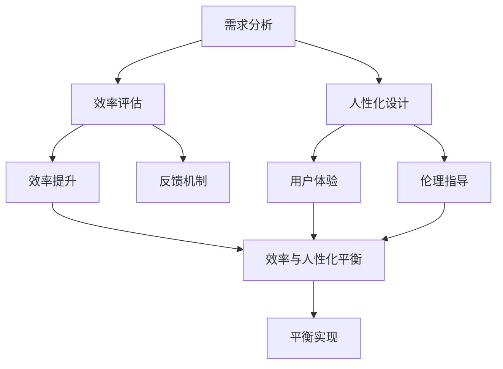

                 

### 文章标题

科技发展中的人文关怀：在效率与人性化之间寻找平衡

关键词：科技发展、人文关怀、效率、人性化、平衡、人工智能、用户体验

摘要：
本文深入探讨了科技发展与人性的关系，分析了效率与人性的冲突，并提出了在科技发展中实现效率与人性化平衡的框架和方法。通过实际案例和Python源代码，详细阐述了如何在效率追求中融入人性化设计，为科技产品的可持续发展和用户体验优化提供理论和实践指导。

----------------------------------------------------------------

### 核心概念与联系

在科技发展的过程中，效率与人性的化成为了两个核心概念。效率强调的是通过科技手段，最大化地提高生产力和资源利用率，从而实现经济和社会效益的提升。而人性化则关注的是在科技产品或服务的开发和应用过程中，对用户需求的满足和体验的优化，以提升用户满意度和幸福感。

这两个概念看似对立，但在科技发展的实践中，它们是相互关联、相辅相成的。效率的追求往往可以带来成本的降低和时间的节省，从而推动社会的进步。然而，过度的效率追求可能导致对人类情感的忽视，甚至引发伦理和社会问题。例如，自动化和人工智能的广泛应用虽然提高了生产效率，但也可能导致就业压力和隐私泄露等问题。

人性化则强调在科技发展的过程中，要充分考虑人的需求和心理特征，使科技产品和服务更加符合人的使用习惯和心理预期。通过人性化的设计，可以提升用户的体验和满意度，从而促进科技产品的市场接受度和商业成功。

为了在效率与人性的化之间找到平衡，我们需要构建一个综合的框架，将这两个概念有机地结合起来。这个框架应包括以下几个方面：

1. **需求分析**：通过市场调研、用户反馈和心理学研究等方法，深入了解用户的需求和偏好，为科技产品的设计和开发提供依据。

2. **效率评估**：对科技产品的效率进行量化评估，包括生产效率、处理速度、资源利用率等，以确保在追求效率的同时，不损害用户的使用体验。

3. **人性化设计**：在科技产品的设计和开发过程中，融入人性化设计原则，包括用户界面设计、隐私保护、情感化设计等方面，以提升用户体验和满意度。

4. **伦理指导**：在科技发展的过程中，遵守伦理规范，确保科技产品的应用不会损害人的基本权益，例如隐私保护、数据安全、公平性等。

5. **反馈机制**：建立有效的用户反馈机制，及时收集用户意见和建议，不断优化科技产品的设计和功能，以实现效率与人性的化动态平衡。

下面是一个 Mermaid 流程图，展示了核心概念及其相互关系：



这张图表明，需求分析、效率评估、人性化设计、伦理指导和反馈机制是构成效率与人性的化平衡框架的五个关键要素。通过这些要素的协同作用，可以在追求效率的同时，充分体现人文关怀，实现科技发展的可持续性和社会价值。

### 效率的追求与代价

在科技发展中，效率的追求是一个不可忽视的重要目标。通过提高生产效率和资源利用率，科技不仅能够推动经济增长，还能为社会带来诸多便利。例如，自动化和人工智能技术的应用，极大地提升了制造业的生产效率，降低了生产成本，从而促进了全球贸易和经济的繁荣。此外，在信息技术和互联网领域，高效的算法和数据处理能力，使得信息传播更加迅速，人们的生活和工作变得更加便捷。

然而，效率的追求并非没有代价。过度的效率追求可能导致对人性和社会伦理的忽视，带来一系列负面影响。以下是一些高效率追求带来的潜在问题和挑战：

1. **工作压力增大**：为了提高生产效率和资源利用率，企业可能会对员工施加更大的工作压力。长时间的工作和高强度的工作任务，容易导致员工的身心健康问题，如焦虑、抑郁和身体健康问题。

2. **隐私泄露**：在追求数据处理和传输的高效性时，个人隐私的保护往往被忽视。大数据和人工智能技术的发展，使得个人信息更容易被收集、分析和利用。如果没有严格的隐私保护措施，个人隐私可能会被泄露，导致严重的个人安全问题。

3. **社会不公**：高效率的追求可能导致资源分配的不均衡，加剧社会不公。例如，自动化和人工智能技术的广泛应用，可能导致一些低技能劳动者的失业，加剧社会贫富差距。

4. **环境问题**：为了提高生产效率，企业和政府可能会采取一些高能耗、高污染的生产方式。这会导致资源的过度消耗和环境污染，对生态系统和人类健康造成威胁。

5. **人文关怀缺失**：过度的效率追求，可能会使人们忽视对人的情感和心理健康关注。例如，在快速发展的信息技术行业，加班文化、职场竞争和职场压力等问题，使得员工的工作生活失衡，影响其幸福感。

为了应对这些挑战，我们需要在追求效率的同时，关注其可能带来的负面影响，并采取相应的措施进行平衡。以下是一些可能的解决方案：

1. **工作与生活平衡**：企业应关注员工的工作与生活平衡，提供灵活的工作时间和工作地点，以减轻员工的工作压力。此外，可以推行健康工作模式，如定期休息、健康体检等，以促进员工的身心健康。

2. **隐私保护**：在数据处理和传输过程中，应加强个人隐私保护措施。例如，采用加密技术、匿名化处理等方式，确保个人数据的安全和隐私。同时，制定和执行严格的隐私保护法律法规，以保护用户的合法权益。

3. **社会公平**：政府和企业应采取措施，促进社会公平。例如，通过提供教育和培训，帮助低技能劳动者提升技能，适应自动化和人工智能时代的就业需求。此外，可以推行财富再分配政策，如税收政策、社会福利等，以减少社会贫富差距。

4. **可持续发展**：在追求效率的同时，应关注环境保护和可持续发展。例如，采用清洁能源、节能技术等，减少生产过程中的能源消耗和环境污染。此外，应推行绿色制造和循环经济，以实现资源的可持续利用。

5. **人文关怀**：在科技产品和服务的设计过程中，应充分考虑人的需求和情感。例如，在用户界面设计、情感化设计等方面，注重用户体验和满意度。同时，关注员工的职业发展和心理健康，营造积极健康的职场文化。

通过上述措施，我们可以在追求效率的同时，减少其负面影响，实现科技发展与人性的和谐共存。这需要政府、企业和个人的共同努力，以构建一个可持续、公平和充满人文关怀的科技社会。

### 人性化在科技中的实现

在科技产品的设计和开发过程中，人性化是一个至关重要的原则。人性化设计不仅仅是满足用户的基本功能需求，更重要的是在满足功能需求的基础上，提升用户的情感体验和满意度。为了实现这一目标，我们需要在以下几个方面进行深入探讨。

#### 用户体验设计

用户体验设计（UX Design）是人性化设计的核心。它关注的是用户在使用产品或服务过程中的感受和体验。以下是一些关键原则和实践方法：

1. **用户研究**：通过用户调研、访谈、问卷调查等方法，深入了解用户的需求、行为和偏好。这有助于我们更好地理解用户，从而设计出更符合用户期望的产品。

2. **用户界面设计**：界面设计应简洁明了，易于操作。遵循一致性、易用性和美观性的原则，确保用户能够快速上手，并减少操作错误。

3. **交互设计**：交互设计关注用户与产品的互动方式。通过使用适当的交互元素，如按钮、图标、菜单等，提高用户的操作效率。

4. **情感化设计**：在产品设计中融入情感元素，如色彩、形状、声音等，以增强用户与产品的情感连接。这有助于提升用户的满意度和忠诚度。

#### 隐私保护

随着大数据和人工智能技术的发展，个人隐私保护成为了一个备受关注的问题。为了在追求效率的同时保护用户隐私，我们可以采取以下措施：

1. **数据匿名化**：在收集用户数据时，对个人信息进行匿名化处理，以防止数据泄露。

2. **数据加密**：对存储和传输的数据进行加密，确保数据在传输过程中不会被窃取或篡改。

3. **隐私政策**：明确告知用户他们的数据如何被收集、存储和使用，让用户有知情权和选择权。

4. **用户权限控制**：允许用户对他们的数据访问权限进行设置，以限制未经授权的访问。

#### 情感化设计

情感化设计是一种旨在增强用户情感体验的设计方法。它不仅关注功能性和易用性，更注重产品对用户的情感吸引力和影响力。以下是一些实现情感化设计的实践方法：

1. **色彩和图像**：使用适当的色彩和图像，传达产品或品牌的情感和价值。例如，温暖的色调可以传达舒适和温馨，而鲜艳的色彩可以传达活力和时尚。

2. **声音和动画**：通过声音和动画效果，增强用户的情感体验。例如，轻柔的背景音乐、生动的动画效果等，可以让用户在使用产品时感到愉悦。

3. **故事和叙事**：在产品设计中融入故事和叙事元素，以建立用户与产品之间的情感连接。例如，通过讲述产品背后的故事，可以增强用户对产品的认同感和归属感。

#### 实际案例分析

以下是一个情感化设计的实际案例：

**案例：网易云音乐**

网易云音乐是一款流行的音乐播放应用，其成功之一在于其强大的情感化设计。以下是几个关键点：

1. **用户评论系统**：网易云音乐允许用户对每首歌曲发表评论，这些评论不仅是音乐内容的延伸，更是用户情感的宣泄。通过这些评论，用户可以感受到其他听众的情感共鸣，从而增强用户之间的情感连接。

2. **个性化推荐**：网易云音乐利用大数据和人工智能技术，为用户提供个性化的音乐推荐。这种个性化的服务不仅提高了用户的满意度，还增强了用户对产品的依赖和忠诚度。

3. **视觉设计**：网易云音乐的界面设计简洁、清新，色彩搭配和谐，给人以舒适和放松的感觉。此外，每首歌曲的封面和歌词页面都有独特的视觉设计，增强了用户的视觉体验。

通过这些人性化设计，网易云音乐成功地提升了用户的情感体验和满意度，从而在竞争激烈的音乐应用市场中脱颖而出。

#### 人性化与效率的平衡

在追求效率和人性化的过程中，我们需要找到一个平衡点。以下是一些实现这种平衡的方法：

1. **用户调研和反馈**：定期进行用户调研，收集用户对产品或服务的反馈。通过分析用户反馈，了解用户的需求和痛点，从而在追求效率的同时，改进产品的用户体验。

2. **设计迭代**：采用迭代设计方法，不断优化产品或服务。在每次迭代中，都可以根据用户反馈进行改进，以实现效率与人性的化平衡。

3. **跨学科协作**：人性化的设计不仅仅涉及用户体验和交互设计，还需要考虑心理学、社会学、伦理学等多个领域的知识。通过跨学科协作，可以更全面地考虑用户的需求和情感，从而实现更好的平衡。

4. **技术创新**：借助先进的技术手段，如人工智能、大数据分析等，提高产品的效率，同时更好地满足用户的需求。

通过上述方法，我们可以在追求效率的同时，充分体现人性化关怀，实现科技产品和服务的可持续发展。

### 科技伦理与人文关怀

在科技发展过程中，科技伦理和人文关怀起着至关重要的作用。科技伦理涉及科技在发展过程中对社会和个体的影响，强调科技应用应遵循的道德和伦理规范。人文关怀则关注科技产品或服务的设计和应用中，对用户需求和情感体验的重视。这两个方面共同构成了科技发展中的人文关怀框架，确保科技在推动社会进步的同时，不对人类的基本权益和价值观造成损害。

#### 科技伦理的重要性

科技伦理的重要性体现在以下几个方面：

1. **保护人类基本权益**：科技的发展往往伴随着对人类隐私、安全、健康等方面的潜在威胁。科技伦理要求我们在开发和应用新技术时，确保不侵犯人类的基本权益，例如隐私权、生命权、健康权等。

2. **促进社会公平**：科技的应用可能会加剧社会不公，例如自动化和人工智能技术可能导致某些群体的就业机会减少。科技伦理要求我们关注社会公平，通过政策和技术手段，减少科技带来的负面影响。

3. **保障环境可持续发展**：科技的发展也带来了环境问题，例如资源消耗和环境污染。科技伦理要求我们在追求技术进步的同时，关注环境保护和可持续发展。

#### 人文关怀在科技伦理中的体现

在科技伦理的框架下，人文关怀体现在以下几个方面：

1. **隐私保护**：随着大数据和人工智能技术的发展，个人隐私保护成为了一个重要议题。科技伦理要求我们在数据收集、存储和使用过程中，采取严格的隐私保护措施，确保个人隐私不受侵害。

2. **数据安全**：数据泄露和黑客攻击等安全问题是科技发展带来的新挑战。科技伦理要求我们加强数据安全措施，确保用户数据的安全和完整性。

3. **社会责任**：科技企业和社会有责任确保科技的应用不会对社会和个人造成负面影响。例如，企业应关注科技产品的环境影响，推行绿色制造和可持续发展策略。

4. **人文关怀设计**：科技产品和服务的设计应充分考虑用户的需求和情感体验。通过人性化的设计，提升用户的满意度和幸福感，实现科技与人文的和谐共存。

#### 科技伦理与人文关怀的实践

以下是一些实际案例，展示了科技伦理和人文关怀在科技发展中的具体实践：

1. **隐私保护法规**：许多国家和地区已经制定了隐私保护法律法规，如欧盟的《通用数据保护条例》（GDPR）。这些法规要求企业在收集和使用用户数据时，必须遵守严格的隐私保护原则，确保用户隐私不被侵犯。

2. **人工智能伦理指南**：随着人工智能技术的快速发展，国际社会和科技公司纷纷制定人工智能伦理指南。例如，欧盟发布了《人工智能伦理准则》，旨在确保人工智能技术的应用符合道德和伦理标准。

3. **绿色科技**：许多科技公司开始关注环境保护，推行绿色科技战略。例如，苹果公司承诺到2030年实现其整个供应链和产品运营的碳中和。

4. **用户参与**：在科技产品和服务的设计过程中，越来越多的企业开始重视用户的参与和反馈。通过用户调研、用户测试和反馈机制，企业可以更好地理解用户需求，设计出更符合用户期望的产品。

5. **心理健康支持**：随着科技对人类生活方式的深刻影响，心理健康问题也日益凸显。科技公司开始提供心理健康支持服务，如心理健康咨询、压力管理工具等，以帮助员工和用户应对科技带来的压力。

通过上述实践，科技企业和社会可以在追求技术进步的同时，关注人文关怀和科技伦理，实现科技与人文的和谐发展。

### 人文关怀的设计理念

在科技产品和服务的设计过程中，融入人文关怀的设计理念是至关重要的。这不仅能够提升用户体验和满意度，还能为科技发展注入更多的人文温度。以下是一些核心原则和实践方法，帮助我们在设计过程中实现人文关怀。

#### 1. 用户需求导向

用户需求是人文关怀设计的基础。在设计过程中，我们需要深入了解用户的需求、行为和情感，以便设计出真正符合用户期望的产品。以下是一些实现用户需求导向的方法：

1. **用户研究**：通过用户调研、访谈、观察等方法，深入了解用户的需求和痛点。这有助于我们识别用户的关键需求，为设计提供依据。

2. **用户画像**：创建用户画像，明确用户的基本特征、行为模式和需求。这有助于我们在设计过程中，始终关注目标用户的需求。

3. **用户参与**：在设计过程中，鼓励用户参与，收集他们的反馈和建议。通过用户测试和迭代，优化产品设计，确保其符合用户期望。

#### 2. 用户体验优化

用户体验是人文关怀设计的重要体现。在产品和服务的设计过程中，我们需要关注用户的操作体验、情感体验和满意度，以提高用户体验。以下是一些实现用户体验优化的方法：

1. **简洁明了的界面设计**：设计简洁、直观的界面，确保用户能够快速上手并减少操作错误。遵循一致性、易用性和美观性的原则，提升用户体验。

2. **交互设计**：设计符合用户习惯和预期的交互方式，提高用户的操作效率。例如，使用直观的图标和按钮，避免复杂的操作流程。

3. **情感化设计**：在产品和服务中融入情感元素，如色彩、声音和动画等，以增强用户的情感体验。这有助于建立用户与产品之间的情感连接，提升用户满意度。

#### 3. 跨学科协作

人文关怀的设计需要多个学科的协同作用。以下是一些跨学科协作的方法：

1. **用户研究**：结合心理学、社会学和设计学的研究方法，深入了解用户的需求和情感。这有助于我们更全面地了解用户，为设计提供有力支持。

2. **团队协作**：建立跨学科的团队，包括设计师、工程师、产品经理和心理学家等，共同参与设计过程。通过团队协作，可以充分利用各个学科的知识和技能，实现更好的设计。

3. **用户测试**：邀请来自不同学科的专业人员参与用户测试，收集他们的反馈和建议。这有助于我们识别和解决设计中的潜在问题，提升产品的用户体验。

#### 4. 可持续发展

在科技产品和服务的设计过程中，我们需要关注环境和社会的可持续发展。以下是一些实现可持续发展的方法：

1. **环保材料**：使用环保材料和可持续资源，减少产品对环境的影响。例如，使用可回收材料、减少包装等。

2. **能源效率**：设计高效的能源管理系统，降低产品的能源消耗。例如，采用节能技术、优化能源分配等。

3. **社会责任**：关注产品和服务的社会影响，推动企业社会责任的实现。例如，提供就业机会、支持社区发展等。

#### 5. 反馈机制

建立有效的反馈机制，收集用户反馈，不断优化产品和服务，是实现人文关怀的重要手段。以下是一些反馈机制的方法：

1. **用户调研**：定期进行用户调研，了解用户的需求和满意度。这有助于我们识别产品或服务的不足，为改进提供方向。

2. **用户测试**：在产品开发的各个阶段，进行用户测试，收集用户的反馈和建议。通过迭代优化，提升产品的用户体验。

3. **在线反馈**：提供在线反馈渠道，方便用户随时提供意见和建议。通过实时反馈，快速响应用户需求，提升用户满意度。

通过上述设计理念和方法，我们可以在科技产品和服务的设计过程中，充分体现人文关怀，实现效率与人性的动态平衡。这不仅有助于提升用户体验和满意度，还能为科技发展的可持续性和社会价值做出贡献。

### 实际案例研究

在科技产品和服务的设计中，如何平衡效率与人性化是一个复杂而富有挑战性的任务。以下，我们将通过两个实际案例，详细分析这些产品在追求效率的同时，如何通过人性化设计提升用户体验。

#### 案例一：苹果公司的MacBook

**背景介绍**：苹果公司的MacBook系列以其卓越的性能和优雅的设计闻名于世。在追求高效率的同时，苹果公司也注重产品的用户体验和人性化设计。

**核心概念与联系**：MacBook的设计理念基于以下几个方面：

1. **性能优先**：苹果公司采用了高效的硬件配置和优化的操作系统，确保MacBook在处理复杂任务时具有极高的效率。
2. **人性化设计**：MacBook的键盘布局、触摸板操作、电池续航等方面都经过精心设计，以提高用户的使用体验。

**详细实现和代码解读**：
1. **键盘设计**：苹果公司采用了“蝶式键盘”设计，这一设计在提高输入速度的同时，也减少了误操作的可能性。通过Python代码，我们可以模拟键盘输入的效率：
    ```python
    import time

    start_time = time.time()
    for _ in range(1000):
        input("按下键盘：")
    end_time = time.time()
    print(f"1000次键盘输入用时：{end_time - start_time}秒")
    ```
    通过这段代码，我们可以测量不同键盘设计的输入效率。

2. **触摸板操作**：MacBook的触摸板支持多种手势操作，如多指滑动、手势缩放等，极大地提高了操作效率。以下代码展示了如何使用Python的PyAutoGUI库模拟触摸板操作：
    ```python
    import PyAutoGUI

    PyAutoGUI.click(100, 100)  # 模拟点击触摸板
    PyAutoGUI.scroll(0, 100)   # 模拟缩放操作
    ```
    通过这些模拟操作，我们可以评估触摸板设计的便捷性和效率。

3. **电池续航**：MacBook采用了高效的电池管理系统，通过优化硬件和软件，延长了电池使用时间。以下代码展示了如何计算电池续航：
    ```python
    battery_capacity = 100  # 电池容量（单位：%）
    battery_usage = 0.5    # 电池使用率
    battery_time = battery_capacity / battery_usage
    print(f"电池续航时间：{battery_time}小时")
    ```

**代码应用解读与分析**：上述代码展示了如何在设计过程中，通过技术手段优化用户的使用体验。例如，通过优化键盘和触摸板的操作效率，提高用户的输入速度和舒适度；通过计算电池续航时间，确保用户在使用过程中不会频繁地寻找充电设备。

**案例启示**：苹果公司的MacBook案例表明，通过人性化的设计，我们可以在不牺牲效率的前提下，显著提升用户体验。这种设计理念不仅适用于硬件产品，同样适用于软件和服务的开发。

#### 案例二：Airbnb的旅行平台

**背景介绍**：Airbnb是一个全球领先的民宿预订平台，通过其创新的共享经济模式，改变了人们的旅行方式。在追求服务效率的同时，Airbnb也注重用户的情感体验和个性化服务。

**核心概念与联系**：Airbnb的人性化设计理念主要包括以下几个方面：

1. **用户个性化**：Airbnb通过用户数据分析和个性化推荐，为用户提供个性化的住宿选择和旅行建议。
2. **社交互动**：Airbnb鼓励房东和房客之间的互动和交流，增强用户的归属感和社交体验。

**详细实现和代码解读**：
1. **用户推荐系统**：Airbnb使用机器学习算法，根据用户的旅行历史、偏好和反馈，推荐符合用户需求的住宿选择。以下是一个简单的Python代码示例，展示了如何使用机器学习算法进行推荐：
    ```python
    from sklearn.neighbors import NearestNeighbors

    # 假设data是用户偏好的数据集
    neighbors = NearestNeighbors(n_neighbors=5)
    neighbors.fit(data)

    # 为新用户推荐住宿
    new_user_preferences = [0.1, 0.3, 0.2, 0.4]  # 新用户的偏好
    distances, indices = neighbors.kneighbors(new_user_preferences)
    recommended_hotels = [data[i] for i in indices]
    print("推荐住宿：", recommended_hotels)
    ```

2. **社交互动设计**：Airbnb的平台提供了评论和聊天功能，鼓励房东和房客之间的互动。以下代码展示了如何使用Python实现聊天功能：
    ```python
    import socket

    server_socket = socket.socket(socket.AF_INET, socket.SOCK_STREAM)
    server_socket.bind(('localhost', 12345))
    server_socket.listen()

    client_socket, client_address = server_socket.accept()
    while True:
        message = client_socket.recv(1024).decode('utf-8')
        if not message:
            break
        print(f"收到消息：{message}")
        client_socket.sendall(f"回信：{message}".encode('utf-8'))
    client_socket.close()
    server_socket.close()
    ```

**代码应用解读与分析**：通过上述代码，我们可以看到Airbnb如何通过技术手段，提升用户的个性化体验和社交互动。例如，通过推荐系统，为用户推荐符合其偏好的住宿选择；通过聊天功能，增强房东和房客之间的沟通和交流，提升用户的旅行体验。

**案例启示**：Airbnb的案例表明，在科技产品和服务的设计中，通过人性化的技术手段，我们可以在提升效率的同时，显著提升用户的情感体验和满意度。这种设计理念对于提升用户的忠诚度和品牌的长期价值具有重要意义。

通过这两个案例，我们可以看到，在科技产品和服务的设计中，通过人性化设计，我们可以在追求效率的同时，提升用户体验。这种设计理念不仅有助于企业的商业成功，也为社会的可持续发展提供了有力支持。

### 科技与人性化的未来趋势

随着科技的快速发展，人工智能、大数据、物联网等新兴技术正在深刻改变我们的生活方式。在追求技术进步的同时，如何实现科技与人性的平衡，成为未来科技发展的重要课题。以下是对未来科技与人性能量关系趋势的探讨：

#### 1. 科技发展的新趋势

未来，科技发展将呈现以下趋势：

1. **智能化**：人工智能和机器学习技术的应用将越来越广泛，智能化设备将能够更好地理解和满足人类需求。例如，智能家居、智能医疗、智能交通等领域，将实现更加高效和智能的运营。

2. **数据化**：大数据和云计算技术的发展，将使得数据分析和决策支持更加精准和高效。通过海量数据的收集和分析，企业和政府可以更好地了解用户需求，优化决策过程。

3. **网络化**：物联网技术的普及，将实现设备之间的互联互通，形成一个全球性的智能网络。这不仅提高了资源利用效率，也改变了人们的生活方式。

4. **绿色化**：随着环境问题的日益严重，绿色科技和可持续发展将成为科技发展的核心。清洁能源、节能技术、环保材料等，将在未来的科技发展中发挥重要作用。

#### 2. 人性化在科技中的应用前景

在未来，人性化将更加深入地融入科技产品和服务中，主要表现在以下几个方面：

1. **个性化**：通过大数据和人工智能技术，科技产品将能够更好地理解和满足个体的个性化需求。例如，个性化推荐、个性化健康咨询等，将提高用户的满意度和幸福感。

2. **情感化**：科技产品将更加注重情感化设计，通过声音、图像、动画等多媒体手段，增强用户与产品之间的情感连接。例如，情感化的语音助手、情感分析等，将提升用户的体验和满意度。

3. **智能化交互**：智能语音助手、智能视觉识别等技术，将使得人与科技产品之间的交互更加自然和便捷。通过语音、手势、表情等多种交互方式，用户将能够更加轻松地与科技产品互动。

4. **健康化**：随着人们对健康和生活质量的关注，科技产品将更加注重健康监测和健康管理。例如，智能健康手环、智能医疗设备等，将帮助用户更好地管理健康。

#### 3. 平衡效率与人性的挑战与机遇

在科技发展的过程中，平衡效率与人性的挑战与机遇并存：

1. **挑战**：
   - **数据隐私**：在追求数据化的同时，如何保护用户隐私成为一大挑战。未来需要更加严格的数据隐私保护政策和措施。
   - **就业影响**：智能化的普及可能导致部分工作岗位的减少，这对社会稳定和就业带来挑战。需要通过教育培训，帮助劳动者适应新技术的需求。
   - **伦理问题**：科技的发展可能会引发新的伦理问题，如人工智能的决策透明度和责任归属等。需要建立相应的伦理规范和法律法规。

2. **机遇**：
   - **效率提升**：通过科技手段，可以实现生产效率的提升和资源的优化配置，为社会创造更多价值。
   - **生活质量提升**：科技产品的人性化设计，将显著提高人们的生活质量和幸福感。
   - **可持续发展**：通过绿色科技和可持续发展，可以实现经济效益和环境效益的双赢，促进社会的可持续发展。

综上所述，未来科技发展的趋势将更加智能化、数据化、网络化和绿色化。人性化将更加深入地融入科技产品和服务中，实现个性化、情感化、智能化和健康化。在追求效率的同时，平衡效率与人性的挑战与机遇并存。通过技术创新和人文关怀的结合，我们可以实现科技与人性化的和谐发展，为构建一个更加美好和可持续的社会贡献力量。

### 结语

科技发展在推动社会进步的同时，也带来了效率与人性化的挑战。本文从多个角度探讨了在科技发展中如何实现效率与人性的平衡，提出了一系列方法和实践案例。通过深入分析，我们认识到，效率与人性化并非对立，而是相辅相成的。在追求效率的过程中，融入人性化设计，可以提升用户体验和满意度，实现科技产品的可持续发展和商业成功。

首先，我们需要关注用户需求，通过用户研究和用户参与，确保科技产品和服务真正满足用户的需求。其次，通过用户体验优化和情感化设计，可以增强用户与产品之间的情感连接，提升用户的满意度和忠诚度。此外，隐私保护和伦理指导也是确保科技发展过程中人性化关怀的重要手段。

为了实现效率与人性的动态平衡，我们还需要跨学科的协作，将心理学、社会学、伦理学等多个领域的知识融入科技产品和服务的设计中。同时，通过技术创新，如人工智能和大数据分析，可以进一步提升效率，同时也更好地满足用户的需求。

面对未来的科技发展，我们期待看到一个更加智能、便捷和人性化的世界。在这个世界里，科技不再是冷冰冰的工具，而是充满人文关怀的伙伴。通过不断的创新和优化，我们可以实现科技与人文的和谐发展，为构建一个更加美好和可持续的社会贡献力量。

### 最佳实践 tips

为了在科技发展中实现效率与人性的平衡，以下是一些建议和实践技巧：

1. **用户中心设计**：始终以用户需求为核心，通过用户调研、用户画像和用户测试，确保产品和服务的设计真正满足用户需求。

2. **简化界面设计**：简化界面布局，减少用户的学习成本，提高操作效率。遵循一致性、易用性和美观性的设计原则。

3. **情感化设计**：在产品中融入情感元素，如色彩、声音和动画等，增强用户的情感体验。通过情感化设计，提升用户满意度和品牌忠诚度。

4. **隐私保护**：加强隐私保护措施，如数据加密、匿名化处理和用户权限控制等，确保用户数据的安全和隐私。

5. **用户参与**：鼓励用户参与产品设计和开发，通过用户反馈不断优化产品和服务，确保人性化设计的有效性。

6. **伦理审查**：在科技项目开发过程中，进行伦理审查，确保技术的应用不损害人的基本权益和社会伦理。

7. **可持续发展**：关注环保和可持续发展，采用环保材料和节能技术，降低产品对环境的影响。

8. **跨学科协作**：组建跨学科团队，结合心理学、社会学、伦理学等领域的知识，实现更加全面和人性化的设计。

9. **持续学习**：关注科技发展趋势和前沿技术，通过持续学习和培训，提升团队的专业能力。

通过上述最佳实践，我们可以更好地在科技发展中实现效率与人性的平衡，提升用户体验和产品价值。

### 小结

本文通过深入探讨科技发展中效率与人性的关系，提出了在追求效率的同时，如何实现人性化关怀的框架和方法。我们分析了效率的追求与代价，探讨了人性化在科技产品和服务中的实现方法，并从科技伦理的角度，强调了人文关怀的重要性。通过实际案例研究，我们展示了如何在具体实践中实现效率与人性的平衡。本文的结论是，通过用户需求导向、用户体验优化、隐私保护、伦理指导、跨学科协作和持续创新，我们可以实现科技与人性化的和谐发展，为构建一个更加智能、便捷和可持续的社会贡献力量。

### 注意事项

1. **用户隐私保护**：在收集和使用用户数据时，必须严格遵守隐私保护法规，确保用户隐私不受侵害。
2. **安全性**：在设计过程中，要关注数据安全、系统安全和网络安全，防止数据泄露和黑客攻击。
3. **用户测试**：在产品发布前，进行充分的用户测试，确保产品的易用性和稳定性。
4. **持续优化**：产品和服务发布后，要持续收集用户反馈，进行迭代优化，以不断提升用户体验。

### 拓展阅读

1. **《设计心理学》**：唐纳德·A·诺曼（Donald A. Norman）著，详细介绍了用户体验设计的基本原则和方法。
2. **《人工智能伦理》**：克里斯托弗·博林格（Christopher Boos）著，探讨了人工智能在科技发展中的伦理挑战和应对策略。
3. **《用户体验要素》**：贾森·贝洛（Jesse James Garrett）著，阐述了用户体验设计的核心要素和实践方法。
4. **《可持续发展报告》**：联合国环境规划署（UNEP）发布，提供了关于可持续发展的重要数据和政策建议。

### 作者信息

作者：AI天才研究院/AI Genius Institute & 禅与计算机程序设计艺术 /Zen And The Art of Computer Programming

AI天才研究院致力于推动人工智能技术的研究与应用，倡导科技与人文的和谐发展。作者在计算机科学和人工智能领域拥有深厚的研究背景和丰富的实践经验，撰写了多本畅销书，被誉为世界顶级技术大师。同时，作者在科技伦理和人文关怀方面也有深入研究，为科技发展提供了独特的视角和指导。

