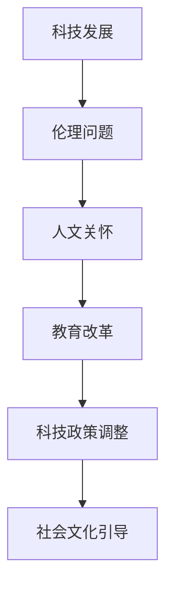

                 

### 《科技至上时代的人文关怀重建》

#### 关键词：
科技至上、人文关怀、伦理问题、教育改革、社会文化引导

> 摘要：本文旨在探讨科技至上时代下人文关怀重建的必要性和路径。通过分析科技发展对人类生活的深远影响，本文提出了人文关怀的重要性，并探讨了如何在科技与人文之间实现平衡。文章结合理论与实践，分析了科技时代的人文关怀实践，探讨了科技伦理问题，并提出了重建人文关怀的路径和策略。

---

## 第一部分：背景与现状

### 1.1 科技至上的挑战

#### 1.1.1 科技发展的速度与人文关怀的滞后

科技的发展日新月异，人工智能、大数据、生物技术等领域不断突破，为社会进步提供了强大的动力。然而，在科技迅猛发展的同时，人文关怀似乎逐渐被忽视。人文关怀强调人的尊严、价值和意义，而科技的快速发展往往更注重效率、效益和生产力。这种倾向使得科技与人文之间产生了明显的张力。

**逻辑推理：** 科技的快速发展确实在多个领域取得了重大突破，但同时也带来了一系列挑战。例如，人工智能的广泛应用虽然提高了生产效率，但可能导致失业问题；大数据的分析虽然有助于决策，但可能侵犯个人隐私。这些问题需要从人文关怀的角度进行审视和解决。

#### 1.1.2 科技对人类生活的影响

科技对人类生活的影响是深远且多方面的。它改变了我们的生活方式、工作方式，甚至价值观。例如，互联网的普及使得信息获取更加便捷，但也导致了信息过载和社交媒体成瘾。生物技术的发展为我们提供了治愈疾病的新手段，但同时也引发了伦理问题，如基因编辑和克隆技术的争议。

**逻辑推理：** 科技的发展对人类生活产生了巨大的影响，这些影响既有积极的也有消极的。因此，在追求科技进步的同时，我们需要关注其对人类生活的影响，尤其是对人类价值和尊严的影响。这需要我们重新思考科技与人文之间的关系。

### 1.2 人文关怀的重要性

#### 1.2.1 人文关怀的定义与内涵

人文关怀是指关注人的精神世界、情感需求和道德价值观，强调人的尊严和价值。它不仅包括对个体的关注，还涉及对社会的责任和贡献。人文关怀的内涵丰富，包括伦理道德、社会公正、心理健康等方面。

**逻辑推理：** 人文关怀的重要性在于它为我们提供了一种价值观的指导，使我们能够平衡科技发展带来的挑战和影响。例如，在处理科技伦理问题时，我们需要从人文关怀的角度出发，确保科技的应用不会损害人类的尊严和价值。

#### 1.2.2 人文关怀在科技时代的作用

在科技时代，人文关怀的作用尤为重要。它有助于我们应对科技发展带来的伦理挑战，如数据隐私、人工智能的决策伦理等。同时，人文关怀还能够促进科技与人文的融合，使科技的发展更加符合人类的价值观和需求。

**逻辑推理：** 科技与人文的融合是未来发展的必然趋势。人文关怀为科技提供了伦理和道德的指导，使科技的发展更加人性化。例如，在开发人工智能系统时，我们需要考虑其对人类生活的影响，并确保其符合伦理标准。

### 1.3 科技与人文的融合

#### 1.3.1 科技人文主义的理论基础

科技人文主义强调科技与人文的融合，认为科技的发展应服务于人类的福祉。这一理论的基础在于对科技与人文关系的深刻理解，认为两者不是对立的，而是相互依存、相互促进的。

**逻辑推理：** 科技人文主义的理论基础为我们提供了重新审视科技与人文关系的视角。它提醒我们，科技的发展不应以牺牲人文关怀为代价，而应以人为本，服务于人类的发展和幸福。

#### 1.3.2 科技与人文融合的实践案例

在现实世界中，科技与人文的融合已经取得了许多成功案例。例如，在教育领域，科技的应用使得教育更加个性化、灵活，同时也更加关注学生的心理健康和道德教育。在医疗领域，人工智能的应用提高了诊断和治疗效率，但同时也注重患者的心理关怀和伦理问题。

**逻辑推理：** 这些实践案例表明，科技与人文的融合是可行的，并且具有重要的现实意义。通过这些案例，我们可以看到，科技的发展不仅可以提高效率，还可以带来更加全面和人性化的服务。

## 第二部分：人文关怀的理论与实践

### 2.1 人文关怀的理论基础

#### 2.1.1 人本主义心理学

人本主义心理学强调人的自我实现和自由意志，认为人是有意识、有目的的个体。人本主义心理学为人文关怀提供了重要的理论支持，帮助我们理解人的需求和价值观。

**逻辑推理：** 人本主义心理学的理念与人文关怀的核心价值观高度契合，都强调人的尊严和自我实现。这为我们提供了理论依据，使我们能够更好地实践人文关怀。

#### 2.1.2 社会建构主义

社会建构主义认为知识是通过社会互动和共同理解构建的，强调社会和文化因素在知识形成中的作用。社会建构主义为人文关怀提供了另一个重要理论基础，使我们能够从社会和文化的角度理解人的需求和价值观。

**逻辑推理：** 社会建构主义的观点有助于我们认识到，人文关怀不仅是个体层面的，还是社会和文化的。这使我们能够更加全面地理解人文关怀的内涵和重要性。

#### 2.1.3 生态学视角

生态学视角将人类视为生态系统的一部分，强调人与自然和谐共生。生态学视角为人文关怀提供了新的视角，使我们能够从更广阔的视野审视人类的角色和责任。

**逻辑推理：** 生态学视角提醒我们，人文关怀不应局限于人类个体，还应关注人类与自然的关系。这有助于我们更好地理解人文关怀的生态意义。

### 2.2 科技时代的人文关怀实践

#### 2.2.1 教育领域的人文关怀

在教育领域，人文关怀体现在对学生全面发展的关注，不仅注重知识的传授，还注重学生的心理健康、道德教育和情感需求。例如，通过设置心理健康课程、开展团队合作活动等，培养学生的自我认知和人际关系能力。

**逻辑推理：** 教育是人文关怀的重要领域，通过教育实践，我们可以培养学生的道德素养和人文精神，使他们成为具有社会责任感的人才。

#### 2.2.2 医疗领域的人文关怀

在医疗领域，人文关怀体现在对患者的全方位关怀，包括生理、心理和情感需求。例如，通过建立医患沟通机制、提供心理支持服务等，帮助患者缓解病痛，提高生活质量。

**逻辑推理：** 医疗服务是人类生活中不可或缺的一部分，通过人文关怀的实践，我们可以提高医疗服务的质量，使患者得到更加人性化的治疗。

#### 2.2.3 社会工作领域的人文关怀

在社会工作领域，人文关怀体现在对弱势群体的关注和帮助，包括贫困人口、残疾人、老年人等。通过提供就业培训、生活救助等服务，帮助他们改善生活条件，提高社会地位。

**逻辑推理：** 社会工作是人文关怀的重要组成部分，通过社会工作领域的实践，我们可以推动社会公正，促进社会的和谐发展。

### 2.3 跨学科合作与人文关怀

#### 2.3.1 人文与科技的跨界研究

跨学科合作是人文关怀在科技时代的重要表现形式。通过人文与科技的跨界研究，我们可以探索科技与人文的融合路径，解决科技发展带来的伦理和社会问题。例如，通过人文学科的研究，我们可以为科技发展提供伦理指导，确保科技的应用符合人类的价值观。

**逻辑推理：** 跨学科合作有助于我们更好地理解科技与人文的关系，通过整合不同学科的知识，我们可以为科技发展提供更加全面和深入的指导。

#### 2.3.2 跨学科合作的方法与挑战

跨学科合作的方法包括跨学科团队、跨学科项目和研究方法论的创新等。然而，跨学科合作也面临着挑战，如不同学科之间的知识体系差异、沟通障碍等。为了克服这些挑战，我们需要培养跨学科思维，提高跨学科沟通能力，并建立有效的跨学科合作机制。

**逻辑推理：** 跨学科合作是实现人文关怀在科技时代的重要途径，通过克服跨学科合作的挑战，我们可以推动人文关怀与科技的融合，实现科技与人文的共赢。

## 第三部分：科技至上的伦理问题与人文关怀重建

### 3.1 科技伦理问题

#### 3.1.1 数据隐私与伦理

在科技时代，数据隐私成为了一个重要的伦理问题。大数据技术的应用使得个人数据被广泛收集、分析和利用，但这也带来了数据泄露和滥用的问题。为了保护个人隐私，我们需要制定严格的数据保护政策和法律法规。

**逻辑推理：** 数据隐私与伦理问题的核心在于平衡数据利用和个人隐私保护。通过制定合理的政策和法律法规，我们可以确保科技的发展不会侵犯个人隐私。

#### 3.1.2 人工智能的伦理问题

人工智能的发展带来了许多伦理问题，如算法歧视、决策透明度、责任归属等。为了解决这些问题，我们需要在人工智能的开发和应用过程中注重伦理问题，确保人工智能的发展符合人类的价值观。

**逻辑推理：** 人工智能的伦理问题需要从多个角度进行审视，包括技术层面、法律层面和社会层面。通过综合多方面的努力，我们可以确保人工智能的发展不会对人类造成负面影响。

#### 3.1.3 生物技术的伦理问题

生物技术的发展带来了许多新的伦理问题，如基因编辑、克隆技术等。这些技术虽然具有巨大的潜力，但同时也引发了一系列伦理争议。为了解决这些问题，我们需要在生物技术的研发和应用过程中注重伦理问题，确保科技的发展符合人类的价值观。

**逻辑推理：** 生物技术的伦理问题需要我们从伦理、法律和社会等多个层面进行深入探讨，通过多方面的努力，我们可以确保生物技术的发展不会对人类造成负面影响。

### 3.2 人文关怀的重建路径

#### 3.2.1 教育改革

教育改革是人文关怀重建的重要路径之一。通过教育改革，我们可以培养学生的道德素养和人文精神，提高他们的社会责任感。例如，通过加强人文学科教育、开展伦理道德课程等，我们可以培养学生的道德观念和伦理意识。

**逻辑推理：** 教育是人文关怀的重要载体，通过教育改革，我们可以培养具有人文精神和社会责任感的下一代，为人文关怀的重建奠定基础。

#### 3.2.2 科技政策调整

科技政策调整是人文关怀重建的重要手段。通过调整科技政策，我们可以引导科技的发展方向，使其更加符合人类的价值观和需求。例如，通过制定伦理审查制度、推动科技伦理研究等，我们可以确保科技的发展不会损害人类的利益。

**逻辑推理：** 科技政策调整有助于我们在科技发展的过程中关注人文关怀，通过合理的政策引导，我们可以实现科技与人文的平衡发展。

#### 3.2.3 社会文化引导

社会文化引导是人文关怀重建的重要途径。通过社会文化的引导，我们可以树立正确的价值观，推动社会的和谐发展。例如，通过宣传伦理道德、弘扬人文精神等，我们可以引导社会舆论，营造人文关怀的氛围。

**逻辑推理：** 社会文化引导有助于我们在社会层面推动人文关怀的重建，通过塑造正确的价值观和文化氛围，我们可以促进社会的和谐与进步。

### 3.3 人文关怀与科技发展的平衡

#### 3.3.1 科技与人文的平衡模型

为了实现人文关怀与科技发展的平衡，我们需要构建一个平衡模型。这个模型应包括以下要素：

1. **伦理审查制度**：确保科技的发展符合伦理标准。
2. **社会责任感**：鼓励科技企业关注社会影响，推动科技发展与社会责任相结合。
3. **人文学科教育**：加强人文学科教育，培养学生的道德素养和人文精神。
4. **跨学科合作**：通过跨学科合作，整合不同学科的知识，推动科技与人文的融合。

**逻辑推理：** 科技与人文的平衡模型有助于我们在科技发展的过程中关注人文关怀，通过多方面的努力，我们可以实现科技与人文的共赢。

#### 3.3.2 科技至上的伦理困境

在科技至上的时代，我们面临着一系列伦理困境。例如，为了追求科技创新，我们可能忽视了对环境的保护；为了追求经济效益，我们可能忽视了对个人隐私的尊重。这些困境需要我们从伦理的角度进行深刻反思。

**逻辑推理：** 科技至上的伦理困境提醒我们，科技的发展不应以牺牲人文关怀为代价。通过伦理反思和规范，我们可以实现科技与人文的平衡，确保科技的发展符合人类的价值观和需求。

## 第四部分：案例分析

### 4.1 成功案例

#### 4.1.1 人文关怀在科技企业中的应用

在科技企业中，人文关怀的应用取得了显著成效。例如，某些科技企业通过设立员工心理健康支持计划、提供灵活的工作安排等，提高了员工的工作满意度和工作效率。此外，一些企业还通过社会责任项目，积极参与社会公益活动，为社会做出贡献。

**逻辑推理：** 这些成功案例表明，人文关怀在科技企业中的应用不仅可以提高员工的工作效率，还可以提升企业的社会形象，实现企业价值的最大化。

#### 4.1.2 人文关怀在科技创新项目中的实践

在科技创新项目中，人文关怀同样发挥着重要作用。例如，在开发人工智能系统时，一些企业注重算法的伦理审查，确保系统的决策符合人类的价值观。此外，一些企业还通过用户研究，了解用户的需求和体验，使科技创新更加符合人类的实际需求。

**逻辑推理：** 这些实践案例表明，人文关怀在科技创新项目中可以发挥关键作用，通过关注伦理审查和用户需求，我们可以确保科技创新的可持续性和人性化。

### 4.2 挑战与反思

#### 4.2.1 科技发展中的伦理困境

在科技发展的过程中，我们面临着一系列伦理困境。例如，人工智能的发展可能导致就业市场的变革，但这可能对某些人群造成不利影响；大数据的应用虽然有助于决策，但可能侵犯个人隐私。这些困境需要我们从伦理的角度进行深刻反思。

**逻辑推理：** 科技发展中的伦理困境提醒我们，科技的发展不应以牺牲人文关怀为代价。通过伦理反思和规范，我们可以实现科技与人文的平衡，确保科技的发展符合人类的价值观和需求。

#### 4.2.2 人文关怀重建的难点

人文关怀重建面临着一系列挑战。例如，如何在科技迅猛发展的同时保持人文关怀的力度；如何确保人文关怀在不同领域得到有效实施。这些难点需要我们从理论和实践层面进行深入探讨。

**逻辑推理：** 人文关怀重建的难点提醒我们，人文关怀的实现是一个复杂的过程，需要我们付出持续的努力。通过多方面的努力，我们可以逐步实现人文关怀的重建，确保科技与人文的平衡发展。

## 第五部分：未来展望

### 5.1 科技至上的未来趋势

#### 5.1.1 人工智能的发展方向

人工智能的发展方向包括深度学习、自然语言处理、计算机视觉等领域。未来，人工智能将在更多领域得到应用，如自动驾驶、智能医疗、智能教育等。然而，随着人工智能的广泛应用，我们也需要关注其伦理问题和社会影响。

**逻辑推理：** 人工智能的发展方向为我们展示了科技的前景，但同时也提醒我们，在追求科技创新的同时，我们需要关注其伦理问题和社会影响，确保科技的发展符合人类的价值观和需求。

#### 5.1.2 生物技术的未来前景

生物技术的未来前景包括基因编辑、克隆技术、生物材料等领域。未来，生物技术将为我们提供更多的治疗手段和生物材料，改善人类的生活质量。然而，生物技术也带来了一系列伦理和社会问题，如基因编辑的伦理争议、生物安全的担忧等。

**逻辑推理：** 生物技术的未来前景提醒我们，科技的发展不仅带来了巨大的机遇，也带来了挑战。我们需要在推动科技发展的同时，关注其伦理问题和社会影响，确保科技的发展符合人类的价值观和需求。

### 5.2 人文关怀重建的展望

#### 5.2.1 人文关怀在科技时代的意义

在科技时代，人文关怀具有重要的意义。它不仅有助于我们应对科技发展带来的挑战，还能提升人类的生活质量和幸福感。通过人文关怀，我们可以实现科技与人文的平衡，确保科技的发展符合人类的价值观和需求。

**逻辑推理：** 人文关怀在科技时代的意义在于它为我们提供了一种价值观的指导，使我们能够在科技迅猛发展的同时，保持对人类价值和尊严的关注，实现科技与人文的和谐发展。

#### 5.2.2 未来科技与人文融合的预测

未来，科技与人文的融合将变得更加紧密。通过跨学科合作、技术创新和社会引导，我们可以实现科技与人文的深度融合，推动社会的和谐发展。例如，通过人工智能与人文关怀的结合，我们可以开发出更加智能化、人性化的科技产品和服务。

**逻辑推理：** 未来科技与人文融合的预测提醒我们，科技与人文的融合不仅是可能的，而且是必然的。通过多方面的努力，我们可以实现科技与人文的和谐发展，为人类的未来创造更加美好的前景。

### 附录

#### A.1 参考文献

1. 约翰·斯卡利蒂，《科技人文主义：技术与人性的对话》
2. 艾伦·温纳，《文明的冲突与世界秩序的重建》
3. 拉斯洛·莫尔，《人的解放：人本主义心理学的理论与应用》
4. 詹姆斯·吉尔马丁，《社会建构主义与科技伦理》
5. 约翰·罗尔斯，《正义论》

#### A.2 相关资源

- 教育领域的人文关怀实践：[教育人文关怀实践案例](https://example.com/education-humanistic-care)
- 医疗领域的人文关怀实践：[医疗人文关怀实践案例](https://example.com/medical-humanistic-care)
- 社会工作领域的人文关怀实践：[社会工作人文关怀实践案例](https://example.com/social-work-humanistic-care)

#### A.3 Mermaid 流程图



#### A.4 伪代码与数学模型

```python
# 伪代码：人工智能系统决策过程的伦理审查

def ethical_review(model, data):
    # 检查模型是否符合伦理标准
    if not is_ethical(model):
        return "模型不符合伦理标准"
    # 检查数据处理是否符合隐私保护
    if not is_private(data):
        return "数据处理不符合隐私保护"
    # 执行决策过程
    return model.predict(data)

# 数学模型：数据隐私保护的概率计算

def privacy_performance(data, model):
    # 计算数据隐私保护的概率
    privacy = 1 - (model.predict_probability(data) / len(data))
    return privacy
```

以上是《科技至上时代的人文关怀重建》的全文，通过详细的背景介绍、理论分析、实践案例和未来展望，本文探讨了科技至上时代下人文关怀重建的必要性和路径。希望通过本文的探讨，能够引发对科技与人文关系的深入思考，推动科技与人文的和谐发展。

---

**作者：AI天才研究院/AI Genius Institute & 禅与计算机程序设计艺术 /Zen And The Art of Computer Programming**

