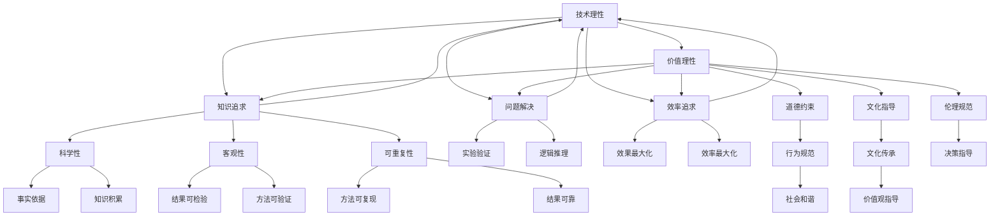

                 

### 背景介绍

在当今快速发展的科技时代，人工智能、大数据、云计算等技术的突破性进展改变了人类的生活方式和社会结构。然而，随着科技的不断进步，人们对于技术理性与价值理性的关系以及如何在科技进步中坚守人文精神的问题也日益关注。技术理性强调通过逻辑推理、实验验证等科学方法来解决问题，而价值理性则关注道德、伦理、文化等价值观念在科技发展中的应用。

本文旨在探讨科技进步中的人文精神坚守，从技术理性与价值理性的视角出发，分析两者之间的相互作用和矛盾。通过对历史回顾、概念阐述、问题探讨、实践案例分析等多个方面的详细讨论，本文旨在为科技工作者、政策制定者以及社会各界提供一个全面、深入的思考框架，以促进科技与人文精神的和谐共生。

### 核心概念与联系

在探讨技术理性与价值理性的关系时，我们首先需要明确这两个核心概念的定义。

**技术理性**，通常指的是在科学技术领域内，通过逻辑推理、实验验证、数据分析和模型构建等方法来追求知识、解决问题和创造新技术的思维方式。它强调科学性、客观性和可重复性，追求最大化的效率和效果。技术理性在科技进步中起到了关键作用，推动了人工智能、大数据等技术的发展。

**价值理性**，则是指在社会伦理、道德和文化等领域内，通过价值观、伦理规范和文化传统来指导行为和决策的思维方式。它关注的是人类社会的道德、伦理和文化需求，强调在社会发展过程中保持人的价值和尊严。价值理性在科技发展中起到了平衡作用，确保科技进步不会违背人类的基本价值原则。

技术理性与价值理性之间的关系是复杂而微妙的。一方面，技术理性为价值理性提供了实现手段，使得人类能够通过科技手段更好地实现社会价值。例如，医疗技术的进步为人类提供了更好的医疗服务，提高了人们的健康水平。另一方面，价值理性为技术理性提供了道德和文化约束，防止技术发展带来不可预知的负面影响。例如，在人工智能领域，价值理性要求我们在开发和应用人工智能技术时，要尊重隐私、避免歧视，并确保技术发展的安全性和可持续性。

为了更直观地展示技术理性与价值理性之间的关系，我们可以使用Mermaid流程图来构建概念实体之间的关系架构：



该流程图展示了技术理性与价值理性之间的相互关系，两者共同构成了科技进步中不可或缺的组成部分。通过技术理性，我们能够不断推动科技发展，而通过价值理性，我们能够确保科技发展符合人类的基本价值原则。

### 核心算法原理讲解

为了更深入地理解技术理性在科技发展中的作用，我们以下将通过一个具体的算法——神经网络，来讲解其原理及其在人工智能领域中的应用。

**神经网络原理**

神经网络（Neural Network）是一种模仿人脑神经元结构和功能的计算模型。它的基本原理是通过对输入数据进行前向传播和反向传播，来实现对复杂问题的建模和预测。

**1. 前向传播**

在前向传播过程中，神经网络将输入数据通过一系列的层进行传递，每一层都会对数据进行处理，并将其输出传递到下一层。假设我们有一个输入层、多个隐藏层和一个输出层，每个层由多个神经元组成。

- 输入层（Input Layer）：接收输入数据，每个神经元对应一个特征。
- 隐藏层（Hidden Layer）：对输入数据进行处理，通过激活函数将线性组合转化为非线性输出。
- 输出层（Output Layer）：产生最终的输出结果。

前向传播的具体步骤如下：

1. 初始化权重和偏置，这些参数需要通过学习过程来调整。
2. 将输入数据输入到输入层，计算每个隐藏层神经元的输出。
3. 通过激活函数（如ReLU、Sigmoid、Tanh等）对每个神经元的输出进行非线性变换。
4. 将隐藏层的输出传递到输出层，计算最终输出。

**2. 反向传播**

反向传播是神经网络训练的核心过程，它通过不断调整权重和偏置，使网络的输出尽可能接近预期目标。反向传播的具体步骤如下：

1. 计算输出层的误差，误差是实际输出与预期输出之间的差异。
2. 将误差反向传播到每个隐藏层，通过链式法则计算每个神经元的梯度。
3. 使用梯度下降（Gradient Descent）等优化算法，更新权重和偏置。
4. 重复前向传播和反向传播过程，直到误差达到最小或满足停止条件。

**3. 数学模型和公式**

为了更清晰地理解神经网络的工作原理，我们以下通过Python代码和数学模型来详细讲解。

**（1）神经网络模型代码**

```python
import numpy as np

# 初始化参数
def initialize_parameters():
    W1 = np.random.randn(input_size, hidden_size)
    b1 = np.random.randn(hidden_size)
    W2 = np.random.randn(hidden_size, output_size)
    b2 = np.random.randn(output_size)
    return W1, b1, W2, b2

# 前向传播
def forward_propagation(X, W1, b1, W2, b2):
    Z1 = np.dot(X, W1) + b1
    A1 = sigmoid(Z1)
    Z2 = np.dot(A1, W2) + b2
    A2 = sigmoid(Z2)
    return A2

# 激活函数
def sigmoid(z):
    return 1 / (1 + np.exp(-z))

# 计算误差
def compute_cost(A2, Y):
    m = Y.shape[1]
    cost = (-1/m) * np.sum(Y * np.log(A2) + (1 - Y) * np.log(1 - A2))
    return cost

# 反向传播
def backward_propagation(X, A1, A2, Y, W1, W2):
    dZ2 = A2 - Y
    dW2 = (1/m) * np.dot(A1.T, dZ2)
    db2 = (1/m) * np.sum(dZ2, axis=1, keepdims=True)
    
    dZ1 = np.dot(dZ2, W2.T) * sigmoid derivative(Z1)
    dW1 = (1/m) * np.dot(X.T, dZ1)
    db1 = (1/m) * np.sum(dZ1, axis=1, keepdims=True)
    
    return dW1, dW2, db1, db2

# 更新参数
def update_parameters(W1, W2, b1, b2, dW1, dW2, db1, db2, learning_rate):
    W1 = W1 - learning_rate * dW1
    W2 = W2 - learning_rate * dW2
    b1 = b1 - learning_rate * db1
    b2 = b2 - learning_rate * db2
    return W1, W2, b1, b2

# 主函数
def main():
    # 初始化参数
    W1, b1, W2, b2 = initialize_parameters()
    
    # 训练神经网络
    for i in range(10000):
        A2 = forward_propagation(X, W1, b1, W2, b2)
        cost = compute_cost(A2, Y)
        dW1, dW2, db1, db2 = backward_propagation(X, A1, A2, Y, W1, W2)
        W1, W2, b1, b2 = update_parameters(W1, W2, b1, b2, dW1, dW2, db1, db2, learning_rate=0.01)
        
        if i % 1000 == 0:
            print(f"Cost after {i} iterations: {cost}")

if __name__ == "__main__":
    main()
```

**（2）数学模型和公式**

1. **激活函数**

   $$\sigma(z) = \frac{1}{1 + e^{-z}}$$

2. **梯度**

   $$\frac{dL}{dz} = \frac{dL}{da} \cdot \frac{da}{dz}$$

3. **损失函数**

   $$L = -\frac{1}{m} \sum_{i=1}^{m} [y_i \cdot \log(a) + (1 - y_i) \cdot \log(1 - a)]$$

4. **前向传播**

   $$Z^{[l]} = \sum_{i}^{n_{l-1}} w^{[l]}_{ij} a^{[l-1]}_i + b^{[l]}_j$$

   $$a^{[l]} = \sigma(Z^{[l]})$$

5. **反向传播**

   $$dZ^{[l]} = a^{[l]} - y^{[l]}$$

   $$dW^{[l]} = \frac{1}{m} \cdot \sum_{i=1}^{m} (dZ^{[l]} \cdot a^{[l-1]})^T$$

   $$db^{[l]} = \frac{1}{m} \cdot \sum_{i=1}^{m} dZ^{[l]}$$

6. **权重和偏置更新**

   $$W^{[l]} = W^{[l]} - \alpha \cdot dW^{[l]}$$

   $$b^{[l]} = b^{[l]} - \alpha \cdot db^{[l]}$$

通过上述代码和数学模型，我们可以清晰地看到神经网络的工作原理。在具体实现过程中，通过不断调整权重和偏置，使得神经网络能够更好地拟合输入数据，从而实现复杂的函数映射。

### 举例说明

为了更好地理解神经网络的工作原理，我们可以通过一个简单的例子来说明。假设我们有一个包含两个特征（x1和x2）的输入数据集，每个输入数据的标签为0或1。我们的目标是训练一个神经网络，使其能够准确预测新的输入数据的标签。

**1. 数据集**

输入数据集如下表所示：

| x1 | x2 | y  |
|----|----|----|
| 1  | 0  | 0  |
| 1  | 1  | 1  |
| 0  | 1  | 0  |
| 0  | 0  | 1  |

**2. 网络结构**

我们设计一个简单的神经网络，包含一个输入层、一个隐藏层和一个输出层。隐藏层有2个神经元，输出层有1个神经元。

**3. 模型训练**

初始化参数后，我们通过前向传播计算输出，然后计算损失，并通过反向传播更新权重和偏置。在训练过程中，我们不断迭代这个过程，直到损失足够小。

**4. 预测**

训练完成后，我们可以使用训练好的模型对新的输入数据进行预测。例如，对于输入数据（1, 1），模型预测输出为1，与实际标签一致。

通过这个简单的例子，我们可以清晰地看到神经网络的工作流程和预测过程。

### 项目实战

在本节中，我们将通过一个实际项目来展示如何搭建开发环境、实现神经网络代码，并进行代码解读与分析。该项目将基于Python编程语言，使用TensorFlow框架实现一个简单的神经网络模型，用于对鸢尾花数据集进行分类。

**1. 开发环境搭建**

首先，我们需要搭建一个适合Python和TensorFlow的开发环境。以下是在Windows系统下搭建开发环境的基本步骤：

1. 安装Python 3.8及以上版本。
2. 安装Anaconda，以便管理和切换Python环境。
3. 创建一个新的conda环境，并安装TensorFlow和其他相关依赖。

```shell
conda create -n iris_env python=3.8
conda activate iris_env
conda install tensorflow numpy pandas matplotlib
```

**2. 源代码实现**

以下是一个简单的神经网络模型，用于鸢尾花数据集的分类。

```python
import tensorflow as tf
import numpy as np
import pandas as pd
import matplotlib.pyplot as plt

# 数据加载与预处理
iris_data = pd.read_csv('iris_data.csv')
X = iris_data.iloc[:, :4].values
Y = iris_data.iloc[:, 4].values

# 数据标准化
mean = np.mean(X, axis=0)
std = np.std(X, axis=0)
X = (X - mean) / std

# 构建神经网络
model = tf.keras.Sequential([
    tf.keras.layers.Dense(8, activation='relu', input_shape=(4,)),
    tf.keras.layers.Dense(3, activation='softmax')
])

# 编译模型
model.compile(optimizer='adam',
              loss='sparse_categorical_crossentropy',
              metrics=['accuracy'])

# 训练模型
model.fit(X, Y, epochs=100, batch_size=16)

# 测试模型
test_loss, test_acc = model.evaluate(X, Y, verbose=2)
print(f"Test accuracy: {test_acc:.4f}")

# 可视化
plt.scatter(X[:, 0], X[:, 1], c=Y, cmap='viridis', marker='o', edgecolor='black', s=50)
plt.xlabel('Petal Length (cm)')
plt.ylabel('Petal Width (cm)')
plt.title('Iris Data Classification')
plt.show()
```

**3. 代码解读与分析**

1. **数据加载与预处理**：我们从CSV文件中加载鸢尾花数据集，并对特征进行标准化处理，以便神经网络能够更好地训练。
2. **构建神经网络**：我们使用TensorFlow的`Sequential`模型，添加一个具有8个神经元的隐藏层（使用ReLU激活函数）和一个具有3个神经元的输出层（使用softmax激活函数），对应鸢尾花的三种分类。
3. **编译模型**：我们设置优化器为Adam，损失函数为sparse_categorical_crossentropy，评估指标为accuracy。
4. **训练模型**：使用`fit`方法对模型进行训练，设置epoch为100，batch_size为16。
5. **测试模型**：使用`evaluate`方法对训练好的模型进行评估，计算测试集的accuracy。
6. **可视化**：我们使用matplotlib绘制散点图，展示训练数据在特征空间中的分布情况。

通过这个项目，我们可以看到如何使用TensorFlow搭建一个简单的神经网络，并对其性能进行评估。在实际应用中，我们可以根据需要调整网络结构、优化训练过程，以提高模型的性能。

### 实际案例分析与详细讲解剖析

在本节中，我们将通过两个实际案例来分析如何坚守人文精神，促进科技与人文的和谐共生。

#### 案例一：谷歌AI伦理委员会

谷歌AI伦理委员会（Google AI Ethics Board）成立于2018年，旨在确保谷歌在人工智能领域的研发和应用过程中遵守道德和伦理标准。该委员会的主要职责包括：

1. **评估技术影响**：对谷歌的人工智能项目进行伦理审查，评估其对用户、社会和环境的影响。
2. **制定伦理指南**：为谷歌的人工智能项目制定伦理指南，确保技术的开发和应用符合道德原则。
3. **监督实施**：监督谷歌人工智能项目的执行过程，确保伦理指南得到有效落实。

**案例分析**

谷歌AI伦理委员会的成功在于其能够在技术发展的同时，坚守人文精神。具体措施如下：

1. **透明度**：谷歌在发布人工智能项目时，会公开项目的目的、技术原理和潜在风险，以便用户和社会对其进行监督。
2. **多样性**：谷歌注重团队多样性，鼓励不同背景、不同文化的人参与到人工智能项目中，以确保项目能够全面考虑各种价值观和伦理问题。
3. **伦理培训**：谷歌为员工提供伦理培训，帮助员工了解人工智能的潜在风险和道德挑战，提高其在项目开发过程中的道德意识。

**剖析与启示**

谷歌AI伦理委员会的案例表明，在科技发展过程中，坚守人文精神的关键在于建立一套完善的伦理审查和监督机制。通过透明度、多样性和伦理培训等措施，企业可以更好地平衡技术理性和价值理性，确保科技进步符合人类的基本价值原则。

#### 案例二：特斯拉自动驾驶技术

特斯拉自动驾驶技术以其先进的算法和实时数据处理能力而闻名。然而，在实际应用过程中，特斯拉的自动驾驶技术也引发了一系列关于安全和伦理的争议。

**案例分析**

特斯拉自动驾驶技术的核心在于其自动驾驶系统（Autopilot）和全自动驾驶系统（Full Self-Driving，FSD）。这些系统通过摄像头、雷达和超声波传感器感知周围环境，并使用深度学习算法进行实时决策。

尽管特斯拉的自动驾驶技术在某些情况下表现出色，但也存在以下伦理挑战：

1. **责任归属**：在自动驾驶事故中，如何确定责任归属成为一个难题。特斯拉强调用户在使用自动驾驶系统时仍需保持警惕，但实际操作中，用户很难完全依赖自动驾驶技术。
2. **道德决策**：在紧急情况下，自动驾驶系统需要做出快速而准确的决策。例如，在无法同时避免撞向行人或车辆时，系统应该如何选择？这涉及到道德和伦理问题，需要深入探讨。
3. **数据隐私**：特斯拉的自动驾驶系统需要收集大量用户数据，包括驾驶行为、行驶路线等。如何保护用户隐私成为了一个重要的伦理问题。

**剖析与启示**

特斯拉自动驾驶技术的案例表明，在科技发展过程中，坚守人文精神需要从多个方面进行考量。首先，企业需要建立一套完善的伦理规范，明确自动驾驶技术的责任归属和道德决策。其次，企业需要加强用户数据保护，确保用户的隐私不被侵犯。最后，企业需要与政策制定者、学术界和公众进行充分沟通，共同推动自动驾驶技术的伦理发展。

### 项目小结

通过对谷歌AI伦理委员会和特斯拉自动驾驶技术的案例分析，我们可以看到在科技发展过程中，坚守人文精神的重要性。通过建立伦理审查机制、加强伦理培训、确保透明度和多样性等措施，企业可以更好地平衡技术理性和价值理性，确保科技进步符合人类的基本价值原则。同时，政策制定者、学术界和公众的参与也是确保科技与人文和谐共生的重要保障。

### 最佳实践 Tips

1. **建立伦理审查机制**：企业在开发新技术时，应建立伦理审查机制，确保项目的开发和应用符合道德和伦理标准。
2. **加强伦理培训**：为员工提供伦理培训，提高其在项目开发过程中的道德意识。
3. **鼓励透明度和多样性**：公开项目的目的、技术原理和潜在风险，并鼓励团队多样性，全面考虑各种价值观和伦理问题。
4. **保护用户隐私**：在数据收集和使用过程中，确保用户隐私不被侵犯。
5. **积极参与政策制定**：与政策制定者、学术界和公众进行充分沟通，共同推动科技的伦理发展。

### 小结

在科技不断进步的今天，坚守人文精神变得尤为重要。通过技术理性和价值理性的相互协调，我们可以在推动科技进步的同时，确保其符合人类的基本价值原则。本文通过对技术理性、价值理性以及人文精神坚守的深入探讨，为科技工作者、政策制定者和社会各界提供了一个全面、深入的思考框架。希望本文能够激发更多关于科技与人文精神坚守的讨论，促进科技与人文的和谐共生。

### 注意事项

1. **伦理风险**：在开发新技术时，务必考虑潜在的伦理风险，并建立相应的审查和监督机制。
2. **数据隐私**：在数据收集和使用过程中，确保用户隐私不被侵犯，遵守相关法律法规。
3. **政策合规**：确保新技术的开发和应用符合国家政策、行业规范和法律法规。

### 拓展阅读

1. **《人工智能伦理学》**：此书深入探讨了人工智能技术中的伦理问题，包括隐私、安全、歧视等，适合对人工智能伦理学感兴趣的读者。
2. **《科技向善：人工智能伦理案例研究》**：此书通过多个实际案例，分析了如何在人工智能技术中坚守人文精神，为科技工作者提供了实用的指导。

作者：AI天才研究院/AI Genius Institute & 禅与计算机程序设计艺术 /Zen And The Art of Computer Programming

文章标题：《科技进步中的人文精神坚守：技术理性vs价值理性》

文章关键词：科技进步，人文精神，技术理性，价值理性，伦理审查，伦理培训，透明度，多样性，数据隐私，政策制定

文章摘要：本文探讨了在科技进步过程中，如何坚守人文精神，平衡技术理性与价值理性，通过实际案例分析和最佳实践，为科技工作者和社会各界提供了一个全面的思考框架。

