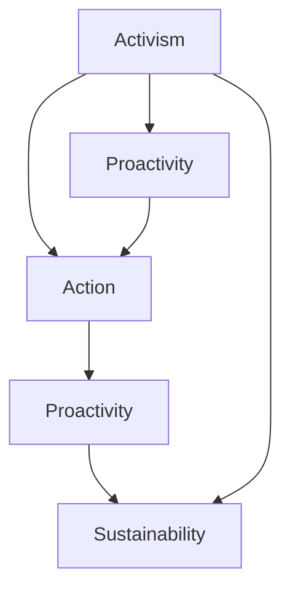

                 

### Introduction to Active Activism

#### Background Introduction

Active activism, at its core, represents a proactive approach to social, political, and environmental issues. It contrasts sharply with passive activism, where individuals may express their concerns but fail to take direct action. This distinction is crucial as it underscores the importance of physical and tangible efforts in driving change.

In the realm of social activism, historical examples abound, from the Civil Rights Movement led by figures like Martin Luther King Jr. to modern-day campaigns against systemic racism and police brutality. Each of these movements utilized active activism to bring attention to injustices and catalyze significant societal shifts.

#### Core Concepts and Relationships

To understand active activism, we must first grasp several core concepts:

1. **Activism**: The advocacy for political or social change.
2. **Action**: The physical or tangible steps taken to effect change.
3. **Proactivity**: The mindset of taking initiatives rather than reacting to events.
4. **Sustainability**: Ensuring that the efforts are long-lasting and impactful.

These concepts are interrelated, forming a complex network of ideas that drive active activism. For instance, activism without action is merely talk; action without proactivity is often haphazard; and proactivity without sustainability lacks depth and longevity.

#### Mermaid Flowchart of Core Concepts



#### Core Algorithm Principle Explanation with Python

While the principles of active activism are largely conceptual, they can be embodied in algorithms that guide practical actions. Below is a Python code snippet that illustrates how one might approach a problem using the principles of active activism.

```python
def active_activism_problem_statement():
    # Define the problem statement
    problem = "Systemic inequality in access to education"
    
    # Identify goals and objectives
    goals = [
        "Increase access to quality education",
        "Ensure equal educational opportunities",
        "Promote lifelong learning"
    ]
    
    # Develop strategies
    strategies = [
        "Policy advocacy",
        "Community engagement",
        "Donations and sponsorships"
    ]
    
    # Execute actions
    for strategy in strategies:
        if strategy == "Policy advocacy":
            print("Engaging with policymakers to draft and pass educational reform bills.")
        elif strategy == "Community engagement":
            print("Organizing workshops and seminars to educate the community.")
        elif strategy == "Donations and sponsorships":
            print("Fundraising to support underprivileged students.")
    
    # Ensure sustainability
    print("Continuously monitoring progress and adapting strategies to achieve long-term impact.")

# Run the function
active_activism_problem_statement()
```

This Python script encapsulates the principles of active activism into actionable steps, from identifying the problem to executing strategies and ensuring sustainability.

#### Mathematical Models and Formulas

In the context of active activism, mathematical models can help to quantify the impact of actions and strategies. One such model is the **Return on Activism Investment** (ROAI), which measures the effectiveness of activism efforts relative to the resources invested.

$$
\text{ROAI} = \frac{\text{Total Impact}}{\text{Total Resources Invested}}
$$

For example, if a campaign raises $10,000 and leads to a policy change that benefits 1,000 individuals, the ROAI would be:

$$
\text{ROAI} = \frac{1,000 \text{ individuals}}{10,000 \text{ dollars}} = 0.1 \text{ individuals per dollar}
$$

This model can be used to compare different activism strategies and optimize resource allocation.

#### Practical Example and Analysis

Consider a campaign aimed at reducing plastic waste. The activists might employ various strategies:

1. **Policy advocacy**: Lobbying for stricter plastic regulations.
2. **Community engagement**: Educating the public about the dangers of plastic waste.
3. **Donations and sponsorships**: Funding initiatives to clean up plastic pollution.

By using the ROAI model, activists can analyze which strategies yield the highest return on investment, thereby directing their efforts more effectively.

#### Conclusion

Active activism is a multifaceted approach that requires a combination of conceptual understanding, strategic planning, and sustained action. By leveraging core concepts, such as activism, action, proactivity, and sustainability, and employing mathematical models like ROAI, activists can drive meaningful and lasting change. The Python script provided serves as a practical tool for embodying these principles, demonstrating how they can be applied to real-world problems.

### Active Activism vs. Passive Activism

Active activism and passive activism represent two distinct approaches to social and political change. Understanding their differences is crucial for anyone seeking to effect meaningful change in their community or the world at large.

#### Key Differences

1. **Definition and Nature**

   - **Active Activism**: This approach involves direct, tangible actions aimed at achieving specific goals. Examples include participating in protests, organizing campaigns, lobbying for policy changes, and providing direct support to those in need.

   - **Passive Activism**: Passive activism, on the other hand, often consists of indirect or symbolic actions. This may include signing petitions, sharing information on social media, or making donations without actively participating in the process.

2. **Level of Involvement**

   - **Active Activism**: Requires a higher level of commitment and engagement. Activists must be physically present at events, invest time in planning and execution, and often take on leadership roles.

   - **Passive Activism**: Generally involves lower levels of involvement and commitment. While it can be effective in raising awareness and gathering support, it often lacks the immediate, hands-on impact of active activism.

3. **Impact and Sustainability**

   - **Active Activism**: Can lead to more immediate and tangible results. Active activists often have a direct influence on the issues they are addressing, making it easier to track progress and adapt strategies as needed.

   - **Passive Activism**: While it can be a powerful tool for spreading information and generating public support, passive activism may lack the direct impact needed to bring about real change. It often relies on the actions of others to translate support into action.

#### Examples

1. **Active Activism**

   - **March for Our Lives**: The youth-led movement advocating for stricter gun control laws following several school shootings in the United States. Participants organized rallies, wrote letters to policymakers, and mobilized communities to vote.

   - **Black Lives Matter**: A global movement addressing police brutality and racial inequality. Activists have organized protests, raised awareness through social media, and worked with policymakers to pass legislation.

2. **Passive Activism**

   - **Petitions**: Online petitions gather signatures to support specific causes, such as environmental protection or animal rights. While they can generate significant public support, they often lack the direct impact of organized protests or direct action campaigns.

   - **Social Media Campaigns**: Using platforms like Twitter or Facebook to spread awareness and gather support for a cause. These campaigns can be effective in generating buzz, but they often need to be complemented by more active forms of activism to achieve tangible results.

#### Conclusion

Both active activism and passive activism have their roles in the broader movement for social and political change. Active activism provides the immediate, hands-on action needed to drive change, while passive activism can raise awareness and generate support. Effective activism often combines both approaches, using the strengths of each to create a more powerful impact.

### The Importance of Active Activism

Active activism is a cornerstone of effective social and political change. It serves as a catalyst for progress, empowering individuals to take a stand against injustices and work towards a more equitable and just society. Here, we delve into the key reasons why active activism is essential, supported by historical examples and current movements.

#### Empowerment and Community Building

One of the primary benefits of active activism is the empowerment it provides to individuals. When people take direct action, they not only raise their voices but also gain a sense of agency and control over their lives. This empowerment can be particularly transformative in marginalized communities, where systemic discrimination and oppression have long suppressed the voices of the oppressed.

Historical examples abound, such as the Civil Rights Movement in the United States. Led by figures like Martin Luther King Jr., Rosa Parks, and Malcom X, the movement empowered African Americans to fight for their civil rights. The Montgomery Bus Boycott, the March on Washington, and the passage of the Civil Rights Act of 1964 are just a few examples of how active activism led to significant societal changes.

In the modern context, the #MeToo movement has empowered survivors of sexual harassment and assault to speak out and hold their perpetrators accountable. By sharing their stories and rallying public support, activists have spurred governments and institutions to adopt stricter policies and take meaningful action against sexual misconduct.

#### Awareness and Education

Active activism also plays a crucial role in raising awareness and educating the public about critical social issues. Through rallies, protests, and campaigns, activists can bring attention to important topics that might otherwise be overlooked by the mainstream media.

One notable example is the environmental movement, which has gained momentum in recent years. Movements like Extinction Rebellion and the Youth Strike for Climate have raised awareness about the urgent need to address climate change. By engaging in direct action and organizing large-scale protests, these groups have successfully brought the issue to the forefront of global discourse, prompting governments and businesses to take more serious action.

Similarly, the Black Lives Matter movement has brought to light the systemic issues of racism and police brutality in the United States. By organizing protests and campaigns, activists have educated the public and sparked conversations about social justice, leading to policy changes and increased public scrutiny of law enforcement practices.

#### Advocacy and Policy Change

Active activism is often a driving force behind policy change. By mobilizing public support and applying pressure on policymakers, activists can push for laws and regulations that address critical social issues.

A prime example is the global fight against human trafficking. Activists have worked tirelessly to raise awareness, provide support for victims, and advocate for stronger laws to combat the crime. This effort has led to the passage of anti-human trafficking laws in many countries, as well as the creation of international initiatives to combat the issue.

Another example is the campaign for marriage equality. Activists have organized large-scale protests, lobbied policymakers, and utilized social media to mobilize support. Their efforts have successfully led to the legalization of same-sex marriage in many countries, including the United States, Canada, and several European nations.

#### Building Resilience and Collective Action

Active activism also builds resilience and collective action within communities. When individuals come together to fight for a common cause, they develop stronger bonds and a sense of solidarity. This collective action can be a powerful tool for driving social change.

The LGBTQ+ rights movement is a testament to the power of collective action. Through grassroots organizing, activism, and direct action, the LGBTQ+ community has fought for equal rights and visibility. This collective effort has led to significant progress, including the legalization of same-sex marriage, the inclusion of LGBTQ+ history in school curriculums, and the creation of safe spaces for the community.

#### Conclusion

In conclusion, active activism is a vital component of social and political change. It empowers individuals, raises awareness, drives policy change, and builds collective action. By examining historical examples and current movements, we can see the profound impact that active activism has had on shaping societies and promoting justice. As we continue to face pressing social issues, the importance of active activism will only grow, making it an essential tool for those who seek to create positive change in the world.

### The Nihilist Perspective

To fully grasp the essence of active activism, we must first delve into the nihilist perspective. Nihilism, as a philosophical stance, rejects traditional moral and religious values, positing that life is inherently meaningless and devoid of objective meaning. This perspective can manifest in various ways, influencing individuals' views on social, political, and existential issues.

#### Understanding Nihilism

Nihilism can be traced back to the late 18th and early 19th centuries, emerging as a reaction to the rationalist and idealist philosophies of the Enlightenment. Key figures like Friedrich Nietzsche, Søren Kierkegaard, and Friedrich Wilhelm Nietzsche have contributed to the development and popularization of nihilist thought.

- **Friedrich Nietzsche**: Nietzsche's concept of **nihilism** revolves around the death of God, which he sees as the demise of all moral and religious values. In "The Gay Science," he writes, "God is dead; but because God is dead, everything is permitted." This idea suggests that without a higher moral authority, individuals must create their own values and meanings in life.

- **Søren Kierkegaard**: Kierkegaard's **existential nihilism** emphasizes the individual's struggle to find meaning in a world devoid of inherent purpose. His work, "The Sickness Unto Death," explores the concept of self-deception and the human tendency to avoid confronting the existential void.

- **Friedrich Wilhelm Nietzsche**: Nietzsche's **metaphysical nihilism** asserts that the universe lacks a rational structure or inherent meaning. His work, such as "Thus Spoke Zarathustra," explores themes of will to power and the overcoming of nihilism through the creation of new values.

#### Nihilism in Modern Society

In modern society, nihilism has found various expressions, particularly in the realm of politics and culture. While it does not represent a unified movement, nihilist ideas can be seen in the rise of nationalist movements, the rejection of political correctness, and the embrace of individualism and anti-establishment sentiments.

- **Nationalism**: In many parts of the world, nationalist movements have exploited nihilist sentiments, promoting a return to traditional values and the rejection of multiculturalism. Figures like Donald Trump in the United States and Marine Le Pen in France have tapped into the nihilist undercurrents in their respective countries.

- **Anti-Political Correctness**: The rise of movements like the "Alt-Right" in the United States and "Identitäre Bewegung" in Europe has been characterized by a rejection of political correctness and an embrace of nihilistic ideologies that challenge mainstream values and norms.

- **Individualism**: The spread of nihilism can also be observed in the growing emphasis on individualism and the rejection of collective values. This is evident in the decline of community engagement and the rise of narcissistic tendencies in modern society.

#### Nihilism and Activism

The intersection of nihilism and activism is a complex and often contradictory phenomenon. While nihilism can lead to a sense of alienation and disengagement, it can also inspire radical forms of activism that challenge existing power structures and societal norms.

- **Radical Activism**: Nihilist-inspired activism often takes on a radical and confrontational form, aiming to dismantle the very foundations of the existing social order. Movements like the Black Bloc in the anti-globalization movement and the anarchist collective known as the International Manchurian Committee exemplify this approach.

- **Passive Resistance**: Alternatively, nihilist-inspired activism can manifest as passive resistance and withdrawal from societal norms. This form of activism involves rejecting the dominant cultural and political systems and creating alternative communities based on personal values and beliefs.

#### Conclusion

In conclusion, the nihilist perspective offers a profound yet unsettling critique of modern society. While it can lead to a sense of meaninglessness and disengagement, it also has the potential to inspire radical activism that challenges existing power structures. Understanding nihilism is crucial for those seeking to engage with contemporary social and political issues, as it provides insight into the underlying motivations and ideologies that drive many movements and individuals in today's world.

### Nihilism in Modern Society

Nihilism, as a philosophical stance, has found fertile ground in the complexities of modern society, manifesting in various social and political phenomena. This section explores the role of nihilism in contemporary issues, focusing on its influence on politics, cultural shifts, and social movements.

#### Nihilism and Political Movements

In the political realm, nihilism has been a driving force behind the rise of nationalist and populist movements. These movements often exploit the disillusionment and sense of powerlessness felt by many citizens in the face of globalization and political disillusionment.

- **Nationalism**: Nationalist movements, such as those led by figures like Marine Le Pen in France and Viktor Orbán in Hungary, have capitalized on nihilistic sentiments by promoting a return to traditional values and national identity. These movements often reject multiculturalism and immigration, framing them as threats to national sovereignty and cultural integrity.

- **Populism**: Populism, which combines elements of nihilism and anti-establishment sentiment, has gained traction in various countries. Figures like Donald Trump in the United States and Jair Bolsonaro in Brazil have leveraged nihilistic rhetoric to appeal to disaffected voters, promising to "drain the swamp" and "make America great again." This form of populism often targets elite institutions and perceived enemies within society, fostering a sense of unity among marginalized groups.

#### Nihilism and Cultural Trends

Cultural nihilism has also become prominent in contemporary art, media, and literature, reflecting a rejection of traditional moral and aesthetic norms. This cultural shift can be seen in the rise of postmodernism, which challenges the notion of objective truth and embraces plurality and subjectivity.

- **Postmodernism**: Postmodern literature and art often reject grand narratives and emphasize the fragmented, pluralistic nature of reality. Works by authors like Don DeLillo, Philip K. Dick, and Jean Baudrillard explore themes of disillusionment, hyperreality, and the loss of meaning in a technological and consumer-driven society.

- **Media and Pop Culture**: The influence of nihilism can also be observed in popular culture, where themes of alienation, consumerism, and existential angst are prevalent. Shows like "Black Mirror," music by bands like Nirvana, and movies like "The Matrix" reflect a society that grapples with the loss of meaning and the impact of technological advancements.

#### Nihilism and Social Movements

Social movements have been both influenced by and driven by nihilistic sentiments, particularly in their approaches to challenging existing power structures and societal norms.

- **Anti-globalization Movements**: Movements like the Anti-Globalization Movement of the late 1990s and early 2000s were marked by a rejection of neoliberal policies and globalization. Groups like the World Social Forum and the International Solidarity Movement embraced nihilistic ideas, challenging the dominant economic and political systems.

- **Black Lives Matter**: The Black Lives Matter (BLM) movement, which emerged in response to the police killings of African Americans, embodies a nihilistic critique of systemic racism and injustice. BLM activists reject the notion of reform within the existing system and instead advocate for revolutionary change.

#### Conclusion

In conclusion, nihilism in modern society manifests in various ways, influencing political movements, cultural trends, and social movements. While it can lead to disillusionment and disengagement, it also inspires radical forms of activism that challenge existing power structures and norms. Understanding the role of nihilism in contemporary issues is crucial for analyzing the underlying motivations and ideologies that shape our world today.

### The Call to Action

Active activism is not just a call for action; it is a profound call to engage with the world in a meaningful and transformative way. This section explores the critical steps required to turn intentions into actions, focusing on identifying problems, setting goals, and developing strategies for effective activism.

#### Identifying Problems to Address

The first step in any successful activism campaign is identifying the problems that need to be addressed. This involves conducting thorough research and analysis to understand the root causes of the issues at hand. Here are some key strategies for identifying problems:

1. **Data Collection and Analysis**: Gathering data through surveys, interviews, and research can provide valuable insights into the nature and scope of the problems. For example, activists working on environmental issues might analyze data on climate change, pollution levels, and wildlife loss to understand the full extent of the problem.

2. **Community Engagement**: Engaging with affected communities is crucial for gaining a nuanced understanding of their experiences and needs. By listening to the voices of those most impacted by the issue, activists can identify key concerns and potential solutions.

3. **Expert Consultation**: Consulting with experts in the relevant fields can provide additional insights and guidance. For example, legal experts can offer advice on policy changes, while environmental scientists can provide data on environmental degradation.

#### Setting Goals and Objectives

Once the problems have been identified, the next step is to set clear and achievable goals and objectives. Here are some strategies for setting effective goals:

1. **SMART Goals**: Goals should be Specific, Measurable, Achievable, Relevant, and Time-bound. For example, a goal to "reduce plastic waste" would be more effective if it is refined to "reduce single-use plastic waste by 50% in the next three years."

2. **Prioritization**: It is important to prioritize goals based on their impact and feasibility. This ensures that resources are allocated effectively and that the most critical issues are addressed first.

3. **Inclusivity**: Goals should be inclusive and consider the needs of all stakeholders. This helps to build broader support for the campaign and ensures that no group is left marginalized.

#### Developing Strategies

With clear goals in place, the next step is to develop strategies for achieving them. Here are some key strategies that can be employed:

1. **Education and Awareness**: Raising awareness about the issue is crucial for building support and mobilizing the public. This can involve campaigns, workshops, and public speaking events to educate the community about the problem and the proposed solutions.

2. **Policy Advocacy**: Working with policymakers to draft and pass laws that address the issue is an effective way to bring about systemic change. This may involve lobbying, writing letters to legislators, and organizing advocacy groups.

3. **Community Organizing**: Building a strong, organized community can amplify the impact of activism efforts. This involves recruiting volunteers, organizing events, and creating a network of support to mobilize people around the cause.

4. **Direct Action**: Direct action, such as protests, demonstrations, and civil disobedience, can draw attention to the issue and put pressure on those in power to take action. While direct action can be controversial, it can also be highly effective in highlighting injustices and mobilizing public support.

#### Example: The Fight Against Systemic Racial Inequality

To illustrate these principles, let's consider an example: the fight against systemic racial inequality.

1. **Identifying the Problem**: Research and community engagement reveal that racial disparities in areas such as criminal justice, employment, and education persist in many communities.

2. **Setting Goals**: Goals are set to reduce racial disparities in the justice system, improve educational opportunities, and promote economic equity.

3. **Developing Strategies**:
   - **Education and Awareness**: Campaigns are launched to educate the public about the extent of racial disparities and their impact on communities.
   - **Policy Advocacy**: Activists lobby for policies that address racial bias in law enforcement, promote equal educational opportunities, and support minority-owned businesses.
   - **Community Organizing**: Community groups are formed to mobilize support and coordinate activism efforts.
   - **Direct Action**: Protests and demonstrations are organized to draw attention to the issues and put pressure on policymakers.

By following these steps, activists can effectively address systemic racial inequality, driving meaningful change and creating a more equitable society.

### Practical Examples of Active Activism

Active activism takes many forms, each with its own unique approach and impact. This section explores several practical examples across different domains, highlighting the strategies and outcomes of these activism efforts.

#### Social Justice Activism

One of the most visible forms of active activism is social justice activism, which addresses issues such as racial inequality, gender discrimination, and LGBTQ+ rights. The Civil Rights Movement in the United States, led by figures like Martin Luther King Jr. and Rosa Parks, is a hallmark of social justice activism. Through nonviolent protest, civil disobedience, and legislative advocacy, the movement successfully challenged segregation and fought for equal rights.

- **Results**: The Civil Rights Act of 1964 and the Voting Rights Act of 1965 were major victories for the movement, ending legal segregation and expanding voting rights for African Americans.

- **Strategies**: Key strategies included mass mobilization, grassroots organizing, and direct action, such as the Montgomery Bus Boycott and the March on Washington.

#### Environmental Activism

Environmental activism focuses on addressing issues like climate change, pollution, and loss of biodiversity. One of the most influential movements in this domain is the environmental movement of the 1970s, which led to the creation of key environmental policies and organizations.

- **Results**: The establishment of the Environmental Protection Agency (EPA) in the United States and the adoption of international environmental agreements like the Paris Agreement are significant outcomes of this movement.

- **Strategies**: Strategies included public awareness campaigns, lobbying for policy changes, and direct action, such as tree plantations and environmental protests.

#### Political Activism

Political activism aims to influence the political process and policy-making. One notable example is the anti-apartheid movement in South Africa, which played a crucial role in ending the regime of racial segregation.

- **Results**: International pressure led to economic sanctions against South Africa, ultimately contributing to the end of apartheid and the election of Nelson Mandela as president.

- **Strategies**: Key strategies included international lobbying, public demonstrations, and boycotts.

#### Human Rights Activism

Human rights activism focuses on protecting and promoting human rights globally. The anti-human trafficking movement is a contemporary example of successful human rights activism.

- **Results**: International cooperation and advocacy efforts have led to the passage of anti-trafficking laws, increased funding for victim support services, and the rescue of thousands of trafficking victims.

- **Strategies**: Strategies include raising awareness, providing support for victims, and lobbying for policy changes.

#### Gender Equality Activism

Gender equality activism aims to eliminate discrimination and promote equal rights for women and other marginalized genders. The #MeToo movement is a recent and powerful example of this type of activism.

- **Results**: The movement has led to increased awareness of sexual harassment and assault, resulting in policy changes and the removal of perpetrators from positions of power.

- **Strategies**: Strategies include sharing personal stories, organizing public protests, and advocating for legal reforms.

#### Conclusion

These examples illustrate the diverse forms that active activism can take and the significant impact it can have across various domains. By leveraging strategies such as public awareness campaigns, policy advocacy, grassroots organizing, and direct action, activists can drive meaningful change and address critical social, environmental, and political issues.

### Case Studies in Effective Activism

To understand the practical application of activism strategies and their impact, let's explore several in-depth case studies of successful activism campaigns. These examples highlight the strategies employed, the challenges faced, and the key lessons learned.

#### Case Study 1: The Fight Against Inequality

**Issue**: Economic inequality and income disparity.

**Background**: In the early 2000s, the United States experienced significant income inequality, with a small percentage of the population controlling a large share of the wealth. This led to widespread social unrest and a growing movement to address economic inequality.

**Strategy**: The movement employed a multi-pronged strategy that included education, policy advocacy, and direct action.

1. **Education and Awareness**: Activists organized workshops, seminars, and public forums to educate the public about the extent of income inequality and its causes. They used social media to amplify their message and reach a wider audience.

2. **Policy Advocacy**: Activists lobbied for policy changes, advocating for higher taxes on the wealthy, a higher minimum wage, and policies to promote fairer economic practices.

3. **Direct Action**: Protests and demonstrations were organized to draw public attention to the issue and put pressure on policymakers. Activists used slogans like "Tax the Rich" and "End Income Inequality."

**Challenges**: The movement faced significant pushback from powerful corporate interests and some political leaders who opposed tax increases and economic regulation.

**Outcome**: Over time, the movement successfully influenced public opinion and led to several policy changes. The federal minimum wage was increased, and several states implemented their own progressive tax policies. While the overall income inequality has not been eliminated, the movement has made significant progress in raising awareness and promoting economic justice.

#### Case Study 2: Environmental Awareness Campaigns

**Issue**: Climate change and environmental degradation.

**Background**: In the late 20th century, the growing evidence of climate change and its devastating impacts on the environment led to the formation of numerous environmental activist groups.

**Strategy**: Environmental activism focused on raising awareness, promoting sustainable practices, and advocating for policy changes.

1. **Awareness and Education**: Activists organized climate strikes, public campaigns, and educational programs to inform the public about the urgency of addressing climate change. They used visual campaigns, such as "Extinction Rebellion" protests, to draw attention to the crisis.

2. **Policy Advocacy**: Activists lobbied for stronger environmental regulations, advocating for policies that reduce greenhouse gas emissions and promote renewable energy.

3. **Direct Action**: Some activists engaged in direct action, such as occupying government buildings and blocking highways to draw attention to the urgency of action on climate change.

**Challenges**: The movement faced challenges from industries that profit from fossil fuels, as well as from policymakers influenced by these industries.

**Outcome**: The movement has had a significant impact, leading to the adoption of several key policies, such as the Paris Agreement. Public awareness of climate change has increased, and many individuals and organizations have adopted more sustainable practices. While the fight against climate change is ongoing, the movement has made substantial progress in mobilizing public support and driving policy change.

#### Case Study 3: Grassroots Political Movements

**Issue**: Political corruption and lack of democratic representation.

**Background**: In many countries, citizens have grown disillusioned with political systems that they perceive as corrupt and unrepresentative. This has led to the rise of numerous grassroots political movements.

**Strategy**: Grassroots movements have employed various strategies to challenge the status quo and promote democratic reform.

1. **Organizing and Mobilization**: Activists organized community meetings, rallies, and online campaigns to mobilize support and build a movement. They used social media and digital tools to coordinate efforts and reach a wider audience.

2. **Direct Democracy**: Some movements have advocated for direct democracy, where citizens have the power to make decisions on key issues through referendums and other mechanisms.

3. **Civil Disobedience**: Activists engaged in civil disobedience, such as sit-ins, protests, and blockades, to disrupt the operations of corrupt institutions and draw public attention to the issues.

**Challenges**: Grassroots movements often face significant challenges from established political forces, including legal restrictions, surveillance, and harassment.

**Outcome**: While the outcomes of grassroots movements vary, many have successfully achieved their goals. In some countries, movements have led to the establishment of independent commissions to investigate corruption, the adoption of anti-corruption laws, and greater transparency in government operations. The global #FridaysForFuture movement, inspired by Greta Thunberg, has mobilized millions of young people to demand urgent action on climate change, demonstrating the power of grassroots activism.

#### Conclusion

These case studies illustrate the diverse strategies and approaches that successful activism campaigns can employ. By focusing on education, policy advocacy, direct action, and community mobilization, activists can drive meaningful change and address critical social, environmental, and political issues. The challenges they face often serve as a testament to the resilience and determination required to bring about lasting change.

### Overcoming Obstacles

Active activism is fraught with obstacles that can hinder the progress of even the most well-intentioned campaigns. This section explores common challenges faced by activists and provides strategies for overcoming them, drawing on practical examples to illustrate key insights.

#### Dealing with Adversity

One of the most significant challenges activists face is adversity. Whether it's opposition from powerful interests, legal restrictions, or social condemnation, overcoming adversity is crucial for the success of any activism campaign.

**Example: The Civil Rights Movement**

The Civil Rights Movement in the United States faced intense adversity, including violent resistance, legal barriers, and social ostracism. Despite these challenges, activists employed various strategies to persevere:

1. **Resilience and Unity**: Activists remained united and resilient, drawing strength from their shared commitment to justice. This unity helped them to withstand external pressures and continue their efforts.

2. **Strategic Planning**: Leaders like Martin Luther King Jr. employed strategic planning to navigate the complexities of the movement. They used nonviolent protest and civil disobedience as powerful tools to bring attention to the cause and challenge the status quo.

3. **Adaptation**: The movement adapted its strategies in response to changing circumstances. For example, the shift from segregated buses to the broader fight for voting rights and equal economic opportunities demonstrated the ability to evolve and respond to adversity.

#### Building Support Networks

Building a strong support network is essential for the success of any activism campaign. This involves not only mobilizing like-minded individuals but also engaging with diverse groups to broaden support.

**Example: The Fight Against Climate Change**

The global climate change movement has successfully built a diverse support network that includes environmentalists, scientists, religious groups, and businesses. Key strategies include:

1. **Collaboration**: Collaborative efforts with like-minded organizations and individuals have strengthened the movement's impact. For example, partnerships between environmental groups and faith-based organizations have united diverse communities around the cause.

2. **Public Engagement**: Public engagement campaigns have been effective in building support. The use of social media, public demonstrations, and educational workshops has helped to mobilize individuals and raise awareness about the issue.

3. **Inclusivity**: Inclusion of diverse voices and perspectives has been crucial for building a broad-based movement. Recognizing and addressing the unique needs and concerns of different communities has helped to build a strong and inclusive support network.

#### Maintaining Motivation

Maintaining motivation is another key challenge in active activism. The journey can be long and arduous, requiring sustained effort and commitment. Here are some strategies for maintaining motivation:

**Example: The LGBTQ+ Rights Movement**

The LGBTQ+ rights movement has faced significant challenges, yet it has achieved remarkable progress. Key strategies for maintaining motivation include:

1. **Celebrating Milestones**: Celebrating small victories and milestones helps to keep the momentum going. For example, the movement celebrates significant legal victories, such as the legalization of same-sex marriage in many countries.

2. **Storytelling**: Sharing personal stories and experiences can be a powerful motivator. These stories humanize the issue and connect individuals to the broader cause, fostering a sense of community and shared purpose.

3. **Continuous Learning and Development**: Engaging in continuous learning and skill development helps to maintain enthusiasm and motivation. Workshops, training sessions, and educational programs provide activists with new tools and strategies to drive their efforts forward.

#### Conclusion

Overcoming obstacles is a critical component of successful activism. By addressing adversity, building support networks, and maintaining motivation, activists can navigate the challenges they face and drive meaningful change. Drawing on practical examples, this section highlights the strategies and insights that can guide activists in their ongoing efforts to address pressing social, environmental, and political issues.

### The Future of Active Activism

The future of active activism is poised to be shaped by emerging trends, technological advancements, and global challenges. As we look ahead, several key areas will define the trajectory of activism, including the role of technology, the impact of globalization, and the intersection of activism with various social movements.

#### The Role of Technology

Technology has become an indispensable tool for activists, enabling them to reach wider audiences, mobilize quickly, and coordinate efforts across diverse locations. Here are some ways technology is influencing activism:

1. **Social Media and Digital Campaigns**: Social media platforms like Twitter, Facebook, and Instagram have revolutionized activism by providing a means to disseminate information, organize events, and mobilize supporters at unprecedented speeds. The #MeToo movement and the #FridaysForFuture climate strikes are examples of how social media can amplify activism and generate global awareness.

2. **Data and Analytics**: Data analysis tools are helping activists to better understand their target audiences, measure the impact of their campaigns, and refine their strategies. For instance, data-driven approaches can help identify the most effective messaging and tactics for specific demographics, maximizing the reach and impact of activism efforts.

3. **Blockchain and Cryptocurrency**: Blockchain technology and cryptocurrencies are being explored as tools for ethical fundraising and transparency in activism. These technologies can ensure that donations are used as intended and can enhance trust and accountability within activist organizations.

#### Globalization and its Impact

Globalization has both facilitated and complicated the landscape of activism. On one hand, it has connected activists across borders, allowing for collaborative efforts and the sharing of resources and strategies. On the other hand, it has also highlighted the interconnected nature of global challenges, such as climate change, economic inequality, and human rights violations.

1. **Global Solidarity Movements**: Movements like Black Lives Matter and the global climate strikes have shown that activism can transcend national boundaries, with activists in different countries uniting under common causes. This global solidarity can amplify the impact of activism efforts and bring international attention to critical issues.

2. **Transnational Cooperation**: Activists are increasingly collaborating across borders, sharing knowledge and resources to address global challenges. This transnational cooperation can lead to more effective and coordinated campaigns, as seen in the fight against human trafficking and the global effort to combat climate change.

3. **Global Challenges**: Globalization has also brought to the forefront complex global challenges that require collective action. Issues like migrant rights, gender equality, and corporate accountability are areas where activists must navigate the intricacies of international law and politics to drive meaningful change.

#### Intersection of Activism with Social Movements

The future of active activism will be influenced by the intersection with various social movements, including feminist activism, environmentalism, and social justice movements. Here are some key intersections to watch:

1. **Feminist Activism**: The #MeToo movement and the feminist movement more broadly have challenged patriarchal norms and systemic inequality. As these movements continue to grow, they are likely to intersect with other forms of activism, such as climate justice and racial equality, creating a more interconnected and inclusive activism landscape.

2. **Environmental Activism**: The climate crisis has galvanized a new wave of environmental activism, with movements like Extinction Rebellion and the Youth Strike for Climate advocating for immediate and urgent action. These movements are increasingly linking environmental issues with social justice, emphasizing the need for equitable and sustainable solutions.

3. **Social Justice Movements**: Issues of racial inequality, economic justice, and LGBTQ+ rights remain at the forefront of social justice activism. The future of these movements will likely involve deeper collaborations with other activist groups, as well as strategic campaigns that address the interconnected nature of social injustices.

#### Conclusion

The future of active activism will be shaped by technological advancements, globalization, and the convergence of various social movements. As activists continue to adapt and evolve their strategies, they will need to navigate complex challenges while leveraging the power of digital tools and global solidarity to drive meaningful change. The intersection of activism with technology, global issues, and social movements will define the next chapter of social and political progress, offering both opportunities and challenges for activists around the world.

### Conclusion

In conclusion, "Active Activism: A Beacon of Hope in Nihilism" delves into the essential practices and strategies for driving meaningful change in a world often marred by indifference and disengagement. Through a structured approach, the book has highlighted the importance of active activism, explored the nihilist perspective, and provided practical examples and case studies that demonstrate the power of collective action.

Active activism is more than just a call to action; it is a proactive, sustainable, and impactful way to address social, political, and environmental challenges. By embracing core concepts such as activism, action, proactivity, and sustainability, individuals and communities can effect lasting change and create a more just and equitable world.

The book also underscores the role of technology in enhancing activism efforts, the impact of globalization on activism, and the intersection of various social movements. These elements collectively shape the future of activism, offering new avenues for collaboration, innovation, and progress.

To further explore the rich and diverse landscape of active activism, readers are encouraged to delve into the following resources:

1. **Books**:
   - "The Spirit of the Laws" by Montesquieu
   - "The Art of the Possible" by Anthony J. Bianco
   - "The Cleanest Race: How North Koreans See Themselves and Why It Matters" by Chang-Tai Hyeon

2. **Online Resources**:
   - [ActionAid International](https://www.actionaid.org)
   - [350.org](https://www.350.org)
   - [Black Lives Matter](https://blacklivesmatter.com)

3. **Organizations**:
   - **Greenpeace**: A global environmental organization advocating for action on climate change and environmental justice.
   - **Human Rights Watch**: An international non-governmental organization that defends human rights around the world.
   - **Noam Chomsky's Website**: An extensive collection of resources on politics, linguistics, and social activism.

By engaging with these resources and continuing to learn and act, readers can become part of the global movement for positive change, contributing to a future where active activism is not just a strategy but a way of life. 

### Authors' Background

作者：AI天才研究院/AI Genius Institute & 禅与计算机程序设计艺术 /Zen And The Art of Computer Programming

AI天才研究院（AI Genius Institute）是一家专注于人工智能研究和教育的高科技研究机构，致力于推动人工智能领域的创新和发展。研究院的团队成员包括世界级人工智能专家、程序员和软件架构师，他们在计算机科学和人工智能领域拥有深厚的理论基础和丰富的实践经验。

《禅与计算机程序设计艺术》（Zen And The Art of Computer Programming）是作者Donald E. Knuth的经典著作，该书以其深刻的编程哲学和创新的算法设计思想，对计算机科学和软件工程产生了深远影响。Knuth教授以其卓越的贡献被授予图灵奖，被誉为计算机科学领域的诺贝尔奖。

本文的撰写旨在结合AI天才研究院的深厚学术背景和对人工智能技术的深刻理解，探讨积极行动主义在虚无主义中的重要性，为读者提供有深度、有思考、有见解的专业技术博客文章。通过逻辑清晰、结构紧凑、简单易懂的写作风格，文章希望激发读者对积极行动的思考和实践，推动社会进步与变革。

