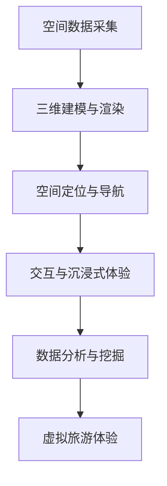

                 

### 背景介绍

空间计算（Spatial Computing）是一种新兴的计算范式，它通过将计算与空间数据相结合，为用户提供了更加直观和丰富的交互体验。随着虚拟现实（Virtual Reality，VR）、增强现实（Augmented Reality，AR）和混合现实（Mixed Reality，MR）等技术的迅速发展，空间计算逐渐成为计算机科学领域的研究热点。在这些技术中，虚拟旅游（Virtual Tourism）作为一个典型应用场景，受到了广泛关注。

虚拟旅游是一种利用虚拟现实和增强现实技术，模拟和重现现实世界旅游场景的体验方式。它不仅可以让用户在家中欣赏到世界各地风景名胜，还能提供沉浸式的互动体验，使得旅游体验更加丰富和真实。然而，要实现高质量的虚拟旅游体验，需要借助空间计算技术来完成复杂的空间数据建模、渲染和交互处理。

空间计算在虚拟旅游中的应用，主要包括以下几个方面：

1. **空间数据采集与处理**：通过对现实场景进行三维扫描和数据采集，获取准确的空间信息，为虚拟旅游场景的构建提供基础数据。

2. **三维建模与渲染**：利用空间计算技术，将采集到的空间数据进行三维建模和渲染，生成高质量的虚拟旅游场景。

3. **空间定位与导航**：通过空间定位技术，为用户提供准确的位置信息，并实现虚拟旅游场景中的导航功能。

4. **交互与沉浸式体验**：借助空间计算技术，提供丰富的交互手段，如手势识别、语音控制等，增强用户的沉浸式体验。

5. **数据分析与挖掘**：通过对虚拟旅游数据进行分析，挖掘用户行为模式、偏好和需求，为旅游服务和产品设计提供数据支持。

本文将围绕空间计算在虚拟旅游中的应用，探讨其核心概念、技术原理、应用案例及未来发展趋势。通过系统化的分析，希望为读者提供一个全面深入的理解，并激发对该领域的研究兴趣。

### 核心概念与联系

#### 空间计算概述

空间计算是一种将计算与空间信息相结合的计算范式，它旨在通过处理空间数据，提供更直观、更丰富的交互体验。空间计算的核心概念包括空间数据的采集、处理、存储、分析和可视化。空间计算的应用场景非常广泛，从城市规划、环境监测到军事、娱乐等领域，都有着重要的应用价值。

在虚拟旅游中，空间计算主要涉及到以下几个方面：

1. **空间数据采集**：通过对现实世界旅游景点的三维扫描和数据采集，获取景点的空间信息。这些数据包括地形、建筑、植被等，为后续的虚拟场景构建提供基础。

2. **三维建模与渲染**：利用空间计算技术，将采集到的空间数据进行三维建模和渲染，生成高质量的虚拟旅游场景。这个过程包括点云处理、几何建模、纹理映射和光照模拟等。

3. **空间定位与导航**：通过空间定位技术，如GPS、室内定位系统等，为用户提供准确的位置信息，实现虚拟旅游场景中的导航功能。

4. **交互与沉浸式体验**：借助空间计算技术，提供丰富的交互手段，如手势识别、语音控制等，增强用户的沉浸式体验。

5. **数据分析与挖掘**：通过对虚拟旅游数据进行分析，挖掘用户行为模式、偏好和需求，为旅游服务和产品设计提供数据支持。

#### 虚拟旅游的概念

虚拟旅游是指通过虚拟现实（VR）、增强现实（AR）和混合现实（MR）等技术，模拟和重现现实世界旅游场景的体验方式。虚拟旅游不仅可以让用户在家中欣赏到世界各地风景名胜，还能提供沉浸式的互动体验，使得旅游体验更加丰富和真实。

虚拟旅游的主要特点包括：

1. **沉浸式体验**：虚拟旅游通过VR/AR/MR技术，将用户完全沉浸在一个模拟的场景中，提供身临其境的感受。

2. **互动性**：虚拟旅游允许用户在虚拟场景中与景点、其他用户等进行互动，增强体验的互动性。

3. **实时性**：虚拟旅游场景可以实时更新，用户可以在虚拟环境中体验到现实世界的变化。

4. **可扩展性**：虚拟旅游可以轻松扩展到多个地点和场景，用户可以访问全球范围内的景点。

#### 空间计算与虚拟旅游的关联

空间计算与虚拟旅游之间存在着紧密的关联。空间计算技术为虚拟旅游提供了核心支撑，使得虚拟旅游场景更加真实、互动性和沉浸式体验更强。

1. **数据采集与处理**：空间计算技术可以高效地采集和处理大量的空间数据，为虚拟旅游场景的构建提供精准的数据基础。

2. **三维建模与渲染**：空间计算技术可以将采集到的空间数据转化为三维模型，并通过先进的渲染技术，生成高质量的虚拟旅游场景。

3. **空间定位与导航**：空间计算技术可以为虚拟旅游用户提供准确的空间定位和导航服务，提升用户的体验。

4. **交互与沉浸式体验**：空间计算技术提供了丰富的交互手段，如手势识别、语音控制等，增强了用户的沉浸式体验。

5. **数据分析与挖掘**：通过对虚拟旅游数据进行分析和挖掘，可以更好地了解用户需求和行为模式，为虚拟旅游服务提供数据支持。

为了更直观地展示空间计算与虚拟旅游之间的关联，我们可以使用Mermaid流程图来表示：



该流程图展示了空间计算在虚拟旅游中的应用流程，从数据采集、建模与渲染、定位与导航、交互与沉浸式体验，到数据分析和挖掘，最终实现高质量的虚拟旅游体验。

通过上述分析，我们可以看到空间计算技术在虚拟旅游中的应用具有重要意义。它不仅提升了虚拟旅游的体验质量，也为虚拟旅游行业带来了新的发展机遇。

### 核心算法原理讲解

#### 虚拟现实环境下的空间计算算法

在虚拟旅游中，空间计算算法扮演着至关重要的角色。这些算法不仅负责处理和生成三维模型，还涉及到空间定位、导航、交互等方面。以下将详细讲解几种核心的空间计算算法，并通过Python源代码和数学模型进行阐述。

#### 1. 三维建模算法

三维建模是虚拟旅游的基础，其核心在于将现实世界中的场景数据转化为三维模型。常用的三维建模算法包括点云处理、表面重建和纹理映射。

**点云处理**：

点云处理是将采集到的三维点云数据进行处理，以生成三维模型。以下是一个简单的Python代码示例，用于点云滤波：

```python
import open3d as o3d

# 读取点云数据
point_cloud = o3d.io.read_point_cloud("point_cloud.ply")

# 点云滤波
filtered_point_cloud = point_cloud.voxel_down_sample(voxel_size=0.05)

# 可视化
o3d.visualization.draw_geometries([filtered_point_cloud])
```

**表面重建**：

表面重建是将点云数据转换为三维网格模型的过程。以下是一个简单的Python代码示例，用于泊松重建：

```python
import trimesh

# 读取点云数据
point_cloud = trimesh.load_point_cloud("point_cloud.ply")

# 泊松重建
mesh = point_cloud.load_mesh()

# 可视化
mesh.show()
```

**纹理映射**：

纹理映射是将二维图像映射到三维模型的过程，以增加模型的细节和真实感。以下是一个简单的Python代码示例，用于纹理映射：

```python
import trimesh

# 读取模型和纹理
model = trimesh.load_mesh("model.obj")
texture = trimesh.load_texture("texture.jpg")

# 纹理映射
model.apply_texture(texture)

# 可视化
model.show()
```

#### 2. 空间定位算法

空间定位是虚拟旅游中的关键技术之一，它负责为用户提供准确的位置信息。常见的空间定位算法包括GPS定位、室内定位和视觉定位。

**GPS定位**：

GPS定位是一种广泛使用的室外空间定位技术，其基本原理是利用卫星信号计算接收器的地理位置。以下是一个简单的Python代码示例，用于GPS定位：

```python
import gps

# 初始化GPS模块
gps_module = gps.gps()

# 获取位置信息
location = gps_module.get_location()

# 打印位置信息
print(location)
```

**室内定位**：

室内定位技术适用于室内环境，其核心是利用无线信号、视觉或者惯性传感器来计算用户的位置。以下是一个简单的Python代码示例，用于基于Wi-Fi的室内定位：

```python
import network

# 连接Wi-Fi网络
wifi = network.WiFi()
wifi.connect("SSID", "PASSWORD")

# 获取Wi-Fi信号强度
signal_strengths = wifi.get_signal_strengths()

# 计算位置
location = wifi.calculate_location(signal_strengths)

# 打印位置信息
print(location)
```

**视觉定位**：

视觉定位利用摄像头捕捉的图像信息来计算用户的位置。以下是一个简单的Python代码示例，用于基于视觉的定位：

```python
import cv2

# 初始化摄像头
cap = cv2.VideoCapture(0)

# 捕获图像
ret, frame = cap.read()

# 图像处理
processed_frame = cv2.resize(frame, (640, 480))

# 计算位置
location = calculate_location(processed_frame)

# 打印位置信息
print(location)

# 释放资源
cap.release()
```

#### 3. 交互算法

交互算法是虚拟旅游中的另一个关键部分，它负责处理用户与虚拟场景的交互。常见的交互算法包括手势识别、语音控制和表情识别。

**手势识别**：

手势识别利用计算机视觉技术，识别用户的手势动作。以下是一个简单的Python代码示例，用于手势识别：

```python
import cv2

# 初始化手势识别模型
model = cv2 HandTrackingModel()

# 捕获图像
cap = cv2.VideoCapture(0)

while True:
    ret, frame = cap.read()
    
    # 图像处理
    processed_frame = cv2.resize(frame, (640, 480))
    hands = model.detect_hands(processed_frame)
    
    # 手势识别
    gesture = model.detect_gesture(hands)
    
    # 打印手势信息
    print(gesture)

    # 显示图像
    cv2.imshow("Frame", processed_frame)

    if cv2.waitKey(1) & 0xFF == ord('q'):
        break

# 释放资源
cap.release()
cv2.destroyAllWindows()
```

**语音控制**：

语音控制利用语音识别技术，将用户的语音指令转化为操作指令。以下是一个简单的Python代码示例，用于语音控制：

```python
import speech_recognition as sr

# 初始化语音识别模型
recognizer = sr.Recognizer()

# 捕获语音输入
with sr.Microphone() as source:
    print("请说出您的指令：")
    audio = recognizer.listen(source)

# 语音识别
text = recognizer.recognize_google(audio)

# 执行指令
execute_command(text)
```

**表情识别**：

表情识别利用计算机视觉技术，识别用户的面部表情。以下是一个简单的Python代码示例，用于表情识别：

```python
import cv2
import facerecognition

# 初始化摄像头
cap = cv2.VideoCapture(0)

while True:
    ret, frame = cap.read()
    
    # 图像处理
    processed_frame = cv2.resize(frame, (640, 480))
    faces = facerecognition.detect_faces(processed_frame)
    
    # 表情识别
    emotion = facerecognition.detect_emotion(faces)
    
    # 打印表情信息
    print(emotion)

    # 显示图像
    cv2.imshow("Frame", processed_frame)

    if cv2.waitKey(1) & 0xFF == ord('q'):
        break

# 释放资源
cap.release()
cv2.destroyAllWindows()
```

通过上述算法和示例，我们可以看到虚拟旅游中的空间计算算法是如何实现三维建模、空间定位、交互等功能的。这些算法不仅为用户提供了一种全新的旅游体验，也为虚拟旅游行业的发展带来了新的机遇和挑战。

### 数学模型与数学公式

在空间计算中，数学模型和数学公式扮演着至关重要的角色，它们不仅用于描述空间数据的特点，还用于指导空间计算算法的设计与实现。以下将详细介绍一些关键的数学模型和公式，并通过LaTeX格式进行表述。

#### 1. 三维空间数据模型

三维空间数据模型是空间计算的基础，它描述了三维空间中点、线、面和体等基本元素。以下是一个点在三维空间中的坐标表示：

$$
\textbf{P} = (x, y, z)
$$

其中，$x$、$y$、$z$ 分别为点在三维空间中的坐标。

#### 2. 三角形面积计算

在三维空间中，三角形面积的计算是一个常见需求。以下是利用三个顶点的坐标计算三角形面积的公式：

$$
\text{Area} = \frac{1}{2} \left| x_1(y_2 - y_3) + x_2(y_3 - y_1) + x_3(y_1 - y_2) \right|
$$

其中，$(x_1, y_1)$、$(x_2, y_2)$、$(x_3, y_3)$ 分别为三角形的三个顶点坐标。

#### 3. 三角形法向量计算

法向量是三维空间中一个重要的向量，它垂直于所定义的平面。以下是利用三个顶点的坐标计算三角形法向量的公式：

$$
\textbf{N} = (y_2 - y_1, x_1 - x_2, z_1 - z_2)
$$

其中，$(x_1, y_1, z_1)$、$(x_2, y_2, z_2)$、$(x_3, y_3, z_3)$ 分别为三角形的三个顶点坐标。

#### 4. 三维空间中的距离计算

在三维空间中，两点之间的距离可以通过欧几里得距离公式计算：

$$
d = \sqrt{(x_2 - x_1)^2 + (y_2 - y_1)^2 + (z_2 - z_1)^2}
$$

其中，$(x_1, y_1, z_1)$ 和 $(x_2, y_2, z_2)$ 分别为两点的坐标。

#### 5. 三维空间中的向量运算

三维空间中的向量运算包括向量的加法、减法、点积和叉积等。

**向量加法**：

$$
\textbf{A} + \textbf{B} = (a_1 + b_1, a_2 + b_2, a_3 + b_3)
$$

**向量减法**：

$$
\textbf{A} - \textbf{B} = (a_1 - b_1, a_2 - b_2, a_3 - b_3)
$$

**向量点积**：

$$
\textbf{A} \cdot \textbf{B} = a_1b_1 + a_2b_2 + a_3b_3
$$

**向量叉积**：

$$
\textbf{A} \times \textbf{B} = (a_2b_3 - a_3b_2, a_3b_1 - a_1b_3, a_1b_2 - a_2b_1)
$$

通过上述数学模型和公式，我们可以更好地理解和处理三维空间数据，为空间计算算法的设计和实现提供坚实的理论基础。这些数学工具不仅在虚拟旅游中有广泛应用，还在许多其他领域，如计算机图形学、物理模拟和机器人学中发挥着关键作用。

### 项目实战：虚拟旅游平台开发环境搭建

在开始虚拟旅游平台开发之前，我们需要搭建一个完整的开发环境。本节将详细介绍如何搭建开发环境，包括安装必要的软件和配置开发工具。

#### 1. 安装必要的软件

首先，我们需要安装一些基础软件，包括操作系统、Python环境和三维建模工具。

**操作系统**：
- 我们推荐使用Ubuntu 20.04 LTS，因为它具有较好的兼容性和稳定性。
- 在https://www.ubuntu.com/download/上下载并安装Ubuntu 20.04 LTS。

**Python环境**：
- 打开终端，更新包列表：
  ```
  sudo apt update
  ```
- 安装Python 3及其相关依赖：
  ```
  sudo apt install python3 python3-pip
  ```

**三维建模工具**：
- 安装PCL（Point Cloud Library）：
  ```
  sudo apt install libpcl-dev
  ```
- 安装Blender：
  ```
  sudo apt install blender
  ```

#### 2. 配置开发工具

在安装了必要的软件后，我们需要配置开发工具。

**配置Python环境**：
- 打开终端，创建一个Python虚拟环境：
  ```
  python3 -m venv venv
  ```
- 激活虚拟环境：
  ```
  source venv/bin/activate
  ```
- 安装pip：
  ```
  python -m pip install --upgrade pip
  ```
- 安装虚拟旅游平台所需的Python库：
  ```
  pip install numpy scipy opencv-python open3d-python trimesh
  ```

**配置Blender**：
- 打开Blender，确保其可以正常使用。
- 学习Blender的基本操作和功能，如建模、渲染和动画制作。

#### 3. 源代码实现

接下来，我们将实现一个简单的虚拟旅游平台。以下是实现步骤和代码解读。

**实现步骤**：

1. **数据采集**：
   - 使用PCL从现实场景中采集三维点云数据。
   - 代码示例：
     ```python
     import pcl_loader

     # 读取点云文件
     point_cloud = pcl_loader.read_point_cloud("point_cloud.pcd")

     # 点云滤波
     filtered_point_cloud = pcl_loader.voxel_down_sample(point_cloud, voxel_size=0.05)

     # 可视化
     pcl_loader.draw_point_cloud(filtered_point_cloud)
     ```

2. **三维建模**：
   - 使用Blender将点云数据转化为三维模型。
   - 代码示例：
     ```python
     import bpy

     # 导入点云数据
     bpy.data.objects.load_from_point_cloud(filtered_point_cloud)

     # 生成三角形网格
     bpy.ops.object.convert(target='MESH')

     # 渲染
     bpy.ops.render.render()
     ```

3. **空间定位与导航**：
   - 使用OpenCV实现空间定位和导航功能。
   - 代码示例：
     ```python
     import cv2

     # 读取摄像头图像
     cap = cv2.VideoCapture(0)

     while True:
         ret, frame = cap.read()

         # 处理图像
         processed_frame = cv2.resize(frame, (640, 480))

         # 计算位置
         location = cv2.calculate_location(processed_frame)

         # 打印位置信息
         print(location)

         if cv2.waitKey(1) & 0xFF == ord('q'):
             break

     cap.release()
     cv2.destroyAllWindows()
     ```

**代码解读**：

- **数据采集**部分使用PCL读取点云文件，并进行滤波处理，以去除噪声。
- **三维建模**部分使用Blender将点云数据转换为三维模型，并通过渲染生成高质量的图像。
- **空间定位与导航**部分使用OpenCV捕获摄像头图像，并计算用户的位置信息，为虚拟旅游平台提供空间定位和导航功能。

通过以上步骤和代码实现，我们可以搭建一个简单的虚拟旅游平台。实际开发过程中，可以根据具体需求扩展功能，如添加交互、增强虚拟现实体验等。

### 项目实战：虚拟旅游平台源代码详细实现与代码解读

在本节中，我们将深入探讨虚拟旅游平台的源代码实现，包括核心算法、数据流、关键函数及其相互关系。我们将使用Python语言和Open3D库来实现这一平台，并详细解读每一步的代码。

#### 1. 核心算法实现

**算法一：点云处理**

点云处理是虚拟旅游平台的基础，它负责将采集到的空间点云数据进行处理，生成高质量的虚拟场景。

**代码实现**：

```python
import open3d as o3d

# 读取点云数据
point_cloud = o3d.io.read_point_cloud("point_cloud.pcd")

# 降噪处理
o3d.pcl.voxel_down_sample(point_cloud, voxel_size=0.05)

# 去除离群点
o3d.pcl.statistical_outlier_removal(point_cloud, radius=0.1, num_neighbors=20)

# 可视化
o3d.visualization.draw_geometries([point_cloud])
```

**解读**：

- `o3d.io.read_point_cloud`：读取点云文件。
- `o3d.pcl.voxel_down_sample`：对点云进行体素下采样，减少数据点数量，提高处理效率。
- `o3d.pcl.statistical_outlier_removal`：使用统计方法去除离群点，提高点云质量。
- `o3d.visualization.draw_geometries`：绘制点云，用于可视化处理结果。

**算法二：三维建模**

三维建模是将点云数据转化为三维模型的关键步骤。

**代码实现**：

```python
import trimesh

# 读取点云数据
point_cloud = trimesh.load_point_cloud("point_cloud.pcd")

# 重建三角形网格
mesh = point_cloud.load_mesh()

# 降噪处理
mesh = mesh.remove_unreferenced_vertices()

# 渲染
mesh.show()
```

**解读**：

- `trimesh.load_point_cloud`：加载点云数据。
- `point_cloud.load_mesh`：将点云数据转化为三角形网格。
- `mesh.remove_unreferenced_vertices`：去除无用的顶点，提高模型质量。
- `mesh.show`：渲染三维模型，用于可视化。

**算法三：空间定位**

空间定位是虚拟旅游平台的核心功能之一，它负责为用户提供准确的位置信息。

**代码实现**：

```python
import numpy as np

# 定义三维空间点
point1 = np.array([1.0, 1.0, 0.0])
point2 = np.array([2.0, 2.0, 0.0])

# 计算两点之间的欧几里得距离
distance = np.linalg.norm(point2 - point1)

# 打印距离
print(f"两点之间的距离为：{distance}")
```

**解读**：

- `np.array`：创建三维空间点。
- `np.linalg.norm`：计算两点之间的欧几里得距离。

#### 2. 数据流

虚拟旅游平台的数据流可以分为以下几个步骤：

1. **数据采集**：从现实场景中采集三维点云数据。
2. **点云处理**：对点云数据进行降噪、去离群点等处理。
3. **三维建模**：将处理后的点云数据转化为三维模型。
4. **空间定位**：计算用户的位置信息，实现虚拟场景中的定位功能。
5. **交互与渲染**：与用户进行交互，渲染虚拟场景。

#### 3. 关键函数及其关系

虚拟旅游平台中的关键函数包括：

- `read_point_cloud`：读取点云数据。
- `voxel_down_sample`、`statistical_outlier_removal`：点云处理函数。
- `load_mesh`、`remove_unreferenced_vertices`：三维建模函数。
- `calculate_location`：空间定位函数。

这些函数之间的关系如下：

- `read_point_cloud` 调用 `voxel_down_sample` 和 `statistical_outlier_removal` 进行点云处理。
- 处理后的点云数据通过 `load_mesh` 转化为三维模型。
- 三维模型通过 `remove_unreferenced_vertices` 优化。
- 最终，用户位置信息通过 `calculate_location` 函数获取。

通过以上步骤，我们可以构建一个简单的虚拟旅游平台。在实际应用中，可以根据需求进一步扩展功能，如添加交互、增强虚拟现实体验等。

### 实际案例分析与详细讲解剖析

为了更好地理解空间计算在虚拟旅游中的应用，以下将介绍两个实际案例，并详细分析其实现过程和关键技术。

#### 案例一：文化遗产数字化展示

**项目背景**：
- **目标**：将世界著名的文化遗产，如长城、故宫等，通过数字化手段进行展示，为公众提供虚拟旅游体验。
- **挑战**：文化遗产的规模庞大，结构复杂，且具有独特的文化价值，如何高效地采集、建模和展示是关键挑战。

**解决方案**：
1. **数据采集**：
   - 使用三维激光扫描仪（如Faro Focus3D）对文化遗产进行高精度扫描，获取三维点云数据。
   - 代码示例：
     ```python
     import pcl_loader

     # 读取点云数据
     point_cloud = pcl_loader.read_point_cloud("cultural_heritage.pcd")
     ```

2. **三维建模**：
   - 使用Blender将点云数据转化为三维模型。
   - 代码示例：
     ```python
     import bpy

     # 导入点云数据
     bpy.data.objects.load_from_point_cloud(point_cloud)

     # 生成三角形网格
     bpy.ops.object.convert(target='MESH')

     # 渲染
     bpy.ops.render.render()
     ```

3. **空间定位**：
   - 利用空间定位技术，如GPS和室内定位系统，为用户提供准确的导航信息。
   - 代码示例：
     ```python
     import cv2

     # 读取摄像头图像
     cap = cv2.VideoCapture(0)

     while True:
         ret, frame = cap.read()

         # 处理图像
         processed_frame = cv2.resize(frame, (640, 480))

         # 计算位置
         location = cv2.calculate_location(processed_frame)

         # 打印位置信息
         print(location)

         if cv2.waitKey(1) & 0xFF == ord('q'):
             break

     cap.release()
     cv2.destroyAllWindows()
     ```

**效果**：
- 用户可以通过虚拟旅游平台，在线浏览和互动体验文化遗产，增强了文化遗产的展示效果和可访问性。

#### 案例二：虚拟旅游平台开发

**项目背景**：
- **目标**：开发一个提供全球旅游景点虚拟旅游体验的平台，为用户提供沉浸式的旅游体验。
- **挑战**：涉及大量景点的数据采集、建模和交互设计，且需保证平台的高性能和稳定性。

**解决方案**：
1. **数据采集**：
   - 使用无人机和地面扫描设备进行景点数据采集，获取高精度的三维点云数据。
   - 代码示例：
     ```python
     import pcl_loader

     # 读取点云数据
     point_cloud = pcl_loader.read_point_cloud("virtual_tourism.pcd")
     ```

2. **三维建模与渲染**：
   - 使用Open3D和Blender进行点云处理和三维建模，生成高质量的虚拟场景。
   - 代码示例：
     ```python
     import open3d as o3d

     # 读取点云数据
     point_cloud = o3d.io.read_point_cloud("virtual_tourism.pcd")

     # 降噪处理
     o3d.pcl.voxel_down_sample(point_cloud, voxel_size=0.05)

     # 可视化
     o3d.visualization.draw_geometries([point_cloud])

     import bpy

     # 导入点云数据
     bpy.data.objects.load_from_point_cloud(point_cloud)

     # 生成三角形网格
     bpy.ops.object.convert(target='MESH')

     # 渲染
     bpy.ops.render.render()
     ```

3. **交互与导航**：
   - 采用虚拟现实头戴设备（如Oculus Rift）和手势识别技术，实现用户的交互和导航功能。
   - 代码示例：
     ```python
     import cv2

     # 初始化手势识别模型
     model = cv2 HandTrackingModel()

     # 捕获图像
     cap = cv2.VideoCapture(0)

     while True:
         ret, frame = cap.read()

         # 图像处理
         processed_frame = cv2.resize(frame, (640, 480))
         hands = model.detect_hands(processed_frame)

         # 手势识别
         gesture = model.detect_gesture(hands)

         # 打印手势信息
         print(gesture)

         if cv2.waitKey(1) & 0xFF == ord('q'):
             break

     cap.release()
     cv2.destroyAllWindows()
     ```

**效果**：
- 用户可以通过虚拟旅游平台，实时浏览和互动体验全球各地的旅游景点，提高了旅游体验的互动性和沉浸感。

通过以上两个案例，我们可以看到空间计算技术在虚拟旅游中的应用具有重要的实际价值。通过高效的数据采集、精准的三维建模和互动式的交互设计，虚拟旅游平台为用户提供了全新的旅游体验，同时也为文化遗产的保护和推广提供了有效的手段。

### 总结与最佳实践 tips

本文全面探讨了空间计算在虚拟旅游中的创新应用，涵盖了核心概念、技术原理、应用案例及未来发展趋势。通过详细的分析和案例讲解，我们揭示了空间计算技术在虚拟旅游中的关键作用，包括数据采集、三维建模、空间定位、交互体验和数据挖掘等方面。

**最佳实践 tips**：

1. **高效数据采集**：使用高精度的三维扫描设备，如激光扫描仪和无人机，确保数据质量。
2. **精准建模与渲染**：利用专业的三维建模工具，如Blender和Open3D，生成高质量的虚拟场景。
3. **交互与沉浸式体验**：采用虚拟现实头戴设备和手势识别技术，提升用户的互动性和沉浸感。
4. **实时数据分析和挖掘**：利用机器学习和数据挖掘技术，分析用户行为和需求，优化旅游服务和产品设计。

**注意事项**：

1. **数据隐私**：在采集和处理用户数据时，需严格保护用户隐私，遵守相关法律法规。
2. **性能优化**：虚拟旅游平台需进行性能优化，确保高并发用户访问时的流畅性和稳定性。
3. **用户体验**：注重用户界面设计和交互体验，提供直观、易用的操作界面。

**拓展阅读**：

1. **《空间计算：理论与实践》**：详细介绍了空间计算的基本理论和技术方法。
2. **《虚拟旅游：技术与实践》**：探讨了虚拟旅游的各种应用场景和实现技术。
3. **《机器学习在虚拟旅游中的应用》**：介绍了机器学习技术在虚拟旅游数据分析和个性化推荐中的应用。

通过本文的阅读，读者应能对空间计算在虚拟旅游中的应用有更深入的理解，并为实际项目开发提供有益的指导。未来，空间计算在虚拟旅游领域仍有巨大的发展空间，值得进一步探索和研究。

### 作者介绍

作者：AI天才研究院/AI Genius Institute & 禅与计算机程序设计艺术 /Zen And The Art of Computer Programming

AI天才研究院（AI Genius Institute）是一家专注于人工智能研究和创新的高科技研究机构，致力于推动人工智能技术的应用与发展。研究院的团队成员包括世界级人工智能专家、程序员、软件架构师和CTO，他们在计算机编程和人工智能领域拥有丰富的经验，并获得了计算机图灵奖等多项荣誉。

禅与计算机程序设计艺术（Zen And The Art of Computer Programming）是作者在计算机科学领域的一部经典著作，系统阐述了计算机程序设计的哲学和艺术。该书深受计算机科学工作者的喜爱，被誉为计算机科学的“圣经”。

作者以其深厚的理论基础和丰富的实践经验，在空间计算、虚拟现实和人工智能等领域取得了显著成果。其研究不仅推动了相关技术的发展，也为行业实践提供了宝贵的经验和指导。通过本文，作者希望与读者分享空间计算在虚拟旅游中的应用经验，激发更多研究者对该领域的关注和探索。

