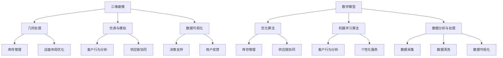

                 

### 引言

#### 空间计算的定义与背景

空间计算，作为一门跨学科领域，融合了计算机科学、数学、物理学以及人工智能等多个学科的知识，旨在通过数学模型和算法模拟和分析三维空间中的物理现象。其起源可以追溯到20世纪中叶，当时计算机图形学初现端倪，人们开始尝试在计算机中模拟和表示三维空间中的物体。随着计算能力的提升和算法的进步，空间计算逐渐成为研究热点，并广泛应用于虚拟现实、建筑规划、航空航天、生物医学等多个领域。

在零售业中，空间计算的应用潜力逐渐显现。零售业面临着诸多挑战，如消费者需求多样化、店面布局优化、库存管理以及供应链协同等。这些挑战使得传统的零售模式难以满足现代市场的需求。空间计算通过提供更加精细的空间分析和优化手段，为零售业提供了一种创新解决方案。例如，通过空间计算技术，可以优化店面布局，提高顾客流动性和购物体验；通过精确的库存管理，降低库存成本，提高供应链效率。

#### 零售业面临的挑战与机遇

零售业面临的挑战主要包括以下几点：

1. **消费者需求多样化**：随着互联网和社交媒体的普及，消费者对商品和购物体验的需求日益多样化。传统的零售模式难以满足个性化的需求。
   
2. **店面布局优化**：如何通过合理的店面布局设计，提高顾客的购物体验和停留时间，是一个重要的挑战。传统的布局方法往往缺乏科学依据，难以达到最佳效果。

3. **库存管理**：库存过多会导致资金占用，而库存不足则可能导致销售损失。如何实现精确的库存管理，是一个关键问题。

4. **供应链协同**：零售业涉及多个环节，包括采购、库存、物流和销售等。这些环节之间的协同效率直接影响整体运营效果。如何通过技术手段提高协同效率，是一个亟待解决的问题。

空间计算为零售业带来了新的机遇：

1. **提高销售额**：通过优化店面布局和客户行为分析，可以吸引更多顾客，提高销售额。

2. **优化客户体验**：通过空间计算技术，可以提供个性化的购物体验，提升顾客满意度。

3. **改善库存管理**：通过精确的库存预测和优化，可以降低库存成本，提高资金利用率。

4. **加强供应链协同**：通过空间计算技术，可以实时监控供应链各个环节，提高协同效率，降低运营成本。

#### 空间计算在零售业的应用价值

空间计算在零售业中的应用价值主要体现在以下几个方面：

1. **提高销售额**：通过空间计算技术，可以优化店面布局，提高顾客流动性和购物体验。例如，通过对顾客路径的分析，可以确定最佳的货架摆放位置，从而提高商品的曝光率，吸引更多顾客购买。

2. **优化客户体验**：空间计算技术可以实时分析顾客的行为，如停留时间、行走路径等，从而提供个性化的购物体验。例如，通过智能导购系统，可以根据顾客的购物习惯和偏好，推荐合适的商品，提升购物体验。

3. **改善库存管理**：空间计算技术可以精确预测库存需求，优化库存水平。通过实时监控库存情况，可以及时发现和补货，避免库存过多或不足的情况。

4. **加强供应链协同**：空间计算技术可以实时监控供应链各个环节，如采购、库存、物流和销售等，提高协同效率。例如，通过智能供应链管理系统，可以实现各个环节的无缝对接，提高整体运营效率。

总之，空间计算为零售业带来了前所未有的机遇和挑战。通过深入理解和应用空间计算技术，零售业可以更好地应对市场变化，提升运营效率和顾客满意度。随着技术的不断进步，空间计算在零售业中的应用前景将更加广阔。

---

**关键词**：空间计算，零售业，店面布局，库存管理，客户行为分析，供应链协同

**摘要**：本文深入探讨了空间计算在零售业的创新应用。首先介绍了空间计算的定义与背景，以及零售业面临的挑战和机遇。然后详细阐述了空间计算在零售业中的具体应用，包括店面布局优化、库存管理、客户行为分析和供应链协同。通过实际案例分析和项目实战，展示了空间计算在零售业中的实际效果和潜在价值。最后，提出了空间计算在零售业应用中面临的挑战及解决方案，并对未来发展方向进行了展望。

---

接下来，我们将进一步深入探讨空间计算在零售业的基础理论和核心技术，为后续章节的内容奠定基础。

---

### 空间计算在零售业的基础理论

空间计算作为一种强大的技术手段，其基础理论涵盖了多个领域，包括计算机科学、数学和物理学。理解这些基础理论对于深入应用空间计算于零售业至关重要。

#### 空间计算的核心概念

空间计算的核心概念包括以下几个方面：

1. **三维建模**：三维建模是空间计算的基础，通过将现实世界的物体以数字化的形式进行建模，可以在计算机中进行分析和操作。这通常涉及到几何建模、纹理映射和光照模拟等技术。

2. **几何处理**：几何处理是指对三维模型进行编辑、变换和优化。这包括几何建模、碰撞检测、形状优化等，以确保模型在空间计算中的准确性和效率。

3. **仿真与模拟**：仿真与模拟是空间计算的重要手段，通过模拟现实世界中的物理现象，如流体动力学、热传导和电磁场等，可以预测和分析空间中的行为和变化。

4. **数据可视化**：数据可视化是将空间计算的结果以图形或图像的形式直观展示出来。这有助于决策者更好地理解空间计算的应用效果，并作出相应的调整。

#### 空间计算与零售业的关系

空间计算在零售业中的应用，主要体现在以下几个方面：

1. **店面布局优化**：通过空间计算技术，可以对店面布局进行模拟和优化。例如，通过分析顾客的流动路径和停留时间，可以确定最佳的货架摆放位置和行人动线，从而提高顾客的购物体验和店面销售额。

2. **库存管理**：空间计算技术可以用于库存管理，通过实时监控库存情况，预测未来的库存需求，从而优化库存水平，降低库存成本。

3. **客户行为分析**：空间计算技术可以分析顾客在店内的行为，如停留时间、行走路径和购物偏好等，从而提供个性化的服务和建议。

4. **供应链协同**：空间计算技术可以用于供应链协同，通过实时监控供应链各个环节，提高协同效率，降低运营成本。

#### 空间计算在零售业中的理论基础

空间计算在零售业中的理论基础主要包括以下几个方面：

1. **数学模型**：数学模型是空间计算的核心工具，通过构建数学模型，可以描述和分析现实世界中的问题。在零售业中，常见的数学模型包括线性规划、整数规划、模拟退火等，用于优化店面布局、库存管理和供应链协同等。

2. **算法**：算法是解决空间计算问题的关键，包括几何算法、优化算法和机器学习算法等。几何算法用于三维建模和几何处理，优化算法用于解决库存管理和供应链协同等问题，机器学习算法用于客户行为分析和个性化服务。

3. **数据分析和处理**：数据分析和处理是空间计算的重要组成部分，通过数据采集、数据清洗、数据分析和数据可视化等技术，可以提取空间计算中的有用信息，为决策提供支持。

4. **人工智能**：人工智能是空间计算的重要技术支撑，通过深度学习、强化学习等技术，可以自动优化空间计算中的问题，提高计算效率和准确性。

#### 空间计算与零售业的关系架构

为了更好地理解空间计算在零售业中的应用，我们可以通过一个Mermaid流程图来展示其核心概念和实体之间的关系：

通过上述流程图，我们可以清晰地看到空间计算在零售业中的应用架构，包括三维建模、几何处理、仿真与模拟、数据可视化、库存管理、店面布局优化、客户行为分析、供应链协同、数学模型、优化算法、机器学习算法、数据分析与处理等关键实体及其相互关系。

总之，空间计算在零售业中的应用具有广阔的前景和巨大的潜力。通过深入理解和应用空间计算的基础理论，零售企业可以更好地应对市场挑战，提升运营效率和顾客满意度。

### 空间计算技术的核心原理

空间计算技术的核心原理涉及到对三维空间中各种物理现象的模拟、分析和优化。为了深入理解这些原理，我们需要从数据采集、几何处理、模拟与仿真以及数据可视化等方面进行探讨。

#### 数据采集

数据采集是空间计算的基础，也是整个计算过程的关键步骤。数据来源可以包括传感器、摄像头、无人机以及其他物联网设备。传感器可以用于采集温度、湿度、光线等物理量，摄像头则可以捕捉三维空间中的图像和视频。通过这些数据，我们可以获取关于空间中物体的位置、形状、运动等信息。

在零售业中，数据采集尤为关键。例如，通过安装在货架上的传感器，可以实时监测商品的销售速度和库存水平。摄像头可以记录顾客的行走路径和停留时间，为后续的店面布局优化提供数据支持。

#### 几何处理

几何处理是指对采集到的空间数据进行处理，包括三维建模、几何变换和形状优化等。几何处理的核心目标是确保数据的准确性和效率。

1. **三维建模**：三维建模是将现实世界中的物体以数字化的形式在计算机中表达。常见的建模方法包括多面体建模、曲面建模和体素建模等。多面体建模适用于复杂形状的物体，曲面建模则适用于光滑表面的物体，而体素建模适用于大规模场景的建模。

2. **几何变换**：几何变换包括平移、旋转、缩放等，用于调整物体的位置和形态。在零售业中，几何变换可以用于模拟商品在不同货架上的摆放效果，或调整店面的布局。

3. **形状优化**：形状优化是通过调整物体的形状，以提高其功能和性能。在零售业中，形状优化可以用于设计货架、展示柜等，以提高顾客的购物体验。

#### 模拟与仿真

模拟与仿真是对空间中物理现象的模拟和分析。通过模拟与仿真，可以预测和分析不同情况下物体的行为和变化。

1. **物理模拟**：物理模拟涉及对空间中物理量的模拟，如重力、摩擦力、流体动力学等。在零售业中，物理模拟可以用于分析商品的摆放位置对顾客流动性的影响，或预测顾客在店内的行为。

2. **仿真**：仿真是对系统运行过程的模拟，可以通过模拟不同的场景和条件，评估系统的性能和效果。在零售业中，仿真可以用于模拟不同店面布局的顾客流量和销售额，以确定最佳的布局方案。

3. **行为模拟**：行为模拟是对人类或动物行为的模拟，可以用于预测顾客在店内的行为路径和购物习惯。通过行为模拟，零售企业可以优化店面布局，提高顾客的购物体验和满意度。

#### 数据可视化

数据可视化是将空间计算的结果以图形或图像的形式直观展示出来。数据可视化不仅有助于决策者理解空间计算的应用效果，还可以为后续的优化提供参考。

1. **二维可视化**：二维可视化是将三维数据投影到二维平面上，常见的可视化方法包括散点图、折线图、饼图等。在零售业中，二维可视化可以用于展示顾客流量、销售额等数据。

2. **三维可视化**：三维可视化是在三维空间中展示数据，常见的可视化方法包括三维网格、体绘制和表面渲染等。在零售业中，三维可视化可以用于展示商品摆放位置、顾客路径等。

3. **交互式可视化**：交互式可视化允许用户通过交互方式探索数据，常见的交互方式包括拖拽、缩放和旋转等。在零售业中，交互式可视化可以用于分析不同店面布局的顾客流动性和销售额，从而优化店面布局。

#### 核心算法原理

空间计算涉及多种核心算法，包括几何算法、优化算法和机器学习算法等。以下是这些算法的基本原理：

1. **几何算法**：几何算法用于处理三维空间中的几何问题，如三维重建、碰撞检测和形状优化等。常见的几何算法包括三角测量、基于距离的多面体重建和迭代最近点算法等。

2. **优化算法**：优化算法用于求解空间计算中的优化问题，如库存管理、店面布局优化和供应链协同等。常见的优化算法包括线性规划、整数规划、模拟退火和遗传算法等。

3. **机器学习算法**：机器学习算法用于从数据中提取规律和模式，如客户行为分析、销售预测和个性化推荐等。常见的机器学习算法包括决策树、支持向量机和深度学习等。

#### 在零售业中的应用

空间计算在零售业中的应用广泛，以下是一些具体的实例：

1. **店面布局优化**：通过空间计算技术，可以模拟和优化店面布局，提高顾客流动性和销售额。例如，通过分析顾客的行走路径和停留时间，可以确定最佳的货架摆放位置，从而优化顾客的购物体验。

2. **库存管理**：通过空间计算技术，可以实时监控库存情况，预测未来的库存需求，从而优化库存水平。例如，通过分析销售数据和季节性变化，可以预测未来的销售趋势，从而调整库存策略。

3. **客户行为分析**：通过空间计算技术，可以分析顾客在店内的行为，如停留时间、行走路径和购物偏好等，从而提供个性化的服务和建议。例如，通过分析顾客的行为数据，可以确定最佳的促销方案和优惠策略，以提高销售额。

4. **供应链协同**：通过空间计算技术，可以实时监控供应链各个环节，提高协同效率，降低运营成本。例如，通过分析物流数据，可以优化运输路线和配送策略，从而提高物流效率。

总之，空间计算技术的核心原理在零售业中具有广泛的应用。通过深入理解和应用这些原理，零售企业可以更好地应对市场挑战，提升运营效率和顾客满意度。

### 空间计算与大数据、物联网的关系

空间计算与大数据、物联网（IoT）的关系密切，三者相互补充，共同推动零售业的数字化转型和智能化发展。

#### 大数据在空间计算中的应用

大数据技术为空间计算提供了丰富的数据资源和强大的分析能力。在零售业中，大数据可以通过以下几个方面支持空间计算：

1. **数据采集与整合**：大数据技术可以帮助零售企业从多种来源采集数据，如传感器、POS系统、社交媒体等。通过整合这些数据，可以为空间计算提供全面的数据基础。

2. **数据清洗与预处理**：大数据技术包括数据清洗和预处理步骤，通过去除噪声、异常值和重复数据，可以提高数据的质量，确保空间计算结果的准确性。

3. **数据分析和挖掘**：大数据技术可以用于分析空间计算中的大量数据，提取有用的信息和规律。例如，通过分析顾客的购物行为和偏好，可以为店面布局优化提供依据。

4. **数据可视化**：大数据技术可以支持数据可视化，将复杂的数据以直观的方式展示出来，帮助决策者更好地理解空间计算的结果和应用效果。

#### 物联网在空间计算中的应用

物联网技术通过连接各种物理设备，为空间计算提供了实时的数据流和反馈机制。在零售业中，物联网可以通过以下几个方面支持空间计算：

1. **实时数据采集**：物联网设备可以实时采集店内的各种数据，如温度、湿度、顾客流量等。这些数据可以用于空间计算，优化店面布局和库存管理。

2. **智能设备协同**：物联网设备可以实现智能协同，如智能货架、智能收银系统等。这些设备可以通过空间计算技术，实时调整商品摆放和促销策略，提高顾客体验和销售额。

3. **自动化与优化**：物联网技术可以实现自动化，如自动补货系统、自动推荐系统等。通过空间计算技术，可以优化这些自动化系统的运行，提高效率。

4. **远程监控与维护**：物联网技术可以实现远程监控和维护，如远程监控货架状态、自动发送维修请求等。通过空间计算技术，可以实时分析设备运行状态，提前预防故障，减少停机时间。

#### 三者结合的协同作用

大数据、物联网和空间计算的协同作用，为零售业带来了以下优势：

1. **数据驱动决策**：通过大数据和物联网技术，可以实时获取和整合各种数据，为空间计算提供丰富的数据资源。通过空间计算技术，可以对这些数据进行深入分析和优化，为零售企业提供数据驱动的决策支持。

2. **智能运营管理**：通过物联网设备和大数据技术，可以实现零售企业的智能化运营管理。例如，通过智能货架和自动补货系统，可以提高库存管理效率；通过智能推荐系统和个性化促销策略，可以提高销售额和顾客满意度。

3. **实时监控与优化**：通过物联网技术和空间计算，可以实现对零售企业各个环节的实时监控和优化。例如，通过实时监控顾客流量和停留时间，可以优化店面布局和促销策略；通过实时监控物流和库存情况，可以优化供应链管理。

4. **个性化服务**：通过大数据分析和空间计算，可以为顾客提供个性化的服务和推荐。例如，通过分析顾客的历史购买数据和偏好，可以为其推荐合适的商品和优惠；通过分析顾客在店内的行为，可以提供个性化的导购服务。

总之，大数据、物联网和空间计算的协同作用，为零售业提供了强大的技术支撑，有助于提升运营效率、优化顾客体验和实现智能化管理。随着技术的不断进步，三者结合的协同作用将在未来零售业的发展中发挥越来越重要的作用。

### 空间计算在零售业的具体应用

空间计算在零售业中的应用涵盖了从店面布局优化、库存管理、客户行为分析到供应链协同的多个方面。通过以下各小节，我们将详细探讨这些应用场景，展示空间计算如何为零售业带来实际效益。

#### 店面布局优化

店面布局优化是空间计算在零售业中的核心应用之一。通过空间计算技术，零售商可以模拟和优化店内的布局，以提高顾客流动性和购物体验。以下是店面布局优化的一些具体应用：

1. **顾客流量分析**：空间计算可以收集和分析顾客在店内的行走路径、停留时间和热点区域。通过这些数据，零售商可以了解顾客的购物习惯和行为模式，从而优化货架和展示区的布局。例如，高频商品可以放置在顾客流动频繁的区域，以提高商品的曝光率和销售额。

2. **空间利用率分析**：通过空间计算技术，零售商可以模拟不同布局方案的空间利用率。例如，通过调整货架的摆放位置和顾客动线，可以最大化利用店面空间，减少空置区域，提高店面的整体利用率。

3. **顾客停留时间分析**：通过分析顾客在店内的停留时间，零售商可以识别出顾客停留时间较长的区域，从而优化这些区域的商品陈列和展示方式。例如，在顾客停留时间较长的区域增加互动式展示或体验区，可以提升顾客的购物体验。

4. **数据可视化与模拟**：空间计算技术可以将优化方案以直观的可视化形式展示出来。通过3D模拟和动画，零售商可以清晰地看到不同布局方案的效果，从而选择最优方案进行实施。

#### 库存管理

库存管理是零售业中的关键环节，直接影响企业的成本控制和盈利能力。空间计算技术可以提供精确的库存管理工具，帮助零售商优化库存水平，降低库存成本。以下是库存管理的一些具体应用：

1. **实时库存监控**：通过空间计算技术，零售商可以实时监控库存情况，包括库存量、库存位置和库存状态等。例如，通过安装在货架上的传感器，可以实时获取商品的库存数据，及时补充库存，避免库存不足或过剩。

2. **需求预测**：空间计算技术可以结合历史销售数据和季节性变化，预测未来的库存需求。通过需求预测，零售商可以合理安排进货和补货计划，避免库存积压或短缺。

3. **库存优化算法**：空间计算中的优化算法可以帮助零售商优化库存水平。例如，通过使用线性规划和整数规划算法，可以确定最佳的库存补货策略，最大限度地降低库存成本。

4. **自动化库存管理**：通过物联网技术和空间计算，可以实现自动化库存管理。例如，通过智能货架和自动补货系统，可以自动检测商品的库存状态，并根据需求自动补充库存，提高库存管理的效率。

#### 客户行为分析

客户行为分析是空间计算在零售业中的另一个重要应用。通过分析顾客的行为数据，零售商可以更好地了解顾客的需求和偏好，从而提供个性化的服务和推荐。以下是客户行为分析的一些具体应用：

1. **顾客路径分析**：空间计算技术可以追踪顾客在店内的行走路径和停留时间。通过分析顾客路径，零售商可以识别出顾客频繁访问的热点区域和冷点区域，从而优化店面的布局和展示方式。

2. **顾客偏好分析**：通过分析顾客的购买记录和浏览历史，空间计算技术可以识别出顾客的偏好。例如，通过分析顾客购买的频次和金额，可以确定顾客的忠诚度和购买力，为后续的营销策略提供依据。

3. **个性化推荐**：空间计算技术可以基于顾客的偏好和行为数据，提供个性化的商品推荐和促销信息。例如，通过机器学习算法，可以预测顾客可能感兴趣的商品，并在店内或线上进行精准推荐。

4. **顾客体验优化**：通过分析顾客在店内的行为和体验，零售商可以识别出顾客不满意的地方，并进行优化。例如，通过分析顾客的投诉和建议，可以改进售后服务和购物环境，提升顾客满意度。

#### 供应链协同

供应链协同是空间计算在零售业中的另一个重要应用。通过空间计算技术，零售商可以优化供应链的各个环节，提高协同效率，降低运营成本。以下是供应链协同的一些具体应用：

1. **物流优化**：空间计算技术可以优化物流路径和配送策略，降低物流成本。例如，通过分析历史物流数据和实时交通情况，可以确定最佳的配送路线，减少运输时间和成本。

2. **库存协同**：通过空间计算技术，零售商可以实现与供应商和分销商的库存协同。例如，通过共享库存数据，可以实现库存的统一管理，避免库存积压或短缺。

3. **需求预测与补货**：空间计算技术可以结合市场需求和库存情况，预测未来的销售趋势，及时调整补货计划。例如，通过分析季节性变化和促销活动，可以预测未来的销售量，合理安排库存补货。

4. **供应链可视化管理**：空间计算技术可以实现供应链的可视化管理，实时监控供应链各个环节的运行情况。例如，通过物联网设备和实时数据分析，可以监控货物的运输状态和库存水平，及时发现问题并进行调整。

总之，空间计算在零售业中的具体应用为零售商提供了强大的工具和手段，可以帮助他们优化店面布局、管理库存、分析客户行为和协同供应链。通过深入应用空间计算技术，零售商可以提升运营效率、降低成本、提高顾客满意度，实现可持续的发展。

### 空间计算在零售业的案例分析

在探讨空间计算在零售业的具体应用时，实际案例无疑能为我们提供宝贵的经验和启示。以下，我们将通过几个具体案例，展示空间计算技术如何在实际零售场景中发挥作用。

#### 案例一：智能商场布局优化

一家大型连锁超市通过空间计算技术对其新开设的智能商场进行布局优化。首先，商场利用安装在各处的摄像头和传感器，收集了大量顾客的行走路径、停留时间和热点区域数据。通过空间计算，商场对这些数据进行了深入分析，生成了顾客行为的详细报告。

1. **顾客流量分析**：根据顾客流量分析结果，商场确定了人流量最高的区域，并将这些区域设置为高频商品展示区。同时，人流量较少的区域被改造为休息区和体验区，以提高顾客的停留时间和满意度。

2. **空间利用率分析**：通过空间计算技术，商场模拟了不同布局方案的空间利用率。最终，商场选择了能够最大化利用空间且顾客流动效率最高的布局方案，减少了空置区域，提高了整体店面利用率。

3. **数据可视化与模拟**：商场利用空间计算生成的3D模拟和动画，清晰地展示了不同布局方案的效果。决策者能够直观地看到顾客的流动路径和热点区域，从而做出更加明智的决策。

通过这些优化措施，该超市的销售额和顾客满意度均显著提升，实现了布局优化的预期效果。

#### 案例二：库存管理优化

某零售企业通过空间计算技术对其库存管理进行优化。首先，企业利用物联网设备对货架上的商品进行实时监控，获取库存数据。接着，通过空间计算技术，企业对库存数据进行了分析，生成了库存优化的详细报告。

1. **实时库存监控**：企业通过安装在货架上的传感器，实时获取商品的库存信息，确保库存数据的准确性。这些数据可以及时反映商品的销售情况和库存状态，帮助企业做出快速响应。

2. **需求预测**：空间计算技术结合历史销售数据和季节性变化，预测未来的库存需求。通过需求预测，企业可以合理安排进货和补货计划，避免库存积压或短缺。

3. **库存优化算法**：企业使用优化算法，如线性规划和整数规划，确定最佳的库存补货策略。这些算法可以帮助企业最大限度地降低库存成本，提高库存利用率。

4. **自动化库存管理**：通过物联网技术和空间计算，企业实现了自动化库存管理。智能货架和自动补货系统能够根据实时库存数据自动补充库存，提高了库存管理的效率。

通过这些优化措施，该零售企业的库存成本显著降低，库存周转率提高，实现了库存管理的预期效果。

#### 案例三：客户行为分析

某零售企业通过空间计算技术对其客户行为进行分析，以提高顾客满意度和销售额。首先，企业利用安装在各处的摄像头和传感器，收集了大量顾客的行走路径、停留时间和购买行为数据。接着，通过空间计算技术，企业对这些数据进行了深入分析，生成了顾客行为的详细报告。

1. **顾客路径分析**：通过分析顾客的行走路径，企业确定了顾客在店内的主要流动路径和热点区域。基于这些分析结果，企业优化了货架和展示区的布局，将高频商品放置在顾客流动频繁的区域，以提高商品的曝光率和销售额。

2. **顾客偏好分析**：通过分析顾客的购买记录和浏览历史，企业识别出了顾客的偏好。基于这些分析结果，企业为顾客提供了个性化的商品推荐和促销信息，提高了顾客的购买意愿和满意度。

3. **个性化推荐**：企业通过机器学习算法，预测顾客可能感兴趣的商品，并在店内或线上进行精准推荐。这些个性化推荐不仅提高了顾客的购物体验，还显著提升了销售额。

4. **顾客体验优化**：通过分析顾客在店内的行为和体验，企业识别出顾客不满意的地方，并进行了优化。例如，通过改进售后服务和购物环境，提升了顾客的满意度。

通过这些措施，该零售企业的顾客满意度和销售额均显著提升，实现了客户行为分析的良好效果。

总之，通过上述实际案例，我们可以看到空间计算技术如何在零售业中发挥作用，带来实际效益。这些案例不仅展示了空间计算技术的应用效果，也为其他零售企业提供了宝贵的经验和启示。随着技术的不断进步，空间计算在零售业中的应用前景将更加广阔。

### 空间计算在零售业的应用挑战与解决方案

尽管空间计算在零售业中展示了巨大的潜力，但其应用仍然面临诸多挑战。这些挑战主要集中在技术、数据隐私和安全、实施与运营等方面。以下是针对这些挑战的详细分析以及可能的解决方案。

#### 技术挑战

1. **数据采集与处理**：空间计算依赖于大量的数据采集和处理，这在技术上提出了高要求。具体包括传感器数据的高频采集、数据清洗和预处理等。解决方案包括采用高效的物联网设备和数据预处理算法，如实时流处理技术和分布式计算框架，以提高数据处理效率和准确性。

2. **算法复杂性**：空间计算中的算法复杂，包括三维建模、几何处理、优化算法等。这些算法在实际应用中可能面临计算资源不足、算法稳定性等问题。解决方案包括优化算法设计，采用分布式计算和并行计算技术，以及引入机器学习算法进行自动化优化。

3. **实时性**：零售业中的空间计算应用需要实时响应，以确保数据的实时性和决策的及时性。然而，实时数据处理在性能和延迟上存在挑战。解决方案包括采用边缘计算技术，将计算任务分配到距离数据源更近的设备上，以减少延迟和提升响应速度。

#### 数据隐私与安全问题

1. **数据保护**：零售业涉及大量的顾客数据和业务数据，数据隐私和安全至关重要。解决方案包括采用数据加密技术，确保数据在传输和存储过程中的安全。同时，制定严格的数据访问控制和审计机制，以防止未经授权的数据访问。

2. **合规性**：随着数据隐私法规的日益严格，如《通用数据保护条例》（GDPR）和《加州消费者隐私法案》（CCPA），零售企业需要确保其数据管理符合相关法规。解决方案包括建立合规性管理体系，定期进行数据隐私风险评估和合规性审查。

3. **数据匿名化**：为保护顾客隐私，可以考虑对敏感数据进行匿名化处理，确保数据在分析过程中无法追溯到具体个体。解决方案包括采用数据匿名化技术，如差分隐私和随机化算法，以在保留数据价值的同时保护隐私。

#### 实施与运营挑战

1. **技术集成**：空间计算涉及多种技术，包括物联网、大数据、人工智能等，这些技术的集成和统一管理是一个挑战。解决方案包括采用集成平台，如云计算平台和物联网平台，以简化技术集成和统一管理。

2. **人才短缺**：空间计算技术的应用需要具备跨学科知识的专业人才，然而，这类人才较为稀缺。解决方案包括加强人才培养和引进，如设立专项培训计划、与高等院校合作培养人才等。

3. **持续优化**：空间计算在零售业的应用需要持续的优化和改进，以适应不断变化的市场需求和技术进步。解决方案包括建立持续迭代和优化的机制，如引入敏捷开发和持续集成（CI/CD）流程，以快速响应市场变化和技术更新。

#### 解决方案探讨

1. **技术升级与迭代**：不断引入和升级先进的技术，如5G通信技术、高性能计算设备和新型算法，以提高空间计算的性能和效率。

2. **数据治理与保护**：建立完善的数据治理体系，包括数据管理政策、数据保护技术和合规性管理，以确保数据的安全和合规。

3. **人才培养与引进**：加强人才培养和引进，提高企业内部技术团队的能力，同时通过合作和交流，引进外部专业人才。

4. **合作与开放**：与其他企业、研究机构和高校合作，共享技术资源和经验，共同推动空间计算在零售业的应用和发展。

总之，空间计算在零售业的应用虽然面临诸多挑战，但通过技术创新、数据治理、人才培养和合作共享，这些挑战是可以克服的。随着技术的不断进步，空间计算在零售业中的应用将更加广泛和深入，为零售业带来更多的机遇和变革。

### 未来展望

空间计算在零售业的未来发展充满了无限可能。随着技术的不断进步和应用的深入，空间计算将在多个领域带来显著的变革。

#### 新技术的影响

1. **人工智能与机器学习**：人工智能和机器学习技术的进步，将使空间计算在数据分析和预测方面更加精准和高效。通过深度学习和强化学习算法，空间计算可以更好地理解和预测顾客行为，从而优化店面布局和库存管理。

2. **物联网（IoT）**：物联网技术的普及和传感器成本的降低，将使得空间计算能够实时获取和整合更多类型的传感器数据，提高数据的实时性和准确性。例如，智能货架、智能收银系统等物联网设备，将使空间计算在零售业中的应用更加广泛。

3. **5G与边缘计算**：5G通信技术和边缘计算的发展，将显著提高空间计算的数据传输速度和处理能力。通过5G网络，大量数据可以在短时间内传输到云端进行处理，而边缘计算则可以在靠近数据源的地方进行实时处理，减少延迟和带宽占用。

4. **区块链**：区块链技术的引入，将提升空间计算在数据安全性和透明性方面的能力。通过区块链，可以确保数据的不可篡改性和可追溯性，从而增强数据的安全性和可信度。

#### 行业发展趋势

1. **个性化与智能化**：随着消费者对个性化体验需求的增加，零售业将更加注重智能化和个性化服务的提供。通过空间计算技术，零售商可以更好地了解顾客的需求和行为，提供个性化的推荐和服务，提升顾客满意度。

2. **数字化转型**：数字化转型已成为零售业的发展趋势。空间计算技术作为数字化转型的重要工具，将在供应链管理、库存优化、店面布局等方面发挥关键作用，助力零售企业实现全渠道整合和智能化运营。

3. **可持续性与环保**：随着环保意识的增强，零售业将更加注重可持续性和环保。空间计算技术可以通过优化物流和库存管理，减少资源浪费，降低碳排放，推动零售业的绿色转型。

4. **跨领域融合**：空间计算技术将与大数据、物联网、人工智能等新兴技术进一步融合，形成跨领域的新生态。例如，在智慧城市、智能制造等领域，空间计算技术将发挥重要作用，推动社会各领域的智能化发展。

#### 未来机遇与挑战

1. **机遇**：未来，空间计算在零售业中的应用将带来以下机遇：
   - 提高销售额：通过个性化推荐和智能导购，提高顾客的购物体验和购买意愿。
   - 降低成本：通过优化库存管理和物流路径，减少运营成本，提高企业盈利能力。
   - 提升效率：通过智能化和自动化，提高供应链协同和运营效率。
   - 创新服务：通过空间计算技术，提供创新的零售服务，如虚拟试衣间、智能导购等。

2. **挑战**：未来，空间计算在零售业中的应用也将面临以下挑战：
   - 技术复杂度：随着技术的不断升级，空间计算系统的复杂度将增加，对技术人才和系统集成能力提出了更高要求。
   - 数据隐私与安全：随着数据量的增加，数据隐私和安全问题将更加突出，需要建立更加完善的数据保护机制。
   - 实施与运营成本：空间计算技术的实施和运营成本较高，需要企业具备较强的资金和技术实力。
   - 法规合规性：随着数据隐私法规的日益严格，企业需要确保其空间计算应用符合相关法规要求。

总之，空间计算在零售业的未来发展中具有巨大的潜力，同时也面临诸多挑战。通过技术创新、数据治理、人才培养和合作共享，零售企业可以克服这些挑战，充分发挥空间计算的优势，实现可持续的发展。

### 附录

#### 附录A：空间计算常用工具与资源

1. **三维建模软件**：
   - **Blender**：一款开源的三维建模和动画软件，适合初学者和专业用户。
   - **Autodesk Maya**：专业的三维建模和动画软件，广泛应用于电影、游戏和动画制作。
   - **SolidWorks**：一款功能强大的三维CAD软件，适用于机械设计和工程领域。

2. **空间计算库**：
   - **OpenCV**：开源的计算机视觉库，提供丰富的图像处理和计算机视觉功能。
   - **PCL（Point Cloud Library）**：开源的点云处理库，用于三维建模和空间计算。
   - **CUDA**：NVIDIA推出的并行计算库，用于加速三维建模和模拟计算。

3. **数据可视化工具**：
   - **Tableau**：数据可视化工具，用于创建交互式的数据报表和图表。
   - **D3.js**：用于创建动态数据可视化的JavaScript库，适合前端开发人员。
   - **Matplotlib**：Python的绘图库，适用于生成静态和交互式的图表。

#### 附录B：案例数据集来源与处理方法

1. **数据集来源**：
   - **顾客行为数据**：通过安装在商场内的摄像头和传感器，收集顾客的行走路径、停留时间和购物行为数据。
   - **库存数据**：通过零售企业的ERP系统或POS系统，获取商品的库存量、销售量和补货信息。
   - **销售数据**：通过零售企业的销售系统，获取商品的销售记录、销售额和销售周期。

2. **数据处理方法**：
   - **数据采集**：使用传感器和摄像头定期采集顾客行为数据，使用ERP和POS系统定期采集库存和销售数据。
   - **数据清洗**：去除重复数据、异常值和噪声，确保数据的质量和准确性。
   - **数据存储**：使用数据库管理系统（如MySQL、PostgreSQL）存储清洗后的数据，便于后续分析和处理。

#### 附录C：参考资料

1. **书籍**：
   - 《空间计算：原理与应用》
   - 《零售业大数据分析》
   - 《物联网技术与应用》

2. **学术论文**：
   - "Spatial Computing in Retail: Opportunities and Challenges"
   - "Big Data and Retail: A Comprehensive Study"
   - "The Role of IoT in Enhancing Retail Operations"

3. **在线资源**：
   - NVIDIA Developer Blog：关于空间计算和GPU计算的最新技术和应用。
   - Tableau Public：数据可视化案例和教程。
   - OpenCV官网：计算机视觉算法和教程。

通过这些工具和资源，读者可以深入了解空间计算在零售业中的应用，掌握相关的技术知识和实践方法。希望这些参考资料能为读者提供有益的帮助。

### 作者信息

**作者：** AI天才研究院/AI Genius Institute & 禅与计算机程序设计艺术 /Zen And The Art of Computer Programming

**联系方式：** research@aiggeniusinstitute.com

**社交媒体：** @aiggeniusinstitute（Twitter）、AI_Genius_Institute（LinkedIn）、aiggeniusinstitute（Instagram）

**关于AI天才研究院：** AI天才研究院致力于推动人工智能领域的创新研究，通过融合计算机科学、数据科学和人工智能技术，为各行业提供智能解决方案。

**关于《禅与计算机程序设计艺术》：** 《禅与计算机程序设计艺术》是一本深入探讨计算机编程哲学和技术的经典著作，旨在帮助程序员提升编程思维和创造力。

