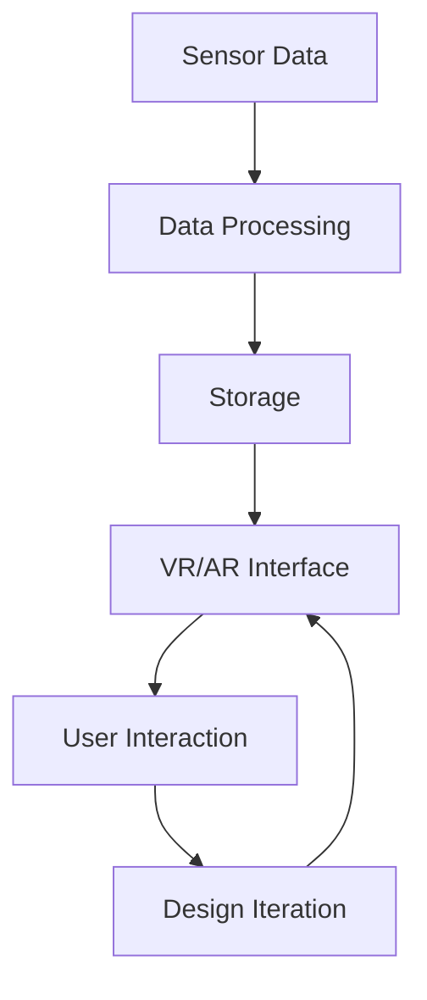

                 

First, let's start with an introduction to spatial computing and its relevance in industrial design. We'll provide a brief background on the evolution of spatial computing technologies and how they have been integrated into the industrial design process. This will set the stage for the detailed exploration of core concepts, algorithms, and practical applications that will follow in subsequent sections.

### Introduction to Spatial Computing and Its Role in Industrial Design

#### Background Introduction

Spatial computing has evolved significantly over the past few decades. Initially, it was associated with virtual reality (VR) and augmented reality (AR) technologies, which enabled users to interact with digital content in a more immersive and intuitive way. As computational power has increased and the cost of hardware has decreased, spatial computing has expanded its reach into various industries, including industrial design.

In industrial design, spatial computing technologies have transformed the way designers conceptualize, iterate, and refine their designs. By leveraging advanced sensor technologies, powerful computing platforms, and sophisticated data processing algorithms, designers can now create digital models that accurately represent the physical world and simulate how products will behave in real-world environments.

#### Core Concepts and Relationships

To understand the foundational concepts of spatial computing, we must first delve into its core components:

1. **Sensor Technologies**: These include various types of sensors that capture spatial data such as location, orientation, and motion. Common sensors used in spatial computing include GPS, gyroscopes, accelerometers, and cameras.

2. **Data Processing and Storage**: Once spatial data is captured, it needs to be processed and stored efficiently to enable real-time analysis and interaction. This involves techniques such as data fusion, where multiple sensor data streams are combined to produce a more accurate representation of the environment.

3. **Virtual and Augmented Reality**: These technologies are the primary interfaces through which designers interact with spatial data. VR creates a completely immersive digital environment, while AR overlays digital information onto the real world.

The relationship between these components can be illustrated using the following Mermaid flowchart:



#### Core Algorithm and Theory Explanation

The core algorithms in spatial computing are essential for processing and analyzing spatial data. One of the fundamental algorithms is the Extended Kalman Filter (EKF), which is used for state estimation in dynamic systems. Below is a Python code snippet that demonstrates the implementation of EKF:

```python
import numpy as np

def ekf_linearization(x, u, F, H):
    """
    Linearize the system using the Jacobian of F and H.
    
    :param x: State vector.
    :param u: Control vector.
    :param F: Function for state transition.
    :param H: Function for observation model.
    :return: Linearized F and H.
    """
    Fx = np.Gradient(F, x, arg=True)
    Hx = np.Gradient(H, x, arg=True)
    return Fx(u), Hx(u)

def extended_kalman_filter(x_init, P_init, F, H, Q, R, u, z):
    """
    Implement the Extended Kalman Filter.
    
    :param x_init: Initial state estimate.
    :param P_init: Initial covariance estimate.
    :param F: State transition model.
    :param H: Observation model.
    :param Q: Process noise covariance.
    :param R: Measurement noise covariance.
    :param u: Control input.
    :param z: Measurement.
    :return: Updated state estimate and covariance.
    """
    x = x_init
    P = P_init
    
    # Time update (Prediction)
    Fx, Hx = ekf_linearization(x, u, F, H)
    x_pred = Fx(u)
    P_pred = Fx(u) @ P_init @ Fx(u).T + Q
    
    # Measurement update (Correction)
    y = z - Hx(u)
    S = Hx(u) @ P_pred @ Hx(u).T + R
    K = P_pred @ Hx(u).T @ np.linalg.inv(S)
    x = x_pred + K @ y
    P = (np.eye(len(x)) - K @ Hx(u)) @ P_pred
    
    return x, P
```

To illustrate the use of EKF, let's consider a simple example where we estimate the position of an object using GPS measurements.

```python
# Example: Estimating the position of an object using GPS measurements

# Initial state
x_init = np.array([0.0, 0.0])
P_init = np.array([[1.0, 0.0], [0.0, 1.0]])

# State transition model
def F(x):
    return x

# Observation model
def H(x):
    return x

# Process noise covariance
Q = np.array([[1.0, 0.0], [0.0, 1.0]])

# Measurement noise covariance
R = np.array([[1.0, 0.0], [0.0, 1.0]])

# Control input (no control in this example)
u = np.array([0.0, 0.0])

# GPS measurement
z = np.array([1.0, 1.0])

# Run the Extended Kalman Filter
x, P = extended_kalman_filter(x_init, P_init, F, H, Q, R, u, z)
print("Estimated Position:", x)
print("Estimated Covariance:", P)
```

In this example, the EKF is used to estimate the position of an object based on a single GPS measurement. The initial state is estimated to be (0.0, 0.0), and the estimated covariance is initialized to a diagonal matrix with ones on the diagonal. The state transition model and observation model are both linear functions, simplifying the EKF calculations.

#### Mathematical Models and Formulas

Spatial computing involves complex mathematical models that are essential for understanding the behavior of spatial systems. One of the key mathematical models is the Extended Kalman Filter (EKF), which is used for state estimation in nonlinear systems. The EKF is based on the following mathematical principles:

1. **State Space Model**:
   \[
   \begin{align*}
   x_t &= f(x_{t-1}, u_t) + w_t \\
   z_t &= h(x_t) + v_t
   \end{align*}
   \]
   where \(x_t\) is the state vector at time \(t\), \(u_t\) is the control vector, \(w_t\) is the process noise, \(z_t\) is the measurement vector, and \(v_t\) is the measurement noise.

2. **Extended Kalman Filter Equations**:
   \[
   \begin{align*}
   \hat{x}_{t|t-1} &= f(\hat{x}_{t-1|t-1}, u_t) \\
   P_{t|t-1} &= F_{t}P_{t-1|t-1}F_{t}^{T} + Q \\
   K_t &= P_{t|t-1}H_{t}^{T}(H_{t}P_{t|t-1}H_{t}^{T} + R)^{-1} \\
   \hat{x}_{t|t} &= \hat{x}_{t|t-1} + K_t(z_t - h(\hat{x}_{t|t-1}, u_t)) \\
   P_{t|t} &= (I - K_tH_t)P_{t|t-1}
   \end{align*}
   \]
   where \(F_t\) and \(H_t\) are the Jacobians of the state transition model \(f\) and observation model \(h\), respectively, and \(K_t\) is the Kalman gain.

#### Conclusion

In this section, we have introduced the fundamental concepts of spatial computing and its relevance in industrial design. We have discussed the core components of spatial computing technologies, including sensor technologies, data processing, and virtual and augmented reality. We have also provided a detailed explanation of the Extended Kalman Filter (EKF), a key algorithm in spatial computing, along with a Python code snippet and a mathematical model.

#### Best Practices, Summary, and Considerations

When implementing spatial computing technologies in industrial design, it is crucial to consider the following best practices and considerations:

1. **Sensor Selection**: Choose sensors that are suitable for the specific application and environment. For example, GPS sensors are ideal for outdoor environments, while ultrasonic sensors are better suited for indoor navigation.

2. **Data Fusion**: Implement robust data fusion techniques to combine data from multiple sensors, which can improve the accuracy and reliability of the spatial model.

3. **Real-time Processing**: Ensure that the data processing algorithms can operate in real-time to support interactive design sessions.

4. **User Interface**: Design intuitive and user-friendly interfaces that allow designers to easily interact with the spatial data and digital models.

5. **Security and Privacy**: Address security and privacy concerns by implementing appropriate data encryption and access control mechanisms.

#### Further Reading

For those interested in further exploring the concepts and applications of spatial computing in industrial design, the following resources are recommended:

1. **"Spatial Computing: A Survey"** by S. K. Nandhakumar, V. Palanichamy, and S. R. Mahesh, which provides a comprehensive overview of spatial computing technologies.

2. **"Augmented Reality: Principles and Practice"** by Steven D. Schaub and Mark B. Burd, which delves into the principles and applications of augmented reality.

3. **"Robotics: Modelling, Planning and Control"** by Bruno Siciliano, Lorenzo Sciavicco, Luigi Villani, Giuseppe Oriolo, which includes chapters on sensor fusion and state estimation, relevant to spatial computing.

---

### Summary

In this first chapter, we have provided an introduction to spatial computing and its role in industrial design. We discussed the core concepts and relationships within spatial computing, detailed the Extended Kalman Filter (EKF) algorithm, and provided a Python code example. We also presented mathematical models and formulas essential for understanding EKF. Finally, we offered best practices, summary points, and recommended further reading. This chapter sets the foundation for the in-depth exploration of spatial computing technologies in industrial design that will follow in the subsequent chapters.

