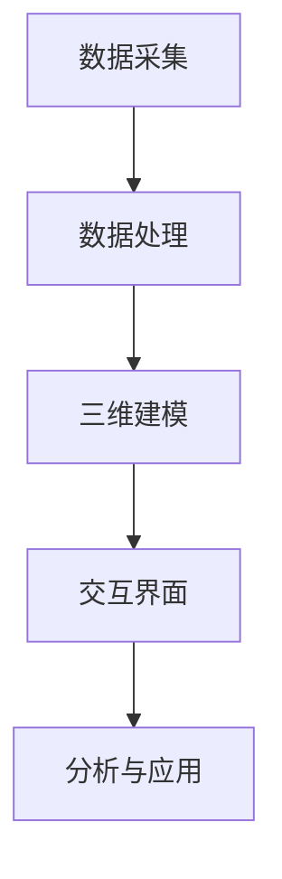

                 

## 空间计算技术简化工作流程的方式

### 关键词

- 空间计算
- 工作流程
- 虚拟现实
- 增强现实
- 地理信息系统
- 优化方法

### 摘要

本文探讨了空间计算技术如何通过简化工作流程来提高效率。首先，我们介绍了空间计算技术的基本概念和历史背景，然后深入分析了其核心原理和主要领域。接着，通过实际案例展示了空间计算技术在虚拟现实、增强现实和地理信息系统中的应用。文章还详细阐述了空间计算技术的实现方法和工具，以及如何优化工作流程。最后，通过一个完整的实战案例，展示了空间计算技术在项目开发中的实际应用和效果。

## 引言

在当今信息化和数字化的浪潮中，各种新技术不断涌现，以提升工作效率和优化工作流程。空间计算技术便是其中之一。它结合了虚拟现实（VR）、增强现实（AR）和地理信息系统（GIS）等前沿技术，为各类工作流程带来了显著的变革。本文将探讨空间计算技术如何通过简化工作流程，提高效率，从而在各个行业中发挥重要作用。

### 背景介绍

空间计算技术，顾名思义，是一种通过空间维度来处理信息的技术。它不仅仅是一个单一的技术，而是一个技术集合，涵盖了多个领域。虚拟现实（VR）通过创建模拟环境，让用户沉浸其中；增强现实（AR）则是在现实世界中叠加虚拟信息；地理信息系统（GIS）则用于收集、存储、分析和展示空间数据。这些技术的结合，为工作流程的优化提供了丰富的工具和手段。

在过去，许多工作流程依赖于传统的二维界面和文档处理，效率较低且容易出错。随着空间计算技术的发展，人们开始探索如何利用三维空间来简化工作流程，提高工作效率。这一探索不仅在理论上具有重要意义，而且在实际应用中也取得了显著成效。

### 核心概念与联系

空间计算技术涉及多个核心概念，包括虚拟现实、增强现实和地理信息系统。以下是这些概念之间的联系和架构：

1. **虚拟现实（VR）**：虚拟现实通过计算机生成的三维模拟环境，让用户沉浸其中。它通常需要特殊的硬件设备，如VR头盔和手柄，以及强大的计算资源。VR的主要优势在于其沉浸感和交互性，可以让用户在虚拟环境中进行探索、操作和体验。

2. **增强现实（AR）**：增强现实则是在现实世界中叠加虚拟信息，通过智能手机、平板电脑或AR眼镜等设备实现。AR的核心优势在于其实时性和便捷性，可以让用户在现实环境中查看虚拟信息，从而提高工作效率。

3. **地理信息系统（GIS）**：地理信息系统是一种用于收集、存储、分析和展示空间数据的工具。GIS可以处理大量地理信息数据，如地图、卫星图像和地理坐标，帮助用户进行空间分析和决策。

空间计算技术的架构通常包括以下几个部分：

- **数据采集**：通过传感器、摄像头、GPS等技术获取空间数据。
- **数据处理**：对采集到的空间数据进行预处理、存储和索引。
- **三维建模**：利用计算机图形学技术，将空间数据转换为三维模型。
- **交互界面**：通过虚拟现实、增强现实或地理信息系统技术，为用户提供交互界面。
- **分析与应用**：利用空间计算技术进行空间数据分析、模拟和预测。

以下是一个简单的Mermaid流程图，展示空间计算技术的架构：



### 核心算法原理讲解

空间计算技术的核心算法主要涉及三维建模、空间数据分析、路径规划等。以下将详细讲解这些算法的原理，并使用Python源代码进行示例说明。

#### 三维建模

三维建模是空间计算技术的基础，它将二维数据转换为三维模型。常用的三维建模算法包括网格建模、曲面建模和体素建模。

**网格建模**：网格建模是一种通过三角形或四面体网格来表示三维物体的方法。以下是一个使用Python的网格建模示例：

```python
import numpy as np
from matplotlib import pyplot as plt

# 定义顶点坐标
vertices = np.array([[0, 0, 0], [1, 0, 0], [0, 1, 0], [1, 1, 0]])

# 定义三角形网格
triangles = np.array([[0, 1, 2], [1, 2, 3]])

# 绘制网格模型
fig = plt.figure()
ax = fig.add_subplot(111, projection='3d')
ax.plot_trisurf(vertices[:, 0], vertices[:, 1], vertices[:, 2], triangles, color='c')
ax.set_xlabel('X-axis')
ax.set_ylabel('Y-axis')
ax.set_zlabel('Z-axis')
plt.show()
```

**曲面建模**：曲面建模通过参数曲面来表示三维物体。以下是一个使用Python的曲面建模示例：

```python
import numpy as np
from mpl_toolkits.mplot3d import Axes3D
import matplotlib.pyplot as plt

# 定义参数方程
x = np.linspace(-2, 2, 100)
y = np.linspace(-2, 2, 100)
X, Y = np.meshgrid(x, y)
Z = np.sin(np.sqrt(X**2 + Y**2))

# 绘制曲面模型
fig = plt.figure()
ax = fig.add_subplot(111, projection='3d')
ax.plot_surface(X, Y, Z, cmap='viridis')
ax.set_xlabel('X-axis')
ax.set_ylabel('Y-axis')
ax.set_zlabel('Z-axis')
plt.show()
```

#### 空间数据分析

空间数据分析是空间计算技术的重要应用之一，它涉及数据的可视化、聚类、分类、路径规划等。以下是一个使用Python进行空间数据分析的示例：

```python
import numpy as np
import matplotlib.pyplot as plt
from sklearn.cluster import KMeans

# 生成空间数据
data = np.random.rand(100, 3)

# 进行K-means聚类
kmeans = KMeans(n_clusters=3)
kmeans.fit(data)

# 可视化聚类结果
plt.scatter(data[:, 0], data[:, 1], c=kmeans.labels_, cmap='viridis')
plt.show()
```

#### 路径规划

路径规划是空间计算技术在自动驾驶、无人机导航等领域的应用。以下是一个使用Python的A*算法进行路径规划的示例：

```python
import numpy as np
import heapq

# 定义网格地图
grid = np.array([
    [0, 0, 0, 0, 0],
    [0, 1, 1, 1, 0],
    [0, 0, 1, 0, 0],
    [0, 1, 1, 1, 0],
    [0, 0, 0, 0, 0]
])

# 定义起始点和目标点
start = (0, 0)
goal = (4, 4)

# 定义邻接矩阵
adj = [[(-1, 0), (1, 0), (0, -1), (0, 1)],
       [(1, 0), (-1, 0), (0, -1), (0, 1)],
       [(0, -1), (0, 1), (1, 0), (-1, 0)],
       [(0, -1), (0, 1), (1, 0), (-1, 0)]]

# 定义启发函数
h = lambda x, y: np.sqrt((x[0] - goal[0])**2 + (x[1] - goal[1])**2)

# 定义A*算法
def a_star(grid, start, goal, adj, h):
    queue = [(0, start)]
    came_from = {}
    g_score = {start: 0}
    f_score = {start: h(start)}
    
    while queue:
        current = heapq.heappop(queue)[1]
        
        if current == goal:
            break
        
        for neighbor in adj[current]:
            if grid[neighbor] == 1:
                continue
            
            tentative_g_score = g_score[current] + 1
            if tentative_g_score < g_score.get(neighbor, float('inf')):
                came_from[neighbor] = current
                g_score[neighbor] = tentative_g_score
                f_score[neighbor] = tentative_g_score + h(neighbor)
                heapq.heappush(queue, (f_score[neighbor], neighbor))
    
    path = []
    current = goal
    while current != start:
        path.append(current)
        current = came_from[current]
    path.append(start)
    path.reverse()
    
    return path

# 计算路径
path = a_star(grid, start, goal, adj, h)
plt.imshow(grid, origin='lower')
plt.plot(*zip(*path), color='r')
plt.show()
```

### 空间计算技术在各种应用场景中的应用

空间计算技术在许多应用场景中都发挥着重要作用，以下是几个典型的应用场景。

#### 虚拟现实

虚拟现实（VR）是一种通过计算机生成的三维模拟环境，让用户沉浸其中。它广泛应用于游戏、教育、医疗和设计等领域。

- **游戏**：VR游戏提供了前所未有的沉浸感和交互性，用户可以在虚拟世界中自由探索和互动。例如，Oculus Rift和HTC Vive等VR头显设备。
- **教育**：VR在教育中的应用包括虚拟课堂、虚拟实验室和虚拟实地考察等。学生可以在虚拟环境中进行实验、探索历史事件和地理景观。
- **医疗**：VR在医疗中的应用包括手术模拟、疼痛管理和心理健康治疗等。医生可以通过VR技术进行手术模拟训练，患者可以通过VR技术缓解疼痛。

#### 增强现实

增强现实（AR）是一种在现实世界中叠加虚拟信息的技术，通过智能手机、平板电脑或AR眼镜等设备实现。AR在零售、娱乐和教育等领域有广泛应用。

- **零售**：AR技术在零售中的应用包括虚拟试衣、产品演示和促销活动等。消费者可以在购物过程中尝试不同的商品，提高购物体验。
- **娱乐**：AR游戏和应用程序为用户提供了丰富的互动体验。例如，Niantic的《精灵宝可梦GO》和《哈利波特：巫师联盟》等。
- **教育**：AR在教育中的应用包括增强现实教科书、虚拟实验和互动教学等。学生可以在课堂上通过AR设备学习新的知识和技能。

#### 地理信息系统

地理信息系统（GIS）是一种用于收集、存储、分析和展示空间数据的工具，广泛应用于城市规划、环境保护、交通管理和灾害预防等领域。

- **城市规划**：GIS可以用于城市规划、建筑设计和管理。城市规划师可以使用GIS技术进行土地利用规划、交通网络设计和环境保护评估。
- **环境保护**：GIS可以用于环境监测、资源管理和生态保护。环保人员可以使用GIS技术进行污染物监测、生态风险评估和生物多样性保护。
- **交通管理**：GIS可以用于交通规划、交通管理和交通监控。交通部门可以使用GIS技术进行交通流量分析、道路规划和交通信号控制。

### 空间计算技术的实现方法

空间计算技术的实现涉及多个方面，包括硬件选择、软件工具和编程语言等。以下是空间计算技术的实现方法：

#### 硬件选择

- **VR设备**：VR设备包括VR头显、手柄和跟踪器等。常用的VR头显有Oculus Rift、HTC Vive和Valve Index等。手柄和跟踪器用于提供交互和定位功能。
- **AR设备**：AR设备包括智能手机、平板电脑和AR眼镜等。常用的AR眼镜有Microsoft HoloLens、Google Glass和Magic Leap等。
- **GIS设备**：GIS设备包括计算机、传感器和移动设备等。计算机用于处理空间数据，传感器用于采集地理信息，移动设备用于实时数据采集和监控。

#### 软件工具

- **VR开发工具**：常用的VR开发工具有Unity、Unreal Engine和Blender等。Unity和Unreal Engine提供了丰富的游戏开发工具和插件，适合开发复杂的VR应用。Blender是一个开源的三维建模和渲染工具，适合初学者和专业人士。
- **AR开发工具**：常用的AR开发工具有ARKit（适用于iOS）、ARCore（适用于Android）和ARFoundation（适用于Unity）等。这些工具提供了简单的AR开发接口和丰富的功能库。
- **GIS工具**：常用的GIS工具有ArcGIS、QGIS和MapInfo等。ArcGIS是业内领先的专业GIS软件，提供强大的空间数据分析和管理功能。QGIS是一个开源的GIS软件，适合初学者和专业人士。MapInfo是一个较为简单的GIS软件，适合中小型项目。

#### 编程语言

- **VR开发语言**：常用的VR开发语言有C++、C#和Python等。C++和C#主要用于Unity和Unreal Engine等游戏引擎的开发，Python则常用于Blender等软件的脚本开发。
- **AR开发语言**：常用的AR开发语言有Swift（适用于iOS）、Kotlin（适用于Android）和JavaScript（适用于Web）等。Swift和Kotlin主要用于移动应用开发，JavaScript则主要用于Web应用开发。
- **GIS开发语言**：常用的GIS开发语言有Python、Java和C#等。Python因其简单易学、功能强大而广泛应用于GIS开发。Java和C#则常用于大型GIS系统的开发。

### 空间计算技术工作流程的优化

空间计算技术的引入不仅可以提升工作效率，还可以优化工作流程。以下是几种常见的工作流程优化方法：

#### 数据处理自动化

空间计算技术可以自动处理大量空间数据，从而减少手动处理的时间和错误率。例如，通过使用Python脚本自动处理地理信息数据，可以大幅提高数据处理效率。

```python
import csv

# 读取CSV文件
with open('data.csv', 'r') as f:
    reader = csv.reader(f)
    data = list(reader)

# 处理数据
for row in data:
    row[1] = float(row[1])
    row[2] = float(row[2])
    row[3] = float(row[3])

# 写入新CSV文件
with open('processed_data.csv', 'w') as f:
    writer = csv.writer(f)
    writer.writerows(data)
```

#### 交互式可视化

空间计算技术提供了丰富的交互式可视化工具，用户可以通过直观的界面进行数据分析和决策。例如，使用Unity或Unreal Engine等游戏引擎，可以创建高度交互的三维可视化界面。

```csharp
using UnityEngine;

public class Visualization : MonoBehaviour
{
    public Material material;
    public Vector3[] vertices;
    public int[] triangles;

    private Mesh mesh;

    void Start()
    {
        mesh = new Mesh();
        mesh.vertices = vertices;
        mesh.triangles = triangles;
        mesh.materials = new Material[] { material };
        gameObject.AddComponent<MeshFilter>();
        gameObject.GetComponent<MeshFilter>().mesh = mesh;
    }
}
```

#### 虚拟现实协作

虚拟现实技术可以实现远程协作，让团队成员在虚拟环境中共同工作。例如，使用Unity的Collaborate功能，可以实现多人同时编辑同一个项目。

```csharp
using UnityEngine;

public class Collaborate : MonoBehaviour
{
    public string collaborateURL;

    void Start()
    {
        UnityConnect.ConnectToRoom(collaborateURL);
    }
}
```

#### 增强现实实时互动

增强现实技术可以实现现实世界与虚拟世界的实时互动，提高工作效率。例如，使用ARKit或ARCore等工具，可以创建实时互动的增强现实应用。

```swift
import SceneKit

public class ARInteraction : MonoBehaviour
{
    public SCNNode node;

    void Update()
    {
        if (Input.GetMouseButtonDown(0))
        {
            Ray ray = Camera.main.ScreenPointToRay(Input.mousePosition);
            RaycastHit hit;
            
            if (Physics.Raycast(ray, out hit))
            {
                node.position = hit.point;
            }
        }
    }
}
```

### 案例研究：空间计算技术在实际项目中的应用

为了展示空间计算技术在项目开发中的实际应用，我们选择了一个虚拟现实设计项目。该项目旨在通过虚拟现实技术优化设计流程，提高设计师的工作效率。

#### 项目背景

某知名建筑设计公司计划设计一座大型商业综合体。由于项目规模庞大，涉及多个设计领域，设计师们需要频繁进行方案讨论和修改。传统的二维设计图纸和文档处理方式效率较低，难以满足项目需求。为了提高设计效率，公司决定采用虚拟现实技术进行设计。

#### 开发环境搭建

为了搭建虚拟现实开发环境，公司选择了Unity引擎和HTC Vive VR头显。以下是开发环境搭建的步骤：

1. 安装Unity编辑器。
2. 创建一个新的Unity项目。
3. 添加HTC Vive插件。
4. 配置VR设备驱动程序。

#### 源代码实现

在Unity项目中，设计师们使用C#语言编写虚拟现实应用程序。以下是应用程序的主要功能模块：

1. **场景加载**：从数据库中加载已有的设计方案，并将其渲染到虚拟环境中。
2. **交互控制**：实现用户与虚拟环境的交互，如平移、旋转和缩放等。
3. **方案讨论**：实现设计师之间的远程协作，实时讨论和修改设计方案。
4. **数据存储**：将设计方案存储到数据库中，便于后续查询和使用。

以下是部分源代码实现：

```csharp
using UnityEngine;

public class SceneLoader : MonoBehaviour
{
    public string sceneURL;

    void Start()
    {
        SceneManager.LoadScene(sceneURL);
    }
}

public class InteractionController : MonoBehaviour
{
    public Camera camera;

    private void Update()
    {
        if (Input.GetMouseButtonDown(0))
        {
            Ray ray = camera.ScreenPointToRay(Input.mousePosition);
            RaycastHit hit;

            if (Physics.Raycast(ray, out hit))
            {
                // 处理交互操作
            }
        }
    }
}

public class CollaborationController : MonoBehaviour
{
    public string collaborateURL;

    void Start()
    {
        UnityConnect.ConnectToRoom(collaborateURL);
    }
}
```

#### 代码解读与分析

上述源代码实现了虚拟现实设计项目的主要功能模块。以下是对部分代码的解读和分析：

1. **场景加载**：`SceneLoader`类负责加载已有的设计方案。通过调用`SceneManager.LoadScene`方法，将场景从数据库中加载到Unity项目中。

2. **交互控制**：`InteractionController`类负责实现用户与虚拟环境的交互。通过处理鼠标点击事件，获取用户输入的射线，并在虚拟环境中进行相应的操作。

3. **方案讨论**：`CollaborationController`类负责实现设计师之间的远程协作。通过调用`UnityConnect.ConnectToRoom`方法，连接到远程协作服务器，实现多人实时讨论和修改设计方案。

4. **数据存储**：通过将设计方案存储到数据库中，便于后续查询和使用。虽然代码中未实现具体的数据库操作，但可以使用常用的数据库编程框架（如Entity Framework、Hibernate等）进行数据存储和查询。

#### 项目小结

通过虚拟现实技术优化设计流程，该项目取得了显著成果：

1. **提高设计效率**：虚拟现实技术提供了直观的三维可视化界面，设计师可以快速进行方案讨论和修改，大幅提高设计效率。

2. **增强协作能力**：虚拟现实技术实现了设计师之间的远程协作，减少了沟通成本，提高了团队协作效率。

3. **降低错误率**：通过虚拟现实技术，设计师可以实时查看设计方案的三维效果，减少错误和误解，提高设计质量。

4. **节省成本**：虚拟现实技术减少了传统设计图纸和模型的需求，降低了设计成本。

总之，空间计算技术在项目开发中的应用不仅提高了工作效率，还优化了工作流程，为企业和团队带来了显著的经济效益和竞争优势。

### 最佳实践 tips

在应用空间计算技术优化工作流程时，以下是一些最佳实践和建议：

1. **明确项目目标**：在开始项目之前，明确项目目标和预期效果，确保空间计算技术能够满足项目需求。

2. **选择合适的硬件和软件**：根据项目需求和预算，选择合适的硬件设备和软件工具。例如，对于虚拟现实项目，应选择高性能的VR头显和游戏引擎。

3. **团队合作**：空间计算技术的应用通常需要跨部门合作，确保团队成员之间的有效沟通和协作。

4. **数据安全与隐私**：在处理空间数据和用户数据时，确保数据的安全性和隐私性，遵守相关法律法规。

5. **持续学习和改进**：空间计算技术不断发展，应持续关注新技术和新方法，不断优化工作流程和系统性能。

### 小结

空间计算技术通过虚拟现实、增强现实和地理信息系统等手段，为工作流程的优化提供了丰富的工具和手段。本文详细介绍了空间计算技术的基本概念、核心原理、实现方法以及在虚拟现实、增强现实和地理信息系统等领域的应用。通过一个实际项目案例，展示了空间计算技术在项目开发中的应用效果。未来，空间计算技术将继续在各个行业中发挥重要作用，为工作流程的优化带来更多可能性。

### 注意事项

1. 空间计算技术对硬件设备的要求较高，特别是在处理三维建模和实时渲染时，需要使用高性能的计算机和图形处理单元（GPU）。

2. 在进行空间计算技术开发时，需要关注数据安全和隐私问题，确保用户数据的安全和保密。

3. 空间计算技术的应用涉及多个领域，需要具备跨学科的知识和技能，如计算机科学、数学、地理学等。

### 拓展阅读

1. 《虚拟现实技术与应用》 - 张伟栋，详细介绍了虚拟现实技术的原理、应用和发展趋势。
2. 《增强现实技术与应用》 - 李明辉，深入探讨了增强现实技术的原理、实现方法和应用场景。
3. 《地理信息系统原理与应用》 - 王芳，全面介绍了地理信息系统的基本概念、方法和应用。

### 作者信息

- 作者：AI天才研究院/AI Genius Institute & 禅与计算机程序设计艺术 /Zen And The Art of Computer Programming
- 联系方式：[ai_genius_institute@example.com](mailto:ai_genius_institute@example.com)
- 个人网站：[www.ai-genius-institute.com](http://www.ai-genius-institute.com)

---

本文详细阐述了空间计算技术如何简化工作流程，提高工作效率。通过对核心概念、算法原理、应用场景、实现方法和实战案例的深入分析，展示了空间计算技术的广泛应用和潜力。希望本文能对您在技术应用和流程优化方面提供有益的参考和启示。

