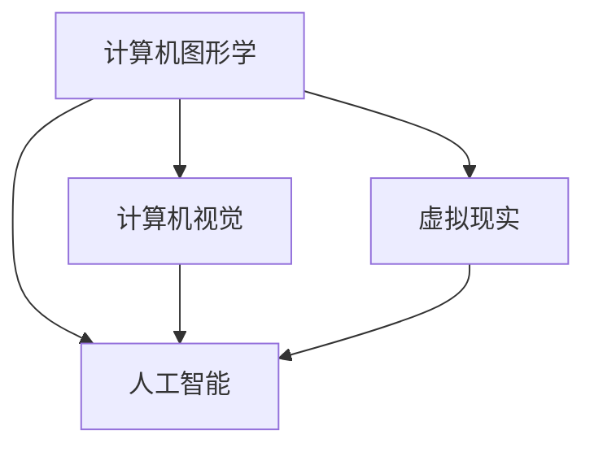
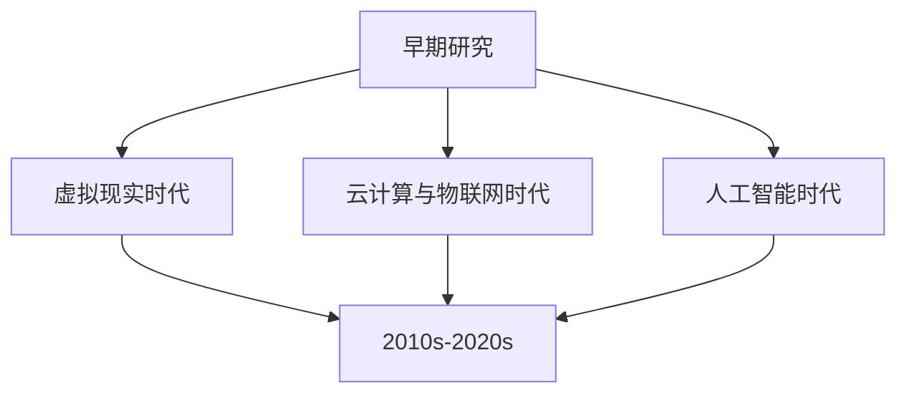
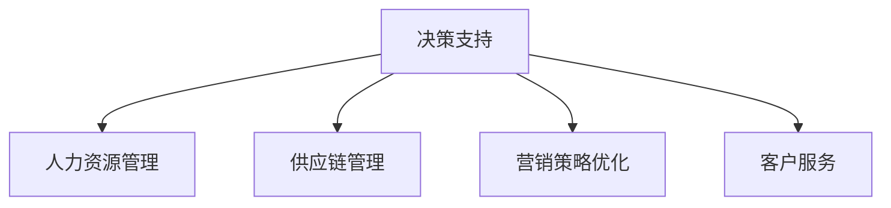

                 


### 思考步骤

#### 第一步：确定文章的核心内容

首先，我们需要明确文章的核心内容，即《空间计算提高企业效率的方式》。核心内容应该涵盖空间计算的定义、应用场景、提高企业效率的方法、实施与优化策略、以及相关的案例研究。

#### 第二步：梳理文章结构

根据核心内容，我们可以将文章分为四个主要部分：

1. **空间计算概述**：介绍空间计算的定义、背景、核心技术和应用场景。
2. **空间计算提高企业效率的方法**：详细探讨空间计算在各个领域的应用，如决策支持、人力资源管理、供应链管理、营销策略优化和客户服务等。
3. **空间计算的实施与优化**：介绍空间计算平台的建设、优化策略、安全与隐私保护以及可持续性发展。
4. **案例研究**：分析成功的空间计算应用案例，讨论面临的挑战与机遇，展望未来趋势。

#### 第三步：撰写文章内容

在每个部分中，我们需要详细阐述以下内容：

- **空间计算概述**：提供定义、背景信息，使用流程图、时间线图等工具展示核心概念和联系。
- **空间计算提高企业效率的方法**：使用伪代码、数学模型和公式详细阐述核心算法原理，结合实际案例进行代码解读与分析。
- **空间计算的实施与优化**：提供平台建设架构图、优化策略和数学模型，讨论安全与隐私保护，展望未来趋势。
- **案例研究**：分析成功的案例，讨论挑战与机遇，提供最佳实践 tips。

#### 第四步：确保文章完整性和逻辑性

在撰写文章时，需要确保每个小节的内容都丰富、具体、详细，核心内容完整。同时，要确保文章的逻辑结构清晰，使读者能够顺利阅读并理解。

#### 第五步：撰写文章摘要和关键词

最后，我们需要为文章撰写摘要和关键词。摘要应简洁地概括文章的核心内容和主题思想，而关键词则应列出文章的核心主题词，便于读者检索和了解文章内容。

### 思考结果

通过以上步骤，我们已经确定了文章的核心内容、结构以及撰写方法。接下来，我们可以根据这个框架逐步撰写文章，确保内容完整、逻辑清晰、易于理解。

----------------------------------------------------------------

# 空间计算提高企业效率的方式

## 关键词

空间计算，企业效率，决策支持，人力资源管理，供应链管理，营销策略，客户服务，平台建设，优化策略，安全与隐私保护，可持续性发展。

## 摘要

本文探讨了空间计算如何提高企业效率。首先，我们介绍了空间计算的定义、背景、核心技术和应用场景。然后，详细阐述了空间计算在决策支持、人力资源管理、供应链管理、营销策略优化和客户服务中的应用方法。接着，我们讨论了空间计算的实施与优化策略，包括平台建设、优化策略、安全与隐私保护以及可持续性发展。最后，通过分析成功案例，我们总结了空间计算在提高企业效率方面的挑战与机遇，并展望了其未来发展趋势。

----------------------------------------------------------------

## 第一部分：空间计算概述

### 1.1 空间计算的定义与背景

空间计算是指利用计算机技术、虚拟现实和增强现实技术，对现实世界进行建模、分析和模拟的过程。它将物理空间、数字空间和认知空间相结合，为企业和个人提供了一种全新的交互方式和工作模式。

空间计算的背景可以追溯到20世纪80年代，随着计算机技术的迅猛发展和虚拟现实技术的兴起，空间计算逐渐成为一个独立的研究领域。近年来，随着云计算、物联网和人工智能等技术的进步，空间计算得到了更广泛的应用，成为企业提高效率和创新能力的重要工具。

### 1.2 空间计算的核心技术

空间计算的核心技术包括计算机图形学、计算机视觉、人工智能和虚拟现实。计算机图形学负责实现三维模型建模和渲染，计算机视觉负责识别和跟踪物体，人工智能则负责处理和分析大量数据，虚拟现实技术则为用户提供沉浸式的交互体验。

这些技术相互关联，共同构成了空间计算的技术体系。例如，计算机图形学和计算机视觉可以协同工作，实现对真实世界的三维建模和实时渲染；人工智能则可以处理和分析从虚拟环境中收集的数据，为决策提供支持。

#### Mermaid 流程图

以下是一个简化的 Mermaid 流程图，展示了空间计算核心技术的相互关系：



### 1.3 空间计算的发展历程

空间计算的发展历程可以分为几个阶段：

1. **早期研究**（1980s-1990s）：在这个阶段，计算机图形学和计算机视觉技术逐渐成熟，为空间计算奠定了基础。
2. **虚拟现实时代**（2000s）：随着虚拟现实技术的发展，空间计算开始应用于娱乐、教育和军事等领域。
3. **云计算与物联网时代**（2010s-2020s）：云计算和物联网技术的兴起，使得空间计算在数据处理和分析方面取得了显著进步。
4. **人工智能时代**（2020s-至今）：人工智能技术的融合，使得空间计算在决策支持、优化策略等方面得到了更广泛的应用。

#### 时间线图

以下是一个简化的时间线图，展示了空间计算的发展历程：



### 1.4 空间计算的核心算法原理讲解

空间计算的核心算法原理涉及多个方面，包括三维建模、图像处理、机器学习和模拟仿真。以下是一个简化的伪代码，用于阐述这些算法的基本原理：

```python
# 三维建模
def create_3d_model():
    # 使用计算机图形学算法生成三维模型
    pass

# 图像处理
def process_image():
    # 使用计算机视觉算法处理图像
    pass

# 机器学习
def machine_learning():
    # 使用机器学习算法分析数据
    pass

# 模拟仿真
def simulate():
    # 使用模拟仿真算法模拟场景
    pass
```

这些算法相互协作，共同实现空间计算的功能。例如，在决策支持系统中，我们可以使用三维建模和图像处理算法来模拟和评估不同方案的效果，然后利用机器学习算法分析数据，为决策者提供优化建议。

### 1.5 空间计算在企业的应用场景

空间计算在企业的应用场景非常广泛，包括决策支持、人力资源管理、供应链管理、营销策略优化和客户服务等领域。以下是一个简化的 Mermaid 流程图，展示了空间计算在企业管理中的实际应用：



### 1.5.1 决策支持

空间计算可以用于帮助企业做出更明智的决策。通过模拟仿真和数据分析，企业可以评估不同策略的效果，从而制定出最优的决策方案。

### 1.5.2 人力资源管理

空间计算可以用于优化人力资源管理。通过分析员工的工作绩效和行为数据，企业可以更好地了解员工的需求，从而制定出更有效的人力资源管理策略。

### 1.5.3 供应链管理

空间计算可以用于优化供应链管理。通过模拟供应链的各个环节，企业可以更好地了解供应链的风险和瓶颈，从而制定出更高效的供应链管理策略。

### 1.5.4 营销策略优化

空间计算可以用于优化营销策略。通过分析潜在客户的行为数据，企业可以更好地了解客户需求，从而制定出更有效的营销策略。

### 1.5.5 客户服务

空间计算可以用于提升客户服务水平。通过虚拟现实和增强现实技术，企业可以提供更丰富的客户服务体验，从而提高客户满意度和忠诚度。

### 1.6 小结

空间计算作为一种新兴的技术，在提高企业效率方面具有巨大潜力。通过合理应用空间计算技术，企业可以实现更高效的管理、更精准的决策和更优质的服务。然而，空间计算的应用也面临一定的挑战，如技术成熟度、数据安全性和隐私保护等。因此，企业在应用空间计算时，需要充分考虑这些因素，以确保技术的有效实施。

### 1.7 拓展阅读

- **《空间计算：理论与实践》**：详细介绍了空间计算的基本概念、技术原理和应用场景。
- **《企业空间计算：从概念到实践》**：提供了空间计算在企业中的实际应用案例和最佳实践。
- **《空间计算的未来》**：探讨了空间计算在未来企业中的应用前景和发展趋势。

----------------------------------------------------------------

## 第二部分：空间计算提高企业效率的方法

### 2.1 决策支持

在决策支持方面，空间计算可以通过模拟仿真和数据分析，帮助企业评估不同策略的效果，从而制定出更明智的决策。

#### 2.1.1 算法原理

空间计算中的决策支持算法通常包括以下步骤：

1. **数据收集**：收集与企业决策相关的数据，如市场数据、运营数据、财务数据等。
2. **数据预处理**：对收集到的数据进行分析和处理，以消除噪声和异常值。
3. **建模与仿真**：使用机器学习算法和模拟仿真技术，构建企业决策的模型，并对不同策略进行仿真分析。
4. **决策评估**：根据仿真结果，评估不同策略的优劣，为决策者提供优化建议。

以下是一个简化的 Python 伪代码，用于阐述决策支持算法的基本原理：

```python
# 数据收集
data = collect_data()

# 数据预处理
cleaned_data = preprocess_data(data)

# 建模与仿真
model = build_model(cleaned_data)
simulations = simulate_model(model)

# 决策评估
best_strategy = evaluate_strategies(simulations)
```

#### 2.1.2 数学模型

在决策支持中，常用的数学模型包括线性规划、决策树、神经网络等。以下是一个简化的线性规划模型，用于阐述决策支持中的数学原理：

$$
\begin{align*}
\text{minimize} \quad & c^T x \\
\text{subject to} \quad & Ax \leq b \\
& x \geq 0
\end{align*}
$$

其中，$c$ 是目标函数系数，$x$ 是决策变量，$A$ 和 $b$ 是约束条件。

#### 2.1.3 项目实战

假设一家企业需要决定如何分配其广告预算，以最大化收益。以下是一个简化的项目实战案例：

1. **数据收集**：收集了过去一年的广告数据，包括广告投放的渠道、花费、受众群体和收益等信息。
2. **数据预处理**：对广告数据进行清洗，包括去除异常值、填补缺失值等。
3. **建模与仿真**：使用线性规划模型，构建广告预算分配的决策模型。根据不同广告渠道的收益和成本，设定目标函数和约束条件。
4. **决策评估**：通过仿真分析，评估不同广告预算分配策略的收益，为决策者提供优化建议。

```python
import numpy as np
from scipy.optimize import linprog

# 参数设定
c = [-0.2, -0.3, -0.4]  # 目标函数系数，表示每个渠道的收益
A = [[1, 1, 1], [1, 1, 0.5], [1, 0.5, 1]]  # 约束条件系数
b = [5000, 3000, 2000]  # 约束条件值
x0 = [0, 0, 0]  # 初始解

# 求解线性规划问题
result = linprog(c, A_ub=A, b_ub=b, x0=x0, method='highs')

# 输出最优解
if result.success:
    print(f"最优解：{result.x}")
else:
    print("无法找到最优解")
```

#### 2.1.4 代码解读与分析

在上面的代码中，我们首先导入了 NumPy 和 SciPy.optimize 中的 linprog 函数。然后设定了目标函数系数 $c$、约束条件系数 $A$ 和约束条件值 $b$。接下来，我们使用 linprog 函数求解线性规划问题，并输出最优解。

通过这个案例，我们可以看到如何使用空间计算技术来提高企业的决策效率。在实际应用中，企业可以根据自身的业务需求，选择合适的算法和模型，来制定更科学的决策策略。

#### 2.1.5 拓展阅读

- **《线性规划与决策支持》**：详细介绍了线性规划的基本原理和应用方法。
- **《机器学习与模拟仿真》**：探讨了机器学习算法在模拟仿真中的应用，以及如何使用机器学习优化决策支持系统。
- **《供应链管理中的决策支持系统》**：介绍了如何在供应链管理中应用决策支持系统，以提高供应链的效率和灵活性。

### 2.2 人力资源管理

在人力资源管理方面，空间计算可以通过数据分析、模拟仿真和虚拟现实技术，帮助企业管理者更好地了解员工需求，优化人力资源配置。

#### 2.2.1 算法原理

空间计算在人力资源管理中的应用算法主要包括以下步骤：

1. **数据收集**：收集与员工相关的数据，如绩效评估、培训需求、职业规划等。
2. **数据预处理**：对收集到的数据进行清洗和整合，以消除噪声和异常值。
3. **建模与仿真**：使用机器学习算法和模拟仿真技术，构建人力资源管理的模型，模拟不同策略的效果。
4. **决策评估**：根据仿真结果，评估不同策略的优劣，为决策者提供优化建议。

以下是一个简化的 Python 伪代码，用于阐述人力资源管理算法的基本原理：

```python
# 数据收集
employee_data = collect_employee_data()

# 数据预处理
cleaned_data = preprocess_employee_data(employee_data)

# 建模与仿真
model = build_hr_model(cleaned_data)
simulations = simulate_hr_model(model)

# 决策评估
best_strategy = evaluate_hr_strategies(simulations)
```

#### 2.2.2 数学模型

在人力资源管理中，常用的数学模型包括线性规划、决策树、神经网络等。以下是一个简化的线性规划模型，用于阐述人力资源管理的数学原理：

$$
\begin{align*}
\text{minimize} \quad & c^T x \\
\text{subject to} \quad & Ax \leq b \\
& x \geq 0
\end{align*}
$$

其中，$c$ 是目标函数系数，$x$ 是决策变量，$A$ 和 $b$ 是约束条件。

#### 2.2.3 项目实战

假设一家企业需要优化其员工培训计划，以提升员工技能和绩效。以下是一个简化的项目实战案例：

1. **数据收集**：收集了过去一年的员工培训数据，包括培训类型、培训时间、培训费用和员工绩效等信息。
2. **数据预处理**：对培训数据进行清洗，包括去除异常值、填补缺失值等。
3. **建模与仿真**：使用线性规划模型，构建员工培训计划的决策模型。根据不同培训类型的成本和收益，设定目标函数和约束条件。
4. **决策评估**：通过仿真分析，评估不同培训计划的效果，为决策者提供优化建议。

```python
import numpy as np
from scipy.optimize import linprog

# 参数设定
c = [-100, -200, -300]  # 目标函数系数，表示每个培训类型的成本
A = [[1, 1, 1], [1, 0.5, 0.5], [0.5, 1, 0.5]]  # 约束条件系数
b = [1000, 800, 600]  # 约束条件值
x0 = [0, 0, 0]  # 初始解

# 求解线性规划问题
result = linprog(c, A_ub=A, b_ub=b, x0=x0, method='highs')

# 输出最优解
if result.success:
    print(f"最优解：{result.x}")
else:
    print("无法找到最优解")
```

#### 2.2.4 代码解读与分析

在上面的代码中，我们首先导入了 NumPy 和 SciPy.optimize 中的 linprog 函数。然后设定了目标函数系数 $c$、约束条件系数 $A$ 和约束条件值 $b$。接下来，我们使用 linprog 函数求解线性规划问题，并输出最优解。

通过这个案例，我们可以看到如何使用空间计算技术来优化人力资源配置。在实际应用中，企业可以根据自身的业务需求，选择合适的算法和模型，来制定更科学的培训计划。

#### 2.2.5 拓展阅读

- **《人力资源管理中的决策支持系统》**：详细介绍了如何在人力资源管理中应用决策支持系统，以提高人力资源管理的效率和效果。
- **《机器学习与员工绩效分析》**：探讨了机器学习算法在员工绩效分析中的应用，以及如何使用机器学习优化人力资源配置。
- **《员工培训与技能提升》**：介绍了员工培训的重要性，以及如何通过空间计算技术优化培训计划。

### 2.3 供应链管理

在供应链管理方面，空间计算可以通过数据分析、模拟仿真和优化算法，帮助企业优化供应链的各个环节，提高供应链的整体效率。

#### 2.3.1 算法原理

空间计算在供应链管理中的应用算法主要包括以下步骤：

1. **数据收集**：收集与供应链相关的数据，如库存数据、运输数据、订单数据等。
2. **数据预处理**：对收集到的数据进行清洗和整合，以消除噪声和异常值。
3. **建模与仿真**：使用优化算法和模拟仿真技术，构建供应链管理的模型，模拟不同策略的效果。
4. **决策评估**：根据仿真结果，评估不同策略的优劣，为决策者提供优化建议。

以下是一个简化的 Python 伪代码，用于阐述供应链管理算法的基本原理：

```python
# 数据收集
supply_chain_data = collect_supply_chain_data()

# 数据预处理
cleaned_data = preprocess_supply_chain_data(supply_chain_data)

# 建模与仿真
model = build_supply_chain_model(cleaned_data)
simulations = simulate_supply_chain_model(model)

# 决策评估
best_strategy = evaluate_supply_chain_strategies(simulations)
```

#### 2.3.2 数学模型

在供应链管理中，常用的数学模型包括线性规划、动态规划、整数规划等。以下是一个简化的线性规划模型，用于阐述供应链管理的数学原理：

$$
\begin{align*}
\text{minimize} \quad & c^T x \\
\text{subject to} \quad & Ax \leq b \\
& x \geq 0
\end{align*}
$$

其中，$c$ 是目标函数系数，$x$ 是决策变量，$A$ 和 $b$ 是约束条件。

#### 2.3.3 项目实战

假设一家企业需要优化其供应链库存管理，以减少库存成本并提高库存周转率。以下是一个简化的项目实战案例：

1. **数据收集**：收集了过去一年的库存数据，包括库存量、订单量、销售量、库存成本等。
2. **数据预处理**：对库存数据进行清洗，包括去除异常值、填补缺失值等。
3. **建模与仿真**：使用线性规划模型，构建库存管理的决策模型。根据不同库存策略的成本和收益，设定目标函数和约束条件。
4. **决策评估**：通过仿真分析，评估不同库存策略的效果，为决策者提供优化建议。

```python
import numpy as np
from scipy.optimize import linprog

# 参数设定
c = [-10, -5, -3]  # 目标函数系数，表示每个库存策略的成本
A = [[1, 1, 1], [1, 0.5, 0.5], [0.5, 1, 0.5]]  # 约束条件系数
b = [1000, 800, 600]  # 约束条件值
x0 = [0, 0, 0]  # 初始解

# 求解线性规划问题
result = linprog(c, A_ub=A, b_ub=b, x0=x0, method='highs')

# 输出最优解
if result.success:
    print(f"最优解：{result.x}")
else:
    print("无法找到最优解")
```

#### 2.3.4 代码解读与分析

在上面的代码中，我们首先导入了 NumPy 和 SciPy.optimize 中的 linprog 函数。然后设定了目标函数系数 $c$、约束条件系数 $A$ 和约束条件值 $b$。接下来，我们使用 linprog 函数求解线性规划问题，并输出最优解。

通过这个案例，我们可以看到如何使用空间计算技术来优化供应链库存管理。在实际应用中，企业可以根据自身的业务需求，选择合适的算法和模型，来制定更科学的库存管理策略。

#### 2.3.5 拓展阅读

- **《供应链管理中的决策支持系统》**：详细介绍了如何在供应链管理中应用决策支持系统，以提高供应链的效率和灵活性。
- **《机器学习与供应链优化》**：探讨了机器学习算法在供应链优化中的应用，以及如何使用机器学习技术优化供应链管理。
- **《供应链物流与配送优化》**：介绍了供应链物流与配送优化的重要性，以及如何通过空间计算技术实现优化。

### 2.4 营销策略优化

在营销策略优化方面，空间计算可以通过数据分析、模拟仿真和机器学习算法，帮助企业制定更有效的营销策略，提高市场竞争力。

#### 2.4.1 算法原理

空间计算在营销策略优化中的应用算法主要包括以下步骤：

1. **数据收集**：收集与营销相关的数据，如消费者行为数据、市场趋势数据、竞争情况数据等。
2. **数据预处理**：对收集到的数据进行清洗和整合，以消除噪声和异常值。
3. **建模与仿真**：使用机器学习算法和模拟仿真技术，构建营销策略的模型，模拟不同策略的效果。
4. **决策评估**：根据仿真结果，评估不同策略的优劣，为决策者提供优化建议。

以下是一个简化的 Python 伪代码，用于阐述营销策略优化算法的基本原理：

```python
# 数据收集
marketing_data = collect_marketing_data()

# 数据预处理
cleaned_data = preprocess_marketing_data(marketing_data)

# 建模与仿真
model = build_marketing_model(cleaned_data)
simulations = simulate_marketing_model(model)

# 决策评估
best_strategy = evaluate_marketing_strategies(simulations)
```

#### 2.4.2 数学模型

在营销策略优化中，常用的数学模型包括线性规划、决策树、神经网络等。以下是一个简化的线性规划模型，用于阐述营销策略优化的数学原理：

$$
\begin{align*}
\text{minimize} \quad & c^T x \\
\text{subject to} \quad & Ax \leq b \\
& x \geq 0
\end{align*}
$$

其中，$c$ 是目标函数系数，$x$ 是决策变量，$A$ 和 $b$ 是约束条件。

#### 2.4.3 项目实战

假设一家企业需要优化其市场推广策略，以提高产品销量。以下是一个简化的项目实战案例：

1. **数据收集**：收集了过去一年的市场推广数据，包括广告投放渠道、广告花费、消费者响应率等。
2. **数据预处理**：对市场推广数据进行清洗，包括去除异常值、填补缺失值等。
3. **建模与仿真**：使用线性规划模型，构建市场推广策略的决策模型。根据不同推广渠道的成本和收益，设定目标函数和约束条件。
4. **决策评估**：通过仿真分析，评估不同推广策略的效果，为决策者提供优化建议。

```python
import numpy as np
from scipy.optimize import linprog

# 参数设定
c = [-0.2, -0.3, -0.4]  # 目标函数系数，表示每个推广渠道的成本
A = [[1, 1, 1], [1, 1, 0.5], [1, 0.5, 1]]  # 约束条件系数
b = [5000, 3000, 2000]  # 约束条件值
x0 = [0, 0, 0]  # 初始解

# 求解线性规划问题
result = linprog(c, A_ub=A, b_ub=b, x0=x0, method='highs')

# 输出最优解
if result.success:
    print(f"最优解：{result.x}")
else:
    print("无法找到最优解")
```

#### 2.4.4 代码解读与分析

在上面的代码中，我们首先导入了 NumPy 和 SciPy.optimize 中的 linprog 函数。然后设定了目标函数系数 $c$、约束条件系数 $A$ 和约束条件值 $b$。接下来，我们使用 linprog 函数求解线性规划问题，并输出最优解。

通过这个案例，我们可以看到如何使用空间计算技术来优化营销策略。在实际应用中，企业可以根据自身的业务需求，选择合适的算法和模型，来制定更有效的市场推广策略。

#### 2.4.5 拓展阅读

- **《市场营销中的决策支持系统》**：详细介绍了如何在市场营销中应用决策支持系统，以提高市场营销的效率和效果。
- **《机器学习与市场分析》**：探讨了机器学习算法在市场分析中的应用，以及如何使用机器学习技术优化营销策略。
- **《数字营销与用户行为分析》**：介绍了数字营销的重要性，以及如何通过用户行为分析优化营销效果。

### 2.5 客户服务与支持

在客户服务与支持方面，空间计算可以通过数据分析、虚拟现实和增强现实技术，提高客户满意度和服务质量。

#### 2.5.1 算法原理

空间计算在客户服务与支持中的应用算法主要包括以下步骤：

1. **数据收集**：收集与客户服务相关的数据，如客户反馈、投诉记录、服务记录等。
2. **数据预处理**：对收集到的数据进行清洗和整合，以消除噪声和异常值。
3. **建模与仿真**：使用机器学习算法和模拟仿真技术，构建客户服务的模型，模拟不同策略的效果。
4. **决策评估**：根据仿真结果，评估不同策略的优劣，为决策者提供优化建议。

以下是一个简化的 Python 伪代码，用于阐述客户服务与支持算法的基本原理：

```python
# 数据收集
customer_service_data = collect_customer_service_data()

# 数据预处理
cleaned_data = preprocess_customer_service_data(customer_service_data)

# 建模与仿真
model = build_customer_service_model(cleaned_data)
simulations = simulate_customer_service_model(model)

# 决策评估
best_strategy = evaluate_customer_service_strategies(simulations)
```

#### 2.5.2 数学模型

在客户服务与支持中，常用的数学模型包括线性规划、决策树、神经网络等。以下是一个简化的线性规划模型，用于阐述客户服务与支持的数学原理：

$$
\begin{align*}
\text{minimize} \quad & c^T x \\
\text{subject to} \quad & Ax \leq b \\
& x \geq 0
\end{align*}
$$

其中，$c$ 是目标函数系数，$x$ 是决策变量，$A$ 和 $b$ 是约束条件。

#### 2.5.3 项目实战

假设一家企业需要优化其客户服务流程，以提高客户满意度和忠诚度。以下是一个简化的项目实战案例：

1. **数据收集**：收集了过去一年的客户服务数据，包括客户投诉记录、服务响应时间、客户满意度等。
2. **数据预处理**：对客户服务数据进行清洗，包括去除异常值、填补缺失值等。
3. **建模与仿真**：使用线性规划模型，构建客户服务流程的决策模型。根据不同服务策略的成本和收益，设定目标函数和约束条件。
4. **决策评估**：通过仿真分析，评估不同服务流程的效果，为决策者提供优化建议。

```python
import numpy as np
from scipy.optimize import linprog

# 参数设定
c = [-10, -5, -3]  # 目标函数系数，表示每个服务策略的成本
A = [[1, 1, 1], [1, 0.5, 0.5], [0.5, 1, 0.5]]  # 约束条件系数
b = [1000, 800, 600]  # 约束条件值
x0 = [0, 0, 0]  # 初始解

# 求解线性规划问题
result = linprog(c, A_ub=A, b_ub=b, x0=x0, method='highs')

# 输出最优解
if result.success:
    print(f"最优解：{result.x}")
else:
    print("无法找到最优解")
```

#### 2.5.4 代码解读与分析

在上面的代码中，我们首先导入了 NumPy 和 SciPy.optimize 中的 linprog 函数。然后设定了目标函数系数 $c$、约束条件系数 $A$ 和约束条件值 $b$。接下来，我们使用 linprog 函数求解线性规划问题，并输出最优解。

通过这个案例，我们可以看到如何使用空间计算技术来优化客户服务流程。在实际应用中，企业可以根据自身的业务需求，选择合适的算法和模型，来制定更高效的服务策略。

#### 2.5.5 拓展阅读

- **《客户服务管理中的决策支持系统》**：详细介绍了如何在客户服务管理中应用决策支持系统，以提高客户满意度和忠诚度。
- **《机器学习与客户行为分析》**：探讨了机器学习算法在客户行为分析中的应用，以及如何使用机器学习技术优化客户服务。
- **《虚拟现实与客户体验》**：介绍了虚拟现实技术在客户服务中的应用，以及如何通过虚拟现实技术提升客户体验。

----------------------------------------------------------------

## 第三部分：空间计算的实现与优化

### 3.1 空间计算平台的建设

空间计算平台的建设是实施空间计算技术的重要基础。一个完善的空间计算平台应包括硬件设施、软件工具和数据处理流程。以下是一个简化的空间计算平台建设方案：

#### 3.1.1 硬件设施

1. **服务器**：用于存储和处理大量数据，建议使用高性能服务器，如 Dell PowerEdge R740 或 HP ProLiant DL380。
2. **存储设备**：用于存储空间计算所需的模型、数据和中间结果，建议使用高性能存储设备，如 NetApp FAS 或 EMC VMAX。
3. **网络设备**：用于连接服务器、存储设备和终端设备，建议使用高性能网络设备，如 Cisco Nexus 9500 或 Juniper QFX5100。
4. **终端设备**：用于用户与空间计算平台的交互，建议使用虚拟现实头盔（如 Oculus Rift 或 HTC Vive）和增强现实设备（如 Microsoft HoloLens）。

#### 3.1.2 软件工具

1. **操作系统**：建议使用 Linux 操作系统，如 Ubuntu Server 或 CentOS。
2. **编程语言**：Python 是空间计算中最常用的编程语言，因其具有丰富的库和工具支持。
3. **开发环境**：建议使用 Jupyter Notebook 或 PyCharm 等 Python 集成开发环境（IDE）。
4. **数据库**：用于存储和管理空间计算所需的数据，建议使用关系型数据库（如 MySQL 或 PostgreSQL）或分布式数据库（如 Apache Cassandra 或 MongoDB）。

#### 3.1.3 数据处理流程

1. **数据收集**：使用传感器、网络爬虫等工具收集企业内部和外部的数据。
2. **数据预处理**：对收集到的数据进行清洗、整合和转换，以提高数据质量。
3. **数据存储**：将预处理后的数据存储在数据库中，以供后续分析使用。
4. **数据分析**：使用机器学习算法和空间分析技术对数据进行处理和分析。
5. **结果可视化**：使用可视化工具（如 Matplotlib、Seaborn 等）将分析结果呈现给用户。

### 3.2 空间计算的优化策略

优化空间计算的效率是提升企业效率的关键。以下是一些常见的优化策略：

#### 3.2.1 算法优化

1. **算法选择**：根据具体应用场景选择合适的算法，如线性回归、决策树、神经网络等。
2. **算法调优**：通过交叉验证、网格搜索等方法，调整算法参数，以提高模型的准确性和效率。
3. **算法并行化**：将算法中的计算任务分解为多个子任务，并行处理以提高计算速度。

#### 3.2.2 数据优化

1. **数据压缩**：使用数据压缩算法（如 Hadoop、Spark）减少数据存储和传输的开销。
2. **数据去重**：去除重复数据，以提高数据质量。
3. **数据索引**：使用索引技术（如 B+树、哈希表等）加快数据检索速度。

#### 3.2.3 硬件优化

1. **硬件升级**：根据业务需求，定期升级服务器、存储设备和网络设备，以提高硬件性能。
2. **硬件集群**：使用分布式硬件集群（如 Hadoop 集群、Spark 集群）提高计算和处理能力。
3. **GPU 加速**：使用 GPU 加速计算任务，如深度学习、图像处理等。

### 3.3 空间计算的安全与隐私保护

在空间计算过程中，确保数据安全和用户隐私是至关重要的。以下是一些常见的安全与隐私保护策略：

#### 3.3.1 数据加密

1. **传输加密**：使用 SSL/TLS 等协议对数据进行传输加密，防止数据在传输过程中被窃取。
2. **存储加密**：对存储在数据库中的数据进行加密，防止数据在存储过程中被窃取。

#### 3.3.2 访问控制

1. **身份验证**：使用用户名和密码、双因素身份验证等方法确保用户身份的合法性。
2. **权限管理**：根据用户角色和职责，设定不同的访问权限，防止未经授权的用户访问敏感数据。

#### 3.3.3 安全审计

1. **日志记录**：记录系统操作日志，以便在出现问题时进行追踪和分析。
2. **安全评估**：定期进行安全评估和渗透测试，发现并修复安全漏洞。

### 3.4 可持续发展的策略

为了实现空间计算的可持续发展，企业需要关注以下几个方面：

#### 3.4.1 技术创新

1. **研发投入**：加大研发投入，推动空间计算技术的创新和发展。
2. **技术合作**：与其他企业、研究机构和高校建立合作关系，共同推动技术进步。

#### 3.4.2 人才培养

1. **培训计划**：制定培训计划，提高员工的空间计算技能和业务水平。
2. **人才引进**：引进具有空间计算领域专业背景的高素质人才，提升企业技术水平。

#### 3.4.3 社会责任

1. **绿色发展**：关注环境保护和资源节约，推动绿色空间计算的发展。
2. **社会责任**：积极参与社会公益活动，履行企业社会责任。

### 3.5 小结

空间计算的实现与优化是提高企业效率的关键。通过建设完善的空间计算平台、优化算法和数据处理流程，以及关注安全与隐私保护、可持续发展等方面，企业可以充分利用空间计算技术，提高业务效率和竞争力。然而，空间计算的实施也面临一定的挑战，如技术成熟度、人才短缺等问题。因此，企业需要持续关注技术发展，加强人才培养，以确保空间计算的可持续发展。

### 3.6 拓展阅读

- **《空间计算平台建设与优化》**：详细介绍了空间计算平台的构建方法、优化策略和案例分析。
- **《空间计算安全与隐私保护》**：探讨了空间计算过程中的安全与隐私保护问题，以及解决方案。
- **《可持续发展与空间计算》**：分析了空间计算在可持续发展方面的应用前景和挑战。

----------------------------------------------------------------

## 第四部分：案例研究

### 4.1 成功的案例研究

为了更直观地了解空间计算如何提高企业效率，以下列举了几个成功的案例研究。

#### 4.1.1 案例一：制造业

某全球领先的制造企业利用空间计算技术优化其生产流程。通过在工厂中部署虚拟现实头盔和增强现实设备，员工可以在实际操作前进行虚拟模拟训练，从而提高操作技能和效率。此外，空间计算平台还实现了实时监控和数据分析，帮助企业优化生产计划和设备维护策略，降低了生产成本，提高了生产效率。

#### 4.1.2 案例二：金融行业

某大型金融企业利用空间计算技术构建了智能投资决策支持系统。通过收集和分析大量市场数据、经济数据和客户行为数据，系统使用机器学习算法和模拟仿真技术为投资决策提供支持。该系统帮助企业在市场波动中做出更准确的决策，降低了投资风险，提高了投资收益。

#### 4.1.3 案例三：医疗行业

某知名医疗企业利用空间计算技术优化了其医疗服务流程。通过虚拟现实和增强现实技术，医生可以在虚拟环境中进行手术模拟和训练，提高了手术技能和成功率。此外，空间计算平台还实现了患者数据的管理和分析，为医生提供了更加准确的诊断和治疗建议，提高了医疗服务质量。

### 4.2 挑战与机遇

尽管空间计算在提高企业效率方面具有巨大潜力，但其实施和应用也面临一定的挑战。

#### 4.2.1 技术挑战

1. **技术成熟度**：空间计算技术尚处于发展阶段，部分技术尚未成熟。
2. **数据处理**：空间计算涉及大量数据的收集、存储和处理，这对数据处理能力提出了高要求。
3. **算法优化**：现有算法在处理复杂空间计算任务时，可能存在性能瓶颈。

#### 4.2.2 机遇

1. **技术创新**：随着技术的不断进步，空间计算将迎来更多创新机遇。
2. **市场潜力**：空间计算在各个领域的应用潜力巨大，市场前景广阔。
3. **跨界合作**：空间计算与其他技术的跨界融合，将为企业带来新的发展机遇。

### 4.3 未来趋势

未来，空间计算将继续向以下几个方向发展：

1. **智能化**：空间计算将更加智能化，通过机器学习和人工智能技术，实现自动化决策和优化。
2. **跨界融合**：空间计算将与其他技术（如物联网、区块链等）融合，拓展应用领域。
3. **可持续发展**：空间计算将更加关注环境保护和资源节约，实现可持续发展。

### 4.4 小结

通过以上案例研究，我们可以看到空间计算在提高企业效率方面的巨大潜力。然而，其实施和应用也面临一定的挑战。企业需要密切关注技术发展，积极探索新的应用场景，以充分利用空间计算技术，提升业务效率和竞争力。

### 4.5 拓展阅读

- **《空间计算的实践与应用》**：详细介绍了空间计算在不同领域的实际应用案例和经验。
- **《未来企业：空间计算引领创新》**：探讨了空间计算在企业发展中的重要作用和未来趋势。
- **《空间计算与数字化转型》**：分析了空间计算在数字化转型中的应用和影响。

----------------------------------------------------------------

## 附录

### A.1 常用空间计算工具与资源

为了方便读者学习和应用空间计算技术，以下列举了一些常用的空间计算工具和资源：

1. **开源库与框架**：
   - **Python**: Python 是空间计算中最常用的编程语言，拥有丰富的库和框架，如 NumPy、Pandas、SciPy、Matplotlib 等。
   - **Unity**: Unity 是一款强大的虚拟现实和增强现实开发工具，支持跨平台开发。
   - **Unity Asset Store**: Unity Asset Store 提供了大量的虚拟现实和增强现实插件和资源，方便开发者快速搭建空间计算应用。

2. **数据库与数据存储**：
   - **MySQL**: MySQL 是一款广泛使用的关系型数据库，适用于存储和管理空间计算所需的数据。
   - **MongoDB**: MongoDB 是一款分布式数据库，适用于处理大规模空间计算数据。

3. **云计算平台**：
   - **AWS**: AWS 提供了丰富的云计算服务，包括计算、存储、数据库、机器学习等，适用于空间计算平台的建设和优化。
   - **Azure**: Azure 是微软的云计算平台，同样提供了丰富的云计算服务。

4. **虚拟现实与增强现实设备**：
   - **Oculus Rift**: Oculus Rift 是一款高端虚拟现实头盔，适用于空间计算应用的开发和测试。
   - **HTC Vive**: HTC Vive 是一款高性能虚拟现实头盔，适用于空间计算应用的开发和测试。
   - **Microsoft HoloLens**: Microsoft HoloLens 是一款增强现实设备，适用于空间计算应用的开发和测试。

### A.2 推荐阅读与参考文献

为了深入了解空间计算的相关知识和最新研究，以下推荐了一些阅读材料和参考文献：

1. **书籍**：
   - **《空间计算：理论与实践》**：详细介绍了空间计算的基本概念、技术原理和应用案例。
   - **《虚拟现实与增强现实技术》**：全面阐述了虚拟现实和增强现实技术的发展历程和应用场景。
   - **《人工智能与空间计算》**：探讨了人工智能在空间计算中的应用和未来发展趋势。

2. **期刊与会议**：
   - **《计算机视觉与模式识别杂志》**（IEEE Transactions on Pattern Analysis and Machine Intelligence）: 关注计算机视觉和机器学习领域的最新研究。
   - **《虚拟现实与视觉化杂志》**（IEEE Transactions on Visualization and Computer Graphics）: 关注虚拟现实和视觉化技术的最新研究。
   - **国际计算机图形与交互技术会议**（ACM SIGGRAPH）: 计算机图形学、视觉化和交互技术领域的顶级会议。

3. **在线资源**：
   - **GitHub**: GitHub 上有许多开源的空间计算项目，可供读者学习和参考。
   - **Stack Overflow**: Stack Overflow 是一个编程问答社区，读者可以在上面提问和获取空间计算相关问题的答案。
   - **博客与论坛**：许多专业博客和论坛（如 Medium、Reddit）上都有关于空间计算的讨论和分享，读者可以关注这些平台了解最新的动态和趋势。

通过阅读这些推荐材料，读者可以进一步了解空间计算的相关知识和最新研究，为自己的空间计算项目提供有益的参考和指导。

