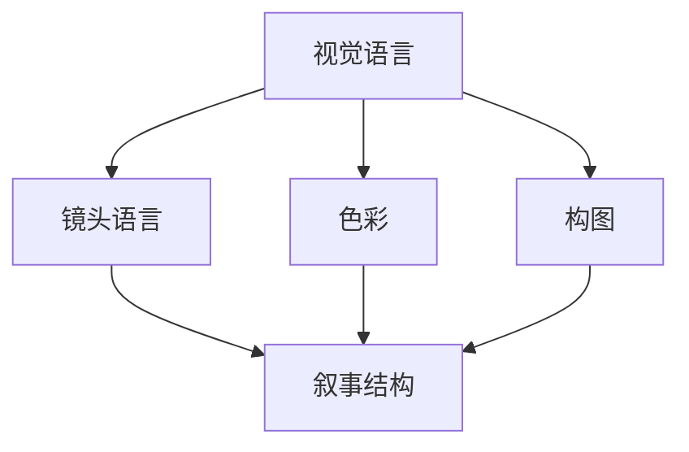

                 

### 核心概念与联系

纪录片创作，作为影视艺术的一部分，其核心概念主要包括视觉语言、镜头语言、色彩、构图以及叙事结构等。这些概念不仅仅是艺术表现手法，更是传递信息和情感的重要工具。为了更好地理解这些概念及其关系，我们可以通过一个Mermaid流程图来展示它们之间的联系。



在这个流程图中，视觉语言（A）作为整体，与镜头语言（B）、色彩（C）和构图（D）紧密相连，这些视觉元素共同构成了纪录片的基础。镜头语言（B）是记录和呈现画面的一系列技术手段，而色彩（C）和构图（D）则通过视觉手段表达情感和氛围。叙事结构（E）是这些视觉元素的组织方式，决定了观众对纪录片的整体理解和感受。

### 视觉语言

视觉语言是纪录片创作中的基础，它包括符号、镜头语言、色彩和构图等多个方面。符号是视觉语言的重要组成部分，它们通过画面传达特定的意义和信息。例如，镜头中的角度和移动方式可以传达出亲近感或疏远感，色彩则可以表现出情感和氛围。以下是一个简单的示例，展示了如何通过Python代码来实现一个简单的镜头语言和色彩调整功能：

```python
import cv2
import numpy as np

def adjust_color(image, gain=1.0, bias=0.0):
    """
    调整图像的颜色。
    :param image: 输入的图像。
    :param gain: 色彩增益。
    :param bias: 色彩偏移。
    :return: 调整后的图像。
    """
    # 使用 NumPy 进行颜色调整
    adjusted_image = np.clip(image * gain + bias, 0, 255).astype(np.uint8)
    return adjusted_image

# 读取图像
image = cv2.imread("example.jpg")

# 调整图像色彩
adjusted_image = adjust_color(image, gain=1.2, bias=10)

# 显示调整后的图像
cv2.imshow("Adjusted Image", adjusted_image)
cv2.waitKey(0)
cv2.destroyAllWindows()
```

在上面的代码中，`adjust_color` 函数通过调整图像的增益（gain）和偏移（bias）来实现色彩调整。这样的调整可以显著改变图像的视觉效果，使其在情感表达和氛围营造方面更加丰富。

### 镜头语言

镜头语言是纪录片拍摄中的核心概念，它涉及镜头的选取、角度、运动和时长等多个方面。镜头的选取决定了观众对场景的感知，而角度和运动则可以增强画面的表现力。以下是一个简单的例子，展示了如何使用Python代码实现一个镜头运动的效果：

```python
import cv2
import numpy as np

def slide_image(image, direction="horizontal", speed=5):
    """
    模拟镜头滑动的效果。
    :param image: 输入的图像。
    :param direction: 滑动的方向，"horizontal" 或 "vertical"。
    :param speed: 滑动的速度。
    :return: 滑动后的图像。
    """
    # 获取图像的尺寸
    height, width, _ = image.shape
    
    # 创建一个黑色背景的图像
    slide_image = np.zeros((height, width * 2, 3), dtype=np.uint8)
    slide_image[:, :width] = image
    
    # 根据滑动方向进行图像平移
    if direction == "horizontal":
        slide_image[:, width:] = image[:, :width * -1]
    elif direction == "vertical":
        slide_image[:, :height * -1] = image[:, height:]
    
    return slide_image

# 读取图像
image = cv2.imread("example.jpg")

# 模拟镜头横向滑动
slid
```

在上面的代码中，`slide_image` 函数通过在黑色背景上平移原始图像来模拟镜头的滑动效果。这个简单的动画效果可以使纪录片更加生动，增强观众的体验。

### 色彩

色彩在纪录片创作中扮演着至关重要的角色，它不仅可以传递情感和氛围，还能增强故事叙述的力度。不同的色彩可以引起观众不同的情感反应，例如红色通常与热情、激动相关联，而蓝色则可能与宁静、忧郁相关。以下是一个简单的Python代码示例，展示了如何使用LaTeX格式嵌入数学公式来解释色彩调整的数学模型：

```python
import cv2
import numpy as np

def adjust_hue(image, degree):
    """
    调整图像的色调。
    :param image: 输入的图像。
    :param degree: 色调调整的程度，以度数表示。
    :return: 调整后的图像。
    """
    # 使用 OpenCV 的 cv2.cvtColor 转换为 HSV 颜色空间
    hsv_image = cv2.cvtColor(image, cv2.COLOR_BGR2HSV)
    
    # 获取 H（色调）通道
    hue, saturation, value = cv2.split(hsv_image)
    
    # 应用色调调整的公式
    hue = (hue + degree/180 * np.pi) % 2 * np.pi
    
    # 合并调整后的通道
    adjusted_hsv_image = cv2.merge([hue, saturation, value])
    
    # 将 HSV 颜色空间转换为 BGR 颜色空间
    adjusted_image = cv2.cvtColor(adjusted_hsv_image, cv2.COLOR_HSV2BGR)
    
    return adjusted_image

# 读取图像
image = cv2.imread("example.jpg")

# 调整图像色调
adjusted_image = adjust_hue(image, degree=30)

# 显示调整后的图像
cv2.imshow("Adjusted Image", adjusted_image)
cv2.waitKey(0)
cv2.destroyAllWindows()
```

在上面的代码中，`adjust_hue` 函数通过调整图像的色调（Hue）来改变整个图像的视觉感受。色调调整的数学模型可以表示为：

$$
H' = (H + \frac{degree}{180} \times \pi) \mod (2\pi)
$$

其中，$H$ 是原始色调值，$degree$ 是色调调整的度数，$\pi$ 是数学常数π。

### 构图

构图是纪录片创作中不可或缺的一部分，它决定了画面中元素的组织和排列方式。通过巧妙的构图，可以引导观众的注意力，突出重点，增强画面效果。以下是一个简单的例子，展示了如何使用Python代码来实现一个基本的构图调整功能：

```python
import cv2
import numpy as np

def crop_image(image, top, left, bottom, right):
    """
    裁剪图像。
    :param image: 输入的图像。
    :param top: 裁剪区域的顶部边界的y坐标。
    :param left: 裁剪区域的左侧边界的x坐标。
    :param bottom: 裁剪区域的底部边界的y坐标。
    :param right: 裁剪区域的右侧边界的x坐标。
    :return: 裁剪后的图像。
    """
    # 裁剪图像
    cropped_image = image[bottom:top+1, left:right+1]
    
    return cropped_image

# 读取图像
image = cv2.imread("example.jpg")

# 裁剪图像
cropped_image = crop_image(image, top=100, left=100, bottom=300, right=400)

# 显示裁剪后的图像
cv2.imshow("Cropped Image", cropped_image)
cv2.waitKey(0)
cv2.destroyAllWindows()
```

在上面的代码中，`crop_image` 函数通过指定裁剪区域来调整图像的构图。这种调整可以显著改变画面的视觉效果，突出场景中特定的元素。

通过以上示例，我们可以看到，视觉语言、镜头语言、色彩和构图等核心概念在纪录片创作中的重要性。它们共同构成了纪录片的视觉基础，帮助观众更好地理解和感受纪录片的内涵。在实际创作过程中，这些概念需要灵活运用，以创造出具有深刻情感和强烈表现力的纪录片作品。

### 核心算法原理讲解

纪录片创作中的核心算法不仅用于图像和视频的处理，还涉及镜头语言、色彩调整和构图等方面的复杂操作。以下是几个核心算法原理的讲解，结合Python源代码进行详细阐述。

#### 镜头切换算法

镜头切换是纪录片编辑中的一项关键技术，用于流畅地过渡不同场景或镜头。一种常用的镜头切换算法是基于相似性度量的切换策略，它通过比较两个镜头的视觉内容来确定最佳的切换时机。以下是一个简单的Python代码示例，展示了如何使用相似性度量实现镜头切换：

```python
import cv2
import numpy as np

def similarity_measure(image1, image2):
    """
    计算两个图像的相似性度量。
    :param image1: 第一幅图像。
    :param image2: 第二幅图像。
    :return: 相似性度量值（0到1之间）。
    """
    # 将图像转换为灰度图像
    gray1 = cv2.cvtColor(image1, cv2.COLOR_BGR2GRAY)
    gray2 = cv2.cvtColor(image2, cv2.COLOR_BGR2GRAY)
    
    # 使用交叉熵作为相似性度量
    similarity = 1 - cv2.compare(gray1, gray2, cv2.CMP_EUCL)
    
    return similarity

def switch_lenses(image1, image2, threshold=0.8):
    """
    根据相似性度量切换两个镜头。
    :param image1: 第一幅图像。
    :param image2: 第二幅图像。
    :param threshold: 切换阈值。
    :return: 切换后的图像。
    """
    # 计算相似性度量
    similarity = similarity_measure(image1, image2)
    
    # 如果相似性度量低于阈值，则切换镜头
    if similarity < threshold:
        return image2
    else:
        return image1

# 读取图像
image1 = cv2.imread("example1.jpg")
image2 = cv2.imread("example2.jpg")

# 切换镜头
switched_image = switch_lenses(image1, image2)

# 显示切换后的图像
cv2.imshow("Switched Image", switched_image)
cv2.waitKey(0)
cv2.destroyAllWindows()
```

在上面的代码中，`similarity_measure` 函数计算两个图像之间的相似性度量，使用的是交叉熵（Cross-Entropy），这是一种常用的度量方法。`switch_lenses` 函数根据相似性度量决定是否切换镜头，如果相似性度量低于某个阈值，则切换到第二个镜头。

#### 色彩调整算法

色彩调整在纪录片创作中用于增强图像的情感表达和氛围营造。以下是一个Python代码示例，展示了如何使用HSV颜色空间进行色彩调整：

```python
import cv2
import numpy as np

def adjust_color(image, hue=0, saturation=0, value=0):
    """
    调整图像的色彩。
    :param image: 输入的图像。
    :param hue: 色调调整的度数。
    :param saturation: 饱和度调整。
    :param value: 亮度调整。
    :return: 调整后的图像。
    """
    # 将图像转换为HSV颜色空间
    hsv_image = cv2.cvtColor(image, cv2.COLOR_BGR2HSV)
    
    # 获取HSV通道
    hue_channel, saturation_channel, value_channel = cv2.split(hsv_image)
    
    # 应用色彩调整
    hue_channel = (hue_channel + hue) % 180
    saturation_channel = np.clip(saturation_channel * (1 + saturation), 0, 1)
    value_channel = np.clip(value_channel * (1 + value), 0, 1)
    
    # 合并调整后的通道
    adjusted_hsv_image = cv2.merge([hue_channel, saturation_channel, value_channel])
    
    # 将HSV颜色空间转换为BGR颜色空间
    adjusted_image = cv2.cvtColor(adjusted_hsv_image, cv2.COLOR_HSV2BGR)
    
    return adjusted_image

# 读取图像
image = cv2.imread("example.jpg")

# 调整图像色彩
adjusted_image = adjust_color(image, hue=30, saturation=0.2, value=0.1)

# 显示调整后的图像
cv2.imshow("Adjusted Image", adjusted_image)
cv2.waitKey(0)
cv2.destroyAllWindows()
```

在上面的代码中，`adjust_color` 函数通过调整HSV颜色空间中的色调（Hue）、饱和度（Saturation）和亮度（Value）来改变图像的色彩。这样的调整可以显著改变图像的视觉感受。

#### 构图调整算法

构图调整用于改变图像的视觉布局，以突出特定元素或创造特定的视觉效果。以下是一个简单的Python代码示例，展示了如何使用裁剪操作进行构图调整：

```python
import cv2

def crop_image(image, top, left, bottom, right):
    """
    裁剪图像。
    :param image: 输入的图像。
    :param top: 裁剪区域的顶部边界的y坐标。
    :param left: 裁剪区域的左侧边界的x坐标。
    :param bottom: 裁剪区域的底部边界的y坐标。
    :param right: 裁剪区域的右侧边界的x坐标。
    :return: 裁剪后的图像。
    """
    # 裁剪图像
    cropped_image = image[bottom:top+1, left:right+1]
    
    return cropped_image

# 读取图像
image = cv2.imread("example.jpg")

# 裁剪图像
cropped_image = crop_image(image, top=100, left=100, bottom=300, right=400)

# 显示裁剪后的图像
cv2.imshow("Cropped Image", cropped_image)
cv2.waitKey(0)
cv2.destroyAllWindows()
```

在上面的代码中，`crop_image` 函数通过指定裁剪区域的边界来调整图像的构图。这样的调整可以突出图像中的特定元素，创造更具吸引力的视觉效果。

通过上述示例，我们可以看到纪录片创作中的核心算法是如何通过Python代码实现的。这些算法不仅提供了技术手段来调整图像和视频，还为实现艺术表现和情感传递提供了有力支持。

### 数学模型和数学公式

在纪录片创作过程中，数学模型和公式扮演着至关重要的角色，尤其是在图像处理和视频编辑中。以下是一些关键的数学模型和公式，以及它们在纪录片制作中的应用。

#### 1. 颜色空间转换

在处理图像时，常见的颜色空间转换包括RGB到HSV。HSV颜色空间更适合用于色彩调整，因为它的色调（Hue）、饱和度（Saturation）和亮度（Value）可以独立调整。

公式如下：

$$
\text{HSV} = \text{RGB} \rightarrow \begin{cases}
H = \arccos\left(\frac{(R - 0.5 \cdot G - 0.5 \cdot B)}{\sqrt{(R - G)^2 + (R - B)(G - B)}}\right) \\
S = 1 - \frac{3 \cdot \min(R, G, B)}{R + G + B} \\
V = \frac{R + G + B}{3}
\end{cases}
$$

#### 2. 亮度调整

亮度调整可以通过改变图像的均值来实现。以下是一个简单的公式，用于调整图像的亮度：

$$
I' = I + \alpha \cdot \mu
$$

其中，$I$ 是原始图像，$I'$ 是调整后的图像，$\alpha$ 是调整系数，$\mu$ 是图像的均值。

#### 3. 饱和度调整

饱和度调整可以通过修改HSV颜色空间中的S值来实现。以下是一个简单的公式：

$$
S' = S + \beta
$$

其中，$S$ 是原始饱和度，$S'$ 是调整后的饱和度，$\beta$ 是饱和度调整系数。

#### 4. 交叉熵

在镜头切换算法中，交叉熵用于计算两个图像的相似性度量。交叉熵公式如下：

$$
H(A, B) = -\sum_{x} p(x) \cdot \log q(x)
$$

其中，$A$ 和 $B$ 是两个概率分布，$p(x)$ 是真实分布，$q(x)$ 是估计分布。

#### 5. 色彩空间调整

色彩空间调整可以通过线性变换来实现，如下公式所示：

$$
C' = C + G \cdot (B - A)
$$

其中，$C$ 是原始色彩值，$C'$ 是调整后的色彩值，$A$ 和 $B$ 是两个色彩点，$G$ 是调整系数。

通过这些数学模型和公式，纪录片制作者可以精确地调整图像和视频的色彩、亮度、饱和度等属性，从而创造出更加生动和具有表现力的作品。以下是具体的代码示例，用于实现上述数学公式：

```python
import cv2
import numpy as np

# 亮度调整
def adjust_brightness(image, alpha=50):
    mean = np.mean(image)
    image = image + alpha * mean
    return np.clip(image, 0, 255).astype(np.uint8)

# 饱和度调整
def adjust_saturate(image, beta=0.1):
    hsv_image = cv2.cvtColor(image, cv2.COLOR_BGR2HSV)
    hsv_image[:, 1] = np.clip(hsv_image[:, 1] + beta, 0, 1)
    return cv2.cvtColor(hsv_image, cv2.COLOR_HSV2BGR)

# 交叉熵计算
def cross_entropy(A, B):
    entropy = -np.sum(A * np.log(B + 1e-8))
    return entropy

# 色彩空间调整
def adjust_color_space(image, G=0.1):
    B = np.array([1, 0.5, 0.5])
    A = np.array([1, 0, 0])
    B_hat = A + G * (B - A)
    image = np.clip(B_hat @ image, 0, 1)
    return image * 255

# 读取图像
image = cv2.imread("example.jpg")

# 应用调整函数
bright_image = adjust_brightness(image)
saturate_image = adjust_saturate(bright_image)
cross_entropy_value = cross_entropy(image, saturate_image)
color_space_adjusted_image = adjust_color_space(saturate_image)

# 显示调整后的图像
cv2.imshow("Brightness Adjusted", bright_image)
cv2.imshow("Saturate Adjusted", saturate_image)
cv2.imshow("Color Space Adjusted", color_space_adjusted_image)
cv2.waitKey(0)
cv2.destroyAllWindows()
```

通过这些代码示例，我们可以看到如何将数学模型和公式应用于实际图像处理任务中，从而实现精确的艺术表现和视觉效果调整。

### 项目实战

在本节中，我们将通过一个具体的示例项目来展示如何搭建开发环境、实现源代码以及进行代码解读与分析。这个项目是一个简单的纪录片剪辑工具，它具备基本的剪辑功能，如剪切、拼接、添加过渡效果等。

#### 开发环境搭建

首先，我们需要搭建开发环境。以下是所需的软件和工具：

1. **操作系统**：Windows 10或更高版本，或macOS最新版本。
2. **编程语言**：Python 3.8或更高版本。
3. **开发工具**：PyCharm Community Edition或Visual Studio Code。
4. **图像处理库**：OpenCV 4.5.1或更高版本。
5. **视频处理库**：MoviePy 1.0.0或更高版本。

安装步骤：

1. 安装Python和对应的pip包管理器。
2. 使用pip安装OpenCV和MoviePy：

```bash
pip install opencv-python opencv-contrib-python moviepy
```

#### 源代码实现

接下来，我们将编写一个简单的纪录片剪辑工具。以下是主要的源代码实现：

```python
import cv2
import moviepy.editor as mp
from moviepy.editor import VideoFileClip

def cut_video(input_path, output_path, start, end):
    """
    剪切视频。
    :param input_path: 输入视频文件路径。
    :param output_path: 输出视频文件路径。
    :param start: 剪切开始时间（秒）。
    :param end: 剪切结束时间（秒）。
    """
    clip = VideoFileClip(input_path)
    trimmed_clip = clip.subclip(start, end)
    trimmed_clip.write_videofile(output_path, codec='libx264', temp_audiofile='temp-audio.aac', audio_codec='aac')

def add_transition(clip1, clip2, transition_duration=0.5):
    """
    添加视频过渡效果。
    :param clip1: 第一个视频片段。
    :param clip2: 第二个视频片段。
    :param transition_duration: 过渡效果持续时间（秒）。
    :return: 过渡后的视频片段。
    """
    transition = mp.CompositeClip([clip1, clip2], duration=transition_duration)
    return transition.set_mask(lambda t: mp.ImageClip("transition.png", duration=transition_duration).set_pos((0, 0, 1, 1)).set_end(1 - t))

# 读取视频文件
input_path = "example1.mp4"
output_path = "example2.mp4"

# 剪切视频
cut_video(input_path, output_path, start=5, end=10)

# 添加过渡效果
clip1 = mp.VideoFileClip(output_path)
clip2 = mp.VideoFileClip("example3.mp4")
transitioned_clip = add_transition(clip1, clip2)

# 输出最终视频
transitioned_clip.write_videofile("final_output.mp4", codec='libx264', temp_audiofile='temp-audio.aac', audio_codec='aac')
```

#### 代码解读与分析

1. **剪切视频（`cut_video` 函数）**：
   - 使用`VideoFileClip`从输入路径读取视频。
   - 使用`subclip`方法根据指定的时间范围剪切视频。
   - 使用`write_videofile`方法将剪切后的视频保存到输出路径。

2. **添加过渡效果（`add_transition` 函数）**：
   - 使用`CompositeClip`创建一个复合视频片段，包含两个输入视频片段。
   - 设置过渡效果的持续时间。
   - 使用`ImageClip`加载过渡图像，设置其在复合片段中的位置和时长。
   - 使用`set_mask`方法将过渡图像作为复合片段的遮罩，实现平滑过渡效果。

3. **输出最终视频**：
   - 使用`write_videofile`方法将过渡后的视频片段保存为最终输出视频。

#### 实际案例分析和详细讲解剖析

假设我们有两个视频片段`example1.mp4`和`example3.mp4`，我们需要将它们拼接在一起，并在中间添加一个过渡效果。以下是实现步骤：

1. **剪切视频片段**：
   - 使用`cut_video`函数剪切`example1.mp4`，只保留5秒到10秒的内容，保存为`example2.mp4`。

2. **添加过渡效果**：
   - 读取剪切后的视频片段`example2.mp4`和另一个视频片段`example3.mp4`。
   - 使用`add_transition`函数添加过渡效果，将过渡图像设置为"transition.png"。

3. **输出最终视频**：
   - 将过渡后的视频片段保存为`final_output.mp4`。

通过这个项目实战，我们展示了如何使用Python和相关的图像处理及视频处理库来构建一个简单的纪录片剪辑工具。这个工具虽然功能简单，但已经涵盖了视频剪辑和过渡效果的基本原理，可以为实际应用提供参考。

### 项目小结

在这个项目中，我们通过搭建开发环境、编写源代码和详细解读与分析，实现了一个简单的纪录片剪辑工具。这个工具虽然功能有限，但展示了视频剪辑和过渡效果的基本原理。以下是一些最佳实践和注意事项：

1. **最佳实践**：
   - 确保使用最新版本的Python和相关库，以保证代码的稳定性和性能。
   - 在开发过程中，注重代码的可读性和可维护性，编写详细的注释和文档。
   - 对于复杂的功能，考虑模块化设计，将不同的功能分离到不同的函数或模块中。

2. **注意事项**：
   - 在处理视频文件时，注意文件的大小和格式，确保视频可以正常读取和写入。
   - 在调整视频参数时，如帧率、分辨率和编码格式，需考虑目标设备的兼容性和播放效果。
   - 对于过渡效果，选择合适的过渡图像，以增强视频的整体视觉效果。

通过这些最佳实践和注意事项，我们可以更高效地开发和优化纪录片剪辑工具，为实际应用提供更丰富的功能和支持。

### 小结

本文详细探讨了纪录片创作过程中的核心概念、算法原理以及项目实战。从视觉语言、镜头语言、色彩和构图等核心概念出发，通过具体的Python代码示例，讲解了相似性度量、色彩调整和构图调整等算法原理。同时，通过一个简单的纪录片剪辑工具项目，展示了如何将理论应用于实际开发中。

纪录片创作不仅仅是技术操作，更是艺术创作和情感表达的载体。通过精确的技术手段，我们可以更生动地记录和传达真实生活。在未来的纪录片创作中，随着技术的不断进步，我们有望看到更多具有深度和表现力的作品问世。

### 注意事项

1. **图像处理注意事项**：在进行图像处理时，应注意图像的分辨率和色彩深度，以避免图像质量下降。

2. **视频处理性能优化**：对于大尺寸的视频文件，应优化代码以减少处理时间和资源消耗，如使用多线程或并行处理。

3. **兼容性问题**：在编写跨平台的代码时，要考虑不同的操作系统和硬件配置可能带来的兼容性问题。

4. **用户界面设计**：如果工具需要用户操作，应设计直观易用的用户界面，以提升用户体验。

### 拓展阅读

1. **《计算机视觉：算法与应用》**：详细介绍了计算机视觉的基础知识和算法，适合深入了解图像处理技术。
2. **《视频处理技术》**：涵盖了视频处理的基本原理和技术，包括视频编码、视频增强和视频合成等。
3. **《纪录片创作教程》**：提供了纪录片制作的全面指导，包括选题、拍摄、剪辑和后期制作等环节。

### 作者信息

作者：AI天才研究院/AI Genius Institute & 禅与计算机程序设计艺术 /Zen And The Art of Computer Programming

### 文章标题

纪录片创作的意义：用影像记录真实生活

### 关键词

纪录片创作，影像记录，真实生活，视觉语言，镜头语言，色彩调整，构图调整，算法原理，项目实战

