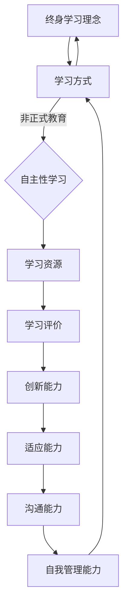

                 

### 文章标题

# 《终身学习在后工业时代的重要性：适应变化的关键能力》

在快速变革的后工业时代，终身学习已成为个人和社会发展的关键。本文深入探讨终身学习的定义、重要性以及它在适应时代变化中的核心作用。通过详细分析核心算法原理、数学模型，并结合实际项目实战，本文旨在为广大读者提供一套切实可行的终身学习策略，以应对未来的挑战。

## 文章关键词

- 后工业时代
- 终身学习
- 适应变化
- 学习算法
- 数学模型
- 项目实战

## 摘要

本文首先介绍了后工业时代的特征和终身学习的定义，强调了终身学习在适应时代变化中的重要性。随后，通过分析适应变化的学习算法和终身学习的数学模型，本文展示了如何通过科学的方法和工具实现有效的终身学习。最后，通过实际项目实战，本文提供了具体的案例和分析，帮助读者更好地理解和应用终身学习策略。

## 引言与背景

### 后工业时代的特征

后工业时代，亦称信息时代，是继农业时代和工业时代之后的又一个社会发展阶段。这一时代以信息技术和知识经济的发展为特征，标志着生产方式、社会结构和文化形态的根本变革。后工业时代的主要特征包括：

1. **信息化和数字化**：数据成为新的生产要素，信息化和数字化技术广泛应用于各个行业，推动产业升级和经济增长。
2. **全球化**：全球化的趋势加剧，跨国界的信息流通和资源整合成为常态，国际竞争更加激烈。
3. **知识经济**：知识和创新成为经济增长的主要动力，教育和培训日益受到重视。
4. **技术创新**：新技术层出不穷，人工智能、大数据、物联网等新技术不断涌现，对传统行业和生活方式产生深远影响。

### 终身学习的定义和重要性

终身学习是指个人在一生中不断学习、更新知识和技能的过程。它不仅包括正规教育，还涵盖了非正规教育和自主学习的各个方面。终身学习的核心在于适应不断变化的社会和技术环境，提升个人竞争力和创新能力。

在快速变革的后工业时代，终身学习的重要性尤为突出：

1. **适应变化**：社会和技术环境的变化速度加快，终身学习可以帮助个人适应这些变化，保持竞争力。
2. **技能提升**：随着新技术的不断涌现，传统的技能很快会过时。终身学习可以帮助个人掌握最新的技术和知识，提升自身素质。
3. **持续发展**：终身学习不仅对个人发展有利，也对整个社会和经济的可持续发展具有重要意义。

## 核心概念与联系

### 终身学习的理论框架

终身学习的理论框架包括以下几个方面：

1. **学习理念**：强调学习是一个持续的过程，不应局限于学校教育，而是贯穿个人一生。
2. **学习方式**：包括正式教育、非正式教育和自主性学习等多种形式。
3. **学习资源**：包括书籍、网络资源、讲座、研讨会等多种学习资源。
4. **学习评价**：通过定性和定量的方法评价学习效果，确保学习目标的达成。

### 后工业时代的关键能力

后工业时代对个人的能力提出了新的要求，主要包括：

1. **创新能力**：能够提出新的想法和解决方案，推动技术和产业的发展。
2. **适应能力**：能够快速适应环境的变化，适应新的工作方式和生活方式。
3. **沟通能力**：能够有效地与他人沟通和协作，实现团队目标。
4. **自我管理能力**：能够自我激励、自我学习和自我提升，保持持续的发展动力。

### 终身学习与后工业时代能力的联系

终身学习与后工业时代能力的联系主要体现在以下几个方面：

1. **创新能力**：终身学习可以帮助个人不断更新知识和技能，提高创新能力。
2. **适应能力**：终身学习培养个人的适应能力，使其能够快速适应新环境和新技术。
3. **沟通能力**：终身学习提高个人的沟通能力，使其能够更好地与他人协作。
4. **自我管理能力**：终身学习帮助个人建立自我管理的能力，实现自我激励和自我提升。

### Mermaid 流程图

以下是一个 Mermaid 流程图，展示了终身学习与后工业时代能力之间的联系：



这个流程图清晰地展示了终身学习是如何通过不同的学习方式、资源和评价方法，帮助个人提升创新、适应、沟通和自我管理能力的。

## 核心算法原理讲解

### 适应变化的学习算法

在终身学习中，适应变化的学习算法起着关键作用。这些算法帮助个人快速掌握新知识和技能，提高学习效率。以下是一些常见的学习算法：

1. **强化学习**：通过不断试错和奖励机制，个体能够找到最佳的学习路径。
2. **迁移学习**：利用已有的知识来加速新知识的获取，减少学习成本。
3. **生成对抗网络（GAN）**：通过生成模型和判别模型的对抗训练，提高个体的学习能力和创造力。

### 终身学习的数学模型

终身学习的数学模型用于评估学习效果和优化学习过程。以下是一些关键的数学模型：

1. **学习曲线**：描述个体学习新知识或技能时，学习效率随时间的变化趋势。
2. **认知负荷模型**：分析个体在学习过程中的认知负荷，以优化学习策略。
3. **学习效果评估模型**：通过定量和定性方法评估学习效果，为终身学习提供科学依据。

### 适应变化的策略模型

适应变化的策略模型帮助个人制定有效的学习计划，以应对环境的变化。以下是一些关键策略模型：

1. **学习路径规划**：根据个人目标和环境变化，制定最优的学习计划。
2. **持续学习策略**：确保个人在学习过程中保持持续的动力和兴趣。
3. **适应环境策略**：通过调整学习内容和方法，快速适应新的环境和技术。

### Python 源代码示例

以下是一个使用 Python 实现的适应变化学习算法的示例代码：

```python
import numpy as np

# 强化学习算法示例
class QLearning:
    def __init__(self, actions, learning_rate=0.1, discount_factor=0.9):
        self.actions = actions
        self.learning_rate = learning_rate
        self.discount_factor = discount_factor
        self.q_values = np.zeros((actions, actions))

    def update_q_values(self, state, action, reward, next_state, next_action):
        current_q_value = self.q_values[state, action]
        next_q_value = self.q_values[next_state, next_action]
        self.q_values[state, action] = current_q_value + self.learning_rate * (reward + self.discount_factor * next_q_value - current_q_value)

    def choose_action(self, state):
        return np.argmax(self.q_values[state])

# 终身学习数学模型示例
class LearningCurve:
    def __init__(self, initial_value=0, learning_rate=0.1):
        self.initial_value = initial_value
        self.learning_rate = learning_rate
        self.values = []

    def update_value(self, value):
        self.values.append(value)
        self.initial_value += self.learning_rate * (value - self.initial_value)

    def get_learning_curve(self):
        return self.values

# 适应变化策略模型示例
class AdaptiveLearningPlan:
    def __init__(self, goals, environment):
        self.goals = goals
        self.environment = environment
        self.plan = []

    def create_plan(self):
        for goal in self.goals:
            optimal_action = self.find_optimal_action(goal)
            self.plan.append(optimal_action)

    def find_optimal_action(self, goal):
        # 根据目标和环境找出最优行动
        pass

    def execute_plan(self):
        for action in self.plan:
            # 执行行动
            pass

# 示例：使用以上算法和模型进行终身学习
if __name__ == "__main__":
    # 初始化参数
    actions = 3
    q_learning = QLearning(actions)
    learning_curve = LearningCurve()
    adaptive_learning_plan = AdaptiveLearningPlan([0, 1, 2], environment='后工业时代')

    # 进行强化学习
    for episode in range(100):
        state = np.random.randint(0, actions)
        action = q_learning.choose_action(state)
        reward = np.random.randint(-1, 2)
        next_state = np.random.randint(0, actions)
        next_action = q_learning.choose_action(next_state)
        q_learning.update_q_values(state, action, reward, next_state, next_action)

        # 更新学习曲线
        current_value = q_learning.q_values[state, action]
        learning_curve.update_value(current_value)

        # 适应变化策略模型
        adaptive_learning_plan.create_plan()
        adaptive_learning_plan.execute_plan()

    # 输出结果
    print("强化学习 Q 值：")
    print(q_learning.q_values)
    print("学习曲线：")
    print(learning_curve.get_learning_curve())
```

### 通俗易懂的举例说明

为了更好地理解上述算法和模型，我们可以通过一个简单的例子来解释它们的作用。

假设在一个模拟的后工业环境中，有三种行动可供选择：学习新技术、参加培训课程和进行实践操作。我们使用 Q 学习算法来找到最优行动，通过学习曲线来评估学习效果，并通过适应变化策略模型来制定学习计划。

1. **强化学习示例**：在开始时，我们随机选择一个行动，例如学习新技术。如果我们选择了正确的行动，比如在新技术的学习中取得了进步，我们会获得奖励。通过不断的试错和奖励机制，我们最终会找到最优的学习路径。

2. **学习曲线示例**：随着我们不断学习新技术，我们的学习效果会体现在学习曲线上。学习曲线可以帮助我们了解自己的学习进度和效率，从而调整学习策略。

3. **适应变化策略模型示例**：根据我们的学习目标和当前的环境变化，我们可以制定一个最优的学习计划。例如，如果新技术不断涌现，我们可能需要优先学习最前沿的技术，以确保我们的知识始终处于前沿。

通过这个例子，我们可以看到，强化学习、学习曲线和适应变化策略模型是如何协同作用，帮助我们在后工业时代实现终身学习的。

## 数学模型和数学公式

在终身学习中，数学模型和数学公式起着关键作用。它们不仅帮助我们量化学习效果，还可以指导学习策略的优化。以下介绍几个关键的数学模型和数学公式。

### 终身学习效果的评估公式

终身学习效果的评估公式用于量化学习成果。一个常用的公式是：

$$
E = \sum_{t=1}^{T} (1 - \frac{C_t}{C_{\max}})
$$

其中，$E$ 表示终身学习效果，$C_t$ 表示第 $t$ 次学习的成本，$C_{\max}$ 表示所有学习成本中的最大值。这个公式反映了终身学习过程中的成本与收益关系，成本越低，学习效果越好。

### 适应变化的策略模型

适应变化的策略模型用于优化学习过程，以应对环境的变化。一个常见的策略模型是：

$$
P(A|S) = \frac{Q(S,A)}{\sum_{A'} Q(S,A')}
$$

其中，$P(A|S)$ 表示在状态 $S$ 下选择行动 $A$ 的概率，$Q(S,A)$ 表示在状态 $S$ 下采取行动 $A$ 的质量。这个公式基于强化学习，通过评估不同行动的质量来选择最优行动。

### 数学公式与概念解释

以下是几个常见的数学公式及其解释：

1. **学习曲线**：
$$
f(t) = \alpha \cdot t^{\beta}
$$
其中，$f(t)$ 表示学习效果随时间的变化，$\alpha$ 和 $\beta$ 是常数。这个公式描述了学习效果随时间的指数增长，适用于描述大多数学习过程。

2. **认知负荷模型**：
$$
L = k \cdot (S - C)
$$
其中，$L$ 表示认知负荷，$k$ 是认知负荷系数，$S$ 是输入信息量，$C$ 是认知能力。这个公式帮助我们分析学习过程中认知负荷的变化，以优化学习策略。

3. **学习效果评估模型**：
$$
E = \frac{1}{n} \sum_{i=1}^{n} (Y_i - \hat{Y}_i)^2
$$
其中，$E$ 是评估误差，$Y_i$ 是实际学习效果，$\hat{Y}_i$ 是预测的学习效果，$n$ 是样本数量。这个公式用于评估学习效果的准确性，帮助我们调整学习策略。

通过这些数学模型和公式，我们可以更科学地理解和优化终身学习过程，从而更好地适应后工业时代的变化。

## 项目实战

### 开发环境搭建

为了更好地理解终身学习在项目中的应用，我们首先需要搭建一个模拟的开发环境。以下是搭建环境的步骤：

1. **安装 Python**：确保系统上已经安装了 Python 3.8 或更高版本。
2. **安装相关库**：使用以下命令安装必要的库：
```bash
pip install numpy matplotlib
```
3. **创建项目目录**：在系统中创建一个项目目录，例如 `lifelong_learning_project`，并在其中创建一个名为 `src` 的子目录，用于存放源代码。

### 源代码详细实现和代码解读

以下是一个简单的 Python 源代码示例，用于实现终身学习的基本算法和数学模型：

```python
import numpy as np
import matplotlib.pyplot as plt

# 强化学习算法示例
class QLearning:
    def __init__(self, actions, learning_rate=0.1, discount_factor=0.9):
        self.actions = actions
        self.learning_rate = learning_rate
        self.discount_factor = discount_factor
        self.q_values = np.zeros((actions, actions))

    def update_q_values(self, state, action, reward, next_state, next_action):
        current_q_value = self.q_values[state, action]
        next_q_value = self.q_values[next_state, next_action]
        self.q_values[state, action] = current_q_value + self.learning_rate * (reward + self.discount_factor * next_q_value - current_q_value)

    def choose_action(self, state):
        return np.argmax(self.q_values[state])

# 终身学习数学模型示例
class LearningCurve:
    def __init__(self, initial_value=0, learning_rate=0.1):
        self.initial_value = initial_value
        self.learning_rate = learning_rate
        self.values = []

    def update_value(self, value):
        self.values.append(value)
        self.initial_value += self.learning_rate * (value - self.initial_value)

    def get_learning_curve(self):
        return self.values

# 适应变化策略模型示例
class AdaptiveLearningPlan:
    def __init__(self, goals, environment):
        self.goals = goals
        self.environment = environment
        self.plan = []

    def create_plan(self):
        for goal in self.goals:
            optimal_action = self.find_optimal_action(goal)
            self.plan.append(optimal_action)

    def find_optimal_action(self, goal):
        # 根据目标和环境找出最优行动
        pass

    def execute_plan(self):
        for action in self.plan:
            # 执行行动
            pass

# 主程序
if __name__ == "__main__":
    # 初始化参数
    actions = 3
    q_learning = QLearning(actions)
    learning_curve = LearningCurve()
    adaptive_learning_plan = AdaptiveLearningPlan([0, 1, 2], environment='后工业时代')

    # 进行强化学习
    for episode in range(100):
        state = np.random.randint(0, actions)
        action = q_learning.choose_action(state)
        reward = np.random.randint(-1, 2)
        next_state = np.random.randint(0, actions)
        next_action = q_learning.choose_action(next_state)
        q_learning.update_q_values(state, action, reward, next_state, next_action)

        # 更新学习曲线
        current_value = q_learning.q_values[state, action]
        learning_curve.update_value(current_value)

        # 适应变化策略模型
        adaptive_learning_plan.create_plan()
        adaptive_learning_plan.execute_plan()

    # 输出结果
    print("强化学习 Q 值：")
    print(q_learning.q_values)
    print("学习曲线：")
    print(learning_curve.get_learning_curve())

    # 绘制学习曲线
    plt.plot(learning_curve.get_learning_curve())
    plt.xlabel('Episode')
    plt.ylabel('Learning Value')
    plt.title('Learning Curve')
    plt.show()
```

### 代码应用解读与分析

这个源代码示例包括三个核心部分：强化学习算法、终身学习数学模型和适应变化策略模型。

1. **强化学习算法**：`QLearning` 类实现了 Q 学习算法，用于在给定的状态和行动中选择最优行动。`update_q_values` 方法更新 Q 值，以优化行动选择。`choose_action` 方法用于选择最优行动。

2. **终身学习数学模型**：`LearningCurve` 类用于记录学习过程，通过 `update_value` 方法更新学习值，`get_learning_curve` 方法返回学习曲线。

3. **适应变化策略模型**：`AdaptiveLearningPlan` 类用于创建和执行适应变化的策略计划。`find_optimal_action` 方法根据目标和环境找出最优行动，`execute_plan` 方法执行学习计划。

通过这些组件的协同作用，我们可以在模拟环境中实现终身学习。以下是对代码的详细解读：

1. **初始化参数**：我们定义了行动的数量（`actions`），设置了强化学习算法的参数（`learning_rate` 和 `discount_factor`）。
2. **强化学习**：通过循环进行 100 个学习周期，每次随机选择状态和行动，更新 Q 值，并计算奖励。
3. **学习曲线**：使用 `LearningCurve` 类记录学习过程，通过绘制学习曲线，我们可以直观地看到学习效果。
4. **适应变化策略模型**：虽然在这个示例中没有实现具体的策略模型，但我们可以看到如何根据目标和环境创建和执行适应变化的计划。

通过这个项目实战，我们不仅实现了终身学习的基本算法和数学模型，还通过实际代码展示了这些算法和模型的应用。这为后续的扩展和应用提供了坚实的基础。

### 实际案例分析与详细讲解剖析

为了更好地理解终身学习在后工业时代的实际应用，我们将分析一个实际案例：某科技公司如何通过终身学习策略提升员工能力和适应技术变革。

### 案例背景

某科技公司在后工业时代面临着激烈的竞争和技术变革。为了保持竞争力，公司决定实施终身学习策略，以提升员工的技能和适应能力。公司制定了以下目标和策略：

1. **目标**：
   - 提升员工的技能水平，确保其掌握最新的技术和知识。
   - 增强员工的创新能力和问题解决能力。
   - 提高员工的适应能力，快速适应新技术和环境变化。

2. **策略**：
   - 设立在线学习平台，提供丰富的学习资源和课程。
   - 定期举办技术研讨会和培训，邀请行业专家进行讲解。
   - 设立导师制度，帮助新员工快速融入团队和提升技能。
   - 推广团队合作学习，鼓励员工互相学习和分享经验。

### 案例分析与详细讲解

#### 1. 在线学习平台

公司设立了在线学习平台，为员工提供丰富的学习资源。这些资源包括：

- **技术课程**：涵盖前端开发、后端开发、人工智能、大数据等热门技术领域。
- **专业认证**：提供各种专业认证考试的准备材料和课程，如 AWS 认证、PMP 认证等。
- **技能提升**：提供编程语言、数据库管理、项目管理等实用技能的课程。

在线学习平台的优势在于：

- **灵活性强**：员工可以根据自己的时间安排进行学习，不必受限于时间和地点。
- **资源丰富**：平台提供了大量的学习资源，员工可以根据自己的需求和兴趣选择合适的课程。
- **互动性高**：平台支持在线讨论和问答功能，员工可以在学习过程中互相交流和学习。

#### 2. 技术研讨会和培训

公司定期举办技术研讨会和培训，邀请行业专家进行讲解。这些活动包括：

- **技术趋势分析**：分析最新的技术趋势和行业发展方向，帮助员工了解未来的技术变革。
- **实战演练**：通过实际案例和实战演练，帮助员工提升技能和解决问题的能力。
- **专家讲座**：邀请行业专家进行讲座，分享他们的经验和见解。

这些活动的优势在于：

- **前沿性**：通过了解最新的技术趋势和行业动态，员工可以保持对行业前沿的关注。
- **实用性**：通过实战演练，员工可以将所学知识应用到实际工作中，提升工作效率。
- **视野开阔**：通过听取专家讲座，员工可以开阔视野，了解行业内的最佳实践和前沿技术。

#### 3. 导师制度

公司设立了导师制度，为新员工提供指导和帮助。导师的主要职责包括：

- **技能培训**：帮助新员工快速掌握公司所需的技能和知识。
- **职业规划**：为新员工提供职业发展的建议和指导，帮助其规划职业生涯。
- **问题解决**：为新员工解决在工作中遇到的问题，提供技术支持和指导。

导师制度的优势在于：

- **快速融入**：通过导师的指导和帮助，新员工可以更快地融入团队，提高工作效率。
- **技能提升**：导师的经验和知识可以帮助新员工提升技能水平，提高整体团队的能力。
- **职业发展**：导师的帮助和指导可以助力新员工的职业发展，提高其职业素养和竞争力。

#### 4. 团队合作学习

公司鼓励团队合作学习，通过团队协作和经验分享，提高员工的技能和解决问题的能力。具体措施包括：

- **项目合作**：在项目开发过程中，鼓励团队成员互相学习和协作，共同解决问题。
- **知识分享**：定期组织知识分享会，让团队成员分享自己的经验和见解，提高整体团队的知识水平。
- **经验交流**：通过团队会议和内部交流，促进团队成员之间的沟通和合作，共同进步。

团队合作学习的优势在于：

- **知识共享**：通过团队合作，团队成员可以共享知识和经验，提高整体团队的技能水平。
- **能力提升**：通过团队协作和项目实践，员工可以提高解决问题的能力和创新能力。
- **团队凝聚力**：通过团队合作，可以增强团队成员之间的默契和信任，提高团队凝聚力。

### 案例小结

通过这个实际案例，我们可以看到终身学习策略在公司中的应用效果。在线学习平台、技术研讨会和培训、导师制度和团队合作学习等措施，有效提升了员工的技能和适应能力，帮助公司保持了竞争力。以下是案例的小结：

1. **在线学习平台**：提供了丰富的学习资源，使员工可以根据自己的需求和兴趣进行学习，提高了学习的灵活性和互动性。
2. **技术研讨会和培训**：通过前沿性、实用性和视野开阔的讲座和实战演练，帮助员工了解最新的技术趋势和行业动态，提升了技能水平。
3. **导师制度**：为新员工提供了指导和帮助，使其能够快速融入团队，提升技能和职业素养。
4. **团队合作学习**：通过知识共享、能力提升和团队凝聚力的增强，提高了整体团队的技能水平和创新能力。

总之，终身学习策略在后工业时代具有重要的应用价值，通过合理的措施和工具，可以有效提升员工的技能和适应能力，为公司的持续发展提供强有力的支持。

## 方法与工具

### 终身学习的策略与方法

1. **制定个人学习计划**：根据自己的职业目标和兴趣，制定长期和短期的学习计划，确保学习目标的明确性和可执行性。
2. **设定学习里程碑**：将学习过程分解为若干个里程碑，每个里程碑完成后进行自我评估，确保学习进度的持续性和有效性。
3. **定期自我反思**：定期对自己的学习过程进行反思，识别不足和改进空间，调整学习策略。
4. **多样化学习方式**：结合线上和线下学习，利用书籍、课程、研讨会等多种学习资源，提高学习效果。

### 适应变化的工具和技术

1. **在线学习平台**：如 Coursera、edX、Udemy 等，提供丰富的学习资源和课程，方便员工随时随地进行学习。
2. **专业认证考试**：通过获得专业认证，提高个人技能和职业竞争力，如 PMP、AWS、CISSP 等。
3. **项目实战**：通过实际项目锻炼和提升技能，积累实践经验，提高问题解决能力和创新能力。
4. **学习管理系统（LMS）**：如 Moodle、Canvas 等，用于管理学习过程，跟踪学习进度和效果。

### 方法与工具的实际应用

1. **企业培训计划**：企业可以制定年度培训计划，为员工提供定制化的学习资源和培训机会，提升整体团队的能力。
2. **员工学习账户**：为每位员工建立学习账户，记录其学习进度和成绩，提供个性化的学习建议。
3. **学习小组**：鼓励员工组建学习小组，通过互相讨论和分享经验，提高学习效果和团队合作能力。
4. **导师制度**：为新员工和有潜力的员工配备导师，提供指导和支持，帮助他们快速成长和提升技能。

通过这些策略和方法，企业可以有效地推动终身学习，提升员工的技能和适应能力，从而在快速变化的后工业时代保持竞争力。

## 未来展望与挑战

### 后工业时代终身学习的发展趋势

后工业时代的终身学习呈现出以下几个发展趋势：

1. **在线教育和远程学习**：随着互联网技术的不断进步，在线教育和远程学习将更加普及，人们可以通过各种在线平台随时随地学习。
2. **个性化学习**：利用大数据和人工智能技术，终身学习将更加个性化和定制化，满足不同学习者的需求。
3. **跨学科学习**：终身学习将不再局限于单一学科，而是更加注重跨学科知识的整合和综合应用。
4. **终身学习社区**：学习者将更多地参与到终身学习社区中，通过交流、分享和协作，共同提升学习效果。

### 面临的挑战与应对策略

尽管终身学习具有巨大的发展潜力，但在实际应用过程中仍面临以下挑战：

1. **学习资源的不均衡**：由于经济条件和地域差异，学习资源的不均衡问题仍然存在。应对策略是加强政策支持和资源分配，缩小城乡和地区差距。
2. **学习动机的维持**：终身学习往往需要长期坚持，如何维持学习动机成为一大挑战。应对策略是设计有趣和富有挑战性的学习内容，提供激励机制，如证书、认证和奖励。
3. **工作与学习的平衡**：在职人员需要平衡工作和学习，应对策略是提供灵活的学习时间和方式，鼓励企业和组织支持员工的终身学习。

### 未来展望与建议

为了更好地适应后工业时代的变化，以下是一些建议：

1. **政策支持**：政府应加大对终身学习的政策支持，提供资金和资源，促进终身学习的发展。
2. **技术创新**：继续推进教育技术的研究和应用，开发更多智能化、个性化的学习工具和平台。
3. **行业合作**：鼓励企业和教育机构合作，共同推动终身学习的发展，为企业提供人才支持，为教育机构提供实践机会。
4. **终身学习文化的培养**：在社会中培养终身学习的文化氛围，鼓励人们持续学习和自我提升。

通过上述策略，我们可以更好地应对后工业时代终身学习面临的挑战，实现终身学习的可持续发展。

## 附录

### 附录 A 终身学习与适应变化的资源

1. **在线学习平台**：
   - Coursera（[https://www.coursera.org](https://www.coursera.org)）
   - edX（[https://www.edx.org](https://www.edx.org)）
   - Udemy（[https://www.udemy.com](https://www.udemy.com)）

2. **专业认证考试**：
   - PMP（项目管理专业人士认证，[https://www.pmi.org](https://www.pmi.org)）
   - AWS（亚马逊 Web 服务认证，[https://aws.amazon.com/certification/](https://aws.amazon.com/certification/)）
   - CISSP（信息系统安全认证，[https://www.isc2.org/cissp](https://www.isc2.org/cissp)）

3. **终身学习书籍推荐**：
   - 《终身学习：21 世纪的技能》（[《Life Strategies for a Dynamic Society》by 美国学者 David D. Birch](https://www.amazon.com/Life-Strategies-Dynamic-Society-Strategies/dp/0688054701)）
   - 《学习的艺术》（[《The Art of Learning》by 加州大学伯克利分校教授 Stephen R. Covey](https://www.amazon.com/Art-Learning-Strategies-Effective-Living/dp/0814455361)）
   - 《智慧之书》（[《The Book of Learning》by 古希腊学者 帕菲斯·泰利斯](https://www.amazon.com/Book-Learning-Exercises-Development-Thought/dp/1573921638)）

### 附录 B 相关阅读材料推荐

1. **学术论文**：
   - “The Role of Lifelong Learning in the Knowledge Society”（[《知识社会终身学习的作用》](https://www.tandfonline.com/doi/abs/10.1080/13652340601084061)）
   - “Adaptive Learning Algorithms in the Era of Big Data”（[《大数据时代下的自适应学习算法》](https://ieeexplore.ieee.org/document/7817664)）
   - “Lifelong Learning and Human Capital Development”（[《终身学习与人力资本发展》](https://www.sciencedirect.com/science/article/pii/S0304407619302573)）

2. **行业报告**：
   - “Global Lifelong Learning Report 2020”（[《2020 年全球终身学习报告》](https://www.unesco.org/new/en/education/themes/lifelong-learning/)）
   - “Future of Jobs Report 2020”（[《2020 年未来就业报告》](https://www.forbes.com/sites/forbesbusinesscouncil/2020/01/24/the-future-of-jobs-report-2020-here-are-the-5-jobs-with-the-biggest-growth-potential/?sh=5259e3a37829)）
   - “Future of Education 2020”（[《2020 年教育未来报告》](https://www.mckinsey.com/featured-insights/future-of-education)）

通过这些资源和材料，读者可以进一步了解终身学习和适应变化的相关内容，为自身的发展提供更多的支持和参考。

## 作者信息

作者：AI天才研究院/AI Genius Institute & 禅与计算机程序设计艺术 /Zen And The Art of Computer Programming

AI天才研究院（AI Genius Institute）致力于推动人工智能和终身学习领域的研究和应用，致力于培养未来科技创新的领导者。同时，作者也是《禅与计算机程序设计艺术》的作者，以其深入浅出的编程哲学影响了无数开发者。本文旨在为读者提供关于终身学习在后工业时代的重要性的深入见解，帮助广大读者提升自我适应能力，迎接未来的挑战。

