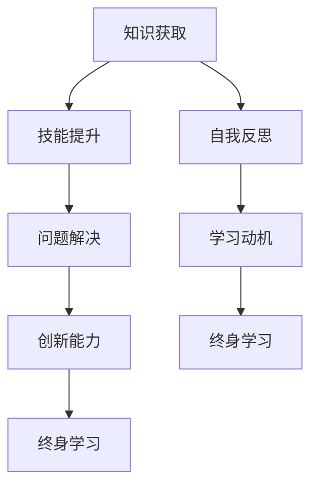

                 

### 引言与核心概念

#### 背景介绍

在信息爆炸和科技迅速发展的时代，终身学习已成为个体生存和发展的必备技能。传统的教育模式已经无法满足快速变化的社会需求，知识的更新速度远超过去，人们需要不断地学习新知识、新技能，以适应不断变化的环境。本文旨在探讨终身学习的核心概念、理论基础和实践策略，帮助读者理解和掌握终身学习的重要性，以及如何在实践中有效地应用这一理念。

#### 核心概念与联系

终身学习，即“Learning for a Lifetime”，是指个人在其整个生命中持续地获取知识、技能和态度的过程。它不仅包括学校教育，还涵盖职业培训、自学、社会实践等多种形式。终身学习强调的是个体主动学习、自我驱动和持续成长的意识。

为了更好地理解终身学习的核心概念，我们可以通过Mermaid流程图来展示其基本架构：

**核心概念原理讲解：**

1. **知识获取**：个体通过阅读、听讲、实践等方式获取新知识。
2. **技能提升**：个体将新知识应用到实践中，从而提升自身技能。
3. **问题解决**：通过运用所学知识解决实际问题，进一步提升问题解决能力。
4. **创新能力**：在解决复杂问题的过程中，个体能够产生新的思路和方法，形成创新能力。
5. **自我反思**：个体在学习和实践中不断反思，总结经验教训，优化学习过程。
6. **学习动机**：自我反思和学习成效会激发个体继续学习的动机。

#### 数学模型

为了更直观地展示终身学习的效应，我们可以使用以下数学模型：

$$
\text{终身学习效果} = f(\text{知识获取}, \text{技能提升}, \text{问题解决}, \text{创新能力}, \text{自我反思}, \text{学习动机})
$$

其中，每个要素都对终身学习效果产生重要影响。通过不断优化这些要素，可以最大化终身学习的效果。

#### 举例说明

以一名软件开发工程师为例，他通过参加在线课程、阅读专业书籍、参与开源项目等多种途径不断学习新知识、新技能。在解决实际项目问题的过程中，他不断反思和总结，提出新的解决方案，从而提升自身创新能力。这种持续的学习和自我提升过程，正是终身学习的具体体现。

通过以上分析，我们可以看到终身学习不仅仅是获取知识，更是一个包含知识获取、技能提升、问题解决、创新能力、自我反思和学习动机等多方面综合作用的复杂过程。接下来，本文将深入探讨终身学习的理论基础和实践策略，帮助读者更好地应对快速变化的环境。

