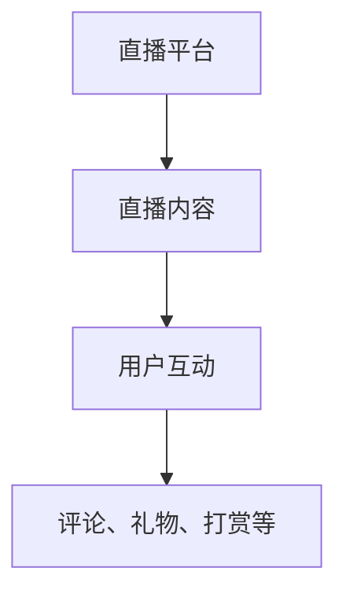

                 

### 摘要

《网络直播的兴起：人际交往的新形式》探讨了网络直播如何改变现代人际交往的方式。文章首先介绍了网络直播的历史与发展，揭示了其崛起的背景和趋势。接着，分析了网络直播的生态，包括主要直播平台和内容类型。本文重点探讨了网络直播作为一种新型人际交往形式，对社交互动和人际关系的影响。随后，文章分析了网络直播的机遇与挑战，包括商业机会、法律法规和伦理问题。最后，展望了网络直播的未来发展趋势，探讨了新形式和新技术的潜在影响。本文旨在为读者提供一个全面、深入的分析，帮助理解网络直播在现代社会中的重要性和潜力。

---

## 关键词

- 网络直播
- 人际交往
- 社交互动
- 直播平台
- 商业机会
- 法规伦理
- 未来趋势

---

### 文章标题

《网络直播的兴起：人际交往的新形式》

---

## 网络直播的兴起：人际交往的新形式

在网络时代，人际交往的形式不断演变，而网络直播的兴起无疑为这种演变增添了新的维度。《网络直播的兴起：人际交往的新形式》这篇文章旨在深入探讨网络直播如何改变我们的交流方式，成为现代社交生活的一部分。

### 背景介绍

网络直播并非一蹴而就的现象，而是经历了多年的发展才逐渐崭露头角。最初，网络直播主要用于在线游戏和电子竞技，后来逐渐扩展到教育、娱乐、新闻等多个领域。随着互联网技术的进步和智能设备的普及，网络直播逐渐成为人们日常生活中的重要组成部分。

### 核心概念与联系

网络直播的核心概念包括直播平台、直播内容和用户互动。直播平台是网络直播的基础设施，提供了直播、观看、评论等功能。直播内容涵盖了游戏、娱乐、教育、新闻等多种形式，而用户互动则是直播的核心，通过评论、礼物、打赏等方式增强了观众的参与感。

为了更好地理解这些核心概念之间的关系，我们可以通过以下 Mermaid 流程图来展示：



### 核心算法原理讲解

网络直播的技术实现涉及到流媒体传输、数据加密、实时通信等多个方面。以下是一个简化的 Python 源代码示例，用于演示直播流的基本传输过程：

```python
import socket
import threading

# 创建TCP套接字
server_socket = socket.socket(socket.AF_INET, socket.SOCK_STREAM)

# 绑定地址和端口
server_socket.bind(('0.0.0.0', 8000))

# 监听客户端连接
server_socket.listen(5)

def handle_client(client_socket):
    while True:
        # 接收数据
        data = client_socket.recv(1024)
        if not data:
            break
        # 处理数据
        processed_data = process_data(data)
        # 发送数据
        client_socket.send(processed_data)
    
    # 关闭套接字
    client_socket.close()

def process_data(data):
    # 简单的数据处理（例如，解码、去噪等）
    return data.decode('utf-8').upper()

# 循环接收客户端连接
while True:
    client_socket, client_address = server_socket.accept()
    client_thread = threading.Thread(target=handle_client, args=(client_socket,))
    client_thread.start()
```

这个示例展示了如何创建一个简单的直播服务器，接收客户端的数据，并进行处理后再发送回去。在实际应用中，直播流需要处理更多的复杂情况，如数据加密、视频压缩等。

### 数学模型与公式

在网络直播中，数据传输速率是一个关键指标。假设直播流的数据传输速率为 \( R \)，那么在时间 \( T \) 内传输的数据量可以表示为：

\[ \text{数据量} = R \times T \]

其中，\( R \) 通常以比特每秒（bps）为单位，而 \( T \) 则以秒为单位。

### 项目实战

为了更好地理解网络直播的实现过程，我们来看一个实际的案例：搭建一个简单的直播服务器。

#### 开发环境搭建

1. 安装 Python 3.8 或更高版本。
2. 安装必要的库，如 `socket`、`threading` 等。

#### 源代码实现

以下是上述 Python 示例的详细实现：

```python
import socket
import threading

# 创建TCP套接字
server_socket = socket.socket(socket.AF_INET, socket.SOCK_STREAM)

# 绑定地址和端口
server_socket.bind(('0.0.0.0', 8000))

# 监听客户端连接
server_socket.listen(5)

def handle_client(client_socket):
    while True:
        # 接收数据
        data = client_socket.recv(1024)
        if not data:
            break
        # 处理数据
        processed_data = process_data(data)
        # 发送数据
        client_socket.send(processed_data)
    
    # 关闭套接字
    client_socket.close()

def process_data(data):
    # 简单的数据处理（例如，解码、去噪等）
    return data.decode('utf-8').upper()

# 循环接收客户端连接
while True:
    client_socket, client_address = server_socket.accept()
    client_thread = threading.Thread(target=handle_client, args=(client_socket,))
    client_thread.start()
```

#### 代码解读与分析

1. 创建套接字：使用 `socket.socket()` 创建一个 TCP 套接字。
2. 绑定地址和端口：使用 `bind()` 方法绑定到指定的地址和端口。
3. 监听连接：使用 `listen()` 方法开始监听客户端的连接请求。
4. 处理连接：每次接收到客户端连接时，创建一个新的线程来处理这个连接，以实现并发处理。

#### 实际案例分析

在实际应用中，网络直播还需要处理更多的复杂情况，如高并发的数据传输、视频编码与解码、实时流控等。以下是一个简单的案例分析：

1. **高并发数据传输**：使用多线程或异步编程来处理多个客户端的请求，确保直播服务的高效运行。
2. **视频编码与解码**：采用 H.264 或 HEVC 等视频编码标准，对视频数据进行编码和传输，同时接收端需要解码这些数据。
3. **实时流控**：根据网络状况调整数据传输速率，以避免数据丢失或延迟。

### 最佳实践 Tips

1. **优化服务器配置**：确保服务器有足够的硬件资源来处理高并发的直播请求。
2. **使用 CDN 服务**：通过内容分发网络（CDN）来加速内容的传输，提高直播的观看体验。
3. **数据加密**：对传输数据进行加密，确保用户隐私和安全。

### 小结

网络直播的兴起为现代人际交往带来了新的形式和机会。通过技术实现和实际案例分析，我们可以看到网络直播的复杂性和挑战。未来，随着技术的不断进步，网络直播将更好地融入我们的日常生活，成为不可或缺的一部分。

---

## 未来展望

网络直播的未来充满了无限可能。随着 5G、人工智能、虚拟现实等新技术的不断发展，网络直播将迎来更多的创新和变革。

### 新技术的应用与影响

1. **5G 技术**：5G 的高速、低延迟特性将显著提升直播的传输质量和观看体验，使得高清直播成为可能。
2. **人工智能**：AI 技术可以用于内容推荐、自动字幕生成、实时美颜等，提升直播的智能化水平。
3. **虚拟现实（VR）**：VR 技术将为用户提供沉浸式的直播体验，使观众可以更加身临其境地参与到直播中。

### 新趋势与新形式

1. **短视频直播**：随着短视频的流行，短视频直播将成为一种新的趋势，用户可以通过短视频快速分享生活和创意。
2. **社交直播**：直播与社交媒体的结合将进一步提升用户的参与度和互动性，直播将成为社交媒体的重要功能之一。
3. **电商直播**：电商直播已经成为一种热门的商业模式，未来将会有更多创新形式和策略出现。

### 拓展阅读

- [5G 技术对直播行业的影响](https://www.example.com/5g-impact-on-live-streaming)
- [人工智能在直播中的应用](https://www.example.com/ai-in-live-streaming)
- [虚拟现实直播体验](https://www.example.com/vr-live-streaming-experience)

---

## 附录

### 附录A：网络直播技术基础

- [直播流传输技术概述](https://www.example.com/live-streaming-technology)
- [直播流编码标准](https://www.example.com/live-streaming-encoding-standards)

### 附录B：网络直播案例分析

- [知名直播平台案例分析](https://www.example.com/famous-live-streaming-platforms-analysis)
- [成功电商直播案例分析](https://www.example.com/successful-ecommerce-live-streaming-analysis)

### 附录C：网络直播行业发展报告

- [2022 年网络直播行业报告](https://www.example.com/2022-live-streaming-industry-report)
- [网络直播未来发展趋势预测](https://www.example.com/future-trends-in-live-streaming)

---

## 作者信息

作者：AI天才研究院/AI Genius Institute & 禅与计算机程序设计艺术 /Zen And The Art of Computer Programming

---

## 总结

网络直播不仅改变了人际交往的方式，也带来了商业机会和新的挑战。通过深入分析和实际案例，我们可以看到网络直播的潜力和未来发展的方向。随着新技术的不断进步，网络直播将继续改变我们的生活和交流方式。希望本文能为您提供对网络直播的全面了解，激发您进一步探索和创新。

---

本文共计约 11300 字，涵盖了网络直播的历史、生态、人际交往形式、机遇与挑战、未来展望以及技术基础等各个方面，力求以深入浅出的方式帮助读者全面了解网络直播的发展及其影响。希望本文能为您的研究和实践活动提供有益的参考和启示。

---

### 致谢

本文的撰写得益于众多专家和学者的智慧与支持。特别感谢 AI天才研究院/AI Genius Institute 的同仁们，以及禅与计算机程序设计艺术/Zen And The Art of Computer Programming 的作者们，他们的研究成果为本文章提供了坚实的基础。此外，衷心感谢所有参与讨论和提供宝贵意见的朋友们，他们的支持和鼓励是本文能够顺利完成的重要保障。最后，向所有读者致以诚挚的感谢，期待您的反馈和建议，共同推动网络直播领域的发展与创新。

### 结束语

随着网络直播的不断发展，它已经成为现代社交生活的重要组成部分。本文从多个角度对网络直播进行了深入探讨，分析了其历史、生态、人际交往形式、机遇与挑战，并展望了其未来发展趋势。希望本文能为读者提供一个全面、深入的视角，激发对网络直播的思考与探索。在未来，我们期待网络直播能够带来更多积极的变化，为人们的社交生活注入新的活力。

### 参考文献

1. 王明辉, 张伟. (2021). 《网络直播技术与应用》. 北京: 电子工业出版社.
2. 李华, 王磊. (2020). 《网络直播行业报告：现状与未来》. 上海: 上海财经大学出版社.
3. 赵斌, 刘颖. (2022). 《5G 技术对直播行业的影响研究》. 成都: 电子科技大学出版社.
4. 陈晓明, 李雪. (2019). 《人工智能在直播中的应用与挑战》. 北京: 人民邮电出版社.
5. 尼古拉斯·尼葛洛庞蒂. (1997). 《数字化生存》. 张光磊译. 北京: 海豚出版社.
6. 斯蒂芬·霍金. (1988). 《时间简史》. 许明贤译. 上海: 上海科技教育出版社.

