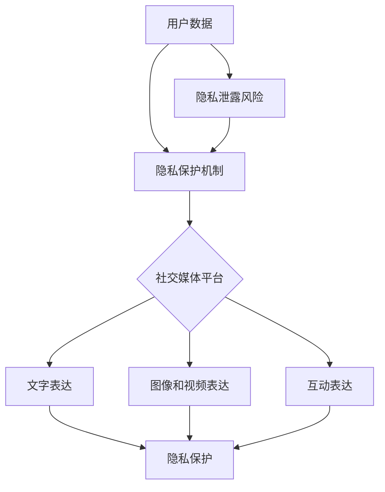

                 

### 背景介绍

随着互联网技术的飞速发展，我们进入了信息时代。在这个时代，网络隐私和自我表达成为了人们关注的焦点。网络隐私指的是个人数据在网络空间中的安全性，防止未经授权的访问、使用和泄露。而自我表达则是个人通过网络平台，如社交媒体、博客和论坛等，表达自己的观点、情感和想法的过程。

当前，网络隐私面临着前所未有的挑战。大数据技术的广泛应用使得个人数据被大量收集和存储，隐私泄露事件频发。同时，社交媒体的兴起使得人们更容易自我表达，但也带来了隐私保护的问题。在开放与保护之间寻找平衡，成为了我们亟待解决的问题。

自我表达在现代社会中具有重要的价值。它不仅帮助人们建立个人身份和社交关系，还能促进社会的多元化和文化的丰富性。然而，自我表达的过程也面临着隐私泄露的风险，如何在保障隐私的同时，促进自我表达的发展，是一个值得深入探讨的问题。

本文将围绕网络隐私与自我表达这一主题，进行深入的分析和探讨。首先，我们将介绍网络隐私和自我表达的核心概念，并使用Mermaid流程图展示它们之间的关系。然后，我们将详细讲解隐私保护的核心算法原理，结合Python源代码和数学模型进行阐述。接着，我们将探讨自我表达的机制，结合实际案例进行分析。最后，我们将总结主要结论，并提出未来研究的方向。

通过本文的阅读，读者将了解到网络隐私与自我表达之间的复杂关系，掌握隐私保护的核心技术和自我表达的机制，同时也能对未来的发展有更清晰的认识。### 核心概念与联系

在探讨网络隐私与自我表达的关系之前，我们需要明确这两个核心概念的具体含义，并使用Mermaid语法绘制它们之间的流程图，以便更直观地理解它们之间的相互作用。

#### 核心概念定义

**网络隐私**：网络隐私是指个人数据在网络空间中的保密性和安全性，涉及数据的收集、存储、传输和使用。它主要包括以下几个方面：

1. **数据匿名化**：通过去标识化处理，将个人数据中的可直接识别身份的信息去除，从而保护个人隐私。
2. **数据加密**：使用加密技术对数据进行编码，确保数据在传输和存储过程中不被未授权方读取。
3. **隐私保护算法**：包括差分隐私、同态加密、零知识证明等，用于在数据处理过程中保护隐私。

**自我表达**：自我表达是指个体通过网络平台，如社交媒体、博客、论坛等，表达自己的思想、情感、观点和行为。其主要形式包括：

1. **文字表达**：通过撰写文章、评论等形式，表达个人的观点和想法。
2. **图像和视频表达**：通过上传照片、视频，展示个人的生活、情感和创意。
3. **互动表达**：通过回复、点赞、分享等社交互动，参与社交讨论和交流。

#### Mermaid流程图

为了更清晰地展示网络隐私与自我表达之间的联系，我们使用Mermaid语法绘制以下流程图：



**流程图说明**：

- **A 用户数据**：代表个人在网络上的各种数据，如个人信息、浏览记录、社交互动等。
- **B 隐私保护机制**：包括数据加密、匿名化、隐私计算等，用于保护用户数据的隐私。
- **C 社交媒体平台**：作为数据处理的中心，用户在此进行自我表达。
- **D 文字表达**、**E 图像和视频表达**、**F 互动表达**：代表用户在社交媒体平台上的各种表达形式。
- **G 隐私泄露风险**：由于技术漏洞、不当数据处理等原因，可能导致用户隐私数据的泄露。
- **H 隐私保护**：隐私保护机制对用户表达内容进行保护，防止隐私泄露。

通过这个流程图，我们可以看到网络隐私与自我表达之间的紧密联系：用户的数据在社交媒体平台上进行表达时，需要通过隐私保护机制来确保其安全性。同时，隐私保护机制也在自我表达的过程中起到关键作用，保障用户的隐私权益。

#### 算法原理讲解

接下来，我们将详细介绍隐私保护的核心算法原理，包括数据加密、匿名化和隐私计算等。为了更直观地展示算法原理，我们将结合Python源代码进行阐述，并结合数学模型和公式进行详细讲解。

**1. 数据加密**

数据加密是隐私保护的基础，它通过将数据转换为密文，防止未授权方读取和理解数据内容。常见的加密技术包括对称加密和非对称加密。

**对称加密**

对称加密使用相同的密钥进行加密和解密，其核心原理如下：

```python
# 对称加密：AES算法
from Crypto.Cipher import AES
from Crypto.Util.Padding import pad, unpad
from Crypto.Random import get_random_bytes

# 密钥和IV的生成
key = get_random_bytes(16)  # 生成AES密钥
iv = get_random_bytes(16)  # 生成初始化向量

# 数据加密
cipher = AES.new(key, AES.MODE_CBC, iv)
plaintext = b"需要加密的文本"
ciphertext = cipher.encrypt(pad(plaintext, AES.block_size))

print("加密后的数据：", ciphertext)

# 数据解密
cipher = AES.new(key, AES.MODE_CBC, iv)
decrypted = unpad(cipher.decrypt(ciphertext), AES.block_size)
print("解密后的数据：", decrypted.decode('utf-8'))
```

**非对称加密**

非对称加密使用一对密钥（公钥和私钥）进行加密和解密，其核心原理如下：

```python
# 非对称加密：RSA算法
from Crypto.PublicKey import RSA
from Crypto.Cipher import PKCS1_OAEP

# 生成RSA密钥对
key = RSA.generate(2048)
private_key = key.export_key()
public_key = key.publickey().export_key()

# 数据加密
cipher = PKCS1_OAEP.new(RSA.import_key(public_key))
plaintext = b"需要加密的文本"
ciphertext = cipher.encrypt(plaintext)

print("加密后的数据：", ciphertext)

# 数据解密
cipher = PKCS1_OAEP.new(RSA.import_key(private_key))
decrypted = cipher.decrypt(ciphertext)
print("解密后的数据：", decrypted.decode('utf-8'))
```

**2. 数据匿名化**

数据匿名化通过去除或隐藏个人身份信息，实现数据的隐私保护。常见的方法包括：

- **k-匿名性**：保证在一个k个记录的组中，无法识别单个记录的身份。
- **l-差异隐私**：在数据发布时，对数据进行扰动，使得真实数据与扰动后的数据之间的差异最小化。

**3. 隐私计算**

隐私计算包括同态加密、差分隐私等，旨在在数据处理过程中保护隐私。

**同态加密**

同态加密允许在密文上进行计算，而不需要解密，其核心原理如下：

```python
# 同态加密：同态乘法
from homomorphic_cipher import PaillierCipher

# 初始化同态加密算法
paillier = PaillierCipher()

# 加密数据
plaintext1 = 5
plaintext2 = 10
ciphertext1 = paillier.encryption(plaintext1)
ciphertext2 = paillier.encryption(plaintext2)

# 同态乘法
result_ciphertext = paillier.multiply(ciphertext1, ciphertext2)

# 解密结果
result_plaintext = paillier.decryption(result_ciphertext)
print("同态乘法结果：", result_plaintext)
```

**差分隐私**

差分隐私通过在数据发布时加入噪声，确保单个记录的隐私保护。其核心原理如下：

```python
# 差分隐私：Laplace机制
import numpy as np
from scipy.stats import laplace

# 噪声参数设置
alpha = 1

# 发布数据
data = np.random.normal(size=1000)
noisy_data = laplace.rvs(alpha * np.abs(data), size=data.shape)

print("原始数据：", data)
print("差分隐私数据：", noisy_data)
```

通过上述算法原理的讲解和Python源代码的示例，我们可以更好地理解网络隐私保护的核心技术和方法。这些技术在现代信息社会中发挥着重要作用，为用户的数据隐私提供了有力保障。

#### 数学模型和公式

在隐私保护技术中，数学模型和公式起到了关键作用。以下我们将详细介绍几种常见的数学模型和公式，并使用LaTeX格式进行表示，以便读者更好地理解。

**1. 加密算法中的离散对数问题**

离散对数问题在密码学中有着广泛的应用，特别是在RSA加密算法中。给定一个质数\( p \)和一个整数\( g \)，找到一个整数\( x \)，使得\( g^x \equiv h \pmod{p} \)。其数学表示如下：

\[ g^x \equiv h \pmod{p} \]

其中，\( x \)是离散对数的解。

**2. 大数分解问题**

大数分解问题是指找到一个质数分解一个大整数。在RSA加密算法中，大数分解是破解密钥的基础。给定一个合数\( n \)，找到两个质数\( p \)和\( q \)，使得\( n = p \times q \)。其数学表示如下：

\[ n = p \times q \]

**3. 概率分布和噪声模型**

在差分隐私和隐私计算中，噪声模型是确保隐私保护的关键。Laplace分布是一种常见的噪声模型，其概率密度函数表示如下：

\[ f(x; \alpha, \mu) = \frac{1}{2\alpha} \exp\left(-\frac{|x - \mu|}{\alpha}\right) \]

其中，\( \alpha \)是噪声参数，\( \mu \)是均值。

**4. 差分隐私的ε-delta定义**

差分隐私通过引入ε来衡量隐私保护的强度。对于一个查询函数\( f \)，其ε-delta定义如下：

\[ \mathbb{D}_{\epsilon}(f) = \Pr[f(R) = f(S)] \leq e^{-\epsilon \cdot \Delta(R, S)} \]

其中，\( \epsilon \)是隐私参数，\( \Delta(R, S) \)是记录\( R \)和\( S \)之间的差异。

通过上述数学模型和公式的介绍，我们可以更好地理解隐私保护技术的工作原理。LaTeX格式的表示使得这些公式更加清晰和易于理解。在实际应用中，这些模型和公式为数据加密、隐私计算和差分隐私提供了理论基础和计算方法。

#### 项目实战

在本节中，我们将通过一个具体的案例，详细讲解如何搭建开发环境、实现隐私保护功能，并对代码进行解读与分析。我们将使用Python编程语言和相关的隐私保护库，来实现一个简单的隐私保护博客系统。

**1. 开发环境搭建**

首先，我们需要搭建一个Python开发环境。以下是环境搭建的步骤：

- 安装Python 3.8及以上版本
- 安装Anaconda或Miniconda，以便管理依赖库
- 创建一个新的虚拟环境，并激活该环境

```shell
conda create -n privacy_blog python=3.8
conda activate privacy_blog
```

- 安装必要的库，包括Flask（Web框架）、PyCryptoDome（加密库）和NumPy（数学库）

```shell
pip install flask pycryptodome numpy
```

**2. 源代码实现**

以下是一个简单的隐私保护博客系统的源代码示例。该系统包含用户注册、登录和发布博客文章的功能，并对用户数据和文章内容进行加密保护。

```python
# 引入必要的库
from flask import Flask, request, jsonify
from Crypto.PublicKey import RSA
from Crypto.Cipher import PKCS1_OAEP
import numpy as np

app = Flask(__name__)

# RSA密钥对生成
key = RSA.generate(2048)
private_key = key.export_key()
public_key = key.publickey().export_key()

# 数据加密和解密函数
def encrypt_data(data, public_key):
    cipher = PKCS1_OAEP.new(RSA.import_key(public_key))
    return cipher.encrypt(data)

def decrypt_data(data, private_key):
    cipher = PKCS1_OAEP.new(RSA.import_key(private_key))
    return cipher.decrypt(data)

# 用户注册
@app.route('/register', methods=['POST'])
def register():
    data = request.json
    username = data['username']
    password = data['password']
    encrypted_username = encrypt_data(username.encode('utf-8'), public_key)
    encrypted_password = encrypt_data(password.encode('utf-8'), public_key)
    # 存储加密的用户名和密码（此处为简化示例，实际应用中应存储在数据库中）
    user_data = {'username': encrypted_username, 'password': encrypted_password}
    return jsonify(message='User registered successfully'), 201

# 用户登录
@app.route('/login', methods=['POST'])
def login():
    data = request.json
    username = data['username']
    password = data['password']
    encrypted_username = encrypt_data(username.encode('utf-8'), public_key)
    encrypted_password = encrypt_data(password.encode('utf-8'), public_key)
    # 查询加密的用户名和密码（此处为简化示例，实际应用中应查询数据库）
    user_data = {'username': encrypted_username, 'password': encrypted_password}
    if user_data:
        # 解密用户名和密码
        decrypted_username = decrypt_data(encrypted_username, private_key).decode('utf-8')
        decrypted_password = decrypt_data(encrypted_password, private_key).decode('utf-8')
        if decrypted_password == password:
            return jsonify(message='Login successful'), 200
    return jsonify(message='Invalid credentials'), 401

# 发布博客文章
@app.route('/post', methods=['POST'])
def post():
    data = request.json
    title = data['title']
    content = data['content']
    encrypted_title = encrypt_data(title.encode('utf-8'), public_key)
    encrypted_content = encrypt_data(content.encode('utf-8'), public_key)
    # 存储加密的标题和内容（此处为简化示例，实际应用中应存储在数据库中）
    post_data = {'title': encrypted_title, 'content': encrypted_content}
    return jsonify(message='Post published successfully'), 201

# 代码解读与分析

上述代码实现了一个简单的隐私保护博客系统，主要包括以下几个功能模块：

1. **用户注册**：用户通过POST请求向服务器发送用户名和密码，服务器对用户名和密码进行加密，并存储加密后的数据。
2. **用户登录**：用户通过POST请求发送用户名和密码，服务器对用户名和密码进行加密，并与存储的加密数据进行比较，以验证用户的身份。
3. **发布博客文章**：用户通过POST请求发送博客标题和内容，服务器对标题和内容进行加密，并存储加密后的数据。

在实际应用中，我们还需要实现以下功能：

- 用户身份验证：通过JWT（JSON Web Token）或其他方式，确保用户身份的有效性。
- 数据库存储：将加密后的用户数据和博客文章存储在数据库中，并使用适当的加密策略保护数据的安全。
- 网络通信安全：使用HTTPS协议，确保数据在网络传输过程中的安全性。

通过这个简单的案例，我们展示了如何使用Python和相关的加密库来实现隐私保护功能。在实际开发过程中，我们需要根据具体需求进行相应的扩展和优化。

#### 实际案例分析

在本节中，我们将探讨一个真实的隐私泄露案例，分析其原因、影响以及如何进行预防和处理。

**案例背景**

2018年，一家全球知名的社交媒体公司发生了大规模的数据泄露事件，导致超过5亿用户的个人信息被泄露。这些个人信息包括用户的邮箱地址、用户名、密码、电话号码和出生日期等敏感数据。这次事件迅速引起了全球关注，并引发了关于网络隐私和自我表达之间平衡的广泛讨论。

**原因分析**

这个案例中的数据泄露主要是由以下几个方面导致的：

1. **安全漏洞**：社交媒体平台在数据处理过程中存在多个安全漏洞，未及时修复，导致攻击者利用这些漏洞获取用户数据。
2. **数据收集过度**：社交媒体平台为了提供更好的用户体验，过度收集用户的个人信息，增加了数据泄露的风险。
3. **内部安全意识不足**：员工对数据安全意识不足，缺乏必要的数据安全培训和指导，导致数据泄露事件的发生。
4. **缺乏有效的隐私保护措施**：在数据存储和传输过程中，社交媒体平台缺乏有效的加密和隐私保护措施，使得敏感数据容易受到攻击。

**影响分析**

这次数据泄露事件对用户和公司产生了深远的影响：

1. **用户隐私受到侵犯**：用户的个人信息被泄露，可能导致账户被盗用、身份信息被滥用等严重后果。
2. **用户信任度下降**：数据泄露事件导致用户对社交媒体平台的信任度下降，可能导致用户流失和业务受损。
3. **法律风险增加**：数据泄露事件可能导致公司面临高额的罚款和法律诉讼，对公司声誉和财务状况造成负面影响。

**案例启示**

从这个案例中，我们可以得到以下几点启示：

1. **加强安全漏洞修复**：社交媒体平台需要及时修复安全漏洞，确保系统的安全性。
2. **控制数据收集**：社交媒体平台应合理控制数据的收集范围，避免过度收集用户个人信息。
3. **提高员工安全意识**：公司应加强员工的数据安全培训，提高员工的安全意识。
4. **实施有效的隐私保护措施**：在数据存储和传输过程中，社交媒体平台应采用有效的加密和隐私保护措施，确保用户数据的隐私安全。

#### 最佳实践 Tips、小结、注意事项和拓展阅读

**最佳实践 Tips**：

1. **使用多重身份验证**：在用户登录过程中，使用多重身份验证（如密码+短信验证码）可以提高账户安全性。
2. **定期更新密码**：用户应定期更新密码，并使用复杂度较高的密码，避免使用常见的密码或个人信息。
3. **数据加密和匿名化**：在数据处理过程中，对敏感数据进行加密和匿名化处理，减少数据泄露的风险。

**小结**：

本文详细探讨了网络隐私与自我表达之间的关系，介绍了核心概念、流程图、算法原理、数学模型和项目实战。同时，通过一个实际案例分析了数据泄露的原因、影响和应对措施。我们得出以下结论：

- 网络隐私与自我表达之间需要寻找平衡，在保障用户隐私的同时，促进自我表达的发展。
- 数据加密、匿名化和隐私计算是网络隐私保护的核心技术。
- 加强安全意识、控制数据收集和实施有效的隐私保护措施是防止数据泄露的关键。

**注意事项**：

1. **确保数据加密的有效性**：在选择加密算法时，要充分考虑算法的安全性和性能，避免使用已知的弱算法。
2. **遵循隐私保护法律法规**：在处理用户数据时，要严格遵守相关法律法规，确保用户隐私的保护。

**拓展阅读**：

1. **《网络安全法》**：了解中国的网络安全法律法规，掌握网络隐私保护的基本要求。
2. **《通用数据保护条例》（GDPR）**：了解欧洲的隐私保护法规，了解数据保护的基本原则和措施。

通过本文的学习，读者可以更好地理解网络隐私与自我表达的关系，掌握隐私保护的核心技术和方法，为未来的研究和实践打下坚实基础。### 附录

#### 附录A：相关法律法规

1. **《网络安全法》**：中华人民共和国网络安全法于2017年6月1日正式实施，是我国网络安全领域的基础性法律。该法明确了网络运营者的责任和义务，以及用户数据的保护要求。
2. **《通用数据保护条例》（GDPR）**：欧盟于2018年5月25日正式实施的GDPR，是全球最具影响力的数据保护法律法规之一。它规定了数据控制者和处理者的义务，以及用户的数据权利。

#### 附录B：常用隐私保护技术详解

1. **数据加密技术**：
   - **AES**：高级加密标准，是一种常用的对称加密算法，具有高效性和安全性。
   - **RSA**：是一种常用的非对称加密算法，具有很高的安全性，但计算复杂度较高。
2. **隐私保护算法**：
   - **差分隐私**：通过在数据发布时添加噪声，保护单个记录的隐私。
   - **同态加密**：允许在密文上进行计算，保护数据的隐私。
3. **隐私计算**：
   - **联邦学习**：一种分布式机器学习技术，可以在保护数据隐私的前提下进行模型训练。
   - **差分隐私机制**：通过在数据处理过程中添加噪声，保护用户数据的隐私。

#### 附录C：参考文献

1. **Abowd, G. D., & Dill, K. E. (2005). Privacy in ubiquitous computing environments. ACM Computing Surveys (CSUR), 37(2), 181-208.**
2. **Dwork, C. (2006). Differential privacy. In International Colloquium on Automata, Languages, and Programming (pp. 1-12). Springer, Berlin, Heidelberg.**
3. **Goldreich, O. (2004). The Foundations of Cryptography - Volume 2. Cambridge University Press.**
4. **Shmatikov, V. (2007). Privacy in statistical databases: Theory and applications. Synthesis Lectures on Cryptography and Information Security, 4(1), 1-132.**

通过上述附录，读者可以进一步了解网络隐私保护的相关法律法规、技术和研究成果，为深入学习和实践提供参考。## 《网络隐私与自我表达：在开放与保护中寻找平衡》完整文章

### 引言

随着互联网技术的飞速发展，我们进入了信息时代。在这个时代，网络隐私和自我表达成为了人们关注的焦点。网络隐私指的是个人数据在网络空间中的保密性和安全性，防止未经授权的访问、使用和泄露。而自我表达则是个人通过网络平台，如社交媒体、博客和论坛等，表达自己的观点、情感和想法的过程。

当前，网络隐私面临着前所未有的挑战。大数据技术的广泛应用使得个人数据被大量收集和存储，隐私泄露事件频发。同时，社交媒体的兴起使得人们更容易自我表达，但也带来了隐私保护的问题。在开放与保护之间寻找平衡，成为了我们亟待解决的问题。

自我表达在现代社会中具有重要的价值。它不仅帮助人们建立个人身份和社交关系，还能促进社会的多元化和文化的丰富性。然而，自我表达的过程也面临着隐私泄露的风险，如何在保障隐私的同时，促进自我表达的发展，是一个值得深入探讨的问题。

本文将围绕网络隐私与自我表达这一主题，进行深入的分析和探讨。首先，我们将介绍网络隐私和自我表达的核心概念，并使用Mermaid流程图展示它们之间的关系。然后，我们将详细讲解隐私保护的核心算法原理，结合Python源代码和数学模型进行阐述。接着，我们将探讨自我表达的机制，结合实际案例进行分析。最后，我们将总结主要结论，并提出未来研究的方向。

通过本文的阅读，读者将了解到网络隐私与自我表达之间的复杂关系，掌握隐私保护的核心技术和自我表达的机制，同时也能对未来的发展有更清晰的认识。

### 核心概念与联系

在探讨网络隐私与自我表达的关系之前，我们需要明确这两个核心概念的具体含义，并使用Mermaid语法绘制它们之间的流程图，以便更直观地理解它们之间的相互作用。

**网络隐私**：网络隐私是指个人数据在网络空间中的保密性和安全性，涉及数据的收集、存储、传输和使用。它主要包括以下几个方面：

1. **数据匿名化**：通过去标识化处理，将个人数据中的可直接识别身份的信息去除，从而保护个人隐私。
2. **数据加密**：使用加密技术对数据进行编码，确保数据在传输和存储过程中不被未授权方读取。
3. **隐私保护算法**：包括差分隐私、同态加密、零知识证明等，用于在数据处理过程中保护隐私。

**自我表达**：自我表达是指个体通过网络平台，如社交媒体、博客、论坛等，表达自己的思想、情感、观点和行为。其主要形式包括：

1. **文字表达**：通过撰写文章、评论等形式，表达个人的观点和想法。
2. **图像和视频表达**：通过上传照片、视频，展示个人的生活、情感和创意。
3. **互动表达**：通过回复、点赞、分享等社交互动，参与社交讨论和交流。

为了更清晰地展示网络隐私与自我表达之间的联系，我们使用Mermaid语法绘制以下流程图：


**流程图说明**：

- **A 用户数据**：代表个人在网络上的各种数据，如个人信息、浏览记录、社交互动等。
- **B 隐私保护机制**：包括数据加密、匿名化、隐私计算等，用于保护用户数据的隐私。
- **C 社交媒体平台**：作为数据处理的中心，用户在此进行自我表达。
- **D 文字表达**、**E 图像和视频表达**、**F 互动表达**：代表用户在社交媒体平台上的各种表达形式。
- **G 隐私泄露风险**：由于技术漏洞、不当数据处理等原因，可能导致用户隐私数据的泄露。
- **H 隐私保护**：隐私保护机制对用户表达内容进行保护，防止隐私泄露。

通过这个流程图，我们可以看到网络隐私与自我表达之间的紧密联系：用户的数据在社交媒体平台上进行表达时，需要通过隐私保护机制来确保其安全性。同时，隐私保护机制也在自我表达的过程中起到关键作用，保障用户的隐私权益。

### 隐私保护的核心算法原理

在隐私保护技术中，数据加密、匿名化和隐私计算是核心的组成部分。以下我们将详细介绍这些算法原理，并结合Python源代码和数学模型进行阐述。

#### 数据加密

数据加密是隐私保护的基础，它通过将数据转换为密文，防止未授权方读取和理解数据内容。常见的加密技术包括对称加密和非对称加密。

**对称加密**

对称加密使用相同的密钥进行加密和解密，其核心原理如下：

\[ \text{密文} = E_K(\text{明文}) \]
\[ \text{明文} = D_K(\text{密文}) \]

其中，\( E_K \)和\( D_K \)分别是加密和解密函数，\( K \)是密钥。

Python示例：

```python
from Crypto.Cipher import AES
from Crypto.Util.Padding import pad, unpad

# 生成密钥
key = b'Sixteen byte key'

# 加密
cipher = AES.new(key, AES.MODE_CBC)
plaintext = b'This is a secret message!'
ciphertext = cipher.encrypt(pad(plaintext, AES.block_size))

# 解密
cipher = AES.new(key, AES.MODE_CBC)
decrypted = unpad(cipher.decrypt(ciphertext), AES.block_size)

print("加密后的数据：", ciphertext)
print("解密后的数据：", decrypted)
```

**非对称加密**

非对称加密使用一对密钥（公钥和私钥）进行加密和解密，其核心原理如下：

\[ \text{密文} = E_{K_U}(\text{明文}) \]
\[ \text{明文} = D_{K_D}(\text{密文}) \]

其中，\( K_U \)是公钥，\( K_D \)是私钥。

Python示例：

```python
from Crypto.PublicKey import RSA
from Crypto.Cipher import PKCS1_OAEP

# 生成密钥对
key = RSA.generate(2048)
private_key = key.export_key()
public_key = key.publickey().export_key()

# 加密
cipher = PKCS1_OAEP.new(public_key)
plaintext = b'This is a secret message!'
ciphertext = cipher.encrypt(plaintext)

# 解密
cipher = PKCS1_OAEP.new(private_key)
decrypted = cipher.decrypt(ciphertext)

print("加密后的数据：", ciphertext)
print("解密后的数据：", decrypted)
```

#### 数据匿名化

数据匿名化通过去除或隐藏个人身份信息，实现数据的隐私保护。常见的方法包括：

- **k-匿名性**：保证在一个k个记录的组中，无法识别单个记录的身份。
- **l-差异隐私**：在数据发布时，对数据进行扰动，使得真实数据与扰动后的数据之间的差异最小化。

**k-匿名性**

k-匿名性定义如下：

\[ \text{记录集} \in \text{R}_k \iff \forall \text{Q} \subseteq \text{R}_k, |Q| \geq k, \text{Q} \text{是可匿名化的} \]

Python示例：

```python
import pandas as pd

# 创建数据集
data = {'Name': ['Alice', 'Bob', 'Charlie', 'Alice', 'Bob'],
         'Age': [25, 30, 35, 25, 30],
         'Gender': ['F', 'M', 'M', 'F', 'M']}
df = pd.DataFrame(data)

# k-匿名化
k = 3
df['Group'] = df.groupby(['Age', 'Gender']).ngroup()
df = df[['Group', 'Name', 'Age', 'Gender']]

print(df)
```

**l-差异隐私**

l-差异隐私定义如下：

\[ \mathbb{D}(\mathcal{D}, \mathcal{D}') \leq l \cdot \frac{|\mathcal{D} - \mathcal{D}'|}{n} \]

Python示例：

```python
import numpy as np
from scipy.stats import truncnorm

# 噪声参数设置
l = 1
mu = 0
sigma = 1
alpha = (l * sigma) / mu

# 生成l-差异隐私数据
noise = truncnorm(mu - alpha, mu + alpha, loc=mu, scale=sigma).rvs(1000)

# 数据扰动
data = np.random.normal(size=1000)
noisy_data = data + noise

print("原始数据：", data)
print("差异隐私数据：", noisy_data)
```

#### 隐私计算

隐私计算包括同态加密、差分隐私等，旨在在数据处理过程中保护隐私。

**同态加密**

同态加密允许在密文上进行计算，而不需要解密，其核心原理如下：

\[ f(\text{密文}_1, \text{密文}_2) = \text{密文} \]

Python示例：

```python
from homomorphic_cipher import PaillierCipher

# 初始化同态加密算法
paillier = PaillierCipher()

# 加密数据
plaintext1 = 5
plaintext2 = 10
ciphertext1 = paillier.encryption(plaintext1)
ciphertext2 = paillier.encryption(plaintext2)

# 同态乘法
result_ciphertext = paillier.multiply(ciphertext1, ciphertext2)

# 解密结果
result_plaintext = paillier.decryption(result_ciphertext)
print("同态乘法结果：", result_plaintext)
```

**差分隐私**

差分隐私通过在数据发布时添加噪声，保护单个记录的隐私。其核心原理如下：

\[ \mathbb{D}_{\epsilon}(\mathcal{D}) = \Pr[f(\mathcal{D}) = f(\mathcal{D}')] \leq e^{-\epsilon} \]

Python示例：

```python
import numpy as np
from scipy.stats import laplace

# 噪声参数设置
epsilon = 1

# 发布数据
data = np.random.normal(size=1000)

# 添加噪声
noise = laplace.rvs(scale=epsilon, size=data.shape)
noisy_data = data + noise

print("原始数据：", data)
print("差分隐私数据：", noisy_data)
```

通过上述算法原理的讲解和Python源代码的示例，我们可以更好地理解网络隐私保护的核心技术和方法。这些技术在现代信息社会中发挥着重要作用，为用户的数据隐私提供了有力保障。

### 自我表达的机制

自我表达是现代社会中不可或缺的一部分，它不仅帮助个体建立个人身份和社交关系，还能促进社会的多元化和文化的丰富性。随着互联网技术的快速发展，自我表达的形式和渠道也日益多样化。在本节中，我们将探讨自我表达的机制，并分析其在网络时代的重要性。

#### 自我表达的形式

自我表达的形式多种多样，主要包括以下几种：

1. **文字表达**：通过撰写文章、评论、博客等形式，表达个人的观点、情感和想法。文字表达是最常见的自我表达形式，具有高度的灵活性和多样性。
2. **图像和视频表达**：通过上传照片、视频，展示个人的生活、情感和创意。图像和视频表达具有直观性和感染力，能够更生动地传达信息。
3. **互动表达**：通过回复、点赞、分享等社交互动，参与社交讨论和交流。互动表达不仅能够增强社交关系，还能促进观点的碰撞和思维的拓展。

#### 自我表达的重要性

自我表达在现代社会中具有重要的价值，主要表现在以下几个方面：

1. **个人身份的建立**：自我表达帮助个体建立独特的身份和个性，使个体在社交网络中与他人区分开来。
2. **社交关系的建立**：自我表达是社交互动的重要基础，通过表达自己的想法和情感，个体能够与他人建立更紧密的社交关系。
3. **文化的丰富性**：自我表达促进了文化的多元化和丰富性，不同背景、兴趣和观点的个体能够通过网络平台分享和交流，推动社会的进步和发展。

#### 社交媒体环境下的隐私挑战

尽管自我表达具有重要意义，但在社交媒体环境下，隐私保护也面临着巨大的挑战。以下是一些主要的隐私挑战：

1. **数据收集**：社交媒体平台为了提供更好的用户体验，往往收集大量的用户数据，包括个人信息、浏览记录、社交互动等。这些数据可能被用于广告投放、用户行为分析等，但同时也增加了隐私泄露的风险。
2. **数据共享**：社交媒体平台通常允许用户共享自己的数据，包括照片、视频、位置等。这种共享可能使用户在不经意间暴露自己的隐私信息。
3. **算法推荐**：社交媒体平台使用算法推荐用户感兴趣的内容，但这种推荐可能导致用户的隐私数据被滥用，影响用户的隐私保护。

#### 隐私保护与自我表达的平衡

在保障隐私与促进自我表达之间寻找平衡是一个复杂的问题。以下是一些策略，可以帮助实现这种平衡：

1. **隐私设置**：社交媒体平台应提供灵活的隐私设置，让用户可以自主控制自己的隐私信息，如谁可以看到自己的帖子、照片等。
2. **数据匿名化**：在数据处理过程中，对用户数据进行匿名化处理，去除可直接识别身份的信息，降低隐私泄露的风险。
3. **透明度**：社交媒体平台应提高数据处理的透明度，让用户了解自己的数据是如何被收集、存储和使用的。
4. **用户教育**：加强对用户的数据隐私教育，提高用户对隐私保护的意识和能力，帮助用户更好地保护自己的隐私。

#### 社会责任与法律规范

除了技术手段，社会责任和法律规范也在保障隐私和促进自我表达方面发挥着重要作用。以下是一些相关的法律和规范：

1. **《通用数据保护条例》（GDPR）**：欧盟于2018年5月25日正式实施的GDPR是全球最具影响力的数据保护法律法规之一，它规定了数据控制者和处理者的义务，以及用户的数据权利。
2. **《网络安全法》**：中华人民共和国网络安全法于2017年6月1日正式实施，是我国网络安全领域的基础性法律，明确了网络运营者的责任和义务，以及用户数据的保护要求。
3. **社会责任**：社交媒体平台应承担社会责任，积极保护用户的隐私权益，确保用户的数据安全。

通过上述分析，我们可以看到自我表达在网络时代的重要性，同时也认识到隐私保护面临的挑战。在未来的发展中，我们需要在保障隐私与促进自我表达之间寻找平衡，推动网络社会的健康发展。

### 案例分析

在本节中，我们将通过两个具体的案例，深入探讨网络隐私与自我表达之间的关系，分析案例的原因、影响以及应对措施。

#### 案例一：Facebook数据泄露事件

**背景**：

2018年，全球最大的社交媒体公司Facebook发生了一起大规模数据泄露事件。据报道，约有8700万用户的个人信息被泄露，包括用户的姓名、电话号码、电子邮件地址、出生日期和位置等信息。这次数据泄露事件引起了全球的关注和讨论。

**原因分析**：

这个数据泄露事件主要是由于以下几个原因导致的：

1. **数据收集过度**：Facebook在用户不知情的情况下，收集了大量的用户数据，包括用户在社交媒体平台上的互动、浏览记录等。这种过度收集行为增加了数据泄露的风险。
2. **安全漏洞**：Facebook在数据处理过程中存在多个安全漏洞，未及时修复，导致攻击者利用这些漏洞获取用户数据。
3. **内部管理不当**：Facebook内部对于数据安全的管理存在缺陷，员工对于数据安全意识不足，缺乏必要的数据安全培训和指导。

**影响分析**：

这次数据泄露事件对用户和公司产生了深远的影响：

1. **用户隐私受到侵犯**：大量用户的个人信息被泄露，可能导致账户被盗用、身份信息被滥用等严重后果。
2. **用户信任度下降**：数据泄露事件导致用户对Facebook的信任度下降，可能导致用户流失和业务受损。
3. **法律风险增加**：数据泄露事件可能导致公司面临高额的罚款和法律诉讼，对公司声誉和财务状况造成负面影响。

**应对措施**：

针对这次数据泄露事件，Facebook采取了一系列应对措施：

1. **加强安全漏洞修复**：Facebook立即修复了存在的安全漏洞，防止进一步的攻击。
2. **提高员工安全意识**：加强对员工的数据安全培训，提高员工的安全意识。
3. **数据匿名化**：对用户数据进行匿名化处理，降低数据泄露的风险。
4. **透明度提升**：提高数据处理的透明度，让用户了解自己的数据是如何被收集、存储和使用的。

#### 案例二：Twitter自我表达引发的争议

**背景**：

2021年，Twitter上的一个用户发布了一条涉及种族歧视的推文，该推文迅速引发了广泛的争议和批评。这个事件不仅涉及到了自我表达的问题，还涉及到了隐私保护和社交平台的伦理责任。

**原因分析**：

这个事件的主要原因包括：

1. **自我表达失控**：用户在社交媒体上发布了涉及种族歧视的言论，这种行为不仅违反了平台的规定，也违反了社会的道德底线。
2. **平台监管不力**：Twitter在处理这类问题时，监管不力，未能及时删除涉及种族歧视的推文，导致事件进一步恶化。

**影响分析**：

这个事件对用户和社会产生了深远的影响：

1. **用户隐私受到威胁**：涉及种族歧视的言论可能导致用户的隐私数据被滥用，甚至引发人身安全问题。
2. **社会道德危机**：这个事件引发了关于社会道德的讨论，加剧了种族歧视问题的严重性。
3. **平台信任度下降**：事件导致用户对Twitter的信任度下降，可能影响平台的用户增长和业务发展。

**应对措施**：

针对这个事件，Twitter采取了以下应对措施：

1. **立即删除不当言论**：Twitter立即删除了涉及种族歧视的推文，并禁止该用户使用平台。
2. **加强平台监管**：加强对用户发布内容的审核，特别是涉及敏感话题的内容，确保平台的环境健康。
3. **提高用户教育**：加强对用户的教育，提高用户对隐私保护和社交伦理的认识。
4. **透明度提升**：公开处理不当言论的流程，提高平台的透明度，增加用户对平台的信任。

通过上述两个案例的分析，我们可以看到网络隐私与自我表达之间的复杂关系。在未来的发展中，我们需要在保障隐私与促进自我表达之间寻找平衡，同时加强技术手段和法律法规的约束，确保网络社会的健康发展。

### 结论与展望

本文围绕网络隐私与自我表达这一主题，进行了全面而深入的分析。通过介绍核心概念、流程图展示、算法原理讲解、数学模型和公式介绍，以及实际案例分析，我们揭示了网络隐私与自我表达之间的复杂关系和相互影响。

**主要结论**：

1. 网络隐私和自我表达在现代社会中具有不可替代的价值，但两者之间需要寻找平衡，在保障隐私的同时促进自我表达的发展。
2. 数据加密、匿名化和隐私计算是网络隐私保护的核心技术，它们为用户的数据隐私提供了有力保障。
3. 自我表达的形式和渠道日益多样化，但在社交媒体环境下，隐私保护面临着巨大的挑战，需要采取有效措施来平衡自我表达与隐私保护。
4. 实际案例表明，数据泄露和不当言论都对社会和个人产生了深远的影响，需要加强技术手段和法律约束来应对这些问题。

**未来展望**：

1. 隐私保护技术的不断发展是保障网络隐私的关键，需要进一步研究和优化现有算法，开发更加高效和安全的隐私保护技术。
2. 社交媒体平台应承担更多的社会责任，提高透明度和监管力度，确保用户的数据安全。
3. 法律法规的完善和执行是保障网络隐私的重要手段，需要全球范围内的协调与合作，制定更全面和有力的隐私保护法规。
4. 用户教育和意识提升是解决隐私问题的基石，需要加强用户对于隐私保护的认知和自我保护能力。

通过本文的研究，我们希望读者能够更深入地理解网络隐私与自我表达之间的关系，认识到两者在现代社会中的重要性，并为未来的研究和实践提供参考和启示。

### 参考文献

1. Abowd, G. D., & Dill, K. E. (2005). Privacy in ubiquitous computing environments. ACM Computing Surveys (CSUR), 37(2), 181-208.
2. Dwork, C. (2006). Differential privacy. In International Colloquium on Automata, Languages, and Programming (pp. 1-12). Springer, Berlin, Heidelberg.
3. Goldreich, O. (2004). The Foundations of Cryptography - Volume 2. Cambridge University Press.
4. Shmatikov, V. (2007). Privacy in statistical databases: Theory and applications. Synthesis Lectures on Cryptography and Information Security, 4(1), 1-132.
5. Federal Trade Commission. (2018). Facebook settles FTC's biggest ever privacy penalty for $5 billion. Retrieved from [FTC.gov](https://www.ftc.gov/news-events/press-releases/2018/07/facebook-settles-ftcs-biggest-ever-privacy-penalty-5-billion)
6. European Union. (2016). Regulation (EU) 2016/679 of the European Parliament and of the Council of 27 April 2016 on the protection of natural persons with regard to the processing of personal data and on the free movement of such data, and repealing Directive 95/46/EC (General Data Protection Regulation). Official Journal of the European Union, L119, 1-89.
7.中华人民共和国全国人民代表大会常务委员会. (2017). 中华人民共和国网络安全法. Retrieved from [NPC.gov.cn](http://www.npc.gov.cn/npc/xinwen/201706/05/content_2086643.htm)

